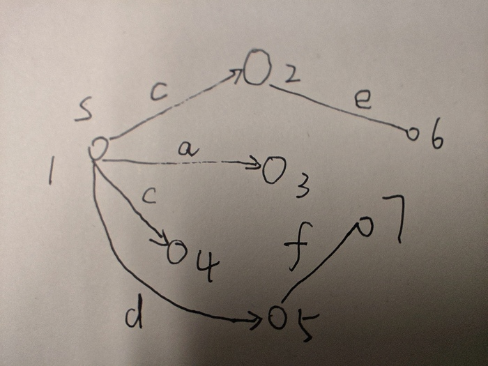
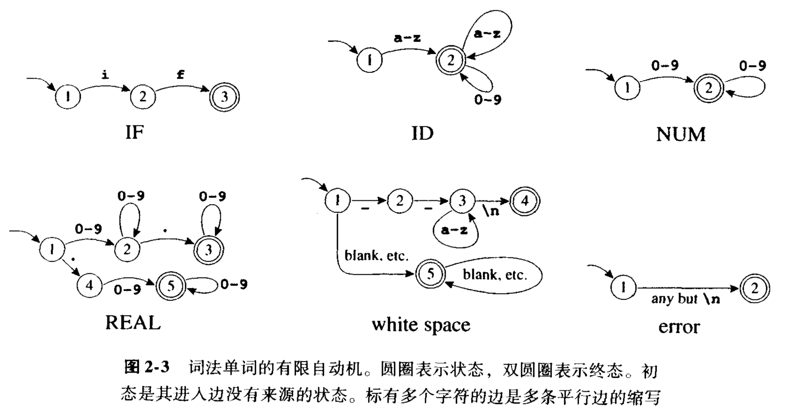

# compiler note

## cache

* compiler: 文件结束符

    文件结束符$\$$被规定出现在 expression $E$之后，通常记为$S \rightarrow E\$$。

    任意字符串都可以作为文件结束符吗，比如`EOF`，还是说只有一个特殊字符`\0`可以作为文件结束符？

    如果将任意字符串作为文件结束符，是否会引入冲突？后面学完整个文法分析，可以对这个问题做个尝试。

* question: 对于图 2-4，如果输入了两个`-`，即`--`，那么并不会在 10 处终止，但是根据最长匹配原则，又不能只匹配一个`-`就停下。该如何解释这个矛盾？

* $\mathbf{edge}(s, c)$ 的解释

	$s$是集合中的一个元素，或者说是状态机有向图中的一个节点。

	$c$是一条边对应的字母，或者条件。

	$\mathbf{edge}(s, c)$指的是从状态$s$沿着标有$c$的边可到达的所有 NFA 节点的集合。

	$\mathbf{edge}(s, c)$是**节点的集合**。

	example:

	<div style='text-align:center'>
	
	</div>

	在上图中，$\mathbf{edge}(1, c) = \{2, 4\}$

* $\mathbf{closure}(S)$的解释

	对于状态集合$S$，$\mathbf{closure}(S)$是满足如下条件的最小集合$T$：

	$T = S\cup\left( \bigcup\limits_{s \in T} \mathbf{edge}(s, \epsilon) \right)$

	其实这个表示的就是从$S$出发，能通过空字符串条件达到的所有状态。

	注意，这里对$T$的定义使用了递归。我们从$S$出发，经过$\epsilon$边，到达一些状态，再从这些状态出发，再经过$\epsilon$边，到达一些新的状态，这样不断迭代下去，直到算法停止。这个递归挺新颖的。

	使用伪代码描述上面的公式，就是

	$\begin{aligned}
	&T \leftarrow S \\
	&\mathbf{repeat}\ T' \leftarrow T \\
	&\hphantom{asdf} T \leftarrow T' \cup \left(\bigcup_{s \in T'} \mathbf{edge}(s, \epsilon) \right) \\
	&\mathbf{until}\ T = T'
	\end{aligned}$

* lex/flex hello world program

	`count_num.lex`:

	```lex
	%{
	int digit_count = 0;
	%}

	%%
	[0-9]+ {digit_count++;}
	. {}
	\n {return 0;}
	%%

	int yywrap(){}

	int main()
	{
		yylex();
		printf("total %d numbers.\n", digit_count);
		return 0;
	}
	```

	使用 lex/flex 程序处理：

	```bash
	flex count_num.lex
	```

	此时会生成一个`lex.yy.c`文件。

	然后再调用`gcc`编译器：

	```bash
	gcc lex.yy.c -o count_num
	```

	执行：

	```
	./count_num
	```

	此时会进入 stdin 模式等待输入。

	input:

	```
	123 345 hehe #@!
	```

	按 enter 键后，输出为

	```
	total 2 numbers.
	```

	flex tutorial: <https://www.geeksforgeeks.org/flex-fast-lexical-analyzer-generator/>

	flex project site: <https://github.com/westes/flex>

	unread:
	
	1. <https://begriffs.com/posts/2021-11-28-practical-parsing.html>

	2. <https://web.mit.edu/gnu/doc/html/flex_1.html>

* compiler 最长匹配

    在最长匹配时，需要保存三个状态位置，一个是本次匹配的起始位置，一个是上次的终态位置，还有一个是当前位置。

    如果下一个位置找不到有限状态机的出口边，那么就认为此次匹配结束，上次终态的位置为最终匹配结果，并以此更新起始位置。

    如果下一个位置找到了状态机对应的出口边，并且没有终态，那么继续往后找；如果找到了终态，那么更新上次终态的位置。

* 编译原理图 2-3

    <div style='text-align:center'>
    
    </div>

    REAL 那一个，为什么节点 4 不能直接连到节点 3？

    white space 没看懂，难道注释指的是`--hello,world`这样的形式吗？

    error 也没看懂，它的意思是说，如果有一个字符，只要这个字符不是`\n`，就说明错误的意思吗？

    ID 那个图，是否包含了 IF 的情况？

## 词法

### 正则表达式 regular expression

正则表达式定义了一个由字符串组成的集合。正则表达式可以使用有限的符号来定义无限元素的集合。

* 符号（symbol）

    symbol $\mathbf a$ 可以匹配任意包含$\mathbf a$的字符串。

* 可选（alternation）

    对于两个正则表达式$M$，$N$，$M | N$可以形成一个新的正则表达式。只要一个字符串包含$M$或$N$其中的一个，就可以匹配得上。

* 联结（concatenation）

    $M \cdot N$表示$M$后紧跟$N$。

* $\epsilon$（epsilon）

    表示空字符串。

* 重复（repetition）

    对于给定的正则表达式$M$，它的克林（Kleene）闭包是$M^*$。

    如果一个字符串是由$M$中的字符串经零至多次联结运算的结果，则该字符串属于$M^*$。

Examples:

* $a$

    表示`{"a"}`。

* $a\, |\, b$

    表示`{"a", "b"}`。

* $(a\, |\, b) \cdot a$

    表示`{"aa", "ba"}`。

* $(a \cdot b) \, |\, \epsilon$

    表示`{"", "ab"}`。

* $((a\, |\, b) \cdot a)^*$

    表示`{"", "aa", "ba", "aaaa", "baaa", "aaba", "baba", "aaaaaa", ...}`

* $(0 \, | \, 1)^* \cdot 0$

    由$2$的倍数组成的二进制数。

* $b^*(abb^*)^*(a \, | \, \epsilon)$

    由`a`和`b`组成，但`a`不连续出现的字符串。

* $(a\, | \, b)^*aa(a \, | \, b)^*$

    由`a`和`b`组成，且有连续出现的`a`的字符串。

在写正则表达式时，联结符号（$\cdot$）和$\epsilon$符号可以被省略。并假定克林闭包的优先级高于联结运算，联结运算的优先级高于可选运算。

examples:

* $ab \, | \, c$表示$(a \cdot b) \, | \, c$

* $(a\, |\, )$表示$(a \, | \, \epsilon)$

感觉这样定义的正则表达式其实就是离散数学和集合论的结合，每个位置上可能有，可能没有，再加𣥖与，或，空集。

* 正则表达式的一些缩写

    `[abcd]`表示`(a|b|c|d)`

    `[b-g]`表示`[bcdefg]`

    `[b-gM-Qkr]`表示`[bcdefgMNOPQkr]`

    $M?$表示$(M | \epsilon)$

    $M^+$表示$(M \cdot M^*)$

    这些缩写只是为了方便，并没有增加正则表达式的描述能力。

#### 正则表达式的一些 example

| 正则表达式 | 对应的字符串类型 |
| - | - |
| `if` | `{return IF;}` |
| `[a-z][a-z0-9]*` | `{return ID;}` |
| `[0-9]+` | `{return NUM;}` |
| `([0-9]+"."[0-9]*)|([0-9]*"."[0-9]+)` | `{return REAL;}` |
| `("--"[a-z]*"\n")|(" "|"\n"|"\t")+` | `{ /* do nothing */ }`|
| `.` | `{ error(); }` |

这里比较有意思的是`REAL`这一行。正则表达式有点像填空，每个位置上，一个 pattern 可能出现零次，一次，或多次。但是一个位置上 pattern 的出现与否，并不影响另外位置上的 pattern 是否出现。因此如果要约束两个位置上只能是`(0, 1), (1, 0), (1, 1)`，而不能是`(0, 0)`，那么就只能写两遍，就像 real 那一行那样。

注意，最后一行的`.`并不是字符串句号，而是句点符号，表示除換行符之外的任意单个字符。

* $(0 | 1)^* \cdot 0$

    由 2 的倍数组成的二进制数

* $b^*(abb^*)^*(a | \epsilon)$

    由$a$和$b$组成，但$a$不连续出现的字符串。

* $(a | b)^*aa(a | b)^*$

    由$a$和$b$组成，且有连续出现的$a$的字符串。

    解释：这个连续出现$a$表示至少出现 2 次。也就是说，至少有一个$aa$出现，且$aa$出现的前置条件可以是$a$，也可以是$b$。因此前置条件写成$(a | b)^*$，后置条件并不会对题目要求产生影响，因此可以是任意字符串，所以填$(a | b)^*$。


* `{a, b}`中不包含连续字符串`baa`的正则表达式

	$a*(b(abb*)*(a|\epsilon))*(b|\epsilon)$

	一些构造正则表达式的经验：

	1. a 不连续出现的情况的匹配指的是匹配所有a不连续出现的非重叠字符串。

		也就是说，不是只匹配整个字符串，每个不重叠子串也应该被匹配到。

		如果出现了不被匹配的子串，那么正则表达式可以自动将子串拆开匹配。

		比如`aab`，要求不出现连续的`a`，那么正则就应该匹配成`a`，`ab`。

	2. 在需要匹配的模式出现前，为模式的出现创造前提条件

		比如一个匹配要求不出现`abb`，那么`a`的前面必定是`b*`，所以正则的第一个位置填`b*`。

	3. 只写可以出现的，不写不可能出现的

	cached question:

	1. 为什么正则表达式无法应用以树为代表的分析方式？

		为什么不可以把正则表达式看作是一个树的展开？

### nfa

**非确定有限自动机（NFA, non-definite finite automata）**

非确定有限自动机是一种需要对从一个状态出发的多条标有相同符号的边进行选择的自动机。

比如对于初始状态$s_0$，它向外有 2 条边，每条边的条件都是字母`a`，由此可以得到两个完全不同的终止条件。

标有$\epsilon$的边可以在不接收输入字符的情况下进行状态转换。

**正则表达式与 nfa 的转换**

每一个正则表达式都可以很容易地转换成一个 nfa，因此 nfa 很有用。

只需要将一个 nfa 转换成一个 dfa，就可以完成词法解析的任务。

看起来正则表达式描述的是确定有限状态机中的边，如果有$|$，那么就一个节点画出 2 条边；如果有$\cdot$，那么就一个节点连下一个节点；如果有$*$，那么就是一个终止节点，并且自己指向自己。

将小的状态机合并成大的：从节点 1 向外引出多个 edge，分别对应每个小状态机的第一条 edge。

**将 nfa 转换成 dfa**

在使用 nfa 处理字符串时，我们需要猜测接下来执行哪条边。

有一些算法可以总是猜对执行哪条边，方法是遍历一遍字符串，看看局部的转换条件是否被包含在 nfa 中。

### bison and flex

lex 可以将正则表达式转换成执行相应的代码。

flex 节省了 dfa 需要存储的状态，从而可以运行得更快。

使用 bison 和 flex 创建一个简易计算器。

创建一个工程文件夹，在文件夹中创建一个新文件`calc.y`，写入以下内容：

`calc.y`:

```bison
%{
    #include <stdio.h>
    #include <assert.h>
    static int Pop();
    static int Top();
    static void Push(int val);
%}

%token T_Int

%%

S : S E '\n' { printf("= %d\n", Top()); }
  |
  ;
E : E E '+' { Push(Pop() + Pop()); }
  | E E '-' { int op2 = Pop(); Push(Pop() - op2); }
  | E E '*' { Push(Pop() * Pop()); }
  | E E '/' { int op2 = Pop(); Push(Pop() / op2); }
  | T_Int   { Push(yylval); }
  ;

%%

static int stack[100], count = 0;
static int Pop() {
    assert(count > 0);
    return stack[--count];
}
static int Top() {
    assert(count > 0);
    return stack[count-1];
}
static void Push(int val) {
    assert(count < sizeof(stack)/sizeof(*stack));
    stack[count++] = val;
}
int main() {
    return yyparse();
}
```

再创建一个`calc.l`，输入以下内容：

`calc.l`:

```lex
%{
    #include "y.tab.h"
%}
%%
[0-9]+   { yylval = atoi(yytext); return T_Int;}
[-+*/\n] { return yytext[0];}
.        { /* ignore everything else */ }
```

创建一个 makefile 文件：

`Makefile`:

```makefile
calc: lex.yy.o y.tab.o
	gcc -o calc lex.yy.o y.tab.o -ly -ll

lex.yy.c: calc.l y.tab.c
	flex calc.l

y.tab.c: calc.y
	bison -vdty calc.y

clean:
	rm -f lex.yy.c y.tab.c y.tab.h lex.yy.o y.tab.o calc
```

在生成解析器前，需要先安装`bison`和`flex`：

```bash
sudo apt install bison flex
```

最后执行 makefile 就可以了：

```bash
make
```

此时会生成一个`calc`文件，运行它：

```bash
./calc
```

然后输入：

```
1 2 +
```

按回车后，可以看到程序的输出为

```
= 3
```

表示编译器运行成功。

### 文法

#### 二义性

如果给定一套文法，根据一定的推导规则，推导出来了两套语法树，那么就认为这套文法有二义性。

消除二义性的方法是在文法中再引入一些非终结符，从而赋予不同的非终结符结合优先级。另外在推导规则上，可以总是遵循从左到右。

#### 终结符，非终结符，与推导

凡是写成$\text{left} \rightarrow \text{right}$的，都可以将左边的符号用右边替换。

终结符（terminal）：指 id, print, num, `.`, `+`, `()`, `:=`, `;`

终结符对应到具体单词或者运算符

非终结符（nonterminal）：指`S`，`E`，`L`这些

非终结符是为了分析使用的，创造的抽象符号。

## 课后习题

* 一些自己写的答案

    * 编译器习题 1.1 的一个实现

        ```cpp
        #include <iostream>
        #include <string.h>
        using namespace std;

        typedef const char* String;
        #define TRUE 1
        #define FALSE 0

        typedef struct tree *T_tree;
        struct tree {
            T_tree left;
            String key;
            T_tree right;
        };

        T_tree Tree(T_tree l, String k, T_tree r)
        {
            T_tree t = (T_tree) malloc(sizeof(*t));
            t->left = l;
            t->key = k;
            t->right = r;
            return t;
        }

        T_tree insert(String key, T_tree t)
        {
            if (t == NULL)
                return Tree(NULL, key, NULL);
            else if (strcmp(key, t->key) < 0)
                return Tree(insert(key, t->left), t->key, t->right);
            else if (strcmp(key, t->key) > 0)
                return Tree(t->left, t->key, insert(key, t->right));
            else
                return Tree(t->left, key, t->right);
        }

        bool member(String key, T_tree root)
        {
            if (root == NULL)
                return FALSE;

            if (strcmp(key, root->key) == 0)
                return TRUE;
            else if (strcmp(key, root->key) < 0)
                return member(key, root->left);
            else
                return member(key, root->right);
        }

        T_tree insert(String key, void *binding, T_tree t);
        void *lookup(String key, T_tree t);

        int main()
        {
            T_tree root = NULL;
            root = insert("hello", root);
            root = insert("world", root);
            root = insert("nihao", root);
            root = insert("zaijian", root);

            String key = "zaijian";
            bool found = member(key, root);
            if (found)
                printf("member %s exists.\n", key);
            else
                printf("member %s doesn't exist.\n", key);

            key = "haha";
            found = member(key, root);
            if (found)
                printf("member %s exists.\n", key);
            else
                printf("member %s doesn't exist.\n", key);

            return 0;
        }
        ```

        输出：

        ```
        member zaijian exists.
        member haha doesn't exist.
        ```

        这段代码，每次`insert()`，都会返回一个全新的树，所以习题上才说旧的树还可继续用于查找。

        这个`insert()`不会插入重复的元素，如果某个元素已经存在，那么就返回原树的一个副本。

        `typedef struct tree *T_tree;`实际上就是指定了一个新类型的指针，有些代码可能没有`struct tree`的定义，纯粹是为了区分类型。这样的操作常见于句柄。

        `T_tree t = (T_tree) malloc(sizeof(*t));`这种写法还是第一次见，看来等号左边写出来的变量，右边就可以直接用了。或者说，这个语句，其实是声明和赋值的结合体。

        b 小题没看懂。

    * 2.1 a

        $c^*b^+(c^*a^*b^*)^*a^+(a^*b^*c^*)^*$

    * 2.1 b

        如果以$a$开始，必须以$a$结束：$(a(b^*c^*)^*a)$

        如果不以$a$开始，那么中间字符串可以有上面的模式，也可以没有：$((b^*c^*)^*a(b^*c^*)^*a(b^*c^*)^*)^*$

    * 2.1 c

        4 的倍数要求最后三位是$100$，即$(1^*0^*)^*100$

    * 2.1 d

        情况 1：位数比 6 大，不考虑后面的位：$(1^+0^*)^+(1|0)^6$

        情况2：位数为 6，则对于`101001`从左往右各个位情况如下：

        1. 这位必须为 1

        2. 这位可以是 0 可以是 1

        3. 如果前面一位是 1，这位可为 0 可为 1；如果前面一位是 0，这位必为 1

        4. 可为 0 可为 1

        5. 0 或 1

        6. 若前面为 1，这里 0 或 1 都可以；若前面为 0 ，这里 0 或 1 都不可以

        由 5 和 6 联合推导出，第 5 位必为 1，第 6 位可为 0 可为 1

        由此得到：$1(1(1 | 0) | 01)(0 | 1)(1(0 | 1))$

        感觉这个不太对，还得再改改。因为如果前几位已经可以确定大小，后面的位数就可以不考虑了。

    * 2.2 a

        a 比 b 多的情况有无限种，所以无法匹配。
