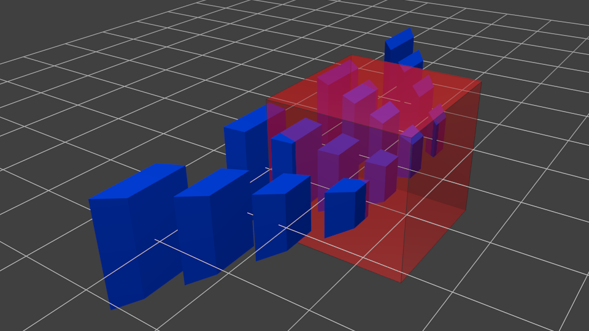

# OpenGL Note

Ref: <www.opengl-tutorial.org>

常见的创建窗口的库：GLUT, SDL, SFML and GLFW

需要安装的包：

```bash
apt install libglew-dev libglfw3-dev
```

如果安装了上面两个包还是不够，可以选择性安装下面的包。

```bash
apt install cmake make g++ libx11-dev libxi-dev libgl1-mesa-dev libglu1-mesa-dev libxrandr-dev libxext-dev libxcursor-dev libxinerama-dev libxi-dev
```

## cache

* glx 的一个 example，见`ref_7`

* 猜测：

    glx 才是 opengl 和 x window system 对接的接口。glew, glxew 都是对 glx 的封装。

* shader 版本标识必须写成`#version 330 core`, 不能写成`#version core 330`.

## Triangle (Quick start)

### GLFW Window

创建一个窗口所需要的最小代码：

`main.c`:

```c
#include <GLFW/glfw3.h>

int main()
{
	glfwInit();
	GLFWwindow *window = glfwCreateWindow(1024, 768, "opengl test", NULL, NULL);
	glfwMakeContextCurrent(window);
	do {
		glfwPollEvents();
	} while (glfwWindowShouldClose(window) == GLFW_FALSE);
	return 0;
}
```

编译：

```bash
gcc main.c -lglfw -o main
```

运行：

```bash
./main
```

效果：出现一个窗口，点右上角关闭按钮退出。

glfw 主要处理鼠标键盘等事件消息。

### Without shader

我们先画一个没有颜色的三角形，再画一个有颜色的三角形。填充颜色的工作是由 shader 完成的。

```cpp
#include <GL/glew.h>  // glew 必须写在 glfw3 的前面，不然会报错
#include <GLFW/glfw3.h>

int main()
{
	glfwInit();
	GLFWwindow *window = glfwCreateWindow(1024, 768, "opengl test", NULL, NULL);
	glfwMakeContextCurrent(window);
	glewInit();  // glewInit() 必须写在 glfwMakeContextCurrent() 之后，在 glGenBuffers() 等操作之前

	float vtxs[3][3] = {  // 有 3 个顶点，每个顶点用 (x, y, z) 三个分量描述
		{-0.5, 0, 0},  // x, y, z
		{0, 1, 0},  // 窗口的中心为 (0, 0)，向右为 x 轴正方向，向上为 y 轴正方向
		{0.5, 0, 0}  // 由于是平面三角形，所以 z 一直设置成 0 就可以了
	};

	GLuint buffer;  // c++ 的语法检查比较严，不能写 int，不然会报错
	glGenBuffers(1, &buffer);  // 这里的 buffer 更像是一个“句柄”
	glBindBuffer(GL_ARRAY_BUFFER, buffer);  // 指定要操作的 buffer
	glBufferData(GL_ARRAY_BUFFER, sizeof(float) * 9, vtxs, GL_STATIC_DRAW);  // 对指定的 buffer 写入数据

	glEnableVertexAttribArray(0);  // 允许 buffer 被传递到 shader 中。目前程序里没有 shader 部分，但是这行代码还是需要的
	glClearColor(0, 0, 0, 0);  // 预设下面 glClear() 要用到的颜色，(r, g, b, a)，全 0 表示黑色
	do {
		glClear(GL_COLOR_BUFFER_BIT);  // 使用预设颜色清空屏幕
		glBindBuffer(GL_ARRAY_BUFFER, buffer);  // 指定下面的命令要用到的 buffer
		glVertexAttribPointer(0, 3, GL_FLOAT, GL_FALSE, 0, NULL);  // 对显存进行解释
		// 0 表示 shader 中 0 号位置的 buffer
		// 3 表示每 3 个数据作为一个 vertex，与此相对的还有 4，表示 4 个数据作为一个顶点
		// GL_FLOAT 表示 buffer 中每个元素都是 GL_FLOAT 类型，占 4 个字节
		// 0 和 NULL 目前不明白是什么意思

		glDrawArrays(GL_TRIANGLES, 0, 3);  // 3 表示使用 3 个 vertex 来绘制 GL_TRIANGLES
		glfwSwapBuffers(window);  // 不知道干嘛用的，但不写这一步无法显示图像
		glfwPollEvents();
	} while (
		glfwWindowShouldClose(window) == GLFW_FALSE &&
		glfwGetKey(window, GLFW_KEY_ESCAPE) != GLFW_PRESS
	);
	return 0;
}
```

编译：

```bash
g++ main.cpp -lGLEW -lglfw -lGL -o main
```

注意编译时除了要加上`-lGLEW`外，还必须加上`-lGL`。

运行：

```bash
./main
```

显示效果：

<div style="text-align:center">

</div>

### With shader

shader 可以自动化将显存并行，对顶点进行变换，对面进行着色，贴图，打光等。

`main.cpp:`

```cpp
#include <GL/glew.h>
#include <GLFW/glfw3.h>
#include <string>
#include <fstream>
#include <sstream>
#include <vector>

// 加载 shader 的代码几乎是固定的，所以直接用一个函数封装起来了
GLuint LoadShaders(const char * vertex_file_path,const char * fragment_file_path){
	// Create the shaders
	GLuint VertexShaderID = glCreateShader(GL_VERTEX_SHADER);  // 创建 vertex shader
	GLuint FragmentShaderID = glCreateShader(GL_FRAGMENT_SHADER);  // 创建 fragment shader

	// Read the Vertex Shader code from the file
	std::string VertexShaderCode;
	std::ifstream VertexShaderStream(vertex_file_path, std::ios::in);
	if (VertexShaderStream.is_open()) {
		std::stringstream sstr;
		sstr << VertexShaderStream.rdbuf();
		VertexShaderCode = sstr.str();
		VertexShaderStream.close();
	} else {
		printf("Impossible to open %s. Are you in the right directory ? Don't forget to read the FAQ !\n", vertex_file_path);
		getchar();
		return 0;
	}

	// Read the Fragment Shader code from the file
	std::string FragmentShaderCode;
	std::ifstream FragmentShaderStream(fragment_file_path, std::ios::in);
	if (FragmentShaderStream.is_open()) {
		std::stringstream sstr;
		sstr << FragmentShaderStream.rdbuf();
		FragmentShaderCode = sstr.str();
		FragmentShaderStream.close();
	}

	GLint Result = GL_FALSE;
	int InfoLogLength;

	// Compile Vertex Shader
	printf("Compiling shader : %s\n", vertex_file_path);
	char const * VertexSourcePointer = VertexShaderCode.c_str();
	glShaderSource(VertexShaderID, 1, &VertexSourcePointer , NULL);  // 注册 shader 的源代码
	glCompileShader(VertexShaderID);  // 编译 shader

	// Check Vertex Shader
	glGetShaderiv(VertexShaderID, GL_COMPILE_STATUS, &Result);  // 不知道这个 iv 是什么意思
	glGetShaderiv(VertexShaderID, GL_INFO_LOG_LENGTH, &InfoLogLength);
	if ( InfoLogLength > 0 ){
		std::vector<char> VertexShaderErrorMessage(InfoLogLength+1);
		glGetShaderInfoLog(VertexShaderID, InfoLogLength, NULL, &VertexShaderErrorMessage[0]);
		printf("%s\n", &VertexShaderErrorMessage[0]);
	}

	// Compile Fragment Shader
	printf("Compiling shader : %s\n", fragment_file_path);
	char const * FragmentSourcePointer = FragmentShaderCode.c_str();
	glShaderSource(FragmentShaderID, 1, &FragmentSourcePointer , NULL);
	glCompileShader(FragmentShaderID);

	// Check Fragment Shader
	glGetShaderiv(FragmentShaderID, GL_COMPILE_STATUS, &Result);
	glGetShaderiv(FragmentShaderID, GL_INFO_LOG_LENGTH, &InfoLogLength);
	if ( InfoLogLength > 0 ){
		std::vector<char> FragmentShaderErrorMessage(InfoLogLength+1);
		glGetShaderInfoLog(FragmentShaderID, InfoLogLength, NULL, &FragmentShaderErrorMessage[0]);
		printf("%s\n", &FragmentShaderErrorMessage[0]);
	}

	// Link the program
	printf("Linking program\n");
	GLuint ProgramID = glCreateProgram();  // 创建 program
	glAttachShader(ProgramID, VertexShaderID);
	glAttachShader(ProgramID, FragmentShaderID);
	glLinkProgram(ProgramID);

	// Check the program
	glGetProgramiv(ProgramID, GL_LINK_STATUS, &Result);  // 同样，不懂这里的 iv 是什么意思
	glGetProgramiv(ProgramID, GL_INFO_LOG_LENGTH, &InfoLogLength);
	if ( InfoLogLength > 0 ){
		std::vector<char> ProgramErrorMessage(InfoLogLength+1);
		glGetProgramInfoLog(ProgramID, InfoLogLength, NULL, &ProgramErrorMessage[0]);
		printf("%s\n", &ProgramErrorMessage[0]);
	}
	
	glDetachShader(ProgramID, VertexShaderID);
	glDetachShader(ProgramID, FragmentShaderID);
	
	glDeleteShader(VertexShaderID);
	glDeleteShader(FragmentShaderID);

	return ProgramID;
}

int main()
{
	glfwInit();
	GLFWwindow *window = glfwCreateWindow(1024, 768, "opengl test", NULL, NULL);
	glfwMakeContextCurrent(window);
	glewInit();

	GLuint program_id = LoadShaders("./vtx_shader.glsl", "./frag_shader.glsl");  // 加载 shader
	glUseProgram(program_id);  // 随便写个位置都会生效

	float vtxs[3][3] = {
		{-0.5, 0, 0},
		{0, 1, 0},
		{0.5, 0, 0}
	};

	GLuint buffer;
	glGenBuffers(1, &buffer);
	glBindBuffer(GL_ARRAY_BUFFER, buffer);
	glBufferData(GL_ARRAY_BUFFER, sizeof(float) * 9, vtxs, GL_STATIC_DRAW);

	glEnableVertexAttribArray(0);
	glClearColor(0, 0, 0, 0);
	do {
		glClear(GL_COLOR_BUFFER_BIT);
		glBindBuffer(GL_ARRAY_BUFFER, buffer);
		glVertexAttribPointer(0, 3, GL_FLOAT, GL_FALSE, 0, NULL);
		
		glDrawArrays(GL_TRIANGLES, 0, 3);
		glfwSwapBuffers(window);
		glfwPollEvents();
	} while (
		glfwWindowShouldClose(window) == GLFW_FALSE &&
		glfwGetKey(window, GLFW_KEY_ESCAPE) != GLFW_PRESS
	);
	return 0;
}
```

`vtx_shader.glsl`:

```glsl
#version 330 core
// 上面这一行非常重要，不写可能会报错

layout(location = 0) in vec3 pos;  // 即 main.cpp 中代码 glEnableVertexAttribArray() 以及 glVertexAttribPointer() 指定的 0 位置
// vec3 表示把 buffer 中的数据 3 个一组，写入到一个 vec3 类型的对象`pos`中

void main()
{
    gl_Position = vec4(pos, 1);  // gl_Position 可能是个 vec4 类型的内置变量，不懂
}
```

`frag_shader.glsl`:

```glsl
#version 330 core

out vec3 color;  // color 可能是个内置变量

void main()
{
	color = vec3(0.5, 0.8, 0.5);  // 指定 rgb 颜色，对线条，顶点，面进行染色
}
```

编译：

```bash
g++ -g main.cpp -lglfw -lGLEW -lGL -o main
```

运行：

```bash
./main
```

效果：

<div style="text-align:center">

</div>

可以看到，整个三角形被渲染成了绿色。

下面是画一个三角形的代码：

```cpp
#include <stdio.h>
#include <stdlib.h>
#include <GL/glew.h>
#include <GL/glxew.h>
#include <GLFW/glfw3.h>
#include <glm/glm.hpp>
#include "shader.hpp"
using namespace glm;

int main()
{
    glewExperimental = true; // Needed for core profile
    if( !glfwInit() )
    {
        fprintf( stderr, "Failed to initialize GLFW\n" );
        return -1;
    }

    // Open a window and create its OpenGL context
    GLFWwindow* window;
    window = glfwCreateWindow(1024, 768, "Tutorial 01", NULL, NULL);
    if( window == NULL ) {
        fprintf( stderr, "Failed to open GLFW window. If you have an Intel GPU, they are not 3.3 compatible. Try the 2.1 version of the tutorials.\n" );
        glfwTerminate();
        return -1;
    }
    glfwMakeContextCurrent(window); // Initialize GLEW

    glewExperimental = true; // Needed in core profile
    if (glewInit() != GLEW_OK) {
        fprintf(stderr, "Failed to initialize GLEW\n");
        return -1;
    }

    // Ensure we can capture the escape key being pressed below
    glfwSetInputMode(window, GLFW_STICKY_KEYS, GL_TRUE);
    glClearColor(0.0f, 0.0f, 0.4f, 0.0f);

    GLuint VertexArrayID;
    glGenVertexArrays(1, &VertexArrayID);
    glBindVertexArray(VertexArrayID);
   	GLuint programID = LoadShaders( "SimpleVertexShader.vertexshader", "SimpleFragmentShader.fragmentshader" );

    static const GLfloat g_vertex_buffer_data[] = {
        -1.0f, -1.0f, 0.0f,
        1.0f, -1.0f, 0.0f,
        0.0f,  1.0f, 0.0f,
    };

    // This will identify our vertex buffer
    GLuint vertexbuffer;
    // Generate 1 buffer, put the resulting identifier in vertexbuffer
    glGenBuffers(1, &vertexbuffer);
    // The following commands will talk about our 'vertexbuffer' buffer
    glBindBuffer(GL_ARRAY_BUFFER, vertexbuffer);
    // Give our vertices to OpenGL.
    glBufferData(GL_ARRAY_BUFFER, sizeof(g_vertex_buffer_data), g_vertex_buffer_data, GL_STATIC_DRAW);

    do {
        // Clear the screen. It's not mentioned before Tutorial 02, but it can cause flickering, so it's there nonetheless.
        glClear( GL_COLOR_BUFFER_BIT );
        glUseProgram(programID);

        // Draw
		glEnableVertexAttribArray(0);
		glBindBuffer(GL_ARRAY_BUFFER, vertexbuffer);
		glVertexAttribPointer(
			0,                  // attribute 0. No particular reason for 0, but must match the layout in the shader.
			3,                  // size
			GL_FLOAT,           // type
			GL_FALSE,           // normalized?
			0,                  // stride
			(void*)0            // array buffer offset
		);

        // Draw the triangle !
        glDrawArrays(GL_TRIANGLES, 0, 3); // Starting from vertex 0; 3 vertices total -> 1 triangle
        glDisableVertexAttribArray(0);

        // Swap buffers
        glfwSwapBuffers(window);
        glfwPollEvents();

    } // Check if the ESC key was pressed or the window was closed
    while( glfwGetKey(window, GLFW_KEY_ESCAPE ) != GLFW_PRESS &&
            glfwWindowShouldClose(window) == 0 );

    // Cleanup VBO  
	glDeleteBuffers(1, &vertexbuffer);
	glDeleteVertexArrays(1, &VertexArrayID);
	glDeleteProgram(programID);
    glfwTerminate();
    return 0;
}
```

`SimpleFragmentShader.fragmentshader`:

```glsl
#version 330 core

// Ouput data
out vec3 color;

void main()
{

	// Output color = red 
	color = vec3(1,0,0);

}
```

`SimpleVertexShader.vertexshader`:

```glsl
#version 330 core

// Input vertex data, different for all executions of this shader.
layout(location = 0) in vec3 vertexPosition_modelspace;

void main(){

    gl_Position.xyz = vertexPosition_modelspace;
    gl_Position.w = 1.0;

}
```

`shader.hpp`:

```cpp
#ifndef SHADER_HPP
#define SHADER_HPP

GLuint LoadShaders(const char * vertex_file_path,const char * fragment_file_path);

#endif
```

`shader.cpp`:

```cpp
#include <stdio.h>
#include <string>
#include <vector>
#include <iostream>
#include <fstream>
#include <algorithm>
#include <sstream>
using namespace std;

#include <stdlib.h>
#include <string.h>

#include <GL/glew.h>

#include "shader.hpp"

GLuint LoadShaders(const char * vertex_file_path,const char * fragment_file_path){

	// Create the shaders
	GLuint VertexShaderID = glCreateShader(GL_VERTEX_SHADER);
	GLuint FragmentShaderID = glCreateShader(GL_FRAGMENT_SHADER);

	// Read the Vertex Shader code from the file
	std::string VertexShaderCode;
	std::ifstream VertexShaderStream(vertex_file_path, std::ios::in);
	if(VertexShaderStream.is_open()){
		std::stringstream sstr;
		sstr << VertexShaderStream.rdbuf();
		VertexShaderCode = sstr.str();
		VertexShaderStream.close();
	}else{
		printf("Impossible to open %s. Are you in the right directory ? Don't forget to read the FAQ !\n", vertex_file_path);
		getchar();
		return 0;
	}

	// Read the Fragment Shader code from the file
	std::string FragmentShaderCode;
	std::ifstream FragmentShaderStream(fragment_file_path, std::ios::in);
	if(FragmentShaderStream.is_open()){
		std::stringstream sstr;
		sstr << FragmentShaderStream.rdbuf();
		FragmentShaderCode = sstr.str();
		FragmentShaderStream.close();
	}

	GLint Result = GL_FALSE;
	int InfoLogLength;

	// Compile Vertex Shader
	printf("Compiling shader : %s\n", vertex_file_path);
	char const * VertexSourcePointer = VertexShaderCode.c_str();
	glShaderSource(VertexShaderID, 1, &VertexSourcePointer , NULL);
	glCompileShader(VertexShaderID);

	// Check Vertex Shader
	glGetShaderiv(VertexShaderID, GL_COMPILE_STATUS, &Result);
	glGetShaderiv(VertexShaderID, GL_INFO_LOG_LENGTH, &InfoLogLength);
	if ( InfoLogLength > 0 ){
		std::vector<char> VertexShaderErrorMessage(InfoLogLength+1);
		glGetShaderInfoLog(VertexShaderID, InfoLogLength, NULL, &VertexShaderErrorMessage[0]);
		printf("%s\n", &VertexShaderErrorMessage[0]);
	}

	// Compile Fragment Shader
	printf("Compiling shader : %s\n", fragment_file_path);
	char const * FragmentSourcePointer = FragmentShaderCode.c_str();
	glShaderSource(FragmentShaderID, 1, &FragmentSourcePointer , NULL);
	glCompileShader(FragmentShaderID);

	// Check Fragment Shader
	glGetShaderiv(FragmentShaderID, GL_COMPILE_STATUS, &Result);
	glGetShaderiv(FragmentShaderID, GL_INFO_LOG_LENGTH, &InfoLogLength);
	if ( InfoLogLength > 0 ){
		std::vector<char> FragmentShaderErrorMessage(InfoLogLength+1);
		glGetShaderInfoLog(FragmentShaderID, InfoLogLength, NULL, &FragmentShaderErrorMessage[0]);
		printf("%s\n", &FragmentShaderErrorMessage[0]);
	}

	// Link the program
	printf("Linking program\n");
	GLuint ProgramID = glCreateProgram();
	glAttachShader(ProgramID, VertexShaderID);
	glAttachShader(ProgramID, FragmentShaderID);
	glLinkProgram(ProgramID);

	// Check the program
	glGetProgramiv(ProgramID, GL_LINK_STATUS, &Result);
	glGetProgramiv(ProgramID, GL_INFO_LOG_LENGTH, &InfoLogLength);
	if ( InfoLogLength > 0 ){
		std::vector<char> ProgramErrorMessage(InfoLogLength+1);
		glGetProgramInfoLog(ProgramID, InfoLogLength, NULL, &ProgramErrorMessage[0]);
		printf("%s\n", &ProgramErrorMessage[0]);
	}
	
	glDetachShader(ProgramID, VertexShaderID);
	glDetachShader(ProgramID, FragmentShaderID);
	
	glDeleteShader(VertexShaderID);
	glDeleteShader(FragmentShaderID);

	return ProgramID;
}
```

编译：

```bash
g++ -g shader.cpp main.cpp -lGLEW -lglfw  -lGL -lGLU
```

## Functions and topics

此标题下以 example 和话题的形式，讨论用到的基本技术以及细节。

此部分不作 API 式的详细参考。

### Coordinates

OpenGL 通常使用一个四元向量`(x, y, z, w)`表示一个点的坐标或一个方向向量。

当表示坐标（position）时，这个向量的最后一个数为 1：`(x, y, z, 1)`

当表示方向（direction）时，这个向量的最后一个数为 0：`(x, y, z, 0)`

这样做的好处是，无论是这个向量表示的是坐标还是方向，都可以和统一的变换矩阵相乘，做相同的仿射变换（平移，旋转，缩放等）操作。

Homogeneous coordinates allow us to use a single mathematical formula to deal with these two cases.

假设我们的变换矩阵为$4 \times 4$的矩阵$M$，要变换的向量为$4 \times 1$的向量$v$，那么变换就可以写成：

$$
M \cdot v = 
\left[ \begin{matrix} 
m_{11} &m_{12} &m_{13} &m_{14} \\
m_{21} &m_{22} &m_{23} &m_{24} \\
m_{31} &m_{32} &m_{33} &m_{34} \\
m_{41} &m_{42} &m_{43} &m_{44}
\end{matrix} \right]
\cdot
\left[
\begin{matrix}
x \\
y \\
z \\
w
\end{matrix}
\right]
$$

OpenGL 使用C++ 库`glm`计算矩阵与向量相乘。（这个库可以实现矩阵和矩阵相乘吗？）

`glm`的安装：`sudo apt install libglm-dev`。

使用：

`main.cpp`:

```cpp
#include <glm/glm.hpp>
#include <iostream>
using std::cout, std::endl;

int main()
{
	glm::mat4 M = {
		{1, 2, 3, 4},  // 事实上，这些最内层的括号可以去掉
		{5, 6, 7, 8},
		{9, 10, 11, 12},
		{13, 14, 15, 16}
	};
	glm::vec4 v = {1, 2, 3, 4};
	glm::vec4 result = M * v;
	for (int i = 0; i < 4; ++i)
		cout << result[i] << ", ";
	cout << endl;
	return 0;
}
```

编译：

```bash
g++ -g main.cpp -o main
```

运行：

```bash
./main
```

输出：

```
90, 100, 110, 120,
```

我们对比 numpy 的矩阵相乘：

```python
import numpy as np
a = np.arange(1, 17).reshape(4, 4)
b = np.arange(1, 5).reshape(4, 1)
print(a.dot(b))
print()
print(a.T.dot(b))
```

输出：

```
[[ 30]
 [ 70]
 [110]
 [150]]

[[ 90]
 [100]
 [110]
 [120]]
```

我们可以看到，将**数值**与 numpy 的计算结果对比，`glm`计算的其实是$M^{\intercal} \cdot v$。事实上，`glm`将代码中输入的最内层的数组，看作是一个列向量，单独的一个`vec4`也看作一个列向量。而`numpy`正好相反，将最内层的数组看作是一个行向量。

有两种解决办法：

1. 将$M$进行转置后再和$v$相乘。

2. 按列向量的方式填充$M$。

### 常用变换矩阵

常用的几种变换矩阵：

* 平移矩阵（Translation matrices）

	$M = \left[ \begin{matrix} 
	1 &0 &0 &X \\
	0 &1 &0 &Y \\
	0 &0 &1 &Z \\
	0 &0 &0 &1
	\end{matrix} \right]$

	平移矩阵可以将点坐标的 x, y, z 分量分别增加 X, Y, Z。

	$v' = M \cdot v$

	`glm`实现：

	`main.cpp`

	```cpp
	#include <glm/glm.hpp>
	#include <iostream>
	using std::cout, std::endl;

	int main()
	{
		glm::mat4 M = {
			{1, 0, 0, 0},
			{0, 1, 0, 0},
			{0, 0, 1, 0},
			{1, 3, 5, 1}
		};
		glm::vec4 v_pos = {1, 2, 3, 1};
		glm::vec4 v_dir = {1, 2, 3, 0};
		glm::vec4 result_pos = M * v_pos;
		glm::vec4 result_dir = M * v_dir;
		for (int i = 0; i < result_pos.length(); ++i)
			cout << result_pos[i] << ", ";
		cout << endl;
		for (int i = 0; i < result_dir.length(); ++i)
			cout << result_dir[i] << ", ";
		cout << endl;
		return 0;
	}
	```

	输出：

	```
	2, 5, 8, 1, 
	1, 2, 3, 0, 
	```

	可以看到，`(2, 5, 8, 1)`为`(1, 2, 3, 1)`分别在 x, y, z 方向上加了 1, 3, 5 个单位的结果。而变换矩阵对方向向量毫无作用。

	`glm`也提供了便捷创建平移矩阵`M`的函数：

	```cpp
	#include <glm/glm.hpp>
	#include <glm/gtc/matrix_transform.hpp>  // 需要添加这个头文件
	#include <iostream>
	using std::cout, std::endl;

	int main()
	{
		glm::mat4 M = glm::translate(glm::mat4(1), {1, 3, 5});  // glm::translate() 创建一个平移矩阵
		glm::vec4 v_pos = {1, 2, 3, 1};
		glm::vec4 v_dir = {1, 2, 3, 0};
		glm::vec4 result_pos = M * v_pos;
		glm::vec4 result_dir = M * v_dir;
		for (int i = 0; i < result_pos.length(); ++i)
			cout << result_pos[i] << ", ";
		cout << endl;
		for (int i = 0; i < result_dir.length(); ++i)
			cout << result_dir[i] << ", ";
		cout << endl;
		return 0;
	}
	```

	输出：

	```
	2, 5, 8, 1, 
	1, 2, 3, 0, 
	```

	说明：

	1. `glm::mat4(1)`表示创建一个单位矩阵，即主对角线上元素都为 1，其余位置元素都为 0.

	1. `glm::translate()`之所以要在第一个参数输入一个矩阵，是因为如果有多个矩阵变换，在这里只要输入上一个变换矩阵，`translate()`就会自动将矩阵相乘，合并成最终的变换矩阵。

* 缩放矩阵（Scaling matrices）

	$M = \begin{bmatrix}
	a &0 &0 &0 \\
	0 &b &0 &0 \\
	0 &0 &c &0 \\
	0 &0 &0 &1
	\end{bmatrix}$

	缩放矩阵可同时作用于位置向量和方向向量。可以将向量$(x, y, z, w)$变换为$(a \cdot x,\ b \cdot y,\ c \cdot z,\ w)$。

	C++ 程序：

	```cpp
	#include <glm/glm.hpp>
	#include <glm/gtc/matrix_transform.hpp>
	#include <iostream>
	using std::cout, std::endl;

	int main()
	{
		glm::mat4 M = glm::scale(glm::mat4(1), {2, 3, 4});
		glm::vec4 v_pos = {1, 2, 3, 1};
		glm::vec4 v_dir = {1, 2, 3, 0};
		glm::vec4 result_pos = M * v_pos;
		glm::vec4 result_dir = M * v_dir;
		for (int i = 0; i < result_pos.length(); ++i)
			cout << result_pos[i] << ", ";
		cout << endl;
		for (int i = 0; i < result_dir.length(); ++i)
			cout << result_dir[i] << ", ";
		cout << endl;
		return 0;
	}
	```

	输出：

	```
	2, 6, 12, 1, 
	2, 6, 12, 0,
	```

* 旋转矩阵（Rotation matrices）

	绕 x 轴按右手螺旋方向旋转（大拇指指向 x 轴正方向，四指环绕的方向就是旋转方向）：

	$M = \begin{bmatrix}
	1 &0 &0 \\
	0 &\cos\theta &-\sin\theta \\
	0 &\sin\theta &\cos\theta
	\end{bmatrix}$

	绕 y 轴按右手螺旋方向旋转：

	$M = \begin{bmatrix}
	\cos\theta &0 &\sin\theta \\
	0 &1 &0 \\
	-\sin\theta &0 &\sin\theta
	\end{bmatrix}$

	绕 z 轴按右手螺旋方向旋转：

	$M = \begin{bmatrix}
	\cos\theta &-\sin\theta &0 \\
	\sin\theta &\cos\theta &0 \\
	0 &0 &1
	\end{bmatrix}$

	如果想直观地生成旋转矩阵，可以参考这个网站：<https://www.andre-gaschler.com/rotationconverter/>

	如果需要生成按任意轴旋转的旋转矩阵，公式可以参考：<https://zh.wikipedia.org/zh-cn/%E6%97%8B%E8%BD%AC%E7%9F%A9%E9%98%B5>

	使用`glm`生成旋转矩阵：

	```cpp
	#include <glm/glm.hpp>
	#include <glm/gtc/matrix_transform.hpp>
	#include <iostream>
	using std::cout, std::endl;

	int main()
	{
		glm::mat4 M = glm::rotate(glm::mat4(1), 0.2f, {0, 1, 0});  // 只写 0.2 会报错，必须写成 0.2f
		for (int i = 0; i < M.length(); ++i)
		{
			for (int j = 0; j < M[i].length(); ++j)
				cout << M[i][j] << ", ";
			cout << endl;
		}
		return 0;
	}
	```

	输出：

	```
	0.980067, 0, -0.198669, 0, 
	0, 1, 0, 0, 
	0.198669, 0, 0.980067, 0, 
	0, 0, 0, 1,
	```

	说明：

	1. 之所以必须写成`0.2f`，是因为下一个参数`{0, 1, 0}`会生成一个`float`类型的`glm::vec3`，而`0.2`的字面量默认是`double`类型，所以编译器会报错`float`类型与`double`类型不一致。

	2. 旋转的单位是弧度，不是角度。

	可以和网站生成的旋转矩阵做个对比：

	<div style='text-align:center'>
	
	</div>

	可以看到，程序的每行输出，都是网站生成的旋转矩阵的一个列向量。并且`glm`生成的旋转矩阵是$4 \times 4$的，而网站的旋转矩阵是$3 \times 3$的。

* 三种变换矩阵的合并（Cumulating transformations）

	```cpp
	TransformedVector = TranslationMatrix * RotationMatrix * ScaleMatrix * OriginalVector;
	```

	这行代码会先算 scaling，再算 rotation，最后才是 translation。

	调换坐标操作的顺序可能会产生不同的结果。一个通常不会出错的顺序是：Scale it first if needed; then set its direction, then translate it.

	```cpp
	glm::mat4 myModelMatrix = myTranslationMatrix * myRotationMatrix * myScaleMatrix;
	glm::vec4 myTransformedVector = myModelMatrix * myOriginalVector;
	```

### 常用坐标系

OpenGL 的坐标系为了方便指定，有几个专有名词，分别是 Model coordinates，World coordinates，Camera coordinates。

* Model coordinates

	每个顶点（vertex）相对于模型中心的坐标被称为模型坐标系（model coordinates）。

* World coordinates

	将模型坐标系通过缩放、旋转、平移变换后，模型的每个顶点的坐标会发生改变，此时的顶点的坐标所在的坐标系被称为世界坐标系（world coordinates）。这个空间被称为 world space。即：

	$c_w = M_t \cdot M_r \cdot M_s \cdot c_m$

	其中$d_w$表示 world coordinates 的一个坐标向量，$c_m$表示 model coordinates 下的一个坐标向量，$M_s$表示缩放矩阵（scaling matrix），$M_r$表示旋转矩阵（rotation matrix），$M_t$表示平移矩阵（translation matrix）。

	令$M_m = M_t \cdot M_r \cdot M_s$，我们称$M_m$为 model matrix。

* Camera coordinates

    指的是绘制窗口的坐标系。原点在窗口正中心，x 轴正方向为右，y 轴正方向是上，z 轴正方向是从屏幕指向你。整个坐标系遵守右手螺旋定则。
	
	其实窗口就相当于摄像机，最终世界坐标系上的点需要映射到窗口坐标系上，才能绘制成像素。

	$c_c = M_v \cdot c_w$

	其中$c_c$表示 camera coordinates 的一个坐标向量，$c_w$表示 world coordinates 中的一个坐标向量，$M_v$指的是 view matrix，与 model matrix 的作用相似。表示假设一开始世界坐标系中心和摄像机坐标系中心重合，那么$c_c$表示将世界经过矩阵$M_v$变换后，得到的每个点的坐标。

	在通常的使用过程中，我们很少会去想将整个世界移动，而是去移动摄像机。因此我们并不是直接构造$M_v$，而是根据摄像机的位置反推出$M_v$。假设摄像机一开始在世界坐标系的中心，那么将相机向左移就相当于将世界向右移。类似地，可以得到旋转的变换关系。

	我们并不需要自己实现这个反推过程，因为`glm`已经帮我们实现好了：

	```cpp
	#include <glm/glm.hpp>
	#include <glm/gtc/matrix_transform.hpp>
	#include <iostream>
	using std::cout, std::endl;

	int main()
	{
		glm::vec3 eye{0, 0, 1};  // 摄像机位于这个位置
		glm::vec3 center{0, 0, 0};  // 摄像机看向这个点
		glm::vec3 up{0, 1, 0};  // 摄像机的“上”方向
		glm::mat4 M_c = glm::lookAt(eye, center, up);
		for (int i = 0; i < M_c.length(); ++i)
		{
			for (int j = 0; j < M_c[i].length(); ++j)
			{
				cout << M_c[i][j] << ", ";
			}
			cout << endl;
		}
		return 0;
	}
	```

	输出：

	```
	1, 0, -0, 0, 
	-0, 1, -0, 0, 
	0, 0, 1, 0, 
	-0, -0, -1, 1,
	```

	如果我们使用下面这行代码初始化编译矩阵，那么将会编译失败：

	```cpp
	glm::mat4 M_c = glm::lookAt({0, 0, 1}, {0, 0, 0}, {0, 1, 0});
	```

	因为`{0, 0, 1}`等这些参数本身是由模板函数`glm::vec()`生成的，而`glm::lookAt()`也是模板函数，所以`glm::lookAt()`无法推断出参数的类型，所以无法实例化。这个现象挺反直觉的。有时间了研究一下模板函数的原理。

* Homogeneous coordinates

    为了能够得到透视效果（近大远小，点坐标的的 z 值越大，则越靠近原点），我们还需要透视变换（或者叫透视投影，perspective projection）。

	$c_h = M_p \cdot c_c$

	其中，$c_h$表示同质坐标系（Homogeneous coordinates）下一个点坐标的向量，$c_c$表示 camera coordinates 下的点坐标向量，$M_p$表示透视矩阵（perspective projection matrix）。

	这个矩阵我们同样可以使用`glm`直接生成：

	```cpp
	#include <glm/glm.hpp>
	#include <glm/gtc/matrix_transform.hpp>
	#include <iostream>
	using std::cout, std::endl;

	int main()
	{
		glm::mat4 M_p = glm::perspective(
			1.02,  // fov, The vertical Field of View, in radians （不是很懂这个）
			4.0 / 3.0,  // Aspect Ratio，窗口的长宽比
			0.1,  // Near clipping plane. Keep as big as possible, or you'll get precision issues.
			100.0  // Far clipping plane. Keep as little as possible.
		);
		for (int i = 0; i < M_p.length(); ++i)
		{
			for (int j = 0; j < M_p[i].length(); ++j)
			{
				cout << M_p[i][j] << ", ";
			}
			cout << endl;
		}
		return 0;
	}
	```

	输出：

	```
	1.29904, 0, 0, 0, 
	0, 1.73205, 0, 0, 
	0, 0, -1.002, -1, 
	0, 0, -0.2002, 0,
	```

	我们可以用下面图来再次解释透视矩阵的作用。

	根据近大远小的透视原理，我们的视野范围实际上是一个平截头体（frustum），如下图中红色部分所示：

	<div style='text-align:center'>
	
	</div>

	对于 3D 来说，我们实际上并不是截取这样一个截头锥体的视野，而是让 3D 世界中的物体做一个等效变换：

	<div style='text-align:center'>
	
	</div>

	上图中红色部分为正方体的视野，而蓝色的物体都被进行了仿射变换。我们拿红色的正方体视野去截取变形了的物体，就可以得到投影到屏幕上的结果：

	<div style='text-align:center'>
	
	</div>

	最后我们还需要让它适应屏幕长宽比（比如 1024 x 768）：

	<div style='text-align:center'>
	
	</div>

	这样我们就得到了最终的渲染结果。

### MVP matrix

将 Model matrix，View matrix 以及 Perpective matrix 合并起来，可以得到综合变换的矩阵：MVP Matrix：

$$
M_{mvp} = M_p \cdot M_v \cdot M_m
$$

这样我们就可以一步得到将物体映射到屏幕上的坐标：

$$
c_h = M_{mvp} \cdot c_m
$$

其中，$c_h$表示窗口坐标系上的坐标，$c_m$表示模型坐标系下的坐标，$M_{mvp}$表示综合变换矩阵。

C++ 的代码实现：

```cpp
#include <glm/glm.hpp>
#include <glm/gtc/matrix_transform.hpp>
#include <iostream>
using std::cout, std::endl;

int main()
{
	glm::mat4 M_s = glm::scale(glm::mat4(1), {2, 2, 2});
	glm::mat4 M_r = glm::rotate(glm::mat4(1), 0.2f, {0, 1, 0});
	glm::mat4 M_t = glm::translate(glm::mat4(1), {0.1, 0.2, -1});
	glm::mat4 M_m = M_t * M_r * M_s;  // model matrix
	glm::vec3 eye{0, 0, 1};
	glm::vec3 center{0, 0, 0};
	glm::vec3 up{0, 1, 0};
	glm::mat4 M_v = glm::lookAt(eye, center, up);  // view matrix
	glm::mat4 M_p = glm::perspective(glm::radians(45.0), 1024.0 / 768.0, 0.1, 100.0);  // perspective matrix
	glm::mat4 M_mvp = M_p * M_v * M_m;  // the MVP matrix
	glm::vec4 c_m{1, 2, 3, 1};
	glm::vec4 c_h = M_mvp * c_m;
	cout << "c_m:" << endl;
	for (int i = 0; i < c_m.length(); ++i)
		cout << c_m[i] << ", ";
	cout << endl;
	cout << "M_mvp:" << endl;;
	for (int i = 0; i < M_mvp.length(); ++i)
	{
		for (int j = 0; j < M_mvp[i].length(); ++j)
		{
			cout << M_mvp[i][j] << ", ";
		}
		cout << endl;
	}
	cout << "c_h:" << endl;
	for (int i = 0; i < c_h.length(); ++i)
		cout << c_h[i] << ", ";
	cout << endl;
	return 0;
}
```

输出：

```
c_m:
1, 2, 3, 1, 
M_mvp:
3.54913, 0, 0.398134, 0.397339, 
0, 4.82843, 0, 0, 
0.719445, 0, -1.96406, -1.96013, 
0.181066, 0.482843, 1.8038, 2, 
c_h:
5.88854, 10.1397, -3.69023, -3.48306, 
```

说明：

1. 为什么点坐标的最后一个分量`1`变成了`-3.48306`？如果不进行透视变换，那么最后一个分量仍为`1`，说明是透视变换影响了第 4 个分量。为什么会影响？这个影响有什么意义？

	> […]luckily for us, a 4x4 matrix can represent this projection : Actually, this is not correct. A perspective transformation is not affine, and as such, can’t be represented entirely by a matrix. After beeing multiplied by the ProjectionMatrix, homogeneous coordinates are divided by their own W component. This W component happens to be -Z (because the projection matrix has been crafted this way). This way, points that are far away from the origin are divided by a big Z; their X and Y coordinates become smaller; points become more close to each other, objects seem smaller; and this is what gives the perspective. This transformation is done in hardware, and is not visible in the shader.

为什么我们花这么大力气计算出了 MVP 矩阵，却只将它作用在一个向量上，而不是用它来乘一个$4 \times n$的矩阵？因为 GPU 会自动并行化处理每个顶点，我们在 shader 中只需要将 MVP 矩阵作用在每个点上就可以了。这就是并行的力量！

### Draw triangles using indices

This is also called element draw, or VBO drawing.

example:

`main.cpp`:

```c
#include <GL/glew.h>
#include <GLFW/glfw3.h>
#include <stdio.h>
#include <stdlib.h>

GLuint load_shader(const char *vert_shader_path, const char *frag_shader_path)
{
    GLuint vert_shader = glCreateShader(GL_VERTEX_SHADER);
    GLuint frag_shader = glCreateShader(GL_FRAGMENT_SHADER);
    FILE *f = fopen(vert_shader_path, "r");
    fseek(f, 0, SEEK_END);
    size_t len = ftell(f);
    fseek(f, 0, SEEK_SET);
    char *shader_src = (char*) malloc(len);
    fread(shader_src, len, 1, f);
    glShaderSource(vert_shader, 1, &shader_src, (const GLint *)&len);
    glCompileShader(vert_shader);
    free(shader_src);
    fclose(f);
    f = fopen(frag_shader_path, "r");
    fseek(f, 0, SEEK_END);
    len = ftell(f);
    fseek(f, 0, SEEK_SET);
    shader_src = (char*) malloc(len);
    fread(shader_src, len, 1, f);
    glShaderSource(frag_shader, 1, &shader_src, (const GLint *)&len);
    glCompileShader(frag_shader);
    free(shader_src);
    fclose(f);
    GLuint prog = glCreateProgram();
    glAttachShader(prog, vert_shader);
    glAttachShader(prog, frag_shader);
    glLinkProgram(prog);
    glDetachShader(prog, vert_shader);
    glDetachShader(prog, frag_shader);
    glDeleteShader(vert_shader);
    glDeleteShader(frag_shader);
    return prog;
}

int main()
{
    glfwInit();
    GLFWwindow *window = glfwCreateWindow(700, 500, "hello", NULL, NULL);
    glfwMakeContextCurrent(window);
    glewInit();
    GLuint prog_id = load_shader("vert.glsl", "frag.glsl");
    glUseProgram(prog_id);

    float vtxs[] = {
        -0.5, -0.5, -0.5,
        -0.5, -0.5, 0.5,
        -0.5, 0.5, 0.5,
        -0.5, 0.5, -0.5,
        0.5, -0.5, -0.5,
        0.5, -0.5, 0.5,
        0.5, 0.5, 0.5,
        0.5, 0.5, -0.5
    };

    uint32_t inds[][3] = {
        1, 2, 0,
        3, 0, 2,
        1, 5, 6,
        1, 6, 2,
        5, 4, 6,
        4, 7, 6,
        0, 3, 7,
        0, 7, 4,
        6, 3, 2,
        6, 7, 3,
        1, 0, 5,
        5, 0, 4
    };

    GLuint vtx_buf, ind_buf;
    glGenBuffers(1, &vtx_buf);
    glBindBuffer(GL_ARRAY_BUFFER, vtx_buf);
    glBufferData(GL_ARRAY_BUFFER, sizeof(vtxs), vtxs, GL_STATIC_DRAW);
    glGenBuffers(1, &ind_buf);
    glBindBuffer(GL_ELEMENT_ARRAY_BUFFER, ind_buf);
    glBufferData(GL_ELEMENT_ARRAY_BUFFER, sizeof(inds), inds, GL_STATIC_DRAW);

    glClearColor(0, 0, 0, 0);
    glEnableVertexAttribArray(0);
    while (glfwWindowShouldClose(window) != GLFW_TRUE)
    {
        glClear(GL_COLOR_BUFFER_BIT0_QCOM);

        glUseProgram(prog_id);
        glBindBuffer(GL_ARRAY_BUFFER, vtx_buf);
        glVertexAttribPointer(0, 3, GL_FLOAT, GL_FALSE, sizeof(float) * 3, NULL);
        glBindBuffer(GL_ELEMENT_ARRAY_BUFFER, ind_buf);
        glDrawElements(GL_TRIANGLES, 12, GL_UNSIGNED_INT, NULL);
        glfwSwapBuffers(window);
        glfwPollEvents();
		
        if (glfwGetKey(window, GLFW_KEY_ESCAPE) == GLFW_PRESS)
        {
            glfwSetWindowShouldClose(window, GLFW_TRUE);
        }
    }
    return 0;
}
```

`vert.glsl`:

```glsl
#version 330 core

layout(location = 0) in vec3 pos;

void main()
{
    gl_Position = vec4(pos, 1);
}
```

`frag.glsl`:

```glsl
#version 330 core

out vec3 color;

void main()
{
    color = vec3(0.5, 0.8, 0.5);
}
```

`Makefile`:

```makefile
main: main.cpp
	g++ -g main.cpp -lglfw -lGLEW -lGL -o main
```

compile:

```bash
make
```

run:

```bash
./main
```

output:

<div style='text-align:center'>

</div>

其中，

`float vtxs[]`不再像前面那样描述三角形顶点，而是只描述立方体的 12 个顶点。

`uint32_t inds[][3]`用于使用索引描述每一个三角形。

顶点索引对应的 target 为`GL_ELEMENT_ARRAY_BUFFER`，不要写成`GL_ARRAY_BUFFER`。其他的 buffer 创建过程与数据传输过程与 vertex 完全相同。

在 draw 过程中，我们首先 bind array buffer，对其进行解释，然后再 bind element array buffer，不需要对其解释。

最后使用`glDrawElements()`绘制就可以了，区别于以前的`glDrawArrays()`。

可以看到，这个输出效果其实看不出来这是一个立方体，要想让它看起来更像一个立方体，还需要加上旋转和色彩。

## GLSL

GLSL 的全称是 GL Shader Language，它是 OpenGL 的一部分。

### 数据的传递

C 这边通过`glGetUniformLocation()`和`glUniformMatrix4fv()`向 glsl 文件中传输数据。

```cpp
// Get a handle for our "MVP" uniform
// Only during the initialisation
GLuint MatrixID = glGetUniformLocation(programID, "MVP");
  
// Send our transformation to the currently bound shader, in the "MVP" uniform
// This is done in the main loop since each model will have a different MVP matrix (At least for the M part)
glUniformMatrix4fv(MatrixID, 1, GL_FALSE, &mvp[0][0]);
```

glsl 通过`uniform`得到数据：

```glsl
// Input vertex data, different for all executions of this shader.
layout(location = 0) in vec3 vertexPosition_modelspace;
  
// Values that stay constant for the whole mesh.
uniform mat4 MVP;
  
void main()
{
  // Output position of the vertex, in clip space : MVP * position
  gl_Position =  MVP * vec4(vertexPosition_modelspace, 1);
}
```

### 常见运算

```glsl
mat4 myMatrix;
vec4 myVector;
// fill myMatrix and myVector somehow
vec4 transformedVector = myMatrix * myVector;

mat4 transform = mat2 * mat1;
vec4 out_vec = transform * in_vec;

transformed_vertex = MVP * in_vertex;
```

使用`glGetIntegerv(GL_MAX_VERTEX_ATTRIBS, &v))`可以拿到 layout 的最大值。

常用的 shader 有两种： Vertex Shader 和 Fragment Shader

```cpp
void main(){
  gl_Position.xyz = vertexPosition_modelspace;
  gl_Position.w = 1.0;
}
```

* mix

    `mix()`是 glsl 里的一个线性插值函数。

    mix — linearly interpolate between two values

    Syntax:

    ```c
    genType mix(
        genType x,
        genType y,
        genType a);
    ```

    Parameters:

    * x

        Specify the start of the range in which to interpolate.
    
    * y

        Specify the end of the range in which to interpolate.
    
    * a

        Specify the value to use to interpolate between x and y. 

    `mix` performs a linear interpolation between x and y using a to weight between them. The return value is computed as $x \times (1−a) + y \times a$. 

### shader 的加载

load shaders:

```cpp
#include <stdio.h>
#include <string>
#include <vector>
#include <iostream>
#include <fstream>
#include <algorithm>
#include <sstream>
using namespace std;

#include <stdlib.h>
#include <string.h>

#include <GL/glew.h>


GLuint LoadShaders(const char * vertex_file_path,const char * fragment_file_path){

	// Create the shaders
	GLuint VertexShaderID = glCreateShader(GL_VERTEX_SHADER);
	GLuint FragmentShaderID = glCreateShader(GL_FRAGMENT_SHADER);

	// Read the Vertex Shader code from the file
	std::string VertexShaderCode;
	std::ifstream VertexShaderStream(vertex_file_path, std::ios::in);
	if(VertexShaderStream.is_open()){
		std::stringstream sstr;
		sstr << VertexShaderStream.rdbuf();
		VertexShaderCode = sstr.str();
		VertexShaderStream.close();
	}else{
		printf("Impossible to open %s. Are you in the right directory ? Don't forget to read the FAQ !\n", vertex_file_path);
		getchar();
		return 0;
	}

	// Read the Fragment Shader code from the file
	std::string FragmentShaderCode;
	std::ifstream FragmentShaderStream(fragment_file_path, std::ios::in);
	if(FragmentShaderStream.is_open()){
		std::stringstream sstr;
		sstr << FragmentShaderStream.rdbuf();
		FragmentShaderCode = sstr.str();
		FragmentShaderStream.close();
	}

	GLint Result = GL_FALSE;
	int InfoLogLength;

	// Compile Vertex Shader
	printf("Compiling shader : %s\n", vertex_file_path);
	char const * VertexSourcePointer = VertexShaderCode.c_str();
	glShaderSource(VertexShaderID, 1, &VertexSourcePointer , NULL);
	glCompileShader(VertexShaderID);

	// Check Vertex Shader
	glGetShaderiv(VertexShaderID, GL_COMPILE_STATUS, &Result);
	glGetShaderiv(VertexShaderID, GL_INFO_LOG_LENGTH, &InfoLogLength);
	if ( InfoLogLength > 0 ){
		std::vector<char> VertexShaderErrorMessage(InfoLogLength+1);
		glGetShaderInfoLog(VertexShaderID, InfoLogLength, NULL, &VertexShaderErrorMessage[0]);
		printf("%s\n", &VertexShaderErrorMessage[0]);
	}

	// Compile Fragment Shader
	printf("Compiling shader : %s\n", fragment_file_path);
	char const * FragmentSourcePointer = FragmentShaderCode.c_str();
	glShaderSource(FragmentShaderID, 1, &FragmentSourcePointer , NULL);
	glCompileShader(FragmentShaderID);

	// Check Fragment Shader
	glGetShaderiv(FragmentShaderID, GL_COMPILE_STATUS, &Result);
	glGetShaderiv(FragmentShaderID, GL_INFO_LOG_LENGTH, &InfoLogLength);
	if ( InfoLogLength > 0 ){
		std::vector<char> FragmentShaderErrorMessage(InfoLogLength+1);
		glGetShaderInfoLog(FragmentShaderID, InfoLogLength, NULL, &FragmentShaderErrorMessage[0]);
		printf("%s\n", &FragmentShaderErrorMessage[0]);
	}

	// Link the program
	printf("Linking program\n");
	GLuint ProgramID = glCreateProgram();
	glAttachShader(ProgramID, VertexShaderID);
	glAttachShader(ProgramID, FragmentShaderID);
	glLinkProgram(ProgramID);

	// Check the program
	glGetProgramiv(ProgramID, GL_LINK_STATUS, &Result);
	glGetProgramiv(ProgramID, GL_INFO_LOG_LENGTH, &InfoLogLength);
	if ( InfoLogLength > 0 ){
		std::vector<char> ProgramErrorMessage(InfoLogLength+1);
		glGetProgramInfoLog(ProgramID, InfoLogLength, NULL, &ProgramErrorMessage[0]);
		printf("%s\n", &ProgramErrorMessage[0]);
	}
	
	glDetachShader(ProgramID, VertexShaderID);
	glDetachShader(ProgramID, FragmentShaderID);
	
	glDeleteShader(VertexShaderID);
	glDeleteShader(FragmentShaderID);

	return ProgramID;
}
```

加载 shader:

```cpp
const char *vertex_shader_path = "./vertex_shader.glsl";
const char *fragment_shader_path = "./fragment_shader.glsl";
GLuint prog_id = LoadShaders(vertex_shader_path, fragment_shader_path);
glUseProgram(prog_id);  // 随便放个位置基本都能起效
```

### Example （旋转三角形）

下面这几段代码可以实现一个旋转的绿色三角形的效果。我们在`while()`循环中修改旋转角，然后重新计算 MVP 矩阵，然后将 MVP 矩阵分发到 shader 中，和每个顶点的向量相乘，计算出变换后的点的坐标。

`main.cpp`:

```cpp
#include <GL/glew.h>
#include <GLFW/glfw3.h>
#include <string>
#include <fstream>
#include <sstream>
#include <vector>
#include <glm/glm.hpp>
#include <glm/gtc/matrix_transform.hpp>
#include <sys/unistd.h>

GLuint LoadShaders(const char * vertex_file_path,const char * fragment_file_path){
	// Create the shaders
	GLuint VertexShaderID = glCreateShader(GL_VERTEX_SHADER);
	GLuint FragmentShaderID = glCreateShader(GL_FRAGMENT_SHADER);

	// Read the Vertex Shader code from the file
	std::string VertexShaderCode;
	std::ifstream VertexShaderStream(vertex_file_path, std::ios::in);
	if (VertexShaderStream.is_open()) {
		std::stringstream sstr;
		sstr << VertexShaderStream.rdbuf();
		VertexShaderCode = sstr.str();
		VertexShaderStream.close();
	} else {
		printf("Impossible to open %s. Are you in the right directory ? Don't forget to read the FAQ !\n", vertex_file_path);
		getchar();
		return 0;
	}

	// Read the Fragment Shader code from the file
	std::string FragmentShaderCode;
	std::ifstream FragmentShaderStream(fragment_file_path, std::ios::in);
	if (FragmentShaderStream.is_open()) {
		std::stringstream sstr;
		sstr << FragmentShaderStream.rdbuf();
		FragmentShaderCode = sstr.str();
		FragmentShaderStream.close();
	}

	GLint Result = GL_FALSE;
	int InfoLogLength;

	// Compile Vertex Shader
	printf("Compiling shader : %s\n", vertex_file_path);
	char const * VertexSourcePointer = VertexShaderCode.c_str();
	glShaderSource(VertexShaderID, 1, &VertexSourcePointer , NULL);
	glCompileShader(VertexShaderID);

	// Check Vertex Shader
	glGetShaderiv(VertexShaderID, GL_COMPILE_STATUS, &Result);
	glGetShaderiv(VertexShaderID, GL_INFO_LOG_LENGTH, &InfoLogLength);
	if ( InfoLogLength > 0 ){
		std::vector<char> VertexShaderErrorMessage(InfoLogLength+1);
		glGetShaderInfoLog(VertexShaderID, InfoLogLength, NULL, &VertexShaderErrorMessage[0]);
		printf("%s\n", &VertexShaderErrorMessage[0]);
	}

	// Compile Fragment Shader
	printf("Compiling shader : %s\n", fragment_file_path);
	char const * FragmentSourcePointer = FragmentShaderCode.c_str();
	glShaderSource(FragmentShaderID, 1, &FragmentSourcePointer , NULL);
	glCompileShader(FragmentShaderID);

	// Check Fragment Shader
	glGetShaderiv(FragmentShaderID, GL_COMPILE_STATUS, &Result);
	glGetShaderiv(FragmentShaderID, GL_INFO_LOG_LENGTH, &InfoLogLength);
	if ( InfoLogLength > 0 ){
		std::vector<char> FragmentShaderErrorMessage(InfoLogLength+1);
		glGetShaderInfoLog(FragmentShaderID, InfoLogLength, NULL, &FragmentShaderErrorMessage[0]);
		printf("%s\n", &FragmentShaderErrorMessage[0]);
	}

	// Link the program
	printf("Linking program\n");
	GLuint ProgramID = glCreateProgram();
	glAttachShader(ProgramID, VertexShaderID);
	glAttachShader(ProgramID, FragmentShaderID);
	glLinkProgram(ProgramID);

	// Check the program
	glGetProgramiv(ProgramID, GL_LINK_STATUS, &Result);
	glGetProgramiv(ProgramID, GL_INFO_LOG_LENGTH, &InfoLogLength);
	if ( InfoLogLength > 0 ){
		std::vector<char> ProgramErrorMessage(InfoLogLength+1);
		glGetProgramInfoLog(ProgramID, InfoLogLength, NULL, &ProgramErrorMessage[0]);
		printf("%s\n", &ProgramErrorMessage[0]);
	}
	
	glDetachShader(ProgramID, VertexShaderID);
	glDetachShader(ProgramID, FragmentShaderID);
	
	glDeleteShader(VertexShaderID);
	glDeleteShader(FragmentShaderID);

	return ProgramID;
}

int main()
{
	glfwInit();
	GLFWwindow *window = glfwCreateWindow(1024, 768, "opengl test", NULL, NULL);
	glfwMakeContextCurrent(window);
	glewInit();

	GLuint program_id = LoadShaders("./vtx_shader.glsl", "./frag_shader.glsl");
	glUseProgram(program_id);

	GLint mvp_id = glGetUniformLocation(program_id, "MVP");  // 从 shader 中拿到 uniform MVP 的 handle

	float vtxs[3][3] = {
		{-0.5, 0, 0},
		{0, 1, 0},
		{0.5, 0, 0}
	};

	GLuint buffer;
	glGenBuffers(1, &buffer);
	glBindBuffer(GL_ARRAY_BUFFER, buffer);
	glBufferData(GL_ARRAY_BUFFER, sizeof(float) * 9, vtxs, GL_STATIC_DRAW);

	glm::mat4 M_s = glm::scale(glm::mat4(1), {1, 1, 1});
	glm::mat4 M_r = glm::rotate(glm::mat4(1), 0.0f, {0, 1, 0});
	glm::mat4 M_t = glm::translate(glm::mat4(1), {0, -0.5, 0});
	glm::mat4 M_m = M_t * M_r * M_s;
	glm::vec3 eye{0, 0, 2};
	glm::vec3 center{0, 0, 0};
	glm::vec3 up{0, 1, 0};
	glm::mat4 M_v = glm::lookAt(eye, center, up);
	glm::mat4 M_p = glm::perspective(glm::radians(60.0), 1024.0 / 768.0, 0.1, 100.0);
	glm::mat4 M_mvp = M_p * M_v * M_m;  // the MVP matrix

	glEnableVertexAttribArray(0);
	glClearColor(0, 0, 0, 0);
	float theta = 0;
	do {
		glClear(GL_COLOR_BUFFER_BIT);

		theta += 0.01;
		if (theta > 3.14159 * 2)
			theta -= 3.14159 * 2;
		M_r = glm::rotate(glm::mat4(1), theta, {0, 1, 0});
		M_m = M_t * M_r * M_s;
		M_mvp = M_p * M_v * M_m;  // 改变旋转角，然后重新计算 mvp 矩阵
		glUniformMatrix4fv(mvp_id, 1, GL_FALSE, &M_mvp[0][0]);  // 将数据传递给 shader

		glBindBuffer(GL_ARRAY_BUFFER, buffer);
		glVertexAttribPointer(0, 3, GL_FLOAT, GL_FALSE, 0, NULL);
		
		glDrawArrays(GL_TRIANGLES, 0, 3);
		glfwSwapBuffers(window);

		usleep(10000);  // 睡眠一段时间，防止三角形转得太快
		glfwPollEvents();
	} while (
		glfwWindowShouldClose(window) == GLFW_FALSE &&
		glfwGetKey(window, GLFW_KEY_ESCAPE) != GLFW_PRESS
	);
	return 0;
}
```

`vtx_shader.glsl`:

```glsl
#version 330 core

layout(location = 0) in vec3 pos;
uniform mat4 MVP;  // 从 C 程序中传递来的数据

void main()
{
    gl_Position = vec4(pos, 1);
    gl_Position = MVP * gl_Position;  //  对每个点坐标进行矩阵变换
}
```

`frag_shader.glsl`:

```glsl
#version 330 core

out vec3 color;

void main()
{
	color = vec3(0.5, 0.8, 0.5);
}
```

编译：

```bash
g++ -g main.cpp -lGLEW -lglfw -lGL -o main
```

运行：

```bash
./main
```

效果：

<div style='text-align:center'>

</div>

这是旋转了一定角度的三角形。

### Example （彩色三角形）

如果给每一个顶点都赋予一个颜色，那么 opengl 会自动将小三角形绘制成渐变色。

赋予颜色的方式与绘制坐标的方式相似，都是将一个数组传递给 shader。

`main.cpp`:

```cpp
#include <GL/glew.h>
#include <GLFW/glfw3.h>
#include <string>
#include <fstream>
#include <sstream>
#include <vector>

GLuint LoadShaders(const char * vertex_file_path,const char * fragment_file_path){
	// Create the shaders
	GLuint VertexShaderID = glCreateShader(GL_VERTEX_SHADER);
	GLuint FragmentShaderID = glCreateShader(GL_FRAGMENT_SHADER);

	// Read the Vertex Shader code from the file
	std::string VertexShaderCode;
	std::ifstream VertexShaderStream(vertex_file_path, std::ios::in);
	if (VertexShaderStream.is_open()) {
		std::stringstream sstr;
		sstr << VertexShaderStream.rdbuf();
		VertexShaderCode = sstr.str();
		VertexShaderStream.close();
	} else {
		printf("Impossible to open %s. Are you in the right directory ? Don't forget to read the FAQ !\n", vertex_file_path);
		getchar();
		return 0;
	}

	// Read the Fragment Shader code from the file
	std::string FragmentShaderCode;
	std::ifstream FragmentShaderStream(fragment_file_path, std::ios::in);
	if (FragmentShaderStream.is_open()) {
		std::stringstream sstr;
		sstr << FragmentShaderStream.rdbuf();
		FragmentShaderCode = sstr.str();
		FragmentShaderStream.close();
	}

	GLint Result = GL_FALSE;
	int InfoLogLength;

	// Compile Vertex Shader
	printf("Compiling shader : %s\n", vertex_file_path);
	char const * VertexSourcePointer = VertexShaderCode.c_str();
	glShaderSource(VertexShaderID, 1, &VertexSourcePointer , NULL);
	glCompileShader(VertexShaderID);

	// Check Vertex Shader
	glGetShaderiv(VertexShaderID, GL_COMPILE_STATUS, &Result);
	glGetShaderiv(VertexShaderID, GL_INFO_LOG_LENGTH, &InfoLogLength);
	if ( InfoLogLength > 0 ){
		std::vector<char> VertexShaderErrorMessage(InfoLogLength+1);
		glGetShaderInfoLog(VertexShaderID, InfoLogLength, NULL, &VertexShaderErrorMessage[0]);
		printf("%s\n", &VertexShaderErrorMessage[0]);
	}

	// Compile Fragment Shader
	printf("Compiling shader : %s\n", fragment_file_path);
	char const * FragmentSourcePointer = FragmentShaderCode.c_str();
	glShaderSource(FragmentShaderID, 1, &FragmentSourcePointer , NULL);
	glCompileShader(FragmentShaderID);

	// Check Fragment Shader
	glGetShaderiv(FragmentShaderID, GL_COMPILE_STATUS, &Result);
	glGetShaderiv(FragmentShaderID, GL_INFO_LOG_LENGTH, &InfoLogLength);
	if ( InfoLogLength > 0 ){
		std::vector<char> FragmentShaderErrorMessage(InfoLogLength+1);
		glGetShaderInfoLog(FragmentShaderID, InfoLogLength, NULL, &FragmentShaderErrorMessage[0]);
		printf("%s\n", &FragmentShaderErrorMessage[0]);
	}

	// Link the program
	printf("Linking program\n");
	GLuint ProgramID = glCreateProgram();
	glAttachShader(ProgramID, VertexShaderID);
	glAttachShader(ProgramID, FragmentShaderID);
	glLinkProgram(ProgramID);

	// Check the program
	glGetProgramiv(ProgramID, GL_LINK_STATUS, &Result);
	glGetProgramiv(ProgramID, GL_INFO_LOG_LENGTH, &InfoLogLength);
	if ( InfoLogLength > 0 ){
		std::vector<char> ProgramErrorMessage(InfoLogLength+1);
		glGetProgramInfoLog(ProgramID, InfoLogLength, NULL, &ProgramErrorMessage[0]);
		printf("%s\n", &ProgramErrorMessage[0]);
	}
	
	glDetachShader(ProgramID, VertexShaderID);
	glDetachShader(ProgramID, FragmentShaderID);
	
	glDeleteShader(VertexShaderID);
	glDeleteShader(FragmentShaderID);

	return ProgramID;
}

int main()
{
	glfwInit();
	GLFWwindow *window = glfwCreateWindow(1024, 768, "opengl test", NULL, NULL);
	glfwMakeContextCurrent(window);
	glewInit();

	GLuint program_id = LoadShaders("./vtx_shader.glsl", "./frag_shader.glsl");
	glUseProgram(program_id);

	float vtxs[3][3] = {
		{-0.5, 0, 0},
		{0, 1, 0},
		{0.5, 0, 0}
	};

	GLuint buffer;
	glGenBuffers(1, &buffer);
	glBindBuffer(GL_ARRAY_BUFFER, buffer);
	glBufferData(GL_ARRAY_BUFFER, sizeof(float) * 9, vtxs, GL_STATIC_DRAW);

	float fce_colors[3][3] = {  // rgb 数据格式，指定每个顶点的颜色
		{0.8, 0.5, 0.5},  // 小三角形的颜色会根据顶点的颜色进行渐变
		{0.5, 0.8, 0.5},  // 所以我们最终会得到一个彩色三角形
		{0.5, 0.5, 0.8}
	};
	GLuint buf_color;
	glGenBuffers(1, &buf_color);
	glBindBuffer(GL_ARRAY_BUFFER, buf_color);
	glBufferData(GL_ARRAY_BUFFER, sizeof(float) * 9, fce_colors, GL_STATIC_DRAW);

	glEnableVertexAttribArray(0);
	glEnableVertexAttribArray(1);  // 1 对应 shader 中的 layout(location = 1)
	glClearColor(0, 0, 0, 0);
	do {
		glClear(GL_COLOR_BUFFER_BIT);

		glBindBuffer(GL_ARRAY_BUFFER, buffer);
		glVertexAttribPointer(0, 3, GL_FLOAT, GL_FALSE, 0, NULL);
		glBindBuffer(GL_ARRAY_BUFFER, buf_color);
		glVertexAttribPointer(1, 3, GL_FLOAT, GL_FALSE, 0, NULL);  // 注意这里的 1，与 0 区别开
		
		glDrawArrays(GL_TRIANGLES, 0, 3);
		glfwSwapBuffers(window);
		glfwPollEvents();
	} while (
		glfwWindowShouldClose(window) == GLFW_FALSE &&
		glfwGetKey(window, GLFW_KEY_ESCAPE) != GLFW_PRESS
	);
	return 0;
}
```

`vtx_shader.glsl`:

```glsl
#version 330 core

layout(location = 0) in vec3 pos;
layout(location = 1) in vec3 vtx_color;
out vec3 fce_color;  // 不同 glsl 文件中，这里的变量名是全局的
// 因此 fce_color 会被传递到 fragment sahder 中的 fce_color 变量中

void main()
{
    gl_Position = vec4(pos, 1);
    fce_color = vtx_color;  // 将变量传递到下一级 shader
}
```

`frag_shader.glsl`:

```glsl
#version 330 core

out vec3 color;
in vec3 fce_color;  // 从 vertex shader 中接受数据

void main()
{
	color = fce_color;  // 输出最后的颜色，但是这里输出的是渐变色，不懂为什么
}
```

编译：

```bash
g++ -g main.cpp -lGLEW -lglfw -lGL -o main
```

运行：

```
./main
```

效果：

<div style='text-align:center'>

</div>

### 常见类型

* bvec2

    `bvec2`是 glsl 中的一种数据类型，表示由两个 bool 值组成的向量。

## texture （纹理）

### 简单贴图

其实就是贴图。

首先要使用`glGenTextures()`创建一个纹理对象，然后分别调用`glBindTexture()`，`glTexImage2D()`填充图片数据，最后调用`glGenerateMipmap()`将其多层次化，这样这个纹理对象就准备就绪可以使用了。

接下来使用 uv 坐标，即纹理图片的左下角为原点，向右为 u 轴正方向，向上为 v 轴正方向，坐标归一化为 0 到 1，用浮点数表示。

对于每个 mesh 小三角形，纹理图片使用一个用 3 * 2 个 float 类型数据（3 表示 3 个顶点，2 表示两个坐标数据表示一个顶点）定义的小三角形与之对应，后续会把定义的这个纹理区域贴到 mesh 上。

在代码的循环绘制区，贴图的关键代码如下：

```c
glActiveTexture(GL_TEXTURE0);
glBindTexture(GL_TEXTURE_2D, img);
glUniform1i(img_id, 0);
```

这里的`img`就是一个 texture 类型的 buffer。而`img_id`是 glsl 里对应`sampler2D`类型变量的 global id。

完整的代码：

`main.cpp`:

```cpp
#include <GL/glew.h>
#include <GLFW/glfw3.h>
#include <string>
#include <fstream>
#include <sstream>
#include <vector>
#include <cstring>

GLuint LoadShaders(const char * vertex_file_path,const char * fragment_file_path){
	// Create the shaders
	GLuint VertexShaderID = glCreateShader(GL_VERTEX_SHADER);
	GLuint FragmentShaderID = glCreateShader(GL_FRAGMENT_SHADER);

	// Read the Vertex Shader code from the file
	std::string VertexShaderCode;
	std::ifstream VertexShaderStream(vertex_file_path, std::ios::in);
	if (VertexShaderStream.is_open()) {
		std::stringstream sstr;
		sstr << VertexShaderStream.rdbuf();
		VertexShaderCode = sstr.str();
		VertexShaderStream.close();
	} else {
		printf("Impossible to open %s. Are you in the right directory ? Don't forget to read the FAQ !\n", vertex_file_path);
		getchar();
		return 0;
	}

	// Read the Fragment Shader code from the file
	std::string FragmentShaderCode;
	std::ifstream FragmentShaderStream(fragment_file_path, std::ios::in);
	if (FragmentShaderStream.is_open()){
		std::stringstream sstr;
		sstr << FragmentShaderStream.rdbuf();
		FragmentShaderCode = sstr.str();
		FragmentShaderStream.close();
	}

	GLint Result = GL_FALSE;
	int InfoLogLength;

	// Compile Vertex Shader
	printf("Compiling shader : %s\n", vertex_file_path);
	char const * VertexSourcePointer = VertexShaderCode.c_str();
	glShaderSource(VertexShaderID, 1, &VertexSourcePointer , NULL);
	glCompileShader(VertexShaderID);

	// Check Vertex Shader
	glGetShaderiv(VertexShaderID, GL_COMPILE_STATUS, &Result);
	glGetShaderiv(VertexShaderID, GL_INFO_LOG_LENGTH, &InfoLogLength);
	if (InfoLogLength > 0) {
		std::vector<char> VertexShaderErrorMessage(InfoLogLength+1);
		glGetShaderInfoLog(VertexShaderID, InfoLogLength, NULL, &VertexShaderErrorMessage[0]);
		printf("%s\n", &VertexShaderErrorMessage[0]);
	}

	// Compile Fragment Shader
	printf("Compiling shader : %s\n", fragment_file_path);
	char const * FragmentSourcePointer = FragmentShaderCode.c_str();
	glShaderSource(FragmentShaderID, 1, &FragmentSourcePointer , NULL);
	glCompileShader(FragmentShaderID);

	// Check Fragment Shader
	glGetShaderiv(FragmentShaderID, GL_COMPILE_STATUS, &Result);
	glGetShaderiv(FragmentShaderID, GL_INFO_LOG_LENGTH, &InfoLogLength);
	if (InfoLogLength > 0) {
		std::vector<char> FragmentShaderErrorMessage(InfoLogLength+1);
		glGetShaderInfoLog(FragmentShaderID, InfoLogLength, NULL, &FragmentShaderErrorMessage[0]);
		printf("%s\n", &FragmentShaderErrorMessage[0]);
	}

	// Link the program
	printf("Linking program\n");
	GLuint ProgramID = glCreateProgram();
	glAttachShader(ProgramID, VertexShaderID);
	glAttachShader(ProgramID, FragmentShaderID);
	glLinkProgram(ProgramID);

	// Check the program
	glGetProgramiv(ProgramID, GL_LINK_STATUS, &Result);
	glGetProgramiv(ProgramID, GL_INFO_LOG_LENGTH, &InfoLogLength);
	if (InfoLogLength > 0) {
		std::vector<char> ProgramErrorMessage(InfoLogLength+1);
		glGetProgramInfoLog(ProgramID, InfoLogLength, NULL, &ProgramErrorMessage[0]);
		printf("%s\n", &ProgramErrorMessage[0]);
	}
	
	glDetachShader(ProgramID, VertexShaderID);
	glDetachShader(ProgramID, FragmentShaderID);
	glDeleteShader(VertexShaderID);
	glDeleteShader(FragmentShaderID);
	return ProgramID;
}

GLuint loadBMP_custom(const char * imagepath){
	printf("Reading image %s\n", imagepath);

	// Data read from the header of the BMP file
	unsigned char header[54];
	unsigned int dataPos;
	unsigned int imageSize;
	unsigned int width, height;
	// Actual RGB data
	unsigned char * data;

	// Open the file
	FILE * file = fopen(imagepath,"rb");
	if (!file) {
		printf("%s could not be opened. Are you in the right directory ? Don't forget to read the FAQ !\n", imagepath);
		getchar();
		return 0;
	}

	// Read the header, i.e. the 54 first bytes

	// If less than 54 bytes are read, problem
	if (fread(header, 1, 54, file) != 54) { 
		printf("Not a correct BMP file\n");
		fclose(file);
		return 0;
	}
	// A BMP files always begins with "BM"
	if (header[0]!='B' || header[1]!='M') {
		printf("Not a correct BMP file\n");
		fclose(file);
		return 0;
	}

	// Make sure this is a 24bpp file
	if (*(int*)&(header[0x1E])!=0) {
		printf("Not a correct BMP file\n");
		fclose(file);
		return 0;
	}

	if (*(int*)&(header[0x1C]) != 24) {
		printf("Not a correct BMP file\n");
		fclose(file);
		return 0;
	}

	// Read the information about the image
	dataPos    = *(int*)&(header[0x0A]);
	imageSize  = *(int*)&(header[0x22]);
	width      = *(int*)&(header[0x12]);
	height     = *(int*)&(header[0x16]);

	// Some BMP files are misformatted, guess missing information
	if (imageSize==0)    imageSize=width*height*3; // 3 : one byte for each Red, Green and Blue component
	if (dataPos==0)      dataPos=54; // The BMP header is done that way

	// Create a buffer
	data = new unsigned char [imageSize];

	// Read the actual data from the file into the buffer
	fread(data,1,imageSize,file);

	// Everything is in memory now, the file can be closed.
	fclose (file);

	// Create one OpenGL texture
	GLuint textureID;
	glGenTextures(1, &textureID);
	glBindTexture(GL_TEXTURE_2D, textureID);
	glTexImage2D(GL_TEXTURE_2D, 0, GL_RGB, width, height, 0, GL_BGR, GL_UNSIGNED_BYTE, data);

	// OpenGL has now copied the data. Free our own version
	delete [] data;

	// Poor filtering, or ...
	// glTexParameteri(GL_TEXTURE_2D, GL_TEXTURE_MAG_FILTER, GL_NEAREST);
	// glTexParameteri(GL_TEXTURE_2D, GL_TEXTURE_MIN_FILTER, GL_NEAREST); 

	// ... nice trilinear filtering ...
	glTexParameteri(GL_TEXTURE_2D, GL_TEXTURE_WRAP_S, GL_REPEAT);
	glTexParameteri(GL_TEXTURE_2D, GL_TEXTURE_WRAP_T, GL_REPEAT);
	glTexParameteri(GL_TEXTURE_2D, GL_TEXTURE_MAG_FILTER, GL_LINEAR);
	glTexParameteri(GL_TEXTURE_2D, GL_TEXTURE_MIN_FILTER, GL_LINEAR_MIPMAP_LINEAR);

	// Generate mipmaps automatically
	glGenerateMipmap(GL_TEXTURE_2D); 
	return textureID;
}

int main()
{
    glfwInit();
    GLFWwindow *window = glfwCreateWindow(1024, 768, "opengl test", NULL, NULL);
    glfwMakeContextCurrent(window);
    glewInit();

    GLuint program_id = LoadShaders("./vtx.glsl", "./frag.glsl");
	glUseProgram(program_id);
    
    GLuint img = loadBMP_custom("./img.bmp");  // 主要用于创建并填充 texture 的 buffer
    GLuint img_id  = glGetUniformLocation(program_id, "myTextureSampler");  // 获取 glsl 中 myTextureSampler 变量的 id，后续我们会把 texture 的 buffer 的数据绑定到 glsl 中的 myTextureSampler 变量下

    float tri_vtxs[3][3] = {
        -0.5, 0, 0,
        0.5, 0, 0,
        0, 0.5, 0,
    };
    GLuint tri_vtxs_buf;
    glGenBuffers(1, &tri_vtxs_buf);
    glBindBuffer(GL_ARRAY_BUFFER, tri_vtxs_buf);
    glBufferData(GL_ARRAY_BUFFER, sizeof(tri_vtxs), tri_vtxs, GL_STATIC_DRAW);

    float uv_vtxs[3][2] = {
        0, 0,
        1, 0,
        0.5, 1
    };  // 注意这些点的顺序要和对应的 mesh 保持一致，顶点的顺序会影响贴图的方向
    GLuint uv_vtxs_buf;
    glGenBuffers(1, &uv_vtxs_buf);  // 纹理贴图的顶点 buffer 只是常规 buffer
    glBindBuffer(GL_ARRAY_BUFFER, uv_vtxs_buf);
    glBufferData(GL_ARRAY_BUFFER, sizeof(uv_vtxs), uv_vtxs, GL_STATIC_DRAW);
    
    glEnable(GL_DEPTH_TEST);
	glDepthFunc(GL_LESS);
    glEnableVertexAttribArray(0);
    glEnableVertexAttribArray(1);
    glClearColor(0, 0, 0, 0);
    do {
        glClear(GL_COLOR_BUFFER_BIT | GL_DEPTH_BUFFER_BIT);

        glActiveTexture(GL_TEXTURE0);
		glBindTexture(GL_TEXTURE_2D, img);  // 绑定 buffer
		glUniform1i(img_id, 0);  // 将 texture buffer 绑定到 glsl 中的变量

        glBindBuffer(GL_ARRAY_BUFFER, tri_vtxs_buf);
        glVertexAttribPointer(0, 3, GL_FLOAT, GL_FALSE, 0, NULL);  // 将 buffer 绑定到 glsl 中的 location 0

        glBindBuffer(GL_ARRAY_BUFFER, uv_vtxs_buf);
        glVertexAttribPointer(1, 2, GL_FLOAT, GL_FALSE, 0, NULL);  // 将 buffer 绑定到 glsl 中的 location 1

        glDrawArrays(GL_TRIANGLES, 0, 3);  // 真正的绘制只需要这一行就行了，剩下的工作交给 glsl shader

        glfwSwapBuffers(window);  // 这一行别忘了，不然不出图
        glfwPollEvents();
    } while (
        glfwWindowShouldClose(window) == GL_FALSE &&
        glfwGetKey(window, GLFW_KEY_ESCAPE) != GLFW_PRESS
    );
    glDisableVertexAttribArray(0);
    return 0;
}
```

`vtx.glsl`:

```glsl
layout(location = 0) in vec4 vtx_pos;  // 接受 c 程序中传进来的数据，下一行同理
layout(location = 1) in vec2 uv_pos;
out vec2 uv;  // 这个变量名 uv 必须和 frag.glsl 中的 in vec2 us; 中的变量名 uv 保持一致才行。看来他们是全局的

void main()
{
    gl_Position = vtx_pos;
    uv = uv_pos;  // 把 uv_pos 数据传递给下一级
}
```

`frag.glsl`:

```glsl
out vec3 color;
uniform sampler2D myTextureSampler;  // 就是 c 代码里传进来的图片数据
in vec2 uv;

void main()
{
    color = texture(myTextureSampler, uv).rgb;  // 不懂，先记住这个语法
}
```

只要再随便找个`img.bmp`放到当前目录下就可以了。

编译：

```bash
g++ -g main.cpp -lGLEW -lglfw -lGL -o main
```

运行：

```bash
./main
```

效果：

<div style='text-align:center'>

</div>

里面用到的函数：

* `glGenTextures()`

	generate texture names

	Syntax:

	```c
	void glGenTextures(GLsizei n, GLuint *textures);
	```

	和`glGenBuffers()`很像，只是检查 id 占用，并写入`n`个可用的 texture id。

* `glBindTexture()`

	bind a named texture to a texturing target

	Syntax:

	```c
	void glBindTexture(GLenum target, GLuint texture);
	```

	Parameters:

	* `target`

    	Specifies the target to which the texture is bound. Must be one of `GL_TEXTURE_1D`, `GL_TEXTURE_2D`, `GL_TEXTURE_3D`, `GL_TEXTURE_1D_ARRAY`, `GL_TEXTURE_2D_ARRAY`, `GL_TEXTURE_RECTANGLE`, `GL_TEXTURE_CUBE_MAP`, `GL_TEXTURE_CUBE_MAP_ARRAY`, `GL_TEXTURE_BUFFER`, `GL_TEXTURE_2D_MULTISAMPLE` or `GL_TEXTURE_2D_MULTISAMPLE_ARRAY`. 

		目前用到的就是`GL_TEXTURE_2D`。

* `glTexImage2D()`

	specify a two-dimensional texture image

	Syntax:

	```c
	void glTexImage2D( 	GLenum target,
		GLint level,
		GLint internalformat,
		GLsizei width,
		GLsizei height,
		GLint border,
		GLenum format,
		GLenum type,
		const void * data);
	```

	Parameters

	* `target`

    	Specifies the target texture. Must be `GL_TEXTURE_2D`, `GL_PROXY_TEXTURE_2D`, `GL_TEXTURE_1D_ARRAY`, `GL_PROXY_TEXTURE_1D_ARRAY`, `GL_TEXTURE_RECTANGLE`, `GL_PROXY_TEXTURE_RECTANGLE`, `GL_TEXTURE_CUBE_MAP_POSITIVE_X`, `GL_TEXTURE_CUBE_MAP_NEGATIVE_X`, `GL_TEXTURE_CUBE_MAP_POSITIVE_Y`, `GL_TEXTURE_CUBE_MAP_NEGATIVE_Y`, `GL_TEXTURE_CUBE_MAP_POSITIVE_Z`, `GL_TEXTURE_CUBE_MAP_NEGATIVE_Z`, or `GL_PROXY_TEXTURE_CUBE_MAP`.

		目前用到的是`GL_TEXTURE_2D`。

	* `level`

    	Specifies the level-of-detail number. Level 0 is the base image level. Level n is the nth mipmap reduction image. If target is `GL_TEXTURE_RECTANGLE` or `GL_PROXY_TEXTURE_RECTANGLE`, level must be 0.

		目前填 0 就好。

	* `internalformat`

    	Specifies the number of color components in the texture. Must be one of base internal formats given in Table 1, one of the sized internal formats given in Table 2, or one of the compressed internal formats given in Table 3, below.

		目前用到的是`GL_RGB`。更详细的 table 可以参考这个地址：<https://registry.khronos.org/OpenGL-Refpages/gl4/html/glTexImage2D.xhtml>

	* `width`

    	Specifies the width of the texture image. All implementations support texture images that are at least 1024 texels wide.

		看不懂这个描述。目前填的数值是 bmp 图片的宽。
	
	* `height`

    	Specifies the height of the texture image, or the number of layers in a texture array, in the case of the `GL_TEXTURE_1D_ARRAY` and `GL_PROXY_TEXTURE_1D_ARRAY` targets. All implementations support 2D texture images that are at least 1024 texels high, and texture arrays that are at least 256 layers deep.

		目前填的数值是 bmp 图片的高。

	* `border`

    	This value must be 0.

	* `format`

    	Specifies the format of the pixel data. The following symbolic values are accepted: `GL_RED`, `GL_RG`, `GL_RGB`, `GL_BGR`, `GL_RGBA`, `GL_BGRA`, `GL_RED_INTEGER`, `GL_RG_INTEGER`, `GL_RGB_INTEGER`, `GL_BGR_INTEGER`, `GL_RGBA_INTEGER`, `GL_BGRA_INTEGER`, `GL_STENCIL_INDEX`, `GL_DEPTH_COMPONENT`, `GL_DEPTH_STENCIL`.

		目前填的是`GL_BGR`。

	* `type`

    	Specifies the data type of the pixel data. The following symbolic values are accepted: `GL_UNSIGNED_BYTE`, `GL_BYTE`, `GL_UNSIGNED_SHORT`, `GL_SHORT`, `GL_UNSIGNED_INT`, `GL_INT`, `GL_HALF_FLOAT`, `GL_FLOAT`, `GL_UNSIGNED_BYTE_3_3_2`, `GL_UNSIGNED_BYTE_2_3_3_REV`, `GL_UNSIGNED_SHORT_5_6_5`, `GL_UNSIGNED_SHORT_5_6_5_REV`, `GL_UNSIGNED_SHORT_4_4_4_4`, `GL_UNSIGNED_SHORT_4_4_4_4_REV`, `GL_UNSIGNED_SHORT_5_5_5_1`, `GL_UNSIGNED_SHORT_1_5_5_5_REV`, `GL_UNSIGNED_INT_8_8_8_8`, `GL_UNSIGNED_INT_8_8_8_8_REV`, `GL_UNSIGNED_INT_10_10_10_2`, and `GL_UNSIGNED_INT_2_10_10_10_REV`.

		目前使用的是`GL_UNSIGNED_BYTE`。

	* `data`

    	Specifies a pointer to the image data in memory. 


### 抗锯齿

#### 线性插值

#### 各向异性插值

### 多尺寸贴图（mipmap）

看到了 Compressed Textures，下次接着看

## 遮挡测试（depth test）

`main.cpp`:

```cpp
#include <GL/glew.h>
#include <GLFW/glfw3.h>
#include <string>
#include <fstream>
#include <sstream>
#include <vector>

GLuint LoadShaders(const char * vertex_file_path,const char * fragment_file_path){
	// Create the shaders
	GLuint VertexShaderID = glCreateShader(GL_VERTEX_SHADER);
	GLuint FragmentShaderID = glCreateShader(GL_FRAGMENT_SHADER);

	// Read the Vertex Shader code from the file
	std::string VertexShaderCode;
	std::ifstream VertexShaderStream(vertex_file_path, std::ios::in);
	if (VertexShaderStream.is_open()) {
		std::stringstream sstr;
		sstr << VertexShaderStream.rdbuf();
		VertexShaderCode = sstr.str();
		VertexShaderStream.close();
	} else {
		printf("Impossible to open %s. Are you in the right directory ? Don't forget to read the FAQ !\n", vertex_file_path);
		getchar();
		return 0;
	}

	// Read the Fragment Shader code from the file
	std::string FragmentShaderCode;
	std::ifstream FragmentShaderStream(fragment_file_path, std::ios::in);
	if (FragmentShaderStream.is_open()) {
		std::stringstream sstr;
		sstr << FragmentShaderStream.rdbuf();
		FragmentShaderCode = sstr.str();
		FragmentShaderStream.close();
	}

	GLint Result = GL_FALSE;
	int InfoLogLength;

	// Compile Vertex Shader
	printf("Compiling shader : %s\n", vertex_file_path);
	char const * VertexSourcePointer = VertexShaderCode.c_str();
	glShaderSource(VertexShaderID, 1, &VertexSourcePointer , NULL);
	glCompileShader(VertexShaderID);

	// Check Vertex Shader
	glGetShaderiv(VertexShaderID, GL_COMPILE_STATUS, &Result);
	glGetShaderiv(VertexShaderID, GL_INFO_LOG_LENGTH, &InfoLogLength);
	if ( InfoLogLength > 0 ){
		std::vector<char> VertexShaderErrorMessage(InfoLogLength+1);
		glGetShaderInfoLog(VertexShaderID, InfoLogLength, NULL, &VertexShaderErrorMessage[0]);
		printf("%s\n", &VertexShaderErrorMessage[0]);
	}

	// Compile Fragment Shader
	printf("Compiling shader : %s\n", fragment_file_path);
	char const * FragmentSourcePointer = FragmentShaderCode.c_str();
	glShaderSource(FragmentShaderID, 1, &FragmentSourcePointer , NULL);
	glCompileShader(FragmentShaderID);

	// Check Fragment Shader
	glGetShaderiv(FragmentShaderID, GL_COMPILE_STATUS, &Result);
	glGetShaderiv(FragmentShaderID, GL_INFO_LOG_LENGTH, &InfoLogLength);
	if ( InfoLogLength > 0 ){
		std::vector<char> FragmentShaderErrorMessage(InfoLogLength+1);
		glGetShaderInfoLog(FragmentShaderID, InfoLogLength, NULL, &FragmentShaderErrorMessage[0]);
		printf("%s\n", &FragmentShaderErrorMessage[0]);
	}

	// Link the program
	printf("Linking program\n");
	GLuint ProgramID = glCreateProgram();
	glAttachShader(ProgramID, VertexShaderID);
	glAttachShader(ProgramID, FragmentShaderID);
	glLinkProgram(ProgramID);

	// Check the program
	glGetProgramiv(ProgramID, GL_LINK_STATUS, &Result);
	glGetProgramiv(ProgramID, GL_INFO_LOG_LENGTH, &InfoLogLength);
	if ( InfoLogLength > 0 ){
		std::vector<char> ProgramErrorMessage(InfoLogLength+1);
		glGetProgramInfoLog(ProgramID, InfoLogLength, NULL, &ProgramErrorMessage[0]);
		printf("%s\n", &ProgramErrorMessage[0]);
	}
	
	glDetachShader(ProgramID, VertexShaderID);
	glDetachShader(ProgramID, FragmentShaderID);
	
	glDeleteShader(VertexShaderID);
	glDeleteShader(FragmentShaderID);

	return ProgramID;
}

int main()
{
	glfwInit();
	GLFWwindow *window = glfwCreateWindow(1024, 768, "opengl test", NULL, NULL);
	glfwMakeContextCurrent(window);
	glewInit();

	GLuint program_id = LoadShaders("./vtx_shader.glsl", "./frag_shader.glsl");
	glUseProgram(program_id);

	float vtxs_1[3][3] = {
		{-0.5, 0, 0},
		{0, 1, 0},
		{0.5, 0, 0}
	};

	float color_1[3][3] = {
		{0.8, 0.5, 0.5},
		{0.8, 0.5, 0.5},
		{0.8, 0.5, 0.5}
	};

	float vtxs_2[3][3] = {
		{-0.5, -0.5, -0.5},  // 由于这个三角形的 z 坐标都是负值，所以它被上一个三角形压在下面
		{0, 0.5, -0.5},  // 但是真的如此吗？
		{0.5, -0.5, -0.5}
	};

	float color_2[3][3] = {
		{0.5, 0.8, 0.5},
		{0.5, 0.8, 0.5},
		{0.5, 0.8, 0.5}
	};

	GLuint oglbuf_vtx_1;
	glGenBuffers(1, &oglbuf_vtx_1);
	glBindBuffer(GL_ARRAY_BUFFER, oglbuf_vtx_1);
	glBufferData(GL_ARRAY_BUFFER, sizeof(float) * 9, vtxs_1, GL_STATIC_DRAW);

	GLuint oglbuf_color_1;
	glGenBuffers(1, &oglbuf_color_1);
	glBindBuffer(GL_ARRAY_BUFFER, oglbuf_color_1);
	glBufferData(GL_ARRAY_BUFFER, sizeof(float) * 9, color_1, GL_STATIC_DRAW);

	GLuint oglbuf_vtx_2;
	glGenBuffers(1, &oglbuf_vtx_2);
	glBindBuffer(GL_ARRAY_BUFFER, oglbuf_vtx_2);
	glBufferData(GL_ARRAY_BUFFER, sizeof(float) * 9, vtxs_2, GL_STATIC_DRAW);

	GLuint oglbuf_color_2;
	glGenBuffers(1, &oglbuf_color_2);
	glBindBuffer(GL_ARRAY_BUFFER, oglbuf_color_2);
	glBufferData(GL_ARRAY_BUFFER, sizeof(float) * 9, color_2, GL_STATIC_DRAW);

	glEnableVertexAttribArray(0);
	glEnableVertexAttribArray(1);
	glClearColor(0, 0, 0, 0);
	do {
		glClear(GL_COLOR_BUFFER_BIT);

		glBindBuffer(GL_ARRAY_BUFFER, oglbuf_vtx_1);
		glVertexAttribPointer(0, 3, GL_FLOAT, GL_FALSE, 0, NULL);
		glBindBuffer(GL_ARRAY_BUFFER, oglbuf_color_1);
		glVertexAttribPointer(1, 3, GL_FLOAT, GL_FALSE, 0, NULL);
		glDrawArrays(GL_TRIANGLES, 0, 3);

		glBindBuffer(GL_ARRAY_BUFFER, oglbuf_vtx_2);
		glVertexAttribPointer(0, 3, GL_FLOAT, GL_FALSE, 0, NULL);
		glBindBuffer(GL_ARRAY_BUFFER, oglbuf_color_2);
		glVertexAttribPointer(1, 3, GL_FLOAT, GL_FALSE, 0, NULL);
		glDrawArrays(GL_TRIANGLES, 0, 3);
		
		glfwSwapBuffers(window);
		glfwPollEvents();
	} while (
		glfwWindowShouldClose(window) == GLFW_FALSE &&
		glfwGetKey(window, GLFW_KEY_ESCAPE) != GLFW_PRESS
	);
	return 0;
}
```

`vtx_shader.glsl`:

```glsl
#version 330 core

layout(location = 0) in vec3 pos;
layout(location = 1) in vec3 vtx_color;
out vec3 fce_color;

void main()
{
    gl_Position = vec4(pos, 1);
    fce_color = vtx_color;
}
```

`frag_shader.glsl`:

```glsl
#version 330 core

out vec3 color;
in vec3 fce_color;

void main()
{
	color = fce_color;
}
```

编译：

```bash
g++ -g main.cpp -lGLEW -lglfw -lGL -o main
```

运行：

```bash
./main
```

效果：

<div style="text-align:center">

</div>

按道理绿色的三角形（由`vtxs_2`定义）的 z 值比红色三角形（由`vtxs_1`定义）小，应该被压在红色三角形的下面，但是它却被绘制在了上面，为什么？

如果不做特殊处理，opengl 会按先后顺序绘制每个图形，因此后绘制的``vtx_2`遮盖了`vtx_1`的一部分。为了避免这种错误的绘制结果，我们可以在代码中加入深度测试（depth test）以得到正确的绘制结果。

`main.cpp`:

```cpp
#include <GL/glew.h>
#include <GLFW/glfw3.h>
#include <string>
#include <fstream>
#include <sstream>
#include <vector>

GLuint LoadShaders(const char * vertex_file_path,const char * fragment_file_path){
	// Create the shaders
	GLuint VertexShaderID = glCreateShader(GL_VERTEX_SHADER);
	GLuint FragmentShaderID = glCreateShader(GL_FRAGMENT_SHADER);

	// Read the Vertex Shader code from the file
	std::string VertexShaderCode;
	std::ifstream VertexShaderStream(vertex_file_path, std::ios::in);
	if (VertexShaderStream.is_open()) {
		std::stringstream sstr;
		sstr << VertexShaderStream.rdbuf();
		VertexShaderCode = sstr.str();
		VertexShaderStream.close();
	} else {
		printf("Impossible to open %s. Are you in the right directory ? Don't forget to read the FAQ !\n", vertex_file_path);
		getchar();
		return 0;
	}

	// Read the Fragment Shader code from the file
	std::string FragmentShaderCode;
	std::ifstream FragmentShaderStream(fragment_file_path, std::ios::in);
	if (FragmentShaderStream.is_open()) {
		std::stringstream sstr;
		sstr << FragmentShaderStream.rdbuf();
		FragmentShaderCode = sstr.str();
		FragmentShaderStream.close();
	}

	GLint Result = GL_FALSE;
	int InfoLogLength;

	// Compile Vertex Shader
	printf("Compiling shader : %s\n", vertex_file_path);
	char const * VertexSourcePointer = VertexShaderCode.c_str();
	glShaderSource(VertexShaderID, 1, &VertexSourcePointer , NULL);
	glCompileShader(VertexShaderID);

	// Check Vertex Shader
	glGetShaderiv(VertexShaderID, GL_COMPILE_STATUS, &Result);
	glGetShaderiv(VertexShaderID, GL_INFO_LOG_LENGTH, &InfoLogLength);
	if ( InfoLogLength > 0 ){
		std::vector<char> VertexShaderErrorMessage(InfoLogLength+1);
		glGetShaderInfoLog(VertexShaderID, InfoLogLength, NULL, &VertexShaderErrorMessage[0]);
		printf("%s\n", &VertexShaderErrorMessage[0]);
	}

	// Compile Fragment Shader
	printf("Compiling shader : %s\n", fragment_file_path);
	char const * FragmentSourcePointer = FragmentShaderCode.c_str();
	glShaderSource(FragmentShaderID, 1, &FragmentSourcePointer , NULL);
	glCompileShader(FragmentShaderID);

	// Check Fragment Shader
	glGetShaderiv(FragmentShaderID, GL_COMPILE_STATUS, &Result);
	glGetShaderiv(FragmentShaderID, GL_INFO_LOG_LENGTH, &InfoLogLength);
	if ( InfoLogLength > 0 ){
		std::vector<char> FragmentShaderErrorMessage(InfoLogLength+1);
		glGetShaderInfoLog(FragmentShaderID, InfoLogLength, NULL, &FragmentShaderErrorMessage[0]);
		printf("%s\n", &FragmentShaderErrorMessage[0]);
	}

	// Link the program
	printf("Linking program\n");
	GLuint ProgramID = glCreateProgram();
	glAttachShader(ProgramID, VertexShaderID);
	glAttachShader(ProgramID, FragmentShaderID);
	glLinkProgram(ProgramID);

	// Check the program
	glGetProgramiv(ProgramID, GL_LINK_STATUS, &Result);
	glGetProgramiv(ProgramID, GL_INFO_LOG_LENGTH, &InfoLogLength);
	if ( InfoLogLength > 0 ){
		std::vector<char> ProgramErrorMessage(InfoLogLength+1);
		glGetProgramInfoLog(ProgramID, InfoLogLength, NULL, &ProgramErrorMessage[0]);
		printf("%s\n", &ProgramErrorMessage[0]);
	}
	
	glDetachShader(ProgramID, VertexShaderID);
	glDetachShader(ProgramID, FragmentShaderID);
	
	glDeleteShader(VertexShaderID);
	glDeleteShader(FragmentShaderID);

	return ProgramID;
}

int main()
{
	glfwInit();
	GLFWwindow *window = glfwCreateWindow(1024, 768, "opengl test", NULL, NULL);
	glfwMakeContextCurrent(window);
	glewInit();

	GLuint program_id = LoadShaders("./vtx_shader.glsl", "./frag_shader.glsl");
	glUseProgram(program_id);

	float vtxs_1[3][3] = {
		{-0.5, 0, 0},
		{0, 1, 0},
		{0.5, 0, 0}
	};

	float color_1[3][3] = {
		{0.8, 0.5, 0.5},
		{0.8, 0.5, 0.5},
		{0.8, 0.5, 0.5}
	};

	float vtxs_2[3][3] = {
		{-0.5, -0.5, -0.5},
		{0, 0.5, -0.5},
		{0.5, -0.5, -0.5}
	};

	float color_2[3][3] = {
		{0.5, 0.8, 0.5},
		{0.5, 0.8, 0.5},
		{0.5, 0.8, 0.5}
	};

	GLuint oglbuf_vtx_1;
	glGenBuffers(1, &oglbuf_vtx_1);
	glBindBuffer(GL_ARRAY_BUFFER, oglbuf_vtx_1);
	glBufferData(GL_ARRAY_BUFFER, sizeof(float) * 9, vtxs_1, GL_STATIC_DRAW);

	GLuint oglbuf_color_1;
	glGenBuffers(1, &oglbuf_color_1);
	glBindBuffer(GL_ARRAY_BUFFER, oglbuf_color_1);
	glBufferData(GL_ARRAY_BUFFER, sizeof(float) * 9, color_1, GL_STATIC_DRAW);

	GLuint oglbuf_vtx_2;
	glGenBuffers(1, &oglbuf_vtx_2);
	glBindBuffer(GL_ARRAY_BUFFER, oglbuf_vtx_2);
	glBufferData(GL_ARRAY_BUFFER, sizeof(float) * 9, vtxs_2, GL_STATIC_DRAW);

	GLuint oglbuf_color_2;
	glGenBuffers(1, &oglbuf_color_2);
	glBindBuffer(GL_ARRAY_BUFFER, oglbuf_color_2);
	glBufferData(GL_ARRAY_BUFFER, sizeof(float) * 9, color_2, GL_STATIC_DRAW);

	glEnableVertexAttribArray(0);
	glEnableVertexAttribArray(1);
	glEnable(GL_DEPTH_TEST);  // 加入深度测试
	glDepthFunc(GL_LESS);  // 指定深度测试使用的比较函数
	glClearColor(0, 0, 0, 0);
	do {
		glClear(GL_COLOR_BUFFER_BIT | GL_DEPTH_BUFFER_BIT);  // 需要同时清空深度缓存

		glBindBuffer(GL_ARRAY_BUFFER, oglbuf_vtx_1);
		glVertexAttribPointer(0, 3, GL_FLOAT, GL_FALSE, 0, NULL);
		glBindBuffer(GL_ARRAY_BUFFER, oglbuf_color_1);
		glVertexAttribPointer(1, 3, GL_FLOAT, GL_FALSE, 0, NULL);
		glDrawArrays(GL_TRIANGLES, 0, 3);

		glBindBuffer(GL_ARRAY_BUFFER, oglbuf_vtx_2);
		glVertexAttribPointer(0, 3, GL_FLOAT, GL_FALSE, 0, NULL);
		glBindBuffer(GL_ARRAY_BUFFER, oglbuf_color_2);
		glVertexAttribPointer(1, 3, GL_FLOAT, GL_FALSE, 0, NULL);
		glDrawArrays(GL_TRIANGLES, 0, 3);
		
		glfwSwapBuffers(window);
		glfwPollEvents();
	} while (
		glfwWindowShouldClose(window) == GLFW_FALSE &&
		glfwGetKey(window, GLFW_KEY_ESCAPE) != GLFW_PRESS
	);
	return 0;
}
```

效果：

<div style='text-align:center'>

</div>

看起来好像没什么变化。不应该啊。不懂。**为什么会这样？**

## glm

glm 定义了很多方便的结构体。

```cpp
#include <glm/glm.hpp>

int main()
{
    glm::mat4 my_mat;  // 定义一个 4 行 4 列的矩阵
	for (int i = 0; i < 4; ++i)
	{
		for (int j = 0; j < 4; ++j)
		{
			my_mat[i][j] = i * 4 + j;
		}
	}

    glm::vec4 my_vec;  // 定义一列
	my_vec[0] = 1;
	my_vec[1] = 2;
	my_vec[2] = 3;
	my_vec[3] = 4;

    glm::vec4 res_vec = my_mat * my_vec;
}
```

如果一个向量以 1 结尾，那么它代表一个 position，如果以 0 结尾，那么它代表一个 direction。

拿矩阵去乘一个 position，得到的仍是一个 position；拿矩阵去乘一个 direction，得到的仍是一个 direction。

在 glm 中用内置库做平移：

```cpp
#include <glm/gtx/transform.hpp> // after <glm/glm.hpp>
 
glm::mat4 myMatrix = glm::translate(glm::mat4(), glm::vec3(10.0f, 0.0f, 0.0f));
glm::vec4 myVector(10.0f, 10.0f, 10.0f, 0.0f);
glm::vec4 transformedVector = myMatrix * myVector; // guess the result
```

在 glsl 中做平移：

```glsl
vec4 transformedVector = myMatrix * myVector;
```

The Identity matrix:

```
1 0 0 0
0 1 0 0
0 0 1 0
0 0 0 1
```

用它乘以任何向量都会得到向量本身。

```cpp
glm::mat4 myIdentityMatrix = glm::mat4(1.0f);
```

矩阵乘矩阵（Matrix-matrix multiplication）：

```cpp
glm::mat4 myModelMatrix = myTranslationMatrix * myRotationMatrix * myScaleMatrix;
glm::vec4 myTransformedVector = myModelMatrix * myOriginalVector;
```

in glsl:

```glsl
mat4 transform = mat2 * mat1;
vec4 out_vec = transform * in_vec;
```

model matrix:

model_matrix * model_coordinate = world_coordinate

（将居中的坐标变换到别处）

The View matrix:

view_matrix * world_coordinate = camera_coordinate

（如果一个模型在世界的中心，那么将它经过 view_matrix 变换后，它会进入相机的坐标）

```cpp
// Use #include <glm/gtc/matrix_transform.hpp> and #include <glm/gtx/transform.hpp>
glm::mat4 ViewMatrix = glm::translate(glm::mat4(), glm::vec3(-3.0f, 0.0f ,0.0f));
```

glm 提供的另一个好用的工具：

```cpp
glm::mat4 CameraMatrix = glm::lookAt(
    cameraPosition, // the position of your camera, in world space
    cameraTarget,   // where you want to look at, in world space
    upVector        // probably glm::vec3(0,1,0), but (0,-1,0) would make you looking upside-down, which can be great too
);
```

the ModelViewProjection matrix:

```cpp
// C++ : compute the matrix
glm::mat4 MVPmatrix = projection * view * model; // Remember : inverted !
```

```glsl
// GLSL : apply it
transformed_vertex = MVP * in_vertex;
```

Example:

```cpp
#include <glm/gtc/matrix_transform.hpp>

// Projection matrix : 45° Field of View, 4:3 ratio, display range : 0.1 unit <-> 100 units
glm::mat4 Projection = glm::perspective(glm::radians(45.0f), (float) width / (float)height, 0.1f, 100.0f);
  
// Or, for an ortho camera :
//glm::mat4 Projection = glm::ortho(-10.0f,10.0f,-10.0f,10.0f,0.0f,100.0f); // In world coordinates
  
// Camera matrix
glm::mat4 View = glm::lookAt(
    glm::vec3(4,3,3), // Camera is at (4,3,3), in World Space
    glm::vec3(0,0,0), // and looks at the origin
    glm::vec3(0,1,0)  // Head is up (set to 0,-1,0 to look upside-down)
    );
  
// Model matrix : an identity matrix (model will be at the origin)
glm::mat4 Model = glm::mat4(1.0f);
// Our ModelViewProjection : multiplication of our 3 matrices
glm::mat4 mvp = Projection * View * Model; // Remember, matrix multiplication is the other way around


// Get a handle for our "MVP" uniform
// Only during the initialisation
GLuint MatrixID = glGetUniformLocation(programID, "MVP");
  
// Send our transformation to the currently bound shader, in the "MVP" uniform
// This is done in the main loop since each model will have a different MVP matrix (At least for the M part)
glUniformMatrix4fv(MatrixID, 1, GL_FALSE, &mvp[0][0]);
```

```glsl
// Input vertex data, different for all executions of this shader.
layout(location = 0) in vec3 vertexPosition_modelspace;
  
// Values that stay constant for the whole mesh.
uniform mat4 MVP;
  
void main(){
  // Output position of the vertex, in clip space : MVP * position
  gl_Position =  MVP * vec4(vertexPosition_modelspace,1);
}
```


## 绘制不同图形

### rectangle and triangle

`main.cpp`:

```cpp
#include <stdio.h>
#include <stdlib.h>
#include <GL/glew.h>
#include <GL/glxew.h>
// #include <GL/freeglut.h>
#include <GLFW/glfw3.h>
#include <glm/glm.hpp>
#include "shader.hpp"
using namespace glm;


int main()
{
    glewExperimental = true;

    if (!glfwInit()) {
        fprintf(stderr, "Failed to initialize GLFW\n");
        return -1;
    }

    GLFWwindow* window = glfwCreateWindow(1024, 768, "Triangle", NULL, NULL);
    if (window == NULL) {
        fprintf(stderr, "Failed to open GLFW window.\n");
        glfwTerminate();
        return -1;
    }

    glfwMakeContextCurrent(window);

    if (glewInit() != GLEW_OK) {
        fprintf(stderr, "Failed to initialize GLEW\n");
        return -1;
    }

    glfwSetInputMode(window, GLFW_STICKY_KEYS, GL_TRUE);  // 这个好像没什么用
    glClearColor(0.0f, 0.0f, 0.0f, 0.0f);  // 设置 preset 的颜色，后面 glClear() 会用到

    GLuint vertexbuffer;
    glGenBuffers(1, &vertexbuffer);
    glBindBuffer(GL_ARRAY_BUFFER, vertexbuffer);  // gen buffer 和 bind buffer 只需要一次就够了
    // 这个 buffer 有点像申请设备号，没什么用，但必须要申请

    const GLfloat arr_rect[] = {
        -0.5f, -0.5f,
        -0.5f, 0.5f,
        0.5f,  0.5f,
        0.5, -0.5,
    };

    const GLfloat arr_tri[] = {
        0, 0.5f, 0,
        0.5f, -0.5f, 0,
        -0.5f, -0.5f, 0,
    };

    // 会循环绘制，不会进入阻塞状态。这样的话，捕捉鼠标键盘消息很有可能用的另外一个线程
    do {
        // Clear the screen.
        glClear(GL_COLOR_BUFFER_BIT);

        // 似乎是个控制画哪个不画哪个的开关，glDrawArrays() 只会画有效的 attrib array
        glEnableVertexAttribArray(0);  // 参数只能填 0，填其他的都不行，不清楚是为什么
        glBufferData(GL_ARRAY_BUFFER, sizeof(arr_rect), arr_rect, GL_STATIC_DRAW);
        glVertexAttribPointer(  // 因为每次都给 GL_ARRAY_BUFFER 定入新数据，所以每次都要重新解释一遍
            0,  // attribute 0. 对绘制有影响，但是目前不明白有什么用
            2,  // 几个数据为一组
            GL_FLOAT,  // type
            GL_FALSE,  // normalized?
            0,  // stride
            (void*)0  // array buffer offset
        );
        glDrawArrays(GL_LINE_LOOP, 0, 4);

        glBufferData(GL_ARRAY_BUFFER, sizeof(arr_tri), arr_tri, GL_STATIC_DRAW);
        glVertexAttribPointer(
            0,
            3,
            GL_FLOAT,
            GL_FALSE,
            0,
            (void*)0
        );
        glDrawArrays(GL_TRIANGLES, 0, 3);
        glDisableVertexAttribArray(0);
        
        // Swap buffers
        glfwSwapBuffers(window);
        glfwPollEvents();
    } while (glfwGetKey(window, GLFW_KEY_ESCAPE) != GLFW_PRESS &&
            glfwWindowShouldClose(window) == 0);

    // Cleanup VBO
	glDeleteBuffers(1, &vertexbuffer);
    glfwTerminate();
    return 0;
}
```

一些猜测：

1. `GL_ARRAY_BUFFER`全局只存在一个，并且需要申请。所谓的 buffer 其实只是一个 handler。

2. `glBufferData()`将数据写入`GL_ARRAY_BUFFER`中，然后我们需要用`glVertexAttribPointer()`对 buffer 中的数据进行解释


`glClearColor()`是如何确定哪个窗口的？

注：

1. `glfwWindowHint()`的几行全都可以注释掉，不影响窗口的创建。


为了画三角形，首先需要创建一些顶点，这些顶点在 OpenGL 中以指定的类型存储起来，这种类型的对象叫 VAO (Vertex Array Object):

```cpp
GLuint VertexArrayID;
glGenVertexArrays(1, &VertexArrayID);
glBindVertexArray(VertexArrayID);
```

最重要的几步：

```cpp
// 把数据写入到 opengl 全局 buffer 中
glBufferData(GL_ARRAY_BUFFER, sizeof(buf_data), buf_data, GL_STATIC_DRAW);

// 对 buffer 中的数据进行解释
glVertexAttribPointer(
    0,  // attribute 0. 对绘制有影响，但是目前不明白有什么用
    4,  // 几个数据为一组，比如一个点的坐标为 (x, y z)，那么就填 3，如果为 (x, y, z, w)，那么就填 4
    GL_FLOAT,  // type
    GL_FALSE,  // normalized?
    0,  // stride
    (void*)0  // array buffer offset
);
glDrawArrays(GL_LINE_LOOP, 0, 6);  // 从第 0 组数据开始，取 6 组数据，画首尾相连的线段
```

### Element buffer objects

**element buffer objects** is abbreviated to EBO. This is called **indexed drawing**.

```c
float vertices[] = {
	0.5f, 0.5f, 0.0f, // top right
	0.5f, -0.5f, 0.0f, // bottom right
	-0.5f, -0.5f, 0.0f, // bottom left
	-0.5f, 0.5f, 0.0f // top left
};

unsigned int indices[] = { // note that we start from 0!
	0, 1, 3, // first triangle
	1, 2, 3 // second triangle
};

// ..:: Initialization code :: ..
// 1. bind Vertex Array Object
glBindVertexArray(VAO);
// 2. copy our vertices array in a vertex buffer for OpenGL to use
glBindBuffer(GL_ARRAY_BUFFER, VBO);
glBufferData(GL_ARRAY_BUFFER, sizeof(vertices), vertices, GL_STATIC_DRAW);

unsigned int EBO;
glGenBuffers(1, &EBO);

glBindBuffer(GL_ELEMENT_ARRAY_BUFFER, EBO);
glBufferData(GL_ELEMENT_ARRAY_BUFFER, sizeof(indices), indices, GL_STATIC_DRAW);

glVertexAttribPointer(0, 3, GL_FLOAT, GL_FALSE, 3 * sizeof(float),
(void*)0);
glEnableVertexAttribArray(0);

glBindBuffer(GL_ELEMENT_ARRAY_BUFFER, EBO);
glDrawElements(GL_TRIANGLES, 6, GL_UNSIGNED_INT, 0);

glBindVertexArray(VAO);
glDrawElements(GL_TRIANGLES, 6, GL_UNSIGNED_INT, 0)
glBindVertexArray(0);
```

Example:

`main.cpp`:

```cpp
#include <GL/glew.h>
#include <GLFW/glfw3.h>

int main()
{
	glfwInit();
	GLFWwindow *window = glfwCreateWindow(1024, 768, "opengl test", NULL, NULL);
	glfwMakeContextCurrent(window);
	glewInit();
	
	float vtxs[4][3] = {
		{-0.5, 0.5, 0},
		{-0.5, -0.5, 0},
		{0.5, 0.5, 0},
		{0.5, -0.5, 0}
	};

	unsigned int idxs[2][3] = {
		{0, 1, 2},
		{1, 2, 3}
	};

	GLuint oglbuf_vtxs;
	glGenBuffers(1, &oglbuf_vtxs);
	glBindBuffer(GL_ARRAY_BUFFER, oglbuf_vtxs);
	glBufferData(GL_ARRAY_BUFFER, sizeof(vtxs), vtxs, GL_STATIC_DRAW);
	
	GLuint oglbuf_idxs;
	glGenBuffers(1, &oglbuf_idxs);
	glBindBuffer(GL_ELEMENT_ARRAY_BUFFER, oglbuf_idxs);  // 创建 target 为 GL_ELEMENT_ARRAY_BUFFER 的 buffer
	glBufferData(GL_ELEMENT_ARRAY_BUFFER, sizeof(idxs), idxs, GL_STATIC_DRAW);
	
	glVertexAttribPointer(0, 3, GL_FLOAT, GL_FALSE, 3 * sizeof(float), NULL);  // 对内存进行解释，在 glVertexAttribPointer() 之前不需要 glBindBuffer()
	glEnableVertexAttribArray(0);
	glClearColor(0, 0, 0, 0);
	do {
		glClear(GL_COLOR_BUFFER_BIT);

		glBindBuffer(GL_ELEMENT_ARRAY_BUFFER, oglbuf_idxs);  // bind 的类型为 GL_ELEMENT_ARRAY_BUFFER
		glDrawElements(GL_TRIANGLES, 6, GL_UNSIGNED_INT, 0);  // 使用 glDrawElements 绘制

		glfwSwapBuffers(window);
		glfwPollEvents();
	} while (glfwWindowShouldClose(window) == GLFW_FALSE &&
		glfwGetKey(window, GLFW_KEY_ESCAPE) != GLFW_PRESS);
	return 0;
}
```

编译：

```bash
g++ main.cpp -lGLEW -lglfw -lGL -o main
```

运行：

```bash
./main
```

效果：

<div style='text-align:center'>

</div>

## obj file format

Ref: <https://www.cs.cmu.edu/~mbz/personal/graphics/obj.html>

以`v`开头的行表示这是一个顶点的 x, y, z 坐标。

以`f`开关的行表示这个一个 mesh （小三角形）的三个顶点的索引，索引从 1 开始。

## Light

Current we use Phong lighting model to simulate the real world lighting.

The major building blocks of the Phong lighting model consist of 3 components: ambient, diffuse and specular lighting.

* Ambient lighting: even when it is dark there is usually still some light somewhere in the
world (the moon, a distant light) so objects are almost never completely dark. To simulate
this we use an ambient lighting constant that always gives the object some color.

* Diffuse lighting: simulates the directional impact a light object has on an object. This is the
most visually significant component of the lighting model. The more a part of an object faces
the light source, the brighter it becomes.

* Specular lighting: simulates the bright spot of a light that appears on shiny objects. Specular
highlights are more inclined to the color of the light than the color of the object.

**Ambient lighting**

Light usually does not come from a single light source, but from many light sources scattered all
around us, even when they’re not immediately visible. One of the properties of light is that it can
scatter and bounce in many directions, reaching spots that aren’t directly visible; light can thus
reflect on other surfaces and have an indirect impact on the lighting of an object. Algorithms that
take this into consideration are called global illumination algorithms, but these are complicated and
expensive to calculate.

Since we’re not big fans of complicated and expensive algorithms we’ll start by using a very
simplistic model of global illumination, namely ambient lighting.

Adding ambient lighting to the scene is really easy. We take the light’s color, multiply it with a
small constant ambient factor, multiply this with the object’s color, and use that as the fragment’s
color in the cube object’s shader:

```cpp
void main()
{
	float ambientStrength = 0.1;
	vec3 ambient = ambientStrength * lightColor;
	vec3 result = ambient * objectColor;
	FragColor = vec4(result, 1.0);
}
```

**Diffuse lighting**

Ambient lighting by itself doesn’t produce the most interesting results, but diffuse lighting however
will start to give a significant visual impact on the object. Diffuse lighting gives the object more
brightness the closer its fragments are aligned to the light rays from a light source.

If the light ray is perpendicular
to the object’s surface the light has the greatest impact.

* Normal vector: a vector that is perpendicular to the vertex’ surface.

* The directed light ray: a direction vector that is the difference vector between the light’s
position and the fragment’s position. To calculate this light ray we need the light’s position
vector and the fragment’s position vector.

A normal vector is a (unit) vector that is perpendicular to the surface of a vertex.

镜面反射的计算：

<div style='text-align:center'>

</div>

如图所示，假设光源位置为$L$，反射点为$O$，摄像机位置为$E$。我们令反射点处的法线为$\overrightarrow{ON}$，则可以得到入射角和反射角为$\theta$。假设反射光线为$\overrightarrow{OM}$，那么可以得到反射光线和摄像机的夹角$\alpha$。

显然$\overrightarrow{OE}$和$\overrightarrow{OM}$之间的夹角越小，进入摄像机的光线越强。这种负相关的关系，我们可以用$\cos \alpha$来表示。于是有

$$\cos \alpha = \overrightarrow{OE} \cdot \overrightarrow{OM}$$

我们可以使用向量点乘很快地计算出夹角的$\cos$值。

下面实现一个有背景光 + 漫反射 + 镜面反射的三角形：

Example:

`main.cpp`:

```cpp
#include <GL/glew.h>
#include <GLFW/glfw3.h>
#include <glm/glm.hpp>
#include <glm/gtc/matrix_transform.hpp>
#include <stdlib.h>
#include <stdio.h>
#include <string.h>
#include <iostream>
#include <unistd.h>
using namespace std;
using namespace glm;


GLuint load_shader(const char *vtx_shader_path, const char *frag_shader_path)
{
    GLuint vtx_shader, frag_shader;
    vtx_shader = glCreateShader(GL_VERTEX_SHADER);
    frag_shader = glCreateShader(GL_FRAGMENT_SHADER);
    const int buf_size = 1024;
    char *buf = (char*) malloc(buf_size);
    FILE *f = fopen(vtx_shader_path, "r");
    memset(buf, 0, buf_size);
    fread(buf, buf_size, 1, f);
    fclose(f);
    glShaderSource(vtx_shader, 1, &buf, NULL);
    glCompileShader(vtx_shader);
    fopen(frag_shader_path, "r");
    memset(buf, 0, buf_size);
    fread(buf, buf_size, 1, f);
    fclose(f);
    glShaderSource(frag_shader, 1, &buf, NULL);
    glCompileShader(frag_shader);
    GLuint program_id = glCreateProgram();
    glAttachShader(program_id, vtx_shader);
    glAttachShader(program_id, frag_shader);
    glLinkProgram(program_id);
    glDetachShader(program_id, vtx_shader);
    glDetachShader(program_id, frag_shader);
    glDeleteShader(vtx_shader);
    glDeleteShader(frag_shader);
    free(buf);
    return program_id;
}

struct MVP
{
    MVP() {
        m_scale = {1, 1, 1};
        m_translate = {0, 0, 0};
        rotate_dir = {0, 1, 0};
        rotate_rad = 0;
        eye = {0, 0, 1};
        center = {0, 0, 0};
        up = {0, 1, 0};
    }

    mat4 get_rotate_mat() {
        mat4 M_r = rotate(mat4(1), rotate_rad, rotate_dir);
        return M_r;
    }

    mat4 get_mvp() {
        mat4 M_s = scale(mat4(1), m_scale);
        mat4 M_r = rotate(mat4(1), rotate_rad, rotate_dir);
        mat4 M_t = translate(mat4(1), m_translate);
        mat4 M_m = M_t * M_r * M_s;
        mat4 M_v = lookAt(eye, center, up);
        mat4 M_p = perspective(radians(90.0), 1024 / 768.0, 0.1, 100.0);
        mat4 mvp = M_p * M_v * M_m;
        return mvp;
    }

    vec3 m_scale;
    vec3 m_translate;
    vec3 rotate_dir;
    float rotate_rad;
    vec3 eye, center, up;    
};

struct ModelMat
{
    vec3 m_scale;
    vec3 m_translate;
    vec3 rotate_dir;
    float rotate_rad;
    mat4 M_m;

    ModelMat() {
        m_scale = {1, 1, 1};
        m_translate = {0, 0, 0};
        rotate_dir = {0, 1, 0};
        rotate_rad = 0;
    }

    mat4& get_model_mat() {
        mat4 M_s = scale(mat4(1), m_scale);
        mat4 M_r = rotate(mat4(1), rotate_rad, rotate_dir);
        mat4 M_t = translate(mat4(1), m_translate);
        M_m = M_t * M_r * M_s;
        return M_m;
    }

    mat4 get_rotate_mat() {
        return rotate(mat4(1), rotate_rad, rotate_dir);
    }
};

struct ViewMat
{
    vec3 eye, center, up;
    mat4 M_v;

    ViewMat() {
        eye = {0, 0, 1};
        center = {0, 0, 0};
        up = {0, 1, 0};
    }

    mat4& get_view_mat() {
        M_v = lookAt(eye, center, up);
        return M_v;
    }
};

mat4 get_mvp(mat4 &model, mat4 &view)
{
    mat4 M_p = perspective(radians(90.0), 1024 / 768.0, 0.1, 100.0);
    return M_p * view * model;
}


int main()
{
    glfwInit();
    GLFWwindow *window = glfwCreateWindow(1024, 768, "gl light", NULL, NULL);
    glfwMakeContextCurrent(window);
    glewInit();

    GLuint program_id = load_shader("./vtx.glsl", "./frag.glsl");
    GLuint pid_light = load_shader("./vtx_light.glsl", "./frag_light.glsl");

    GLuint norm_id = glGetUniformLocation(program_id, "norm");
    GLuint mvp_id = glGetUniformLocation(program_id, "mvp");
    GLuint eye_id = glGetUniformLocation(program_id, "eye");
    GLuint light_mvp_id = glGetUniformLocation(pid_light, "mvp");
    

    float vtxs[3][3] = {
        {-0.5, 0, 0},
        {0, 1, 0},
        {0.5, 0, 0}
    };
    GLuint buf_vtxs;
    glGenBuffers(1, &buf_vtxs);
    glBindBuffer(GL_ARRAY_BUFFER, buf_vtxs);
    glBufferData(GL_ARRAY_BUFFER, sizeof(vtxs), vtxs, GL_STATIC_DRAW);

    float vtxs_line[2][3];
    GLuint buf_line;
    glGenBuffers(1, &buf_line);

    float vtxs_coord[6][3] = {
        {0, 0, 0},
        {1, 0, 0},
        {0, 0, 0},
        {0, 1, 0},
        {0, 0, 0},
        {0, 0, 1}
    };
    GLuint buf_coord;
    glGenBuffers(1, &buf_coord);
    glBindBuffer(GL_ARRAY_BUFFER, buf_coord);
    glBufferData(GL_ARRAY_BUFFER, sizeof(vtxs_coord), vtxs_coord, GL_STATIC_DRAW);

    ModelMat tri_mat, light_mat, coord_mat;
    ViewMat view_mat;

    light_mat.m_scale = {0.1, 0.1, 0.1};
    light_mat.m_translate = {0.7, 0.7, 0};
    view_mat.eye = {0, 0.5, 2};

    MVP MVP, MVP_light, MVP_line, MVP_coord;
    MVP_light.m_translate = {0.7, 0.7, 0};
    MVP_light.m_scale = {0.1, 0.1, 0.1};
    mat4 light_mvp, mvp, mvp_line, mvp_coord;
    vec3 norm;
    float theta = 0;
    float theta_obj = 0;
    glEnableVertexAttribArray(0);
    glClearColor(0, 0, 0, 0);
    glEnable(GL_DEPTH_TEST);
    glDepthFunc(GL_LESS);
    while (!glfwWindowShouldClose(window))
    {
        glClear(GL_COLOR_BUFFER_BIT | GL_DEPTH_BUFFER_BIT);

        // rotate camera
        view_mat.eye = {sin(theta) * sqrt(2), 0.5, cos(theta) * sqrt(2)};
        theta += 0.001;
        if (theta > pi<float>() * 2)
            theta = 0;

        // darw coordinate
        glUseProgram(pid_light);
        mvp_coord = get_mvp(coord_mat.get_model_mat(), view_mat.get_view_mat());
        glUniformMatrix4fv(light_mvp_id, 1, GL_FALSE, &mvp_coord[0][0]);
        glBindBuffer(GL_ARRAY_BUFFER, buf_coord);
        glVertexAttribPointer(0, 3, GL_FLOAT, false, 0, NULL);
        glDrawArrays(GL_LINES, 0, 6);

        // draw light triangle
        light_mvp = get_mvp(light_mat.get_model_mat(), view_mat.get_view_mat());
        glUseProgram(pid_light);
        glUniformMatrix4fv(light_mvp_id, 1, GL_FALSE, &light_mvp[0][0]);
        glBindBuffer(GL_ARRAY_BUFFER, buf_vtxs);
        glVertexAttribPointer(0, 3, GL_FLOAT, false, 0, NULL);
        glDrawArrays(GL_TRIANGLES, 0, 3);

        // draw triangle
        tri_mat.rotate_rad = theta_obj;
        theta_obj += 0.01;
        if (theta_obj > pi<float>() * 2)
            theta_obj = 0;
        mvp = get_mvp(tri_mat.get_model_mat(), view_mat.get_view_mat());
        norm = cross(vec3{0.5, 0, 0} - vec3{-0.5, 0, 0}, vec3{0, 1, 0} - vec3{-0.5, 0, 0});
        norm = tri_mat.get_rotate_mat() * vec4(norm, 1);

        glUseProgram(program_id);
        glUniform3fv(norm_id, 1, &norm[0]);
        glUniformMatrix4fv(mvp_id, 1, GL_FALSE, &mvp[0][0]);
        glUniform3fv(eye_id, 1, &view_mat.eye[0]);
        glBindBuffer(GL_ARRAY_BUFFER, buf_vtxs);
        glVertexAttribPointer(0, 3, GL_FLOAT, false, 0, NULL);
        glDrawArrays(GL_TRIANGLES, 0, 3);

        // draw norm line
        vtxs_line[1][0] = norm[0] / 2;
        vtxs_line[1][1] = norm[1] / 2;
        vtxs_line[1][2] = norm[2] / 2;
        glBindBuffer(GL_ARRAY_BUFFER, buf_line);
        glBufferData(GL_ARRAY_BUFFER, sizeof(vtxs_line), vtxs_line, GL_STATIC_DRAW);

        glUseProgram(pid_light);
        mvp_line = get_mvp(coord_mat.get_model_mat(), view_mat.get_view_mat());
        glUniformMatrix4fv(light_mvp_id, 1, GL_FALSE, &mvp_line[0][0]);
        glBindBuffer(GL_ARRAY_BUFFER, buf_line);
        glVertexAttribPointer(0, 3, GL_FLOAT, false, 0, NULL);
        glDrawArrays(GL_LINES, 0, 2);

        glfwSwapBuffers(window);
        glfwPollEvents();
        if (glfwGetKey(window, GLFW_KEY_ESCAPE) == GLFW_PRESS)
        {
            glfwSetWindowShouldClose(window, true);
        }
        usleep(10000);
    }
    return 0;
}
```

`vtx_light:glsl`:

```glsl
#version 330 core

layout(location = 0) in vec3 pos;
uniform mat4 mvp;

void main()
{
    gl_Position = mvp * vec4(pos, 1);
}
```

`frag_light.glsl`:

```glsl
#version 330 core

out vec3 color;

void main()
{
    color = vec3(1, 1, 1);
}
```

`vtx.glsl`:

```glsl
#version 330 core

layout(location = 0) in vec3 pos;
uniform mat4 mvp;
uniform vec3 norm;
out vec3 norm_frag;
out vec3 pos_frag;

void main()
{
    gl_Position = mvp * vec4(pos, 1);
    norm_frag = norm;
    pos_frag = pos;
}
```

`frag.glsl`:

```glsl
#version 330 core

out vec3 color;
in vec3 norm_frag;
in vec3 pos_frag;
uniform vec3 eye;

void main()
{
    vec3 lightColor = vec3(1, 1, 1);
    vec3 ambient = lightColor * 0.1;
    vec3 objectColor = vec3(0.5, 0.8, 0.5);
    vec3 lightPos = vec3(0.7, 0.7, 0);
    vec3 FragPos = pos_frag;
    vec3 norm = normalize(norm_frag);
    vec3 lightDir = normalize(lightPos - FragPos);
    float diff = max(dot(norm, lightDir), 0.0);
    vec3 diffuse = diff * lightColor;
    float specularStrength = 0.5;
    vec3 viewPos = eye;
    vec3 viewDir = normalize(viewPos - FragPos);
    vec3 reflectDir = reflect(-lightDir, norm);
    float spec = pow(max(dot(viewDir, reflectDir), 0.0), 32);
    vec3 specular = specularStrength * spec * lightColor;
    vec3 result = (ambient + diffuse) * objectColor;
    result = (ambient + diffuse + specular) * objectColor;
    // FragColor = vec4(result, 1.0);
    color = result;
}
```

编译：

```bash
g++ -g main.cpp -lGLEW -lglfw -lGL -o main
```

运行：

```bash
./main
```

效果：

<div style='text-align:center'>

</div>

实现的效果是一个旋转的摄像机 + 旋转的三角形，三角形表面实现光照效果。

（这个效果似乎有一些 bug，当光源到三角形背面的时候，三角形仍会有镜面反射。而且大三角形总是会遮挡小三角形，depth test 似乎有问题）

## aaa

In glTexImage2D, the GL_RGB indicates that we are talking about a 3-component color, and GL_BGR says how exactly it is represented in RAM. As a matter of fact, BMP does not store Red->Green->Blue but Blue->Green->Red, so we have to tell it to OpenGL.

## glsl 的版本很重要

在 glsl 的文件的第一行添加：

`#version 330 core`

如果不写的话，有的机器上的 glsl 无法通过编译。

（如果不指定版本，那么默认的版本是什么？）

### History

In the old days, using OpenGL meant developing in **immediate mode** (often referred to as the **fixed function pipeline**). Most of the functionality of OpenGL was hidden inside the library and developers did not have much control over how OpenGL does its calculations.

For that reason the specification started to deprecate immediate mode functionality from version 3.2 onwards and started motivating developers to develop in OpenGL’s **core-profile** mode, which is a division of OpenGL’s specification that removed all old deprecated functionality.

When using OpenGL’s core-profile, OpenGL forces us to use modern practices. Whenever we try to use one of OpenGL’s deprecated functions, OpenGL raises an error and stops drawing.

OpenGL has not made great changement since version 3.3. So we can choose opengl 3.3 as a good start.

Whenever a graphics company comes up with a new technique or a new large optimization for rendering this is often found in an extension implemented in the drivers. The developer has to query whether any of these extensions are available before using them (or use an OpenGL extension library).

OpenGL is by itself a large state machine: a collection of variables that define how OpenGL should currently operate. The state of OpenGL is commonly referred to as the OpenGL context. When using OpenGL, we often change its state by setting some options, manipulating some buffers and then render using the current context.

Whenever we tell OpenGL that we now want to draw lines instead of triangles for example, we change the state of OpenGL by changing some context variable that sets how OpenGL should draw. As soon as we change the context by telling OpenGL it should draw lines, the next drawing commands will now draw lines instead of triangles. When working in OpenGL we will come across several **state-changing** functions that change the context and several **state-using** functions that perform some operations based on the current state of OpenGL. As long as you keep in mind that OpenGL is basically one large state machine, most of its functionality will make more sense.

## API Reference

### glfw

Ref: 

1. <https://www.glfw.org/docs/3.3/modules.html>

1. <http://www.opengl-tutorial.org/beginners-tutorials/tutorial-7-model-loading/>

在使用 glfw 时一些可能会用到的库`-lglfw3 -lGL -lX11 -lpthread -lXrandr -lXi -ldl`


* `glfwInit()`

    Syntax:

    ```c
    int glfwInit(void);
    ```

    初始化函数，申请一些资源。在调用`glfwInit()`后，才可以调用大部分的 glfw 函数。

    在程序结束前需要调用`glfwTerminate()`，释放资源。

    Returns

    `GLFW_TRUE` if successful, or `GLFW_FALSE` if an error occurred.

    可以在程序中多次调用这个函数，但是只会生效一次。

* `glfwCreateWindow()`

    Syntax:

    ```c
    GLFWwindow *glfwCreateWindow(
        int width,
        int height,
        const char *title,
        GLFWmonitor *monitor,
        GLFWwindow *share
    );
    ```

    This function creates a window and its associated OpenGL or OpenGL ES context. Most of the options controlling how the window and its context should be created are specified with window hints.

    Successful creation does not change which context is current. Before you can use the newly created context, you need to make it current.

    The created window, framebuffer and context may differ from what you requested, as not all parameters and hints are hard constraints. This includes the size of the window, especially for full screen windows. To query the actual attributes of the created window, framebuffer and context, see `glfwGetWindowAttrib`, `glfwGetWindowSize` and `glfwGetFramebufferSize`.

    To create a full screen window, you need to specify the monitor the window will cover. If no monitor is specified, the window will be windowed mode. Unless you have a way for the user to choose a specific monitor, it is recommended that you pick the primary monitor.

    By default, newly created windows use the placement recommended by the window system. To create the window at a specific position, make it initially invisible using the GLFW_VISIBLE window hint, set its position and then show it.

    Parameters:

    * `width`: The desired width, in screen coordinates, of the window. This must be greater than zero.
    * `height`: The desired height, in screen coordinates, of the window. This must be greater than zero.
    * `title`: The initial, UTF-8 encoded window title.
    * `monitor`: The monitor to use for full screen mode, or `NULL` for windowed mode.
    * `share`: The window whose context to share resources with, or `NULL` to not share resources.

    Returns

    The handle of the created window, or `NULL` if an error occurred.

    Errors

    Possible errors include `GLFW_NOT_INITIALIZED`, `GLFW_INVALID_ENUM`, `GLFW_INVALID_VALUE`, `GLFW_API_UNAVAILABLE`, `GLFW_VERSION_UNAVAILABLE`, `GLFW_FORMAT_UNAVAILABLE` and `GLFW_PLATFORM_ERROR`.

* `glfwTerminate()`

    Syntax:

    ```c
    void glfwTerminate(void);
    ```

    This function destroys all remaining windows and cursors, restores any modified gamma ramps and frees any other allocated resources. Once this function is called, you must again call `glfwInit` successfully before you will be able to use most GLFW functions.

    If GLFW has been successfully initialized, this function should be called before the application exits. If initialization fails, there is no need to call this function, as it is called by `glfwInit` before it returns failure.

    This function has no effect if GLFW is not initialized.

* `glfwMakeContextCurrent()`

    Syntax:

    ```c
    void glfwMakeContextCurrent(GLFWwindow *window);
    ```

    This function makes the OpenGL or OpenGL ES context of the specified window current on the calling thread. A context must only be made current on a single thread at a time and each thread can have only a single current context at a time.

    When moving a context between threads, you must make it non-current on the old thread before making it current on the new one.

    By default, making a context non-current implicitly forces a pipeline flush. On machines that support GL_KHR_context_flush_control, you can control whether a context performs this flush by setting the GLFW_CONTEXT_RELEASE_BEHAVIOR hint.

    The specified window must have an OpenGL or OpenGL ES context. Specifying a window without a context will generate a `GLFW_NO_WINDOW_CONTEXT` error.

    Parameters:
    
    * `window`: The window whose context to make current, or NULL to detach the current context.

    意思好像是要指定在这个窗口上处理鼠标键盘消息。

* `glfwSetInputMode()`

    Sets an input option for the specified window.

    Syntax:

    ```c
    void glfwSetInputMode(GLFWwindow *window, int mode, int value);
    ```

    This function sets an input mode option for the specified window. The mode must be one of GLFW_CURSOR, GLFW_STICKY_KEYS, GLFW_STICKY_MOUSE_BUTTONS, GLFW_LOCK_KEY_MODS or GLFW_RAW_MOUSE_MOTION.

    If the mode is `GLFW_CURSOR`, the value must be one of the following cursor modes:

    * `GLFW_CURSOR_NORMAL` makes the cursor visible and behaving normally.

    * `GLFW_CURSOR_HIDDEN` makes the cursor invisible when it is over the content area of the window but does not restrict the cursor from leaving.

    * `GLFW_CURSOR_DISABLED` hides and grabs the cursor, providing virtual and unlimited cursor movement. This is useful for implementing for example 3D camera controls.

    If the mode is `GLFW_STICKY_KEYS`, the value must be either `GLFW_TRUE` to enable sticky keys, or `GLFW_FALSE` to disable it. If sticky keys are enabled, a key press will ensure that `glfwGetKey` returns `GLFW_PRESS` the next time it is called even if the key had been released before the call. This is useful when you are only interested in whether keys have been pressed but not when or in which order.  不是很懂这个，猜想：如果`glfwGetKey`下次被调用前，按键释放，那么依然会返回`GLFW_PRESS`。猜想二：如果在`glfwGetKey()`被调用前按下了多个键，那么在调用`glfwGetKey()`时会一起返回。

    If the mode is `GLFW_STICKY_MOUSE_BUTTONS`, the value must be either GLFW_TRUE to enable sticky mouse buttons, or GLFW_FALSE to disable it. If sticky mouse buttons are enabled, a mouse button press will ensure that glfwGetMouseButton returns GLFW_PRESS the next time it is called even if the mouse button had been released before the call. This is useful when you are only interested in whether mouse buttons have been pressed but not when or in which order.

    If the mode is `GLFW_LOCK_KEY_MODS`, the value must be either `GLFW_TRUE` to enable lock key modifier bits, or GLFW_FALSE to disable them. If enabled, callbacks that receive modifier bits will also have the GLFW_MOD_CAPS_LOCK bit set when the event was generated with Caps Lock on, and the GLFW_MOD_NUM_LOCK bit when Num Lock was on.

    If the mode is `GLFW_RAW_MOUSE_MOTION`, the value must be either GLFW_TRUE to enable raw (unscaled and unaccelerated) mouse motion when the cursor is disabled, or GLFW_FALSE to disable it. If raw motion is not supported, attempting to set this will emit GLFW_PLATFORM_ERROR. Call glfwRawMouseMotionSupported to check for support.

    Parameters:

    * `window`: The window whose input mode to set.

    * `mode`: One of `GLFW_CURSOR`, `GLFW_STICKY_KEYS`, `GLFW_STICKY_MOUSE_BUTTONS`, `GLFW_LOCK_KEY_MODS` or `GLFW_RAW_MOUSE_MOTION`.

    * `value`: The new value of the specified input mode.

* `glfwSwapBuffers()`

    Syntax:

    ```cpp
    void glfwSwapBuffers(GLFWwindow *window);
    ```

    This function swaps the front and back buffers of the specified window when rendering with OpenGL or OpenGL ES. If the swap interval is greater than zero, the GPU driver waits the specified number of screen updates before swapping the buffers.

    The specified window must have an OpenGL or OpenGL ES context. Specifying a window without a context will generate a `GLFW_NO_WINDOW_CONTEXT` error.

    This function does not apply to Vulkan. If you are rendering with Vulkan, see `vkQueuePresentKHR` instead.

    Parameters:
    
    * `window`: The window whose buffers to swap.

    不懂。为什么要交换 gpu 内存和前端内存？完全没头绪。

* `glfwPollEvents()`

* `glfwGetKey()`

* `glfwWindowShouldClose()`

    Syntax:

    ```c
    int glfwWindowShouldClose(GLFWwindow *window);
    ```

    This function returns the value of the close flag of the specified window.

    When the user attempts to close the window, for example by clicking the close widget or using a key chord like Alt+F4, the close flag of the window is set.

    Returns

    The value of the close flag.

    这个函数通常用于判断是否退出消息循环。

* `glGenVertexArrays()`

* `glBindVertexArray()`

    bind a vertex array object

    Syntax:

    ```cpp
    void glBindVertexArray(GLuint array);
    ```

    Parameters

    * `array`

        Specifies the name of the vertex array to bind. 

    Description

    `glBindVertexArray` binds the vertex array object with name array. array is the name of a vertex array object previously returned from a call to `glGenVertexArrays`, or zero to bind the default vertex array object binding.

    If no vertex array object with name array exists, one is created when array is first bound. If the bind is successful no change is made to the state of the vertex array object, and any previous vertex array object binding is broken.

    不懂。可能是一个窗口需要绑定一个 vertex array？

* `glfwDestroyWindow()`

    Syntax:

    ```c
    void glfwDestroyWindow (GLFWwindow *window);
    ```

    This function destroys the specified window and its context. On calling this function, no further callbacks will be called for that window.

    If the context of the specified window is current on the main thread, it is detached before being destroyed. 实际测的时候，窗口关不掉，可能是因为这个原因。有时间了再看看。


### GLEW

* `glewInit()`

* `glClear()`

    clear buffers to preset values

    Syntax:

    ```cpp
    void glClear(GLbitfield mask);
    ```

    Parameters:

    * `mask`: Bitwise OR of masks that indicate the buffers to be cleared. The three masks are `GL_COLOR_BUFFER_BIT`, `GL_DEPTH_BUFFER_BIT`, and `GL_STENCIL_BUFFER_BIT`.

    `glClear` sets the bitplane area of the window to values previously selected by `glClearColor`, `glClearDepthf`, and `glClearStencil`. Multiple color buffers can be cleared simultaneously by selecting more than one buffer at a time using `glDrawBuffers`.

    The pixel ownership test, the scissor test, sRGB conversion, dithering, and the buffer writemasks affect the operation of `glClear`. The scissor box bounds the cleared region. Alpha function, blend function, stenciling, texture mapping, and depth-buffering are ignored by glClear.

    `glClear` takes a single argument that is the bitwise OR of several values indicating which buffer is to be cleared.

    The values are as follows:

    * `GL_COLOR_BUFFER_BIT`: Indicates the buffers currently enabled for color writing.
    * `GL_DEPTH_BUFFER_BIT`: Indicates the depth buffer.
    * `GL_STENCIL_BUFFER_BIT`: Indicates the stencil buffer.

    The value to which each buffer is cleared depends on the setting of the clear value for that buffer. 
    
    常用的是`GL_COLOR_BUFFER_BIT`。

* `glGenBuffers`

    Syntax:

    ```cpp
    void glGenBuffers(GLsizei n, GLuint *buffers);
    ```

    Parameters:

    * `n`: Specifies the number of buffer object names to be generated.

    * `buffers`: Specifies an array in which the generated buffer object names are stored.

    `glGenBuffers` returns `n` buffer object names in buffers. There is no guarantee that the names form a contiguous set of integers; however, it is guaranteed that none of the returned names was in use immediately before the call to glGenBuffers.

    Buffer object names returned by a call to `glGenBuffers` are not returned by subsequent calls, unless they are first deleted with `glDeleteBuffers`.

    The names returned in buffers are marked as used, for the purposes of `glGenBuffers` only, but they acquire state and type only when they are first bound by calling `glBindBuffer`.

    这个函数功能有点像 Linux 驱动中的申请设备号。

* `glBindBuffer`

    bind a named buffer object

    Syntax:

    ```cpp
    void glBindBuffer(GLenum target, GLuint buffer);
    ```

    Parameters:

    * `target`: Specifies the target to which the buffer object is bound, which must be one of the buffer binding targets in the following table:

        * `GL_ARRAY_BUFFER`: Vertex attributes
        * `GL_ATOMIC_COUNTER_BUFFER`: Atomic counter storage
        * `GL_COPY_READ_BUFFER`: Buffer copy source
        * `GL_COPY_WRITE_BUFFER`: Buffer copy destination
        * `GL_DISPATCH_INDIRECT_BUFFER`: Indirect compute dispatch commands
        * `GL_DRAW_INDIRECT_BUFFER`: Indirect command arguments
        * `GL_ELEMENT_ARRAY_BUFFER`: Vertex array indices
        * `GL_PIXEL_PACK_BUFFER`: Pixel read target
        * `GL_PIXEL_UNPACK_BUFFER`: Texture data source
        * `GL_SHADER_STORAGE_BUFFER`: Read-write storage for shaders
        * `GL_TEXTURE_BUFFER`: Texture data buffer
        * `GL_TRANSFORM_FEEDBACK_BUFFER`: Transform feedback buffer
        * `GL_UNIFORM_BUFFER`: Uniform block storage

    * `buffer`: Specifies the name of a buffer object.

    `glBindBuffer` binds a buffer object to the specified buffer binding point. Calling `glBindBuffer` with target set to one of the accepted symbolic constants and buffer set to the name of a buffer object binds that buffer object name to the target. If no buffer object with name `buffer` exists, one is created with that name. When a buffer object is bound to a target, the previous binding for that target is automatically broken. 

    这个函数看上去是在声明 buffer 的用途。

* `glBufferData`

    creates and initializes a buffer object's data store

    Syntax:

    ```cpp
    void glBufferData(
        GLenum target,
        GLsizeiptr size,
        const void * data,
        GLenum usage
    );
    ```

    Parameters:

    * `target`: 同`glBindBuffer`中的 target

    * `size`: Specifies the size in bytes of the buffer object's new data store. 

    * `data`: Specifies a pointer to data that will be copied into the data store for initialization, or NULL if no data is to be copied.

    * `usage`: Specifies the expected usage pattern of the data store. The symbolic constant must be `GL_STREAM_DRAW`, `GL_STREAM_READ`, `GL_STREAM_COPY`, `GL_STATIC_DRAW`, `GL_STATIC_READ`, `GL_STATIC_COPY`, `GL_DYNAMIC_DRAW`, `GL_DYNAMIC_READ`, or `GL_DYNAMIC_COPY`.

    `glBufferData` creates a new data store for the buffer object currently bound to target. Any pre-existing data store is deleted. The new data store is created with the specified size in bytes and usage. If data is not NULL, the data store is initialized with data from this pointer. In its initial state, the new data store is not mapped, it has a NULL mapped pointer, and its mapped access is `GL_READ_WRITE`.

    `usage` is a hint to the GL implementation as to how a buffer object's data store will be accessed. This enables the GL implementation to make more intelligent decisions that may significantly impact buffer object performance. It does not, however, constrain the actual usage of the data store. glBufferData

    * `STREAM`: The data store contents will be modified once and used at most a few times.
    * `STATIC`: The data store contents will be modified once and used many times.
    * `DYNAMIC`: The data store contents will be modified repeatedly and used many times.

    The nature of access m
    * `COPY`: The data store contents are modiay be one of these:

    * `DRAW`: The data store contents are modified by the application, and used as the source for GL drawing and image specification commands.

    * `READ`: The data store contents are modified by reading data from the GL, and used to return that data when queried by the application.

    * `COPY`: The data store contents are modified by reading data from the GL, and used as the source for GL drawing and image specification commands.

    这个函数并没有和具体的 buffer 交互，猜测有可能是注册全局数据。看来是一次性给够所有的数据。

    通常在创建完 buffer 后，进行 bind，bind 完后再调用`glBufferData()`往 buffer 里填充数据。之后这里面的数据不会改变，只会变动观察视角矩阵和对 buffer 中的原始数据的处理。

* `glEnableVertexAttribArray`, `glDisableVertexAttribArray`

    Enable or disable a generic vertex attribute array

    Syntax:

    ```cpp
    void glEnableVertexAttribArray(GLuint index);
    void glDisableVertexAttribArray(GLuint index);
    ```

    Parameters:

    * `index`: Specifies the index of the generic vertex attribute to be enabled or disabled.

    `glEnableVertexAttribArray` enables the generic vertex attribute array specified by index. `glDisableVertexAttribArray` disables the generic vertex attribute array specified by index. By default, all generic vertex attribute arrays are disabled. If enabled, the values in the generic vertex attribute array will be accessed and used for rendering when calls are made to vertex array commands such as `glDrawArrays`, `glDrawArraysInstanced`, `glDrawElements`, `glDrawElementsInstanced`, or `glDrawRangeElements`.

    这个函数像是一个开关，告诉哪些 vertices 可以参与渲染，哪些 vertices 被禁止渲染。

* `glClearColor`

    specify clear values for the color buffers

    ```cpp
    void glClearColor(
        GLfloat red,
        GLfloat green,
        GLfloat blue,
        GLfloat alpha
    );
    ```

    Parameters:

    * `red, green, blue, alpha`

        Specify the red, green, blue, and alpha values used when the color buffers are cleared. The initial values are all 0.

    `glClearColor` specifies the red, green, blue, and alpha values used by `glClear` to clear fixed- and floating-point color buffers. Unsigned normalized fixed point RGBA color buffers are cleared to color values derived by clamping each component of the clear color to the range `[0,1]`, then converting the (possibly sRGB converted and/or dithered) color to fixed-point.

* `glVertexAttribPointer()`

    define an array of generic vertex attribute data

    Syntax:

    ```cpp
    void glVertexAttribPointer(
        GLuint index,
        GLint size,
        GLenum type,
        GLboolean normalized,
        GLsizei stride,
        const void * pointer);
    
    void glVertexAttribIPointer(
        GLuint index,
        GLint size,
        GLenum type,
        GLsizei stride,
        const void * pointer);
    ```

    Parameters

    * `index`: Specifies the index of the generic vertex attribute to be modified.

    * `size`: Specifies the number of components per generic vertex attribute. Must be 1, 2, 3, 4. The initial value is 4.

    * `type`: Specifies the data type of each component in the array. The symbolic constants `GL_BYTE`, `GL_UNSIGNED_BYTE`, `GL_SHORT`, `GL_UNSIGNED_SHORT`, `GL_INT`, and `GL_UNSIGNED_INT` are accepted by both functions. Additionally `GL_HALF_FLOAT`, `GL_FLOAT`, `GL_FIXED`, `GL_INT_2_10_10_10_REV`, and `GL_UNSIGNED_INT_2_10_10_10_REV` are accepted by `glVertexAttribPointer`. The initial value is `GL_FLOAT`.

    * `normalized`: For `glVertexAttribPointer`, specifies whether fixed-point data values should be normalized (`GL_TRUE`) or converted directly as fixed-point values (`GL_FALSE`) when they are accessed. This parameter is ignored if type is `GL_FIXED`.

    * `stride`: Specifies the byte offset between consecutive generic vertex attributes. If stride is 0, the generic vertex attributes are understood to be tightly packed in the array. The initial value is 0.

    * `pointer`: Specifies a pointer to the first generic vertex attribute in the array. If a non-zero buffer is currently bound to the `GL_ARRAY_BUFFER` target, pointer specifies an offset of into the array in the data store of that buffer. The initial value is 0. 

    Description

    `glVertexAttribPointer` and `glVertexAttribIPointer` specify the location and data format of the array of generic vertex attributes at index index to use when rendering. `size` specifies the number of components per attribute and must be 1, 2, 3 or 4. type specifies the data type of each component, and stride specifies the byte stride from one attribute to the next, allowing vertices and attributes to be packed into a single array or stored in separate arrays.

    For `glVertexAttribPointer`, if normalized is set to GL_TRUE, it indicates that values stored in an integer format are to be mapped to the range [-1,1] (for signed values) or [0,1] (for unsigned values) when they are accessed and converted to floating point. Otherwise, values will be converted to floats directly without normalization.

    For glVertexAttribIPointer, only the integer types GL_BYTE, GL_UNSIGNED_BYTE, GL_SHORT, GL_UNSIGNED_SHORT, GL_INT, GL_UNSIGNED_INT are accepted. Values are always left as integer values.

    If a non-zero named buffer object is bound to the GL_ARRAY_BUFFER target (see glBindBuffer), pointer is treated as a byte offset into the buffer object's data store and the buffer object binding (GL_ARRAY_BUFFER_BINDING) is saved as generic vertex attribute array state (GL_VERTEX_ATTRIB_ARRAY_BUFFER_BINDING) for index index.

    Client vertex arrays (a binding of zero to the GL_ARRAY_BUFFER target) are only valid in conjunction with the zero named vertex array object. This is provided for backwards compatibility with OpenGL ES 2.0.

    When a generic vertex attribute array is specified, size, type, normalized, stride, and pointer are saved as vertex array state, in addition to the current vertex array buffer object binding.

    To enable and disable a generic vertex attribute array, call glEnableVertexAttribArray and glDisableVertexAttribArray with index. If enabled, the generic vertex attribute array is used when glDrawArrays, glDrawArraysInstanced, glDrawElements, glDrawElementsIntanced, or glDrawRangeElements is called.

    看起来是在描述前面 vertex array 的数据结构。

* `glDrawArrays`

    render primitives from array data

    Syntax:

    ```cpp
    void glDrawArrays(
        GLenum mode,
        GLint first,
        GLsizei count
    );
    ```

    Parameters

    * `mode`: Specifies what kind of primitives to render. Symbolic constants `GL_POINTS`, `GL_LINE_STRIP`, `GL_LINE_LOOP`, `GL_LINES`, `GL_LINE_STRIP_ADJACENCY`, `GL_LINES_ADJACENCY`, `GL_TRIANGLE_STRIP`, `GL_TRIANGLE_FAN`, `GL_TRIANGLES`, `GL_TRIANGLE_STRIP_ADJACENCY`, `GL_TRIANGLES_ADJACENCY` and `GL_PATCHES` are `accepted`.

    * `first`: Specifies the starting index in the enabled arrays.
    
    * `count`: Specifies the number of indices to be rendered.

        选几个数据进行绘制。如果画一个三角形，那肯定填 3。画两个三角形就填 6。画首尾不相连的直线就两两一组，这个参数肯定是 2 的倍数。如果画首尾不相连的直线，那就随便填了。

    Description

    `glDrawArrays` specifies multiple geometric primitives with very few subroutine calls. It is possible to prespecify separate arrays of attributes and use them to construct a sequence of primitives with a single call to glDrawArrays.

    When `glDrawArrays` is called, it uses count sequential elements from each enabled array to construct a sequence of geometric primitives, beginning with element first. mode specifies what kind of primitives are constructed and how the array elements construct those primitives.

    To enable and disable a generic vertex attribute array, call glEnableVertexAttribArray and glDisableVertexAttribArray.

    If an array corresponding to a generic attribute required by a vertex shader is not enabled, then the corresponding element is taken from the current generic attribute state.

    将 array 中的数据画成一些具体的图形。感觉类似于对 array 中的数据再进行一次解释。

    * `GL_LINES`: buffer 中的数据两个点为一组进行画线，线与线不会头尾相连

    * `GL_LINE_LOOP`: 从上一条线的末尾开始画下一条线

* `glDeleteBuffers`

    delete named buffer objects

    Syntax:

    ```cpp
    void glDeleteBuffers(
        GLsizei n,
        const GLuint * buffers
    );
    ```

    Parameters:

    `n`: Specifies the number of buffer objects to be deleted.

    `buffers`: Specifies an array of buffer objects to be deleted.

    Description

    `glDeleteBuffers` deletes `n` buffer objects named by the elements of the array buffers. After a buffer object is deleted it has no contents, and its name is again unused. Unused names in buffers that have been marked as used for the purposes of glGenBuffers are marked as unused again. Unused names in buffers are silently ignored, as is the value zero. If a buffer object is deleted while it is bound, all bindings to that object in the current context are reset to zero. Bindings to that buffer in other contexts are not affected.

    `glDeleteBuffers` silently ignores 0's and names that do not correspond to existing buffer objects. 

* `glCreateShader`

	Syntax:

	```c
	GLuint glCreateShader(GLenum shaderType);
	```

	Parameters:

	* `shaderType`

		Specifies the type of shader to be created. Must be one of `GL_COMPUTE_SHADER`, `GL_VERTEX_SHADER`, `GL_TESS_CONTROL_SHADER`, `GL_TESS_EVALUATION_SHADER`, `GL_GEOMETRY_SHADER`, or `GL_FRAGMENT_SHADER`.

		目前常用的是`GL_VERTEX_SHADER`和`GL_FRAGMENT_SHADER`。

* `glShaderSource`

	Replaces the source code in a shader object

	Syntax:

	```c
	void glShaderSource(
		GLuint shader,
		GLsizei count,
		const GLchar **string,
		const GLint *length
	);
	```

	Parameters:

	* `shader`

		Specifies the handle of the shader object whose source code is to be replaced.

	* `count`

		Specifies the number of elements in the string and length arrays.

		通常填 1。

	* `string`

		Specifies an array of pointers to strings containing the source code to be loaded into the shader.

		注意这里需要填指针的指针。
		
	* `length`

		Specifies an array of string lengths.

		通常填 NULL.

## miscellaneous

* qa 文件夹中有一段代码，不知道有啥用，先保存起来

	```cpp
	#include <GL/glew.h>
	#include <GLFW/glfw3.h>
	#include <stdio.h>
	#include <string.h>
	#include <stdlib.h>
	#include <glm/glm.hpp>
	#include <glm/gtc/matrix_transform.hpp>
	using namespace glm;

	GLuint load_shader(const char *vtx_shader_path, const char *frag_shader_path)
	{
		GLuint vtx_shader, frag_shader;
		vtx_shader = glCreateShader(GL_VERTEX_SHADER);
		frag_shader = glCreateShader(GL_FRAGMENT_SHADER);
		char *buf = (char*) malloc(1024);
		FILE *f = fopen(vtx_shader_path, "r");
		memset(buf, 0, 1024);
		fread(buf, 1024, 1, f);
		fclose(f);
		glShaderSource(vtx_shader, 1, &buf, NULL);
		f = fopen(frag_shader_path, "r");
		memset(buf, 0, 1024);
		fread(buf, 1024, 1, f);
		fclose(f);
		glShaderSource(frag_shader, 1, &buf, NULL);
		glCompileShader(vtx_shader);
		glCompileShader(frag_shader);
		GLuint program_id = glCreateProgram();
		glAttachShader(program_id, vtx_shader);
		glAttachShader(program_id, frag_shader);
		glLinkProgram(program_id);
		glDetachShader(program_id, vtx_shader);
		glDetachShader(program_id, frag_shader);
		glDeleteShader(vtx_shader);
		glDeleteShader(frag_shader);
		free(buf);
		return program_id;
	}

	#include <unistd.h>
	#include <time.h>
	#include <iostream>

	int main()
	{
		glfwInit();
		GLFWwindow *window = glfwCreateWindow(1024, 768, "aaa", NULL, NULL);
		glfwMakeContextCurrent(window);
		glewInit();

		GLuint program_id = load_shader("./vtx.glsl", "./frag.glsl");
		GLuint mvp_id = glGetUniformLocation(program_id, "MVP");
		glUseProgram(program_id);

		float vtxs[9] = {
			-0.5, 0, 0,
			0, 1, 0,
			0.5, 0, 0
		};
		GLuint buf_vtxs;
		glGenBuffers(1, &buf_vtxs);
		glBindBuffer(GL_ARRAY_BUFFER, buf_vtxs);
		glBufferData(GL_ARRAY_BUFFER, sizeof(float) * 9, vtxs, GL_STATIC_DRAW);

		mat4 M_s = scale(mat4(1), {1, 1, 1});
		mat4 M_r = rotate(mat4(1), 0.0f, {0, 1, 0});
		mat4 M_t = translate(mat4(1), {0, 0, 0});
		mat4 M_m = M_t * M_r * M_s;
		vec3 eye = {0, 0, 1};
		vec3 center = {0, 0, 0};
		vec3 up = {0, 1, 0};
		mat4 M_v = lookAt(eye, center, up);
		mat4 M_p = perspective(radians(90.0f), 1024.0f / 768.0f, 0.1f, 100.0f);
		mat4 MVP = M_p * M_v * M_m;

		float theta = 0.0f;
		glClearColor(0, 0, 0, 0);
		glEnableVertexAttribArray(0);
		uint64_t frame_count = 0;
		size_t start_time = time(0);
		size_t end_time;
		float fps;
		while (!glfwWindowShouldClose(window))
		{
			glClear(GL_COLOR_BUFFER_BIT);

			M_r = rotate(mat4(1), theta, {0, 1, 0});
			M_m = M_t * M_r * M_s;
			MVP = M_p * M_v * M_m;
			glUniformMatrix4fv(mvp_id, 1, GL_FALSE, &MVP[0][0]);
			theta += 0.001f;
			if (theta > pi<float>() * 2)
				theta = 0;

			glBindBuffer(GL_ARRAY_BUFFER, buf_vtxs);
			glVertexAttribPointer(0, 3, GL_FLOAT, false, 0, NULL);
			glDrawArrays(GL_TRIANGLES, 0, 3);
			glfwSwapBuffers(window);
			glfwPollEvents();
			if (glfwGetKey(window, GLFW_KEY_ESCAPE) == GLFW_PRESS)
				glfwSetWindowShouldClose(window, GLFW_TRUE);
			++frame_count;
			if (frame_count % 100000 == 0)
			{
				end_time = time(0);
				fps = (float)frame_count / (end_time - start_time);
				
				std::cout << "fps: " << fps << std::endl;
				start_time = time(0);
				frame_count = 0;
			}
		}
		return 0;
	}
	```

	`vtx.glsl`:

	```cpp
	#version 330 core

	layout(location = 0) in vec3 pos;
	uniform mat4 MVP;

	void main()
	{
		gl_Position = MVP * vec4(pos, 1);
	}
	```

	`frag.glsl`:

	```cpp
	#version 330 core

	out vec3 color;

	void main()
	{
		color = vec3(0.5, 0.8, 0.5);
	}
	```

	`Makefile`:

	```makefile
	main: main.cpp
		g++ -g main.cpp -lglfw -lGLEW -lGL -o main
	```