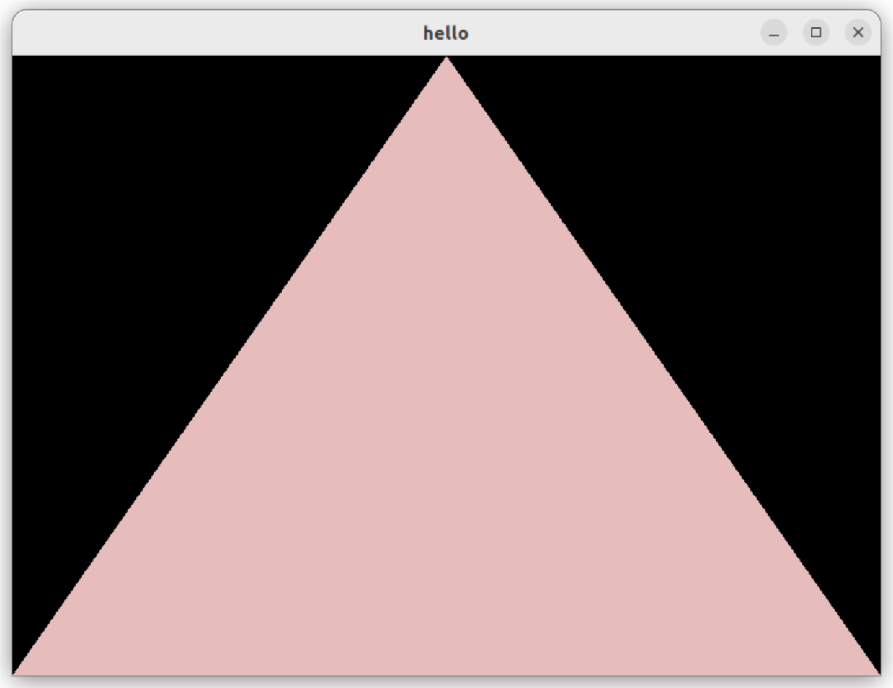
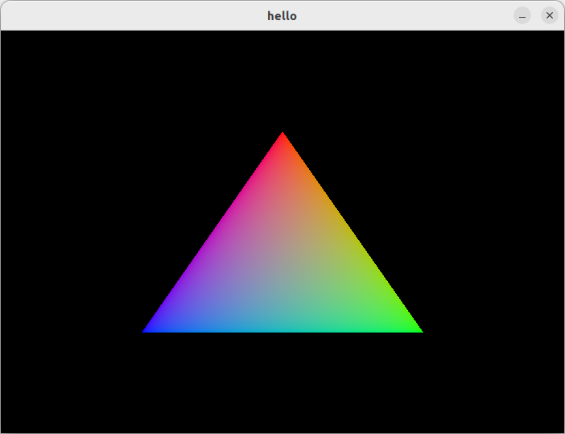

# Vulkan Note

## cached

* vulkan `VkAttachmentStoreOp`

	syntax:

	```c
	typedef enum VkAttachmentStoreOp {
		VK_ATTACHMENT_STORE_OP_STORE = 0,
		VK_ATTACHMENT_STORE_OP_DONT_CARE = 1,
	// Provided by VK_VERSION_1_3
		VK_ATTACHMENT_STORE_OP_NONE = 1000301000,
	// Provided by VK_KHR_dynamic_rendering, VK_KHR_load_store_op_none
		VK_ATTACHMENT_STORE_OP_NONE_KHR = VK_ATTACHMENT_STORE_OP_NONE,
	// Provided by VK_QCOM_render_pass_store_ops
		VK_ATTACHMENT_STORE_OP_NONE_QCOM = VK_ATTACHMENT_STORE_OP_NONE,
	// Provided by VK_EXT_load_store_op_none
		VK_ATTACHMENT_STORE_OP_NONE_EXT = VK_ATTACHMENT_STORE_OP_NONE,
	} VkAttachmentStoreOp;
	```

	渲染完成后，结果是否需要写回 attachment 显存。

	`VK_ATTACHMENT_STORE_OP_STORE`指的是写回显存。

	`VK_ATTACHMENT_STORE_OP_DONT_CARE`是不写回。

	`VK_ATTACHMENT_STORE_OP_NONE`表示没有 access 权限。

	疑问：既然要写回显存，那么 render pass 渲染生成的图像，一开始是放在哪里呢？

* vulkan `VkAttachmentLoadOp`

	可选的值有这些：

	```c
	typedef enum VkAttachmentLoadOp {
		VK_ATTACHMENT_LOAD_OP_LOAD = 0,
		VK_ATTACHMENT_LOAD_OP_CLEAR = 1,
		VK_ATTACHMENT_LOAD_OP_DONT_CARE = 2,
	// Provided by VK_KHR_load_store_op_none
		VK_ATTACHMENT_LOAD_OP_NONE_KHR = 1000400000,
	// Provided by VK_EXT_load_store_op_none
		VK_ATTACHMENT_LOAD_OP_NONE_EXT = VK_ATTACHMENT_LOAD_OP_NONE_KHR,
	} VkAttachmentLoadOp;
	```

	猜测：`VK_ATTACHMENT_LOAD_OP_LOAD`是将 vkimage 的值设置成新 load 的 texture 的值。

	`VK_ATTACHMENT_LOAD_OP_CLEAR`是将 image 设置为指定值。

	`VK_ATTACHMENT_LOAD_OP_DONT_CARE`是不需要额外设置，只是将其作为缓冲区。

	`VK_ATTACHMENT_LOAD_OP_NONE_KHR`表示这个 image 没有 access 权限。一般不怎么用到。

* vulkan tutorial Multisampling

    <https://vulkan-tutorial.com/Multisampling>

* vulkan `VkPipelineMultisampleStateCreateInfo`

	multisample 指的是抗锯齿，将一个像素中放置多个采样点，然后计算采样点是否在小三角形范围内，然后根据采样点的多少决定像素颜色的深浅。

	syntax:

	```c
	typedef struct VkPipelineMultisampleStateCreateInfo {
		VkStructureType                          sType;
		const void*                              pNext;
		VkPipelineMultisampleStateCreateFlags    flags;
		VkSampleCountFlagBits                    rasterizationSamples;
		VkBool32                                 sampleShadingEnable;
		float                                    minSampleShading;
		const VkSampleMask*                      pSampleMask;
		VkBool32                                 alphaToCoverageEnable;
		VkBool32                                 alphaToOneEnable;
	} VkPipelineMultisampleStateCreateInfo;
	```

	sample count:

	```c
	typedef enum VkSampleCountFlagBits {
		VK_SAMPLE_COUNT_1_BIT = 0x00000001,
		VK_SAMPLE_COUNT_2_BIT = 0x00000002,
		VK_SAMPLE_COUNT_4_BIT = 0x00000004,
		VK_SAMPLE_COUNT_8_BIT = 0x00000008,
		VK_SAMPLE_COUNT_16_BIT = 0x00000010,
		VK_SAMPLE_COUNT_32_BIT = 0x00000020,
		VK_SAMPLE_COUNT_64_BIT = 0x00000040,
	} VkSampleCountFlagBits;
	```

	其余的几个字段暂时不懂啥意思。

* vulkan pipeline input assembly 指的好像是跳过一部分 index buffer 中的数据

	syntax:

	```cpp
	typedef struct VkPipelineInputAssemblyStateCreateInfo {
		VkStructureType                            sType;
		const void*                                pNext;
		VkPipelineInputAssemblyStateCreateFlags    flags;
		VkPrimitiveTopology                        topology;
		VkBool32                                   primitiveRestartEnable;
	} VkPipelineInputAssemblyStateCreateInfo;
	```

	官方文档是这么写的：

	> Each draw is made up of zero or more vertices and zero or more instances, which are processed by the device and result in the assembly of primitives.

	> Restarting the assembly of primitives discards the most recent index values if those elements formed an incomplete primitive, and restarts the primitive assembly using the subsequent indices
	
	具体是怎么做的目前仍不太清楚。

	目前仍不太清楚原理。

	通常我们选的`topology`为`VK_PRIMITIVE_TOPOLOGY_TRIANGLE_LIST`。

* `vulkan`中`VK_SUBPASS_CONTENTS_INLINE`指的似乎是 subpass 和 command buffer 的关系。

    spec 上是这样写的：

    ```cpp
    typedef enum VkSubpassContents {
        VK_SUBPASS_CONTENTS_INLINE = 0,
        VK_SUBPASS_CONTENTS_SECONDARY_COMMAND_BUFFERS = 1,
    // Provided by VK_EXT_nested_command_buffer
        VK_SUBPASS_CONTENTS_INLINE_AND_SECONDARY_COMMAND_BUFFERS_EXT = 1000451000,
    } VkSubpassContents;
    ```

    > `VK_SUBPASS_CONTENTS_INLINE` specifies that the contents of the subpass will be recorded inline in the primary command buffer, and secondary command buffers must not be executed within the subpass.

    这个好像是在说，第一个 subpass 只能被记录在主 command buffer 中，不能被记录在次级 command buffer 中。

* vulkan 中`VkPipelineColorBlendStateCreateInfo`的含义

    `logicOpEnable`与`logicOp`的作用：

    > The application can enable a logical operation between the fragment’s color values and the existing value in the framebuffer attachment. This logical operation is applied prior to updating the framebuffer attachment. Logical operations are applied only for signed and unsigned integer and normalized integer framebuffers. Logical operations are not applied to floating-point or sRGB format color attachments.

    vulkan 支持在 fragment color 输出的结果，与当前已存在的 frame buffer 做一次按位逻辑操作，然后再把结果存到 frame buffer 里。

    这里的位操作只支持整数存储的图片数据， 不支持浮点点和 sRGB 存储的图片数据。

    `blendConstants`:

    Blend Factors 用于根据 alpha 值混合 fragment output color 和 framebuffer 的颜色。

    常见的模式有：

    ```cpp
    typedef enum VkBlendFactor {
        VK_BLEND_FACTOR_ZERO = 0,
        VK_BLEND_FACTOR_ONE = 1,
        VK_BLEND_FACTOR_SRC_COLOR = 2,
        VK_BLEND_FACTOR_ONE_MINUS_SRC_COLOR = 3,
        VK_BLEND_FACTOR_DST_COLOR = 4,
        VK_BLEND_FACTOR_ONE_MINUS_DST_COLOR = 5,
        VK_BLEND_FACTOR_SRC_ALPHA = 6,
        VK_BLEND_FACTOR_ONE_MINUS_SRC_ALPHA = 7,
        VK_BLEND_FACTOR_DST_ALPHA = 8,
        VK_BLEND_FACTOR_ONE_MINUS_DST_ALPHA = 9,
        VK_BLEND_FACTOR_CONSTANT_COLOR = 10,
        VK_BLEND_FACTOR_ONE_MINUS_CONSTANT_COLOR = 11,
        VK_BLEND_FACTOR_CONSTANT_ALPHA = 12,
        VK_BLEND_FACTOR_ONE_MINUS_CONSTANT_ALPHA = 13,
        VK_BLEND_FACTOR_SRC_ALPHA_SATURATE = 14,
        VK_BLEND_FACTOR_SRC1_COLOR = 15,
        VK_BLEND_FACTOR_ONE_MINUS_SRC1_COLOR = 16,
        VK_BLEND_FACTOR_SRC1_ALPHA = 17,
        VK_BLEND_FACTOR_ONE_MINUS_SRC1_ALPHA = 18,
    } VkBlendFactor;
    ```

    其中的 constant 指的就是`blendConstants`指定的混合常数。

    具体是怎么混合的，仍然不清楚。

* `VkPipelineColorBlendAttachmentState`中`colorWriteMask`必须写上，无论`blendEnable`是否为`VK_FALSE`都不能省略。

* vulkan 的 fence 在创建时要加一个`VK_FENCE_CREATE_SIGNALED_BIT`的 flag，表示一开始就能对它使用 wait。

    其实 fence 也是一个 semaphore。

* 在`VkBufferCreateInfo`中，如果`sharingMode`是`VK_SHARING_MODE_EXCLUSIVE`，那么`queueFamilyIndexCount`可以直接写 0，当然`pQueueFamilyIndices`也不用填了。

* vulkan 在创建 renderpass 和 pipeline 时，并不涉及到 frame buffer

    在 cmd draw 的时候，才会用到 frame buffer

* vulkan 画一个三角形的代码（2024.03.06）

    见`ref_2`。

    这份代码虽然仍不完整，但是已经算是比较简洁的了。没有用到 c++ 的特性，减少了很多麻烦。

    `shader.vert`:

    ```glsl
    #version 450

    layout(location = 0) in vec3 pos;

    void main()
    {
        gl_Position = vec4(pos, 1);
    }
    ```

    `shader.frag`:

    ```glsl
    #version 450

    layout(location = 0) out vec3 color;

    void main()
    {
        color = vec3(0.5, 0.8, 0.5);
    }
    ```

    `Makefile`:

    ```makefile
    main: main.cpp vert.spv frag.spv
        g++ -g main.cpp -lglfw -lvulkan -ldl -lpthread -lX11 -lXxf86vm -lXrandr -lXi -o main

    vert.spv: shader.vert
        glslc shader.vert -o vert.spv

    frag.spv: shader.frag
        glslc shader.frag -o frag.spv
    ```

    compile: `make`

    run: `./main`

* vulkan 中的 shader module 不区分 vertex shader 和 fragment shader

* 要先创建 render pass，再创建 pipeline

    render pass 比 pipeline 的架构更大，创建好一个 render pass 后，创建多个 pipeline，然后逐个挂载到这个 render pass 上。

* `VkFormat`

    `44`对应的是`VK_FORMAT_B8G8R8A8_UNORM`，`50`对应的是`VK_FORMAT_B8G8R8A8_SRGB`。

* `VkColorSpaceKHR`

    `0`对应的是`VK_COLOR_SPACE_SRGB_NONLINEAR_KHR`。

* vulkan 中 validation layer 的 callback 函数

    ```cpp
    VkBool32 dbg_callback(VkDebugUtilsMessageSeverityFlagBitsEXT severity,
        VkDebugUtilsMessageTypeFlagsEXT msg_type,
        const VkDebugUtilsMessengerCallbackDataEXT *p_msg,
        void *p_user_data)
    {
        printf("validation layer: %s\n", p_msg->pMessage);
        return VK_FALSE;
    }
    ```

    * 返回值类型必须是`VkBool32`，不能是`VkResult`。因为`VkResult`其实是枚举类型，而枚举的值又是 int 值。而`VkBool32`其实是 unsigned int。因此这两个不能转换。

    * 第一个参数必须是`VkDebugUtilsMessageSeverityFlagBitsEXT`类型，不能是`VkDebugUtilsMessageSeverityFlagsEXT`

        因为`VkDebugUtilsMessageSeverityFlagsEXT`是`uint32_t`，而`VkDebugUtilsMessageSeverityFlagBitsEXT`是枚举，枚举的值是字面量的类型`int`。

    * 第 3 个参数必须加`const`修饰。

* `glfwInit();`必须在`vkCreateInstance()`之前就执行，不然`glfwCreateWindowSurface()`无法执行成功。

* vulkan 一个 queue family 中有多少个 queue？

* 使用`vkGetPhysicalDeviceSurfaceFormatsKHR()`拿到 swapchain image 的 format

    这个 format 可能有多个，我们主要使用的是`VK_FORMAT_B8G8R8A8_SRGB`。

## 安装

```bash
sudo apt install vulkan-tools
sudo apt install libvulkan-dev
sudo apt install vulkan-validationlayers-dev spirv-tools
```

测试：

```bash
vkcube
```

* image formats 似乎不影响，因为 example code 直接就用了第一个：

    ```cpp
    VkSurfaceFormatKHR chooseSwapSurfaceFormat(const std::vector<VkSurfaceFormatKHR>& availableFormats) {
        for (const auto& availableFormat : availableFormats) {
            if (availableFormat.format == VK_FORMAT_B8G8R8A8_SRGB && availableFormat.colorSpace == VK_COLOR_SPACE_SRGB_NONLINEAR_KHR) {
                return availableFormat;
            }
        }

        return availableFormats[0];  // 如果找不到合适的，就直接使用第一个
    }
    ```

* vulkan 的 surface extent 大小可能会超过窗口所允许的最大值，此时需要裁剪

    ```cpp
    VkExtent2D chooseSwapExtent(GLFWwindow *window, const VkSurfaceCapabilitiesKHR& capabilities) {
        if (capabilities.currentExtent.width != std::numeric_limits<uint32_t>::max()) {
            return capabilities.currentExtent;
        } else {
            int width, height;
            glfwGetFramebufferSize(window, &width, &height);

            VkExtent2D actualExtent = {
                static_cast<uint32_t>(width),
                static_cast<uint32_t>(height)
            };

            actualExtent.width = std::clamp(actualExtent.width, capabilities.minImageExtent.width, capabilities.maxImageExtent.width);
            actualExtent.height = std::clamp(actualExtent.height, capabilities.minImageExtent.height, capabilities.maxImageExtent.height);

            return actualExtent;
        }
    }
    ```

    目前似乎还没有遇到过这种现象。

## resources

### specification

所有的说明都在这里了，非常详细：

<https://registry.khronos.org/vulkan/specs/1.3-extensions/html/vkspec.html#preamble>

<https://stackoverflow.com/questions/60592369/vulkan-timeline-semaphore-extension-cannot-be-enabled>

### tutorial

vulkan tutorial: <https://vulkan-tutorial.com/Introduction>

这个是网页版的，如果不想看电子版，还可以下载 pdf 版。

## 第一份代码

`main.cpp`

```cpp
#define GLFW_INCLUDE_VULKAN
#include <GLFW/glfw3.h>
#define GLM_FORCE_RADIANS
#define GLM_FORCE_DEPTH_ZERO_TO_ONE
#include <glm/vec4.hpp>
#include <glm/mat4x4.hpp>
#include <iostream>

int main() {
    glfwInit();
    glfwWindowHint(GLFW_CLIENT_API, GLFW_NO_API);
    GLFWwindow* window = glfwCreateWindow(800, 600, "Vulkan window", nullptr, nullptr);
    uint32_t extensionCount = 0;
    vkEnumerateInstanceExtensionProperties(nullptr, &extensionCount, nullptr);
    std::cout << extensionCount << " extensions supported\n";
    glm::mat4 matrix;
    glm::vec4 vec;
    auto test = matrix * vec;
    while(!glfwWindowShouldClose(window)) {
        glfwPollEvents();
    }
    glfwDestroyWindow(window);
    glfwTerminate();
    return 0;
}
```

编译：

```bash
g++ -g main.cpp -lglfw -lvulkan -ldl -lpthread -lX11 -lXxf86vm -lXrandr -lXi -o main
```

运行：

```bash
./main
```

## Vulkan instance creation

### final code

最终可以这样写，将创建 instance 的过程模块化，几乎每个模块都可以选择性地添加：

`main.cpp`:

```cpp
#define GLFW_INCLUDE_VULKAN  // 不写这一行会编译报错
#include <GLFW/glfw3.h>
#include <vector>
#include <iostream>
using namespace std;

void collect_glfw_required_inst_exts(vector<const char*> &glfw_required_inst_exts)
{
    uint32_t ext_count;
    const char **exts = glfwGetRequiredInstanceExtensions(&ext_count);
    glfw_required_inst_exts.assign(exts, exts + ext_count);
    
    printf("glfw requires %d vulkan instance extensions:\n", ext_count);
    for (int i = 0; i < ext_count; ++i)
        printf("    %d: %s\n", i, exts[i]);
}

void collect_validation_required_inst_exts(vector<const char*> &validation_required_inst_exts)
{
    validation_required_inst_exts.push_back("VK_EXT_debug_utils");
}

void collect_validation_required_inst_layers(vector<const char*> &validation_required_inst_layers)
{
    validation_required_inst_layers.push_back("VK_LAYER_KHRONOS_validation");
}

void collect_vk_inst_enabled_exts(vector<const char*> &enabled_inst_exts)
{
    vector<const char*> glfw_required_inst_exts;
    collect_glfw_required_inst_exts(glfw_required_inst_exts);

    vector<const char*> validation_required_inst_exts;
    collect_validation_required_inst_exts(validation_required_inst_exts);

    enabled_inst_exts.insert(enabled_inst_exts.begin(), 
        glfw_required_inst_exts.begin(), glfw_required_inst_exts.end());
    enabled_inst_exts.insert(enabled_inst_exts.begin(),
        validation_required_inst_exts.begin(), validation_required_inst_exts.end());
}

void collect_vk_inst_enabled_layers(vector<const char*> &enabled_inst_layers)
{
    vector<const char*> validation_required_inst_layers;
    collect_validation_required_inst_layers(validation_required_inst_layers);

    enabled_inst_layers.insert(enabled_inst_layers.begin(),
        validation_required_inst_layers.begin(), validation_required_inst_layers.end());
}

VkBool32 dbg_callback(VkDebugUtilsMessageSeverityFlagBitsEXT severity,
    VkDebugUtilsMessageTypeFlagsEXT msg_type,
    const VkDebugUtilsMessengerCallbackDataEXT *p_callback_data,
    void *p_user_data)
{
    printf("validation layer: %s\n", p_callback_data->pMessage);
    return VK_FALSE;
}

void create_vulkan_instance(VkInstance &inst)
{
    VkInstanceCreateInfo inst_crt_info{};  // 大括号的作用是置零所有字段，尤其是 pNext
    inst_crt_info.sType = VK_STRUCTURE_TYPE_INSTANCE_CREATE_INFO;

    vector<const char*> inst_enabled_exts, inst_enabled_layers;
    collect_vk_inst_enabled_exts(inst_enabled_exts);
    collect_vk_inst_enabled_layers(inst_enabled_layers);
    inst_crt_info.enabledExtensionCount = inst_enabled_exts.size();
    inst_crt_info.ppEnabledExtensionNames = inst_enabled_exts.data();
    inst_crt_info.enabledLayerCount = inst_enabled_layers.size();
    inst_crt_info.ppEnabledLayerNames = inst_enabled_layers.data();

    VkApplicationInfo app_info{};
    app_info.sType = VK_STRUCTURE_TYPE_APPLICATION_INFO;
    app_info.apiVersion = VK_API_VERSION_1_0;  // 有时候可能会用到 vulkan 1.2 的特性，如果代码中用到了，需要在这里改
    app_info.applicationVersion = VK_MAKE_VERSION(1, 0, 0);
    app_info.engineVersion = VK_MAKE_VERSION(1, 0, 0);
    app_info.pApplicationName = "hello";
    app_info.pEngineName = "no engine";
    inst_crt_info.pApplicationInfo = &app_info;

    VkDebugUtilsMessengerCreateInfoEXT dbg_msgr_crt_info{};
    dbg_msgr_crt_info.sType = VK_STRUCTURE_TYPE_DEBUG_UTILS_MESSENGER_CREATE_INFO_EXT;
    dbg_msgr_crt_info.messageSeverity = VK_DEBUG_UTILS_MESSAGE_SEVERITY_WARNING_BIT_EXT |
        VK_DEBUG_UTILS_MESSAGE_SEVERITY_INFO_BIT_EXT |
        VK_DEBUG_UTILS_MESSAGE_SEVERITY_ERROR_BIT_EXT |
        VK_DEBUG_UTILS_MESSAGE_SEVERITY_VERBOSE_BIT_EXT;
    dbg_msgr_crt_info.messageType = VK_DEBUG_UTILS_MESSAGE_TYPE_GENERAL_BIT_EXT |
        VK_DEBUG_UTILS_MESSAGE_TYPE_VALIDATION_BIT_EXT |
        VK_DEBUG_UTILS_MESSAGE_TYPE_PERFORMANCE_BIT_EXT;
    dbg_msgr_crt_info.pfnUserCallback = dbg_callback;
    inst_crt_info.pNext = &dbg_msgr_crt_info;

    VkResult result = vkCreateInstance(&inst_crt_info, nullptr, &inst);
    if (result != VK_SUCCESS)
    {
        printf("fail to create a vulkan instance\n");
        exit(-1);
    }
}

int main()
{
    glfwInit();  // 如果不初始化 glfw 环境，后面会拿不到 glfw required instance extensions
    VkInstance inst;
    create_vulkan_instance(inst);
    printf("successfully create a vulkan instance.\n");
    return 0;
}
```

编译：

```Makefile
main: main.cpp
	g++ -g main.cpp -lglfw -lvulkan -o main
```

运行：

```bash
./main
```

这份代码里的函数和命名也都做了优化，应该不会变动太大了。

为什么这里用`printf()`而不用`cout`，因为`cout`比较适合处理流处理，这里只需要输出格式化的字符串就可以，没有流数据的需求，所以直接用`printf()`了。

### instance extensions

枚举 vulkan 支持的 extension 和 glfw 需要的 extension：

```cpp
#define GLFW_INCLUDE_VULKAN
#include <GLFW/glfw3.h>
#include <iostream>
#include <vector>
using namespace std;

int main()
{
    unsigned int glfw_extension_count = 0;
    glfwInit();
    const char **glfw_extensions = glfwGetRequiredInstanceExtensions(&glfw_extension_count);

    uint32_t extension_count = -1;
    vkEnumerateInstanceExtensionProperties(nullptr, &extension_count, nullptr);
    vector<VkExtensionProperties> extensions(extension_count);
    vkEnumerateInstanceExtensionProperties(nullptr, &extension_count, extensions.data());

    std::cout << "available extensions:\n";
    for (const auto& extension : extensions) {
        cout << '\t' << extension.extensionName << '\n';
    }

    cout << "glfw required instance extensions" << endl;
    for (int i = 0; i < glfw_extension_count; ++i) {
        cout << glfw_extensions[i] << endl;
    }
    return 0;
}
```

编译：

```bash
g++ -g main.cpp -lglfw -lvulkan -ldl -lpthread -lX11 -lXxf86vm -lXrandr -lXi -o main
```

运行：

```bash
./main
```

输出：

```
available extensions:
        VK_KHR_device_group_creation
        VK_KHR_display
        VK_KHR_external_fence_capabilities
        VK_KHR_external_memory_capabilities
        VK_KHR_external_semaphore_capabilities
        VK_KHR_get_display_properties2
        VK_KHR_get_physical_device_properties2
        VK_KHR_get_surface_capabilities2
        VK_KHR_surface
        VK_KHR_surface_protected_capabilities
        VK_KHR_wayland_surface
        VK_KHR_xcb_surface
        VK_KHR_xlib_surface
        VK_EXT_acquire_drm_display
        VK_EXT_acquire_xlib_display
        VK_EXT_debug_report
        VK_EXT_direct_mode_display
        VK_EXT_display_surface_counter
        VK_EXT_debug_utils
glfw required instance extensions
VK_KHR_surface
VK_KHR_xcb_surface
```

### validation layer

validation layer 主要用于输出 vulkan 驱动在执行时的各种细节，尤其是报错信息。

如果不加 validation layer，vulkan 出错时可能会直接 segmentation fault，或者什么错也不报，继续运行。

validation layer 的创建方式有两种，一种是随 instance 一起创建，这样可以监控到 instance 创建时的 bug；另一种是等 instance 创建好后，再 attach 到 instance 上，显然这样无法监控 instance 在创建时报的 bug。

There were formerly two different types of validation layers in Vulkan: instance and device specific.

The idea was that instance layers would only check calls related to global Vulkan objects like instances, and device specific layers would only check calls related to a specific GPU. Device specific layers have now been deprecated, which means that instance validation layers apply to all Vulkan calls. The specification document still recommends that you enable validation layers at device level as well for compatibility,

#### check out validation layer support

```cpp
#define GLFW_INCLUDE_VULKAN
#include <GLFW/glfw3.h>
#include <iostream>
#include <vector>
#include <string>
using namespace std;

int main()
{
    unsigned int glfw_extension_count = 0;
    glfwInit();
    const char **glfw_extensions = glfwGetRequiredInstanceExtensions(&glfw_extension_count);

    uint32_t extension_count = -1;
    vkEnumerateInstanceExtensionProperties(nullptr, &extension_count, nullptr);
    vector<VkExtensionProperties> extensions(extension_count);
    vkEnumerateInstanceExtensionProperties(nullptr, &extension_count, extensions.data());

    cout << "available extensions:" << endl;
    for (const auto& extension : extensions) {
        cout << '\t' << extension.extensionName << '\n';
    }

    cout << "glfw required instance extensions" << endl;
    for (int i = 0; i < glfw_extension_count; ++i) {
        cout << glfw_extensions[i] << endl;
    }

    // list available layers
    uint32_t layer_count = -1;
    vkEnumerateInstanceLayerProperties(&layer_count, nullptr);
    vector<VkLayerProperties> available_layers(layer_count);
    vkEnumerateInstanceLayerProperties(&layer_count, available_layers.data());
    cout << "------------" << endl;
    cout << "available layers:" << endl;
    for (VkLayerProperties &layer: available_layers) {
        cout << layer.layerName << endl;
    }

    // check if validation layer exists
    const char *validation_layer_name = "VK_LAYER_KHRONOS_validation";
    bool is_validation_layer_exist = false;
    for (VkLayerProperties &layer: available_layers) {
        if (string(layer.layerName) == validation_layer_name) {
            is_validation_layer_exist = true;
            break;
        }
    }
    cout << "------------" << endl;
    if (!is_validation_layer_exist) {
        cout << "error: validation layer doesn't exist" << endl;
        return -1;
    } else {
        cout << "OK: validation layer exists" << endl;
    }
    return 0;
}
```

输出：

```
available extensions:
	VK_KHR_device_group_creation
	VK_KHR_display
	VK_KHR_external_fence_capabilities
	VK_KHR_external_memory_capabilities
	VK_KHR_external_semaphore_capabilities
	VK_KHR_get_display_properties2
	VK_KHR_get_physical_device_properties2
	VK_KHR_get_surface_capabilities2
	VK_KHR_surface
	VK_KHR_surface_protected_capabilities
	VK_KHR_wayland_surface
	VK_KHR_xcb_surface
	VK_KHR_xlib_surface
	VK_EXT_acquire_drm_display
	VK_EXT_acquire_xlib_display
	VK_EXT_debug_report
	VK_EXT_direct_mode_display
	VK_EXT_display_surface_counter
	VK_EXT_debug_utils
glfw required instance extensions
VK_KHR_surface
VK_KHR_xcb_surface
------------
available layers:
VK_LAYER_MESA_device_select
VK_LAYER_KHRONOS_validation
VK_LAYER_MESA_overlay
------------
OK: validation layer exists
```

validation layer 对应的名称为`"VK_LAYER_KHRONOS_validation"`。这个字符串并没有对应的宏。

为了使用 callback function，需要使用`VK_EXT_DEBUG_UTILS_EXTENSION_NAME` extension，这个宏等价于`"VK_EXT_debug_utils"`。

#### using `pNext` of instance creation info

Example code:

```cpp
#define GLFW_INCLUDE_VULKAN
#include <GLFW/glfw3.h>
#include <iostream>
#include <vector>
#include <string>
using namespace std;

static VKAPI_ATTR VkBool32 VKAPI_CALL debugCallback(VkDebugUtilsMessageSeverityFlagBitsEXT messageSeverity, VkDebugUtilsMessageTypeFlagsEXT messageType, const VkDebugUtilsMessengerCallbackDataEXT* pCallbackData, void* pUserData) {
    std::cerr << "validation layer: " << pCallbackData->pMessage << std::endl;

    return VK_FALSE;
}

int main()
{
    VkApplicationInfo app_info{};
    app_info.sType = VK_STRUCTURE_TYPE_APPLICATION_INFO;
    app_info.pApplicationName = "hello";
    app_info.applicationVersion = VK_MAKE_VERSION(1, 0, 0);
    app_info.pEngineName = "no engine";
    app_info.engineVersion = VK_MAKE_VERSION(1, 0, 0);
    app_info.apiVersion = VK_API_VERSION_1_0;

    VkInstanceCreateInfo inst_crt_info{};
    inst_crt_info.sType = VK_STRUCTURE_TYPE_INSTANCE_CREATE_INFO;
    inst_crt_info.pApplicationInfo = &app_info;
    uint32_t glfwExtensionCount = 0;
    glfwInit();
    const char** glfwExtensions = glfwGetRequiredInstanceExtensions(&glfwExtensionCount);
    if (glfwExtensions == nullptr) {
        cout << "fail to initialize glfw env" << endl;
        return -1;
    }
    vector<const char*> required_extensions(glfwExtensions, glfwExtensions + glfwExtensionCount);
    required_extensions.push_back("VK_EXT_debug_utils");  // this is required for outputing debug info
    inst_crt_info.enabledExtensionCount = required_extensions.size();
    inst_crt_info.ppEnabledExtensionNames = required_extensions.data();

    // list available layers
    uint32_t layer_count = -1;
    vkEnumerateInstanceLayerProperties(&layer_count, nullptr);
    vector<VkLayerProperties> available_layers(layer_count);
    vkEnumerateInstanceLayerProperties(&layer_count, available_layers.data());
    cout << "------------" << endl;
    cout << "available layers:" << endl;
    for (VkLayerProperties &layer: available_layers) {
        cout << layer.layerName << endl;
    }

    // check if validation layer exists
    const char *validation_layer_name = "VK_LAYER_KHRONOS_validation";
    bool is_validation_layer_exist = false;
    for (VkLayerProperties &layer: available_layers) {
        if (string(layer.layerName) == validation_layer_name) {
            is_validation_layer_exist = true;
            break;
        }
    }
    cout << "------------" << endl;
    if (!is_validation_layer_exist) {
        cout << "error: validation layer doesn't exist" << endl;
        return -1;
    } else {
        cout << "OK: validation layer exists" << endl;
    }

    // set validation layer name as one of enabled layer nemes
    inst_crt_info.enabledLayerCount = 1;
    vector<const char*> required_layers{validation_layer_name};
    inst_crt_info.ppEnabledLayerNames = required_layers.data();

    // set debug info callback function
    VkDebugUtilsMessengerCreateInfoEXT debugCreateInfo{};
    debugCreateInfo.sType = VK_STRUCTURE_TYPE_DEBUG_UTILS_MESSENGER_CREATE_INFO_EXT;
    debugCreateInfo.messageSeverity = VK_DEBUG_UTILS_MESSAGE_SEVERITY_VERBOSE_BIT_EXT | VK_DEBUG_UTILS_MESSAGE_SEVERITY_WARNING_BIT_EXT | VK_DEBUG_UTILS_MESSAGE_SEVERITY_ERROR_BIT_EXT;
    debugCreateInfo.messageType = VK_DEBUG_UTILS_MESSAGE_TYPE_GENERAL_BIT_EXT | VK_DEBUG_UTILS_MESSAGE_TYPE_VALIDATION_BIT_EXT | VK_DEBUG_UTILS_MESSAGE_TYPE_PERFORMANCE_BIT_EXT;
    debugCreateInfo.pfnUserCallback = debugCallback;
    inst_crt_info.pNext = (VkDebugUtilsMessengerCreateInfoEXT*) &debugCreateInfo;

    // create instance
    cout << "------------" << endl;
    cout << "start to create instance..." << endl;
    VkInstance instance;
    VkResult result = vkCreateInstance(&inst_crt_info, nullptr, &instance);
    if (result != VK_SUCCESS) {
        cout << "failed to create instance." << endl;
        return -1;
    } else {
        cout << "successfully create a vk instance." << endl;
    }

    return 0;
}
```

编译：

```bash
g++ -g main.cpp -lglfw -lvulkan -ldl -lpthread -lX11 -lXxf86vm -lXrandr -lXi -o main
```

输出：

```
------------
available layers:
VK_LAYER_MESA_device_select
VK_LAYER_KHRONOS_validation
VK_LAYER_MESA_overlay
------------
OK: validation layer exists
------------
start to create instance...
validation layer: Searching for ICD drivers named /usr/lib/i386-linux-gnu/libvulkan_lvp.so
validation layer: Searching for ICD drivers named /usr/lib/x86_64-linux-gnu/libvulkan_radeon.so
validation layer: Searching for ICD drivers named /usr/lib/i386-linux-gnu/libvulkan_radeon.so
validation layer: Searching for ICD drivers named /usr/lib/x86_64-linux-gnu/libvulkan_lvp.so
validation layer: Searching for ICD drivers named /usr/lib/i386-linux-gnu/libvulkan_intel.so
validation layer: Searching for ICD drivers named /usr/lib/x86_64-linux-gnu/libvulkan_intel.so
validation layer: Build ICD instance extension list
validation layer: Instance Extension: VK_KHR_device_group_creation (/usr/lib/x86_64-linux-gnu/libvulkan_radeon.so) version 0.0.1
validation layer: Instance Extension: VK_KHR_display (/usr/lib/x86_64-linux-gnu/libvulkan_radeon.so) version 0.0.23
validation layer: Instance Extension: VK_KHR_external_fence_capabilities (/usr/lib/x86_64-linux-gnu/libvulkan_radeon.so) version 0.0.1
validation layer: Instance Extension: VK_KHR_external_memory_capabilities (/usr/lib/x86_64-linux-gnu/libvulkan_radeon.so) version 0.0.1
validation layer: Instance Extension: VK_KHR_external_semaphore_capabilities (/usr/lib/x86_64-linux-gnu/libvulkan_radeon.so) version 0.0.1
validation layer: Instance Extension: VK_KHR_get_display_properties2 (/usr/lib/x86_64-linux-gnu/libvulkan_radeon.so) version 0.0.1
validation layer: Instance Extension: VK_KHR_get_physical_device_properties2 (/usr/lib/x86_64-linux-gnu/libvulkan_radeon.so) version 0.0.2
validation layer: Instance Extension: VK_KHR_get_surface_capabilities2 (/usr/lib/x86_64-linux-gnu/libvulkan_radeon.so) version 0.0.1
validation layer: Instance Extension: VK_KHR_surface (/usr/lib/x86_64-linux-gnu/libvulkan_radeon.so) version 0.0.25
validation layer: Instance Extension: VK_KHR_surface_protected_capabilities (/usr/lib/x86_64-linux-gnu/libvulkan_radeon.so) version 0.0.1
validation layer: Instance Extension: VK_KHR_wayland_surface (/usr/lib/x86_64-linux-gnu/libvulkan_radeon.so) version 0.0.6
validation layer: Instance Extension: VK_KHR_xcb_surface (/usr/lib/x86_64-linux-gnu/libvulkan_radeon.so) version 0.0.6
validation layer: Instance Extension: VK_KHR_xlib_surface (/usr/lib/x86_64-linux-gnu/libvulkan_radeon.so) version 0.0.6
validation layer: Instance Extension: VK_EXT_acquire_drm_display (/usr/lib/x86_64-linux-gnu/libvulkan_radeon.so) version 0.0.1
validation layer: Instance Extension: VK_EXT_acquire_xlib_display (/usr/lib/x86_64-linux-gnu/libvulkan_radeon.so) version 0.0.1
validation layer: Instance Extension: VK_EXT_debug_report (/usr/lib/x86_64-linux-gnu/libvulkan_radeon.so) version 0.0.10
validation layer: Instance Extension: VK_EXT_direct_mode_display (/usr/lib/x86_64-linux-gnu/libvulkan_radeon.so) version 0.0.1
validation layer: Instance Extension: VK_EXT_display_surface_counter (/usr/lib/x86_64-linux-gnu/libvulkan_radeon.so) version 0.0.1
validation layer: Instance Extension: VK_KHR_device_group_creation (/usr/lib/x86_64-linux-gnu/libvulkan_lvp.so) version 0.0.1
validation layer: Instance Extension: VK_KHR_external_fence_capabilities (/usr/lib/x86_64-linux-gnu/libvulkan_lvp.so) version 0.0.1
validation layer: Instance Extension: VK_KHR_external_memory_capabilities (/usr/lib/x86_64-linux-gnu/libvulkan_lvp.so) version 0.0.1
validation layer: Instance Extension: VK_KHR_external_semaphore_capabilities (/usr/lib/x86_64-linux-gnu/libvulkan_lvp.so) version 0.0.1
validation layer: Instance Extension: VK_KHR_get_physical_device_properties2 (/usr/lib/x86_64-linux-gnu/libvulkan_lvp.so) version 0.0.2
validation layer: Instance Extension: VK_KHR_get_surface_capabilities2 (/usr/lib/x86_64-linux-gnu/libvulkan_lvp.so) version 0.0.1
validation layer: Instance Extension: VK_KHR_surface (/usr/lib/x86_64-linux-gnu/libvulkan_lvp.so) version 0.0.25
validation layer: Instance Extension: VK_KHR_surface_protected_capabilities (/usr/lib/x86_64-linux-gnu/libvulkan_lvp.so) version 0.0.1
validation layer: Instance Extension: VK_KHR_wayland_surface (/usr/lib/x86_64-linux-gnu/libvulkan_lvp.so) version 0.0.6
validation layer: Instance Extension: VK_KHR_xcb_surface (/usr/lib/x86_64-linux-gnu/libvulkan_lvp.so) version 0.0.6
validation layer: Instance Extension: VK_KHR_xlib_surface (/usr/lib/x86_64-linux-gnu/libvulkan_lvp.so) version 0.0.6
validation layer: Instance Extension: VK_EXT_debug_report (/usr/lib/x86_64-linux-gnu/libvulkan_lvp.so) version 0.0.10
validation layer: Instance Extension: VK_KHR_device_group_creation (/usr/lib/x86_64-linux-gnu/libvulkan_intel.so) version 0.0.1
validation layer: Instance Extension: VK_KHR_display (/usr/lib/x86_64-linux-gnu/libvulkan_intel.so) version 0.0.23
validation layer: Instance Extension: VK_KHR_external_fence_capabilities (/usr/lib/x86_64-linux-gnu/libvulkan_intel.so) version 0.0.1
validation layer: Instance Extension: VK_KHR_external_memory_capabilities (/usr/lib/x86_64-linux-gnu/libvulkan_intel.so) version 0.0.1
validation layer: Instance Extension: VK_KHR_external_semaphore_capabilities (/usr/lib/x86_64-linux-gnu/libvulkan_intel.so) version 0.0.1
validation layer: Instance Extension: VK_KHR_get_display_properties2 (/usr/lib/x86_64-linux-gnu/libvulkan_intel.so) version 0.0.1
validation layer: Instance Extension: VK_KHR_get_physical_device_properties2 (/usr/lib/x86_64-linux-gnu/libvulkan_intel.so) version 0.0.2
validation layer: Instance Extension: VK_KHR_get_surface_capabilities2 (/usr/lib/x86_64-linux-gnu/libvulkan_intel.so) version 0.0.1
validation layer: Instance Extension: VK_KHR_surface (/usr/lib/x86_64-linux-gnu/libvulkan_intel.so) version 0.0.25
validation layer: Instance Extension: VK_KHR_surface_protected_capabilities (/usr/lib/x86_64-linux-gnu/libvulkan_intel.so) version 0.0.1
validation layer: Instance Extension: VK_KHR_wayland_surface (/usr/lib/x86_64-linux-gnu/libvulkan_intel.so) version 0.0.6
validation layer: Instance Extension: VK_KHR_xcb_surface (/usr/lib/x86_64-linux-gnu/libvulkan_intel.so) version 0.0.6
validation layer: Instance Extension: VK_KHR_xlib_surface (/usr/lib/x86_64-linux-gnu/libvulkan_intel.so) version 0.0.6
validation layer: Instance Extension: VK_EXT_acquire_drm_display (/usr/lib/x86_64-linux-gnu/libvulkan_intel.so) version 0.0.1
validation layer: Instance Extension: VK_EXT_acquire_xlib_display (/usr/lib/x86_64-linux-gnu/libvulkan_intel.so) version 0.0.1
validation layer: Instance Extension: VK_EXT_debug_report (/usr/lib/x86_64-linux-gnu/libvulkan_intel.so) version 0.0.10
validation layer: Instance Extension: VK_EXT_direct_mode_display (/usr/lib/x86_64-linux-gnu/libvulkan_intel.so) version 0.0.1
validation layer: Instance Extension: VK_EXT_display_surface_counter (/usr/lib/x86_64-linux-gnu/libvulkan_intel.so) version 0.0.1
validation layer: Build ICD instance extension list
validation layer: Instance Extension: VK_KHR_device_group_creation (/usr/lib/x86_64-linux-gnu/libvulkan_radeon.so) version 0.0.1
validation layer: Instance Extension: VK_KHR_display (/usr/lib/x86_64-linux-gnu/libvulkan_radeon.so) version 0.0.23
validation layer: Instance Extension: VK_KHR_external_fence_capabilities (/usr/lib/x86_64-linux-gnu/libvulkan_radeon.so) version 0.0.1
validation layer: Instance Extension: VK_KHR_external_memory_capabilities (/usr/lib/x86_64-linux-gnu/libvulkan_radeon.so) version 0.0.1
validation layer: Instance Extension: VK_KHR_external_semaphore_capabilities (/usr/lib/x86_64-linux-gnu/libvulkan_radeon.so) version 0.0.1
validation layer: Instance Extension: VK_KHR_get_display_properties2 (/usr/lib/x86_64-linux-gnu/libvulkan_radeon.so) version 0.0.1
validation layer: Instance Extension: VK_KHR_get_physical_device_properties2 (/usr/lib/x86_64-linux-gnu/libvulkan_radeon.so) version 0.0.2
validation layer: Instance Extension: VK_KHR_get_surface_capabilities2 (/usr/lib/x86_64-linux-gnu/libvulkan_radeon.so) version 0.0.1
validation layer: Instance Extension: VK_KHR_surface (/usr/lib/x86_64-linux-gnu/libvulkan_radeon.so) version 0.0.25
validation layer: Instance Extension: VK_KHR_surface_protected_capabilities (/usr/lib/x86_64-linux-gnu/libvulkan_radeon.so) version 0.0.1
validation layer: Instance Extension: VK_KHR_wayland_surface (/usr/lib/x86_64-linux-gnu/libvulkan_radeon.so) version 0.0.6
validation layer: Instance Extension: VK_KHR_xcb_surface (/usr/lib/x86_64-linux-gnu/libvulkan_radeon.so) version 0.0.6
validation layer: Instance Extension: VK_KHR_xlib_surface (/usr/lib/x86_64-linux-gnu/libvulkan_radeon.so) version 0.0.6
validation layer: Instance Extension: VK_EXT_acquire_drm_display (/usr/lib/x86_64-linux-gnu/libvulkan_radeon.so) version 0.0.1
validation layer: Instance Extension: VK_EXT_acquire_xlib_display (/usr/lib/x86_64-linux-gnu/libvulkan_radeon.so) version 0.0.1
validation layer: Instance Extension: VK_EXT_debug_report (/usr/lib/x86_64-linux-gnu/libvulkan_radeon.so) version 0.0.10
validation layer: Instance Extension: VK_EXT_direct_mode_display (/usr/lib/x86_64-linux-gnu/libvulkan_radeon.so) version 0.0.1
validation layer: Instance Extension: VK_EXT_display_surface_counter (/usr/lib/x86_64-linux-gnu/libvulkan_radeon.so) version 0.0.1
validation layer: Build ICD instance extension list
validation layer: Instance Extension: VK_KHR_device_group_creation (/usr/lib/x86_64-linux-gnu/libvulkan_lvp.so) version 0.0.1
validation layer: Instance Extension: VK_KHR_external_fence_capabilities (/usr/lib/x86_64-linux-gnu/libvulkan_lvp.so) version 0.0.1
validation layer: Instance Extension: VK_KHR_external_memory_capabilities (/usr/lib/x86_64-linux-gnu/libvulkan_lvp.so) version 0.0.1
validation layer: Instance Extension: VK_KHR_external_semaphore_capabilities (/usr/lib/x86_64-linux-gnu/libvulkan_lvp.so) version 0.0.1
validation layer: Instance Extension: VK_KHR_get_physical_device_properties2 (/usr/lib/x86_64-linux-gnu/libvulkan_lvp.so) version 0.0.2
validation layer: Instance Extension: VK_KHR_get_surface_capabilities2 (/usr/lib/x86_64-linux-gnu/libvulkan_lvp.so) version 0.0.1
validation layer: Instance Extension: VK_KHR_surface (/usr/lib/x86_64-linux-gnu/libvulkan_lvp.so) version 0.0.25
validation layer: Instance Extension: VK_KHR_surface_protected_capabilities (/usr/lib/x86_64-linux-gnu/libvulkan_lvp.so) version 0.0.1
validation layer: Instance Extension: VK_KHR_wayland_surface (/usr/lib/x86_64-linux-gnu/libvulkan_lvp.so) version 0.0.6
validation layer: Instance Extension: VK_KHR_xcb_surface (/usr/lib/x86_64-linux-gnu/libvulkan_lvp.so) version 0.0.6
validation layer: Instance Extension: VK_KHR_xlib_surface (/usr/lib/x86_64-linux-gnu/libvulkan_lvp.so) version 0.0.6
validation layer: Instance Extension: VK_EXT_debug_report (/usr/lib/x86_64-linux-gnu/libvulkan_lvp.so) version 0.0.10
validation layer: Build ICD instance extension list
validation layer: Instance Extension: VK_KHR_device_group_creation (/usr/lib/x86_64-linux-gnu/libvulkan_intel.so) version 0.0.1
validation layer: Instance Extension: VK_KHR_display (/usr/lib/x86_64-linux-gnu/libvulkan_intel.so) version 0.0.23
validation layer: Instance Extension: VK_KHR_external_fence_capabilities (/usr/lib/x86_64-linux-gnu/libvulkan_intel.so) version 0.0.1
validation layer: Instance Extension: VK_KHR_external_memory_capabilities (/usr/lib/x86_64-linux-gnu/libvulkan_intel.so) version 0.0.1
validation layer: Instance Extension: VK_KHR_external_semaphore_capabilities (/usr/lib/x86_64-linux-gnu/libvulkan_intel.so) version 0.0.1
validation layer: Instance Extension: VK_KHR_get_display_properties2 (/usr/lib/x86_64-linux-gnu/libvulkan_intel.so) version 0.0.1
validation layer: Instance Extension: VK_KHR_get_physical_device_properties2 (/usr/lib/x86_64-linux-gnu/libvulkan_intel.so) version 0.0.2
validation layer: Instance Extension: VK_KHR_get_surface_capabilities2 (/usr/lib/x86_64-linux-gnu/libvulkan_intel.so) version 0.0.1
validation layer: Instance Extension: VK_KHR_surface (/usr/lib/x86_64-linux-gnu/libvulkan_intel.so) version 0.0.25
validation layer: Instance Extension: VK_KHR_surface_protected_capabilities (/usr/lib/x86_64-linux-gnu/libvulkan_intel.so) version 0.0.1
validation layer: Instance Extension: VK_KHR_wayland_surface (/usr/lib/x86_64-linux-gnu/libvulkan_intel.so) version 0.0.6
validation layer: Instance Extension: VK_KHR_xcb_surface (/usr/lib/x86_64-linux-gnu/libvulkan_intel.so) version 0.0.6
validation layer: Instance Extension: VK_KHR_xlib_surface (/usr/lib/x86_64-linux-gnu/libvulkan_intel.so) version 0.0.6
validation layer: Instance Extension: VK_EXT_acquire_drm_display (/usr/lib/x86_64-linux-gnu/libvulkan_intel.so) version 0.0.1
validation layer: Instance Extension: VK_EXT_acquire_xlib_display (/usr/lib/x86_64-linux-gnu/libvulkan_intel.so) version 0.0.1
validation layer: Instance Extension: VK_EXT_debug_report (/usr/lib/x86_64-linux-gnu/libvulkan_intel.so) version 0.0.10
validation layer: Instance Extension: VK_EXT_direct_mode_display (/usr/lib/x86_64-linux-gnu/libvulkan_intel.so) version 0.0.1
validation layer: Instance Extension: VK_EXT_display_surface_counter (/usr/lib/x86_64-linux-gnu/libvulkan_intel.so) version 0.0.1
successfully create a vk instance.
```

* 感觉在 vulkan 的 debug messenger callback 函数中，前两个参数可以都设置为`flag`，不需要区分到 flag bits。

    因为 flag bits 是枚举类型，实际上的类型是`uint32_t`，而`VkFlag`也是`uint32_t`，因此实际上是通用的。

    callback 函数的返回值类型也可以设置成`VkResult`，返回`VK_SUCCESS`。这样比`VkBool32`加`VK_FALSE`更明确一些。

    只需要记住顺序，先是 severity，然后才是 message type

#### using debug messenger

为了使用 debug messenger，我们首先需要启用`"VK_EXT_debug_utils"` extension，这个字符串等价于`VK_EXT_DEBUG_UTILS_EXTENSION_NAME`宏。

`messageType`对应的三种：

* VK_DEBUG_UTILS_MESSAGE_TYPE_GENERAL_BIT_EXT: Some event has hap-
pened that is unrelated to the specification or performance
* VK_DEBUG_UTILS_MESSAGE_TYPE_VALIDATION_BIT_EXT: Something has
happened that violates the specification or indicates a possible mistake
* VK_DEBUG_UTILS_MESSAGE_TYPE_PERFORMANCE_BIT_EXT: Potential non-
optimal use of Vulkan

`pCallbackData`比较重要的几个值：

* `pMessage`: The debug message as a null-terminated string
* `pObjects`: Array of Vulkan object handles related to the message
* `objectCount`: Number of objects in array

除了使用`pNext`创建，还可以显式指定：

```cpp
VkDebugUtilsMessengerCreateInfoEXT dm_crt_info;
dm_crt_info = {};
dm_crt_info.sType = VK_STRUCTURE_TYPE_DEBUG_UTILS_MESSENGER_CREATE_INFO_EXT;
dm_crt_info.messageSeverity = VK_DEBUG_UTILS_MESSAGE_SEVERITY_VERBOSE_BIT_EXT | VK_DEBUG_UTILS_MESSAGE_SEVERITY_WARNING_BIT_EXT | VK_DEBUG_UTILS_MESSAGE_SEVERITY_ERROR_BIT_EXT;
dm_crt_info.messageType = VK_DEBUG_UTILS_MESSAGE_TYPE_GENERAL_BIT_EXT | VK_DEBUG_UTILS_MESSAGE_TYPE_VALIDATION_BIT_EXT | VK_DEBUG_UTILS_MESSAGE_TYPE_PERFORMANCE_BIT_EXT;
dm_crt_info.pfnUserCallback = debugCallback;  // callback 函数

auto func = (PFN_vkCreateDebugUtilsMessengerEXT) vkGetInstanceProcAddr(instance, "vkCreateDebugUtilsMessengerEXT");  // 这里用到前面创建好的 vulkan instance
if (func != nullptr) {
    return func(instance, pCreateInfo, pAllocator, pDebugMessenger);
} else {
    return VK_ERROR_EXTENSION_NOT_PRESENT;
}
```

如果在创建 vulkan instance 时，没有指定 extension `VK_EXT_debug_utils`，那么会导致`vkGetInstanceProcAddr(instance, "vkCreateDebugUtilsMessengerEXT");`返回`nullptr`。

如果直接调用`vkCreateDebugUtilsMessengerEXT()`，那么会报错没有这个 symbol。所以其实我们可以直接用这个函数名字：

```cpp
auto vkCreateDebugUtilsMessengerEXT = (PFN_vkCreateDebugUtilsMessengerEXT) vkGetInstanceProcAddr(
    inst,
    "vkCreateDebugUtilsMessengerEXT");
VkResult result = vkCreateDebugUtilsMessengerEXT(inst, &dbg_msg_crt_info, nullptr, &dbg_messenger);
if (result != VK_SUCCESS)
{
    cout << "fail to create debug messenger" << endl;
    exit(-1);
}
cout << "successfully create the debug messenger" << endl;
```

Example:

```cpp
#define GLFW_INCLUDE_VULKAN
#include <GLFW/glfw3.h>
#include <iostream>
using namespace std;

VKAPI_ATTR VkBool32 VKAPI_CALL debugCallback(VkDebugUtilsMessageSeverityFlagBitsEXT messageSeverity, VkDebugUtilsMessageTypeFlagsEXT messageType, const VkDebugUtilsMessengerCallbackDataEXT* pCallbackData, void* pUserData) {
    std::cerr << "validation layer: " << pCallbackData->pMessage << std::endl;

    return VK_FALSE;
}

int main()
{
    VkApplicationInfo app_info{};
    app_info.sType = VK_STRUCTURE_TYPE_APPLICATION_INFO;
    app_info.applicationVersion = VK_MAKE_VERSION(1, 0, 0);
    app_info.pApplicationName = "hello";
    app_info.pEngineName = "no engine";
    app_info.engineVersion = VK_MAKE_VERSION(1, 0, 0);
    app_info.apiVersion = VK_API_VERSION_1_0;

    VkInstanceCreateInfo inst_crt_info{};
    inst_crt_info.sType = VK_STRUCTURE_TYPE_INSTANCE_CREATE_INFO;
    inst_crt_info.pApplicationInfo = &app_info;
    glfwInit();
    uint32_t extension_count;
    const char **glfw_extension_names = glfwGetRequiredInstanceExtensions(&extension_count);
    const char **extension_names = new const char*[extension_count + 1];
    for (int i = 0; i < extension_count; ++i)
    {
        extension_names[i] = glfw_extension_names[i];
    }
    extension_names[extension_count] = "VK_EXT_debug_utils";
    ++extension_count;
    inst_crt_info.enabledExtensionCount = extension_count;
    inst_crt_info.ppEnabledExtensionNames = extension_names;
    inst_crt_info.enabledLayerCount = 1;
    const char *layer = "VK_LAYER_KHRONOS_validation";
    inst_crt_info.ppEnabledLayerNames = &layer;
    VkInstance instance;
    VkResult rtn = vkCreateInstance(&inst_crt_info, nullptr, &instance);
    if (rtn != VK_SUCCESS)
    {
        cout << "fail to create vk instance" << endl;
    }
    cout << "successfully create vk instance" << endl;

    VkDebugUtilsMessengerCreateInfoEXT dm_crt_info{};
    dm_crt_info.sType = VK_STRUCTURE_TYPE_DEBUG_UTILS_MESSENGER_CREATE_INFO_EXT;
    dm_crt_info.messageSeverity = VK_DEBUG_UTILS_MESSAGE_SEVERITY_VERBOSE_BIT_EXT |
    VK_DEBUG_UTILS_MESSAGE_SEVERITY_WARNING_BIT_EXT |
    VK_DEBUG_UTILS_MESSAGE_SEVERITY_ERROR_BIT_EXT;
    dm_crt_info.messageType = 
        VK_DEBUG_UTILS_MESSAGE_TYPE_GENERAL_BIT_EXT |
        VK_DEBUG_UTILS_MESSAGE_TYPE_VALIDATION_BIT_EXT |
        VK_DEBUG_UTILS_MESSAGE_TYPE_PERFORMANCE_BIT_EXT;
    dm_crt_info.pfnUserCallback = debugCallback;
    VkDebugUtilsMessengerEXT dm;
    auto vkCreateDebugUtilsMessengerEXT = (PFN_vkCreateDebugUtilsMessengerEXT) vkGetInstanceProcAddr(instance, "vkCreateDebugUtilsMessengerEXT");
    rtn = vkCreateDebugUtilsMessengerEXT(instance, &dm_crt_info, nullptr, &dm);
    if (rtn != VK_SUCCESS)
    {
        cout << "fail to create debug messenger" << endl;
    }
    cout << "successfully create debug messenger" << endl;
    delete []extension_names;
    return 0;
}
```

编译：

```bash
g++ -g main.cpp -lglfw -lvulkan -ldl -lpthread -lX11 -lXxf86vm -lXrandr -lXi -o main
```

运行：

```
./main
```

输出：

```
successfully create vk instance
successfully create debug messenger
```

## physical device selection

### queue family

* vulkan 的 vk get physical device queue family properties() 返回的参数的类型却是 vk queue family properties。

    第一说明 queue family 是个只属于 physical device 的概念；
    
    第二，说明 vulkan 也觉得这个类型名实在是太长了，写全的话是 vk physical device queue family proeprties，快占半个屏幕了，没歧义的话能简化就简化

可以使用`vkGetPhysicalDeviceQueueFamilyProperties()`拿到一个 physical device 所支持的 queue family。

以 amd gpu 为例，可以拿到 3 个 queue family。

每个 queue family 又支持不同的指令集（功能集），Khronos 的 spec 上列出的指令集 bit 如下：

* `VK_QUEUE_GRAPHICS_BIT`

* `VK_QUEUE_COMPUTE_BIT`

* `VK_QUEUE_TRANSFER_BIT`

* `VK_QUEUE_SPARSE_BINDING_BIT`

* `VK_QUEUE_PROTECTED_BIT`

* `VK_QUEUE_VIDEO_DECODE_BIT_KHR`

* `VK_QUEUE_VIDEO_ENCODE_BIT_KHR`

* `VK_QUEUE_OPTICAL_FLOW_BIT_NV`

我们常用的主要是 graphics 和 compute。有意思的是，vk 规定，如果一个 queue family 支持 graphics，那么它必须支持 compute。

example:

```cpp
    vector<VkQueueFamilyProperties> queue_family_props;
    get_phy_dev_queue_family(phy_devs[0], queue_family_props);
    cout << "there are " << queue_family_props.size() << " queue families" << endl;
    for (int i = 0; i < queue_family_props.size(); ++i)
    {
        cout << i << ":" << endl;
        cout << queue_family_props[i].queueCount << endl;
        if (queue_family_props[i].queueFlags & VK_QUEUE_GRAPHICS_BIT)
        {
            cout << "support graphics" << endl;
        }
        if (queue_family_props[i].queueFlags & VK_QUEUE_COMPUTE_BIT)
        {
            cout << "support compute" << endl;
        }
        if (queue_family_props[i].queueFlags & VK_QUEUE_TRANSFER_BIT)
        {
            cout << "support transfer" << endl;
        }
    }
```

output:

```
there are 3 queue families
0:
1
support graphics
support compute
support transfer
1:
4
support compute
support transfer
2:
1
support transfer
```

## logic device and queue

逻辑设备（logic device）意味着物理设备（的一个子集）和指令队列（queue）的一个绑定，使用指令队列向物理设备发送渲染、计算指令。

或者说，指令队列其实是逻辑设备的一个资源，用于异步地完成指令。

或者说，逻辑设备是一个抽象对象，它的核心功能是维护了一个指令队列，用于异步地和物理设备交互。

逻辑设备可能只选取了物理设备的部分功能，因此它其实绑定的是物理设备的一个子集。

逻辑设备主要负责指令相关的操作，物理设备主要负责显存相关的操作。

### logic device creation

* 在创建 vulkan device 时，如果程序有显示画图的需要，那么需要为 device 增加一个 extension: `VK_KHR_SWAPCHAIN_EXTENSION_NAME`，或者叫`"VK_KHR_swapchain"`

### command queue

### present queue

### command pool and command buffer

* vulkan command pool 和 command buffer 的创建比较简单

    ```cpp
    VkCommandPool cmd_pool = create_command_pool(device, phy_dev, queue_family_idx);
    VkCommandBuffer cmd_buf;
    VkCommandBufferAllocateInfo cmd_buf_alc_info{};
    cmd_buf_alc_info.sType = VK_STRUCTURE_TYPE_COMMAND_BUFFER_ALLOCATE_INFO;
    cmd_buf_alc_info.commandBufferCount = 1;
    cmd_buf_alc_info.commandPool = cmd_pool;
    cmd_buf_alc_info.level = VK_COMMAND_BUFFER_LEVEL_PRIMARY;
    result = vkAllocateCommandBuffers(device, &cmd_buf_alc_info, &cmd_buf);
    if (result != VK_SUCCESS)
    {
        printf("fail to allocate command buffer\n");
        exit(-1);
    }
    ```

    按部就班，没有什么难理解的地方。

## Renderpass and Pipeline

* 不清楚为什么要在 pipeline 里填写 scissor 和 viewport 的信息

    vkCmd 的 scissor 和 viewport 和 pipeline 中的是一样的吗？

### Descriptor set

* 一个 binding `VkDescriptorSetLayoutBinding` 只描述资源的位置（location），类型（texture, storage, sampler 等）。并不绑定实际的数据。

    一个 binding 只描述一个资源位置的情况。一个 layout 描述的是多个 binding。

* 如果不使用 descriptor binding，那么可以使用`vkCmdBindVertexBuffers()`进行绑定。这个函数的参数里指定了要绑定的位置。

    这个好像不对。

* 没有单个 descriptor 的说法，只有 descriptor set 和 descriptor pool

* 在创建 descriptor layout binding 时，常用的`VkDescriptorType`:

    * `VK_DESCRIPTOR_TYPE_SAMPLER:`

    * `VK_DESCRIPTOR_TYPE_SAMPLED_IMAGE`

        A sampled image is an image that can be used in conjunction with a sampler to provide filtered data to a shader.

        sampled image can not be written to.

    * `VK_DESCRIPTOR_TYPE_STORAGE_IMAGE`

        A storage image is an image that cannot be used with a sampler but can be written to.

    * `VK_DESCRIPTOR_TYPE_UNIFORM_TEXEL_BUFFER`

        存放一些数据，不能被写入。

    * `VK_DESCRIPTOR_TYPE_STORAGE_TEXEL_BUFFER`

        存放一些数据，可以被写入。

    * `VK_DESCRIPTOR_TYPE_UNIFORM_BUFFER`, `VK_DESCRIPTOR_TYPE_STORAGE_BUFFER`

        和 texel buffer 很像，只不过其中的数据需要 shader 中的 struct 来解释。

* 一个 shader 可以绑定多个 set，从 0 开始编号，比如 set 0, set 1, ...

    每个 set 又有多个 binding，从 0 开始编号，比如 binding 0, bindinig 1, ...

    一个常见的 shader 可能是这种的：

    ```glsl
    #version 450 core
    layout (set = 0, binding = 0) uniform sampler2DmyTexture;
    layout (set = 0, binding = 2) uniform sampler3DmyLut;
    layout (set = 1, binding = 0) uniform myTransforms
    {
        mat4 transform1;
        mat3 transform2;
    };
    void main(void)
    {
        // Do nothing!
    }
    ```

* `VkDescriptorSetLayoutBinding`中的`stageFlags`不知道写啥可以写`VK_SHADER_STAGE_ALL`，通用。

    其他的几个 stage 可以参考官网说明：<https://registry.khronos.org/vulkan/specs/1.3-extensions/man/html/VkShaderStageFlagBits.html>

    这个 struct 中的`descriptorCount`表示一个 binding 处可以有多个 descriptor 资源，这个好像是使用偏移来区分不同的数据。

    比如每个 shader 拿到的是一个 20 个字节的数据，前 12 个字节表示的是 3 个 float 数，表示一个 rgb 的颜色。后面 8 个字节表示两个 float 数，表示一个 xy 的平面坐标。这样一个 binding 位置其实有两个 resource。

    目前还没找到 example，但是之前好像见到过，有空的话找找。

* `VkDescriptorSetLayoutCreateInfo`用的 flags 目前没什么用，直接设置成 0.

* `VkDescriptorPoolCreateInfo`中的`maxSets`是根据 frames in flight 的数量设置的。有多少个 frames 就将`maxSets`设置成几。

    目前还不清楚为什么要这样做。同一个 set 无法用在多个 render 过程中吗？

* `VkDescriptorPoolSize`规定了给不同类型的 descriptor 预留多少个位置。

    vulkan 文档里的解释是

    > descriptorCount is the number of descriptors of that type to allocate.

    目前仍不清楚这个参数的具体含义。

* 创建一个简单 descriptor set 的过程

    ```cpp
    VkDescriptorPoolCreateInfo desc_pool_crt_info{};
    desc_pool_crt_info.sType = VK_STRUCTURE_TYPE_DESCRIPTOR_POOL_CREATE_INFO;
    desc_pool_crt_info.flags = VK_DESCRIPTOR_POOL_CREATE_FREE_DESCRIPTOR_SET_BIT;
    desc_pool_crt_info.maxSets = 2;
    desc_pool_crt_info.poolSizeCount = 1;
    VkDescriptorPoolSize desc_pool_size{};
    desc_pool_size.type = VK_DESCRIPTOR_TYPE_STORAGE_BUFFER;
    desc_pool_size.descriptorCount = 2;
    desc_pool_crt_info.pPoolSizes = &desc_pool_size;
    VkDescriptorPool desc_pool;
    VkResult result = vkCreateDescriptorPool(device, &desc_pool_crt_info, nullptr, &desc_pool);
    if (result != VK_SUCCESS)
    {
        printf("fail to create descriptor pool, error code: %d\n", result);
        exit(-1);
    }

    VkDescriptorSetLayout desc_set_layout;
    VkDescriptorSetLayoutCreateInfo desc_set_layout_crt_info{};
    desc_set_layout_crt_info.sType = VK_STRUCTURE_TYPE_DESCRIPTOR_SET_LAYOUT_CREATE_INFO;
    desc_set_layout_crt_info.bindingCount = 1;
    VkDescriptorSetLayoutBinding desc_set_layout_binding{};
    desc_set_layout_binding.binding = 0;
    desc_set_layout_binding.descriptorType = VK_DESCRIPTOR_TYPE_STORAGE_BUFFER;
    desc_set_layout_binding.descriptorCount = 1;
    desc_set_layout_binding.stageFlags = VK_SHADER_STAGE_ALL;
    desc_set_layout_crt_info.pBindings = &desc_set_layout_binding;
    result = vkCreateDescriptorSetLayout(device, &desc_set_layout_crt_info, nullptr, &desc_set_layout);
    if (result != VK_SUCCESS)
    {
        printf("fail to create descriptor set layout, error code: %d\n", result);
        exit(-1);
    }

    VkDescriptorSet desc_set;
    VkDescriptorSetAllocateInfo desc_set_allo_info{};
    desc_set_allo_info.sType = VK_STRUCTURE_TYPE_DESCRIPTOR_SET_ALLOCATE_INFO;
    desc_set_allo_info.pSetLayouts = &desc_set_layout;
    desc_set_allo_info.descriptorSetCount = 1;
    desc_set_allo_info.descriptorPool = desc_pool;
    result = vkAllocateDescriptorSets(device, &desc_set_allo_info, &desc_set);
    if (result != VK_SUCCESS)
    {
        printf("fail to allocate descriptor set, error code: %d\n", result);
        exit(-1);
    }
    ```

    此时还不够，descriptor set 还需要集成到 pipeline set layout 中，才能起作用。

* vulkan descriptor sets

    猜测：

    1. 一个 descriptor 指的是一块显存和　shader 中一个 location　的绑定

    2. 一个 descriptor set 指的是一个 shader 中不同位置（location）的资源绑定情况

        具体如何绑定，由 descriptor set layout 指定。

    3. 为了提高效率，descriptor set 都从一个 pool 中申请。pool 意味着大小是有限的，所以 descriptor set 的数量也是有限的。

* descriptor set 主要是用来描述 uniform buffer 的

    在创建完 descriptor set layout 后，可以和 pipeline layout 绑定：

    ```cpp
    VkPipelineLayoutCreateInfo pipelineLayoutInfo{};
    pipelineLayoutInfo.sType = VK_STRUCTURE_TYPE_PIPELINE_LAYOUT_CREATE_INFO;
    pipelineLayoutInfo.setLayoutCount = 1;
    pipelineLayoutInfo.pSetLayouts = &desc_set_layout;
    pipelineLayoutInfo.pushConstantRangeCount = 0;
    VkPipelineLayout pipelineLayout;
    vkCreatePipelineLayout(device, &pipelineLayoutInfo, nullptr, &pipelineLayout);
    ```

    要写入 uniform buffer 的数据，可以使用`vkUpdateDescriptorSets()`:

    ```cpp
    float rgb[3] = {0.8, 0.5, 0.5};
    VkBuffer color_buf;
    VkDeviceMemory color_buf_mem;
    create_vk_buffer(color_buf, color_buf_mem, phy_dev, device, sizeof(float) * 3, 
        VK_BUFFER_USAGE_UNIFORM_BUFFER_BIT,
        VK_MEMORY_PROPERTY_DEVICE_LOCAL_BIT | VK_MEMORY_PROPERTY_HOST_VISIBLE_BIT);
    vkMapMemory(device, color_buf_mem, 0, VK_WHOLE_SIZE, 0, (void**) &p_mem_data);
    memcpy(p_mem_data, rgb, sizeof(rgb));
    vkUnmapMemory(device, color_buf_mem);

    VkWriteDescriptorSet wrt_desc_set{};
    wrt_desc_set.sType = VK_STRUCTURE_TYPE_WRITE_DESCRIPTOR_SET;
    wrt_desc_set.dstSet = desc_set;
    VkDescriptorBufferInfo desc_buf_info{};
    desc_buf_info.buffer = color_buf;
    wrt_desc_set.pBufferInfo = &desc_buf_info;
    wrt_desc_set.descriptorCount = 1;
    desc_buf_info.offset = 0;
    desc_buf_info.range = VK_WHOLE_SIZE;
    wrt_desc_set.descriptorType = VK_DESCRIPTOR_TYPE_UNIFORM_BUFFER;
    wrt_desc_set.dstArrayElement = 0;
    wrt_desc_set.dstBinding = 0;
    vkUpdateDescriptorSets(device, 1, &wrt_desc_set, 0, nullptr);
    ```

    在 record command buffer 时，不要忘了这个：

    ```cpp
    vkCmdBindDescriptorSets(cmd_buf, VK_PIPELINE_BIND_POINT_GRAPHICS,
        pipelineLayout, 0, 1, &desc_set, 0, nullptr);
    ```

    这一行和前面的`pipelineLayoutInfo.pSetLayouts = &desc_set_layout;`是相对应的，必须保持一致。

    这里用的是`desc_set`，而不是 layout。descriptor set 需要在 pool 中申请（allocate）。

    在 shader 中，vulkan 要求 uniform buffer 必须写成 bloack 的形式：

    `shader_2.vert`:

    ```glsl
    #version 450

    layout(location = 0) in vec3 inPosition;

    layout (binding = 0) uniform RGB {
        vec3 rgb;
    } rgbs;

    layout(location = 0) out vec3 frag_color;

    void main() {
        gl_Position = vec4(inPosition, 1.0);
        frag_color = rgbs.rgb;
    }
    ```

    `shader_2.frag`:

    ```glsl
    #version 450

    layout(location = 0) in vec3 frag_color;
    layout(location = 0) out vec3 outColor;

    void main() {
        outColor = vec3(0.5, 0.8, 0.5);
        outColor = frag_color;
    }
    ```

    运行后效果如下：

    <div style=text-align:center>
    
    </div>

A descriptor set specifies the actual buffer or image resources that will be bound to the descriptors.

```cpp
VkDescriptorSetLayout descriptorSetLayout;

void createDescriptorSetLayout() {
    VkDescriptorSetLayoutBinding uboLayoutBinding{};
    uboLayoutBinding.binding = 0;
    uboLayoutBinding.descriptorCount = 1;
    uboLayoutBinding.descriptorType = VK_DESCRIPTOR_TYPE_UNIFORM_BUFFER;
    uboLayoutBinding.pImmutableSamplers = nullptr;
    uboLayoutBinding.stageFlags = VK_SHADER_STAGE_VERTEX_BIT;

    VkDescriptorSetLayoutCreateInfo layoutInfo{};
    layoutInfo.sType = VK_STRUCTURE_TYPE_DESCRIPTOR_SET_LAYOUT_CREATE_INFO;
    layoutInfo.bindingCount = 1;
    layoutInfo.pBindings = &uboLayoutBinding;

    if (vkCreateDescriptorSetLayout(device, &layoutInfo, nullptr, &descriptorSetLayout) != VK_SUCCESS) {
        throw std::runtime_error("failed to create descriptor set layout!");
    }
}
```

使用：

```cpp

```

* vulkan descriptor

    一些核心的代码：

    ```cpp
    void createDescriptorSetLayout() {
        VkDescriptorSetLayoutBinding uboLayoutBinding{};
        uboLayoutBinding.binding = 0;
        uboLayoutBinding.descriptorCount = 1;
        uboLayoutBinding.descriptorType = VK_DESCRIPTOR_TYPE_UNIFORM_BUFFER;
        uboLayoutBinding.pImmutableSamplers = nullptr;
        uboLayoutBinding.stageFlags = VK_SHADER_STAGE_VERTEX_BIT;

        VkDescriptorSetLayoutCreateInfo layoutInfo{};
        layoutInfo.sType = VK_STRUCTURE_TYPE_DESCRIPTOR_SET_LAYOUT_CREATE_INFO;
        layoutInfo.bindingCount = 1;
        layoutInfo.pBindings = &uboLayoutBinding;

        if (vkCreateDescriptorSetLayout(device, &layoutInfo, nullptr, &descriptorSetLayout) != VK_SUCCESS) {
            throw std::runtime_error("failed to create descriptor set layout!");
        }
    }
    ```

    上面的代码创建了一个 descriptor set layout，看起来这个 layout 就是 shader 文件里开头的那几行，绑定数据用的。

    后面的 pipeline layout 中，会把这个 descriptor set layout 应用上去：

    ```cpp
    VkPipelineLayoutCreateInfo pipelineLayoutInfo{};
    pipelineLayoutInfo.sType = VK_STRUCTURE_TYPE_PIPELINE_LAYOUT_CREATE_INFO;
    pipelineLayoutInfo.setLayoutCount = 1;
    pipelineLayoutInfo.pSetLayouts = &descriptorSetLayout;  // 在这里被应用

    if (vkCreatePipelineLayout(device, &pipelineLayoutInfo, nullptr, &pipelineLayout) != VK_SUCCESS) {
        throw std::runtime_error("failed to create pipeline layout!");
    }
    ```

    最终会在创建 pipeline 的时候用到：

    ```cpp
    VkGraphicsPipelineCreateInfo pipelineInfo{};
    pipelineInfo.sType = VK_STRUCTURE_TYPE_GRAPHICS_PIPELINE_CREATE_INFO;
    pipelineInfo.stageCount = 2;
    pipelineInfo.pStages = shaderStages;
    pipelineInfo.pVertexInputState = &vertexInputInfo;
    pipelineInfo.pInputAssemblyState = &inputAssembly;
    pipelineInfo.pViewportState = &viewportState;
    pipelineInfo.pRasterizationState = &rasterizer;
    pipelineInfo.pMultisampleState = &multisampling;
    pipelineInfo.pColorBlendState = &colorBlending;
    pipelineInfo.pDynamicState = &dynamicState;
    pipelineInfo.layout = pipelineLayout;
    pipelineInfo.renderPass = renderPass;
    pipelineInfo.subpass = 0;
    pipelineInfo.basePipelineHandle = VK_NULL_HANDLE;

    if (vkCreateGraphicsPipelines(device, VK_NULL_HANDLE, 1, &pipelineInfo, nullptr, &graphicsPipeline) != VK_SUCCESS) {
        throw std::runtime_error("failed to create graphics pipeline!");
    }
    ```

    pipeline 最终通过 bind 的方式，加入到 renderpass 中发挥作用。

* vulkan: `VkVertexInputBindingDescription`中的`stride`指的是给每个流处理器分的数据的长度

    比如，对于位置坐标，float, `(x, y, z)`三个分量，`stride`就是`sizeof(float) * 3 = 4 * 3 = 12`。

    `inputRate`似乎涉及到 vertex 还是 instance 的数据索引，因为没使用过 instance，所以不清楚这个是怎么回事。

    目前只需要填`VK_VERTEX_INPUT_RATE_VERTEX`就可以了。

    * `VkVertexInputAttributeDescription`似乎是指，比如 vertex buffer，给每个流处理器分 5 个 float 数，前 2 个 float 数表示 x, y 坐标，后 3 个 float 数表示 r, g, b 颜色。那么就认为这个 input vertex buffer 有两个 attribute，分别为 xy 坐标和 rgb 颜色。

        我们使用 offset 来指定偏移，从而获得不同的 attribute。

        每个 attrib 对应一个 location，location 从 0 开始依次递增。这些 location 都同属于一个 binding。

## swapchain

* 有关窗口 buffer 和渲染 buffer 的创建与关联流程

    猜想：swap chain 用于和窗口交换数据，在调用`vkCreateSwapchainKHR(()`时会创建好一些图片缓冲区。

    调用`vkGetSwapchainImagesKHR()`可以拿到缓冲区的这些图片，实际拿到的是`VkImage`类型的一些对象，猜测这些对象其实是图片指针。

    调用`vkCreateImageView()`生成`VkImageView`，可以给`VkImage`加一些额外的图片信息，相当于一个 wrapper 的功能。

    然后再调用`vkCreateFramebuffer()`，将`VkImageViewv`转换成`VkFramebuffer`，供 render pass 使用。

    最终`VkFramebuffer`会被写在`VkRenderPassBeginInfo`对象的`framebuffer`字段中，而`vkCmdBeginRenderPass()`会接收`VkRenderPassBeginInfo`对象作为参数，进行实际的渲染。

* 有关与窗口交换 buffer 和渲染指令队列

    ```cpp
    void drawFrame(VkDevice &device, VkFence &inFlightFence, VkCommandBuffer &commandBuffer,
        VkSwapchainKHR &swapChain, VkSemaphore &imageAvailableSemaphore,
        VkRenderPass &renderPass, std::vector<VkFramebuffer> &swapChainFramebuffers,
        VkExtent2D &swapChainExtent, VkPipeline &graphicsPipeline,
        VkSemaphore &renderFinishedSemaphore, VkQueue &graphicsQueue,
        VkQueue &presentQueue)
    {
        vkWaitForFences(device, 1, &inFlightFence, VK_TRUE, UINT64_MAX);
        vkResetFences(device, 1, &inFlightFence);

        uint32_t imageIndex;
        vkAcquireNextImageKHR(device, swapChain, UINT64_MAX, imageAvailableSemaphore, VK_NULL_HANDLE, &imageIndex);

        vkResetCommandBuffer(commandBuffer, 0);
        recordCommandBuffer(commandBuffer, imageIndex, renderPass, swapChainFramebuffers, swapChainExtent, graphicsPipeline);

        VkSubmitInfo submitInfo{};
        submitInfo.sType = VK_STRUCTURE_TYPE_SUBMIT_INFO;
        submitInfo.waitSemaphoreCount = 1;
        submitInfo.pWaitSemaphores = &imageAvailableSemaphore;  // 拿到画图所需要的缓冲区
        submitInfo.pWaitDstStageMask = &static_cast<const VkPipelineStageFlags&>(VK_PIPELINE_STAGE_COLOR_ATTACHMENT_OUTPUT_BIT);
        submitInfo.commandBufferCount = 1;
        submitInfo.pCommandBuffers = &commandBuffer;
        submitInfo.signalSemaphoreCount = 1;
        submitInfo.pSignalSemaphores = &renderFinishedSemaphore;  // 判断是否绘制完成
        if (vkQueueSubmit(graphicsQueue, 1, &submitInfo, inFlightFence) != VK_SUCCESS) {
            throw std::runtime_error("failed to submit draw command buffer!");
        }

        VkPresentInfoKHR presentInfo{};
        presentInfo.sType = VK_STRUCTURE_TYPE_PRESENT_INFO_KHR;
        presentInfo.waitSemaphoreCount = 1;
        presentInfo.pWaitSemaphores = &renderFinishedSemaphore;
        presentInfo.swapchainCount = 1;
        presentInfo.pSwapchains = &swapChain;
        presentInfo.pImageIndices = &imageIndex;
        vkQueuePresentKHR(presentQueue, &presentInfo);
    }
    ```

    看起来`vkQueuePresentKHR()`会把渲染好的图片的信息加入到 present 队列里。说明 present 队列与窗口的 swap 是 vk 在后台帮忙完成的，它和渲染指令队列是异步交互的。

* 在创建 swapchain 时，`imageFormat`十分重要，必须设置成和 surface 的 image format 相同

    常见的设置为`VK_FORMAT_B8G8R8A8_SRGB`。

* 可以在`VkSwapchainCreateInfoKHR`中设置 swapchain 中的 image 的 usage

    只有 usage 中有 transfer 相关的功能，后面才能把 swap chain 中的 image 转换成对应的 layout

## 计算与显示的同步机制

fence 用于等待 gpu 指令执行完成，从而保证每次只绘制一帧。

> a fence to make sure only one frame is rendering at a time.

fence 会作为参数传入`vkQueueSubmit()`中，提交完指令后等待 gpu 返回。

`vkWaitForFences(device, 1, &inFlightFence, VK_TRUE, UINT64_MAX);`:

> The `vkWaitForFences` function takes an array of fences and waits on the host for either any or all of the fences to be signaled before returning. The VK_TRUE we pass here indicates that we want to wait for all fences, but in the case of a single one it doesn’t matter. This function also has a timeout parameter that we set to the maximum value of a 64 bit unsigned integer, UINT64_MAX, which effectively disables the timeout.

`vkResetFences(device, 1, &inFlightFence);`:

> manually reset the fence to the unsignaled state

`vkResetFences()`的作用类似把 fence 的值清零。

* `vkResetCommandBuffer`

    ```c
    VkResult vkResetCommandBuffer(
        VkCommandBuffer                             commandBuffer,
        VkCommandBufferResetFlags                   flags);
    ```

    `flags`似乎用于指定是否回收 command 占用的内存。如果没必要直接置 0 就好了。

* `vkQueuePresentKHR`

    ```c
    VkResult vkQueuePresentKHR(
        VkQueue                                     queue,
        const VkPresentInfoKHR*                     pPresentInfo);
    ```

    After queueing all rendering commands and transitioning the image to the correct layout, to queue an image for presentation.

看起来`vkQueueSubmit`和`vkQueuePresentKHR`都是非阻塞式的，因此分开来执行了。

* vulkan synchronization

    fence 必须先 reset 才能使用。

    一个 fence 只能作用用一个 queue，`vkAcquireNextImageKHR()`也算一个 queue。

    `sem_img_available`必须先由`vkAcquireNextImageKHR()`赋值过后才能交给`vkQueueSubmit()`使用。

    example code:

    ```cpp
    VkSemaphore sem_finish_rendering = create_semaphore(device);
    VkSemaphore sem_img_available = create_semaphore(device);
    VkFence fence_acq_img = create_fence(device);
    VkFence fence_queue_submit = create_fence(device);

    vkResetFences(device, 1, &fence_acq_img);
    uint32_t available_img_idx;
    vkAcquireNextImageKHR(device, swpch, UINT64_MAX, sem_img_available, fence_acq_img, &available_img_idx);

    vkResetFences(device, 1, &fence_queue_submit);
    VkSubmitInfo submit_info{};
    submit_info.sType = VK_STRUCTURE_TYPE_SUBMIT_INFO;
    submit_info.signalSemaphoreCount = 1;
    submit_info.pSignalSemaphores = &sem_finish_rendering;
    submit_info.waitSemaphoreCount = 1;
    submit_info.waitSemaphoreCount = 0;
    submit_info.pWaitSemaphores = &sem_img_available;
    submit_info.commandBufferCount = 1;
    submit_info.pCommandBuffers = &cmd_buf;
    VkPipelineStageFlags pipeline_stage_flags = VK_PIPELINE_STAGE_COLOR_ATTACHMENT_OUTPUT_BIT;
    submit_info.pWaitDstStageMask = &pipeline_stage_flags;
    vkQueueSubmit(queue, 1, &submit_info, fence_queue_submit);
    ```

    猜想：fence 只代表 gpu 返回，不代表 queue 执行结束，因此使用 semaphore 来判断 queue 是否执行结束。

    （这段代码中可能还少了一个 wait fence）

## 画一个三角形的最终代码

`vtx_shader.glsl`:

```cpp
#version 450

layout(location = 0) out vec3 fragColor;

vec2 positions[3] = vec2[](
    vec2(0.0, -0.5),
    vec2(0.5, 0.5),
    vec2(-0.5, 0.5)
);

vec3 colors[3] = vec3[](
    vec3(1.0, 0.0, 0.0),
    vec3(0.0, 1.0, 0.0),
    vec3(0.0, 0.0, 1.0)
);

void main() {
    gl_Position = vec4(positions[gl_VertexIndex], 0.0, 1.0);
    fragColor = colors[gl_VertexIndex];
}
```

`frag_shader.glsl`:

```cpp
#version 450

layout(location = 0) in vec3 fragColor;

layout(location = 0) out vec4 outColor;

void main() {
    outColor = vec4(fragColor, 1.0);
}
```

`main.cpp`:

```cpp
#define GLFW_INCLUDE_VULKAN
#include <GLFW/glfw3.h>
#include <iostream>
#include <vector>
#include <stdexcept>
#include <cstring>
#include <cstdlib>
#include <optional>
#include <set>
#include <algorithm>
#include <limits>
#include <unistd.h>
using namespace std;

VkBool32 debugCallback(VkDebugUtilsMessageSeverityFlagBitsEXT messageSeverity, VkDebugUtilsMessageTypeFlagsEXT messageType, const VkDebugUtilsMessengerCallbackDataEXT* pCallbackData, void* pUserData) {
    std::cerr << "validation layer: " << pCallbackData->pMessage << std::endl;
    return VK_FALSE;
}

VkSurfaceKHR surface;

struct QueueFamilyIndices {
    std::optional<uint32_t> graphicsFamily;
    std::optional<uint32_t> presentFamily;

    bool isComplete() {
        return graphicsFamily.has_value() && presentFamily.has_value();
    }
};

QueueFamilyIndices findQueueFamilies(VkPhysicalDevice device) {
    QueueFamilyIndices indices;

    uint32_t queueFamilyCount = 0;
    vkGetPhysicalDeviceQueueFamilyProperties(device, &queueFamilyCount, nullptr);

    std::vector<VkQueueFamilyProperties> queueFamilies(queueFamilyCount);
    vkGetPhysicalDeviceQueueFamilyProperties(device, &queueFamilyCount, queueFamilies.data());

    int i = 0;
    for (const auto& queueFamily : queueFamilies) {
        if (queueFamily.queueFlags & VK_QUEUE_GRAPHICS_BIT) {
            indices.graphicsFamily = i;
        }

        VkBool32 presentSupport = false;
        vkGetPhysicalDeviceSurfaceSupportKHR(device, i, surface, &presentSupport);

        if (presentSupport) {
            indices.presentFamily = i;
        }

        if (indices.isComplete()) {
            break;
        }

        i++;
    }

    return indices;
}

const std::vector<const char*> deviceExtensions = {
    VK_KHR_SWAPCHAIN_EXTENSION_NAME
};

bool checkDeviceExtensionSupport(VkPhysicalDevice device) {
    uint32_t extensionCount;
    vkEnumerateDeviceExtensionProperties(device, nullptr, &extensionCount, nullptr);

    std::vector<VkExtensionProperties> availableExtensions(extensionCount);
    vkEnumerateDeviceExtensionProperties(device, nullptr, &extensionCount, availableExtensions.data());

    std::set<std::string> requiredExtensions(deviceExtensions.begin(), deviceExtensions.end());

    for (const auto& extension : availableExtensions) {
        requiredExtensions.erase(extension.extensionName);
    }

    return requiredExtensions.empty();
}

struct SwapChainSupportDetails {
    VkSurfaceCapabilitiesKHR capabilities;
    std::vector<VkSurfaceFormatKHR> formats;
    std::vector<VkPresentModeKHR> presentModes;
};

SwapChainSupportDetails querySwapChainSupport(VkPhysicalDevice device) {
    SwapChainSupportDetails details;

    vkGetPhysicalDeviceSurfaceCapabilitiesKHR(device, surface, &details.capabilities);

    uint32_t formatCount;
    vkGetPhysicalDeviceSurfaceFormatsKHR(device, surface, &formatCount, nullptr);

    if (formatCount != 0) {
        details.formats.resize(formatCount);
        vkGetPhysicalDeviceSurfaceFormatsKHR(device, surface, &formatCount, details.formats.data());
    }

    uint32_t presentModeCount;
    vkGetPhysicalDeviceSurfacePresentModesKHR(device, surface, &presentModeCount, nullptr);

    if (presentModeCount != 0) {
        details.presentModes.resize(presentModeCount);
        vkGetPhysicalDeviceSurfacePresentModesKHR(device, surface, &presentModeCount, details.presentModes.data());
    }

    return details;
}

bool isDeviceSuitable(VkPhysicalDevice device) {
    QueueFamilyIndices indices = findQueueFamilies(device);

    bool extensionsSupported = checkDeviceExtensionSupport(device);

    bool swapChainAdequate = false;
    if (extensionsSupported) {
        SwapChainSupportDetails swapChainSupport = querySwapChainSupport(device);
        swapChainAdequate = !swapChainSupport.formats.empty() && !swapChainSupport.presentModes.empty();
    }

    return indices.isComplete() && extensionsSupported && swapChainAdequate;
}


VkSurfaceFormatKHR chooseSwapSurfaceFormat(const std::vector<VkSurfaceFormatKHR>& availableFormats) {
    for (const auto& availableFormat : availableFormats) {
        if (availableFormat.format == VK_FORMAT_B8G8R8A8_SRGB && availableFormat.colorSpace == VK_COLOR_SPACE_SRGB_NONLINEAR_KHR) {
            return availableFormat;
        }
    }

    return availableFormats[0];
}

VkPresentModeKHR chooseSwapPresentMode(const std::vector<VkPresentModeKHR>& availablePresentModes) {
    for (const auto& availablePresentMode : availablePresentModes) {
        if (availablePresentMode == VK_PRESENT_MODE_MAILBOX_KHR) {
            return availablePresentMode;
        }
    }

    return VK_PRESENT_MODE_FIFO_KHR;
}

VkExtent2D chooseSwapExtent(GLFWwindow *window, const VkSurfaceCapabilitiesKHR& capabilities) {
    if (capabilities.currentExtent.width != std::numeric_limits<uint32_t>::max()) {
        return capabilities.currentExtent;
    } else {
        int width, height;
        glfwGetFramebufferSize(window, &width, &height);

        VkExtent2D actualExtent = {
            static_cast<uint32_t>(width),
            static_cast<uint32_t>(height)
        };

        actualExtent.width = std::clamp(actualExtent.width, capabilities.minImageExtent.width, capabilities.maxImageExtent.width);
        actualExtent.height = std::clamp(actualExtent.height, capabilities.minImageExtent.height, capabilities.maxImageExtent.height);

        return actualExtent;
    }
}

#include <fstream>

string read_file(const char *file_path)
{
    ifstream ifs(file_path, ios::ate | ios::binary);
    if (!ifs.is_open())
    {
        cout << "fail to open the file " << file_path << endl;
        exit(-1);
    }
    size_t file_size = (size_t) ifs.tellg();
    string buffer;
    buffer.resize(file_size);
    ifs.seekg(0);
    ifs.read(buffer.data(), file_size);
    ifs.close();
    return buffer;
}

VkShaderModule create_shader_module(string &code, VkDevice &device)
{
    VkShaderModuleCreateInfo create_info{};
    create_info.sType = VK_STRUCTURE_TYPE_SHADER_MODULE_CREATE_INFO;
    create_info.codeSize = code.size();
    create_info.pCode = (uint32_t*) code.data();
    VkShaderModule shader_module;
    if (vkCreateShaderModule(device, &create_info, nullptr, &shader_module) != VK_SUCCESS)
    {
        cout << "failed to create shader module!" << endl;
        exit(-1);
    }
    return shader_module;
}

VkRenderPass createRenderPass(VkDevice &device, VkFormat &swapChainImageFormat) {
    VkAttachmentDescription colorAttachment{};
    colorAttachment.format = swapChainImageFormat;
    colorAttachment.samples = VK_SAMPLE_COUNT_1_BIT;
    colorAttachment.loadOp = VK_ATTACHMENT_LOAD_OP_CLEAR;
    colorAttachment.storeOp = VK_ATTACHMENT_STORE_OP_STORE;
    colorAttachment.stencilLoadOp = VK_ATTACHMENT_LOAD_OP_DONT_CARE;
    colorAttachment.stencilStoreOp = VK_ATTACHMENT_STORE_OP_DONT_CARE;
    colorAttachment.initialLayout = VK_IMAGE_LAYOUT_UNDEFINED;
    colorAttachment.finalLayout = VK_IMAGE_LAYOUT_PRESENT_SRC_KHR;

    VkAttachmentReference colorAttachmentRef{};
    colorAttachmentRef.attachment = 0;
    colorAttachmentRef.layout = VK_IMAGE_LAYOUT_COLOR_ATTACHMENT_OPTIMAL;

    VkSubpassDescription subpass{};
    subpass.pipelineBindPoint = VK_PIPELINE_BIND_POINT_GRAPHICS;
    subpass.colorAttachmentCount = 1;
    subpass.pColorAttachments = &colorAttachmentRef;

    VkRenderPassCreateInfo renderPassInfo{};
    renderPassInfo.sType = VK_STRUCTURE_TYPE_RENDER_PASS_CREATE_INFO;
    renderPassInfo.attachmentCount = 1;
    renderPassInfo.pAttachments = &colorAttachment;
    renderPassInfo.subpassCount = 1;
    renderPassInfo.pSubpasses = &subpass;

    VkRenderPass renderPass;
    if (vkCreateRenderPass(device, &renderPassInfo, nullptr, &renderPass) != VK_SUCCESS) {
        throw std::runtime_error("failed to create render pass!");
    }

    return renderPass;
}

VkPipeline createGraphicsPipeline(VkDevice &device, VkExtent2D &swapChainExtent,
    VkRenderPass &renderPass) {
    auto vert_shader_code = read_file("vert.spv");
    auto frag_shader_code = read_file("frag.spv");

    VkShaderModule vertShaderModule = create_shader_module(vert_shader_code, device);
    VkShaderModule fragShaderModule = create_shader_module(frag_shader_code, device);
    cout << "successfully create shader modules" << endl;

    VkPipelineShaderStageCreateInfo vertShaderStageInfo{};
    vertShaderStageInfo.sType = VK_STRUCTURE_TYPE_PIPELINE_SHADER_STAGE_CREATE_INFO;
    vertShaderStageInfo.stage = VK_SHADER_STAGE_VERTEX_BIT;
    vertShaderStageInfo.module = vertShaderModule;
    vertShaderStageInfo.pName = "main";

    VkPipelineShaderStageCreateInfo fragShaderStageInfo{};
    fragShaderStageInfo.sType = VK_STRUCTURE_TYPE_PIPELINE_SHADER_STAGE_CREATE_INFO;
    fragShaderStageInfo.stage = VK_SHADER_STAGE_FRAGMENT_BIT;
    fragShaderStageInfo.module = fragShaderModule;
    fragShaderStageInfo.pName = "main";

    VkPipelineShaderStageCreateInfo shaderStages[] = {vertShaderStageInfo, fragShaderStageInfo};

    VkPipelineVertexInputStateCreateInfo vertexInputInfo{};
    vertexInputInfo.sType = VK_STRUCTURE_TYPE_PIPELINE_VERTEX_INPUT_STATE_CREATE_INFO;
    vertexInputInfo.vertexBindingDescriptionCount = 0;
    vertexInputInfo.vertexAttributeDescriptionCount = 0;

    VkPipelineInputAssemblyStateCreateInfo inputAssembly{};
    inputAssembly.sType = VK_STRUCTURE_TYPE_PIPELINE_INPUT_ASSEMBLY_STATE_CREATE_INFO;
    inputAssembly.topology = VK_PRIMITIVE_TOPOLOGY_TRIANGLE_LIST;
    inputAssembly.primitiveRestartEnable = VK_FALSE;

    VkPipelineViewportStateCreateInfo viewportState{};
    viewportState.sType = VK_STRUCTURE_TYPE_PIPELINE_VIEWPORT_STATE_CREATE_INFO;
    viewportState.viewportCount = 1;
    viewportState.scissorCount = 1;

    VkPipelineRasterizationStateCreateInfo rasterizer{};
    rasterizer.sType = VK_STRUCTURE_TYPE_PIPELINE_RASTERIZATION_STATE_CREATE_INFO;
    rasterizer.depthClampEnable = VK_FALSE;
    rasterizer.rasterizerDiscardEnable = VK_FALSE;
    rasterizer.polygonMode = VK_POLYGON_MODE_FILL;
    rasterizer.lineWidth = 1.0f;
    rasterizer.cullMode = VK_CULL_MODE_BACK_BIT;
    rasterizer.frontFace = VK_FRONT_FACE_CLOCKWISE;
    rasterizer.depthBiasEnable = VK_FALSE;

    VkPipelineMultisampleStateCreateInfo multisampling{};
    multisampling.sType = VK_STRUCTURE_TYPE_PIPELINE_MULTISAMPLE_STATE_CREATE_INFO;
    multisampling.sampleShadingEnable = VK_FALSE;
    multisampling.rasterizationSamples = VK_SAMPLE_COUNT_1_BIT;

    VkPipelineColorBlendAttachmentState colorBlendAttachment{};
    colorBlendAttachment.colorWriteMask = VK_COLOR_COMPONENT_R_BIT | VK_COLOR_COMPONENT_G_BIT | VK_COLOR_COMPONENT_B_BIT | VK_COLOR_COMPONENT_A_BIT;
    colorBlendAttachment.blendEnable = VK_FALSE;

    VkPipelineColorBlendStateCreateInfo colorBlending{};
    colorBlending.sType = VK_STRUCTURE_TYPE_PIPELINE_COLOR_BLEND_STATE_CREATE_INFO;
    colorBlending.logicOpEnable = VK_FALSE;
    colorBlending.logicOp = VK_LOGIC_OP_COPY;
    colorBlending.attachmentCount = 1;
    colorBlending.pAttachments = &colorBlendAttachment;
    colorBlending.blendConstants[0] = 0.0f;
    colorBlending.blendConstants[1] = 0.0f;
    colorBlending.blendConstants[2] = 0.0f;
    colorBlending.blendConstants[3] = 0.0f;

    std::vector<VkDynamicState> dynamicStates = {
        VK_DYNAMIC_STATE_VIEWPORT,
        VK_DYNAMIC_STATE_SCISSOR
    };
    VkPipelineDynamicStateCreateInfo dynamicState{};
    dynamicState.sType = VK_STRUCTURE_TYPE_PIPELINE_DYNAMIC_STATE_CREATE_INFO;
    dynamicState.dynamicStateCount = static_cast<uint32_t>(dynamicStates.size());
    dynamicState.pDynamicStates = dynamicStates.data();

    VkPipelineLayoutCreateInfo pipelineLayoutInfo{};
    pipelineLayoutInfo.sType = VK_STRUCTURE_TYPE_PIPELINE_LAYOUT_CREATE_INFO;
    pipelineLayoutInfo.setLayoutCount = 0;
    pipelineLayoutInfo.pushConstantRangeCount = 0;

    VkPipelineLayout pipelineLayout{};
    if (vkCreatePipelineLayout(device, &pipelineLayoutInfo, nullptr, &pipelineLayout) != VK_SUCCESS) {
        throw std::runtime_error("failed to create pipeline layout!");
    }

    VkGraphicsPipelineCreateInfo pipelineInfo{};
    pipelineInfo.sType = VK_STRUCTURE_TYPE_GRAPHICS_PIPELINE_CREATE_INFO;
    pipelineInfo.stageCount = 2;
    pipelineInfo.pStages = shaderStages;
    pipelineInfo.pVertexInputState = &vertexInputInfo;
    pipelineInfo.pInputAssemblyState = &inputAssembly;
    pipelineInfo.pViewportState = &viewportState;
    pipelineInfo.pRasterizationState = &rasterizer;
    pipelineInfo.pMultisampleState = &multisampling;
    pipelineInfo.pColorBlendState = &colorBlending;
    pipelineInfo.pDynamicState = &dynamicState;
    pipelineInfo.layout = pipelineLayout;
    pipelineInfo.renderPass = renderPass;
    pipelineInfo.subpass = 0;
    pipelineInfo.basePipelineHandle = VK_NULL_HANDLE;

    VkPipeline graphicsPipeline;
    if (vkCreateGraphicsPipelines(device, VK_NULL_HANDLE, 1, &pipelineInfo, nullptr, &graphicsPipeline) != VK_SUCCESS) {
        throw std::runtime_error("failed to create graphics pipeline!");
    }

    vkDestroyShaderModule(device, fragShaderModule, nullptr);
    vkDestroyShaderModule(device, vertShaderModule, nullptr);

    return graphicsPipeline;
}

vector<VkFramebuffer> createFramebuffers(vector<VkImageView> &swapChainImageViews, VkRenderPass &renderPass, VkExtent2D &swapChainExtent, VkDevice &device) {
    std::vector<VkFramebuffer> swapChainFramebuffers;
    swapChainFramebuffers.resize(swapChainImageViews.size());

    for (size_t i = 0; i < swapChainImageViews.size(); i++) {
        VkImageView attachments[] = {
            swapChainImageViews[i]
        };

        VkFramebufferCreateInfo framebufferInfo{};
        framebufferInfo.sType = VK_STRUCTURE_TYPE_FRAMEBUFFER_CREATE_INFO;
        framebufferInfo.renderPass = renderPass;
        framebufferInfo.attachmentCount = 1;
        framebufferInfo.pAttachments = attachments;
        framebufferInfo.width = swapChainExtent.width;
        framebufferInfo.height = swapChainExtent.height;
        framebufferInfo.layers = 1;

        if (vkCreateFramebuffer(device, &framebufferInfo, nullptr, &swapChainFramebuffers[i]) != VK_SUCCESS) {
            throw std::runtime_error("failed to create framebuffer!");
        }
    }

    return swapChainFramebuffers;
}

VkCommandPool createCommandPool(VkDevice &device, VkPhysicalDevice &physicalDevice) {
    VkCommandPool commandPool;
    QueueFamilyIndices queueFamilyIndices = findQueueFamilies(physicalDevice);

    VkCommandPoolCreateInfo poolInfo{};
    poolInfo.sType = VK_STRUCTURE_TYPE_COMMAND_POOL_CREATE_INFO;
    poolInfo.flags = VK_COMMAND_POOL_CREATE_RESET_COMMAND_BUFFER_BIT;
    poolInfo.queueFamilyIndex = queueFamilyIndices.graphicsFamily.value();

    if (vkCreateCommandPool(device, &poolInfo, nullptr, &commandPool) != VK_SUCCESS) {
        throw std::runtime_error("failed to create command pool!");
    }

    return commandPool;
}

VkCommandBuffer createCommandBuffer(VkDevice &device, VkCommandPool &commandPool) {
    VkCommandBuffer commandBuffer;
    VkCommandBufferAllocateInfo allocInfo{};
    allocInfo.sType = VK_STRUCTURE_TYPE_COMMAND_BUFFER_ALLOCATE_INFO;
    allocInfo.commandPool = commandPool;
    allocInfo.level = VK_COMMAND_BUFFER_LEVEL_PRIMARY;
    allocInfo.commandBufferCount = 1;

    if (vkAllocateCommandBuffers(device, &allocInfo, &commandBuffer) != VK_SUCCESS) {
        throw std::runtime_error("failed to allocate command buffers!");
    }
    return commandBuffer;
}

void recordCommandBuffer(VkCommandBuffer commandBuffer, uint32_t imageIndex, VkRenderPass &renderPass,
    std::vector<VkFramebuffer> &swapChainFramebuffers, VkExtent2D &swapChainExtent,
    VkPipeline &graphicsPipeline)
{
    VkCommandBufferBeginInfo beginInfo{};
    beginInfo.sType = VK_STRUCTURE_TYPE_COMMAND_BUFFER_BEGIN_INFO;

    if (vkBeginCommandBuffer(commandBuffer, &beginInfo) != VK_SUCCESS) {
        throw std::runtime_error("failed to begin recording command buffer!");
    }

    VkRenderPassBeginInfo renderPassInfo{};
    renderPassInfo.sType = VK_STRUCTURE_TYPE_RENDER_PASS_BEGIN_INFO;
    renderPassInfo.renderPass = renderPass;
    renderPassInfo.framebuffer = swapChainFramebuffers[imageIndex];
    renderPassInfo.renderArea.offset = {0, 0};
    renderPassInfo.renderArea.extent = swapChainExtent;

    VkClearValue clearColor = {{{0.0f, 0.0f, 0.0f, 1.0f}}};
    renderPassInfo.clearValueCount = 1;
    renderPassInfo.pClearValues = &clearColor;

    vkCmdBeginRenderPass(commandBuffer, &renderPassInfo, VK_SUBPASS_CONTENTS_INLINE);

    vkCmdBindPipeline(commandBuffer, VK_PIPELINE_BIND_POINT_GRAPHICS, graphicsPipeline);

    VkViewport viewport{};
    viewport.x = 0.0f;
    viewport.y = 0.0f;
    viewport.width = static_cast<float>(swapChainExtent.width);
    viewport.height = static_cast<float>(swapChainExtent.height);
    viewport.minDepth = 0.0f;
    viewport.maxDepth = 1.0f;
    vkCmdSetViewport(commandBuffer, 0, 1, &viewport);

    VkRect2D scissor{};
    scissor.offset = {0, 0};
    scissor.extent = swapChainExtent;
    vkCmdSetScissor(commandBuffer, 0, 1, &scissor);

    vkCmdDraw(commandBuffer, 3, 1, 0, 0);

    vkCmdEndRenderPass(commandBuffer);

    if (vkEndCommandBuffer(commandBuffer) != VK_SUCCESS) {
        throw std::runtime_error("failed to record command buffer!");
    }
}

void drawFrame(VkDevice &device, VkFence &inFlightFence, VkCommandBuffer &commandBuffer,
    VkSwapchainKHR &swapChain, VkSemaphore &imageAvailableSemaphore,
    VkRenderPass &renderPass, std::vector<VkFramebuffer> &swapChainFramebuffers,
    VkExtent2D &swapChainExtent, VkPipeline &graphicsPipeline,
    VkSemaphore &renderFinishedSemaphore, VkQueue &graphicsQueue,
    VkQueue &presentQueue)
{
    vkWaitForFences(device, 1, &inFlightFence, VK_TRUE, UINT64_MAX);
    vkResetFences(device, 1, &inFlightFence);

    uint32_t imageIndex;
    vkAcquireNextImageKHR(device, swapChain, UINT64_MAX, imageAvailableSemaphore, VK_NULL_HANDLE, &imageIndex);

    vkResetCommandBuffer(commandBuffer, 0);
    recordCommandBuffer(commandBuffer, imageIndex, renderPass, swapChainFramebuffers, swapChainExtent, graphicsPipeline);

    VkSubmitInfo submitInfo{};
    submitInfo.sType = VK_STRUCTURE_TYPE_SUBMIT_INFO;
    submitInfo.waitSemaphoreCount = 1;
    submitInfo.pWaitSemaphores = &imageAvailableSemaphore;  // 拿到画图所需要的缓冲区
    submitInfo.pWaitDstStageMask = &static_cast<const VkPipelineStageFlags&>(VK_PIPELINE_STAGE_COLOR_ATTACHMENT_OUTPUT_BIT);
    submitInfo.commandBufferCount = 1;
    submitInfo.pCommandBuffers = &commandBuffer;
    submitInfo.signalSemaphoreCount = 1;
    submitInfo.pSignalSemaphores = &renderFinishedSemaphore;  // 判断是否绘制完成
    if (vkQueueSubmit(graphicsQueue, 1, &submitInfo, inFlightFence) != VK_SUCCESS) {
        throw std::runtime_error("failed to submit draw command buffer!");
    }

    VkPresentInfoKHR presentInfo{};
    presentInfo.sType = VK_STRUCTURE_TYPE_PRESENT_INFO_KHR;
    presentInfo.waitSemaphoreCount = 1;
    presentInfo.pWaitSemaphores = &renderFinishedSemaphore;
    presentInfo.swapchainCount = 1;
    presentInfo.pSwapchains = &swapChain;
    presentInfo.pImageIndices = &imageIndex;
    vkQueuePresentKHR(presentQueue, &presentInfo);
}

int main()
{
    glfwInit();
    glfwWindowHint(GLFW_CLIENT_API, GLFW_NO_API);
    glfwWindowHint(GLFW_RESIZABLE, GLFW_FALSE);
    GLFWwindow *window = glfwCreateWindow(700, 500, "hello", NULL, NULL);
    if (!window) {
        cout << "fail to create window" << endl;
    }

    VkApplicationInfo app_info{};
    app_info.sType = VK_STRUCTURE_TYPE_APPLICATION_INFO;
    app_info.pApplicationName = "hello";
    app_info.applicationVersion = VK_MAKE_VERSION(1, 0, 0);
    app_info.pEngineName = "no engine";
    app_info.engineVersion = VK_MAKE_VERSION(1, 0, 0);
    app_info.apiVersion = VK_API_VERSION_1_0;

    VkInstanceCreateInfo inst_crt_info{};
    inst_crt_info.sType = VK_STRUCTURE_TYPE_INSTANCE_CREATE_INFO;
    inst_crt_info.pApplicationInfo = &app_info;
    uint32_t ext_count;
    const char **glfw_required_extensions = glfwGetRequiredInstanceExtensions(&ext_count);
    inst_crt_info.enabledExtensionCount = ext_count;
    inst_crt_info.ppEnabledExtensionNames = glfw_required_extensions;
    inst_crt_info.enabledLayerCount = 1;
    const char* layer_nemas[1] = {"VK_LAYER_KHRONOS_validation"};
    inst_crt_info.ppEnabledLayerNames = layer_nemas;

    VkDebugUtilsMessengerCreateInfoEXT debugCreateInfo{};
    debugCreateInfo.sType = VK_STRUCTURE_TYPE_DEBUG_UTILS_MESSENGER_CREATE_INFO_EXT;
    debugCreateInfo.messageSeverity = VK_DEBUG_UTILS_MESSAGE_SEVERITY_VERBOSE_BIT_EXT | VK_DEBUG_UTILS_MESSAGE_SEVERITY_WARNING_BIT_EXT | VK_DEBUG_UTILS_MESSAGE_SEVERITY_ERROR_BIT_EXT;
    debugCreateInfo.messageType = VK_DEBUG_UTILS_MESSAGE_TYPE_GENERAL_BIT_EXT | VK_DEBUG_UTILS_MESSAGE_TYPE_VALIDATION_BIT_EXT | VK_DEBUG_UTILS_MESSAGE_TYPE_PERFORMANCE_BIT_EXT;
    debugCreateInfo.pfnUserCallback = debugCallback;

    inst_crt_info.pNext = &debugCreateInfo;
    VkInstance vk_inst;
    VkResult rtv = vkCreateInstance(&inst_crt_info, nullptr, &vk_inst);
    if (rtv != VK_SUCCESS) {
        cout << "fail to create instance" << endl;
    } else {
        cout << "successfully create instance" << endl;
    }

    if (glfwCreateWindowSurface(vk_inst, window, nullptr, &surface) != VK_SUCCESS) {
        throw std::runtime_error("failed to create window surface!");
    }

    uint32_t deviceCount = 0;
    vkEnumeratePhysicalDevices(vk_inst, &deviceCount, nullptr);
    if (deviceCount == 0) {
        throw std::runtime_error("failed to find GPUs with Vulkan support!");
    }
    vector<VkPhysicalDevice> devices(deviceCount);
    vkEnumeratePhysicalDevices(vk_inst, &deviceCount, devices.data());

    VkPhysicalDevice physicalDevice = VK_NULL_HANDLE;
    for (const auto& device : devices) {
        if (isDeviceSuitable(device)) {
            physicalDevice = device;
            break;
        }
    }

    if (physicalDevice == VK_NULL_HANDLE) {
        throw std::runtime_error("failed to find a suitable GPU!");
    }
    else {
        cout << "successfully found suitable physical device" << endl;
    }

    QueueFamilyIndices indices = findQueueFamilies(physicalDevice);
    VkDeviceQueueCreateInfo queueCreateInfo{};
    queueCreateInfo.sType = VK_STRUCTURE_TYPE_DEVICE_QUEUE_CREATE_INFO;
    queueCreateInfo.queueFamilyIndex = indices.graphicsFamily.value();
    queueCreateInfo.queueCount = 1;
    float queuePriority = 1.0f;
    queueCreateInfo.pQueuePriorities = &queuePriority;

    VkPhysicalDeviceFeatures deviceFeatures{};
    VkDeviceCreateInfo createInfo{};
    createInfo.sType = VK_STRUCTURE_TYPE_DEVICE_CREATE_INFO;
    // createInfo.pQueueCreateInfos = &queueCreateInfo;
    // createInfo.queueCreateInfoCount = 1;
    createInfo.pEnabledFeatures = &deviceFeatures;
    createInfo.enabledExtensionCount = 0;
    createInfo.enabledExtensionCount = static_cast<uint32_t>(deviceExtensions.size());
    createInfo.ppEnabledExtensionNames = deviceExtensions.data();

    std::vector<VkDeviceQueueCreateInfo> queueCreateInfos;
    std::set<uint32_t> uniqueQueueFamilies = {
        indices.graphicsFamily.value(),
        indices.presentFamily.value()
    };

    for (uint32_t queueFamily : uniqueQueueFamilies) {
        VkDeviceQueueCreateInfo queueCreateInfo{};
        queueCreateInfo.sType = VK_STRUCTURE_TYPE_DEVICE_QUEUE_CREATE_INFO;
        queueCreateInfo.queueFamilyIndex = queueFamily;
        queueCreateInfo.queueCount = 1;
        queueCreateInfo.pQueuePriorities = &queuePriority;
        queueCreateInfos.push_back(queueCreateInfo);
    }

    createInfo.queueCreateInfoCount = static_cast<uint32_t>(queueCreateInfos.size());
    createInfo.pQueueCreateInfos = queueCreateInfos.data();

    createInfo.enabledLayerCount = 1;
    createInfo.ppEnabledLayerNames = layer_nemas;

    VkDevice device;
    if (vkCreateDevice(physicalDevice, &createInfo, nullptr, &device) != VK_SUCCESS) {
        throw std::runtime_error("failed to create logical device!");
    }
    else {
        cout << "successfully create logical device" << endl;
    }

    VkQueue graphicsQueue;
    vkGetDeviceQueue(device, indices.graphicsFamily.value(), 0, &graphicsQueue);
    VkQueue presentQueue;
    vkGetDeviceQueue(device, indices.presentFamily.value(), 0, &presentQueue);
    
    // swap chain
    VkSwapchainKHR swapChain;
    SwapChainSupportDetails swapChainSupport = querySwapChainSupport(physicalDevice);
    VkSurfaceFormatKHR surfaceFormat = chooseSwapSurfaceFormat(swapChainSupport.formats);
    VkPresentModeKHR presentMode = chooseSwapPresentMode(swapChainSupport.presentModes);
    VkExtent2D extent = chooseSwapExtent(window, swapChainSupport.capabilities);
    uint32_t imageCount = swapChainSupport.capabilities.minImageCount + 1;
    if (swapChainSupport.capabilities.maxImageCount > 0 && imageCount > swapChainSupport.capabilities.maxImageCount) {
        imageCount = swapChainSupport.capabilities.maxImageCount;
    }
    VkSwapchainCreateInfoKHR swap_chain_crt_info{};
    swap_chain_crt_info.sType = VK_STRUCTURE_TYPE_SWAPCHAIN_CREATE_INFO_KHR;
    swap_chain_crt_info.surface = surface;
    swap_chain_crt_info.minImageCount = imageCount;
    swap_chain_crt_info.imageFormat = surfaceFormat.format;
    swap_chain_crt_info.imageColorSpace = surfaceFormat.colorSpace;
    swap_chain_crt_info.imageExtent = extent;
    swap_chain_crt_info.imageArrayLayers = 1;
    swap_chain_crt_info.imageUsage = VK_IMAGE_USAGE_COLOR_ATTACHMENT_BIT;
    // QueueFamilyIndices indices = findQueueFamilies(physicalDevice);
    uint32_t queueFamilyIndices[] = {indices.graphicsFamily.value(), indices.presentFamily.value()};
    if (indices.graphicsFamily != indices.presentFamily) {
        swap_chain_crt_info.imageSharingMode = VK_SHARING_MODE_CONCURRENT;
        swap_chain_crt_info.queueFamilyIndexCount = 2;
        swap_chain_crt_info.pQueueFamilyIndices = queueFamilyIndices;
    } else {
        swap_chain_crt_info.imageSharingMode = VK_SHARING_MODE_EXCLUSIVE;
    }
    swap_chain_crt_info.preTransform = swapChainSupport.capabilities.currentTransform;
    swap_chain_crt_info.compositeAlpha = VK_COMPOSITE_ALPHA_OPAQUE_BIT_KHR;
    swap_chain_crt_info.presentMode = presentMode;
    swap_chain_crt_info.clipped = VK_TRUE;
    swap_chain_crt_info.oldSwapchain = VK_NULL_HANDLE;
    if (vkCreateSwapchainKHR(device, &swap_chain_crt_info, nullptr, &swapChain) != VK_SUCCESS) {
        throw std::runtime_error("failed to create swap chain!");
    }
    else {
        cout << "successfully create swap chain" << endl;
    }

    // get swap chain images
    std::vector<VkImage> swapChainImages;
    VkFormat swapChainImageFormat;
    VkExtent2D swapChainExtent;
    vkGetSwapchainImagesKHR(device, swapChain, &imageCount, nullptr);
    swapChainImages.resize(imageCount);
    vkGetSwapchainImagesKHR(device, swapChain, &imageCount, swapChainImages.data());
    swapChainImageFormat = surfaceFormat.format;
    swapChainExtent = extent;

    // create swap chain image views
    vector<VkImageView> swapChainImageViews;
    swapChainImageViews.resize(swapChainImages.size());
    for (size_t i = 0; i < swapChainImages.size(); i++) {
        VkImageViewCreateInfo createInfo{};
        createInfo.sType = VK_STRUCTURE_TYPE_IMAGE_VIEW_CREATE_INFO;
        createInfo.image = swapChainImages[i];
        createInfo.viewType = VK_IMAGE_VIEW_TYPE_2D;
        createInfo.format = swapChainImageFormat;
        createInfo.components.r = VK_COMPONENT_SWIZZLE_IDENTITY;
        createInfo.components.g = VK_COMPONENT_SWIZZLE_IDENTITY;
        createInfo.components.b = VK_COMPONENT_SWIZZLE_IDENTITY;
        createInfo.components.a = VK_COMPONENT_SWIZZLE_IDENTITY;
        createInfo.subresourceRange.aspectMask = VK_IMAGE_ASPECT_COLOR_BIT;
        createInfo.subresourceRange.baseMipLevel = 0;
        createInfo.subresourceRange.levelCount = 1;
        createInfo.subresourceRange.baseArrayLayer = 0;
        createInfo.subresourceRange.layerCount = 1;

        if (vkCreateImageView(device, &createInfo, nullptr, &swapChainImageViews[i]) != VK_SUCCESS) {
            throw std::runtime_error("failed to create image views!");
        } else {
            cout << "successfully create image view " << i << endl;
        }
    }

    VkRenderPass renderPass = createRenderPass(device, swapChainImageFormat);
    cout << "successfully create render pass" << endl;

    // create pipeline
    VkPipeline graphicsPipeline = createGraphicsPipeline(device, swapChainExtent, renderPass);
    cout << "successfully create graphics pipeline" << endl;

    auto frameBuffers = createFramebuffers(swapChainImageViews, renderPass, swapChainExtent, device);
    cout << "successfully create frame buffers" << endl;

    auto commandPool = createCommandPool(device, physicalDevice);
    cout << "successfully create command pool" << endl;

    auto commandBuffer = createCommandBuffer(device, commandPool);
    cout << "successfully create command buffer" << endl;
    
    // create sync objects
    VkFence inFlightFence;
    VkSemaphore imageAvailableSemaphore;
    VkSemaphore renderFinishedSemaphore;

    VkSemaphoreCreateInfo semaphoreInfo{};
    semaphoreInfo.sType = VK_STRUCTURE_TYPE_SEMAPHORE_CREATE_INFO;

    VkFenceCreateInfo fenceInfo{};
    fenceInfo.sType = VK_STRUCTURE_TYPE_FENCE_CREATE_INFO;
    fenceInfo.flags = VK_FENCE_CREATE_SIGNALED_BIT;

    if (vkCreateSemaphore(device, &semaphoreInfo, nullptr, &imageAvailableSemaphore) != VK_SUCCESS ||
        vkCreateSemaphore(device, &semaphoreInfo, nullptr, &renderFinishedSemaphore) != VK_SUCCESS ||
        vkCreateFence(device, &fenceInfo, nullptr, &inFlightFence) != VK_SUCCESS)
    {
        throw std::runtime_error("failed to create synchronization objects for a frame!");
    }
    else
    {
        cout << "successfully create sync objects" << endl;
    }

    uint64_t frame_count = 0;
    size_t start_sec = time(0);
    size_t end_sec;
    float fps;
    while (glfwWindowShouldClose(window) != GLFW_TRUE)
    {
        glfwPollEvents();
        drawFrame(device, inFlightFence, commandBuffer, swapChain, imageAvailableSemaphore,
            renderPass, frameBuffers, swapChainExtent, graphicsPipeline, renderFinishedSemaphore,
            graphicsQueue, presentQueue);
        ++frame_count;
        if (frame_count % 100000 == 0)
        {
            end_sec = time(0);
            fps = (float)frame_count / (end_sec - start_sec);
            cout << "fps: " << fps << endl;
            start_sec = time(0);
            frame_count = 0;
        }
        // sleep(1);
        if (glfwGetKey(window, GLFW_KEY_ESCAPE) == GLFW_PRESS)
        {
            glfwSetWindowShouldClose(window, GLFW_TRUE);
        }
    }

    // cleanup
    vkDeviceWaitIdle(device);
    vkDestroyCommandPool(device, commandPool, nullptr);
    vkDestroySemaphore(device, imageAvailableSemaphore, nullptr);
    vkDestroySemaphore(device, renderFinishedSemaphore, nullptr);
    vkDestroyFence(device, inFlightFence, nullptr);

    return 0;
}
```

`Makefile`:

```makefile
main: main.cpp
	g++ -g main.cpp -lglfw -lvulkan -ldl -lpthread -lX11 -lXxf86vm -lXrandr -lXi -o main
```

首先编译 shader:

```bash
glslc shader.vert -o vert.spv
glslc shader.frag -o frag.spv
```

然后编译`main.cpp`：

```bash
make
```

运行：

```bash
./main
```

效果：

<div style='text-align:center'>

</div>

## frames in flight

每次让 gpu 渲染多帧，这样压力尽量来到 cpu 执行窗口 swap 这边，可以提高 fps。

```cpp
#define GLFW_INCLUDE_VULKAN
#include <GLFW/glfw3.h>
#include <iostream>
#include <vector>
#include <stdexcept>
#include <cstring>
#include <cstdlib>
#include <optional>
#include <set>
#include <algorithm>
#include <limits>
#include <unistd.h>
using namespace std;

const int MAX_FRAMES_IN_FLIGHT = 2;

VkBool32 debugCallback(VkDebugUtilsMessageSeverityFlagBitsEXT messageSeverity, VkDebugUtilsMessageTypeFlagsEXT messageType, const VkDebugUtilsMessengerCallbackDataEXT* pCallbackData, void* pUserData) {
    std::cerr << "validation layer: " << pCallbackData->pMessage << std::endl;
    return VK_FALSE;
}

VkSurfaceKHR surface;

struct QueueFamilyIndices {
    std::optional<uint32_t> graphicsFamily;
    std::optional<uint32_t> presentFamily;

    bool isComplete() {
        return graphicsFamily.has_value() && presentFamily.has_value();
    }
};

QueueFamilyIndices findQueueFamilies(VkPhysicalDevice device) {
    QueueFamilyIndices indices;

    uint32_t queueFamilyCount = 0;
    vkGetPhysicalDeviceQueueFamilyProperties(device, &queueFamilyCount, nullptr);

    std::vector<VkQueueFamilyProperties> queueFamilies(queueFamilyCount);
    vkGetPhysicalDeviceQueueFamilyProperties(device, &queueFamilyCount, queueFamilies.data());

    int i = 0;
    for (const auto& queueFamily : queueFamilies) {
        if (queueFamily.queueFlags & VK_QUEUE_GRAPHICS_BIT) {
            indices.graphicsFamily = i;
        }

        VkBool32 presentSupport = false;
        vkGetPhysicalDeviceSurfaceSupportKHR(device, i, surface, &presentSupport);

        if (presentSupport) {
            indices.presentFamily = i;
        }

        if (indices.isComplete()) {
            break;
        }

        i++;
    }

    return indices;
}

const std::vector<const char*> deviceExtensions = {
    VK_KHR_SWAPCHAIN_EXTENSION_NAME
};

bool checkDeviceExtensionSupport(VkPhysicalDevice device) {
    uint32_t extensionCount;
    vkEnumerateDeviceExtensionProperties(device, nullptr, &extensionCount, nullptr);

    std::vector<VkExtensionProperties> availableExtensions(extensionCount);
    vkEnumerateDeviceExtensionProperties(device, nullptr, &extensionCount, availableExtensions.data());

    std::set<std::string> requiredExtensions(deviceExtensions.begin(), deviceExtensions.end());

    for (const auto& extension : availableExtensions) {
        requiredExtensions.erase(extension.extensionName);
    }

    return requiredExtensions.empty();
}

struct SwapChainSupportDetails {
    VkSurfaceCapabilitiesKHR capabilities;
    std::vector<VkSurfaceFormatKHR> formats;
    std::vector<VkPresentModeKHR> presentModes;
};

SwapChainSupportDetails querySwapChainSupport(VkPhysicalDevice device) {
    SwapChainSupportDetails details;

    vkGetPhysicalDeviceSurfaceCapabilitiesKHR(device, surface, &details.capabilities);

    uint32_t formatCount;
    vkGetPhysicalDeviceSurfaceFormatsKHR(device, surface, &formatCount, nullptr);

    if (formatCount != 0) {
        details.formats.resize(formatCount);
        vkGetPhysicalDeviceSurfaceFormatsKHR(device, surface, &formatCount, details.formats.data());
    }

    uint32_t presentModeCount;
    vkGetPhysicalDeviceSurfacePresentModesKHR(device, surface, &presentModeCount, nullptr);

    if (presentModeCount != 0) {
        details.presentModes.resize(presentModeCount);
        vkGetPhysicalDeviceSurfacePresentModesKHR(device, surface, &presentModeCount, details.presentModes.data());
    }

    return details;
}

bool isDeviceSuitable(VkPhysicalDevice device) {
    QueueFamilyIndices indices = findQueueFamilies(device);

    bool extensionsSupported = checkDeviceExtensionSupport(device);

    bool swapChainAdequate = false;
    if (extensionsSupported) {
        SwapChainSupportDetails swapChainSupport = querySwapChainSupport(device);
        swapChainAdequate = !swapChainSupport.formats.empty() && !swapChainSupport.presentModes.empty();
    }

    return indices.isComplete() && extensionsSupported && swapChainAdequate;
}


VkSurfaceFormatKHR chooseSwapSurfaceFormat(const std::vector<VkSurfaceFormatKHR>& availableFormats) {
    for (const auto& availableFormat : availableFormats) {
        if (availableFormat.format == VK_FORMAT_B8G8R8A8_SRGB && availableFormat.colorSpace == VK_COLOR_SPACE_SRGB_NONLINEAR_KHR) {
            return availableFormat;
        }
    }

    return availableFormats[0];
}

VkPresentModeKHR chooseSwapPresentMode(const std::vector<VkPresentModeKHR>& availablePresentModes) {
    for (const auto& availablePresentMode : availablePresentModes) {
        if (availablePresentMode == VK_PRESENT_MODE_MAILBOX_KHR) {
            return availablePresentMode;
        }
    }

    return VK_PRESENT_MODE_FIFO_KHR;
}

VkExtent2D chooseSwapExtent(GLFWwindow *window, const VkSurfaceCapabilitiesKHR& capabilities) {
    if (capabilities.currentExtent.width != std::numeric_limits<uint32_t>::max()) {
        return capabilities.currentExtent;
    } else {
        int width, height;
        glfwGetFramebufferSize(window, &width, &height);

        VkExtent2D actualExtent = {
            static_cast<uint32_t>(width),
            static_cast<uint32_t>(height)
        };

        actualExtent.width = std::clamp(actualExtent.width, capabilities.minImageExtent.width, capabilities.maxImageExtent.width);
        actualExtent.height = std::clamp(actualExtent.height, capabilities.minImageExtent.height, capabilities.maxImageExtent.height);

        return actualExtent;
    }
}

#include <fstream>

string read_file(const char *file_path)
{
    ifstream ifs(file_path, ios::ate | ios::binary);
    if (!ifs.is_open())
    {
        cout << "fail to open the file " << file_path << endl;
        exit(-1);
    }
    size_t file_size = (size_t) ifs.tellg();
    string buffer;
    buffer.resize(file_size);
    ifs.seekg(0);
    ifs.read(buffer.data(), file_size);
    ifs.close();
    return buffer;
}

VkShaderModule create_shader_module(string &code, VkDevice &device)
{
    VkShaderModuleCreateInfo create_info{};
    create_info.sType = VK_STRUCTURE_TYPE_SHADER_MODULE_CREATE_INFO;
    create_info.codeSize = code.size();
    create_info.pCode = (uint32_t*) code.data();
    VkShaderModule shader_module;
    if (vkCreateShaderModule(device, &create_info, nullptr, &shader_module) != VK_SUCCESS)
    {
        cout << "failed to create shader module!" << endl;
        exit(-1);
    }
    return shader_module;
}

VkRenderPass createRenderPass(VkDevice &device, VkFormat &swapChainImageFormat) {
    VkAttachmentDescription colorAttachment{};
    colorAttachment.format = swapChainImageFormat;
    colorAttachment.samples = VK_SAMPLE_COUNT_1_BIT;
    colorAttachment.loadOp = VK_ATTACHMENT_LOAD_OP_CLEAR;
    colorAttachment.storeOp = VK_ATTACHMENT_STORE_OP_STORE;
    colorAttachment.stencilLoadOp = VK_ATTACHMENT_LOAD_OP_DONT_CARE;
    colorAttachment.stencilStoreOp = VK_ATTACHMENT_STORE_OP_DONT_CARE;
    colorAttachment.initialLayout = VK_IMAGE_LAYOUT_UNDEFINED;
    colorAttachment.finalLayout = VK_IMAGE_LAYOUT_PRESENT_SRC_KHR;

    VkAttachmentReference colorAttachmentRef{};
    colorAttachmentRef.attachment = 0;
    colorAttachmentRef.layout = VK_IMAGE_LAYOUT_COLOR_ATTACHMENT_OPTIMAL;

    VkSubpassDescription subpass{};
    subpass.pipelineBindPoint = VK_PIPELINE_BIND_POINT_GRAPHICS;
    subpass.colorAttachmentCount = 1;
    subpass.pColorAttachments = &colorAttachmentRef;

    VkRenderPassCreateInfo renderPassInfo{};
    renderPassInfo.sType = VK_STRUCTURE_TYPE_RENDER_PASS_CREATE_INFO;
    renderPassInfo.attachmentCount = 1;
    renderPassInfo.pAttachments = &colorAttachment;
    renderPassInfo.subpassCount = 1;
    renderPassInfo.pSubpasses = &subpass;

    VkRenderPass renderPass;
    if (vkCreateRenderPass(device, &renderPassInfo, nullptr, &renderPass) != VK_SUCCESS) {
        throw std::runtime_error("failed to create render pass!");
    }

    return renderPass;
}

VkPipeline createGraphicsPipeline(VkDevice &device, VkExtent2D &swapChainExtent,
    VkRenderPass &renderPass)
{
    auto vert_shader_code = read_file("vert.spv");
    auto frag_shader_code = read_file("frag.spv");

    VkShaderModule vertShaderModule = create_shader_module(vert_shader_code, device);
    VkShaderModule fragShaderModule = create_shader_module(frag_shader_code, device);
    cout << "successfully create shader modules" << endl;

    VkPipelineShaderStageCreateInfo vertShaderStageInfo{};
    vertShaderStageInfo.sType = VK_STRUCTURE_TYPE_PIPELINE_SHADER_STAGE_CREATE_INFO;
    vertShaderStageInfo.stage = VK_SHADER_STAGE_VERTEX_BIT;
    vertShaderStageInfo.module = vertShaderModule;
    vertShaderStageInfo.pName = "main";

    VkPipelineShaderStageCreateInfo fragShaderStageInfo{};
    fragShaderStageInfo.sType = VK_STRUCTURE_TYPE_PIPELINE_SHADER_STAGE_CREATE_INFO;
    fragShaderStageInfo.stage = VK_SHADER_STAGE_FRAGMENT_BIT;
    fragShaderStageInfo.module = fragShaderModule;
    fragShaderStageInfo.pName = "main";

    VkPipelineShaderStageCreateInfo shaderStages[] = {vertShaderStageInfo, fragShaderStageInfo};

    VkPipelineVertexInputStateCreateInfo vertexInputInfo{};
    vertexInputInfo.sType = VK_STRUCTURE_TYPE_PIPELINE_VERTEX_INPUT_STATE_CREATE_INFO;
    vertexInputInfo.vertexBindingDescriptionCount = 0;
    vertexInputInfo.vertexAttributeDescriptionCount = 0;

    VkPipelineInputAssemblyStateCreateInfo inputAssembly{};
    inputAssembly.sType = VK_STRUCTURE_TYPE_PIPELINE_INPUT_ASSEMBLY_STATE_CREATE_INFO;
    inputAssembly.topology = VK_PRIMITIVE_TOPOLOGY_TRIANGLE_LIST;
    inputAssembly.primitiveRestartEnable = VK_FALSE;

    VkPipelineViewportStateCreateInfo viewportState{};
    viewportState.sType = VK_STRUCTURE_TYPE_PIPELINE_VIEWPORT_STATE_CREATE_INFO;
    viewportState.viewportCount = 1;
    viewportState.scissorCount = 1;

    VkPipelineRasterizationStateCreateInfo rasterizer{};
    rasterizer.sType = VK_STRUCTURE_TYPE_PIPELINE_RASTERIZATION_STATE_CREATE_INFO;
    rasterizer.depthClampEnable = VK_FALSE;
    rasterizer.rasterizerDiscardEnable = VK_FALSE;
    rasterizer.polygonMode = VK_POLYGON_MODE_FILL;
    rasterizer.lineWidth = 1.0f;
    rasterizer.cullMode = VK_CULL_MODE_BACK_BIT;
    rasterizer.frontFace = VK_FRONT_FACE_CLOCKWISE;
    rasterizer.depthBiasEnable = VK_FALSE;

    VkPipelineMultisampleStateCreateInfo multisampling{};
    multisampling.sType = VK_STRUCTURE_TYPE_PIPELINE_MULTISAMPLE_STATE_CREATE_INFO;
    multisampling.sampleShadingEnable = VK_FALSE;
    multisampling.rasterizationSamples = VK_SAMPLE_COUNT_1_BIT;

    VkPipelineColorBlendAttachmentState colorBlendAttachment{};
    colorBlendAttachment.colorWriteMask = VK_COLOR_COMPONENT_R_BIT | VK_COLOR_COMPONENT_G_BIT | VK_COLOR_COMPONENT_B_BIT | VK_COLOR_COMPONENT_A_BIT;
    colorBlendAttachment.blendEnable = VK_FALSE;

    VkPipelineColorBlendStateCreateInfo colorBlending{};
    colorBlending.sType = VK_STRUCTURE_TYPE_PIPELINE_COLOR_BLEND_STATE_CREATE_INFO;
    colorBlending.logicOpEnable = VK_FALSE;
    colorBlending.logicOp = VK_LOGIC_OP_COPY;
    colorBlending.attachmentCount = 1;
    colorBlending.pAttachments = &colorBlendAttachment;
    colorBlending.blendConstants[0] = 0.0f;
    colorBlending.blendConstants[1] = 0.0f;
    colorBlending.blendConstants[2] = 0.0f;
    colorBlending.blendConstants[3] = 0.0f;

    std::vector<VkDynamicState> dynamicStates = {
        VK_DYNAMIC_STATE_VIEWPORT,
        VK_DYNAMIC_STATE_SCISSOR
    };
    VkPipelineDynamicStateCreateInfo dynamicState{};
    dynamicState.sType = VK_STRUCTURE_TYPE_PIPELINE_DYNAMIC_STATE_CREATE_INFO;
    dynamicState.dynamicStateCount = static_cast<uint32_t>(dynamicStates.size());
    dynamicState.pDynamicStates = dynamicStates.data();

    VkPipelineLayoutCreateInfo pipelineLayoutInfo{};
    pipelineLayoutInfo.sType = VK_STRUCTURE_TYPE_PIPELINE_LAYOUT_CREATE_INFO;
    pipelineLayoutInfo.setLayoutCount = 0;
    pipelineLayoutInfo.pushConstantRangeCount = 0;

    VkPipelineLayout pipelineLayout{};
    if (vkCreatePipelineLayout(device, &pipelineLayoutInfo, nullptr, &pipelineLayout) != VK_SUCCESS) {
        throw std::runtime_error("failed to create pipeline layout!");
    }

    VkGraphicsPipelineCreateInfo pipelineInfo{};
    pipelineInfo.sType = VK_STRUCTURE_TYPE_GRAPHICS_PIPELINE_CREATE_INFO;
    pipelineInfo.stageCount = 2;
    pipelineInfo.pStages = shaderStages;
    pipelineInfo.pVertexInputState = &vertexInputInfo;
    pipelineInfo.pInputAssemblyState = &inputAssembly;
    pipelineInfo.pViewportState = &viewportState;
    pipelineInfo.pRasterizationState = &rasterizer;
    pipelineInfo.pMultisampleState = &multisampling;
    pipelineInfo.pColorBlendState = &colorBlending;
    pipelineInfo.pDynamicState = &dynamicState;
    pipelineInfo.layout = pipelineLayout;
    pipelineInfo.renderPass = renderPass;
    pipelineInfo.subpass = 0;
    pipelineInfo.basePipelineHandle = VK_NULL_HANDLE;

    VkPipeline graphicsPipeline;
    if (vkCreateGraphicsPipelines(device, VK_NULL_HANDLE, 1, &pipelineInfo, nullptr, &graphicsPipeline) != VK_SUCCESS) {
        throw std::runtime_error("failed to create graphics pipeline!");
    }

    vkDestroyShaderModule(device, fragShaderModule, nullptr);
    vkDestroyShaderModule(device, vertShaderModule, nullptr);

    return graphicsPipeline;
}

vector<VkFramebuffer> createFramebuffers(vector<VkImageView> &swapChainImageViews, VkRenderPass &renderPass, VkExtent2D &swapChainExtent, VkDevice &device) {
    std::vector<VkFramebuffer> swapChainFramebuffers;
    swapChainFramebuffers.resize(swapChainImageViews.size());

    for (size_t i = 0; i < swapChainImageViews.size(); i++) {
        VkFramebufferCreateInfo framebufferInfo{};
        framebufferInfo.sType = VK_STRUCTURE_TYPE_FRAMEBUFFER_CREATE_INFO;
        framebufferInfo.renderPass = renderPass;
        framebufferInfo.attachmentCount = 1;
        framebufferInfo.pAttachments = &swapChainImageViews[i];
        framebufferInfo.width = swapChainExtent.width;
        framebufferInfo.height = swapChainExtent.height;
        framebufferInfo.layers = 1;

        if (vkCreateFramebuffer(device, &framebufferInfo, nullptr, &swapChainFramebuffers[i]) != VK_SUCCESS) {
            throw std::runtime_error("failed to create framebuffer!");
        }
    }

    return swapChainFramebuffers;
}

VkCommandPool createCommandPool(VkDevice &device, VkPhysicalDevice &physicalDevice) {
    VkCommandPool commandPool;
    QueueFamilyIndices queueFamilyIndices = findQueueFamilies(physicalDevice);

    VkCommandPoolCreateInfo poolInfo{};
    poolInfo.sType = VK_STRUCTURE_TYPE_COMMAND_POOL_CREATE_INFO;
    poolInfo.flags = VK_COMMAND_POOL_CREATE_RESET_COMMAND_BUFFER_BIT;
    poolInfo.queueFamilyIndex = queueFamilyIndices.graphicsFamily.value();

    if (vkCreateCommandPool(device, &poolInfo, nullptr, &commandPool) != VK_SUCCESS) {
        throw std::runtime_error("failed to create command pool!");
    }

    return commandPool;
}

VkCommandBuffer createCommandBuffer(VkDevice &device, VkCommandPool &commandPool) {
    VkCommandBuffer commandBuffer;
    VkCommandBufferAllocateInfo allocInfo{};
    allocInfo.sType = VK_STRUCTURE_TYPE_COMMAND_BUFFER_ALLOCATE_INFO;
    allocInfo.commandPool = commandPool;
    allocInfo.level = VK_COMMAND_BUFFER_LEVEL_PRIMARY;
    allocInfo.commandBufferCount = 1;

    if (vkAllocateCommandBuffers(device, &allocInfo, &commandBuffer) != VK_SUCCESS) {
        throw std::runtime_error("failed to allocate command buffers!");
    }
    return commandBuffer;
}

vector<VkCommandBuffer> createCommandBuffers(VkDevice &device, VkCommandPool &commandPool) {
    vector<VkCommandBuffer> commandBuffers;
    commandBuffers.resize(2);
    VkCommandBufferAllocateInfo allocInfo{};
    allocInfo.sType = VK_STRUCTURE_TYPE_COMMAND_BUFFER_ALLOCATE_INFO;
    allocInfo.commandPool = commandPool;
    allocInfo.level = VK_COMMAND_BUFFER_LEVEL_PRIMARY;
    allocInfo.commandBufferCount = MAX_FRAMES_IN_FLIGHT;

    if (vkAllocateCommandBuffers(device, &allocInfo, commandBuffers.data()) != VK_SUCCESS) {
        throw std::runtime_error("failed to allocate command buffers!");
    }
    return commandBuffers;
}

void recordCommandBuffer(VkCommandBuffer commandBuffer, uint32_t imageIndex, VkRenderPass &renderPass,
    std::vector<VkFramebuffer> &swapChainFramebuffers, VkExtent2D &swapChainExtent,
    VkPipeline &graphicsPipeline)
{
    VkCommandBufferBeginInfo beginInfo{};
    beginInfo.sType = VK_STRUCTURE_TYPE_COMMAND_BUFFER_BEGIN_INFO;

    if (vkBeginCommandBuffer(commandBuffer, &beginInfo) != VK_SUCCESS) {
        throw std::runtime_error("failed to begin recording command buffer!");
    }

    VkRenderPassBeginInfo renderPassInfo{};
    renderPassInfo.sType = VK_STRUCTURE_TYPE_RENDER_PASS_BEGIN_INFO;
    renderPassInfo.renderPass = renderPass;
    renderPassInfo.framebuffer = swapChainFramebuffers[imageIndex];
    renderPassInfo.renderArea.offset = {0, 0};
    renderPassInfo.renderArea.extent = swapChainExtent;

    VkClearValue clearColor = {{{0.0f, 0.0f, 0.0f, 1.0f}}};
    renderPassInfo.clearValueCount = 1;
    renderPassInfo.pClearValues = &clearColor;

    vkCmdBeginRenderPass(commandBuffer, &renderPassInfo, VK_SUBPASS_CONTENTS_INLINE);

    vkCmdBindPipeline(commandBuffer, VK_PIPELINE_BIND_POINT_GRAPHICS, graphicsPipeline);

    VkViewport viewport{};
    viewport.x = 0.0f;
    viewport.y = 0.0f;
    viewport.width = static_cast<float>(swapChainExtent.width);
    viewport.height = static_cast<float>(swapChainExtent.height);
    viewport.minDepth = 0.0f;
    viewport.maxDepth = 1.0f;
    vkCmdSetViewport(commandBuffer, 0, 1, &viewport);

    VkRect2D scissor{};
    scissor.offset = {0, 0};
    scissor.extent = swapChainExtent;
    vkCmdSetScissor(commandBuffer, 0, 1, &scissor);

    vkCmdDraw(commandBuffer, 3, 1, 0, 0);

    vkCmdEndRenderPass(commandBuffer);

    if (vkEndCommandBuffer(commandBuffer) != VK_SUCCESS) {
        throw std::runtime_error("failed to record command buffer!");
    }
}

void drawFrames(VkDevice &device, vector<VkFence> &inFlightFences, vector<VkCommandBuffer> &commandBuffers,
    VkSwapchainKHR &swapChain, vector<VkSemaphore> &imageAvailableSemaphores,
    VkRenderPass &renderPass, std::vector<VkFramebuffer> &swapChainFramebuffers,
    VkExtent2D &swapChainExtent, VkPipeline &graphicsPipeline,
    vector<VkSemaphore> &renderFinishedSemaphores, VkQueue &graphicsQueue,
    VkQueue &presentQueue)
{
    static int current_frame = 0;
    
    vkWaitForFences(device, 1, &inFlightFences[current_frame], VK_TRUE, UINT64_MAX);
    vkResetFences(device, 1, &inFlightFences[current_frame]);

    uint32_t imageIndex;
    vkAcquireNextImageKHR(device, swapChain, UINT64_MAX, imageAvailableSemaphores[current_frame], VK_NULL_HANDLE, &imageIndex);

    vkResetCommandBuffer(commandBuffers[current_frame], 0);
    recordCommandBuffer(commandBuffers[current_frame], imageIndex, renderPass, swapChainFramebuffers, swapChainExtent, graphicsPipeline);

    VkSubmitInfo submitInfo{};
    submitInfo.sType = VK_STRUCTURE_TYPE_SUBMIT_INFO;
    submitInfo.waitSemaphoreCount = 1;
    submitInfo.pWaitSemaphores = &imageAvailableSemaphores[current_frame];  // 拿到画图所需要的缓冲区
    submitInfo.pWaitDstStageMask = &static_cast<const VkPipelineStageFlags&>(VK_PIPELINE_STAGE_COLOR_ATTACHMENT_OUTPUT_BIT);
    submitInfo.commandBufferCount = 1;
    submitInfo.pCommandBuffers = &commandBuffers[current_frame];
    submitInfo.signalSemaphoreCount = 1;
    submitInfo.pSignalSemaphores = &renderFinishedSemaphores[current_frame];  // 判断是否绘制完成
    if (vkQueueSubmit(graphicsQueue, 1, &submitInfo, inFlightFences[current_frame]) != VK_SUCCESS) {
        throw std::runtime_error("failed to submit draw command buffer!");
    }

    VkPresentInfoKHR presentInfo{};
    presentInfo.sType = VK_STRUCTURE_TYPE_PRESENT_INFO_KHR;
    presentInfo.waitSemaphoreCount = 1;
    presentInfo.pWaitSemaphores = &renderFinishedSemaphores[current_frame];
    presentInfo.swapchainCount = 1;
    presentInfo.pSwapchains = &swapChain;
    presentInfo.pImageIndices = &imageIndex;
    vkQueuePresentKHR(presentQueue, &presentInfo);

    current_frame = (current_frame + 1) % MAX_FRAMES_IN_FLIGHT;
}

void drawFrame(VkDevice &device, VkFence &inFlightFence, VkCommandBuffer &commandBuffer,
    VkSwapchainKHR &swapChain, VkSemaphore &imageAvailableSemaphore,
    VkRenderPass &renderPass, std::vector<VkFramebuffer> &swapChainFramebuffers,
    VkExtent2D &swapChainExtent, VkPipeline &graphicsPipeline,
    VkSemaphore &renderFinishedSemaphore, VkQueue &graphicsQueue,
    VkQueue &presentQueue)
{
    vkWaitForFences(device, 1, &inFlightFence, VK_TRUE, UINT64_MAX);
    vkResetFences(device, 1, &inFlightFence);

    uint32_t imageIndex;
    vkAcquireNextImageKHR(device, swapChain, UINT64_MAX, imageAvailableSemaphore, VK_NULL_HANDLE, &imageIndex);

    vkResetCommandBuffer(commandBuffer, 0);
    recordCommandBuffer(commandBuffer, imageIndex, renderPass, swapChainFramebuffers, swapChainExtent, graphicsPipeline);

    VkSubmitInfo submitInfo{};
    submitInfo.sType = VK_STRUCTURE_TYPE_SUBMIT_INFO;
    submitInfo.waitSemaphoreCount = 1;
    submitInfo.pWaitSemaphores = &imageAvailableSemaphore;  // 拿到画图所需要的缓冲区
    submitInfo.pWaitDstStageMask = &static_cast<const VkPipelineStageFlags&>(VK_PIPELINE_STAGE_COLOR_ATTACHMENT_OUTPUT_BIT);
    submitInfo.commandBufferCount = 1;
    submitInfo.pCommandBuffers = &commandBuffer;
    submitInfo.signalSemaphoreCount = 1;
    submitInfo.pSignalSemaphores = &renderFinishedSemaphore;  // 判断是否绘制完成
    if (vkQueueSubmit(graphicsQueue, 1, &submitInfo, inFlightFence) != VK_SUCCESS) {
        throw std::runtime_error("failed to submit draw command buffer!");
    }

    VkPresentInfoKHR presentInfo{};
    presentInfo.sType = VK_STRUCTURE_TYPE_PRESENT_INFO_KHR;
    presentInfo.waitSemaphoreCount = 1;
    presentInfo.pWaitSemaphores = &renderFinishedSemaphore;
    presentInfo.swapchainCount = 1;
    presentInfo.pSwapchains = &swapChain;
    presentInfo.pImageIndices = &imageIndex;
    vkQueuePresentKHR(presentQueue, &presentInfo);
}

int main()
{
    glfwInit();
    glfwWindowHint(GLFW_CLIENT_API, GLFW_NO_API);
    glfwWindowHint(GLFW_RESIZABLE, GLFW_FALSE);
    GLFWwindow *window = glfwCreateWindow(700, 500, "hello", NULL, NULL);
    if (!window) {
        cout << "fail to create window" << endl;
    }

    VkApplicationInfo app_info{};
    app_info.sType = VK_STRUCTURE_TYPE_APPLICATION_INFO;
    app_info.pApplicationName = "hello";
    app_info.applicationVersion = VK_MAKE_VERSION(1, 0, 0);
    app_info.pEngineName = "no engine";
    app_info.engineVersion = VK_MAKE_VERSION(1, 0, 0);
    app_info.apiVersion = VK_API_VERSION_1_0;

    VkInstanceCreateInfo inst_crt_info{};
    inst_crt_info.sType = VK_STRUCTURE_TYPE_INSTANCE_CREATE_INFO;
    inst_crt_info.pApplicationInfo = &app_info;
    uint32_t ext_count;
    const char **glfw_required_extensions = glfwGetRequiredInstanceExtensions(&ext_count);
    inst_crt_info.enabledExtensionCount = ext_count;
    inst_crt_info.ppEnabledExtensionNames = glfw_required_extensions;
    inst_crt_info.enabledLayerCount = 1;
    const char* layer_nemas[1] = {"VK_LAYER_KHRONOS_validation"};
    inst_crt_info.ppEnabledLayerNames = layer_nemas;

    VkDebugUtilsMessengerCreateInfoEXT debugCreateInfo{};
    debugCreateInfo.sType = VK_STRUCTURE_TYPE_DEBUG_UTILS_MESSENGER_CREATE_INFO_EXT;
    debugCreateInfo.messageSeverity = VK_DEBUG_UTILS_MESSAGE_SEVERITY_VERBOSE_BIT_EXT | VK_DEBUG_UTILS_MESSAGE_SEVERITY_WARNING_BIT_EXT | VK_DEBUG_UTILS_MESSAGE_SEVERITY_ERROR_BIT_EXT;
    debugCreateInfo.messageType = VK_DEBUG_UTILS_MESSAGE_TYPE_GENERAL_BIT_EXT | VK_DEBUG_UTILS_MESSAGE_TYPE_VALIDATION_BIT_EXT | VK_DEBUG_UTILS_MESSAGE_TYPE_PERFORMANCE_BIT_EXT;
    debugCreateInfo.pfnUserCallback = debugCallback;

    inst_crt_info.pNext = &debugCreateInfo;
    VkInstance vk_inst;
    VkResult rtv = vkCreateInstance(&inst_crt_info, nullptr, &vk_inst);
    if (rtv != VK_SUCCESS) {
        cout << "fail to create instance" << endl;
        exit(-1);
    }
    cout << "successfully create vulkan instance" << endl;

    if (glfwCreateWindowSurface(vk_inst, window, nullptr, &surface) != VK_SUCCESS) {
        throw std::runtime_error("failed to create window surface!");
        exit(-1);
    }
    cout << "successfully create window surface" << endl;

    uint32_t deviceCount = 0;
    vkEnumeratePhysicalDevices(vk_inst, &deviceCount, nullptr);
    if (deviceCount == 0) {
        throw std::runtime_error("failed to find GPUs with Vulkan support!");
    }
    vector<VkPhysicalDevice> devices(deviceCount);
    vkEnumeratePhysicalDevices(vk_inst, &deviceCount, devices.data());

    VkPhysicalDevice physicalDevice = VK_NULL_HANDLE;
    for (const auto& device : devices) {
        if (isDeviceSuitable(device)) {
            physicalDevice = device;
            break;
        }
    }

    if (physicalDevice == VK_NULL_HANDLE) {
        throw std::runtime_error("failed to find a suitable GPU!");
    }
    else {
        cout << "successfully found suitable physical device" << endl;
    }

    QueueFamilyIndices indices = findQueueFamilies(physicalDevice);
    VkDeviceQueueCreateInfo queueCreateInfo{};
    queueCreateInfo.sType = VK_STRUCTURE_TYPE_DEVICE_QUEUE_CREATE_INFO;
    queueCreateInfo.queueFamilyIndex = indices.graphicsFamily.value();
    queueCreateInfo.queueCount = 1;
    float queuePriority = 1.0f;
    queueCreateInfo.pQueuePriorities = &queuePriority;

    VkDeviceCreateInfo createInfo{};
    createInfo.sType = VK_STRUCTURE_TYPE_DEVICE_CREATE_INFO;
    VkPhysicalDeviceFeatures deviceFeatures{};
    createInfo.pEnabledFeatures = &deviceFeatures;
    createInfo.enabledExtensionCount = 0;
    createInfo.enabledExtensionCount = static_cast<uint32_t>(deviceExtensions.size());
    createInfo.ppEnabledExtensionNames = deviceExtensions.data();

    vector<VkDeviceQueueCreateInfo> queueCreateInfos;
    set<uint32_t> uniqueQueueFamilies = {
        indices.graphicsFamily.value(),
        indices.presentFamily.value()
    };

    for (uint32_t queueFamily : uniqueQueueFamilies) {
        VkDeviceQueueCreateInfo queueCreateInfo{};
        queueCreateInfo.sType = VK_STRUCTURE_TYPE_DEVICE_QUEUE_CREATE_INFO;
        queueCreateInfo.queueFamilyIndex = queueFamily;
        queueCreateInfo.queueCount = 1;
        queueCreateInfo.pQueuePriorities = &queuePriority;
        queueCreateInfos.push_back(queueCreateInfo);
    }

    createInfo.queueCreateInfoCount = static_cast<uint32_t>(queueCreateInfos.size());
    createInfo.pQueueCreateInfos = queueCreateInfos.data();

    createInfo.enabledLayerCount = 1;
    createInfo.ppEnabledLayerNames = layer_nemas;

    VkDevice device;
    if (vkCreateDevice(physicalDevice, &createInfo, nullptr, &device) != VK_SUCCESS) {
        throw std::runtime_error("failed to create logical device!");
    }
    else {
        cout << "successfully create logical device" << endl;
    }

    VkQueue graphicsQueue;
    vkGetDeviceQueue(device, indices.graphicsFamily.value(), 0, &graphicsQueue);
    VkQueue presentQueue;
    vkGetDeviceQueue(device, indices.presentFamily.value(), 0, &presentQueue);
    
    // create swap chain
    SwapChainSupportDetails swapChainSupport = querySwapChainSupport(physicalDevice);
    VkSurfaceFormatKHR surfaceFormat = chooseSwapSurfaceFormat(swapChainSupport.formats);
    VkPresentModeKHR presentMode = chooseSwapPresentMode(swapChainSupport.presentModes);
    VkExtent2D extent = chooseSwapExtent(window, swapChainSupport.capabilities);
    uint32_t imageCount = swapChainSupport.capabilities.minImageCount + 1;
    if (swapChainSupport.capabilities.maxImageCount > 0 && imageCount > swapChainSupport.capabilities.maxImageCount) {
        imageCount = swapChainSupport.capabilities.maxImageCount;
    }
    VkSwapchainCreateInfoKHR swap_chain_crt_info{};
    swap_chain_crt_info.sType = VK_STRUCTURE_TYPE_SWAPCHAIN_CREATE_INFO_KHR;
    swap_chain_crt_info.surface = surface;
    swap_chain_crt_info.minImageCount = imageCount;
    swap_chain_crt_info.imageFormat = surfaceFormat.format;
    swap_chain_crt_info.imageColorSpace = surfaceFormat.colorSpace;
    swap_chain_crt_info.imageExtent = extent;
    swap_chain_crt_info.imageArrayLayers = 1;
    swap_chain_crt_info.imageUsage = VK_IMAGE_USAGE_COLOR_ATTACHMENT_BIT;
    uint32_t queueFamilyIndices[] = {indices.graphicsFamily.value(), indices.presentFamily.value()};
    if (indices.graphicsFamily != indices.presentFamily) {
        swap_chain_crt_info.imageSharingMode = VK_SHARING_MODE_CONCURRENT;
        swap_chain_crt_info.queueFamilyIndexCount = 2;
        swap_chain_crt_info.pQueueFamilyIndices = queueFamilyIndices;
    } else {
        swap_chain_crt_info.imageSharingMode = VK_SHARING_MODE_EXCLUSIVE;
    }
    swap_chain_crt_info.preTransform = swapChainSupport.capabilities.currentTransform;
    swap_chain_crt_info.compositeAlpha = VK_COMPOSITE_ALPHA_OPAQUE_BIT_KHR;
    swap_chain_crt_info.presentMode = presentMode;
    swap_chain_crt_info.clipped = VK_TRUE;
    swap_chain_crt_info.oldSwapchain = VK_NULL_HANDLE;
    VkSwapchainKHR swapChain;
    if (vkCreateSwapchainKHR(device, &swap_chain_crt_info, nullptr, &swapChain) != VK_SUCCESS) {
        throw std::runtime_error("failed to create swap chain!");
    }
    else {
        cout << "successfully create swap chain" << endl;
    }

    // get swap chain images
    vector<VkImage> swapChainImages;
    VkFormat swapChainImageFormat;
    VkExtent2D swapChainExtent;
    vkGetSwapchainImagesKHR(device, swapChain, &imageCount, nullptr);
    swapChainImages.resize(imageCount);
    vkGetSwapchainImagesKHR(device, swapChain, &imageCount, swapChainImages.data());
    swapChainImageFormat = surfaceFormat.format;
    swapChainExtent = extent;

    // create swap chain image views
    vector<VkImageView> swapChainImageViews;
    swapChainImageViews.resize(swapChainImages.size());
    for (size_t i = 0; i < swapChainImages.size(); i++) {
        VkImageViewCreateInfo createInfo{};
        createInfo.sType = VK_STRUCTURE_TYPE_IMAGE_VIEW_CREATE_INFO;
        createInfo.image = swapChainImages[i];
        createInfo.viewType = VK_IMAGE_VIEW_TYPE_2D;
        createInfo.format = swapChainImageFormat;
        createInfo.components.r = VK_COMPONENT_SWIZZLE_IDENTITY;
        createInfo.components.g = VK_COMPONENT_SWIZZLE_IDENTITY;
        createInfo.components.b = VK_COMPONENT_SWIZZLE_IDENTITY;
        createInfo.components.a = VK_COMPONENT_SWIZZLE_IDENTITY;
        createInfo.subresourceRange.aspectMask = VK_IMAGE_ASPECT_COLOR_BIT;
        createInfo.subresourceRange.baseMipLevel = 0;
        createInfo.subresourceRange.levelCount = 1;
        createInfo.subresourceRange.baseArrayLayer = 0;
        createInfo.subresourceRange.layerCount = 1;

        if (vkCreateImageView(device, &createInfo, nullptr, &swapChainImageViews[i]) != VK_SUCCESS) {
            throw std::runtime_error("failed to create image views!");
        } else {
            cout << "successfully create image view " << i << endl;
        }
    }

    VkRenderPass renderPass = createRenderPass(device, swapChainImageFormat);
    cout << "successfully create render pass" << endl;

    // create pipeline
    VkPipeline graphicsPipeline = createGraphicsPipeline(device, swapChainExtent, renderPass);
    cout << "successfully create graphics pipeline" << endl;

    auto frameBuffers = createFramebuffers(swapChainImageViews, renderPass, swapChainExtent, device);
    cout << "successfully create frame buffers" << endl;

    auto commandPool = createCommandPool(device, physicalDevice);
    cout << "successfully create command pool" << endl;

    auto commandBuffer = createCommandBuffer(device, commandPool);
    cout << "successfully create command buffer" << endl;

    auto commandBuffers = createCommandBuffers(device, commandPool);
    cout << "successfully create command buffers" << endl;
    
    // create sync objects
    VkFence inFlightFence;
    vector<VkFence> inFlightFences(MAX_FRAMES_IN_FLIGHT);
    VkSemaphore imageAvailableSemaphore;
    vector<VkSemaphore> imageAvailableSemaphores(MAX_FRAMES_IN_FLIGHT);
    VkSemaphore renderFinishedSemaphore;
    vector<VkSemaphore> renderFinishedSemaphores(MAX_FRAMES_IN_FLIGHT);

    VkSemaphoreCreateInfo semaphoreInfo{};
    semaphoreInfo.sType = VK_STRUCTURE_TYPE_SEMAPHORE_CREATE_INFO;

    VkFenceCreateInfo fenceInfo{};
    fenceInfo.sType = VK_STRUCTURE_TYPE_FENCE_CREATE_INFO;
    fenceInfo.flags = VK_FENCE_CREATE_SIGNALED_BIT;

    if (vkCreateSemaphore(device, &semaphoreInfo, nullptr, &imageAvailableSemaphore) != VK_SUCCESS ||
        vkCreateSemaphore(device, &semaphoreInfo, nullptr, &renderFinishedSemaphore) != VK_SUCCESS ||
        vkCreateFence(device, &fenceInfo, nullptr, &inFlightFence) != VK_SUCCESS)
    {
        throw std::runtime_error("failed to create synchronization objects for a frame!");
        exit(-1);
    }
    cout << "successfully create sync objects" << endl;

    for (int i = 0; i < MAX_FRAMES_IN_FLIGHT; ++i)
    {
        if (vkCreateSemaphore(device, &semaphoreInfo, nullptr, &imageAvailableSemaphores[i]) != VK_SUCCESS ||
            vkCreateSemaphore(device, &semaphoreInfo, nullptr, &renderFinishedSemaphores[i]) != VK_SUCCESS ||
            vkCreateFence(device, &fenceInfo, nullptr, &inFlightFences[i]) != VK_SUCCESS)
        {
            throw std::runtime_error("failed to create synchronization objects for a frame!");
            exit(-1);
        }
    }
    cout << "successfully create sync objects" << endl;

    uint64_t frame_count = 0;
    size_t start_sec = time(0);
    size_t end_sec;
    float fps;
    while (glfwWindowShouldClose(window) != GLFW_TRUE)
    {
        glfwPollEvents();
        // drawFrame(device, inFlightFence, commandBuffer, swapChain, imageAvailableSemaphore,
        //     renderPass, frameBuffers, swapChainExtent, graphicsPipeline, renderFinishedSemaphore,
        //     graphicsQueue, presentQueue);
        drawFrames(device, inFlightFences, commandBuffers, swapChain, imageAvailableSemaphores,
            renderPass, frameBuffers, swapChainExtent, graphicsPipeline, renderFinishedSemaphores,
            graphicsQueue, presentQueue);
        ++frame_count;
        if (frame_count % 100000 == 0)
        {
            end_sec = time(0);
            fps = (float)frame_count / (end_sec - start_sec);
            cout << "fps: " << fps << endl;
            start_sec = time(0);
            frame_count = 0;
        }
        // sleep(1);
        if (glfwGetKey(window, GLFW_KEY_ESCAPE) == GLFW_PRESS)
        {
            glfwSetWindowShouldClose(window, GLFW_TRUE);
        }
    }

    // cleanup
    vkDeviceWaitIdle(device);
    vkDestroyCommandPool(device, commandPool, nullptr);
    vkDestroySemaphore(device, imageAvailableSemaphore, nullptr);
    vkDestroySemaphore(device, renderFinishedSemaphore, nullptr);
    vkDestroyFence(device, inFlightFence, nullptr);

    return 0;
}
```

需要创建多个信号量，多个 fence。

注：

1. 效率的提升究竟在哪里？对于之前 gpu 每次只渲染一帧的做法，分成下面的步骤：

    1. 等待 fence， image buffer 准备就绪

    2. 填充 command buffer

    3. 提交 command

    4. 等待 gpu 执行结束，将结果放到 present 队列中

    现在改成多帧渲染，由于第 3 步到第 4 步 gpu 是不响应的，所以其实节省的是第 2 步的时间。

## Vulkan Memory

vulkan memory 由 physical device 管理，不对应到具体的图像资源上。vulkan 中的两大类资源对象是 VKImage 和 VKBuffer，它们需要绑定在 VKDeviceMemory 对象上才可以使用。我们通常使用的也是 image 和 buffer，不会直接去使用 memory。

* `vkGetPhysicalDeviceMemoryProperties()`

    此函数用于得到物理设备所支持的显存属性的信息。

    syntax:

    ```c
    void vkGetPhysicalDeviceMemoryProperties(
        VkPhysicalDevice                            physicalDevice,
        VkPhysicalDeviceMemoryProperties*           pMemoryProperties);
    ```

    `VkPhysicalDeviceMemoryProperties`的结构为：

    ```c
    typedef struct VkPhysicalDeviceMemoryProperties {
        uint32_t        memoryTypeCount;
        VkMemoryType    memoryTypes[VK_MAX_MEMORY_TYPES];
        uint32_t        memoryHeapCount;
        VkMemoryHeap    memoryHeaps[VK_MAX_MEMORY_HEAPS];
    } VkPhysicalDeviceMemoryProperties;
    ```

    `memoryHeaps`目前不知道是啥意思。

    `VkMemoryType`是一个 struct，结构如下：

    ```c
    typedef struct VkMemoryType {
        VkMemoryPropertyFlags    propertyFlags;
        uint32_t                 heapIndex;
    } VkMemoryType;
    ```

    其中`propertyFlags`表示这个 type 的显存支持什么样的属性（property）。

    所有的显存属性如下：

    ```c
    typedef enum VkMemoryPropertyFlagBits {
        VK_MEMORY_PROPERTY_DEVICE_LOCAL_BIT = 0x00000001,
        VK_MEMORY_PROPERTY_HOST_VISIBLE_BIT = 0x00000002,
        VK_MEMORY_PROPERTY_HOST_COHERENT_BIT = 0x00000004,
        VK_MEMORY_PROPERTY_HOST_CACHED_BIT = 0x00000008,
        VK_MEMORY_PROPERTY_LAZILY_ALLOCATED_BIT = 0x00000010,
    // Provided by VK_VERSION_1_1
        VK_MEMORY_PROPERTY_PROTECTED_BIT = 0x00000020,
    // Provided by VK_AMD_device_coherent_memory
        VK_MEMORY_PROPERTY_DEVICE_COHERENT_BIT_AMD = 0x00000040,
    // Provided by VK_AMD_device_coherent_memory
        VK_MEMORY_PROPERTY_DEVICE_UNCACHED_BIT_AMD = 0x00000080,
    // Provided by VK_NV_external_memory_rdma
        VK_MEMORY_PROPERTY_RDMA_CAPABLE_BIT_NV = 0x00000100,
    } VkMemoryPropertyFlagBits;
    ```

    我们常用的就是 device local 和 host visible。

    device local 表示在 GPU 里申请显存，host visible 表示这个显存需要和主机通信。

    有的 buffer 是直接在 shader 里创建的，不需要和主机通信，那么就可以不设置 host visible。

    重新回到`VkMemoryType`，每种显存类型其实是不同显存属性的按位组合，因此我们可以通过位运算找到适合自己的显存类型。

* `memoryTypeBits`其实是一个掩码，第`i`位为 1 表示第`i`个显存类型是可用的。

    事实上，已经有`mem_props.memoryTypeCount`可以表示 memory type 的数量，并且可以看到当`mem_props.memoryTypeCount`为 16 时，内存类型分布在数组的 0 ~ 15 索引处。

    但是考虑到未来某个机器上，内存类型不一定是连续分布的，所以还是用比特位去检测有效位比较靠谱。

* `vkGetImageMemoryRequirements`返回的那个 type bits 指的是这几个置为 1 的显存**类型**都是可以用的。

    比如`vkGetBufferMemoryRequirements(device, buffer, &mem_req);`返回的`mem_req.memoryTypeBits`值为`15`，那么就表示第 0，1，2，3 这四个内存类型是可选的。

    具体需要什么显存**属性**，需要自己去指定，然后找找允许用的这几个显存类型里，有没有自己想要的属性。

    比如我希望在显卡上申请一块显存，那么就需要用到`VK_MEMORY_PROPERTY_DEVICE_LOCAL_BIT`这个属性，我还希望这个显存是主机可见的，那么还需要用到`VK_MEMORY_PROPERTY_HOST_VISIBLE_BIT`这个属性。

    对于第 0，1，2，3 个显存类型，我们使用`vkGetPhysicalDeviceMemoryProperties()`获得它们所支持的属性，然后用位运算检查我们所需要的属性是否是所支持属性的子集。

    常见的 property 有：

    ```cpp
    VkMemoryPropertyFlagBits::VK_MEMORY_PROPERTY_HOST_VISIBLE_BIT |  // 2
    VkMemoryPropertyFlagBits:: VK_MEMORY_PROPERTY_DEVICE_LOCAL_BIT |  // 1
    VkMemoryPropertyFlagBits::VK_MEMORY_PROPERTY_HOST_COHERENT_BIT |  // 4
    VkMemoryPropertyFlagBits::VK_MEMORY_PROPERTY_HOST_CACHED_BIT  // 8
    ```

    注意这里显存类型（type）和属性（property）是两个不一样的概念。显存类型是由一个`uint32_t`的 32 位整数指定的，使用 one-hot 编码，每一位表示一种显存类型。需要用到哪一位，就将哪一位置 1，或者指定由低位（右边）往高位（左边）数，1 的索引。

    一个常见的申请 buffer 的函数的写法如下：

    ```cpp
    void create_vk_buffer(VkBuffer &buffer,
        VkDeviceMemory &bufferMemory,
        const VkPhysicalDevice phy_dev,
        const VkDevice device,
        const VkDeviceSize size,
        const VkBufferUsageFlags usage,
        const VkMemoryPropertyFlags properties)
    {
        VkBufferCreateInfo bufferInfo{};
        bufferInfo.sType = VK_STRUCTURE_TYPE_BUFFER_CREATE_INFO;
        bufferInfo.size = size;
        bufferInfo.usage = usage;
        bufferInfo.sharingMode = VK_SHARING_MODE_EXCLUSIVE;

        VkResult result = vkCreateBuffer(device, &bufferInfo, nullptr, &buffer);
        if (result != VK_SUCCESS)
        {
            printf("fail to create buffer, error code: %d\n", result);
            exit(-1);
        }

        VkMemoryRequirements mem_req;
        vkGetBufferMemoryRequirements(device, buffer, &mem_req);

        VkMemoryAllocateInfo allocInfo{};
        allocInfo.sType = VK_STRUCTURE_TYPE_MEMORY_ALLOCATE_INFO;
        allocInfo.allocationSize = mem_req.size;
        VkPhysicalDeviceMemoryProperties mem_prop;
        vkGetPhysicalDeviceMemoryProperties(phy_dev, &mem_prop);
        bool valid_mem_type = false;
        uint32_t mem_type_idx = -1;
        for (uint32_t i = 0; i < mem_prop.memoryTypeCount; i++)
        {
            if ((mem_req.memoryTypeBits & (1 << i)) && (mem_prop.memoryTypes[i].propertyFlags & properties) == properties)
            {
                valid_mem_type = true;
                mem_type_idx = i;
                break;
            }
        }
        if (!valid_mem_type)
        {
            printf("fail to find an appropriate memoty type.\n");
            exit(-1);
        }
        allocInfo.memoryTypeIndex = mem_type_idx;

        result = vkAllocateMemory(device, &allocInfo, nullptr, &bufferMemory);
        if (result != VK_SUCCESS)
        {
            printf("fail to allocate vk memory, error code: %d\n", result);
            exit(-1);
        }

        vkBindBufferMemory(device, buffer, bufferMemory, 0);
    }
    ```

    其中，usage 常见的有

    ```
    VK_BUFFER_USAGE_TRANSFER_SRC_BIT
    VK_BUFFER_USAGE_TRANSFER_DST_BIT
    VK_BUFFER_USAGE_STORAGE_BUFFER_BIT
    VK_BUFFER_USAGE_STORAGE_TEXEL_BUFFER_BIT
    VK_BUFFER_USAGE_UNIFORM_TEXEL_BUFFER_BIT
    ```

    等等。更多的资料可以在官网上查到。

    创建完了 buffer，还需要把它绑定到一个 memory 对象上，这样才能使用。

* vulkan memory

    vulkan 将 memory 分为两类：host memroy 和 device memroy。

    host memory 顾名思义就是 cpu 能直接访问的内存。有时候对内存有一些特别的要求，比对 4 字节对齐之类的，那么就需要用到自定义的 allocator。

    因此在 vulkan 的 api 中，有时会见到`VkAllocationCallbacks`这样的结构体：

    ```cpp
    typedef struct VkAllocationCallbacks {
        void* pUserData;
        PFN_vkAllocationFunction pfnAllocation;
        PFN_vkReallocationFunction pfnReallocation;
        PFN_vkFreeFunction pfnFree;
        PFN_vkInternalAllocationNotification pfnInternalAllocation;
        PFN_vkInternalFreeNotification pfnInternalFree;
    } VkAllocationCallbacks;
    ```

    常用的有`pfnAllocation`, `pfnReallocation`, and `pfnFree`这三个字段。

    ```cpp
    void* VKAPI_CALL Allocation(
        void* pUserData,
        size_t size,
        size_talignment,
        VkSystemAllocationScope allocationScope);

    void* VKAPI_CALL Reallocation(
        void* pUserData,
        void* pOriginal,
        size_t size,
        size_t alignment,
        VkSystemAllocationScope allocationScope);

    void VKAPI_CALL Free(
        void* pUserData,
        void* pMemory);
    ```

### transmit memory content from cpu to gpu

`shader_2.vert`:

```glsl
#version 450

layout(location = 0) in vec2 inPosition;
layout(location = 1) in vec3 inColor;

layout(location = 0) out vec3 fragColor;

void main() {
    gl_Position = vec4(inPosition, 0.0, 1.0);
    fragColor = inColor;
}
```

`shader_2.frag`:

```glsl
#version 450

layout(location = 0) in vec3 fragColor;

layout(location = 0) out vec4 outColor;

void main() {
    outColor = vec4(fragColor, 1.0);
}
```

`main.cpp`:

```cpp
#define GLFW_INCLUDE_VULKAN
#include <GLFW/glfw3.h>
#include <iostream>
#include <vector>
#include <stdexcept>
#include <cstring>
#include <cstdlib>
#include <optional>
#include <set>
#include <algorithm>
#include <limits>
#include <unistd.h>
#include <glm/glm.hpp>
using namespace std;

const int MAX_FRAMES_IN_FLIGHT = 2;

VkBool32 debugCallback(VkDebugUtilsMessageSeverityFlagBitsEXT messageSeverity, VkDebugUtilsMessageTypeFlagsEXT messageType, const VkDebugUtilsMessengerCallbackDataEXT* pCallbackData, void* pUserData) {
    std::cerr << "validation layer: " << pCallbackData->pMessage << std::endl;
    return VK_FALSE;
}

VkSurfaceKHR surface;

struct QueueFamilyIndices {
    std::optional<uint32_t> graphicsFamily;
    std::optional<uint32_t> presentFamily;

    bool isComplete() {
        return graphicsFamily.has_value() && presentFamily.has_value();
    }
};

QueueFamilyIndices findQueueFamilies(VkPhysicalDevice device) {
    QueueFamilyIndices indices;

    uint32_t queueFamilyCount = 0;
    vkGetPhysicalDeviceQueueFamilyProperties(device, &queueFamilyCount, nullptr);

    std::vector<VkQueueFamilyProperties> queueFamilies(queueFamilyCount);
    vkGetPhysicalDeviceQueueFamilyProperties(device, &queueFamilyCount, queueFamilies.data());

    int i = 0;
    for (const auto& queueFamily : queueFamilies) {
        if (queueFamily.queueFlags & VK_QUEUE_GRAPHICS_BIT) {
            indices.graphicsFamily = i;
        }

        VkBool32 presentSupport = false;
        vkGetPhysicalDeviceSurfaceSupportKHR(device, i, surface, &presentSupport);

        if (presentSupport) {
            indices.presentFamily = i;
        }

        if (indices.isComplete()) {
            break;
        }

        i++;
    }

    return indices;
}

const std::vector<const char*> deviceExtensions = {
    VK_KHR_SWAPCHAIN_EXTENSION_NAME
};

bool checkDeviceExtensionSupport(VkPhysicalDevice device) {
    uint32_t extensionCount;
    vkEnumerateDeviceExtensionProperties(device, nullptr, &extensionCount, nullptr);

    std::vector<VkExtensionProperties> availableExtensions(extensionCount);
    vkEnumerateDeviceExtensionProperties(device, nullptr, &extensionCount, availableExtensions.data());

    std::set<std::string> requiredExtensions(deviceExtensions.begin(), deviceExtensions.end());

    for (const auto& extension : availableExtensions) {
        requiredExtensions.erase(extension.extensionName);
    }

    return requiredExtensions.empty();
}

struct SwapChainSupportDetails {
    VkSurfaceCapabilitiesKHR capabilities;
    std::vector<VkSurfaceFormatKHR> formats;
    std::vector<VkPresentModeKHR> presentModes;
};

SwapChainSupportDetails querySwapChainSupport(VkPhysicalDevice device) {
    SwapChainSupportDetails details;

    vkGetPhysicalDeviceSurfaceCapabilitiesKHR(device, surface, &details.capabilities);

    uint32_t formatCount;
    vkGetPhysicalDeviceSurfaceFormatsKHR(device, surface, &formatCount, nullptr);

    if (formatCount != 0) {
        details.formats.resize(formatCount);
        vkGetPhysicalDeviceSurfaceFormatsKHR(device, surface, &formatCount, details.formats.data());
    }

    uint32_t presentModeCount;
    vkGetPhysicalDeviceSurfacePresentModesKHR(device, surface, &presentModeCount, nullptr);

    if (presentModeCount != 0) {
        details.presentModes.resize(presentModeCount);
        vkGetPhysicalDeviceSurfacePresentModesKHR(device, surface, &presentModeCount, details.presentModes.data());
    }

    return details;
}

bool isDeviceSuitable(VkPhysicalDevice device) {
    QueueFamilyIndices indices = findQueueFamilies(device);

    bool extensionsSupported = checkDeviceExtensionSupport(device);

    bool swapChainAdequate = false;
    if (extensionsSupported) {
        SwapChainSupportDetails swapChainSupport = querySwapChainSupport(device);
        swapChainAdequate = !swapChainSupport.formats.empty() && !swapChainSupport.presentModes.empty();
    }

    return indices.isComplete() && extensionsSupported && swapChainAdequate;
}


VkSurfaceFormatKHR chooseSwapSurfaceFormat(const std::vector<VkSurfaceFormatKHR>& availableFormats) {
    for (const auto& availableFormat : availableFormats) {
        if (availableFormat.format == VK_FORMAT_B8G8R8A8_SRGB && availableFormat.colorSpace == VK_COLOR_SPACE_SRGB_NONLINEAR_KHR) {
            return availableFormat;
        }
    }

    return availableFormats[0];
}

VkPresentModeKHR chooseSwapPresentMode(const std::vector<VkPresentModeKHR>& availablePresentModes) {
    for (const auto& availablePresentMode : availablePresentModes) {
        if (availablePresentMode == VK_PRESENT_MODE_MAILBOX_KHR) {
            return availablePresentMode;
        }
    }

    return VK_PRESENT_MODE_FIFO_KHR;
}

VkExtent2D chooseSwapExtent(GLFWwindow *window, const VkSurfaceCapabilitiesKHR& capabilities) {
    if (capabilities.currentExtent.width != std::numeric_limits<uint32_t>::max()) {
        return capabilities.currentExtent;
    } else {
        int width, height;
        glfwGetFramebufferSize(window, &width, &height);

        VkExtent2D actualExtent = {
            static_cast<uint32_t>(width),
            static_cast<uint32_t>(height)
        };

        actualExtent.width = std::clamp(actualExtent.width, capabilities.minImageExtent.width, capabilities.maxImageExtent.width);
        actualExtent.height = std::clamp(actualExtent.height, capabilities.minImageExtent.height, capabilities.maxImageExtent.height);

        return actualExtent;
    }
}

#include <fstream>

string read_file(const char *file_path)
{
    ifstream ifs(file_path, ios::ate | ios::binary);
    if (!ifs.is_open())
    {
        cout << "fail to open the file " << file_path << endl;
        exit(-1);
    }
    size_t file_size = (size_t) ifs.tellg();
    string buffer;
    buffer.resize(file_size);
    ifs.seekg(0);
    ifs.read(buffer.data(), file_size);
    ifs.close();
    return buffer;
}

VkShaderModule create_shader_module(string &code, VkDevice &device)
{
    VkShaderModuleCreateInfo create_info{};
    create_info.sType = VK_STRUCTURE_TYPE_SHADER_MODULE_CREATE_INFO;
    create_info.codeSize = code.size();
    create_info.pCode = (uint32_t*) code.data();
    VkShaderModule shader_module;
    if (vkCreateShaderModule(device, &create_info, nullptr, &shader_module) != VK_SUCCESS)
    {
        cout << "failed to create shader module!" << endl;
        exit(-1);
    }
    return shader_module;
}

VkRenderPass createRenderPass(VkDevice &device, VkFormat &swapChainImageFormat) {
    VkAttachmentDescription colorAttachment{};
    colorAttachment.format = swapChainImageFormat;
    colorAttachment.samples = VK_SAMPLE_COUNT_1_BIT;
    colorAttachment.loadOp = VK_ATTACHMENT_LOAD_OP_CLEAR;
    colorAttachment.storeOp = VK_ATTACHMENT_STORE_OP_STORE;
    colorAttachment.stencilLoadOp = VK_ATTACHMENT_LOAD_OP_DONT_CARE;
    colorAttachment.stencilStoreOp = VK_ATTACHMENT_STORE_OP_DONT_CARE;
    colorAttachment.initialLayout = VK_IMAGE_LAYOUT_UNDEFINED;
    colorAttachment.finalLayout = VK_IMAGE_LAYOUT_PRESENT_SRC_KHR;

    VkAttachmentReference colorAttachmentRef{};
    colorAttachmentRef.attachment = 0;
    colorAttachmentRef.layout = VK_IMAGE_LAYOUT_COLOR_ATTACHMENT_OPTIMAL;

    VkSubpassDescription subpass{};
    subpass.pipelineBindPoint = VK_PIPELINE_BIND_POINT_GRAPHICS;
    subpass.colorAttachmentCount = 1;
    subpass.pColorAttachments = &colorAttachmentRef;

    VkRenderPassCreateInfo renderPassInfo{};
    renderPassInfo.sType = VK_STRUCTURE_TYPE_RENDER_PASS_CREATE_INFO;
    renderPassInfo.attachmentCount = 1;
    renderPassInfo.pAttachments = &colorAttachment;
    renderPassInfo.subpassCount = 1;
    renderPassInfo.pSubpasses = &subpass;

    VkRenderPass renderPass;
    if (vkCreateRenderPass(device, &renderPassInfo, nullptr, &renderPass) != VK_SUCCESS) {
        throw std::runtime_error("failed to create render pass!");
    }

    return renderPass;
}

struct Vertex {
    glm::vec2 pos;
    glm::vec3 color;

    static VkVertexInputBindingDescription getBindingDescription() {
        VkVertexInputBindingDescription bindingDescription{};
        bindingDescription.binding = 0;
        bindingDescription.stride = sizeof(Vertex);
        bindingDescription.inputRate = VK_VERTEX_INPUT_RATE_VERTEX;

        return bindingDescription;
    }

    static std::array<VkVertexInputAttributeDescription, 2> getAttributeDescriptions() {
        std::array<VkVertexInputAttributeDescription, 2> attributeDescriptions{};

        attributeDescriptions[0].binding = 0;
        attributeDescriptions[0].location = 0;
        attributeDescriptions[0].format = VK_FORMAT_R32G32_SFLOAT;
        attributeDescriptions[0].offset = offsetof(Vertex, pos);

        attributeDescriptions[1].binding = 0;
        attributeDescriptions[1].location = 1;
        attributeDescriptions[1].format = VK_FORMAT_R32G32B32_SFLOAT;
        attributeDescriptions[1].offset = offsetof(Vertex, color);

        return attributeDescriptions;
    }
};

const std::vector<Vertex> vertices = {
    {{0.0f, -0.5f}, {1.0f, 1.0f, 1.0f}},
    {{0.5f, 0.5f}, {0.0f, 1.0f, 0.0f}},
    {{-0.5f, 0.5f}, {0.0f, 0.0f, 1.0f}}
};

uint32_t findMemoryType(VkPhysicalDevice &physicalDevice, uint32_t typeFilter, VkMemoryPropertyFlags properties) {
    VkPhysicalDeviceMemoryProperties memProperties;
    vkGetPhysicalDeviceMemoryProperties(physicalDevice, &memProperties);

    for (uint32_t i = 0; i < memProperties.memoryTypeCount; i++) {
        if ((typeFilter & (1 << i)) && (memProperties.memoryTypes[i].propertyFlags & properties) == properties) {
            return i;
        }
    }

    throw std::runtime_error("failed to find suitable memory type!");
}

void createBuffer(VkPhysicalDevice &physicalDevice, VkDevice &device, VkDeviceSize size, VkBufferUsageFlags usage, VkMemoryPropertyFlags properties, VkBuffer& buffer, VkDeviceMemory& bufferMemory) {
    VkBufferCreateInfo bufferInfo{};
    bufferInfo.sType = VK_STRUCTURE_TYPE_BUFFER_CREATE_INFO;
    bufferInfo.size = size;
    bufferInfo.usage = usage;
    bufferInfo.sharingMode = VK_SHARING_MODE_EXCLUSIVE;

    if (vkCreateBuffer(device, &bufferInfo, nullptr, &buffer) != VK_SUCCESS) {
        throw std::runtime_error("failed to create buffer!");
    }

    VkMemoryRequirements memRequirements;
    vkGetBufferMemoryRequirements(device, buffer, &memRequirements);

    VkMemoryAllocateInfo allocInfo{};
    allocInfo.sType = VK_STRUCTURE_TYPE_MEMORY_ALLOCATE_INFO;
    allocInfo.allocationSize = memRequirements.size;
    allocInfo.memoryTypeIndex = findMemoryType(physicalDevice, memRequirements.memoryTypeBits, properties);

    if (vkAllocateMemory(device, &allocInfo, nullptr, &bufferMemory) != VK_SUCCESS) {
        throw std::runtime_error("failed to allocate buffer memory!");
    }

    vkBindBufferMemory(device, buffer, bufferMemory, 0);
}

void copyBuffer(VkCommandPool &commandPool, VkDevice &device, VkQueue &graphicsQueue, VkBuffer srcBuffer, VkBuffer dstBuffer, VkDeviceSize size) {
    VkCommandBufferAllocateInfo allocInfo{};
    allocInfo.sType = VK_STRUCTURE_TYPE_COMMAND_BUFFER_ALLOCATE_INFO;
    allocInfo.level = VK_COMMAND_BUFFER_LEVEL_PRIMARY;
    allocInfo.commandPool = commandPool;
    allocInfo.commandBufferCount = 1;

    VkCommandBuffer commandBuffer;
    vkAllocateCommandBuffers(device, &allocInfo, &commandBuffer);

    VkCommandBufferBeginInfo beginInfo{};
    beginInfo.sType = VK_STRUCTURE_TYPE_COMMAND_BUFFER_BEGIN_INFO;
    beginInfo.flags = VK_COMMAND_BUFFER_USAGE_ONE_TIME_SUBMIT_BIT;

    vkBeginCommandBuffer(commandBuffer, &beginInfo);

        VkBufferCopy copyRegion{};
        copyRegion.size = size;
        vkCmdCopyBuffer(commandBuffer, srcBuffer, dstBuffer, 1, &copyRegion);

    vkEndCommandBuffer(commandBuffer);

    VkSubmitInfo submitInfo{};
    submitInfo.sType = VK_STRUCTURE_TYPE_SUBMIT_INFO;
    submitInfo.commandBufferCount = 1;
    submitInfo.pCommandBuffers = &commandBuffer;

    vkQueueSubmit(graphicsQueue, 1, &submitInfo, VK_NULL_HANDLE);
    vkQueueWaitIdle(graphicsQueue);

    vkFreeCommandBuffers(device, commandPool, 1, &commandBuffer);
}

void createVertexBuffer(VkPhysicalDevice &physicalDevice, VkDevice &device, VkCommandPool &commandPool,
    VkQueue &graphicsQueue, VkBuffer &vertexBuffer, VkDeviceMemory &vertexBufferMemory)
{
    VkDeviceSize bufferSize = sizeof(vertices[0]) * vertices.size();

    VkBuffer stagingBuffer;
    VkDeviceMemory stagingBufferMemory;
    createBuffer(physicalDevice, device, bufferSize, VK_BUFFER_USAGE_TRANSFER_SRC_BIT, VK_MEMORY_PROPERTY_HOST_VISIBLE_BIT | VK_MEMORY_PROPERTY_HOST_COHERENT_BIT, stagingBuffer, stagingBufferMemory);

    void* data;
    vkMapMemory(device, stagingBufferMemory, 0, bufferSize, 0, &data);
    memcpy(data, vertices.data(), (size_t) bufferSize);
    vkUnmapMemory(device, stagingBufferMemory);

    createBuffer(physicalDevice, device, bufferSize, VK_BUFFER_USAGE_TRANSFER_DST_BIT | VK_BUFFER_USAGE_VERTEX_BUFFER_BIT, VK_MEMORY_PROPERTY_DEVICE_LOCAL_BIT, vertexBuffer, vertexBufferMemory);

    copyBuffer(commandPool, device, graphicsQueue, stagingBuffer, vertexBuffer, bufferSize);

    vkDestroyBuffer(device, stagingBuffer, nullptr);
    vkFreeMemory(device, stagingBufferMemory, nullptr);
}

VkPipeline createGraphicsPipeline(VkDevice &device, VkExtent2D &swapChainExtent,
    VkRenderPass &renderPass)
{
    auto vert_shader_code = read_file("vert_2.spv");
    auto frag_shader_code = read_file("frag_2.spv");

    VkShaderModule vertShaderModule = create_shader_module(vert_shader_code, device);
    VkShaderModule fragShaderModule = create_shader_module(frag_shader_code, device);
    cout << "successfully create shader modules" << endl;

    VkPipelineShaderStageCreateInfo vertShaderStageInfo{};
    vertShaderStageInfo.sType = VK_STRUCTURE_TYPE_PIPELINE_SHADER_STAGE_CREATE_INFO;
    vertShaderStageInfo.stage = VK_SHADER_STAGE_VERTEX_BIT;
    vertShaderStageInfo.module = vertShaderModule;
    vertShaderStageInfo.pName = "main";

    VkPipelineShaderStageCreateInfo fragShaderStageInfo{};
    fragShaderStageInfo.sType = VK_STRUCTURE_TYPE_PIPELINE_SHADER_STAGE_CREATE_INFO;
    fragShaderStageInfo.stage = VK_SHADER_STAGE_FRAGMENT_BIT;
    fragShaderStageInfo.module = fragShaderModule;
    fragShaderStageInfo.pName = "main";

    VkPipelineShaderStageCreateInfo shaderStages[] = {vertShaderStageInfo, fragShaderStageInfo};
    auto bindingDescription = Vertex::getBindingDescription();
    auto attributeDescriptions = Vertex::getAttributeDescriptions();

    VkPipelineVertexInputStateCreateInfo vertexInputInfo{};
    vertexInputInfo.sType = VK_STRUCTURE_TYPE_PIPELINE_VERTEX_INPUT_STATE_CREATE_INFO;
    vertexInputInfo.vertexBindingDescriptionCount = 1;
    vertexInputInfo.vertexAttributeDescriptionCount = (uint32_t) attributeDescriptions.size();
    vertexInputInfo.pVertexBindingDescriptions = &bindingDescription;
    vertexInputInfo.pVertexAttributeDescriptions = attributeDescriptions.data();

    VkPipelineInputAssemblyStateCreateInfo inputAssembly{};
    inputAssembly.sType = VK_STRUCTURE_TYPE_PIPELINE_INPUT_ASSEMBLY_STATE_CREATE_INFO;
    inputAssembly.topology = VK_PRIMITIVE_TOPOLOGY_TRIANGLE_LIST;
    inputAssembly.primitiveRestartEnable = VK_FALSE;

    VkPipelineViewportStateCreateInfo viewportState{};
    viewportState.sType = VK_STRUCTURE_TYPE_PIPELINE_VIEWPORT_STATE_CREATE_INFO;
    viewportState.viewportCount = 1;
    viewportState.scissorCount = 1;

    VkPipelineRasterizationStateCreateInfo rasterizer{};
    rasterizer.sType = VK_STRUCTURE_TYPE_PIPELINE_RASTERIZATION_STATE_CREATE_INFO;
    rasterizer.depthClampEnable = VK_FALSE;
    rasterizer.rasterizerDiscardEnable = VK_FALSE;
    rasterizer.polygonMode = VK_POLYGON_MODE_FILL;
    rasterizer.lineWidth = 1.0f;
    rasterizer.cullMode = VK_CULL_MODE_BACK_BIT;
    rasterizer.frontFace = VK_FRONT_FACE_CLOCKWISE;
    rasterizer.depthBiasEnable = VK_FALSE;

    VkPipelineMultisampleStateCreateInfo multisampling{};
    multisampling.sType = VK_STRUCTURE_TYPE_PIPELINE_MULTISAMPLE_STATE_CREATE_INFO;
    multisampling.sampleShadingEnable = VK_FALSE;
    multisampling.rasterizationSamples = VK_SAMPLE_COUNT_1_BIT;

    VkPipelineColorBlendAttachmentState colorBlendAttachment{};
    colorBlendAttachment.colorWriteMask = VK_COLOR_COMPONENT_R_BIT | VK_COLOR_COMPONENT_G_BIT | VK_COLOR_COMPONENT_B_BIT | VK_COLOR_COMPONENT_A_BIT;
    colorBlendAttachment.blendEnable = VK_FALSE;

    VkPipelineColorBlendStateCreateInfo colorBlending{};
    colorBlending.sType = VK_STRUCTURE_TYPE_PIPELINE_COLOR_BLEND_STATE_CREATE_INFO;
    colorBlending.logicOpEnable = VK_FALSE;
    colorBlending.logicOp = VK_LOGIC_OP_COPY;
    colorBlending.attachmentCount = 1;
    colorBlending.pAttachments = &colorBlendAttachment;
    colorBlending.blendConstants[0] = 0.0f;
    colorBlending.blendConstants[1] = 0.0f;
    colorBlending.blendConstants[2] = 0.0f;
    colorBlending.blendConstants[3] = 0.0f;

    std::vector<VkDynamicState> dynamicStates = {
        VK_DYNAMIC_STATE_VIEWPORT,
        VK_DYNAMIC_STATE_SCISSOR
    };
    VkPipelineDynamicStateCreateInfo dynamicState{};
    dynamicState.sType = VK_STRUCTURE_TYPE_PIPELINE_DYNAMIC_STATE_CREATE_INFO;
    dynamicState.dynamicStateCount = static_cast<uint32_t>(dynamicStates.size());
    dynamicState.pDynamicStates = dynamicStates.data();

    VkPipelineLayoutCreateInfo pipelineLayoutInfo{};
    pipelineLayoutInfo.sType = VK_STRUCTURE_TYPE_PIPELINE_LAYOUT_CREATE_INFO;
    pipelineLayoutInfo.setLayoutCount = 0;
    pipelineLayoutInfo.pushConstantRangeCount = 0;

    VkPipelineLayout pipelineLayout{};
    if (vkCreatePipelineLayout(device, &pipelineLayoutInfo, nullptr, &pipelineLayout) != VK_SUCCESS) {
        throw std::runtime_error("failed to create pipeline layout!");
    }

    VkGraphicsPipelineCreateInfo pipelineInfo{};
    pipelineInfo.sType = VK_STRUCTURE_TYPE_GRAPHICS_PIPELINE_CREATE_INFO;
    pipelineInfo.stageCount = 2;
    pipelineInfo.pStages = shaderStages;
    pipelineInfo.pVertexInputState = &vertexInputInfo;
    pipelineInfo.pInputAssemblyState = &inputAssembly;
    pipelineInfo.pViewportState = &viewportState;
    pipelineInfo.pRasterizationState = &rasterizer;
    pipelineInfo.pMultisampleState = &multisampling;
    pipelineInfo.pColorBlendState = &colorBlending;
    pipelineInfo.pDynamicState = &dynamicState;
    pipelineInfo.layout = pipelineLayout;
    pipelineInfo.renderPass = renderPass;
    pipelineInfo.subpass = 0;
    pipelineInfo.basePipelineHandle = VK_NULL_HANDLE;

    VkPipeline graphicsPipeline;
    if (vkCreateGraphicsPipelines(device, VK_NULL_HANDLE, 1, &pipelineInfo, nullptr, &graphicsPipeline) != VK_SUCCESS) {
        throw std::runtime_error("failed to create graphics pipeline!");
    }

    vkDestroyShaderModule(device, fragShaderModule, nullptr);
    vkDestroyShaderModule(device, vertShaderModule, nullptr);

    return graphicsPipeline;
}

vector<VkFramebuffer> createFramebuffers(vector<VkImageView> &swapChainImageViews, VkRenderPass &renderPass, VkExtent2D &swapChainExtent, VkDevice &device) {
    std::vector<VkFramebuffer> swapChainFramebuffers;
    swapChainFramebuffers.resize(swapChainImageViews.size());

    for (size_t i = 0; i < swapChainImageViews.size(); i++) {
        VkFramebufferCreateInfo framebufferInfo{};
        framebufferInfo.sType = VK_STRUCTURE_TYPE_FRAMEBUFFER_CREATE_INFO;
        framebufferInfo.renderPass = renderPass;
        framebufferInfo.attachmentCount = 1;
        framebufferInfo.pAttachments = &swapChainImageViews[i];
        framebufferInfo.width = swapChainExtent.width;
        framebufferInfo.height = swapChainExtent.height;
        framebufferInfo.layers = 1;

        if (vkCreateFramebuffer(device, &framebufferInfo, nullptr, &swapChainFramebuffers[i]) != VK_SUCCESS) {
            throw std::runtime_error("failed to create framebuffer!");
        }
    }

    return swapChainFramebuffers;
}

VkCommandPool createCommandPool(VkDevice &device, VkPhysicalDevice &physicalDevice) {
    VkCommandPool commandPool;
    QueueFamilyIndices queueFamilyIndices = findQueueFamilies(physicalDevice);

    VkCommandPoolCreateInfo poolInfo{};
    poolInfo.sType = VK_STRUCTURE_TYPE_COMMAND_POOL_CREATE_INFO;
    poolInfo.flags = VK_COMMAND_POOL_CREATE_RESET_COMMAND_BUFFER_BIT;
    poolInfo.queueFamilyIndex = queueFamilyIndices.graphicsFamily.value();

    if (vkCreateCommandPool(device, &poolInfo, nullptr, &commandPool) != VK_SUCCESS) {
        throw std::runtime_error("failed to create command pool!");
    }

    return commandPool;
}

VkCommandBuffer createCommandBuffer(VkDevice &device, VkCommandPool &commandPool) {
    VkCommandBuffer commandBuffer;
    VkCommandBufferAllocateInfo allocInfo{};
    allocInfo.sType = VK_STRUCTURE_TYPE_COMMAND_BUFFER_ALLOCATE_INFO;
    allocInfo.commandPool = commandPool;
    allocInfo.level = VK_COMMAND_BUFFER_LEVEL_PRIMARY;
    allocInfo.commandBufferCount = 1;

    if (vkAllocateCommandBuffers(device, &allocInfo, &commandBuffer) != VK_SUCCESS) {
        throw std::runtime_error("failed to allocate command buffers!");
    }
    return commandBuffer;
}

vector<VkCommandBuffer> createCommandBuffers(VkDevice &device, VkCommandPool &commandPool) {
    vector<VkCommandBuffer> commandBuffers;
    commandBuffers.resize(2);
    VkCommandBufferAllocateInfo allocInfo{};
    allocInfo.sType = VK_STRUCTURE_TYPE_COMMAND_BUFFER_ALLOCATE_INFO;
    allocInfo.commandPool = commandPool;
    allocInfo.level = VK_COMMAND_BUFFER_LEVEL_PRIMARY;
    allocInfo.commandBufferCount = MAX_FRAMES_IN_FLIGHT;

    if (vkAllocateCommandBuffers(device, &allocInfo, commandBuffers.data()) != VK_SUCCESS) {
        throw std::runtime_error("failed to allocate command buffers!");
    }
    return commandBuffers;
}

void recordCommandBuffer(VkBuffer &vertexBuffer, VkCommandBuffer commandBuffer, uint32_t imageIndex, VkRenderPass &renderPass,
    std::vector<VkFramebuffer> &swapChainFramebuffers, VkExtent2D &swapChainExtent,
    VkPipeline &graphicsPipeline)
{
    VkCommandBufferBeginInfo beginInfo{};
    beginInfo.sType = VK_STRUCTURE_TYPE_COMMAND_BUFFER_BEGIN_INFO;

    if (vkBeginCommandBuffer(commandBuffer, &beginInfo) != VK_SUCCESS) {
        throw std::runtime_error("failed to begin recording command buffer!");
    }

    VkRenderPassBeginInfo renderPassInfo{};
    renderPassInfo.sType = VK_STRUCTURE_TYPE_RENDER_PASS_BEGIN_INFO;
    renderPassInfo.renderPass = renderPass;
    renderPassInfo.framebuffer = swapChainFramebuffers[imageIndex];
    renderPassInfo.renderArea.offset = {0, 0};
    renderPassInfo.renderArea.extent = swapChainExtent;

    VkClearValue clearColor = {{{0.0f, 0.0f, 0.0f, 1.0f}}};
    renderPassInfo.clearValueCount = 1;
    renderPassInfo.pClearValues = &clearColor;

    vkCmdBeginRenderPass(commandBuffer, &renderPassInfo, VK_SUBPASS_CONTENTS_INLINE);

    vkCmdBindPipeline(commandBuffer, VK_PIPELINE_BIND_POINT_GRAPHICS, graphicsPipeline);

    VkViewport viewport{};
    viewport.x = 0.0f;
    viewport.y = 0.0f;
    viewport.width = static_cast<float>(swapChainExtent.width);
    viewport.height = static_cast<float>(swapChainExtent.height);
    viewport.minDepth = 0.0f;
    viewport.maxDepth = 1.0f;
    vkCmdSetViewport(commandBuffer, 0, 1, &viewport);

    VkRect2D scissor{};
    scissor.offset = {0, 0};
    scissor.extent = swapChainExtent;
    vkCmdSetScissor(commandBuffer, 0, 1, &scissor);

    VkBuffer vertexBuffers[] = {vertexBuffer};
    VkDeviceSize offsets[] = {0};
    vkCmdBindVertexBuffers(commandBuffer, 0, 1, vertexBuffers, offsets);

    // vkCmdDraw(commandBuffer, 3, 1, 0, 0);
    vkCmdDraw(commandBuffer, vertices.size(), 1, 0, 0);

    vkCmdEndRenderPass(commandBuffer);

    if (vkEndCommandBuffer(commandBuffer) != VK_SUCCESS) {
        throw std::runtime_error("failed to record command buffer!");
    }
}

void drawFrames(VkBuffer &vertexBuffer, VkDevice &device, vector<VkFence> &inFlightFences, vector<VkCommandBuffer> &commandBuffers,
    VkSwapchainKHR &swapChain, vector<VkSemaphore> &imageAvailableSemaphores,
    VkRenderPass &renderPass, std::vector<VkFramebuffer> &swapChainFramebuffers,
    VkExtent2D &swapChainExtent, VkPipeline &graphicsPipeline,
    vector<VkSemaphore> &renderFinishedSemaphores, VkQueue &graphicsQueue,
    VkQueue &presentQueue)
{
    static int current_frame = 0;
    
    vkWaitForFences(device, 1, &inFlightFences[current_frame], VK_TRUE, UINT64_MAX);
    vkResetFences(device, 1, &inFlightFences[current_frame]);

    uint32_t imageIndex;
    vkAcquireNextImageKHR(device, swapChain, UINT64_MAX, imageAvailableSemaphores[current_frame], VK_NULL_HANDLE, &imageIndex);

    vkResetCommandBuffer(commandBuffers[current_frame], 0);
    recordCommandBuffer(vertexBuffer, commandBuffers[current_frame], imageIndex, renderPass, swapChainFramebuffers, swapChainExtent, graphicsPipeline);

    VkSubmitInfo submitInfo{};
    submitInfo.sType = VK_STRUCTURE_TYPE_SUBMIT_INFO;
    submitInfo.waitSemaphoreCount = 1;
    submitInfo.pWaitSemaphores = &imageAvailableSemaphores[current_frame];  // 拿到画图所需要的缓冲区
    submitInfo.pWaitDstStageMask = &static_cast<const VkPipelineStageFlags&>(VK_PIPELINE_STAGE_COLOR_ATTACHMENT_OUTPUT_BIT);
    submitInfo.commandBufferCount = 1;
    submitInfo.pCommandBuffers = &commandBuffers[current_frame];
    submitInfo.signalSemaphoreCount = 1;
    submitInfo.pSignalSemaphores = &renderFinishedSemaphores[current_frame];  // 判断是否绘制完成
    if (vkQueueSubmit(graphicsQueue, 1, &submitInfo, inFlightFences[current_frame]) != VK_SUCCESS) {
        throw std::runtime_error("failed to submit draw command buffer!");
    }

    VkPresentInfoKHR presentInfo{};
    presentInfo.sType = VK_STRUCTURE_TYPE_PRESENT_INFO_KHR;
    presentInfo.waitSemaphoreCount = 1;
    presentInfo.pWaitSemaphores = &renderFinishedSemaphores[current_frame];
    presentInfo.swapchainCount = 1;
    presentInfo.pSwapchains = &swapChain;
    presentInfo.pImageIndices = &imageIndex;
    vkQueuePresentKHR(presentQueue, &presentInfo);

    current_frame = (current_frame + 1) % MAX_FRAMES_IN_FLIGHT;
}

void drawFrame(VkBuffer &vertexBuffer, VkDevice &device, VkFence &inFlightFence, VkCommandBuffer &commandBuffer,
    VkSwapchainKHR &swapChain, VkSemaphore &imageAvailableSemaphore,
    VkRenderPass &renderPass, std::vector<VkFramebuffer> &swapChainFramebuffers,
    VkExtent2D &swapChainExtent, VkPipeline &graphicsPipeline,
    VkSemaphore &renderFinishedSemaphore, VkQueue &graphicsQueue,
    VkQueue &presentQueue)
{
    vkWaitForFences(device, 1, &inFlightFence, VK_TRUE, UINT64_MAX);
    vkResetFences(device, 1, &inFlightFence);

    uint32_t imageIndex;
    vkAcquireNextImageKHR(device, swapChain, UINT64_MAX, imageAvailableSemaphore, VK_NULL_HANDLE, &imageIndex);

    vkResetCommandBuffer(commandBuffer, 0);
    recordCommandBuffer(vertexBuffer, commandBuffer, imageIndex, renderPass, swapChainFramebuffers, swapChainExtent, graphicsPipeline);

    VkSubmitInfo submitInfo{};
    submitInfo.sType = VK_STRUCTURE_TYPE_SUBMIT_INFO;
    submitInfo.waitSemaphoreCount = 1;
    submitInfo.pWaitSemaphores = &imageAvailableSemaphore;  // 拿到画图所需要的缓冲区
    submitInfo.pWaitDstStageMask = &static_cast<const VkPipelineStageFlags&>(VK_PIPELINE_STAGE_COLOR_ATTACHMENT_OUTPUT_BIT);
    submitInfo.commandBufferCount = 1;
    submitInfo.pCommandBuffers = &commandBuffer;
    submitInfo.signalSemaphoreCount = 1;
    submitInfo.pSignalSemaphores = &renderFinishedSemaphore;  // 判断是否绘制完成
    if (vkQueueSubmit(graphicsQueue, 1, &submitInfo, inFlightFence) != VK_SUCCESS) {
        throw std::runtime_error("failed to submit draw command buffer!");
    }

    VkPresentInfoKHR presentInfo{};
    presentInfo.sType = VK_STRUCTURE_TYPE_PRESENT_INFO_KHR;
    presentInfo.waitSemaphoreCount = 1;
    presentInfo.pWaitSemaphores = &renderFinishedSemaphore;
    presentInfo.swapchainCount = 1;
    presentInfo.pSwapchains = &swapChain;
    presentInfo.pImageIndices = &imageIndex;
    vkQueuePresentKHR(presentQueue, &presentInfo);
}

int main()
{
    glfwInit();
    glfwWindowHint(GLFW_CLIENT_API, GLFW_NO_API);
    glfwWindowHint(GLFW_RESIZABLE, GLFW_FALSE);
    GLFWwindow *window = glfwCreateWindow(700, 500, "hello", NULL, NULL);
    if (!window) {
        cout << "fail to create window" << endl;
    }

    VkApplicationInfo app_info{};
    app_info.sType = VK_STRUCTURE_TYPE_APPLICATION_INFO;
    app_info.pApplicationName = "hello";
    app_info.applicationVersion = VK_MAKE_VERSION(1, 0, 0);
    app_info.pEngineName = "no engine";
    app_info.engineVersion = VK_MAKE_VERSION(1, 0, 0);
    app_info.apiVersion = VK_API_VERSION_1_0;

    VkInstanceCreateInfo inst_crt_info{};
    inst_crt_info.sType = VK_STRUCTURE_TYPE_INSTANCE_CREATE_INFO;
    inst_crt_info.pApplicationInfo = &app_info;
    uint32_t ext_count;
    const char **glfw_required_extensions = glfwGetRequiredInstanceExtensions(&ext_count);
    inst_crt_info.enabledExtensionCount = ext_count;
    inst_crt_info.ppEnabledExtensionNames = glfw_required_extensions;
    inst_crt_info.enabledLayerCount = 1;
    const char* layer_nemas[1] = {"VK_LAYER_KHRONOS_validation"};
    inst_crt_info.ppEnabledLayerNames = layer_nemas;

    VkDebugUtilsMessengerCreateInfoEXT debugCreateInfo{};
    debugCreateInfo.sType = VK_STRUCTURE_TYPE_DEBUG_UTILS_MESSENGER_CREATE_INFO_EXT;
    debugCreateInfo.messageSeverity = VK_DEBUG_UTILS_MESSAGE_SEVERITY_VERBOSE_BIT_EXT | VK_DEBUG_UTILS_MESSAGE_SEVERITY_WARNING_BIT_EXT | VK_DEBUG_UTILS_MESSAGE_SEVERITY_ERROR_BIT_EXT;
    debugCreateInfo.messageType = VK_DEBUG_UTILS_MESSAGE_TYPE_GENERAL_BIT_EXT | VK_DEBUG_UTILS_MESSAGE_TYPE_VALIDATION_BIT_EXT | VK_DEBUG_UTILS_MESSAGE_TYPE_PERFORMANCE_BIT_EXT;
    debugCreateInfo.pfnUserCallback = debugCallback;

    inst_crt_info.pNext = &debugCreateInfo;
    VkInstance vk_inst;
    VkResult rtv = vkCreateInstance(&inst_crt_info, nullptr, &vk_inst);
    if (rtv != VK_SUCCESS) {
        cout << "fail to create instance" << endl;
        exit(-1);
    }
    cout << "successfully create vulkan instance" << endl;

    if (glfwCreateWindowSurface(vk_inst, window, nullptr, &surface) != VK_SUCCESS) {
        throw std::runtime_error("failed to create window surface!");
        exit(-1);
    }
    cout << "successfully create window surface" << endl;

    uint32_t deviceCount = 0;
    vkEnumeratePhysicalDevices(vk_inst, &deviceCount, nullptr);
    if (deviceCount == 0) {
        throw std::runtime_error("failed to find GPUs with Vulkan support!");
    }
    vector<VkPhysicalDevice> devices(deviceCount);
    vkEnumeratePhysicalDevices(vk_inst, &deviceCount, devices.data());

    VkPhysicalDevice physicalDevice = VK_NULL_HANDLE;
    for (const auto& device : devices) {
        if (isDeviceSuitable(device)) {
            physicalDevice = device;
            break;
        }
    }

    if (physicalDevice == VK_NULL_HANDLE) {
        throw std::runtime_error("failed to find a suitable GPU!");
    }
    else {
        cout << "successfully found suitable physical device" << endl;
    }

    QueueFamilyIndices indices = findQueueFamilies(physicalDevice);
    VkDeviceQueueCreateInfo queueCreateInfo{};
    queueCreateInfo.sType = VK_STRUCTURE_TYPE_DEVICE_QUEUE_CREATE_INFO;
    queueCreateInfo.queueFamilyIndex = indices.graphicsFamily.value();
    queueCreateInfo.queueCount = 1;
    float queuePriority = 1.0f;
    queueCreateInfo.pQueuePriorities = &queuePriority;

    VkDeviceCreateInfo createInfo{};
    createInfo.sType = VK_STRUCTURE_TYPE_DEVICE_CREATE_INFO;
    VkPhysicalDeviceFeatures deviceFeatures{};
    createInfo.pEnabledFeatures = &deviceFeatures;
    createInfo.enabledExtensionCount = 0;
    createInfo.enabledExtensionCount = static_cast<uint32_t>(deviceExtensions.size());
    createInfo.ppEnabledExtensionNames = deviceExtensions.data();

    vector<VkDeviceQueueCreateInfo> queueCreateInfos;
    set<uint32_t> uniqueQueueFamilies = {
        indices.graphicsFamily.value(),
        indices.presentFamily.value()
    };

    for (uint32_t queueFamily : uniqueQueueFamilies) {
        VkDeviceQueueCreateInfo queueCreateInfo{};
        queueCreateInfo.sType = VK_STRUCTURE_TYPE_DEVICE_QUEUE_CREATE_INFO;
        queueCreateInfo.queueFamilyIndex = queueFamily;
        queueCreateInfo.queueCount = 1;
        queueCreateInfo.pQueuePriorities = &queuePriority;
        queueCreateInfos.push_back(queueCreateInfo);
    }

    createInfo.queueCreateInfoCount = static_cast<uint32_t>(queueCreateInfos.size());
    createInfo.pQueueCreateInfos = queueCreateInfos.data();

    createInfo.enabledLayerCount = 1;
    createInfo.ppEnabledLayerNames = layer_nemas;

    VkDevice device;
    if (vkCreateDevice(physicalDevice, &createInfo, nullptr, &device) != VK_SUCCESS) {
        throw std::runtime_error("failed to create logical device!");
    }
    else {
        cout << "successfully create logical device" << endl;
    }

    VkQueue graphicsQueue;
    vkGetDeviceQueue(device, indices.graphicsFamily.value(), 0, &graphicsQueue);
    VkQueue presentQueue;
    vkGetDeviceQueue(device, indices.presentFamily.value(), 0, &presentQueue);
    
    // create swap chain
    SwapChainSupportDetails swapChainSupport = querySwapChainSupport(physicalDevice);
    VkSurfaceFormatKHR surfaceFormat = chooseSwapSurfaceFormat(swapChainSupport.formats);
    VkPresentModeKHR presentMode = chooseSwapPresentMode(swapChainSupport.presentModes);
    VkExtent2D extent = chooseSwapExtent(window, swapChainSupport.capabilities);
    uint32_t imageCount = swapChainSupport.capabilities.minImageCount + 1;
    if (swapChainSupport.capabilities.maxImageCount > 0 && imageCount > swapChainSupport.capabilities.maxImageCount) {
        imageCount = swapChainSupport.capabilities.maxImageCount;
    }
    VkSwapchainCreateInfoKHR swap_chain_crt_info{};
    swap_chain_crt_info.sType = VK_STRUCTURE_TYPE_SWAPCHAIN_CREATE_INFO_KHR;
    swap_chain_crt_info.surface = surface;
    swap_chain_crt_info.minImageCount = imageCount;
    swap_chain_crt_info.imageFormat = surfaceFormat.format;
    swap_chain_crt_info.imageColorSpace = surfaceFormat.colorSpace;
    swap_chain_crt_info.imageExtent = extent;
    swap_chain_crt_info.imageArrayLayers = 1;
    swap_chain_crt_info.imageUsage = VK_IMAGE_USAGE_COLOR_ATTACHMENT_BIT;
    uint32_t queueFamilyIndices[] = {indices.graphicsFamily.value(), indices.presentFamily.value()};
    if (indices.graphicsFamily != indices.presentFamily) {
        swap_chain_crt_info.imageSharingMode = VK_SHARING_MODE_CONCURRENT;
        swap_chain_crt_info.queueFamilyIndexCount = 2;
        swap_chain_crt_info.pQueueFamilyIndices = queueFamilyIndices;
    } else {
        swap_chain_crt_info.imageSharingMode = VK_SHARING_MODE_EXCLUSIVE;
    }
    swap_chain_crt_info.preTransform = swapChainSupport.capabilities.currentTransform;
    swap_chain_crt_info.compositeAlpha = VK_COMPOSITE_ALPHA_OPAQUE_BIT_KHR;
    swap_chain_crt_info.presentMode = presentMode;
    swap_chain_crt_info.clipped = VK_TRUE;
    swap_chain_crt_info.oldSwapchain = VK_NULL_HANDLE;
    VkSwapchainKHR swapChain;
    if (vkCreateSwapchainKHR(device, &swap_chain_crt_info, nullptr, &swapChain) != VK_SUCCESS) {
        throw std::runtime_error("failed to create swap chain!");
    }
    else {
        cout << "successfully create swap chain" << endl;
    }

    // get swap chain images
    vector<VkImage> swapChainImages;
    VkFormat swapChainImageFormat;
    VkExtent2D swapChainExtent;
    vkGetSwapchainImagesKHR(device, swapChain, &imageCount, nullptr);
    swapChainImages.resize(imageCount);
    vkGetSwapchainImagesKHR(device, swapChain, &imageCount, swapChainImages.data());
    swapChainImageFormat = surfaceFormat.format;
    swapChainExtent = extent;

    // create swap chain image views
    vector<VkImageView> swapChainImageViews;
    swapChainImageViews.resize(swapChainImages.size());
    for (size_t i = 0; i < swapChainImages.size(); i++) {
        VkImageViewCreateInfo createInfo{};
        createInfo.sType = VK_STRUCTURE_TYPE_IMAGE_VIEW_CREATE_INFO;
        createInfo.image = swapChainImages[i];
        createInfo.viewType = VK_IMAGE_VIEW_TYPE_2D;
        createInfo.format = swapChainImageFormat;
        createInfo.components.r = VK_COMPONENT_SWIZZLE_IDENTITY;
        createInfo.components.g = VK_COMPONENT_SWIZZLE_IDENTITY;
        createInfo.components.b = VK_COMPONENT_SWIZZLE_IDENTITY;
        createInfo.components.a = VK_COMPONENT_SWIZZLE_IDENTITY;
        createInfo.subresourceRange.aspectMask = VK_IMAGE_ASPECT_COLOR_BIT;
        createInfo.subresourceRange.baseMipLevel = 0;
        createInfo.subresourceRange.levelCount = 1;
        createInfo.subresourceRange.baseArrayLayer = 0;
        createInfo.subresourceRange.layerCount = 1;

        if (vkCreateImageView(device, &createInfo, nullptr, &swapChainImageViews[i]) != VK_SUCCESS) {
            throw std::runtime_error("failed to create image views!");
        } else {
            cout << "successfully create image view " << i << endl;
        }
    }

    VkRenderPass renderPass = createRenderPass(device, swapChainImageFormat);
    cout << "successfully create render pass" << endl;

    // create pipeline
    VkPipeline graphicsPipeline = createGraphicsPipeline(device, swapChainExtent, renderPass);
    cout << "successfully create graphics pipeline" << endl;

    auto frameBuffers = createFramebuffers(swapChainImageViews, renderPass, swapChainExtent, device);
    cout << "successfully create frame buffers" << endl;

    auto commandPool = createCommandPool(device, physicalDevice);
    cout << "successfully create command pool" << endl;

    VkBuffer vertexBuffer;
    VkDeviceMemory vertexBufferMemory;
    createVertexBuffer(physicalDevice, device, commandPool, graphicsQueue, vertexBuffer, vertexBufferMemory);
    cout << "successfully create vertex buffer" << endl;

    auto commandBuffer = createCommandBuffer(device, commandPool);
    cout << "successfully create command buffer" << endl;

    auto commandBuffers = createCommandBuffers(device, commandPool);
    cout << "successfully create command buffers" << endl;
    
    // create sync objects
    VkFence inFlightFence;
    vector<VkFence> inFlightFences(MAX_FRAMES_IN_FLIGHT);
    VkSemaphore imageAvailableSemaphore;
    vector<VkSemaphore> imageAvailableSemaphores(MAX_FRAMES_IN_FLIGHT);
    VkSemaphore renderFinishedSemaphore;
    vector<VkSemaphore> renderFinishedSemaphores(MAX_FRAMES_IN_FLIGHT);

    VkSemaphoreCreateInfo semaphoreInfo{};
    semaphoreInfo.sType = VK_STRUCTURE_TYPE_SEMAPHORE_CREATE_INFO;

    VkFenceCreateInfo fenceInfo{};
    fenceInfo.sType = VK_STRUCTURE_TYPE_FENCE_CREATE_INFO;
    fenceInfo.flags = VK_FENCE_CREATE_SIGNALED_BIT;

    if (vkCreateSemaphore(device, &semaphoreInfo, nullptr, &imageAvailableSemaphore) != VK_SUCCESS ||
        vkCreateSemaphore(device, &semaphoreInfo, nullptr, &renderFinishedSemaphore) != VK_SUCCESS ||
        vkCreateFence(device, &fenceInfo, nullptr, &inFlightFence) != VK_SUCCESS)
    {
        throw std::runtime_error("failed to create synchronization objects for a frame!");
        exit(-1);
    }
    cout << "successfully create sync objects" << endl;

    for (int i = 0; i < MAX_FRAMES_IN_FLIGHT; ++i)
    {
        if (vkCreateSemaphore(device, &semaphoreInfo, nullptr, &imageAvailableSemaphores[i]) != VK_SUCCESS ||
            vkCreateSemaphore(device, &semaphoreInfo, nullptr, &renderFinishedSemaphores[i]) != VK_SUCCESS ||
            vkCreateFence(device, &fenceInfo, nullptr, &inFlightFences[i]) != VK_SUCCESS)
        {
            throw std::runtime_error("failed to create synchronization objects for a frame!");
            exit(-1);
        }
    }
    cout << "successfully create sync objects" << endl;

    uint64_t frame_count = 0;
    size_t start_sec = time(0);
    size_t end_sec;
    float fps;
    while (glfwWindowShouldClose(window) != GLFW_TRUE)
    {
        glfwPollEvents();
        // drawFrame(device, inFlightFence, commandBuffer, swapChain, imageAvailableSemaphore,
        //     renderPass, frameBuffers, swapChainExtent, graphicsPipeline, renderFinishedSemaphore,
        //     graphicsQueue, presentQueue);
        drawFrames(vertexBuffer, device, inFlightFences, commandBuffers, swapChain, imageAvailableSemaphores,
            renderPass, frameBuffers, swapChainExtent, graphicsPipeline, renderFinishedSemaphores,
            graphicsQueue, presentQueue);
        ++frame_count;
        if (frame_count % 100000 == 0)
        {
            end_sec = time(0);
            fps = (float)frame_count / (end_sec - start_sec);
            cout << "fps: " << fps << endl;
            start_sec = time(0);
            frame_count = 0;
        }
        // sleep(1);
        if (glfwGetKey(window, GLFW_KEY_ESCAPE) == GLFW_PRESS)
        {
            glfwSetWindowShouldClose(window, GLFW_TRUE);
        }
    }

    // cleanup
    vkDeviceWaitIdle(device);
    vkDestroyCommandPool(device, commandPool, nullptr);
    vkDestroySemaphore(device, imageAvailableSemaphore, nullptr);
    vkDestroySemaphore(device, renderFinishedSemaphore, nullptr);
    vkDestroyFence(device, inFlightFence, nullptr);

    return 0;
}
```

* vulkan 中 image layout 是否正确并不影响 command 的执行，但是 barrier 如果设置得不对，就会导致一个 shader 的输出还没被计算完，就被另外一个 shader 使用。

    由于 vulkan 中的 barrier 兼具 layout 转换和 memory barrier 的作用，所以 layout 随便填一填就行了，barrier 还是得设置。

### map memory

* vulkan map memory 主要是为了把显存的地址空间映射到用户的地址空间。

    之所以要做地址空间的映射，猜测可能是操作系统对“进程”的地址空间的限制。

### vulkan buffer

### vulkan image

* vulkan 中有关 image view 和 frame buffer 的创建

    * 创建 image view

        ```cpp
        std::vector<VkImageView> swpch_img_views(swpch_img_count);
        VkImageViewCreateInfo img_view_crt_info{};
        img_view_crt_info.sType = VK_STRUCTURE_TYPE_IMAGE_VIEW_CREATE_INFO;
        img_view_crt_info.viewType = VK_IMAGE_VIEW_TYPE_2D;
        img_view_crt_info.format = VK_FORMAT_B8G8R8A8_SRGB;
        img_view_crt_info.components = {VK_COMPONENT_SWIZZLE_IDENTITY, VK_COMPONENT_SWIZZLE_IDENTITY,
            VK_COMPONENT_SWIZZLE_IDENTITY, VK_COMPONENT_SWIZZLE_IDENTITY};
        img_view_crt_info.subresourceRange = {VK_IMAGE_ASPECT_COLOR_BIT, 0, 1, 0, 1};
        VkResult result;
        for (int i = 0; i < swpch_img_count; ++i)
        {
            img_view_crt_info.image = swpch_imgs[i];
            result = vkCreateImageView(device, &img_view_crt_info, nullptr, &swpch_img_views[i]);
            if (result != VK_SUCCESS)
            {
                printf("fail to create image view, error code %d\n", result);
                exit(-1);
            }
        }
        ```

        `VkImage`其实包含了许多的数据区，每个数据区都是一张图片。image view 指的就是其中的一张图片。

        通常只需要指定 vkiamge 的通道位（aspect bit）， array level 和 mip level，就可以定位一个数据区。这些信息被放在`subresourceRange`中。

        `viewType`主要有 1D，2D，3D，cube 这几种。我们通常用的是 2D。

        `components`指的是是否需要把 rgba 通道改变顺序，比如改成 bgra。如果不需要改变的话，直接填 identity `VK_COMPONENT_SWIZZLE_IDENTITY`就可以了。swizzle 的意思是鸡尾酒，这里取的是混合成分的意思吗？

        `format`指的是 image 的 format，它与 surface 的 format 相同。常见的一个取值是`VK_FORMAT_B8G8R8A8_SRGB`。

    * 创建 frame buffer

        ```cpp
        VkFramebufferCreateInfo frame_buf_crt_info{};
        frame_buf_crt_info.sType = VK_STRUCTURE_TYPE_FRAMEBUFFER_CREATE_INFO;
        frame_buf_crt_info.renderPass = render_pass;
        frame_buf_crt_info.attachmentCount = 1;
        frame_buf_crt_info.width = 700;
        frame_buf_crt_info.height = 500;
        frame_buf_crt_info.layers = 1;
        std::vector<VkFramebuffer> frame_bufs(swpch_img_count);
        for (int i = 0; i < swpch_img_count; ++i)
        {
            frame_buf_crt_info.pAttachments = &swpch_img_views[i];
            result = vkCreateFramebuffer(device, &frame_buf_crt_info, nullptr, &frame_bufs[i]);
            if (result != VK_SUCCESS)
            {
                printf("fail to create frame buffer, error code: %d\n", result);
                exit(-1);
            }
        }
        ```

        frame buffer 是交给 render pass 使用的，一个 framebuffer 可以有多个 image view，这些 image view 都被称为 attachment。

        目前不清楚这里的`layers`有什么作用。如果把 layer 填 2 或更大，该怎么取得不同 layer 的数据呢？

* 有关 vulkan 中的 subresource

    对于 depth-stencil 图像，depth 层和 stencil 层都可以独立拿出来作为一张图片，这些都称作 subimage，即 subresource.

    depth 和 stencil 这两种 subimage 都被叫作 aspect.

    不清楚 stencil 是什么意思，可能是和 depth, color 处于同一层的一种概念。

* 有关 image view 的解释

    vkimage 对象存储的图像可能是压缩过的数据，并且极大可能是 rgbds 多个通道（aspect）组合成的图像，还有可能有 mip level 多个尺寸的图像。
    
    vkimageview 可以指定一些额外的信息，从而让 vk 去做压缩数据到未压缩数据的自动转换，抽取指定 aspect 的数据，选择指定 mip level 等等。

* 不清楚 array image 是什么意思，可能是未压缩的图像数据？

* layer 似乎指的是完整的一张图片

    比如一个 cube 上的贴图， 因为正方体有 6 个面，所以这个 vkimageview 有 6 个 layer，每个 layer 对应一个 array。

    而对应的 vkimage 的 layer 数显然需要大于等于 6 才行。

    non-array image 的 layer 数为 1。

    显然这里的 vkimage 已经不再是通常意义上的一张 rgb 图片，而是一个更复杂的抽象概念。

* vkGetDeviceMemoryCommitment 可以返回 gpu 实际分配的显存

* 在创建 vkimage 时，由于需要有 4 字节对齐的要求，所以实际创建的 image 可能会有 padding

    ```cpp
    void create_vk_image(VkImage &img, const VkDevice device,
        const uint32_t width, const uint32_t height)
    {
        VkImageCreateInfo img_crt_info{};
        img_crt_info.sType = VK_STRUCTURE_TYPE_IMAGE_CREATE_INFO;
        img_crt_info.imageType = VK_IMAGE_TYPE_2D;
        img_crt_info.usage = VK_IMAGE_USAGE_TRANSFER_SRC_BIT | VK_IMAGE_USAGE_TRANSFER_DST_BIT;
        img_crt_info.sharingMode = VK_SHARING_MODE_EXCLUSIVE;
        img_crt_info.format = VkFormat::VK_FORMAT_R8G8B8A8_UNORM;
        img_crt_info.extent.width = width;
        img_crt_info.extent.height = height;
        img_crt_info.extent.depth = 1;
        img_crt_info.mipLevels = 1;
        img_crt_info.arrayLayers = 1;
        img_crt_info.samples = VK_SAMPLE_COUNT_1_BIT;
        img_crt_info.tiling = VK_IMAGE_TILING_LINEAR;
        img_crt_info.initialLayout = VK_IMAGE_LAYOUT_UNDEFINED;
        VkResult result = vkCreateImage(device, &img_crt_info, nullptr, &img);
        if (result != VK_SUCCESS)
        {
            printf("fail to create image\n");
            exit(-1);
        }
    }

    VkImage img;
    create_vk_image(img, device, 700, 500);

    VkImageSubresource img_subres{};
    img_subres.arrayLayer = 0;
    img_subres.aspectMask = VK_IMAGE_ASPECT_COLOR_BIT;
    img_subres.mipLevel = 0;
    VkSubresourceLayout subres_layout;
    vkGetImageSubresourceLayout(device, img, &img_subres, &subres_layout);
    printf("rowPitch in bytes: %lu, rowPitch in pixel: %lu\n", subres_layout.rowPitch, subres_layout.rowPitch / 4);
    ```

    输出：

    ```
    rowPitch in bytes: 2816, rowPitch in pixel: 704
    ```

    比如上面这段代码，创建的图片宽度为 700，但是实际的图片宽度为 704。其中 4 个像素为 padding。

* image layout 都是可以直接不管的，它们相当于 warning，并不会造成实际的错误。

* copy image

    总体还是挺复杂的，这里是一些代码。总体思路是，因为我们拿不到 swapchain image 的 memory，所以先创建个自己的 vkimage，并创建一个 backed memory，然后使用`vkCmdCopyImage`去复制 image，最后使用`vkMapMemory`拿到自己的 image 的显存内容。

    比较复杂的部分是执行`vkCmdCopyImage()`的前置条件，需要创建 command pool, command buffer，submit 等等。

    image layout 只是一个状态，相关的报错并不影响 command 的执行，因此都可以忽略掉。

    ```cpp
    void copy_image_to_arr(const VkImage img, std::vector<u_char> &arr,
        uint32_t &img_width, uint32_t &img_height,
        const VkDevice device, const uint32_t queue_family_idx,
        const uint32_t memory_type_idx)
    {
        // get image extent
        VkImageSubresource subres{};
        subres.mipLevel = 0;
        subres.aspectMask = VK_IMAGE_ASPECT_COLOR_BIT;
        subres.arrayLayer = 0;
        VkSubresourceLayout subres_layout;
        vkGetImageSubresourceLayout(device, img, &subres, &subres_layout);
        printf("row pitch: %lu\n", subres_layout.rowPitch);
        printf("img size: %lu\n", subres_layout.size);
        printf("row num (img size / row pitch): %f\n", (float)subres_layout.size / subres_layout.rowPitch);
        uint32_t width = subres_layout.rowPitch / 4;
        uint32_t height = subres_layout.size / subres_layout.rowPitch;
        img_width = width;
        img_height = height;
        
        // create dst image
        VkImageCreateInfo img_crt_info{};
        img_crt_info.sType = VK_STRUCTURE_TYPE_IMAGE_CREATE_INFO;
        img_crt_info.usage = VK_IMAGE_USAGE_TRANSFER_DST_BIT;
        img_crt_info.tiling = VK_IMAGE_TILING_LINEAR;
        img_crt_info.sharingMode = VK_SHARING_MODE_EXCLUSIVE;
        img_crt_info.samples = VK_SAMPLE_COUNT_1_BIT;
        img_crt_info.queueFamilyIndexCount = 1;
        img_crt_info.pQueueFamilyIndices = &queue_family_idx;
        img_crt_info.mipLevels = 1;
        img_crt_info.initialLayout = VK_IMAGE_LAYOUT_UNDEFINED;
        img_crt_info.imageType = VK_IMAGE_TYPE_2D;
        img_crt_info.format = VK_FORMAT_B8G8R8A8_SRGB;
        img_crt_info.extent.width = width;
        img_crt_info.extent.height = height;
        img_crt_info.extent.depth = 1;
        img_crt_info.arrayLayers = 1;
        VkImage img_dst;
        VkResult result = vkCreateImage(device, &img_crt_info, nullptr, &img_dst);
        if (result != VK_SUCCESS)
        {
            printf("fail to create image\n");
            exit(-1);
        }

        // create backed memory
        VkMemoryRequirements mem_req{};
        vkGetImageMemoryRequirements(device, img_dst, &mem_req);
        VkMemoryAllocateInfo mem_alc_info{};
        mem_alc_info.allocationSize = mem_req.size;
        mem_alc_info.sType = VK_STRUCTURE_TYPE_MEMORY_ALLOCATE_INFO;
        mem_alc_info.memoryTypeIndex = memory_type_idx;
        VkDeviceMemory mem;
        result = vkAllocateMemory(device, &mem_alc_info, nullptr, &mem);
        if (result != VK_SUCCESS)
        {
            printf("fail to allocate memory\n");
            exit(-1);
        }
        result = vkBindImageMemory(device, img_dst, mem, 0);
        if (result != VK_SUCCESS)
        {
            printf("fail to bind image memory\n");
            exit(-1);
        }

        // create command pool and allocate command buffer
        VkCommandPool cmd_pool;
        VkCommandPoolCreateInfo cmd_pool_crt_info{};
        cmd_pool_crt_info.queueFamilyIndex = queue_family_idx;
        cmd_pool_crt_info.sType = VK_STRUCTURE_TYPE_COMMAND_POOL_CREATE_INFO;
        cmd_pool_crt_info.flags = VK_COMMAND_POOL_CREATE_RESET_COMMAND_BUFFER_BIT;
        result = vkCreateCommandPool(device, &cmd_pool_crt_info, nullptr, &cmd_pool);
        if (result != VK_SUCCESS)
        {
            printf("fail to create command pool\n");
            exit(-1);
        }
        VkCommandBufferAllocateInfo cmd_buf_alc_info{};
        cmd_buf_alc_info.sType = VK_STRUCTURE_TYPE_COMMAND_BUFFER_ALLOCATE_INFO;
        cmd_buf_alc_info.level = VK_COMMAND_BUFFER_LEVEL_PRIMARY;
        cmd_buf_alc_info.commandPool = cmd_pool;
        cmd_buf_alc_info.commandBufferCount = 1;
        VkCommandBuffer cmd_buf;
        result = vkAllocateCommandBuffers(device, &cmd_buf_alc_info, &cmd_buf); 
        if (result != VK_SUCCESS)
        {
            printf("fail to allocate command buffer\n");
            exit(-1);
        }

        VkQueue queue;
        vkGetDeviceQueue(device, queue_family_idx, 0, &queue);
        
        // submit copy image command
        VkCommandBufferBeginInfo cmd_buf_beg_info{};
        cmd_buf_beg_info.sType = VK_STRUCTURE_TYPE_COMMAND_BUFFER_BEGIN_INFO;
        result = vkBeginCommandBuffer(cmd_buf, &cmd_buf_beg_info);
        if (result != VK_SUCCESS)
        {
            printf("fail to begin command buffer\n");
            exit(-1);
        }
        VkImageCopy img_copy{};
        img_copy.extent.width = width;
        img_copy.extent.height = height;
        img_copy.extent.depth = 1;
        img_copy.srcSubresource.aspectMask = VK_IMAGE_ASPECT_COLOR_BIT;
        img_copy.srcSubresource.layerCount = 1;
        img_copy.srcSubresource.baseArrayLayer = 0;
        img_copy.srcSubresource.mipLevel = 0;
        img_copy.dstSubresource.aspectMask = VK_IMAGE_ASPECT_COLOR_BIT;
        img_copy.dstSubresource.baseArrayLayer = 0;
        img_copy.dstSubresource.layerCount = 1;
        img_copy.dstSubresource.mipLevel = 0;
        vkCmdCopyImage(cmd_buf, img, VK_IMAGE_LAYOUT_UNDEFINED, img_dst, VK_IMAGE_LAYOUT_UNDEFINED, 1, &img_copy);
        result = vkEndCommandBuffer(cmd_buf);
        if (result != VK_SUCCESS)
        {
            printf("fail to end command buffer\n");
            exit(-1);
        }
        VkSubmitInfo submit_info{};
        submit_info.sType = VK_STRUCTURE_TYPE_SUBMIT_INFO;
        submit_info.waitSemaphoreCount = 0;
        submit_info.pWaitSemaphores = nullptr;
        submit_info.signalSemaphoreCount = 0;
        submit_info.pSignalSemaphores = nullptr;
        submit_info.commandBufferCount = 1;
        submit_info.pCommandBuffers = &cmd_buf;
        result = vkQueueSubmit(queue, 1, &submit_info, nullptr);
        if (result != VK_SUCCESS)
        {
            printf("fail to subbmit queue\n");
            exit(-1);
        }
        result = vkDeviceWaitIdle(device);
        if (result != VK_SUCCESS)
        {
            printf("fail to wait device idle\n");
            exit(-1);
        }

        // map memory, fill image array
        arr.resize(mem_req.size);
        u_char *mem_data;
        result = vkMapMemory(device, mem, 0, VK_WHOLE_SIZE, 0, (void**)&mem_data);
        if (result != VK_SUCCESS)
        {
            printf("fail to map memory\n");
            exit(-1);
        }
        for (int i = 0; i < mem_req.size; ++i)
        {
            arr[i] = *mem_data++;
        }
        vkUnmapMemory(device, mem);
        
        // clean up
        vkFreeCommandBuffers(device, cmd_pool, 1, &cmd_buf);
        vkDestroyCommandPool(device, cmd_pool, nullptr);
        vkDestroyImage(device, img_dst, nullptr);
        vkFreeMemory(device, mem, nullptr);
    }

    void save_vk_img_to_file(const VkImage img, const char *file_path,
        const VkDevice device, const uint32_t queue_family_idx,
        const uint32_t mem_type_idx)
    {
        // save image
        std::vector<u_char> arr;
        uint32_t width, height;
        copy_image_to_arr(img, arr, width, height, device, queue_family_idx, mem_type_idx);
        FILE *f = fopen(file_path, "w");
        fprintf(f, "P3\n");
        fprintf(f, "%d %d\n", width, height);
        fprintf(f, "255\n");
        for (int row = 0; row < height; ++row)
        {
            for (int col = 0; col < width; ++col)
            {
                fprintf(f, "%d %d %d ", arr[(row*width + col) * 4 + 2],
                    arr[(row*width + col) * 4 + 1],
                    arr[(row*width + col) * 4 + 0]);
            }
            fprintf(f, "\n");
        }
        fclose(f);
    }
    ```

    有一个细节需要注意，我们在 copy image 的时候，是没有考虑到 padding 的，但是在使用 device memory 的时候，会考虑到 padding 的部分。

* 使用 barrier 对图片的 layout 进行转换

    核心函数是`vkCmdPipelineBarrier()`，通过 image memory barrier，对 image layout 进行转换。

    ```cpp
        VkCommandPool cmd_pool;
        VkCommandPoolCreateInfo cmd_crt_info{};
        cmd_crt_info.sType = VK_STRUCTURE_TYPE_COMMAND_POOL_CREATE_INFO;
        cmd_crt_info.queueFamilyIndex = graphics_queue_family_idx;
        cmd_crt_info.flags = VK_COMMAND_POOL_CREATE_RESET_COMMAND_BUFFER_BIT;
        result = vkCreateCommandPool(device, &cmd_crt_info, nullptr, &cmd_pool);
        if (result != VK_SUCCESS)
        {
            printf("fail to create command pool\n");
            exit(-1);
        }
        VkCommandBuffer cmd_buf;
        VkCommandBufferAllocateInfo cmd_buf_alc_info{};
        cmd_buf_alc_info.sType = VK_STRUCTURE_TYPE_COMMAND_BUFFER_ALLOCATE_INFO;
        cmd_buf_alc_info.commandPool = cmd_pool;
        cmd_buf_alc_info.commandBufferCount = 1;
        cmd_buf_alc_info.level = VK_COMMAND_BUFFER_LEVEL_PRIMARY;
        result = vkAllocateCommandBuffers(device, &cmd_buf_alc_info, &cmd_buf);
        if (result != VK_SUCCESS)
        {
            printf("fail to create command buffer\n");
            exit(-1);
        }

        VkCommandBufferBeginInfo cmd_buf_beg_info{};
        cmd_buf_beg_info.sType = VK_STRUCTURE_TYPE_COMMAND_BUFFER_BEGIN_INFO;
        result = vkBeginCommandBuffer(cmd_buf, &cmd_buf_beg_info);
        if (result != VK_SUCCESS)
        {
            printf("fail to begin command buffer\n");
            exit(-1);
        }

        VkImageMemoryBarrier img_mem_bar{};
        img_mem_bar.sType = VK_STRUCTURE_TYPE_IMAGE_MEMORY_BARRIER;
        img_mem_bar.image = img;
        img_mem_bar.srcAccessMask = 0;
        img_mem_bar.dstAccessMask = 0;
        img_mem_bar.oldLayout = VK_IMAGE_LAYOUT_UNDEFINED;
        img_mem_bar.newLayout = VK_IMAGE_LAYOUT_TRANSFER_SRC_OPTIMAL;
        img_mem_bar.srcQueueFamilyIndex = VK_QUEUE_FAMILY_IGNORED;
        img_mem_bar.dstQueueFamilyIndex = VK_QUEUE_FAMILY_IGNORED;
        img_mem_bar.subresourceRange.aspectMask = VK_IMAGE_ASPECT_COLOR_BIT;
        img_mem_bar.subresourceRange.baseArrayLayer = 0;
        img_mem_bar.subresourceRange.layerCount = 1;
        img_mem_bar.subresourceRange.baseMipLevel = 0;
        img_mem_bar.subresourceRange.levelCount = 1;
        vkCmdPipelineBarrier(cmd_buf, VK_PIPELINE_STAGE_TOP_OF_PIPE_BIT, VK_PIPELINE_STAGE_HOST_BIT,
            0, 0, nullptr, 0, nullptr, 1, &img_mem_bar);
        img_mem_bar.image = imgs[0];
        img_mem_bar.newLayout = VK_IMAGE_LAYOUT_TRANSFER_DST_OPTIMAL;
        vkCmdPipelineBarrier(cmd_buf, VK_PIPELINE_STAGE_TOP_OF_PIPE_BIT, VK_PIPELINE_STAGE_TRANSFER_BIT,
            0, 0, nullptr, 0, nullptr, 1, &img_mem_bar);

        VkImageCopy region{};
        region.srcOffset = {0, 0, 0};
        region.dstOffset = {0, 0, 0};
        VkImageSubresourceLayers img_subres_layers;
        img_subres_layers.aspectMask = VK_IMAGE_ASPECT_COLOR_BIT;
        img_subres_layers.layerCount = 1;
        img_subres_layers.baseArrayLayer = 0;
        img_subres_layers.mipLevel = 0;
        region.extent = {700, 500, 1};
        region.srcSubresource = img_subres_layers;
        region.dstSubresource = img_subres_layers;
        VkImageLayout::VK_IMAGE_LAYOUT_TRANSFER_SRC_OPTIMAL;
        vkCmdCopyImage(cmd_buf, img, VK_IMAGE_LAYOUT_TRANSFER_SRC_OPTIMAL,
            imgs[0], VkImageLayout::VK_IMAGE_LAYOUT_TRANSFER_DST_OPTIMAL,
            1, &region);
        img_mem_bar.oldLayout = VK_IMAGE_LAYOUT_TRANSFER_DST_OPTIMAL;
        img_mem_bar.newLayout = VK_IMAGE_LAYOUT_PRESENT_SRC_KHR;
        vkCmdPipelineBarrier(cmd_buf, VK_PIPELINE_STAGE_TRANSFER_BIT, VK_PIPELINE_STAGE_BOTTOM_OF_PIPE_BIT,
            0, 0, nullptr, 0, nullptr, 1, &img_mem_bar);

        result = vkEndCommandBuffer(cmd_buf);
        if (result != VK_SUCCESS)
        {
            printf("fail to end command buffer\n");
            exit(-1);
        }
        VkSubmitInfo submit_info{};
        submit_info.sType = VK_STRUCTURE_TYPE_SUBMIT_INFO;
        submit_info.waitSemaphoreCount = 0;
        submit_info.pWaitSemaphores = nullptr;
        submit_info.signalSemaphoreCount = 0;
        submit_info.pSignalSemaphores = nullptr;
        submit_info.commandBufferCount = 1;
        submit_info.pCommandBuffers = &cmd_buf;
        result = vkQueueSubmit(queue, 1, &submit_info, nullptr);
        if (result != VK_SUCCESS)
        {
            printf("fail to submit command buffer\n");
            exit(-1);
        }

        result = vkDeviceWaitIdle(device);
        if (result != VK_SUCCESS)
        {
            printf("error\n");
            exit(-1);
        }
    ```

    目前不太清楚为啥根本没有 pipeline，还是会出现`VK_PIPELINE_STAGE_TOP_OF_PIPE_BIT`。

### vertex buffer and index buffer

* vertex buffer 和 index buffer 使用的是`vkCmdBindXXXBuffer()`进行绑定

    这一点与 uniform buffer 不太相同。

    如果传递的是 color 信息，又该用什么方式 bind 呢？

vertex buffer 和 index buffer 是两种特殊的 buffer，它们被送入 shader 中，与 uniform buffer 相区别开。

同 opengl 一样，使用顶点数据 + 索引数据结合的形式定义三角形，从而节省存储空间。

`main.cpp`:

```cpp
#define GLFW_INCLUDE_VULKAN
#include <GLFW/glfw3.h>
#include <iostream>
#include <vector>
#include <stdexcept>
#include <cstring>
#include <cstdlib>
#include <optional>
#include <set>
#include <algorithm>
#include <limits>
#include <unistd.h>
#include <glm/glm.hpp>
using namespace std;

const int MAX_FRAMES_IN_FLIGHT = 2;

VkBool32 debugCallback(VkDebugUtilsMessageSeverityFlagBitsEXT messageSeverity, VkDebugUtilsMessageTypeFlagsEXT messageType, const VkDebugUtilsMessengerCallbackDataEXT* pCallbackData, void* pUserData) {
    std::cerr << "validation layer: " << pCallbackData->pMessage << std::endl;
    return VK_FALSE;
}

VkSurfaceKHR surface;

struct QueueFamilyIndices {
    std::optional<uint32_t> graphicsFamily;
    std::optional<uint32_t> presentFamily;

    bool isComplete() {
        return graphicsFamily.has_value() && presentFamily.has_value();
    }
};

QueueFamilyIndices findQueueFamilies(VkPhysicalDevice device) {
    QueueFamilyIndices indices;

    uint32_t queueFamilyCount = 0;
    vkGetPhysicalDeviceQueueFamilyProperties(device, &queueFamilyCount, nullptr);

    std::vector<VkQueueFamilyProperties> queueFamilies(queueFamilyCount);
    vkGetPhysicalDeviceQueueFamilyProperties(device, &queueFamilyCount, queueFamilies.data());

    int i = 0;
    for (const auto& queueFamily : queueFamilies) {
        if (queueFamily.queueFlags & VK_QUEUE_GRAPHICS_BIT) {
            indices.graphicsFamily = i;
        }

        VkBool32 presentSupport = false;
        vkGetPhysicalDeviceSurfaceSupportKHR(device, i, surface, &presentSupport);

        if (presentSupport) {
            indices.presentFamily = i;
        }

        if (indices.isComplete()) {
            break;
        }

        i++;
    }

    return indices;
}

const std::vector<const char*> deviceExtensions = {
    VK_KHR_SWAPCHAIN_EXTENSION_NAME
};

bool checkDeviceExtensionSupport(VkPhysicalDevice device) {
    uint32_t extensionCount;
    vkEnumerateDeviceExtensionProperties(device, nullptr, &extensionCount, nullptr);

    std::vector<VkExtensionProperties> availableExtensions(extensionCount);
    vkEnumerateDeviceExtensionProperties(device, nullptr, &extensionCount, availableExtensions.data());

    std::set<std::string> requiredExtensions(deviceExtensions.begin(), deviceExtensions.end());

    for (const auto& extension : availableExtensions) {
        requiredExtensions.erase(extension.extensionName);
    }

    return requiredExtensions.empty();
}

struct SwapChainSupportDetails {
    VkSurfaceCapabilitiesKHR capabilities;
    std::vector<VkSurfaceFormatKHR> formats;
    std::vector<VkPresentModeKHR> presentModes;
};

SwapChainSupportDetails querySwapChainSupport(VkPhysicalDevice device) {
    SwapChainSupportDetails details;

    vkGetPhysicalDeviceSurfaceCapabilitiesKHR(device, surface, &details.capabilities);

    uint32_t formatCount;
    vkGetPhysicalDeviceSurfaceFormatsKHR(device, surface, &formatCount, nullptr);

    if (formatCount != 0) {
        details.formats.resize(formatCount);
        vkGetPhysicalDeviceSurfaceFormatsKHR(device, surface, &formatCount, details.formats.data());
    }

    uint32_t presentModeCount;
    vkGetPhysicalDeviceSurfacePresentModesKHR(device, surface, &presentModeCount, nullptr);

    if (presentModeCount != 0) {
        details.presentModes.resize(presentModeCount);
        vkGetPhysicalDeviceSurfacePresentModesKHR(device, surface, &presentModeCount, details.presentModes.data());
    }

    return details;
}

bool isDeviceSuitable(VkPhysicalDevice device) {
    QueueFamilyIndices indices = findQueueFamilies(device);

    bool extensionsSupported = checkDeviceExtensionSupport(device);

    bool swapChainAdequate = false;
    if (extensionsSupported) {
        SwapChainSupportDetails swapChainSupport = querySwapChainSupport(device);
        swapChainAdequate = !swapChainSupport.formats.empty() && !swapChainSupport.presentModes.empty();
    }

    return indices.isComplete() && extensionsSupported && swapChainAdequate;
}


VkSurfaceFormatKHR chooseSwapSurfaceFormat(const std::vector<VkSurfaceFormatKHR>& availableFormats) {
    for (const auto& availableFormat : availableFormats) {
        if (availableFormat.format == VK_FORMAT_B8G8R8A8_SRGB && availableFormat.colorSpace == VK_COLOR_SPACE_SRGB_NONLINEAR_KHR) {
            return availableFormat;
        }
    }

    return availableFormats[0];
}

VkPresentModeKHR chooseSwapPresentMode(const std::vector<VkPresentModeKHR>& availablePresentModes) {
    for (const auto& availablePresentMode : availablePresentModes) {
        if (availablePresentMode == VK_PRESENT_MODE_MAILBOX_KHR) {
            return availablePresentMode;
        }
    }

    return VK_PRESENT_MODE_FIFO_KHR;
}

VkExtent2D chooseSwapExtent(GLFWwindow *window, const VkSurfaceCapabilitiesKHR& capabilities) {
    if (capabilities.currentExtent.width != std::numeric_limits<uint32_t>::max()) {
        return capabilities.currentExtent;
    } else {
        int width, height;
        glfwGetFramebufferSize(window, &width, &height);

        VkExtent2D actualExtent = {
            static_cast<uint32_t>(width),
            static_cast<uint32_t>(height)
        };

        actualExtent.width = std::clamp(actualExtent.width, capabilities.minImageExtent.width, capabilities.maxImageExtent.width);
        actualExtent.height = std::clamp(actualExtent.height, capabilities.minImageExtent.height, capabilities.maxImageExtent.height);

        return actualExtent;
    }
}

#include <fstream>

string read_file(const char *file_path)
{
    ifstream ifs(file_path, ios::ate | ios::binary);
    if (!ifs.is_open())
    {
        cout << "fail to open the file " << file_path << endl;
        exit(-1);
    }
    size_t file_size = (size_t) ifs.tellg();
    string buffer;
    buffer.resize(file_size);
    ifs.seekg(0);
    ifs.read(buffer.data(), file_size);
    ifs.close();
    return buffer;
}

VkShaderModule create_shader_module(string &code, VkDevice &device)
{
    VkShaderModuleCreateInfo create_info{};
    create_info.sType = VK_STRUCTURE_TYPE_SHADER_MODULE_CREATE_INFO;
    create_info.codeSize = code.size();
    create_info.pCode = (uint32_t*) code.data();
    VkShaderModule shader_module;
    if (vkCreateShaderModule(device, &create_info, nullptr, &shader_module) != VK_SUCCESS)
    {
        cout << "failed to create shader module!" << endl;
        exit(-1);
    }
    return shader_module;
}

VkRenderPass createRenderPass(VkDevice &device, VkFormat &swapChainImageFormat) {
    VkAttachmentDescription colorAttachment{};
    colorAttachment.format = swapChainImageFormat;
    colorAttachment.samples = VK_SAMPLE_COUNT_1_BIT;
    colorAttachment.loadOp = VK_ATTACHMENT_LOAD_OP_CLEAR;
    colorAttachment.storeOp = VK_ATTACHMENT_STORE_OP_STORE;
    colorAttachment.stencilLoadOp = VK_ATTACHMENT_LOAD_OP_DONT_CARE;
    colorAttachment.stencilStoreOp = VK_ATTACHMENT_STORE_OP_DONT_CARE;
    colorAttachment.initialLayout = VK_IMAGE_LAYOUT_UNDEFINED;
    colorAttachment.finalLayout = VK_IMAGE_LAYOUT_PRESENT_SRC_KHR;

    VkAttachmentReference colorAttachmentRef{};
    colorAttachmentRef.attachment = 0;
    colorAttachmentRef.layout = VK_IMAGE_LAYOUT_COLOR_ATTACHMENT_OPTIMAL;

    VkSubpassDescription subpass{};
    subpass.pipelineBindPoint = VK_PIPELINE_BIND_POINT_GRAPHICS;
    subpass.colorAttachmentCount = 1;
    subpass.pColorAttachments = &colorAttachmentRef;

    VkRenderPassCreateInfo renderPassInfo{};
    renderPassInfo.sType = VK_STRUCTURE_TYPE_RENDER_PASS_CREATE_INFO;
    renderPassInfo.attachmentCount = 1;
    renderPassInfo.pAttachments = &colorAttachment;
    renderPassInfo.subpassCount = 1;
    renderPassInfo.pSubpasses = &subpass;

    VkRenderPass renderPass;
    if (vkCreateRenderPass(device, &renderPassInfo, nullptr, &renderPass) != VK_SUCCESS) {
        throw std::runtime_error("failed to create render pass!");
    }

    return renderPass;
}

struct Vertex {
    glm::vec2 pos;
    glm::vec3 color;

    static VkVertexInputBindingDescription getBindingDescription() {
        VkVertexInputBindingDescription bindingDescription{};
        bindingDescription.binding = 0;
        bindingDescription.stride = sizeof(Vertex);
        bindingDescription.inputRate = VK_VERTEX_INPUT_RATE_VERTEX;

        return bindingDescription;
    }

    static std::array<VkVertexInputAttributeDescription, 2> getAttributeDescriptions() {
        std::array<VkVertexInputAttributeDescription, 2> attributeDescriptions{};

        attributeDescriptions[0].binding = 0;
        attributeDescriptions[0].location = 0;
        attributeDescriptions[0].format = VK_FORMAT_R32G32_SFLOAT;
        attributeDescriptions[0].offset = offsetof(Vertex, pos);

        attributeDescriptions[1].binding = 0;
        attributeDescriptions[1].location = 1;
        attributeDescriptions[1].format = VK_FORMAT_R32G32B32_SFLOAT;
        attributeDescriptions[1].offset = offsetof(Vertex, color);

        return attributeDescriptions;
    }
};

// const std::vector<Vertex> vertices = {
//     {{0.0f, -0.5f}, {1.0f, 1.0f, 1.0f}},
//     {{0.5f, 0.5f}, {0.0f, 1.0f, 0.0f}},
//     {{-0.5f, 0.5f}, {0.0f, 0.0f, 1.0f}}
// };

const std::vector<Vertex> vertices = {
    {{-0.5f, -0.5f}, {1.0f, 0.0f, 0.0f}},
    {{0.5f, -0.5f}, {0.0f, 1.0f, 0.0f}},
    {{0.5f, 0.5f}, {0.0f, 0.0f, 1.0f}},
    {{-0.5f, 0.5f}, {1.0f, 1.0f, 1.0f}}
};

const std::vector<uint16_t> indices = {
    0, 1, 2, 2, 3, 0
};

uint32_t findMemoryType(VkPhysicalDevice &physicalDevice, uint32_t typeFilter, VkMemoryPropertyFlags properties) {
    VkPhysicalDeviceMemoryProperties memProperties;
    vkGetPhysicalDeviceMemoryProperties(physicalDevice, &memProperties);

    for (uint32_t i = 0; i < memProperties.memoryTypeCount; i++) {
        if ((typeFilter & (1 << i)) && (memProperties.memoryTypes[i].propertyFlags & properties) == properties) {
            return i;
        }
    }

    throw std::runtime_error("failed to find suitable memory type!");
}

void createBuffer(VkPhysicalDevice &physicalDevice, VkDevice &device, VkDeviceSize size, VkBufferUsageFlags usage, VkMemoryPropertyFlags properties, VkBuffer& buffer, VkDeviceMemory& bufferMemory) {
    VkBufferCreateInfo bufferInfo{};
    bufferInfo.sType = VK_STRUCTURE_TYPE_BUFFER_CREATE_INFO;
    bufferInfo.size = size;
    bufferInfo.usage = usage;
    bufferInfo.sharingMode = VK_SHARING_MODE_EXCLUSIVE;

    if (vkCreateBuffer(device, &bufferInfo, nullptr, &buffer) != VK_SUCCESS) {
        throw std::runtime_error("failed to create buffer!");
    }

    VkMemoryRequirements memRequirements;
    vkGetBufferMemoryRequirements(device, buffer, &memRequirements);

    VkMemoryAllocateInfo allocInfo{};
    allocInfo.sType = VK_STRUCTURE_TYPE_MEMORY_ALLOCATE_INFO;
    allocInfo.allocationSize = memRequirements.size;
    allocInfo.memoryTypeIndex = findMemoryType(physicalDevice, memRequirements.memoryTypeBits, properties);

    if (vkAllocateMemory(device, &allocInfo, nullptr, &bufferMemory) != VK_SUCCESS) {
        throw std::runtime_error("failed to allocate buffer memory!");
    }

    vkBindBufferMemory(device, buffer, bufferMemory, 0);
}

void copyBuffer(VkCommandPool &commandPool, VkDevice &device, VkQueue &graphicsQueue, VkBuffer srcBuffer, VkBuffer dstBuffer, VkDeviceSize size) {
    VkCommandBufferAllocateInfo allocInfo{};
    allocInfo.sType = VK_STRUCTURE_TYPE_COMMAND_BUFFER_ALLOCATE_INFO;
    allocInfo.level = VK_COMMAND_BUFFER_LEVEL_PRIMARY;
    allocInfo.commandPool = commandPool;
    allocInfo.commandBufferCount = 1;

    VkCommandBuffer commandBuffer;
    vkAllocateCommandBuffers(device, &allocInfo, &commandBuffer);

    VkCommandBufferBeginInfo beginInfo{};
    beginInfo.sType = VK_STRUCTURE_TYPE_COMMAND_BUFFER_BEGIN_INFO;
    beginInfo.flags = VK_COMMAND_BUFFER_USAGE_ONE_TIME_SUBMIT_BIT;

    vkBeginCommandBuffer(commandBuffer, &beginInfo);

        VkBufferCopy copyRegion{};
        copyRegion.size = size;
        vkCmdCopyBuffer(commandBuffer, srcBuffer, dstBuffer, 1, &copyRegion);

    vkEndCommandBuffer(commandBuffer);

    VkSubmitInfo submitInfo{};
    submitInfo.sType = VK_STRUCTURE_TYPE_SUBMIT_INFO;
    submitInfo.commandBufferCount = 1;
    submitInfo.pCommandBuffers = &commandBuffer;

    vkQueueSubmit(graphicsQueue, 1, &submitInfo, VK_NULL_HANDLE);
    vkQueueWaitIdle(graphicsQueue);

    vkFreeCommandBuffers(device, commandPool, 1, &commandBuffer);
}

void createVertexBuffer(VkPhysicalDevice &physicalDevice, VkDevice &device, VkCommandPool &commandPool,
    VkQueue &graphicsQueue, VkBuffer &vertexBuffer, VkDeviceMemory &vertexBufferMemory)
{
    VkDeviceSize bufferSize = sizeof(vertices[0]) * vertices.size();

    VkBuffer stagingBuffer;
    VkDeviceMemory stagingBufferMemory;
    createBuffer(physicalDevice, device, bufferSize, VK_BUFFER_USAGE_TRANSFER_SRC_BIT, VK_MEMORY_PROPERTY_HOST_VISIBLE_BIT | VK_MEMORY_PROPERTY_HOST_COHERENT_BIT, stagingBuffer, stagingBufferMemory);

    void* data;
    vkMapMemory(device, stagingBufferMemory, 0, bufferSize, 0, &data);
    memcpy(data, vertices.data(), (size_t) bufferSize);
    vkUnmapMemory(device, stagingBufferMemory);

    createBuffer(physicalDevice, device, bufferSize, VK_BUFFER_USAGE_TRANSFER_DST_BIT | VK_BUFFER_USAGE_VERTEX_BUFFER_BIT, VK_MEMORY_PROPERTY_DEVICE_LOCAL_BIT, vertexBuffer, vertexBufferMemory);

    copyBuffer(commandPool, device, graphicsQueue, stagingBuffer, vertexBuffer, bufferSize);

    vkDestroyBuffer(device, stagingBuffer, nullptr);
    vkFreeMemory(device, stagingBufferMemory, nullptr);
}

void createIndexBuffer(VkPhysicalDevice &physicalDevice, VkDevice &device,
    VkCommandPool &commandPool, VkQueue &graphicsQueue,
    VkBuffer &indexBuffer, VkDeviceMemory &indexBufferMemory)
{
    VkDeviceSize bufferSize = sizeof(indices[0]) * indices.size();

    VkBuffer stagingBuffer;
    VkDeviceMemory stagingBufferMemory;
    createBuffer(physicalDevice, device, bufferSize, VK_BUFFER_USAGE_TRANSFER_SRC_BIT, VK_MEMORY_PROPERTY_HOST_VISIBLE_BIT | VK_MEMORY_PROPERTY_HOST_COHERENT_BIT, stagingBuffer, stagingBufferMemory);

    void* data;
    vkMapMemory(device, stagingBufferMemory, 0, bufferSize, 0, &data);
        memcpy(data, indices.data(), (size_t) bufferSize);
    vkUnmapMemory(device, stagingBufferMemory);

    createBuffer(physicalDevice, device, bufferSize, VK_BUFFER_USAGE_TRANSFER_DST_BIT | VK_BUFFER_USAGE_INDEX_BUFFER_BIT, VK_MEMORY_PROPERTY_DEVICE_LOCAL_BIT, indexBuffer, indexBufferMemory);

    copyBuffer(commandPool, device, graphicsQueue, stagingBuffer, indexBuffer, bufferSize);

    vkDestroyBuffer(device, stagingBuffer, nullptr);
    vkFreeMemory(device, stagingBufferMemory, nullptr);
}

VkPipeline createGraphicsPipeline(VkDevice &device, VkExtent2D &swapChainExtent,
    VkRenderPass &renderPass)
{
    auto vert_shader_code = read_file("vert_2.spv");
    auto frag_shader_code = read_file("frag_2.spv");

    VkShaderModule vertShaderModule = create_shader_module(vert_shader_code, device);
    VkShaderModule fragShaderModule = create_shader_module(frag_shader_code, device);
    cout << "successfully create shader modules" << endl;

    VkPipelineShaderStageCreateInfo vertShaderStageInfo{};
    vertShaderStageInfo.sType = VK_STRUCTURE_TYPE_PIPELINE_SHADER_STAGE_CREATE_INFO;
    vertShaderStageInfo.stage = VK_SHADER_STAGE_VERTEX_BIT;
    vertShaderStageInfo.module = vertShaderModule;
    vertShaderStageInfo.pName = "main";

    VkPipelineShaderStageCreateInfo fragShaderStageInfo{};
    fragShaderStageInfo.sType = VK_STRUCTURE_TYPE_PIPELINE_SHADER_STAGE_CREATE_INFO;
    fragShaderStageInfo.stage = VK_SHADER_STAGE_FRAGMENT_BIT;
    fragShaderStageInfo.module = fragShaderModule;
    fragShaderStageInfo.pName = "main";

    VkPipelineShaderStageCreateInfo shaderStages[] = {vertShaderStageInfo, fragShaderStageInfo};
    auto bindingDescription = Vertex::getBindingDescription();
    auto attributeDescriptions = Vertex::getAttributeDescriptions();

    VkPipelineVertexInputStateCreateInfo vertexInputInfo{};
    vertexInputInfo.sType = VK_STRUCTURE_TYPE_PIPELINE_VERTEX_INPUT_STATE_CREATE_INFO;
    vertexInputInfo.vertexBindingDescriptionCount = 1;
    vertexInputInfo.vertexAttributeDescriptionCount = (uint32_t) attributeDescriptions.size();
    vertexInputInfo.pVertexBindingDescriptions = &bindingDescription;
    vertexInputInfo.pVertexAttributeDescriptions = attributeDescriptions.data();

    VkPipelineInputAssemblyStateCreateInfo inputAssembly{};
    inputAssembly.sType = VK_STRUCTURE_TYPE_PIPELINE_INPUT_ASSEMBLY_STATE_CREATE_INFO;
    inputAssembly.topology = VK_PRIMITIVE_TOPOLOGY_TRIANGLE_LIST;
    inputAssembly.primitiveRestartEnable = VK_FALSE;

    VkPipelineViewportStateCreateInfo viewportState{};
    viewportState.sType = VK_STRUCTURE_TYPE_PIPELINE_VIEWPORT_STATE_CREATE_INFO;
    viewportState.viewportCount = 1;
    viewportState.scissorCount = 1;

    VkPipelineRasterizationStateCreateInfo rasterizer{};
    rasterizer.sType = VK_STRUCTURE_TYPE_PIPELINE_RASTERIZATION_STATE_CREATE_INFO;
    rasterizer.depthClampEnable = VK_FALSE;
    rasterizer.rasterizerDiscardEnable = VK_FALSE;
    rasterizer.polygonMode = VK_POLYGON_MODE_FILL;
    rasterizer.lineWidth = 1.0f;
    rasterizer.cullMode = VK_CULL_MODE_BACK_BIT;
    rasterizer.frontFace = VK_FRONT_FACE_CLOCKWISE;
    rasterizer.depthBiasEnable = VK_FALSE;

    VkPipelineMultisampleStateCreateInfo multisampling{};
    multisampling.sType = VK_STRUCTURE_TYPE_PIPELINE_MULTISAMPLE_STATE_CREATE_INFO;
    multisampling.sampleShadingEnable = VK_FALSE;
    multisampling.rasterizationSamples = VK_SAMPLE_COUNT_1_BIT;

    VkPipelineColorBlendAttachmentState colorBlendAttachment{};
    colorBlendAttachment.colorWriteMask = VK_COLOR_COMPONENT_R_BIT | VK_COLOR_COMPONENT_G_BIT | VK_COLOR_COMPONENT_B_BIT | VK_COLOR_COMPONENT_A_BIT;
    colorBlendAttachment.blendEnable = VK_FALSE;

    VkPipelineColorBlendStateCreateInfo colorBlending{};
    colorBlending.sType = VK_STRUCTURE_TYPE_PIPELINE_COLOR_BLEND_STATE_CREATE_INFO;
    colorBlending.logicOpEnable = VK_FALSE;
    colorBlending.logicOp = VK_LOGIC_OP_COPY;
    colorBlending.attachmentCount = 1;
    colorBlending.pAttachments = &colorBlendAttachment;
    colorBlending.blendConstants[0] = 0.0f;
    colorBlending.blendConstants[1] = 0.0f;
    colorBlending.blendConstants[2] = 0.0f;
    colorBlending.blendConstants[3] = 0.0f;

    std::vector<VkDynamicState> dynamicStates = {
        VK_DYNAMIC_STATE_VIEWPORT,
        VK_DYNAMIC_STATE_SCISSOR
    };
    VkPipelineDynamicStateCreateInfo dynamicState{};
    dynamicState.sType = VK_STRUCTURE_TYPE_PIPELINE_DYNAMIC_STATE_CREATE_INFO;
    dynamicState.dynamicStateCount = static_cast<uint32_t>(dynamicStates.size());
    dynamicState.pDynamicStates = dynamicStates.data();

    VkPipelineLayoutCreateInfo pipelineLayoutInfo{};
    pipelineLayoutInfo.sType = VK_STRUCTURE_TYPE_PIPELINE_LAYOUT_CREATE_INFO;
    pipelineLayoutInfo.setLayoutCount = 0;
    pipelineLayoutInfo.pushConstantRangeCount = 0;

    VkPipelineLayout pipelineLayout{};
    if (vkCreatePipelineLayout(device, &pipelineLayoutInfo, nullptr, &pipelineLayout) != VK_SUCCESS) {
        throw std::runtime_error("failed to create pipeline layout!");
    }

    VkGraphicsPipelineCreateInfo pipelineInfo{};
    pipelineInfo.sType = VK_STRUCTURE_TYPE_GRAPHICS_PIPELINE_CREATE_INFO;
    pipelineInfo.stageCount = 2;
    pipelineInfo.pStages = shaderStages;
    pipelineInfo.pVertexInputState = &vertexInputInfo;
    pipelineInfo.pInputAssemblyState = &inputAssembly;
    pipelineInfo.pViewportState = &viewportState;
    pipelineInfo.pRasterizationState = &rasterizer;
    pipelineInfo.pMultisampleState = &multisampling;
    pipelineInfo.pColorBlendState = &colorBlending;
    pipelineInfo.pDynamicState = &dynamicState;
    pipelineInfo.layout = pipelineLayout;
    pipelineInfo.renderPass = renderPass;
    pipelineInfo.subpass = 0;
    pipelineInfo.basePipelineHandle = VK_NULL_HANDLE;

    VkPipeline graphicsPipeline;
    if (vkCreateGraphicsPipelines(device, VK_NULL_HANDLE, 1, &pipelineInfo, nullptr, &graphicsPipeline) != VK_SUCCESS) {
        throw std::runtime_error("failed to create graphics pipeline!");
    }

    vkDestroyShaderModule(device, fragShaderModule, nullptr);
    vkDestroyShaderModule(device, vertShaderModule, nullptr);

    return graphicsPipeline;
}

vector<VkFramebuffer> createFramebuffers(vector<VkImageView> &swapChainImageViews, VkRenderPass &renderPass, VkExtent2D &swapChainExtent, VkDevice &device) {
    std::vector<VkFramebuffer> swapChainFramebuffers;
    swapChainFramebuffers.resize(swapChainImageViews.size());

    for (size_t i = 0; i < swapChainImageViews.size(); i++) {
        VkFramebufferCreateInfo framebufferInfo{};
        framebufferInfo.sType = VK_STRUCTURE_TYPE_FRAMEBUFFER_CREATE_INFO;
        framebufferInfo.renderPass = renderPass;
        framebufferInfo.attachmentCount = 1;
        framebufferInfo.pAttachments = &swapChainImageViews[i];
        framebufferInfo.width = swapChainExtent.width;
        framebufferInfo.height = swapChainExtent.height;
        framebufferInfo.layers = 1;

        if (vkCreateFramebuffer(device, &framebufferInfo, nullptr, &swapChainFramebuffers[i]) != VK_SUCCESS) {
            throw std::runtime_error("failed to create framebuffer!");
        }
    }

    return swapChainFramebuffers;
}

VkCommandPool createCommandPool(VkDevice &device, VkPhysicalDevice &physicalDevice) {
    VkCommandPool commandPool;
    QueueFamilyIndices queueFamilyIndices = findQueueFamilies(physicalDevice);

    VkCommandPoolCreateInfo poolInfo{};
    poolInfo.sType = VK_STRUCTURE_TYPE_COMMAND_POOL_CREATE_INFO;
    poolInfo.flags = VK_COMMAND_POOL_CREATE_RESET_COMMAND_BUFFER_BIT;
    poolInfo.queueFamilyIndex = queueFamilyIndices.graphicsFamily.value();

    if (vkCreateCommandPool(device, &poolInfo, nullptr, &commandPool) != VK_SUCCESS) {
        throw std::runtime_error("failed to create command pool!");
    }

    return commandPool;
}

VkCommandBuffer createCommandBuffer(VkDevice &device, VkCommandPool &commandPool) {
    VkCommandBuffer commandBuffer;
    VkCommandBufferAllocateInfo allocInfo{};
    allocInfo.sType = VK_STRUCTURE_TYPE_COMMAND_BUFFER_ALLOCATE_INFO;
    allocInfo.commandPool = commandPool;
    allocInfo.level = VK_COMMAND_BUFFER_LEVEL_PRIMARY;
    allocInfo.commandBufferCount = 1;

    if (vkAllocateCommandBuffers(device, &allocInfo, &commandBuffer) != VK_SUCCESS) {
        throw std::runtime_error("failed to allocate command buffers!");
    }
    return commandBuffer;
}

vector<VkCommandBuffer> createCommandBuffers(VkDevice &device, VkCommandPool &commandPool) {
    vector<VkCommandBuffer> commandBuffers;
    commandBuffers.resize(2);
    VkCommandBufferAllocateInfo allocInfo{};
    allocInfo.sType = VK_STRUCTURE_TYPE_COMMAND_BUFFER_ALLOCATE_INFO;
    allocInfo.commandPool = commandPool;
    allocInfo.level = VK_COMMAND_BUFFER_LEVEL_PRIMARY;
    allocInfo.commandBufferCount = MAX_FRAMES_IN_FLIGHT;

    if (vkAllocateCommandBuffers(device, &allocInfo, commandBuffers.data()) != VK_SUCCESS) {
        throw std::runtime_error("failed to allocate command buffers!");
    }
    return commandBuffers;
}

void recordCommandBuffer(VkBuffer &vertexBuffer, VkCommandBuffer commandBuffer, uint32_t imageIndex, VkRenderPass &renderPass,
    std::vector<VkFramebuffer> &swapChainFramebuffers, VkExtent2D &swapChainExtent,
    VkPipeline &graphicsPipeline, VkBuffer &indexBuffer)
{
    VkCommandBufferBeginInfo beginInfo{};
    beginInfo.sType = VK_STRUCTURE_TYPE_COMMAND_BUFFER_BEGIN_INFO;

    if (vkBeginCommandBuffer(commandBuffer, &beginInfo) != VK_SUCCESS) {
        throw std::runtime_error("failed to begin recording command buffer!");
    }

    VkRenderPassBeginInfo renderPassInfo{};
    renderPassInfo.sType = VK_STRUCTURE_TYPE_RENDER_PASS_BEGIN_INFO;
    renderPassInfo.renderPass = renderPass;
    renderPassInfo.framebuffer = swapChainFramebuffers[imageIndex];
    renderPassInfo.renderArea.offset = {0, 0};
    renderPassInfo.renderArea.extent = swapChainExtent;

    VkClearValue clearColor = {{{0.0f, 0.0f, 0.0f, 1.0f}}};
    renderPassInfo.clearValueCount = 1;
    renderPassInfo.pClearValues = &clearColor;

    vkCmdBeginRenderPass(commandBuffer, &renderPassInfo, VK_SUBPASS_CONTENTS_INLINE);

    vkCmdBindPipeline(commandBuffer, VK_PIPELINE_BIND_POINT_GRAPHICS, graphicsPipeline);

    VkViewport viewport{};
    viewport.x = 0.0f;
    viewport.y = 0.0f;
    viewport.width = static_cast<float>(swapChainExtent.width);
    viewport.height = static_cast<float>(swapChainExtent.height);
    viewport.minDepth = 0.0f;
    viewport.maxDepth = 1.0f;
    vkCmdSetViewport(commandBuffer, 0, 1, &viewport);

    VkRect2D scissor{};
    scissor.offset = {0, 0};
    scissor.extent = swapChainExtent;
    vkCmdSetScissor(commandBuffer, 0, 1, &scissor);

    VkBuffer vertexBuffers[] = {vertexBuffer};
    VkDeviceSize offsets[] = {0};
    vkCmdBindVertexBuffers(commandBuffer, 0, 1, vertexBuffers, offsets);

    vkCmdBindIndexBuffer(commandBuffer, indexBuffer, 0, VK_INDEX_TYPE_UINT16);

    // vkCmdDraw(commandBuffer, 3, 1, 0, 0);
    // vkCmdDraw(commandBuffer, vertices.size(), 1, 0, 0);
    vkCmdDrawIndexed(commandBuffer, indices.size(), 1, 0, 0, 0);

    vkCmdEndRenderPass(commandBuffer);

    if (vkEndCommandBuffer(commandBuffer) != VK_SUCCESS) {
        throw std::runtime_error("failed to record command buffer!");
    }
}

void drawFrames(VkBuffer &vertexBuffer, VkDevice &device, vector<VkFence> &inFlightFences, vector<VkCommandBuffer> &commandBuffers,
    VkSwapchainKHR &swapChain, vector<VkSemaphore> &imageAvailableSemaphores,
    VkRenderPass &renderPass, std::vector<VkFramebuffer> &swapChainFramebuffers,
    VkExtent2D &swapChainExtent, VkPipeline &graphicsPipeline,
    vector<VkSemaphore> &renderFinishedSemaphores, VkQueue &graphicsQueue,
    VkQueue &presentQueue, VkBuffer &indexBuffer)
{
    static int current_frame = 0;
    
    vkWaitForFences(device, 1, &inFlightFences[current_frame], VK_TRUE, UINT64_MAX);
    vkResetFences(device, 1, &inFlightFences[current_frame]);

    uint32_t imageIndex;
    vkAcquireNextImageKHR(device, swapChain, UINT64_MAX, imageAvailableSemaphores[current_frame], VK_NULL_HANDLE, &imageIndex);

    vkResetCommandBuffer(commandBuffers[current_frame], 0);
    recordCommandBuffer(vertexBuffer, commandBuffers[current_frame], imageIndex, renderPass, swapChainFramebuffers, swapChainExtent, graphicsPipeline, indexBuffer);

    VkSubmitInfo submitInfo{};
    submitInfo.sType = VK_STRUCTURE_TYPE_SUBMIT_INFO;
    submitInfo.waitSemaphoreCount = 1;
    submitInfo.pWaitSemaphores = &imageAvailableSemaphores[current_frame];  // 拿到画图所需要的缓冲区
    submitInfo.pWaitDstStageMask = &static_cast<const VkPipelineStageFlags&>(VK_PIPELINE_STAGE_COLOR_ATTACHMENT_OUTPUT_BIT);
    submitInfo.commandBufferCount = 1;
    submitInfo.pCommandBuffers = &commandBuffers[current_frame];
    submitInfo.signalSemaphoreCount = 1;
    submitInfo.pSignalSemaphores = &renderFinishedSemaphores[current_frame];  // 判断是否绘制完成
    if (vkQueueSubmit(graphicsQueue, 1, &submitInfo, inFlightFences[current_frame]) != VK_SUCCESS) {
        throw std::runtime_error("failed to submit draw command buffer!");
    }

    VkPresentInfoKHR presentInfo{};
    presentInfo.sType = VK_STRUCTURE_TYPE_PRESENT_INFO_KHR;
    presentInfo.waitSemaphoreCount = 1;
    presentInfo.pWaitSemaphores = &renderFinishedSemaphores[current_frame];
    presentInfo.swapchainCount = 1;
    presentInfo.pSwapchains = &swapChain;
    presentInfo.pImageIndices = &imageIndex;
    vkQueuePresentKHR(presentQueue, &presentInfo);

    current_frame = (current_frame + 1) % MAX_FRAMES_IN_FLIGHT;
}

void drawFrame(VkBuffer &vertexBuffer, VkDevice &device, VkFence &inFlightFence, VkCommandBuffer &commandBuffer,
    VkSwapchainKHR &swapChain, VkSemaphore &imageAvailableSemaphore,
    VkRenderPass &renderPass, std::vector<VkFramebuffer> &swapChainFramebuffers,
    VkExtent2D &swapChainExtent, VkPipeline &graphicsPipeline,
    VkSemaphore &renderFinishedSemaphore, VkQueue &graphicsQueue,
    VkQueue &presentQueue, VkBuffer &indexBuffer)
{
    vkWaitForFences(device, 1, &inFlightFence, VK_TRUE, UINT64_MAX);
    vkResetFences(device, 1, &inFlightFence);

    uint32_t imageIndex;
    vkAcquireNextImageKHR(device, swapChain, UINT64_MAX, imageAvailableSemaphore, VK_NULL_HANDLE, &imageIndex);

    vkResetCommandBuffer(commandBuffer, 0);
    recordCommandBuffer(vertexBuffer, commandBuffer, imageIndex, renderPass, swapChainFramebuffers, swapChainExtent, graphicsPipeline, indexBuffer);

    VkSubmitInfo submitInfo{};
    submitInfo.sType = VK_STRUCTURE_TYPE_SUBMIT_INFO;
    submitInfo.waitSemaphoreCount = 1;
    submitInfo.pWaitSemaphores = &imageAvailableSemaphore;  // 拿到画图所需要的缓冲区
    submitInfo.pWaitDstStageMask = &static_cast<const VkPipelineStageFlags&>(VK_PIPELINE_STAGE_COLOR_ATTACHMENT_OUTPUT_BIT);
    submitInfo.commandBufferCount = 1;
    submitInfo.pCommandBuffers = &commandBuffer;
    submitInfo.signalSemaphoreCount = 1;
    submitInfo.pSignalSemaphores = &renderFinishedSemaphore;  // 判断是否绘制完成
    if (vkQueueSubmit(graphicsQueue, 1, &submitInfo, inFlightFence) != VK_SUCCESS) {
        throw std::runtime_error("failed to submit draw command buffer!");
    }

    VkPresentInfoKHR presentInfo{};
    presentInfo.sType = VK_STRUCTURE_TYPE_PRESENT_INFO_KHR;
    presentInfo.waitSemaphoreCount = 1;
    presentInfo.pWaitSemaphores = &renderFinishedSemaphore;
    presentInfo.swapchainCount = 1;
    presentInfo.pSwapchains = &swapChain;
    presentInfo.pImageIndices = &imageIndex;
    vkQueuePresentKHR(presentQueue, &presentInfo);
}

int main()
{
    glfwInit();
    glfwWindowHint(GLFW_CLIENT_API, GLFW_NO_API);
    glfwWindowHint(GLFW_RESIZABLE, GLFW_FALSE);
    GLFWwindow *window = glfwCreateWindow(700, 500, "hello", NULL, NULL);
    if (!window) {
        cout << "fail to create window" << endl;
    }

    VkApplicationInfo app_info{};
    app_info.sType = VK_STRUCTURE_TYPE_APPLICATION_INFO;
    app_info.pApplicationName = "hello";
    app_info.applicationVersion = VK_MAKE_VERSION(1, 0, 0);
    app_info.pEngineName = "no engine";
    app_info.engineVersion = VK_MAKE_VERSION(1, 0, 0);
    app_info.apiVersion = VK_API_VERSION_1_0;

    VkInstanceCreateInfo inst_crt_info{};
    inst_crt_info.sType = VK_STRUCTURE_TYPE_INSTANCE_CREATE_INFO;
    inst_crt_info.pApplicationInfo = &app_info;
    uint32_t ext_count;
    const char **glfw_required_extensions = glfwGetRequiredInstanceExtensions(&ext_count);
    inst_crt_info.enabledExtensionCount = ext_count;
    inst_crt_info.ppEnabledExtensionNames = glfw_required_extensions;
    inst_crt_info.enabledLayerCount = 1;
    const char* layer_nemas[1] = {"VK_LAYER_KHRONOS_validation"};
    inst_crt_info.ppEnabledLayerNames = layer_nemas;

    VkDebugUtilsMessengerCreateInfoEXT debugCreateInfo{};
    debugCreateInfo.sType = VK_STRUCTURE_TYPE_DEBUG_UTILS_MESSENGER_CREATE_INFO_EXT;
    debugCreateInfo.messageSeverity = VK_DEBUG_UTILS_MESSAGE_SEVERITY_VERBOSE_BIT_EXT | VK_DEBUG_UTILS_MESSAGE_SEVERITY_WARNING_BIT_EXT | VK_DEBUG_UTILS_MESSAGE_SEVERITY_ERROR_BIT_EXT;
    debugCreateInfo.messageType = VK_DEBUG_UTILS_MESSAGE_TYPE_GENERAL_BIT_EXT | VK_DEBUG_UTILS_MESSAGE_TYPE_VALIDATION_BIT_EXT | VK_DEBUG_UTILS_MESSAGE_TYPE_PERFORMANCE_BIT_EXT;
    debugCreateInfo.pfnUserCallback = debugCallback;

    inst_crt_info.pNext = &debugCreateInfo;
    VkInstance vk_inst;
    VkResult rtv = vkCreateInstance(&inst_crt_info, nullptr, &vk_inst);
    if (rtv != VK_SUCCESS) {
        cout << "fail to create instance" << endl;
        exit(-1);
    }
    cout << "successfully create vulkan instance" << endl;

    if (glfwCreateWindowSurface(vk_inst, window, nullptr, &surface) != VK_SUCCESS) {
        throw std::runtime_error("failed to create window surface!");
        exit(-1);
    }
    cout << "successfully create window surface" << endl;

    uint32_t deviceCount = 0;
    vkEnumeratePhysicalDevices(vk_inst, &deviceCount, nullptr);
    if (deviceCount == 0) {
        throw std::runtime_error("failed to find GPUs with Vulkan support!");
    }
    vector<VkPhysicalDevice> devices(deviceCount);
    vkEnumeratePhysicalDevices(vk_inst, &deviceCount, devices.data());

    VkPhysicalDevice physicalDevice = VK_NULL_HANDLE;
    for (const auto& device : devices) {
        if (isDeviceSuitable(device)) {
            physicalDevice = device;
            break;
        }
    }

    if (physicalDevice == VK_NULL_HANDLE) {
        throw std::runtime_error("failed to find a suitable GPU!");
    }
    else {
        cout << "successfully found suitable physical device" << endl;
    }

    QueueFamilyIndices indices = findQueueFamilies(physicalDevice);
    VkDeviceQueueCreateInfo queueCreateInfo{};
    queueCreateInfo.sType = VK_STRUCTURE_TYPE_DEVICE_QUEUE_CREATE_INFO;
    queueCreateInfo.queueFamilyIndex = indices.graphicsFamily.value();
    queueCreateInfo.queueCount = 1;
    float queuePriority = 1.0f;
    queueCreateInfo.pQueuePriorities = &queuePriority;

    VkDeviceCreateInfo createInfo{};
    createInfo.sType = VK_STRUCTURE_TYPE_DEVICE_CREATE_INFO;
    VkPhysicalDeviceFeatures deviceFeatures{};
    createInfo.pEnabledFeatures = &deviceFeatures;
    createInfo.enabledExtensionCount = 0;
    createInfo.enabledExtensionCount = static_cast<uint32_t>(deviceExtensions.size());
    createInfo.ppEnabledExtensionNames = deviceExtensions.data();

    vector<VkDeviceQueueCreateInfo> queueCreateInfos;
    set<uint32_t> uniqueQueueFamilies = {
        indices.graphicsFamily.value(),
        indices.presentFamily.value()
    };

    for (uint32_t queueFamily : uniqueQueueFamilies) {
        VkDeviceQueueCreateInfo queueCreateInfo{};
        queueCreateInfo.sType = VK_STRUCTURE_TYPE_DEVICE_QUEUE_CREATE_INFO;
        queueCreateInfo.queueFamilyIndex = queueFamily;
        queueCreateInfo.queueCount = 1;
        queueCreateInfo.pQueuePriorities = &queuePriority;
        queueCreateInfos.push_back(queueCreateInfo);
    }

    createInfo.queueCreateInfoCount = static_cast<uint32_t>(queueCreateInfos.size());
    createInfo.pQueueCreateInfos = queueCreateInfos.data();

    createInfo.enabledLayerCount = 1;
    createInfo.ppEnabledLayerNames = layer_nemas;

    VkDevice device;
    if (vkCreateDevice(physicalDevice, &createInfo, nullptr, &device) != VK_SUCCESS) {
        throw std::runtime_error("failed to create logical device!");
    }
    else {
        cout << "successfully create logical device" << endl;
    }

    VkQueue graphicsQueue;
    vkGetDeviceQueue(device, indices.graphicsFamily.value(), 0, &graphicsQueue);
    VkQueue presentQueue;
    vkGetDeviceQueue(device, indices.presentFamily.value(), 0, &presentQueue);
    
    // create swap chain
    SwapChainSupportDetails swapChainSupport = querySwapChainSupport(physicalDevice);
    VkSurfaceFormatKHR surfaceFormat = chooseSwapSurfaceFormat(swapChainSupport.formats);
    VkPresentModeKHR presentMode = chooseSwapPresentMode(swapChainSupport.presentModes);
    VkExtent2D extent = chooseSwapExtent(window, swapChainSupport.capabilities);
    uint32_t imageCount = swapChainSupport.capabilities.minImageCount + 1;
    if (swapChainSupport.capabilities.maxImageCount > 0 && imageCount > swapChainSupport.capabilities.maxImageCount) {
        imageCount = swapChainSupport.capabilities.maxImageCount;
    }
    VkSwapchainCreateInfoKHR swap_chain_crt_info{};
    swap_chain_crt_info.sType = VK_STRUCTURE_TYPE_SWAPCHAIN_CREATE_INFO_KHR;
    swap_chain_crt_info.surface = surface;
    swap_chain_crt_info.minImageCount = imageCount;
    swap_chain_crt_info.imageFormat = surfaceFormat.format;
    swap_chain_crt_info.imageColorSpace = surfaceFormat.colorSpace;
    swap_chain_crt_info.imageExtent = extent;
    swap_chain_crt_info.imageArrayLayers = 1;
    swap_chain_crt_info.imageUsage = VK_IMAGE_USAGE_COLOR_ATTACHMENT_BIT;
    uint32_t queueFamilyIndices[] = {indices.graphicsFamily.value(), indices.presentFamily.value()};
    if (indices.graphicsFamily != indices.presentFamily) {
        swap_chain_crt_info.imageSharingMode = VK_SHARING_MODE_CONCURRENT;
        swap_chain_crt_info.queueFamilyIndexCount = 2;
        swap_chain_crt_info.pQueueFamilyIndices = queueFamilyIndices;
    } else {
        swap_chain_crt_info.imageSharingMode = VK_SHARING_MODE_EXCLUSIVE;
    }
    swap_chain_crt_info.preTransform = swapChainSupport.capabilities.currentTransform;
    swap_chain_crt_info.compositeAlpha = VK_COMPOSITE_ALPHA_OPAQUE_BIT_KHR;
    swap_chain_crt_info.presentMode = presentMode;
    swap_chain_crt_info.clipped = VK_TRUE;
    swap_chain_crt_info.oldSwapchain = VK_NULL_HANDLE;
    VkSwapchainKHR swapChain;
    if (vkCreateSwapchainKHR(device, &swap_chain_crt_info, nullptr, &swapChain) != VK_SUCCESS) {
        throw std::runtime_error("failed to create swap chain!");
    }
    else {
        cout << "successfully create swap chain" << endl;
    }

    // get swap chain images
    vector<VkImage> swapChainImages;
    VkFormat swapChainImageFormat;
    VkExtent2D swapChainExtent;
    vkGetSwapchainImagesKHR(device, swapChain, &imageCount, nullptr);
    swapChainImages.resize(imageCount);
    vkGetSwapchainImagesKHR(device, swapChain, &imageCount, swapChainImages.data());
    swapChainImageFormat = surfaceFormat.format;
    swapChainExtent = extent;

    // create swap chain image views
    vector<VkImageView> swapChainImageViews;
    swapChainImageViews.resize(swapChainImages.size());
    for (size_t i = 0; i < swapChainImages.size(); i++) {
        VkImageViewCreateInfo createInfo{};
        createInfo.sType = VK_STRUCTURE_TYPE_IMAGE_VIEW_CREATE_INFO;
        createInfo.image = swapChainImages[i];
        createInfo.viewType = VK_IMAGE_VIEW_TYPE_2D;
        createInfo.format = swapChainImageFormat;
        createInfo.components.r = VK_COMPONENT_SWIZZLE_IDENTITY;
        createInfo.components.g = VK_COMPONENT_SWIZZLE_IDENTITY;
        createInfo.components.b = VK_COMPONENT_SWIZZLE_IDENTITY;
        createInfo.components.a = VK_COMPONENT_SWIZZLE_IDENTITY;
        createInfo.subresourceRange.aspectMask = VK_IMAGE_ASPECT_COLOR_BIT;
        createInfo.subresourceRange.baseMipLevel = 0;
        createInfo.subresourceRange.levelCount = 1;
        createInfo.subresourceRange.baseArrayLayer = 0;
        createInfo.subresourceRange.layerCount = 1;

        if (vkCreateImageView(device, &createInfo, nullptr, &swapChainImageViews[i]) != VK_SUCCESS) {
            throw std::runtime_error("failed to create image views!");
        } else {
            cout << "successfully create image view " << i << endl;
        }
    }

    VkRenderPass renderPass = createRenderPass(device, swapChainImageFormat);
    cout << "successfully create render pass" << endl;

    // create pipeline
    VkPipeline graphicsPipeline = createGraphicsPipeline(device, swapChainExtent, renderPass);
    cout << "successfully create graphics pipeline" << endl;

    auto frameBuffers = createFramebuffers(swapChainImageViews, renderPass, swapChainExtent, device);
    cout << "successfully create frame buffers" << endl;

    auto commandPool = createCommandPool(device, physicalDevice);
    cout << "successfully create command pool" << endl;

    VkBuffer vertexBuffer;
    VkDeviceMemory vertexBufferMemory;
    createVertexBuffer(physicalDevice, device, commandPool, graphicsQueue, vertexBuffer, vertexBufferMemory);
    cout << "successfully create vertex buffer" << endl;

    VkBuffer indexBuffer;
    VkDeviceMemory indexBufferMemory;
    createIndexBuffer(physicalDevice, device, commandPool, graphicsQueue, indexBuffer, indexBufferMemory);

    auto commandBuffer = createCommandBuffer(device, commandPool);
    cout << "successfully create command buffer" << endl;

    auto commandBuffers = createCommandBuffers(device, commandPool);
    cout << "successfully create command buffers" << endl;
    
    // create sync objects
    VkFence inFlightFence;
    vector<VkFence> inFlightFences(MAX_FRAMES_IN_FLIGHT);
    VkSemaphore imageAvailableSemaphore;
    vector<VkSemaphore> imageAvailableSemaphores(MAX_FRAMES_IN_FLIGHT);
    VkSemaphore renderFinishedSemaphore;
    vector<VkSemaphore> renderFinishedSemaphores(MAX_FRAMES_IN_FLIGHT);

    VkSemaphoreCreateInfo semaphoreInfo{};
    semaphoreInfo.sType = VK_STRUCTURE_TYPE_SEMAPHORE_CREATE_INFO;

    VkFenceCreateInfo fenceInfo{};
    fenceInfo.sType = VK_STRUCTURE_TYPE_FENCE_CREATE_INFO;
    fenceInfo.flags = VK_FENCE_CREATE_SIGNALED_BIT;

    if (vkCreateSemaphore(device, &semaphoreInfo, nullptr, &imageAvailableSemaphore) != VK_SUCCESS ||
        vkCreateSemaphore(device, &semaphoreInfo, nullptr, &renderFinishedSemaphore) != VK_SUCCESS ||
        vkCreateFence(device, &fenceInfo, nullptr, &inFlightFence) != VK_SUCCESS)
    {
        throw std::runtime_error("failed to create synchronization objects for a frame!");
        exit(-1);
    }
    cout << "successfully create sync objects" << endl;

    for (int i = 0; i < MAX_FRAMES_IN_FLIGHT; ++i)
    {
        if (vkCreateSemaphore(device, &semaphoreInfo, nullptr, &imageAvailableSemaphores[i]) != VK_SUCCESS ||
            vkCreateSemaphore(device, &semaphoreInfo, nullptr, &renderFinishedSemaphores[i]) != VK_SUCCESS ||
            vkCreateFence(device, &fenceInfo, nullptr, &inFlightFences[i]) != VK_SUCCESS)
        {
            throw std::runtime_error("failed to create synchronization objects for a frame!");
            exit(-1);
        }
    }
    cout << "successfully create sync objects" << endl;

    uint64_t frame_count = 0;
    size_t start_sec = time(0);
    size_t end_sec;
    float fps;
    while (glfwWindowShouldClose(window) != GLFW_TRUE)
    {
        glfwPollEvents();
        // drawFrame(device, inFlightFence, commandBuffer, swapChain, imageAvailableSemaphore,
        //     renderPass, frameBuffers, swapChainExtent, graphicsPipeline, renderFinishedSemaphore,
        //     graphicsQueue, presentQueue);
        drawFrames(vertexBuffer, device, inFlightFences, commandBuffers, swapChain, imageAvailableSemaphores,
            renderPass, frameBuffers, swapChainExtent, graphicsPipeline, renderFinishedSemaphores,
            graphicsQueue, presentQueue, indexBuffer);
        ++frame_count;
        if (frame_count % 100000 == 0)
        {
            end_sec = time(0);
            fps = (float)frame_count / (end_sec - start_sec);
            cout << "fps: " << fps << endl;
            start_sec = time(0);
            frame_count = 0;
        }
        // sleep(1);
        if (glfwGetKey(window, GLFW_KEY_ESCAPE) == GLFW_PRESS)
        {
            glfwSetWindowShouldClose(window, GLFW_TRUE);
        }
    }

    // cleanup
    vkDeviceWaitIdle(device);
    vkDestroyCommandPool(device, commandPool, nullptr);
    vkDestroySemaphore(device, imageAvailableSemaphore, nullptr);
    vkDestroySemaphore(device, renderFinishedSemaphore, nullptr);
    vkDestroyFence(device, inFlightFence, nullptr);

    return 0;
}
```

主要多了`vkCmdBindIndexBuffer()`，`vkCmdDrawIndexed()`，`createIndexBuffer()`这几个，另外还有额外的顶点数据`indices`。也不算多难。

* vulkan vertex buffer, index buffer

    example code:

    ```cpp
    float vtxs[9] = {
        -0.5, 0, 0,
        0, 0.5, 0,
        0.5, 0, 0
    };
    VkBuffer vtx_buf;
    VkDeviceMemory vtx_buf_mem;
    create_vk_buffer(vtx_buf, vtx_buf_mem, phy_dev, device, 3 * 3 * sizeof(float), VK_BUFFER_USAGE_VERTEX_BUFFER_BIT,
        VK_MEMORY_PROPERTY_DEVICE_LOCAL_BIT | VK_MEMORY_PROPERTY_HOST_VISIBLE_BIT);
    float *p_mem_data = nullptr;
    result = vkMapMemory(device, vtx_buf_mem, 0, VK_WHOLE_SIZE, 0, (void**) &p_mem_data);
    memcpy(p_mem_data, vtxs, sizeof(vtxs));
    vkUnmapMemory(device, vtx_buf_mem);

    uint32_t idxs[3] = {0, 1, 2};
    VkBuffer idx_buf;
    VkDeviceMemory idx_buf_mem;
    create_vk_buffer(idx_buf, idx_buf_mem, phy_dev, device, sizeof(idxs), VK_BUFFER_USAGE_INDEX_BUFFER_BIT,
        VK_MEMORY_PROPERTY_DEVICE_LOCAL_BIT | VK_MEMORY_PROPERTY_HOST_VISIBLE_BIT);
    vkMapMemory(device, idx_buf_mem, 0, VK_WHOLE_SIZE, 0, (void**) &p_mem_data);
    memcpy(p_mem_data, idxs, sizeof(idxs));
    vkUnmapMemory(device, idx_buf_mem);

    VkCommandBufferBeginInfo cmd_buf_beg_info{};
    cmd_buf_beg_info.sType = VK_STRUCTURE_TYPE_COMMAND_BUFFER_BEGIN_INFO;
    cmd_buf_beg_info.flags = VK_COMMAND_BUFFER_USAGE_ONE_TIME_SUBMIT_BIT;
    vkBeginCommandBuffer(cmd_buf, &cmd_buf_beg_info);
    VkDeviceSize offset = 0;
    vkCmdBindVertexBuffers(cmd_buf, 0, 1, &vtx_buf, &offset);
    vkCmdBindIndexBuffer(cmd_buf, idx_buf, 0, VK_INDEX_TYPE_UINT32);
    vkEndCommandBuffer(cmd_buf);
    ```

    vulkan 专门给出了`VK_BUFFER_USAGE_VERTEX_BUFFER_BIT`和`VK_BUFFER_USAGE_INDEX_BUFFER_BIT`这两个 buffer 类型，用于创建 vertex buffer 和 index buffer。如果用了其他类型，后面`vkCmdBindXXXXBuffer()`会运行时报错。

    数据的传递通过 map memory 完成。

* 实际上 vertex input buffer 并不是只能传递 vertex 数据

    因为 shader pipeline 是串行执行的，要想给 fragment shader 数据，必须先把数据给 vertex shader

    因此 vertex shader 的 input 实际上是所有的输入数据。

### uniform buffer

* vulkan 中的 uniform buffer 通过 map memory 的方式进行 gpu 和 cpu 间的通信

    由于是直接 map memory，所以除了有 host visible 的要求外，还需要加上`VK_MEMORY_PROPERTY_HOST_COHERENT_BIT`属性。

## vulkan 开发前置的搭建

使用 vulkan 开始做渲染前的准备工作繁多复杂，这里把统一捋一下，并做一些模块化的设计。

* `collect_available_inst_exts`

    ```cpp
    void collect_available_inst_exts(vector<VkExtensionProperties> &available_inst_exts)
    {
        uint32_t inst_ext_count;
        vkEnumerateInstanceExtensionProperties(nullptr, &inst_ext_count, nullptr);
        available_inst_exts.resize(inst_ext_count);
        vkEnumerateInstanceExtensionProperties(nullptr, &inst_ext_count, available_inst_exts.data());
        cout << "there are " << inst_ext_count << " instance extensions available:" << endl;
        for (int i = 0; i < inst_ext_count; ++i)
        {
            cout << available_inst_exts[i].extensionName << endl;
        }
    }
    ```

    收集所有可用的 instance extension，将`vkEnumerateInstanceExtensionProperties()`函数的第一个参数填`nullptr`，可以获得所有可用的 extension。

* `collect_glfw_extensions`

    ```cpp
    void collect_glfw_required_inst_exts(vector<const char*> &enabled_extensions)
    {
        uint32_t ext_count;
        const char **glfw_exts = glfwGetRequiredInstanceExtensions(&ext_count);
        cout << "glfw requires " << ext_count << " extensions:" << endl;
        for (int i = 0; i < ext_count; ++i)
        {
            cout << glfw_exts[i] << endl;
            enabled_extensions.push_back(glfw_exts[i]);
        }
    }
    ```

    ```cpp
    void collect_glfw_extensions(vector<const char*> &enabled_extensions)
    {
        uint32_t count;
        const char **glfw_required_extensions = glfwGetRequiredInstanceExtensions(&count);
        cout << "glfw requires " << count << " extensions:" << endl;
        for (int i = 0; i < count; ++i)
        {
            cout << glfw_required_extensions[i] << endl;
            enabled_extensions.push_back(glfw_required_extensions[i]);
        }
    }
    ```

    在创建 vulkan instance 的时候，需要知道启用了哪些 extension，哪些 layer。

    对于 glfw 来说，通常要求 vulkan 支持 surface 相关的 extension。我们使用`glfwGetRequiredInstanceExtensions()`拿到所需的 extension。需要注意，在调用这个函数之前，需要保证`glfwInit()`已经被调用。

    `glfwGetRequiredInstanceExtensions()`返回的是一个`const char**`，同时又以传出参数的形式说明 extension 有几个。这说明这些字符串占用的内存是由 glfw 内部管理的，我们无法动态地修改。这样的形式有几个问题：如果我现在想启用额外的 extension，额外的数据就没地方放了。所以我们选择用`vector`自己去管理内存，这样就能动态地添加 extension。

    在上面的程序中，`vector<>`存储的是`const char*`，由于`char*`只是一个内存地址，并不是真正的字符串数据，所以如果程序被修改，有时候可能出现字符串的内存地址被改变，导致无法找到真正的字符串的问题。最保险的做法是存储`vector<string>`，然后在需要的时候将其转化成`vector<const char*>`。对于小程序而言，涉及到这个问题的情况不多，暂时先使用`vector<const char*>`。

* `collect_available_layers`

    ```cpp
    void collect_available_inst_layers(vector<VkLayerProperties> &available_inst_layers)
    {
        uint32_t layer_count;
        vkEnumerateInstanceLayerProperties(&layer_count, nullptr);
        available_inst_layers.resize(layer_count);
        vkEnumerateInstanceLayerProperties(&layer_count, available_inst_layers.data());
        cout << "ther are " << layer_count << " available instance layers:" << endl;
        for (int i = 0; i < layer_count; ++i)
        {
            cout << available_inst_layers[i].layerName << endl;
        }
    }
    ```

    ```cpp
    void collect_available_layers(vector<VkLayerProperties> &available_layers)
    {
        uint32_t count;
        vkEnumerateInstanceLayerProperties(&count, nullptr);
        available_layers.resize(count);
        vkEnumerateInstanceLayerProperties(&count, available_layers.data());
        cout << "there are " << count << " layers available:" << endl;
        for (int i = 0; i < count; ++i)
        {
            cout << available_layers[i].layerName << endl;
        }
    }
    ```

    得到所有可供 vulkan instance 使用的 layer。

    由于无法同时完成申请内存和存放数据两个需求，所以调用两次`vkEnumerateInstanceLayerProperties()`完成这个功能。

* `enable_validation_layer`

    ```cpp
    void enable_validation_layer(vector<const char*> &enalbed_layers)
    {
        enalbed_layers.push_back("VK_LAYER_KHRONOS_validation");
    }
    ```

    如果是自己写的需要 debug 的小工程，最好还是开启下 validation layer。不然有可能程序直接报 segmentation fault 退出了，没有其他错误提示。

* `check_enabled_layers_valid`

    ```cpp
    bool check_enabled_layers_valid(const vector<const char*> enabled_layers, 
        const vector<VkLayerProperties> available_layers)
    {
        bool found;
        for (int i = 0; i < enabled_layers.size(); ++i)
        {
            found = false;
            for (int j = 0; j < available_layers.size(); ++j)
            {
                if (string(enabled_layers[i]) == string(available_layers[j].layerName))
                {
                    found = true;
                    break;
                }
            }
            if (!found)
            {
                return false;
            }
        }
        return true;
    }
    ```

    检查`enabled_layers`是否为`available_layers`的子集。双重循环 + `string()`比较是否相等。不是时间复杂度最低的算法，但是很容易实现。

* `debug_callback`

    ```cpp
    VkBool32 debug_callback(VkDebugUtilsMessageSeverityFlagBitsEXT messageSeverity, 
        VkDebugUtilsMessageTypeFlagsEXT messageType,
        const VkDebugUtilsMessengerCallbackDataEXT* pCallbackData,
        void* pUserData)
    {
        cout << "validation layer: " << pCallbackData->pMessage << endl;
        return VK_FALSE;
    }
    ```

    validation callback 函数。参数的类型挺长的，其实只定义了两个东西，一个是告警的严重程度，另一个是告警的消息类型。

    总是返回 false 就对了，具体原因我也不记了。

* `create_vk_instance`

    (2023.12.15 version)

    ```cpp
    #define GLFW_INCLUDE_VULKAN
    #include <GLFW/glfw3.h>
    #include <vector>
    using std::vector;
    #include <iostream>
    using std::cout, std::endl;

    void collect_glfw_required_inst_exts(vector<const char*> &enabled_extensions)
    {
        uint32_t ext_count;
        const char **glfw_exts = glfwGetRequiredInstanceExtensions(&ext_count);
        cout << "glfw requires " << ext_count << " extensions:" << endl;
        for (int i = 0; i < ext_count; ++i)
        {
            cout << glfw_exts[i] << endl;
            enabled_extensions.push_back(glfw_exts[i]);
        }
    }

    void collect_available_inst_layers(vector<VkLayerProperties> &available_inst_layers)
    {
        uint32_t layer_count;
        vkEnumerateInstanceLayerProperties(&layer_count, nullptr);
        available_inst_layers.resize(layer_count);
        vkEnumerateInstanceLayerProperties(&layer_count, available_inst_layers.data());
        cout << layer_count << " available instance layers:" << endl;
        for (int i = 0; i < layer_count; ++i)
        {
            cout << available_inst_layers[i].layerName << endl;
        }
    }

    void collect_available_inst_exts(vector<VkExtensionProperties> &available_inst_exts)
    {
        uint32_t inst_ext_count;
        vkEnumerateInstanceExtensionProperties(nullptr, &inst_ext_count, nullptr);
        available_inst_exts.resize(inst_ext_count);
        vkEnumerateInstanceExtensionProperties(nullptr, &inst_ext_count, available_inst_exts.data());
        cout << "there are " << inst_ext_count << " instance extensions available:" << endl;
        for (int i = 0; i < inst_ext_count; ++i)
        {
            cout << available_inst_exts[i].extensionName << endl;
        }
    }

    VkBool32 debug_callback(VkDebugUtilsMessageSeverityFlagBitsEXT message_severity,
        VkDebugUtilsMessageTypeFlagsEXT message_type,
        const VkDebugUtilsMessengerCallbackDataEXT *p_callback_data,
        void *p_user_data)
    {
        cout << "validation layer: " << p_callback_data->pMessage << endl;
        return VK_FALSE;
    }

    int main()
    {
        glfwInit();
        
        vector<VkExtensionProperties> available_inst_exts;
        collect_available_inst_exts(available_inst_exts);

        vector<VkLayerProperties> available_inst_layers;
        collect_available_inst_layers(available_inst_layers);

        vector<const char*> enabled_extensions;
        collect_glfw_required_inst_exts(enabled_extensions);
        enabled_extensions.push_back("VK_EXT_debug_utils");

        vector<const char*> enabled_inst_layers;
        enabled_inst_layers.push_back("VK_LAYER_KHRONOS_validation");

        VkApplicationInfo app_info{};
        app_info.apiVersion = VK_API_VERSION_1_0;
        app_info.applicationVersion = VK_MAKE_VERSION(1, 0, 0);
        app_info.engineVersion = VK_MAKE_VERSION(1, 0, 0);
        app_info.pApplicationName = "hello";
        app_info.pEngineName = "no engine";
        app_info.pNext = NULL;
        app_info.sType = VK_STRUCTURE_TYPE_APPLICATION_INFO;

        VkDebugUtilsMessengerCreateInfoEXT debug_messenger_crt_info{};
        debug_messenger_crt_info.sType = VK_STRUCTURE_TYPE_DEBUG_UTILS_MESSENGER_CREATE_INFO_EXT;
        debug_messenger_crt_info.messageSeverity = VK_DEBUG_UTILS_MESSAGE_SEVERITY_VERBOSE_BIT_EXT |
            VK_DEBUG_UTILS_MESSAGE_SEVERITY_WARNING_BIT_EXT |
            VK_DEBUG_UTILS_MESSAGE_SEVERITY_ERROR_BIT_EXT;
        debug_messenger_crt_info.messageType = VK_DEBUG_UTILS_MESSAGE_TYPE_GENERAL_BIT_EXT |
            VK_DEBUG_UTILS_MESSAGE_TYPE_VALIDATION_BIT_EXT |
            VK_DEBUG_UTILS_MESSAGE_TYPE_PERFORMANCE_BIT_EXT;
        debug_messenger_crt_info.pfnUserCallback = debug_callback;

        VkInstanceCreateInfo inst_crt_info{};
        inst_crt_info.sType = VK_STRUCTURE_TYPE_INSTANCE_CREATE_INFO;
        inst_crt_info.pApplicationInfo = &app_info;
        inst_crt_info.enabledExtensionCount = enabled_extensions.size();
        inst_crt_info.ppEnabledExtensionNames = enabled_extensions.data();
        inst_crt_info.enabledLayerCount = enabled_inst_layers.size();
        inst_crt_info.ppEnabledLayerNames = enabled_inst_layers.data();
        inst_crt_info.flags = 0;
        inst_crt_info.pNext = &debug_messenger_crt_info;

        VkResult result;
        VkInstance inst;
        result = vkCreateInstance(&inst_crt_info, nullptr, &inst);
        if (result != VK_SUCCESS)
        {
            cout << "fail to create vulkan instance" << endl;
            exit(-1);
        }
        return 0;
    }
    ```

    ```cpp
    void create_vk_instance(VkInstance &vk_inst, const vector<const char*> &enabled_extensions,
        const vector<const char*> &enabled_layers,
        VkBool32 (*debug_callback)(VkDebugUtilsMessageSeverityFlagBitsEXT,
            VkDebugUtilsMessageTypeFlagsEXT,
            const VkDebugUtilsMessengerCallbackDataEXT*,
            void*))
    {
        VkApplicationInfo app_info{};
        app_info.apiVersion = VK_API_VERSION_1_0;
        app_info.applicationVersion = VK_MAKE_VERSION(1, 0, 0);
        app_info.engineVersion = VK_MAKE_VERSION(1, 0, 0);
        app_info.pApplicationName = "hello, world";
        app_info.pEngineName = "no engine";
        app_info.sType = VK_STRUCTURE_TYPE_APPLICATION_INFO;
        VkInstanceCreateInfo inst_crt_info{};
        inst_crt_info.sType = VK_STRUCTURE_TYPE_INSTANCE_CREATE_INFO;
        inst_crt_info.pApplicationInfo = &app_info;
        inst_crt_info.enabledExtensionCount = enabled_extensions.size();
        inst_crt_info.ppEnabledExtensionNames = enabled_extensions.data();
        inst_crt_info.enabledLayerCount = enabled_layers.size();
        inst_crt_info.ppEnabledLayerNames = enabled_layers.data();
        VkDebugUtilsMessengerCreateInfoEXT debugCreateInfo{};
        debugCreateInfo.sType = VK_STRUCTURE_TYPE_DEBUG_UTILS_MESSENGER_CREATE_INFO_EXT;
        debugCreateInfo.messageSeverity = VK_DEBUG_UTILS_MESSAGE_SEVERITY_VERBOSE_BIT_EXT | VK_DEBUG_UTILS_MESSAGE_SEVERITY_WARNING_BIT_EXT | VK_DEBUG_UTILS_MESSAGE_SEVERITY_ERROR_BIT_EXT;
        debugCreateInfo.messageType = VK_DEBUG_UTILS_MESSAGE_TYPE_GENERAL_BIT_EXT | VK_DEBUG_UTILS_MESSAGE_TYPE_VALIDATION_BIT_EXT | VK_DEBUG_UTILS_MESSAGE_TYPE_PERFORMANCE_BIT_EXT;
        debugCreateInfo.pfnUserCallback = debug_callback;
        inst_crt_info.pNext = &debugCreateInfo;
        
        VkResult ret_val = vkCreateInstance(&inst_crt_info, nullptr, &vk_inst);
        if (ret_val != VK_SUCCESS)
        {
            cout << "fail to create a vulkan instance" << endl;
            exit(-1);
        }
        cout << "successfully create a vulkan instance" << endl;
    }
    ```

    很长，但是并不难，我们做了不少准备工作，extension 和 layer 我们都提前准备好了，`debug_callback`我们也是提前准备好的。设置告警的消息类型和消息严重程度比较烦人，不过好在只需要设置一次。

    需要注意`inst_crt_info.pNext = &debugCreateInfo;`这个地方，把`debugCreateInfo`传给链表的 next 指针，那么在创建的过程中就会启用 validation layer。否则的话，会在 instance 创建结束后才启用 validation layer。

* 至此的一个 usage summary

    ```cpp
    int main()
    {
        glfwInit();
        vector<const char*> enabled_extensions;
        collect_glfw_extensions(enabled_extensions);

        vector<const char*> enabled_layers;
        enable_validation_layer(enabled_layers);

        vector<VkLayerProperties> available_layers;
        collect_available_layers(available_layers);

        bool is_valid = check_enabled_layers_valid(enabled_layers, available_layers);
        if (!is_valid)
        {
            cout << "some layers are not valid" << endl;
            exit(-1);
        }

        VkInstance vk_inst;
        create_vk_instance(vk_inst, enabled_extensions, enabled_layers, debug_callback);

        return 0;
    }
    ```

    前面将一些创建的过程模块化了，这里使用`main()`函数稍微总结下用法。

    可以看到整个创建过程还是比较清晰的，如果遇到一些额外的需求（比较要添加几层 extensions 之类的）也非常好处理。

    这种半封装的好处是，我们可以使用一个`vk_env`对象把它们都收集起来，在后面创建 command buffer 等需要的时候，直接查找并使用就可以了。

* `collect_available_physical_devices`

    ```cpp
    void collect_available_physical_devices(const VkInstance inst,
        vector<VkPhysicalDevice> &phy_devs)
    {
        uint32_t phy_dev_count;
        vkEnumeratePhysicalDevices(inst, &phy_dev_count, nullptr);
        phy_devs.resize(phy_dev_count);
        vkEnumeratePhysicalDevices(inst, &phy_dev_count, phy_devs.data());
    }
    ```

    枚举可用的物理设备。

    由于`VkInstance`本身就是指针类型，所以`vk_inst`直接按值传递就好了。

* `get_phy_dev_queue_families`

    ```cpp
    void get_phy_dev_queue_families(VkPhysicalDevice phy_dev, 
        vector<VkQueueFamilyProperties> &queue_family_props)
    {
        uint32_t queueFamilyCount = 0;
        vkGetPhysicalDeviceQueueFamilyProperties(phy_dev, &queueFamilyCount, nullptr);
        queue_family_props.resize(queueFamilyCount);
        vkGetPhysicalDeviceQueueFamilyProperties(phy_dev, &queueFamilyCount, queue_family_props.data());
    }
    ```

    每一个 physical device 都有自己对应的指令家族，看看自己都支持哪些类型的指令队列。

    试了试，在 amd 的 gpu 上，会返回两个 queue family，一个只支持 surface，另一个同时支持 surface 和 graphics。

* `select_graphcs_queue_family_idx`

    ```cpp
    uint32_t select_graphcs_queue_family_idx(
        const vector<VkQueueFamilyProperties> &queue_family_props,
        bool &valid)
    {
        valid = false;
        for (int i = 0; i < queue_family_props.size(); ++i)
        {
            if (queue_family_props[i].queueFlags & VK_QUEUE_GRAPHICS_BIT)
            {
                valid = true;
                return i;
            }
        }
        return 0;
    }
    ```

    检查 queue family 是否能做图形计算。

    由于返回的是 uint 值，而有效的索引是从 0 开始，所以额外使用一个 bool 值指示返回结果是否有效。

* `select_present_queue_family_idx`

    ```cpp
    uint32_t select_present_queue_family_idx(
        const VkPhysicalDevice phy_dev,
        const VkSurfaceKHR surface,
        const vector<VkQueueFamilyProperties> &queue_family_props,
        bool &valid)
    {
        valid = false;
        VkBool32 presentSupport = false;
        for (int i = 0; i < queue_family_props.size(); ++i)
        {
            vkGetPhysicalDeviceSurfaceSupportKHR(phy_dev, i, surface, &presentSupport);
            if (presentSupport)
            {
                valid = true;
                return i;
            }
        }
        return 0;
    }
    ```

    检查 queue family 是否支持 surface。这个特性主要用来和窗口交换图片缓冲区。

* `create_window`

    ```cpp
    GLFWwindow* create_window(int width, int height, const char *title)
    {
        glfwWindowHint(GLFW_CLIENT_API, GLFW_NO_API);
        glfwWindowHint(GLFW_RESIZABLE, GLFW_FALSE);
        GLFWwindow *window = glfwCreateWindow(width, height, title, NULL, NULL);
        return window;
    }
    ```

    没有 window 就拿不到 surface，因此需要先创建 window。

* `create_window_surface`

    ```cpp
    void create_window_surface(VkSurfaceKHR &surface, GLFWwindow *window, const VkInstance vk_inst)
    {
        VkResult ret_val;
        ret_val = glfwCreateWindowSurface(vk_inst, window, nullptr, &surface);
        if (ret_val != VK_SUCCESS) {
            cout << "failed to create window surface!" << endl;;
            exit(-1);
        }
    }
    ```

    可以看到，创建 surface 的功能是 glfw 提供的，并不归 vulkan 管。

* `select_physical_device`

    ```cpp
    VkPhysicalDevice select_physical_device(
        const vector<VkPhysicalDevice> &phy_devs,
        const VkSurfaceKHR surface,
        uint32_t &graphics_queue_family_idx,
        uint32_t &present_queue_family_idx,
        vector<VkQueueFamilyProperties> &selected_queue_family_props)
    {
        vector<VkQueueFamilyProperties> queue_family_props;

        bool valid;
        for (const VkPhysicalDevice& phy_dev: phy_devs)
        {
            queue_family_props.clear();
            get_phy_dev_queue_families(phy_dev, queue_family_props);

            graphics_queue_family_idx = select_graphcs_queue_family_idx(queue_family_props, valid);
            if (!valid)
                continue;

            present_queue_family_idx = select_present_queue_family_idx(phy_dev, surface, queue_family_props, valid);
            if (!valid)
                continue;

            // also need to check device extension, swapchain support, but here skipped
            graphics_queue_family_idx = graphics_queue_family_idx;
            present_queue_family_idx = present_queue_family_idx;
            selected_queue_family_props = queue_family_props;
            return phy_dev;
        }

        return nullptr;
    }
    ```

    我们希望能拿到一个同时支持 graphics 和 present 的 physical device，因此遍历所有的 physical device，获取它们的 queue family，再检查 queue family 是否支持这两个特性。

    如果遇到第一个同时支持这两个特性的物理设备，那么就将其返回。

    只拿到 queue family 的下标，是因为 vulkan 的很多 API 也是使用索引来访问物理设备的 queue family，而不是指针。

* staged summary

    我们又做了不少工作，再总结一下。

    ```cpp
    int main()
    {
        glfwInit();
        vector<const char*> enabled_extensions;
        collect_glfw_extensions(enabled_extensions);

        vector<const char*> enabled_layers;
        enable_validation_layer(enabled_layers);

        vector<VkLayerProperties> available_layers;
        collect_available_layers(available_layers);

        bool is_valid = check_enabled_layers_valid(enabled_layers, available_layers);
        if (!is_valid)
        {
            cout << "some layers are not valid" << endl;
            exit(-1);
        }

        VkInstance vk_inst;
        create_vk_instance(vk_inst, enabled_extensions, enabled_layers, debug_callback);

        vector<VkPhysicalDevice> phy_devs;
        collect_available_physical_devices(vk_inst, phy_devs);

        GLFWwindow *window = create_window(700, 500, "hello");
        if (!window) {
            cout << "fail to create window" << endl;
            exit(-1);
        }

        VkSurfaceKHR surface;
        create_window_surface(surface, window, vk_inst);

        VkPhysicalDevice phy_dev;
        uint32_t graphics_queue_family_idx;
        uint32_t present_queue_family_idx;
        vector<VkQueueFamilyProperties> phy_dev_queue_family_props;
        phy_dev = select_physical_device(phy_devs, surface,
            graphics_queue_family_idx,
            present_queue_family_idx,
            phy_dev_queue_family_props);

        return 0;
    }
    ```

    至此我们可以挑选出来一个可用的物理设备了。

* `enable_swapchain_device_extension`

    ```cpp
    void enable_swapchain_device_extension(vector<const char*> &enabled_device_extensions)
    {
        enabled_device_extensions.push_back(VK_KHR_SWAPCHAIN_EXTENSION_NAME);
    }
    ```

    前面也有一个和`extension`相关的，不过前面是 instance extension，这里是 device extension，这两个是不一样的。

* `create_logic_device`

    ```cpp
    VkDevice create_logic_device(
        VkPhysicalDevice phy_dev,
        const uint32_t graphics_queue_family_idx,
        const uint32_t present_queue_family_idx,
        const vector<const char*> &enabled_dev_extensions,
        const vector<const char*> &enabled_layers)
    {
        vector<uint32_t> queue_families;
        if (graphics_queue_family_idx == present_queue_family_idx)
        {
            queue_families.resize(1);
            queue_families[0] = graphics_queue_family_idx;
        }
        else
        {
            queue_families.resize(2);
            queue_families[0] = graphics_queue_family_idx;
            queue_families[1] = present_queue_family_idx;
        }

        vector<VkDeviceQueueCreateInfo> queueCreateInfos;
        const float queuePriority = 1.0f;
        for (uint32_t queue_family_idx: queue_families) {
            VkDeviceQueueCreateInfo queueCreateInfo{};
            queueCreateInfo.sType = VK_STRUCTURE_TYPE_DEVICE_QUEUE_CREATE_INFO;
            queueCreateInfo.queueFamilyIndex = queue_family_idx;
            queueCreateInfo.queueCount = 1;
            queueCreateInfo.pQueuePriorities = &queuePriority;
            queueCreateInfos.push_back(queueCreateInfo);
        }

        VkDeviceCreateInfo createInfo{};
        createInfo.sType = VK_STRUCTURE_TYPE_DEVICE_CREATE_INFO;
        VkPhysicalDeviceFeatures deviceFeatures{};
        createInfo.pEnabledFeatures = &deviceFeatures;
        createInfo.queueCreateInfoCount = queueCreateInfos.size();
        createInfo.pQueueCreateInfos = queueCreateInfos.data();
        createInfo.enabledExtensionCount = enabled_dev_extensions.size();
        createInfo.ppEnabledExtensionNames = enabled_dev_extensions.data();
        createInfo.enabledLayerCount = enabled_layers.size();
        createInfo.ppEnabledLayerNames = enabled_layers.data();

        VkDevice device;
        VkResult ret_val = vkCreateDevice(phy_dev, &createInfo, nullptr, &device);
        if (ret_val != VK_SUCCESS) {
            cout << "failed to create logical device!" << endl;
            cout << "error code: " << ret_val << endl;
        }
        else {
            cout << "successfully create logical device" << endl;
        }

        return device;
    }
    ```

    将 physical device 和指定的 queue family 绑定到一起，就组成了一个 logic device，也即`VkDevice`，主要负责 command 相关的东西，不负责 memory 相关的操作。

    注意在创建的过程中使用到的 extension 是 device extension，不是 instance extension。用错的话会导致 device 创建失败。

* `get_graphics_and_present_queue`

    ```cpp
    void get_graphics_and_present_queue(VkQueue &graphics_queue, VkQueue &present_queue,
        VkDevice &device,
        uint32_t graphics_queue_family_idx,
        uint32_t present_queue_family_idx)
    {
        vkGetDeviceQueue(device, graphics_queue_family_idx, 0, &graphics_queue);
        vkGetDeviceQueue(device, present_queue_family_idx, 0, &present_queue);
    }
    ```

    每个 logic device 与几个 queue 绑定，在创建的时候就生成并绑定好了。这里只是把 logic device 中的 queue 取出来。

    `get`指明了这一含义。

    有了 queue 之后，后面还会用到 logic device 吗？按说应该用不到了。

* staged summary

    logic device 的目的就是 queue，现在 queue 创建出来了，所以又可以总结一下。

    ```cpp
    // ......
    VkPhysicalDevice phy_dev;
    uint32_t graphics_queue_family_idx;
    uint32_t present_queue_family_idx;
    vector<VkQueueFamilyProperties> phy_dev_queue_family_props;
    phy_dev = select_physical_device(phy_devs, surface,
        graphics_queue_family_idx,
        present_queue_family_idx,
        phy_dev_queue_family_props);

    vector<const char*> enabled_device_extensions;
    enable_swapchain_device_extension(enabled_device_extensions);

    VkDevice device;
    device = create_logic_device(phy_dev, graphics_queue_family_idx,
        present_queue_family_idx, enabled_device_extensions, enabled_layers);

    VkQueue graphics_queue, present_queue;
    get_graphics_and_present_queue(graphics_queue, present_queue,
        device, graphics_queue_family_idx, present_queue_family_idx);
    // ......
    ```

* `get_phy_dev_surf_infos`

    ```cpp
    void get_phy_dev_surf_infos(VkSurfaceCapabilitiesKHR &surf_caps,
        vector<VkSurfaceFormatKHR> &surf_fmts,
        vector<VkPresentModeKHR> &present_modes,
        VkPhysicalDevice phy_dev,
        VkSurfaceKHR surf)
    {
        VkResult result;
        result = vkGetPhysicalDeviceSurfaceCapabilitiesKHR(phy_dev, surf, &surf_caps);
        if (result != VK_SUCCESS)
        {
            cout << "fail to get physical device surface capabilities" << endl;
            exit(-1);
        }

        uint32_t surf_fmt_count;
        result = vkGetPhysicalDeviceSurfaceFormatsKHR(phy_dev, surf, &surf_fmt_count, nullptr);
        if (result != VK_SUCCESS)
        {
            cout << "fail to get physical device surface formats" << endl;
            exit(-1);
        }
        if (surf_fmt_count != 0)
        {
            surf_fmts.resize(surf_fmt_count);
            vkGetPhysicalDeviceSurfaceFormatsKHR(phy_dev, surf, &surf_fmt_count, surf_fmts.data());
        }
        else
        {
            cout << "[warning] surf_fmt_count is 0" << endl;
        }

        uint32_t present_mode_count;
        result = vkGetPhysicalDeviceSurfacePresentModesKHR(phy_dev, surf, &present_mode_count, nullptr);
        if (result != VK_SUCCESS)
        {
            cout << "fail to get physical device surface present modes" << endl;
            exit(-1);
        }
        if (present_mode_count != 0)
        {
            present_modes.resize(present_mode_count);
            vkGetPhysicalDeviceSurfacePresentModesKHR(phy_dev, surf, &present_mode_count, present_modes.data());
        }
        else
        {
            cout << "[warning] present_mode_count is 0" << endl;
        }
    }
    ```

    列出 physical device 所支持的 surface 的一些特征，比如窗口的颜色为 RGBA，swapchain 最小/最大的缓存图片数，给窗口发信号的方式等等。

    在函数的三个输出参数中，只有`surf_caps`不用 vector，剩下两个都要用。

    我们离 swapchain 的创建越来越近了。

* `select_surface_features`

    ```cpp
    void select_surface_features(
        const VkSurfaceCapabilitiesKHR &surface_caps,
        const vector<VkSurfaceFormatKHR> &surf_fmts,
        const vector<VkPresentModeKHR> &present_modes,
        VkSurfaceFormatKHR &surf_fmt,
        VkPresentModeKHR &present_mode,
        VkExtent2D &extent_2d)
    {
        bool is_surf_fmt_selected = false;
        for (const VkSurfaceFormatKHR& availableFormat: surf_fmts)
        {
            if (availableFormat.format == VK_FORMAT_B8G8R8A8_SRGB 
                && availableFormat.colorSpace == VK_COLOR_SPACE_SRGB_NONLINEAR_KHR)
            {
                surf_fmt = availableFormat;
                is_surf_fmt_selected = true;
                break;
            }
        }
        if (!is_surf_fmt_selected)
        {
            cout << "[Error] Didn't find the suitable surface format." << endl;
            exit(-1);
        }

        bool is_present_mode_selected = false;
        for (const VkPresentModeKHR& availablePresentMode: present_modes)
        {
            if (availablePresentMode == VK_PRESENT_MODE_MAILBOX_KHR)
            {
                present_mode = availablePresentMode;
                is_present_mode_selected = true;
                break;
            }
        }
        if (!is_present_mode_selected)
        {
            cout << "[Error] Didn't find the suitable present mode." << endl;
            exit(-1);
        }

        extent_2d = surface_caps.currentExtent;
    }
    ```

    从 physical device 支持的各种特性中选择一些合适的。

* `create_swapchain`

    ```cpp
    VkSwapchainKHR create_swapchain(const VkSurfaceCapabilitiesKHR &surf_caps,
        const VkSurfaceFormatKHR &surf_fmt,
        const VkPresentModeKHR &present_mode,
        const VkExtent2D &extent_2d,
        const VkSurfaceKHR &surface,
        uint32_t graphics_queue_family_idx,
        uint32_t present_queue_family_idx,
        VkDevice device)
    {
        uint32_t imageCount = surf_caps.minImageCount + 1;
        if (surf_caps.maxImageCount > 0 && imageCount > surf_caps.maxImageCount) {
            imageCount = surf_caps.maxImageCount;
        }
        VkSwapchainCreateInfoKHR swap_chain_crt_info{};
        swap_chain_crt_info.sType = VK_STRUCTURE_TYPE_SWAPCHAIN_CREATE_INFO_KHR;
        swap_chain_crt_info.surface = surface;
        swap_chain_crt_info.minImageCount = imageCount;
        swap_chain_crt_info.imageFormat = surf_fmt.format;
        swap_chain_crt_info.imageColorSpace = surf_fmt.colorSpace;
        swap_chain_crt_info.imageExtent = extent_2d;
        swap_chain_crt_info.imageArrayLayers = 1;
        swap_chain_crt_info.imageUsage = VK_IMAGE_USAGE_COLOR_ATTACHMENT_BIT;
        uint32_t queueFamilyIndices[] = {graphics_queue_family_idx, present_queue_family_idx};
        if (graphics_queue_family_idx != present_queue_family_idx) {
            swap_chain_crt_info.imageSharingMode = VK_SHARING_MODE_CONCURRENT;
            swap_chain_crt_info.queueFamilyIndexCount = 2;
            swap_chain_crt_info.pQueueFamilyIndices = queueFamilyIndices;
        } else {
            // swap_chain_crt_info.queueFamilyIndexCount = 1;
            // swap_chain_crt_info.pQueueFamilyIndices = queueFamilyIndices;
            swap_chain_crt_info.imageSharingMode = VK_SHARING_MODE_EXCLUSIVE;
        }
        swap_chain_crt_info.preTransform = surf_caps.currentTransform;
        swap_chain_crt_info.compositeAlpha = VK_COMPOSITE_ALPHA_OPAQUE_BIT_KHR;
        swap_chain_crt_info.presentMode = present_mode;
        swap_chain_crt_info.clipped = VK_TRUE;
        swap_chain_crt_info.oldSwapchain = VK_NULL_HANDLE;
        VkSwapchainKHR swapChain;
        if (vkCreateSwapchainKHR(device, &swap_chain_crt_info, nullptr, &swapChain) != VK_SUCCESS) {
            cout << "failed to create swap chain!" << endl;
        }
        else {
            cout << "successfully create swap chain" << endl;
        }
        return swapChain;
    }
    ```

    可以看到创建 swapchain 也是用到了很多的信息，所以参数比较多。

    关于`graphics_queue_family_idx`和`present_queue_family_idx`是否相等会有不同处理方式，这点没怎么看懂。

    不清楚`VK_SHARING_MODE_CONCURRENT`和`VK_SHARING_MODE_EXCLUSIVE`的区别是什么。

    注意，在创建 swapchain 时，vulkan 就自动帮我们创建好了用于作为缓冲区的 vkimage。

* 汇总一下 main 函数中新添加的代码

    ```cpp
    int main()
    {
        // ......
        VkQueue graphics_queue, present_queue;
        get_graphics_and_present_queue(graphics_queue, present_queue,
            device, graphics_queue_family_idx, present_queue_family_idx);

        VkSurfaceCapabilitiesKHR surf_caps;
        vector<VkSurfaceFormatKHR> surf_fmts;
        vector<VkPresentModeKHR> present_modes;
        get_phy_dev_surf_infos(surf_caps, surf_fmts, present_modes, phy_dev, surface);

        VkSurfaceFormatKHR surf_fmt;
        VkPresentModeKHR present_mode;
        VkExtent2D extent_2d;
        select_surface_features(surf_caps, surf_fmts, present_modes, surf_fmt, present_mode, extent_2d);

        VkSwapchainKHR swapchain;
        swapchain = create_swapchain(surf_caps,
            surf_fmt, present_mode, extent_2d, surface, graphics_queue_family_idx,
            present_queue_family_idx, device);
        // ......
    }
    ```

* `get_swapchain_images`

    ```cpp
    void get_swapchain_images(vector<VkImage> &swapchain_imgs, 
        VkFormat &img_fmt,
        const VkDevice device,
        const VkSwapchainKHR swapchain,
        const VkSurfaceFormatKHR surf_fmt)
    {
        uint32_t imageCount;
        vkGetSwapchainImagesKHR(device, swapchain, &imageCount, nullptr);
        swapchain_imgs.resize(imageCount);
        vkGetSwapchainImagesKHR(device, swapchain, &imageCount, swapchain_imgs.data());
        img_fmt = surf_fmt.format;
    }
    ```

    刚才在创建 swapchain 时候，这些 image 已经创建好了，现在再把拿出来，给后面做渲染用。

* `create_image_views`

    ```cpp
    void create_image_views(vector<VkImageView> &swapchain_image_views,
        const vector<VkImage> &swapchain_imgs,
        const VkFormat img_fmt,
        const VkDevice device)
    {
        swapchain_image_views.resize(swapchain_imgs.size());
        for (size_t i = 0; i < swapchain_imgs.size(); i++)
        {
            VkImageViewCreateInfo createInfo{};
            createInfo.sType = VK_STRUCTURE_TYPE_IMAGE_VIEW_CREATE_INFO;
            createInfo.image = swapchain_imgs[i];
            createInfo.viewType = VK_IMAGE_VIEW_TYPE_2D;
            createInfo.format = img_fmt;
            createInfo.components.r = VK_COMPONENT_SWIZZLE_IDENTITY;
            createInfo.components.g = VK_COMPONENT_SWIZZLE_IDENTITY;
            createInfo.components.b = VK_COMPONENT_SWIZZLE_IDENTITY;
            createInfo.components.a = VK_COMPONENT_SWIZZLE_IDENTITY;
            createInfo.subresourceRange.aspectMask = VK_IMAGE_ASPECT_COLOR_BIT;
            createInfo.subresourceRange.baseMipLevel = 0;
            createInfo.subresourceRange.levelCount = 1;
            createInfo.subresourceRange.baseArrayLayer = 0;
            createInfo.subresourceRange.layerCount = 1;

            if (vkCreateImageView(device, &createInfo, nullptr, &swapchain_image_views[i]) != VK_SUCCESS) {
                cout << "failed to create image views!" << endl;
            } else {
                cout << "successfully create image view " << i << endl;
            }
        }
    }
    ```

    image view 是 image 的指针。

* `create_render_pass`

    ```cpp
    VkRenderPass create_render_pass(const VkFormat img_fmt, const VkDevice device)
    {
        VkAttachmentDescription colorAttachment{};
        colorAttachment.format = img_fmt;
        colorAttachment.samples = VK_SAMPLE_COUNT_1_BIT;
        colorAttachment.loadOp = VK_ATTACHMENT_LOAD_OP_CLEAR;
        colorAttachment.storeOp = VK_ATTACHMENT_STORE_OP_STORE;
        colorAttachment.stencilLoadOp = VK_ATTACHMENT_LOAD_OP_DONT_CARE;
        colorAttachment.stencilStoreOp = VK_ATTACHMENT_STORE_OP_DONT_CARE;
        colorAttachment.initialLayout = VK_IMAGE_LAYOUT_UNDEFINED;
        colorAttachment.finalLayout = VK_IMAGE_LAYOUT_PRESENT_SRC_KHR;

        VkAttachmentReference colorAttachmentRef{};
        colorAttachmentRef.attachment = 0;
        colorAttachmentRef.layout = VK_IMAGE_LAYOUT_COLOR_ATTACHMENT_OPTIMAL;

        VkSubpassDescription subpass{};
        subpass.pipelineBindPoint = VK_PIPELINE_BIND_POINT_GRAPHICS;
        subpass.colorAttachmentCount = 1;
        subpass.pColorAttachments = &colorAttachmentRef;

        VkRenderPassCreateInfo renderPassInfo{};
        renderPassInfo.sType = VK_STRUCTURE_TYPE_RENDER_PASS_CREATE_INFO;
        renderPassInfo.attachmentCount = 1;
        renderPassInfo.pAttachments = &colorAttachment;
        renderPassInfo.subpassCount = 1;
        renderPassInfo.pSubpasses = &subpass;

        VkRenderPass renderPass;
        if (vkCreateRenderPass(device, &renderPassInfo, nullptr, &renderPass) != VK_SUCCESS) {
            cout << "failed to create render pass!" << endl;
        }
        return renderPass;
    }
    ```

    render pass 会修改 image 的 state，进行接力渲染。

    `colorAttachment.initialLayout`和`colorAttachment.finalLayout`标明了通过 render pass 前后的 image 的状态变化。

    在 render pass 之外很难对图像进行操作。

* `read_file`

    ```cpp
    string read_file(const char *file_path)
    {
        ifstream ifs(file_path, ios::ate | ios::binary);
        if (!ifs.is_open())
        {
            cout << "fail to open the file " << file_path << endl;
            exit(-1);
        }
        size_t file_size = (size_t) ifs.tellg();
        string buffer;
        buffer.resize(file_size);
        ifs.seekg(0);
        ifs.read(buffer.data(), file_size);
        ifs.close();
        return buffer;
    }
    ```

    需要读已经编译好了的 shader 文件。

* `create_shader_module`

    ```cpp
    VkShaderModule create_shader_module(const string &code, const VkDevice device)
    {
        VkShaderModuleCreateInfo create_info{};
        create_info.sType = VK_STRUCTURE_TYPE_SHADER_MODULE_CREATE_INFO;
        create_info.codeSize = code.size();
        create_info.pCode = (uint32_t*) code.data();
        VkShaderModule shader_module;
        if (vkCreateShaderModule(device, &create_info, nullptr, &shader_module) != VK_SUCCESS)
        {
            cout << "failed to create shader module!" << endl;
            exit(-1);
        }
        return shader_module;
    }
    ```

* `create_binding_desc`

    ```cpp
    VkVertexInputBindingDescription create_binding_desc(uint32_t stride)
    {
        VkVertexInputBindingDescription bindingDescription{};
        bindingDescription.binding = 0;
        bindingDescription.stride = stride;
        bindingDescription.inputRate = VK_VERTEX_INPUT_RATE_VERTEX;
        return bindingDescription;
    }
    ```

* `create_attrib_desc`

    ```cpp
    vector<VkVertexInputAttributeDescription> create_attrib_desc(const vector<uint32_t> &offsets)
    {
        vector<VkVertexInputAttributeDescription> attributeDescriptions;
        attributeDescriptions.resize(2);
        if (offsets.size() != 2)
        {
            cout << "[Error] the size of offsets is: " << offsets.size() << endl;
            exit(-1);
        }

        attributeDescriptions[0].binding = 0;
        attributeDescriptions[0].location = 0;
        attributeDescriptions[0].format = VK_FORMAT_R32G32_SFLOAT;
        attributeDescriptions[0].offset = offsets[0];

        attributeDescriptions[1].binding = 0;
        attributeDescriptions[1].location = 1;
        attributeDescriptions[1].format = VK_FORMAT_R32G32B32_SFLOAT;
        attributeDescriptions[1].offset = offsets[1];

        return attributeDescriptions;
    }
    ```

* `create_pipeline`

    ```cpp
    VkPipeline create_pipeline(const char *vtx_shader_path,
        const char *frag_shader_path,
        const uint32_t vtx_stride,
        const vector<uint32_t> &offsets,
        const VkDevice device, const VkExtent2D extent_2d,
        const VkRenderPass renderPass)
    {
        auto vert_shader_code = read_file(vtx_shader_path);  // "vert_2.spv"
        auto frag_shader_code = read_file(frag_shader_path);  // "frag_2.spv"

        VkShaderModule vertShaderModule = create_shader_module(vert_shader_code, device);
        VkShaderModule fragShaderModule = create_shader_module(frag_shader_code, device);

        VkPipelineShaderStageCreateInfo vertShaderStageInfo{};
        vertShaderStageInfo.sType = VK_STRUCTURE_TYPE_PIPELINE_SHADER_STAGE_CREATE_INFO;
        vertShaderStageInfo.stage = VK_SHADER_STAGE_VERTEX_BIT;
        vertShaderStageInfo.module = vertShaderModule;
        vertShaderStageInfo.pName = "main";

        VkPipelineShaderStageCreateInfo fragShaderStageInfo{};
        fragShaderStageInfo.sType = VK_STRUCTURE_TYPE_PIPELINE_SHADER_STAGE_CREATE_INFO;
        fragShaderStageInfo.stage = VK_SHADER_STAGE_FRAGMENT_BIT;
        fragShaderStageInfo.module = fragShaderModule;
        fragShaderStageInfo.pName = "main";

        VkPipelineShaderStageCreateInfo shaderStages[] = {vertShaderStageInfo, fragShaderStageInfo};
        auto bindingDescription = create_binding_desc(vtx_stride);
        auto attributeDescriptions = create_attrib_desc(offsets);

        VkPipelineVertexInputStateCreateInfo vertexInputInfo{};
        vertexInputInfo.sType = VK_STRUCTURE_TYPE_PIPELINE_VERTEX_INPUT_STATE_CREATE_INFO;
        vertexInputInfo.vertexBindingDescriptionCount = 1;
        vertexInputInfo.vertexAttributeDescriptionCount = (uint32_t) attributeDescriptions.size();
        vertexInputInfo.pVertexBindingDescriptions = &bindingDescription;
        vertexInputInfo.pVertexAttributeDescriptions = attributeDescriptions.data();

        VkPipelineInputAssemblyStateCreateInfo inputAssembly{};
        inputAssembly.sType = VK_STRUCTURE_TYPE_PIPELINE_INPUT_ASSEMBLY_STATE_CREATE_INFO;
        inputAssembly.topology = VK_PRIMITIVE_TOPOLOGY_TRIANGLE_LIST;
        inputAssembly.primitiveRestartEnable = VK_FALSE;

        VkPipelineViewportStateCreateInfo viewportState{};
        viewportState.sType = VK_STRUCTURE_TYPE_PIPELINE_VIEWPORT_STATE_CREATE_INFO;
        viewportState.viewportCount = 1;
        viewportState.scissorCount = 1;

        VkPipelineRasterizationStateCreateInfo rasterizer{};
        rasterizer.sType = VK_STRUCTURE_TYPE_PIPELINE_RASTERIZATION_STATE_CREATE_INFO;
        rasterizer.depthClampEnable = VK_FALSE;
        rasterizer.rasterizerDiscardEnable = VK_FALSE;
        rasterizer.polygonMode = VK_POLYGON_MODE_FILL;
        rasterizer.lineWidth = 1.0f;
        rasterizer.cullMode = VK_CULL_MODE_BACK_BIT;
        rasterizer.frontFace = VK_FRONT_FACE_CLOCKWISE;
        rasterizer.depthBiasEnable = VK_FALSE;

        VkPipelineMultisampleStateCreateInfo multisampling{};
        multisampling.sType = VK_STRUCTURE_TYPE_PIPELINE_MULTISAMPLE_STATE_CREATE_INFO;
        multisampling.sampleShadingEnable = VK_FALSE;
        multisampling.rasterizationSamples = VK_SAMPLE_COUNT_1_BIT;

        VkPipelineColorBlendAttachmentState colorBlendAttachment{};
        colorBlendAttachment.colorWriteMask = VK_COLOR_COMPONENT_R_BIT | VK_COLOR_COMPONENT_G_BIT | VK_COLOR_COMPONENT_B_BIT | VK_COLOR_COMPONENT_A_BIT;
        colorBlendAttachment.blendEnable = VK_FALSE;

        VkPipelineColorBlendStateCreateInfo colorBlending{};
        colorBlending.sType = VK_STRUCTURE_TYPE_PIPELINE_COLOR_BLEND_STATE_CREATE_INFO;
        colorBlending.logicOpEnable = VK_FALSE;
        colorBlending.logicOp = VK_LOGIC_OP_COPY;
        colorBlending.attachmentCount = 1;
        colorBlending.pAttachments = &colorBlendAttachment;
        colorBlending.blendConstants[0] = 0.0f;
        colorBlending.blendConstants[1] = 0.0f;
        colorBlending.blendConstants[2] = 0.0f;
        colorBlending.blendConstants[3] = 0.0f;

        vector<VkDynamicState> dynamicStates = {
            VK_DYNAMIC_STATE_VIEWPORT,
            VK_DYNAMIC_STATE_SCISSOR
        };
        VkPipelineDynamicStateCreateInfo dynamicState{};
        dynamicState.sType = VK_STRUCTURE_TYPE_PIPELINE_DYNAMIC_STATE_CREATE_INFO;
        dynamicState.dynamicStateCount = static_cast<uint32_t>(dynamicStates.size());
        dynamicState.pDynamicStates = dynamicStates.data();

        VkPipelineLayoutCreateInfo pipelineLayoutInfo{};
        pipelineLayoutInfo.sType = VK_STRUCTURE_TYPE_PIPELINE_LAYOUT_CREATE_INFO;
        pipelineLayoutInfo.setLayoutCount = 0;
        pipelineLayoutInfo.pushConstantRangeCount = 0;

        VkPipelineLayout pipelineLayout{};
        if (vkCreatePipelineLayout(device, &pipelineLayoutInfo, nullptr, &pipelineLayout) != VK_SUCCESS) {
            throw std::runtime_error("failed to create pipeline layout!");
        }

        VkGraphicsPipelineCreateInfo pipelineInfo{};
        pipelineInfo.sType = VK_STRUCTURE_TYPE_GRAPHICS_PIPELINE_CREATE_INFO;
        pipelineInfo.stageCount = 2;
        pipelineInfo.pStages = shaderStages;
        pipelineInfo.pVertexInputState = &vertexInputInfo;
        pipelineInfo.pInputAssemblyState = &inputAssembly;
        pipelineInfo.pViewportState = &viewportState;
        pipelineInfo.pRasterizationState = &rasterizer;
        pipelineInfo.pMultisampleState = &multisampling;
        pipelineInfo.pColorBlendState = &colorBlending;
        pipelineInfo.pDynamicState = &dynamicState;
        pipelineInfo.layout = pipelineLayout;
        pipelineInfo.renderPass = renderPass;
        pipelineInfo.subpass = 0;
        pipelineInfo.basePipelineHandle = VK_NULL_HANDLE;

        VkPipeline graphicsPipeline;
        if (vkCreateGraphicsPipelines(device, VK_NULL_HANDLE, 1, &pipelineInfo, nullptr, &graphicsPipeline) != VK_SUCCESS) {
            throw std::runtime_error("failed to create graphics pipeline!");
        }

        vkDestroyShaderModule(device, fragShaderModule, nullptr);
        vkDestroyShaderModule(device, vertShaderModule, nullptr);

        return graphicsPipeline;
    }
    ```

    创建过程很长很复杂，主要是处理 shader 相关的操作。

* summary

    ```cpp
    // ...
    VkSwapchainKHR swapchain;
    swapchain = create_swapchain(surf_caps,
        surf_fmt, present_mode, extent_2d, surface, graphics_queue_family_idx,
        present_queue_family_idx, device);

    vector<VkImage> swapchain_imgs;
    VkFormat img_fmt;
    get_swapchain_images(swapchain_imgs, img_fmt, device, swapchain, surf_fmt);

    vector<VkImageView> swapchain_image_views;
    create_image_views(swapchain_image_views, swapchain_imgs, img_fmt, device);

    VkRenderPass render_pass;
    render_pass = create_render_pass(img_fmt, device);

    VkPipeline graphics_pipeline;
    graphics_pipeline = create_pipeline("vert_2.spv", "frag_2.spv",
        6 * sizeof(float), {0, 3 * sizeof(float)},
        device, extent_2d, render_pass);
    // ...
    ```

* `create_framebuffers`

    ```cpp
    void create_framebuffers(vector<VkFramebuffer> &frame_buffers,
        const vector<VkImageView> &swapChainImageViews,
        const VkRenderPass renderPass,
        const VkExtent2D extent_2d,
        const VkDevice device)
    {
        frame_buffers.resize(swapChainImageViews.size());

        for (size_t i = 0; i < swapChainImageViews.size(); i++) {
            VkFramebufferCreateInfo framebufferInfo{};
            framebufferInfo.sType = VK_STRUCTURE_TYPE_FRAMEBUFFER_CREATE_INFO;
            framebufferInfo.renderPass = renderPass;
            framebufferInfo.attachmentCount = 1;
            framebufferInfo.pAttachments = &swapChainImageViews[i];
            framebufferInfo.width = extent_2d.width;
            framebufferInfo.height = extent_2d.height;
            framebufferInfo.layers = 1;

            if (vkCreateFramebuffer(device, &framebufferInfo, nullptr, &frame_buffers[i]) != VK_SUCCESS) {
                throw std::runtime_error("failed to create framebuffer!");
            }
        }
    }
    ```

    frame buffer 会绑定到一个 image view 上。其实真正 hold back 内存的，还是 vkimage 对象。

* `create_command_pool`

    ```cpp
    VkCommandPool create_command_pool(const VkDevice device, 
        const VkPhysicalDevice phy_dev,
        const uint32_t graphics_queue_family_idx)
    {
        VkCommandPool commandPool;

        VkCommandPoolCreateInfo poolInfo{};
        poolInfo.sType = VK_STRUCTURE_TYPE_COMMAND_POOL_CREATE_INFO;
        poolInfo.flags = VK_COMMAND_POOL_CREATE_RESET_COMMAND_BUFFER_BIT;
        poolInfo.queueFamilyIndex = graphics_queue_family_idx;

        if (vkCreateCommandPool(device, &poolInfo, nullptr, &commandPool) != VK_SUCCESS) {
            throw std::runtime_error("failed to create command pool!");
        }

        return commandPool;
    }
    ```

    创建 command pool 只用到了 device 和 physical device，其实应该放在前面写。

* `create_command_buffer`

    ```cpp
    void create_command_buffer(vector<VkCommandBuffer> &command_buffers,
        const VkDevice device,
        const VkCommandPool command_pool,
        const uint32_t num)
    {
        command_buffers.resize(num);

        VkCommandBuffer commandBuffer;
        VkCommandBufferAllocateInfo allocInfo{};
        allocInfo.sType = VK_STRUCTURE_TYPE_COMMAND_BUFFER_ALLOCATE_INFO;
        allocInfo.commandPool = command_pool;
        allocInfo.level = VK_COMMAND_BUFFER_LEVEL_PRIMARY;
        allocInfo.commandBufferCount = num;

        if (vkAllocateCommandBuffers(device, &allocInfo, command_buffers.data()) != VK_SUCCESS) {
            throw std::runtime_error("failed to allocate command buffers!");
        }
    }
    ```

    所有的命令都要先记录到 command buffer 里，然后再提交给 GPU。

    可以看到，可以一次性创建多个 command buffer。一个 command buffer 提交给 gpu 执行等待返回时，另一个 command buffer 可以继续记录指令，等 GPU 空闲时直接提交给 GPU。

* `create_buffer`

    ```cpp
    void create_buffer(VkBuffer &buffer,
        VkDeviceMemory &bufferMemory,
        const VkPhysicalDevice phy_dev,
        const VkDevice device,
        const VkDeviceSize size,
        const VkBufferUsageFlags usage,
        const VkMemoryPropertyFlags properties)
    {
        VkBufferCreateInfo bufferInfo{};
        bufferInfo.sType = VK_STRUCTURE_TYPE_BUFFER_CREATE_INFO;
        bufferInfo.size = size;
        bufferInfo.usage = usage;
        bufferInfo.sharingMode = VK_SHARING_MODE_EXCLUSIVE;

        if (vkCreateBuffer(device, &bufferInfo, nullptr, &buffer) != VK_SUCCESS) {
            throw std::runtime_error("failed to create buffer!");
        }

        VkMemoryRequirements memRequirements;
        vkGetBufferMemoryRequirements(device, buffer, &memRequirements);

        VkMemoryAllocateInfo allocInfo{};
        allocInfo.sType = VK_STRUCTURE_TYPE_MEMORY_ALLOCATE_INFO;
        allocInfo.allocationSize = memRequirements.size;
        VkPhysicalDeviceMemoryProperties memProperties;
        vkGetPhysicalDeviceMemoryProperties(phy_dev, &memProperties);
        uint32_t i;
        for (i = 0; i < memProperties.memoryTypeCount; i++) {
            if ((memRequirements.memoryTypeBits & (1 << i)) && (memProperties.memoryTypes[i].propertyFlags & properties) == properties) {
                break;
            }
        }
        allocInfo.memoryTypeIndex = i;

        if (vkAllocateMemory(device, &allocInfo, nullptr, &bufferMemory) != VK_SUCCESS) {
            throw std::runtime_error("failed to allocate buffer memory!");
        }

        vkBindBufferMemory(device, buffer, bufferMemory, 0);
    }
    ```

    buffer 只是对 memory 的一层 wrapper，需要将 buffer 和 memory 进行绑定，才能让 buffer 正常工作。

    可用的 memory 有不同的类型，必须选择适合的类型才可以。

    目前并不清楚这些不同类型的 memory 是怎么划分的。

    memory heap 目前没有多大用，只需要关心 memoty type 就可以了。

* `copy_buffer`

    ```cpp
    void copy_buffer(VkCommandBuffer command_buffer,
        VkDevice device, 
        VkQueue graphicsQueue, 
        VkBuffer srcBuffer, VkBuffer dstBuffer,
        VkDeviceSize size)
    {
        VkCommandBufferBeginInfo beginInfo{};
        beginInfo.sType = VK_STRUCTURE_TYPE_COMMAND_BUFFER_BEGIN_INFO;
        beginInfo.flags = VK_COMMAND_BUFFER_USAGE_ONE_TIME_SUBMIT_BIT;

        vkBeginCommandBuffer(command_buffer, &beginInfo);
        VkBufferCopy copyRegion{};
        copyRegion.size = size;
        vkCmdCopyBuffer(command_buffer, srcBuffer, dstBuffer, 1, &copyRegion);
        vkEndCommandBuffer(command_buffer);

        VkSubmitInfo submitInfo{};
        submitInfo.sType = VK_STRUCTURE_TYPE_SUBMIT_INFO;
        submitInfo.commandBufferCount = 1;
        submitInfo.pCommandBuffers = &command_buffer;

        vkQueueSubmit(graphicsQueue, 1, &submitInfo, VK_NULL_HANDLE);
        vkQueueWaitIdle(graphicsQueue);
    }
    ```

    vulkan 只允许 copy 操作发生在两个 buffer 间。无论是 host 与 device 之间传输数据，还是在 device 中进行显存的拷贝，都必须以 buffer 的形式出现。

* `create_vertex_buffer`

    ```cpp
    void create_vertex_buffer(VkBuffer &vertex_buffer,
        VkDeviceMemory &vertexBufferMemory,
        const VkPhysicalDevice phy_dev,
        const VkDevice device,
        const VkCommandBuffer command_buffer,
        const VkQueue graphics_queue,
        const VkDeviceSize buffer_size,
        const void *host_src)
    {
        // VkDeviceSize bufferSize = sizeof(vertices[0]) * vertices.size();
        VkDeviceSize bufferSize = buffer_size;

        VkBuffer stagingBuffer;
        VkDeviceMemory stagingBufferMemory;
        create_buffer(stagingBuffer, stagingBufferMemory,
            phy_dev, device, bufferSize,
            VK_BUFFER_USAGE_TRANSFER_SRC_BIT,
            VK_MEMORY_PROPERTY_HOST_VISIBLE_BIT | VK_MEMORY_PROPERTY_HOST_COHERENT_BIT);

        void* data;
        vkMapMemory(device, stagingBufferMemory, 0, bufferSize, 0, &data);
        memcpy(data, host_src, (size_t) bufferSize);
        vkUnmapMemory(device, stagingBufferMemory);

        create_buffer(vertex_buffer, vertexBufferMemory, phy_dev, device, bufferSize, 
            VK_BUFFER_USAGE_TRANSFER_DST_BIT | VK_BUFFER_USAGE_VERTEX_BUFFER_BIT,
            VK_MEMORY_PROPERTY_DEVICE_LOCAL_BIT);
        copy_buffer(command_buffer, device, graphics_queue, stagingBuffer, vertex_buffer, buffer_size);

        vkDestroyBuffer(device, stagingBuffer, nullptr);
        vkFreeMemory(device, stagingBufferMemory, nullptr);
    }
    ```

    `create_buffer`会申请 device memory，那为什么还要`vkMapMemory`？不懂 staging buffer memory 的机制。

    或者说，真正的 vertex buffer 其实是 host invisible 的，而 staging memory 是 host visible 的？

* `create_index_buffer`

    ```cpp
    void create_index_buffer(VkBuffer &index_buffer,
        VkDeviceMemory &index_buffer_memory,
        const VkPhysicalDevice phy_dev,
        const VkDevice device,
        const VkCommandBuffer command_buffer,
        const VkQueue graphics_queue,
        const VkDeviceSize buffer_size,
        const void *data_src)
    {
        VkDeviceSize bufferSize = buffer_size;

        VkBuffer stagingBuffer;
        VkDeviceMemory stagingBufferMemory;
        create_buffer(stagingBuffer, stagingBufferMemory, phy_dev, device, bufferSize,
            VK_BUFFER_USAGE_TRANSFER_SRC_BIT,
            VK_MEMORY_PROPERTY_HOST_VISIBLE_BIT | VK_MEMORY_PROPERTY_HOST_COHERENT_BIT);

        void* data;
        vkMapMemory(device, stagingBufferMemory, 0, bufferSize, 0, &data);
        memcpy(data, data_src, (size_t) bufferSize);
        vkUnmapMemory(device, stagingBufferMemory);

        create_buffer(index_buffer, index_buffer_memory, phy_dev, device,
            bufferSize, VK_BUFFER_USAGE_TRANSFER_DST_BIT | VK_BUFFER_USAGE_INDEX_BUFFER_BIT,
            VK_MEMORY_PROPERTY_DEVICE_LOCAL_BIT);
        copy_buffer(command_buffer, device, graphics_queue, stagingBuffer, index_buffer, bufferSize);

        vkDestroyBuffer(device, stagingBuffer, nullptr);
        vkFreeMemory(device, stagingBufferMemory, nullptr);
    }
    ```

    这个似乎只有 buffer 的 usage `VK_BUFFER_USAGE_INDEX_BUFFER_BIT`和`create_vertex_buffer()`不同，剩下的完全相同。

* `create_fence`

    ```cpp
    VkFence create_fence(const VkDevice device)
    {
        VkFence fence;
        VkFenceCreateInfo fenceInfo{};
        fenceInfo.sType = VK_STRUCTURE_TYPE_FENCE_CREATE_INFO;
        fenceInfo.flags = VK_FENCE_CREATE_SIGNALED_BIT;
        if (vkCreateFence(device, &fenceInfo, nullptr, &fence) != VK_SUCCESS)
        {
            cout << "fail to cretae fence" << endl;
            exit(-1);
        }
        return fence;
    }
    ```

    fence 的作用似乎是等待 gpu 返回，猜测和 waitDeviceIdle 作用差不多。

* `create_semaphore`

    ```cpp
    VkSemaphore create_semaphore(const VkDevice device)
    {
        VkSemaphore semaphore;
        VkSemaphoreCreateInfo semaphoreInfo{};
        semaphoreInfo.sType = VK_STRUCTURE_TYPE_SEMAPHORE_CREATE_INFO;
        if (vkCreateSemaphore(device, &semaphoreInfo, nullptr, &semaphore) != VK_SUCCESS)
        {
            cout << "fail to create semaphore" << endl;
            exit(-1);
        }
        return semaphore;
    }
    ```

    用于同步 swapchain 和 render 之间的动作。

* `draw_frame`

    ```cpp
    void draw_frame(const VkDevice device, const VkFence fence,
        const VkSwapchainKHR swapchain,
        const VkSemaphore image_available,
        const VkSemaphore render_finished,
        const VkCommandBuffer command_buffer,
        const VkRenderPass render_pass,
        const vector<VkFramebuffer> &frame_buffers,
        const VkExtent2D extent_2d,
        const VkPipeline graphics_pipeline,
        const VkBuffer vertex_buffer,
        const VkBuffer index_buffer,
        const VkQueue graphics_queue,
        const VkQueue present_queue,
        const uint32_t num_vertex)
    {
        vkWaitForFences(device, 1, &fence, VK_TRUE, UINT64_MAX);
        vkResetFences(device, 1, &fence);

        uint32_t imageIndex;
        vkAcquireNextImageKHR(device, swapchain, UINT64_MAX, image_available, VK_NULL_HANDLE, &imageIndex);

        // set command buffer
        vkResetCommandBuffer(command_buffer, 0);
        VkCommandBufferBeginInfo beginInfo{};
        beginInfo.sType = VK_STRUCTURE_TYPE_COMMAND_BUFFER_BEGIN_INFO;
        if (vkBeginCommandBuffer(command_buffer, &beginInfo) != VK_SUCCESS) {
            cout << "failed to begin recording command buffer!" << endl;;
        }

        VkRenderPassBeginInfo renderPassInfo{};
        renderPassInfo.sType = VK_STRUCTURE_TYPE_RENDER_PASS_BEGIN_INFO;
        renderPassInfo.renderPass = render_pass;
        renderPassInfo.framebuffer = frame_buffers[imageIndex];
        renderPassInfo.renderArea.offset = {0, 0};
        renderPassInfo.renderArea.extent = extent_2d;
        VkClearValue clearColor = {{{0.0f, 0.0f, 0.0f, 1.0f}}};
        renderPassInfo.clearValueCount = 1;
        renderPassInfo.pClearValues = &clearColor;
        vkCmdBeginRenderPass(command_buffer, &renderPassInfo, VK_SUBPASS_CONTENTS_INLINE);
        vkCmdBindPipeline(command_buffer, VK_PIPELINE_BIND_POINT_GRAPHICS, graphics_pipeline);

        VkViewport viewport{};
        viewport.x = 0.0f;
        viewport.y = 0.0f;
        viewport.width = (float) extent_2d.width;
        viewport.height = (float) extent_2d.height;
        viewport.minDepth = 0.0f;
        viewport.maxDepth = 1.0f;
        vkCmdSetViewport(command_buffer, 0, 1, &viewport);

        VkRect2D scissor{};
        scissor.offset = {0, 0};
        scissor.extent = extent_2d;
        vkCmdSetScissor(command_buffer, 0, 1, &scissor);

        VkBuffer vertexBuffers[] = {vertex_buffer};
        VkDeviceSize offsets[] = {0};
        vkCmdBindVertexBuffers(command_buffer, 0, 1, vertexBuffers, offsets);
        vkCmdBindIndexBuffer(command_buffer, index_buffer, 0, VK_INDEX_TYPE_UINT16);

        // vkCmdDraw(commandBuffer, 3, 1, 0, 0);
        // vkCmdDraw(commandBuffer, vertices.size(), 1, 0, 0);
        vkCmdDrawIndexed(command_buffer, num_vertex, 1, 0, 0, 0);
        vkCmdEndRenderPass(command_buffer);

        if (vkEndCommandBuffer(command_buffer) != VK_SUCCESS) {
            throw std::runtime_error("failed to record command buffer!");
        }

        VkSubmitInfo submitInfo{};
        submitInfo.sType = VK_STRUCTURE_TYPE_SUBMIT_INFO;
        submitInfo.waitSemaphoreCount = 1;
        submitInfo.pWaitSemaphores = &image_available;  // 拿到画图所需要的缓冲区
        submitInfo.pWaitDstStageMask = &static_cast<const VkPipelineStageFlags&>(VK_PIPELINE_STAGE_COLOR_ATTACHMENT_OUTPUT_BIT);
        submitInfo.commandBufferCount = 1;
        submitInfo.pCommandBuffers = &command_buffer;
        submitInfo.signalSemaphoreCount = 1;
        submitInfo.pSignalSemaphores = &render_finished;  // 判断是否绘制完成
        if (vkQueueSubmit(graphics_queue, 1, &submitInfo, fence) != VK_SUCCESS) {
            throw std::runtime_error("failed to submit draw command buffer!");
        }

        VkPresentInfoKHR presentInfo{};
        presentInfo.sType = VK_STRUCTURE_TYPE_PRESENT_INFO_KHR;
        presentInfo.waitSemaphoreCount = 1;
        presentInfo.pWaitSemaphores = &render_finished;
        presentInfo.swapchainCount = 1;
        presentInfo.pSwapchains = &swapchain;
        presentInfo.pImageIndices = &imageIndex;
        vkQueuePresentKHR(present_queue, &presentInfo);
    }
    ```

    可以看到，`bind`和`set`过程是不会去实际绘制的，只有`vkCmdDraw`相关的命令才会去绘制。

    cpu 与 gpu 之间的通信通过`fence`来同步，渲染与显示之间的通信通过两个 semaphore 来完成。

* the final main function

    ```cpp
    int main()
    {
        glfwInit();
        vector<const char*> enabled_extensions;
        collect_glfw_extensions(enabled_extensions);

        vector<const char*> enabled_layers;
        enable_validation_layer(enabled_layers);

        vector<VkLayerProperties> available_layers;
        collect_available_layers(available_layers);

        bool is_valid = check_enabled_layers_valid(enabled_layers, available_layers);
        if (!is_valid)
        {
            cout << "some layers are not valid" << endl;
            exit(-1);
        }

        VkInstance vk_inst;
        create_vk_instance(vk_inst, enabled_extensions, enabled_layers, debug_callback);

        vector<VkPhysicalDevice> phy_devs;
        collect_available_physical_devices(vk_inst, phy_devs);

        GLFWwindow *window = create_window(700, 500, "hello");
        if (!window) {
            cout << "fail to create window" << endl;
            exit(-1);
        }

        VkSurfaceKHR surface;
        create_window_surface(surface, window, vk_inst);

        VkPhysicalDevice phy_dev;
        uint32_t graphics_queue_family_idx;
        uint32_t present_queue_family_idx;
        vector<VkQueueFamilyProperties> phy_dev_queue_family_props;
        phy_dev = select_physical_device(phy_devs, surface,
            graphics_queue_family_idx,
            present_queue_family_idx,
            phy_dev_queue_family_props);

        vector<const char*> enabled_device_extensions;
        enable_swapchain_device_extension(enabled_device_extensions);

        VkDevice device;
        device = create_logic_device(phy_dev, graphics_queue_family_idx,
            present_queue_family_idx, enabled_device_extensions, enabled_layers);

        VkQueue graphics_queue, present_queue;
        get_graphics_and_present_queue(graphics_queue, present_queue,
            device, graphics_queue_family_idx, present_queue_family_idx);

        VkSurfaceCapabilitiesKHR surf_caps;
        vector<VkSurfaceFormatKHR> surf_fmts;
        vector<VkPresentModeKHR> present_modes;
        get_phy_dev_surf_infos(surf_caps, surf_fmts, present_modes, phy_dev, surface);

        VkSurfaceFormatKHR surf_fmt;
        VkPresentModeKHR present_mode;
        VkExtent2D extent_2d;
        select_surface_features(surf_caps, surf_fmts, present_modes, surf_fmt, present_mode, extent_2d);

        VkSwapchainKHR swapchain;
        swapchain = create_swapchain(surf_caps,
            surf_fmt, present_mode, extent_2d, surface, graphics_queue_family_idx,
            present_queue_family_idx, device);

        vector<VkImage> swapchain_imgs;
        VkFormat img_fmt;
        get_swapchain_images(swapchain_imgs, img_fmt, device, swapchain, surf_fmt);

        vector<VkImageView> swapchain_image_views;
        create_image_views(swapchain_image_views, swapchain_imgs, img_fmt, device);

        VkRenderPass render_pass;
        render_pass = create_render_pass(img_fmt, device);

        VkPipeline graphics_pipeline;
        graphics_pipeline = create_pipeline("vert_2.spv", "frag_2.spv",
            6 * sizeof(float), {0, 3 * sizeof(float)},
            device, extent_2d, render_pass);

        vector<VkFramebuffer> frame_buffers;
        create_framebuffers(frame_buffers, swapchain_image_views, render_pass, extent_2d, device);

        VkCommandPool command_pool;
        command_pool = create_command_pool(device, phy_dev, graphics_queue_family_idx);

        vector<VkCommandBuffer> command_buffers;
        create_command_buffer(command_buffers, device, command_pool, 1);

        // create vertex buffer
        const vector<float> vertices = {
            -0.5f, -0.5f, 0, 1.0f, 0.0f, 0.0f,
            0.5f, -0.5f, 0, 0.0f, 1.0f, 0.0f,
            0.5f, 0.5f, 0, 0.0f, 0.0f, 1.0f,
            -0.5f, 0.5f, 0, 1.0f, 1.0f, 1.0f
        }; 
        VkBuffer vertex_buffer;
        VkDeviceMemory vertex_buffer_memory;
        create_vertex_buffer(vertex_buffer, vertex_buffer_memory, phy_dev, device,
            command_buffers[0], graphics_queue, sizeof(float) * vertices.size(), vertices.data());

        const vector<uint16_t> indices = {
            0, 1, 2, 2, 3, 0
        };
        VkBuffer index_buffer;
        VkDeviceMemory index_buffer_memory;
        create_index_buffer(index_buffer, index_buffer_memory, phy_dev, device,
            command_buffers[0], graphics_queue, sizeof(uint16_t) * indices.size(), indices.data());

        VkFence fence;
        fence = create_fence(device);   

        VkSemaphore image_buffer_available, render_finished;
        image_buffer_available = create_semaphore(device);
        render_finished = create_semaphore(device);

        while (!glfwWindowShouldClose(window))
        {
            draw_frame(device, fence, swapchain, image_buffer_available, render_finished,
            command_buffers[0], render_pass, frame_buffers, extent_2d,
            graphics_pipeline, vertex_buffer, index_buffer,
            graphics_queue, present_queue, 6);
            
            glfwPollEvents();
            if (glfwGetKey(window, GLFW_KEY_ESCAPE) == GLFW_PRESS)
            {
                glfwSetWindowShouldClose(window, GLFW_TRUE);
            }
        }
        return 0;
    }
    ```

    最终的 main 函数写得逻辑清晰，所有的过程都基本是模块化的。

* 最后附上用到的两个 shader 的源代码

    `shader_2.vert`:

    ```glsl
    #version 450

    layout(location = 0) in vec2 inPosition;
    layout(location = 1) in vec3 inColor;

    layout(location = 0) out vec3 fragColor;

    void main() {
        gl_Position = vec4(inPosition, 0.0, 1.0);
        fragColor = inColor;
    }
    ```

    `shader_2.frag`:

    ```glsl
    #version 450

    layout(location = 0) in vec3 fragColor;

    layout(location = 0) out vec4 outColor;

    void main() {
        outColor = vec4(fragColor, 1.0);
    }
    ```

## semaphore 的使用

vulkan 有两种信号量，一种是 binary semaphore，一种是 timeline semaphore。

binary semaphore 顾名思义，只有两种状态，用于 gpu 内部的通信，由程序内部控制，不允许用户与其交互。这种 semaphore 几乎只在 render 和 present 的过程中被用到。

timeline semaphore 与通常意义上的信号量就比较像了，host 可以给他 signal，也可以 wait，还可以非阻塞地查询信量的状态。

timeline semaphore 要求至少得是 vulkan 1.2 版本。详细的创建过程如下：

1. 在创建 vulkan instance 的时候，application 中的 api verion 要写成`VK_API_VERSION_1_2`, 这个要和后面的 device feature 对应。

2. device extension 必须启动`VK_KHR_timeline_semaphore`

    这个 extension 有可能会依赖 instance 的`VK_KHR_get_physical_device_properties2` extension，如果有需要，这个也得开启。

3. 在创建 vkdevice 时，必须指定 device feature，显式开启 timeline semaphore

    ```cpp
    VkPhysicalDeviceVulkan12Features vk12_feats{};
    vk12_feats.timelineSemaphore = true;
    vk12_feats.sType = VK_STRUCTURE_TYPE_PHYSICAL_DEVICE_VULKAN_1_2_FEATURES;
    ```

    需要创建一个`VkPhysicalDeviceVulkan12Features`对象，然后将它填入`VkDeviceCreateInfo`对象的`pNext`指针。

4. 在创建 semaphore 时，需要额外添加一个类型信息，写到`pNext`指针中

    ```cpp
    VkSemaphoreTypeCreateInfo type_crt_info{};
    type_crt_info.sType = VK_STRUCTURE_TYPE_SEMAPHORE_TYPE_CREATE_INFO;
    type_crt_info.semaphoreType = VK_SEMAPHORE_TYPE_TIMELINE;
    type_crt_info.initialValue = 1;
    semaphoreInfo.pNext = &type_crt_info;
    ```

    这样使用`vkCreateSemaphore`创建出来的 semaphore，就是 timeline semaphore 了。

5. 测试

    ```cpp
    VkSemaphoreWaitInfo sem_wait_info{};
    sem_wait_info.sType = VK_STRUCTURE_TYPE_SEMAPHORE_WAIT_INFO;
    sem_wait_info.pNext = NULL;
    sem_wait_info.pSemaphores = &test_sem;
    sem_wait_info.semaphoreCount = 1;
    uint64_t sem_vals = 1;
    sem_wait_info.pValues = &sem_vals;
    sem_wait_info.flags = 0;
    vkWaitSemaphores(device, &sem_wait_info, UINT64_MAX);
    ```

refs:

1. <https://www.khronos.org/blog/vulkan-timeline-semaphores>

* 在 present image 时，可以不使用任何 semaphore

    ```cpp
        VkPresentInfoKHR present_info{};
        present_info.pImageIndices = &img_idx;
        present_info.pResults = &result;
        present_info.waitSemaphoreCount = 0;
        present_info.pWaitSemaphores = nullptr;
        present_info.sType = VK_STRUCTURE_TYPE_PRESENT_INFO_KHR;
        present_info.swapchainCount = 1;
        present_info.pSwapchains = &swpch;
        result = vkQueuePresentKHR(queue, &present_info);
        if (result != VK_SUCCESS)
        {
            printf("fail to present\n");
            exit(-1);
        }
    ```

    这样也是可以成功执行的。

## Draw

* vulkan 的坐标系

    窗口中间为`(0, 0)`，向右为`x`轴正方向，向下为`y`轴正方向，`x`的范围为`[-1, 1]`，`y`的范围也为`[-1, 1]`。

    这点与 opengl 不一样。

* vulkan 画三角形的代码

    ```cpp
    #include "../simple_vulkan/simple_vk.hpp"

    int main()
    {
        glfwInit();
        VkInstance inst;
        create_vk_instance(inst);
        glfwWindowHint(GLFW_CLIENT_API, GLFW_NO_API);
        GLFWwindow *window = glfwCreateWindow(700, 500, "hello", nullptr, nullptr);
        VkSurfaceKHR surf;
        glfwCreateWindowSurface(inst, window, nullptr, &surf);
        VkPhysicalDevice phy_dev;
        uint32_t queue_family_idx;
        select_vk_physical_device(phy_dev, queue_family_idx, queue_family_idx, inst, surf);
        VkDevice device;
        VkQueue queue;
        create_vk_device(device, queue, queue, phy_dev, queue_family_idx, queue_family_idx);
        VkSwapchainKHR swpch;
        create_vk_swapchain(swpch, device, surf, queue_family_idx);
        VkRenderPass render_pass = create_render_pass(VK_FORMAT_B8G8R8A8_SRGB, device);

        // create pipeline
        auto vert_shader_code = read_file("vert_2.spv");  // "vert_2.spv"
        auto frag_shader_code = read_file("frag_2.spv");  // "frag_2.spv"
        VkShaderModule vertShaderModule = create_shader_module(vert_shader_code, device);
        VkShaderModule fragShaderModule = create_shader_module(frag_shader_code, device);
        VkPipelineShaderStageCreateInfo vertShaderStageInfo{};
        vertShaderStageInfo.sType = VK_STRUCTURE_TYPE_PIPELINE_SHADER_STAGE_CREATE_INFO;
        vertShaderStageInfo.stage = VK_SHADER_STAGE_VERTEX_BIT;
        vertShaderStageInfo.module = vertShaderModule;
        vertShaderStageInfo.pName = "main";
        VkPipelineShaderStageCreateInfo fragShaderStageInfo{};
        fragShaderStageInfo.sType = VK_STRUCTURE_TYPE_PIPELINE_SHADER_STAGE_CREATE_INFO;
        fragShaderStageInfo.stage = VK_SHADER_STAGE_FRAGMENT_BIT;
        fragShaderStageInfo.module = fragShaderModule;
        fragShaderStageInfo.pName = "main";
        VkPipelineShaderStageCreateInfo shaderStages[] = {vertShaderStageInfo, fragShaderStageInfo};
        
        VkVertexInputBindingDescription vtx_binding_desc{};
        vtx_binding_desc.binding = 0;
        vtx_binding_desc.stride = sizeof(float) * 3;  // (x, y, z) 三个分量
        vtx_binding_desc.inputRate = VK_VERTEX_INPUT_RATE_VERTEX;

        VkVertexInputAttributeDescription vtx_attr_desc{};
        vtx_attr_desc.binding = 0;
        vtx_attr_desc.location = 0;
        vtx_attr_desc.format = VK_FORMAT_R32G32B32_SFLOAT;
        vtx_attr_desc.offset = 0;

        VkPipelineVertexInputStateCreateInfo vertexInputInfo{};
        vertexInputInfo.sType = VK_STRUCTURE_TYPE_PIPELINE_VERTEX_INPUT_STATE_CREATE_INFO;
        vertexInputInfo.vertexBindingDescriptionCount = 1;
        vertexInputInfo.pVertexBindingDescriptions = &vtx_binding_desc;
        vertexInputInfo.vertexAttributeDescriptionCount = 1;
        vertexInputInfo.pVertexAttributeDescriptions = &vtx_attr_desc;

        VkPipelineInputAssemblyStateCreateInfo inputAssembly{};
        inputAssembly.sType = VK_STRUCTURE_TYPE_PIPELINE_INPUT_ASSEMBLY_STATE_CREATE_INFO;
        inputAssembly.topology = VK_PRIMITIVE_TOPOLOGY_TRIANGLE_LIST;
        inputAssembly.primitiveRestartEnable = VK_FALSE;

        VkPipelineViewportStateCreateInfo viewportState{};
        viewportState.sType = VK_STRUCTURE_TYPE_PIPELINE_VIEWPORT_STATE_CREATE_INFO;
        viewportState.viewportCount = 1;
        viewportState.scissorCount = 1;

        VkPipelineRasterizationStateCreateInfo rasterizer{};
        rasterizer.sType = VK_STRUCTURE_TYPE_PIPELINE_RASTERIZATION_STATE_CREATE_INFO;
        rasterizer.depthClampEnable = VK_FALSE;
        rasterizer.rasterizerDiscardEnable = VK_FALSE;
        rasterizer.polygonMode = VK_POLYGON_MODE_FILL;
        rasterizer.lineWidth = 1.0f;
        rasterizer.cullMode = VK_CULL_MODE_BACK_BIT;
        rasterizer.frontFace = VK_FRONT_FACE_CLOCKWISE;
        rasterizer.depthBiasEnable = VK_FALSE;

        VkPipelineMultisampleStateCreateInfo multisampling{};
        multisampling.sType = VK_STRUCTURE_TYPE_PIPELINE_MULTISAMPLE_STATE_CREATE_INFO;
        multisampling.sampleShadingEnable = VK_FALSE;
        multisampling.rasterizationSamples = VK_SAMPLE_COUNT_1_BIT;

        VkPipelineColorBlendAttachmentState colorBlendAttachment{};
        colorBlendAttachment.colorWriteMask = VK_COLOR_COMPONENT_R_BIT | VK_COLOR_COMPONENT_G_BIT | VK_COLOR_COMPONENT_B_BIT | VK_COLOR_COMPONENT_A_BIT;
        colorBlendAttachment.blendEnable = VK_FALSE;

        VkPipelineColorBlendStateCreateInfo colorBlending{};
        colorBlending.sType = VK_STRUCTURE_TYPE_PIPELINE_COLOR_BLEND_STATE_CREATE_INFO;
        colorBlending.logicOpEnable = VK_FALSE;
        colorBlending.logicOp = VK_LOGIC_OP_COPY;
        colorBlending.attachmentCount = 1;
        colorBlending.pAttachments = &colorBlendAttachment;
        colorBlending.blendConstants[0] = 0.0f;
        colorBlending.blendConstants[1] = 0.0f;
        colorBlending.blendConstants[2] = 0.0f;
        colorBlending.blendConstants[3] = 0.0f;

        std::vector<VkDynamicState> dynamicStates = {
            VK_DYNAMIC_STATE_VIEWPORT,
            VK_DYNAMIC_STATE_SCISSOR
        };
        VkPipelineDynamicStateCreateInfo dynamicState{};
        dynamicState.sType = VK_STRUCTURE_TYPE_PIPELINE_DYNAMIC_STATE_CREATE_INFO;
        dynamicState.dynamicStateCount = static_cast<uint32_t>(dynamicStates.size());
        dynamicState.pDynamicStates = dynamicStates.data();

        VkPipelineLayoutCreateInfo pipelineLayoutInfo{};
        pipelineLayoutInfo.sType = VK_STRUCTURE_TYPE_PIPELINE_LAYOUT_CREATE_INFO;
        pipelineLayoutInfo.setLayoutCount = 0;
        pipelineLayoutInfo.pushConstantRangeCount = 0;
        VkPipelineLayout pipelineLayout{};
        vkCreatePipelineLayout(device, &pipelineLayoutInfo, nullptr, &pipelineLayout);

        VkGraphicsPipelineCreateInfo pipelineInfo{};
        pipelineInfo.sType = VK_STRUCTURE_TYPE_GRAPHICS_PIPELINE_CREATE_INFO;
        pipelineInfo.stageCount = 2;
        pipelineInfo.pStages = shaderStages;
        pipelineInfo.pVertexInputState = &vertexInputInfo;
        pipelineInfo.pInputAssemblyState = &inputAssembly;
        pipelineInfo.pViewportState = &viewportState;
        pipelineInfo.pRasterizationState = &rasterizer;
        pipelineInfo.pMultisampleState = &multisampling;
        pipelineInfo.pColorBlendState = &colorBlending;
        pipelineInfo.pDynamicState = &dynamicState;
        pipelineInfo.layout = pipelineLayout;
        pipelineInfo.renderPass = render_pass;
        pipelineInfo.subpass = 0;
        pipelineInfo.basePipelineHandle = VK_NULL_HANDLE;

        VkPipeline pipeline;
        if (vkCreateGraphicsPipelines(device, VK_NULL_HANDLE, 1, &pipelineInfo, nullptr, &pipeline) != VK_SUCCESS) {
            throw std::runtime_error("failed to create graphics pipeline!");
        }

        // VkPipeline pipeline = create_pipeline("./vert_2.spv", "frag_2.spv", 9 * sizeof(float), {0, 3 * sizeof(float)}, device, {700, 500}, render_pass);
        
        uint32_t swpch_img_count;
        vkGetSwapchainImagesKHR(device, swpch, &swpch_img_count, nullptr);
        std::vector<VkImage> swpch_imgs(swpch_img_count);
        vkGetSwapchainImagesKHR(device, swpch, &swpch_img_count, swpch_imgs.data());

        std::vector<VkImageView> swpch_img_views(swpch_img_count);
        VkImageViewCreateInfo img_view_crt_info{};
        img_view_crt_info.sType = VK_STRUCTURE_TYPE_IMAGE_VIEW_CREATE_INFO;
        img_view_crt_info.viewType = VK_IMAGE_VIEW_TYPE_2D;
        img_view_crt_info.format = VK_FORMAT_B8G8R8A8_SRGB;
        img_view_crt_info.subresourceRange = {VK_IMAGE_ASPECT_COLOR_BIT, 0, 1, 0, 1};
        VkResult result;
        for (int i = 0; i < swpch_img_count; ++i)
        {
            img_view_crt_info.image = swpch_imgs[i];
            result = vkCreateImageView(device, &img_view_crt_info, nullptr, &swpch_img_views[i]);
            if (result != VK_SUCCESS)
            {
                printf("fail to create image view, error code %d\n", result);
                exit(-1);
            }
        }

        VkFramebufferCreateInfo frame_buf_crt_info{};
        frame_buf_crt_info.sType = VK_STRUCTURE_TYPE_FRAMEBUFFER_CREATE_INFO;
        frame_buf_crt_info.renderPass = render_pass;
        frame_buf_crt_info.attachmentCount = 1;
        frame_buf_crt_info.width = 700;
        frame_buf_crt_info.height = 500;
        frame_buf_crt_info.layers = 1;
        std::vector<VkFramebuffer> frame_bufs(swpch_img_count);
        for (int i = 0; i < swpch_img_count; ++i)
        {
            frame_buf_crt_info.pAttachments = &swpch_img_views[i];
            result = vkCreateFramebuffer(device, &frame_buf_crt_info, nullptr, &frame_bufs[i]);
            if (result != VK_SUCCESS)
            {
                printf("fail to create frame buffer, error code: %d\n", result);
                exit(-1);
            }
        }

        VkCommandPool cmd_pool = create_command_pool(device, phy_dev, queue_family_idx);
        cmd_pool = create_command_pool(device, phy_dev, queue_family_idx);
        VkCommandBuffer cmd_buf;
        VkCommandBufferAllocateInfo cmd_buf_alc_info{};
        cmd_buf_alc_info.sType = VK_STRUCTURE_TYPE_COMMAND_BUFFER_ALLOCATE_INFO;
        cmd_buf_alc_info.commandBufferCount = 1;
        cmd_buf_alc_info.commandPool = cmd_pool;
        cmd_buf_alc_info.level = VK_COMMAND_BUFFER_LEVEL_PRIMARY;
        result = vkAllocateCommandBuffers(device, &cmd_buf_alc_info, &cmd_buf);
        if (result != VK_SUCCESS)
        {
            printf("fail to allocate command buffer\n");
            exit(-1);
        }

        float vtxs[9] = {
            0, -1, 0,
            1, 1, 0,
            -1, 1, 0
        };
        VkBuffer vtx_buf;
        VkDeviceMemory vtx_buf_mem;
        create_vk_buffer(vtx_buf, vtx_buf_mem, phy_dev, device, 3 * 3 * sizeof(float), VK_BUFFER_USAGE_VERTEX_BUFFER_BIT,
            VK_MEMORY_PROPERTY_DEVICE_LOCAL_BIT | VK_MEMORY_PROPERTY_HOST_VISIBLE_BIT);
        float *p_mem_data = nullptr;
        result = vkMapMemory(device, vtx_buf_mem, 0, VK_WHOLE_SIZE, 0, (void**) &p_mem_data);
        memcpy(p_mem_data, vtxs, sizeof(vtxs));
        vkUnmapMemory(device, vtx_buf_mem);
        vkDeviceWaitIdle(device);

        float temp_mem[9];
        vkMapMemory(device, vtx_buf_mem, 0, VK_WHOLE_SIZE, 0, (void**) &p_mem_data);
        memcpy(temp_mem, p_mem_data, sizeof(vtxs));
        vkUnmapMemory(device, vtx_buf_mem);

        uint32_t idxs[3] = {0, 1, 2};
        VkBuffer idx_buf;
        VkDeviceMemory idx_buf_mem;
        create_vk_buffer(idx_buf, idx_buf_mem, phy_dev, device, sizeof(idxs), VK_BUFFER_USAGE_INDEX_BUFFER_BIT,
            VK_MEMORY_PROPERTY_DEVICE_LOCAL_BIT | VK_MEMORY_PROPERTY_HOST_VISIBLE_BIT);
        vkMapMemory(device, idx_buf_mem, 0, VK_WHOLE_SIZE, 0, (void**) &p_mem_data);
        memcpy(p_mem_data, idxs, sizeof(idxs));
        vkUnmapMemory(device, idx_buf_mem);

        VkSemaphore sem_finish_rendering = create_semaphore(device);
        VkSemaphore sem_img_available = create_semaphore(device);
        VkFence fence_acq_img = create_fence(device);
        VkFence fence_queue_submit = create_fence(device);

        vkResetFences(device, 1, &fence_acq_img);
        uint32_t available_img_idx;
        result = vkAcquireNextImageKHR(device, swpch, UINT64_MAX, sem_img_available, fence_acq_img, &available_img_idx);

        VkCommandBufferBeginInfo cmd_buf_beg_info{};
        cmd_buf_beg_info.sType = VK_STRUCTURE_TYPE_COMMAND_BUFFER_BEGIN_INFO;
        cmd_buf_beg_info.flags = VK_COMMAND_BUFFER_USAGE_ONE_TIME_SUBMIT_BIT;
        vkBeginCommandBuffer(cmd_buf, &cmd_buf_beg_info);

            VkRenderPassBeginInfo rdps_beg_info{};
            rdps_beg_info.sType = VK_STRUCTURE_TYPE_RENDER_PASS_BEGIN_INFO;
            rdps_beg_info.renderPass = render_pass;
            rdps_beg_info.framebuffer = frame_bufs[available_img_idx];
            rdps_beg_info.renderArea.offset = {0, 0};
            rdps_beg_info.renderArea.extent = {700, 500};
            rdps_beg_info.clearValueCount = 1;
            VkClearValue clr_val{0, 0, 0, 1};
            rdps_beg_info.pClearValues = &clr_val;
            vkCmdBeginRenderPass(cmd_buf, &rdps_beg_info, VK_SUBPASS_CONTENTS_INLINE);

                vkCmdBindPipeline(cmd_buf, VK_PIPELINE_BIND_POINT_GRAPHICS, pipeline);
                VkViewport viewport{};
                viewport.x = 0.0f;
                viewport.y = 0.0f;
                viewport.width = 700;
                viewport.height = 500;
                viewport.minDepth = 0.0f;
                viewport.maxDepth = 1.0f;
                vkCmdSetViewport(cmd_buf, 0, 1, &viewport);
                VkRect2D scissor{};
                scissor.offset = {0, 0};
                scissor.extent.width = 700;
                scissor.extent.height = 500;
                vkCmdSetScissor(cmd_buf, 0, 1, &scissor);
                VkDeviceSize offset = 0;
                vkCmdBindVertexBuffers(cmd_buf, 0, 1, &vtx_buf, &offset);
                // vkCmdBindIndexBuffer(cmd_buf, idx_buf, 0, VK_INDEX_TYPE_UINT32);
                // vkCmdDrawIndexed(cmd_buf, 3, 1, 0, 0, 0);
                vkCmdDraw(cmd_buf, 3, 1, 0, 0);

            vkCmdEndRenderPass(cmd_buf);

        result = vkEndCommandBuffer(cmd_buf);

        vkResetFences(device, 1, &fence_queue_submit);
        VkSubmitInfo submit_info{};
        submit_info.sType = VK_STRUCTURE_TYPE_SUBMIT_INFO;
        submit_info.signalSemaphoreCount = 1;
        submit_info.pSignalSemaphores = &sem_finish_rendering;
        submit_info.waitSemaphoreCount = 1;
        submit_info.waitSemaphoreCount = 0;
        submit_info.pWaitSemaphores = &sem_img_available;
        submit_info.commandBufferCount = 1;
        submit_info.pCommandBuffers = &cmd_buf;
        VkPipelineStageFlags pipeline_stage_flags = VK_PIPELINE_STAGE_COLOR_ATTACHMENT_OUTPUT_BIT;
        submit_info.pWaitDstStageMask = &pipeline_stage_flags;
        vkQueueSubmit(queue, 1, &submit_info, fence_queue_submit);

        vkQueueWaitIdle(queue);
        vkDeviceWaitIdle(device);

        VkPresentInfoKHR prst_info{};
        prst_info.sType = VK_STRUCTURE_TYPE_PRESENT_INFO_KHR;
        prst_info.swapchainCount = 1;
        prst_info.pSwapchains = &swpch;
        prst_info.pImageIndices = &available_img_idx;
        prst_info.waitSemaphoreCount = 1;
        prst_info.pWaitSemaphores = &sem_finish_rendering;
        vkQueuePresentKHR(queue, &prst_info);

        getchar();
        return 0;
    }
    ```

    `shader_2.vert`:

    ```glsl
    #version 450

    layout(location = 0) in vec3 inPosition;

    void main() {
        gl_Position = vec4(inPosition, 1.0);
    }
    ```

    `shader_2.frag`:

    ```glsl
    #version 450

    // layout(location = 0) in vec3 fragColor;

    layout(location = 0) out vec3 outColor;

    void main() {
        // outColor = vec4(fragColor, 1.0);
        outColor = vec3(0.5, 0.8, 0.5);
    }
    ```

    编译 shader:

    ```bash
    glsl shader_2.vert -o vert_2.spv
    glsl shader_2.frag -o frag_2.spv
    ```

    编译`main.cpp`:

    ```makefile
    main: main.cpp
        g++ -g main.cpp -lglfw -lvulkan -ldl -lpthread -lX11 -lXxf86vm -lXrandr -lXi -o main
    ```

    运行：

    ```bash
    ./main
    ```

* `vkCmdDraw()`的参数`vertexCount`指的是有几个顶点。

    比如画一个三角形有 3 个顶点，那么就把它设置为 3。

* vulkan draw frame

    * 在调用`vkQueuePresentKHR()`时，可以指定多个 swapchain，猜测作用是同时更新多个窗口。

    * 一个 renderpass 由多个模块组成：pipeline, scissor, viewport, vertex buffer, index buffer, draw command

    * 一个 command buffer 中包含多个 render pass

    example code:

    ```cpp
    vkResetFences(device, 1, &fence_acq_img);
    uint32_t available_img_idx;
    result = vkAcquireNextImageKHR(device, swpch, UINT64_MAX, sem_img_available, fence_acq_img, &available_img_idx);

    VkCommandBufferBeginInfo cmd_buf_beg_info{};
    cmd_buf_beg_info.sType = VK_STRUCTURE_TYPE_COMMAND_BUFFER_BEGIN_INFO;
    cmd_buf_beg_info.flags = VK_COMMAND_BUFFER_USAGE_ONE_TIME_SUBMIT_BIT;
    vkBeginCommandBuffer(cmd_buf, &cmd_buf_beg_info);

        VkRenderPassBeginInfo rdps_beg_info{};
        rdps_beg_info.sType = VK_STRUCTURE_TYPE_RENDER_PASS_BEGIN_INFO;
        rdps_beg_info.renderPass = render_pass;
        rdps_beg_info.framebuffer = frame_bufs[available_img_idx];
        rdps_beg_info.renderArea.offset = {0, 0};
        rdps_beg_info.renderArea.extent = {700, 500};
        rdps_beg_info.clearValueCount = 1;
        VkClearValue clr_val{0, 0, 0, 1};
        rdps_beg_info.pClearValues = &clr_val;
        vkCmdBeginRenderPass(cmd_buf, &rdps_beg_info, VK_SUBPASS_CONTENTS_INLINE);

            vkCmdBindPipeline(cmd_buf, VK_PIPELINE_BIND_POINT_GRAPHICS, pipeline);
            VkViewport viewport{};
            viewport.x = 0.0f;
            viewport.y = 0.0f;
            viewport.width = 700;
            viewport.height = 500;
            viewport.minDepth = 0.0f;
            viewport.maxDepth = 1.0f;
            vkCmdSetViewport(cmd_buf, 0, 1, &viewport);
            VkRect2D scissor{};
            scissor.offset = {0, 0};
            scissor.extent.width = 700;
            scissor.extent.height = 500;
            vkCmdSetScissor(cmd_buf, 0, 1, &scissor);
            VkDeviceSize offset = 0;
            vkCmdBindVertexBuffers(cmd_buf, 0, 1, &vtx_buf, &offset);
            vkCmdBindIndexBuffer(cmd_buf, idx_buf, 0, VK_INDEX_TYPE_UINT32);
            // vkCmdDrawIndexed(cmd_buf, 9, 1, 0, 0, 0);
            vkCmdDraw(cmd_buf, 9, 1, 0, 0);

        vkCmdEndRenderPass(cmd_buf);

    result = vkEndCommandBuffer(cmd_buf);

    vkResetFences(device, 1, &fence_queue_submit);
    VkSubmitInfo submit_info{};
    submit_info.sType = VK_STRUCTURE_TYPE_SUBMIT_INFO;
    submit_info.signalSemaphoreCount = 1;
    submit_info.pSignalSemaphores = &sem_finish_rendering;
    submit_info.waitSemaphoreCount = 1;
    submit_info.waitSemaphoreCount = 0;
    submit_info.pWaitSemaphores = &sem_img_available;
    submit_info.commandBufferCount = 1;
    submit_info.pCommandBuffers = &cmd_buf;
    VkPipelineStageFlags pipeline_stage_flags = VK_PIPELINE_STAGE_COLOR_ATTACHMENT_OUTPUT_BIT;
    submit_info.pWaitDstStageMask = &pipeline_stage_flags;
    vkQueueSubmit(queue, 1, &submit_info, fence_queue_submit);

    VkPresentInfoKHR prst_info{};
    prst_info.sType = VK_STRUCTURE_TYPE_PRESENT_INFO_KHR;
    prst_info.swapchainCount = 1;
    prst_info.pSwapchains = &swpch;
    prst_info.pImageIndices = &available_img_idx;
    prst_info.waitSemaphoreCount = 1;
    prst_info.pWaitSemaphores = &sem_finish_rendering;
    vkQueuePresentKHR(queue, &prst_info);
    ```

    不清楚这里的`rdps_beg_info.renderArea.offset`和`rdps_beg_info.renderArea.extent`是干嘛用的，理论上和后面的 viewport 和 scissor 功能重合了。

    vulkan 画一个三角形，根本用不到 descriptor set 和 uniform buffer。

## Miscellaneous

* khronos 提供的 vulkan api capture layer

    <https://vulkan.lunarg.com/doc/view/1.3.204.1/windows/layer_configuration.html>

    这个是以环境变量的方式提供额外的 layer，从而提供抓取 api 的功能。

    ```bash
    export VK_INSTANCE_LAYERS=VK_LAYER_LUNARG_api_dump:VK_LAYER_KHRONOS_validation
    ```

* 可以使用 gfxreconstruct 抓帧

* `volk`似乎也是一个映射 vulkan 函数指针的库。

    如果同时用了`volk.h`和`<vulkan/vulkan.h>`，那么有可能会出现在调用 vulkan api 时，发生 segmentation fault 错误。

* 如果要引入 volk，可以使用

    ```cpp
    #define VK_NO_PROTOTYPES
    #include "../FlaxEngine/Source/ThirdParty/volk/volk.h"
    ```

* 与 vulkan 相关的代码中，经常会用`return false;`表示成功。其实这里的 false 指的可能是 0，或者`VK_SUCCESS`。

    在检查函数的返回值时可以考虑到这点。

## Problems shooting

* vulkan validation layer error:

    ```
    VUID-vkCmdDraw-None-08600(ERROR / SPEC): msgNum: 1198051129 - Validation Error: [ VUID-vkCmdDraw-None-08600 ] Object 0: handle = 0xcfef35000000000a, type = VK_OBJECT_TYPE_PIPELINE; | MessageID = 0x4768cf39 | vkCmdDraw():  The VkPipeline 0xcfef35000000000a[] (created with VkPipelineLayout 0xee647e0000000009[]) statically uses descriptor set (index #0) which is not compatible with the currently bound descriptor set's pipeline layout (VkPipelineLayout 0x0[]). The Vulkan spec states: For each set n that is statically used by a bound shader, a descriptor set must have been bound to n at the same pipeline bind point, with a VkPipelineLayout that is compatible for set n, with the VkPipelineLayout or VkDescriptorSetLayout array that was used to create the current VkPipeline or VkShaderEXT, as described in Pipeline Layout Compatibility (https://vulkan.lunarg.com/doc/view/1.3.268.0/linux/1.3-extensions/vkspec.html#VUID-vkCmdDraw-None-08600)
        Objects: 1
            [0] 0xcfef35000000000a, type: 19, name: NULL
    ```

    报这个错是因为少写了一行

    ```cpp
    vkCmdBindDescriptorSets(cmd_buf, VK_PIPELINE_BIND_POINT_GRAPHICS,
        pipelineLayout, 0, 1, &desc_set, 0, nullptr);
    ```

* renderdoc 与程序实际的结果不一致

    可以抓一下 vulkan api，看是否绘制了多帧，或者一帧没有渲染完。

    可能是信号量等同步机制出了问题，导致`vkQueuePresentKHR()`没有在合适的时机被调用。

* error result: `VK_ERROR_NATIVE_WINDOW_IN_USE_KHR`

    一般是因为 glfw windows 初始化的时候，少了个 hint。

    正常的应该是这样：

    ```cpp
    GLFWwindow* create_window(int width, int height, const char *title)
    {
        glfwWindowHint(GLFW_CLIENT_API, GLFW_NO_API);
        GLFWwindow *window = glfwCreateWindow(width, height, title, NULL, NULL);
        return window;
    }
    ```

* semaphore not signaled

    ```
    VUID-vkQueuePresentKHR-pWaitSemaphores-03268(ERROR / SPEC): msgNum: 622825338 - Validation Error: [ VUID-vkQueuePresentKHR-pWaitSemaphores-03268 ] Object 0: handle = 0x967dd1000000000e, type = VK_OBJECT_TYPE_SEMAPHORE; Object 1: handle = 0x5581f7685b80, type = VK_OBJECT_TYPE_QUEUE; | MessageID = 0x251f8f7a | vkQueuePresentKHR(): pPresentInfo->pWaitSemaphores[0] queue (VkQueue 0x5581f7685b80[]) is waiting on semaphore (VkSemaphore 0x967dd1000000000e[]) that has no way to be signaled. The Vulkan spec states: All elements of the pWaitSemaphores member of pPresentInfo must reference a semaphore signal operation that has been submitted for execution and any semaphore signal operations on which it depends (if any) must have also been submitted for execution (https://vulkan.lunarg.com/doc/view/1.3.268.0/linux/1.3-extensions/vkspec.html#VUID-vkQueuePresentKHR-pWaitSemaphores-03268)
        Objects: 2
            [0] 0x967dd1000000000e, type: 5, name: NULL
            [1] 0x5581f7685b80, type: 4, name: NULL
    ```

    `vkQueuePresentKHR()`等待的 semaphore 并没有被提前 signal。可能是因为前面 command buffer 没有提交成功。
