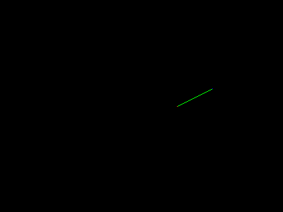

# Computer Graphics Note

## 数学基础（miscellaneous math）

### 二次方程（quadratic equation）求解

二次方程的形式为

$$A x^2 + B x + C = 0$$

将其变形可以得到

$$x^2 + \frac B A x + \frac C A = 0$$

使用完全平方（complete the square）公式可得到

$$\left(x + \frac{B}{2A}\right)^2 - \frac{B^2}{4A^2} + \frac C A = 0$$

将常数项移到右边并开平方，得到：

$$x + \frac{B}{2A} = \pm\sqrt{\frac{B^2}{4A^2} - \frac C A}$$

因此可得到二次方程的根为：

$$x = \frac{-B \pm \sqrt{B^2 - 4AC}}{2A}$$

由于负数开平方后并不是实数，所以需要一个判别式（discriminant）：

$$D = B^2 - 4AC$$

If $D > 0$, there are two real solutions (also called *roots*). If $D = 0$, there is one real solution (a “double” root). If $D < 0$, there are no real solutions.

### 三角学（Trigonometry）

An angle is defined by the length of the arc segment it cuts out on the unit circle. All angles
are in the range $[−\pi, \pi]$.

注：

1. 有关弧度的定义。

单位换算：

$$\mathrm{degrees} = \frac{180}{\pi} \mathrm{radians}$$

$$\mathrm{radians} = \frac{\pi}{180} \mathrm{degrees}$$

<div style='text-align:center'>

</div>

对于上图的直角三角形，有

$$a^2 + o^2 = h^2$$

其中$h$是斜边，叫做 hypotenuse。

我们可以将三角函数定义如下：

$$\sin \phi := o / h$$

$$\csc \phi := h / o$$

$$\cos \phi := a / h$$

$$\sec \phi := h / a$$

$$\tan \phi := o / a$$

$$\cot \phi := a / o$$

inverse functions:

$$
\begin{aligned}
&\mathrm{asin}: [-1, 1] \rightarrow [-\pi / 2, \pi / 2]  \\
&\mathrm{acos}: [-1, 1] \rightarrow [0, \pi]  \\
&\mathrm{atan}: \mathbb R \rightarrow [-\pi / 2, \pi / 2]  \\
&\mathrm{atan2}: \mathbb R^2 \rightarrow [-\pi, \pi]  \\
&\end{aligned}
$$

其中，`atan2(y, x)`的用处比较大，它可以直接将笛卡尔坐标系的坐标转换成极坐标系（polar coordinates）中的角度。

极坐标系的坐标$(r, \phi)$分别指的是圆半径和从 x 轴正方向逆时针旋转的角度。

### 线性代数（Linear algebra）

## Ray tracing

所谓的渲染即把三维物体映射成二维的像素。通常有两种渲染方式：

In *object-order rendering*, each object is considered in turn, and for each object all the pixels that it influences are found and updated. In *image-order rendering*, each pixel is considered in turn, and for each pixel all the objects that influence it are found and the pixel value is computed.

Broadly speaking, image-order rendering is simpler to get working and more flexible in the effects that can be produced, and usually (though not always) takes much more execution time to produce a comparable image.

通常基于像素的渲染更简单，但耗时更长。

假设摄像机的位置为$\boldsymbol e$，空间中某个点为$\boldsymbol s$，那么我们可以用下面的式子描述一条方向上每个位置的坐标：

$$\boldsymbol p (t) = \boldsymbol e + t(\boldsymbol s - \boldsymbol e)$$

<div style='text-align:center'>

</div>

其中，$t$表示某个点与摄像机位置$\boldsymbol e$的距离。$t$的范围为$(-\infty, \infty)$。

特别地，当$t = 0$时，$\boldsymbol p(0) = \boldsymbol e$；当$t = 1$时，$\boldsymbol p(1) = \boldsymbol s$。

之所以将$\boldsymbol p$写成$t$的函数，是因为后面我们求交点时，只要求解出$t$，就可以确实光线与物体的交点。

为进一步简化表示，我们令$\boldsymbol d = \boldsymbol s - \boldsymbol e$，表示射线的方向，那么就可以将射线表示为

$$\boldsymbol p(t) = \boldsymbol e + t \boldsymbol d$$

<div style='text-align:center'>

</div>

如上图所示，我们只需要求出来$t_0$，就可以拿到交点坐标$\boldsymbol p_0$。

注意，这里的$\overset{\rightarrow} d$不一定是单位向量。

### 摄像机的坐标系

假设摄像机位于原点，$\boldsymbol u$为摄像机的右方向，$\boldsymbol v$为摄像机的上方向，$\boldsymbol w$为$\boldsymbol u \times \boldsymbol v$得到的方向，摄像机面向$- \boldsymbol w$方向。如下图所示：

<div style='text-align:center'>

</div>

### 投影与光线生成

所谓的渲染，即把三维空间中的点按照一定方法平移后，映射到一个二维平面，这个平面就是我们最终得到的二维图像。

有两种常用的平移方式，一种是平行投影，一种是透视投影。

#### 平行投影（Orthographic Views，正投影）

<div style='text-align:center'>

</div>

如图所示，我们把摄像机放在平面的中间，然后按照这个平面的方向发射光线，所有的光线都是平行的，最终撞到的物体的颜色就是要渲染的颜色。

首先我们把二维平面的像素位置映射到空间坐标系中。假设二维图片的宽度为$n_x$个像素，高度为$n_y$个像素，将其映射到三维空间中，左边界为$l$，右边界为$r$，上边界为$t$，下边界为$b$。对于某个像素点$(i, j)$（使用 xy 坐标系），其在三维空间中的坐标为：

$$\begin{aligned}
&u = l + (r - l)(i + 0.5) / n_x \\
&v = b + (t - b)(j + 0.5) / n_y
\end{aligned}
$$

此时我们可以得到，每条光线的出发点为

$$\boldsymbol e + u \boldsymbol u + v \boldsymbol v$$

方向为

$$-\boldsymbol w$$

#### 透视投影

<div style='text-align:center'>

</div>

如图所示，首先将二维平面放到摄像机前$d$距离的位置，然后将相机位置和所有像素相连，即可得到每条光线的方向。

我们可以得到每条光线的初始位置：

$$\boldsymbol e$$

和方向：

$$-d \boldsymbol w + u \boldsymbol u + v \boldsymbol v$$

其中$u$，$v$的计算方法和平行投影中$u$，$v$的计算方法相同。$d$为$\boldsymbol e$到视平面的距离。

### Intersection

为了计算射线与物体是否相交，以及相交的交点位置，我们希望能解一个方程，如果这个方程有解，那么就说明相交，如果无解，就不相交。

这个方程的形式为

$$f(\boldsymbol p(t)) = 0 \Leftrightarrow f(\boldsymbol e + t \boldsymbol d) = 0$$

因为$\boldsymbol e$，$\boldsymbol d$都是已知，所以方程转化为求实数$t$是否存在。

#### 与球相交 ray-sephere intersection

假设一个球体的球心是$\boldsymbol c = (x_c, y_c, z_c)$，半径为$R$，那么它的球面上的点满足

$$(x - x_c)^2 + (y - y_c)^2 + (z - z_c)^2 - R^2 = 0$$

设$\boldsymbol p = (x, y, z)$，我们可以将这个方程重写成

$$(\boldsymbol p - \boldsymbol c) \cdot (\boldsymbol p - \boldsymbol c) - R^2 = 0$$

又因为$\boldsymbol p$只依赖于$t$，即$\boldsymbol p(t) = \boldsymbol e + t \boldsymbol d$，代入上面的方程后，可以得到一个只与$t$相关的方程：

$$(\boldsymbol d \cdot \boldsymbol d) t^2 + 2 \boldsymbol d \cdot (\boldsymbol e − \boldsymbol c) t + (\boldsymbol e − \boldsymbol c) \cdot (\boldsymbol e − \boldsymbol c) − R^2 = 0$$

这是一个关于$t$的二次函数。我们根据求根公式就可以得到方程的解。根据较小的$t$值即可得到第一次相交的点。

#### 与三角形相交 ray-triangle intersection

为了求解射线和三角形的相交，我们实际上是在求解射线的参数方程和三角形的参数方程的联立（不懂这一步，有空了看看参数方程相关的数学知识）：

$$
\left\{
\begin{aligned}
&x_e + t x_d = f(u, v) \\
&y_e + t y_d = g(u, v) \\
&z_e + t z_d = h(u, v) \\
\end{aligned}
\right.
$$

or

$$
\boldsymbol e + t \boldsymbol d = \boldsymbol f(u, v)
$$

设三角形三个顶点的坐标为$\boldsymbol a$，$\boldsymbol b$，$\boldsymbol c$，射线被表示为$\boldsymbol e + t \boldsymbol d$，那么直线与三角形所在平面相交，就可以表示为方程：

$$\boldsymbol e + t \boldsymbol d = \boldsymbol a + \beta (\boldsymbol b - \boldsymbol a) + \gamma (\boldsymbol c - \boldsymbol a)$$

解出$t$后，我们便可以得到交点$\boldsymbol p$的位置：$\boldsymbol p = \boldsymbol e + t \boldsymbol d$。

设$\boldsymbol e = (x_e, y_e, z_e)$，$\boldsymbol d = (x_d, y_d, z_d)$，$\boldsymbol a = (x_a, y_a, z_a)$，$\boldsymbol b = (x_b, y_b, z_b)$，$\boldsymbol c = (x_c, y_c, z_c)$，上述线性方程组可展开为：

$$
\left\{
\begin{aligned}
&x_e + t x_d = x_a + \beta (x_b − x_a) + \gamma (x_c − x_a) \\
&y_e + t y_d = y_a + \beta (y_b − y_a) + \gamma (y_c − y_a) \\
&z_e + t z_d = z_a + \beta (z_b − z_a) + \gamma (z_c − z_a)
\end{aligned}
\right.
$$

我们可以将其重新写成线性方程组的形式：

$$
\begin{bmatrix}
x_a − x_b &x_a − x_c &x_d \\
y_a − y_b &y_a − y_c &y_d \\
z_a − z_b &z_a − z_c &z_d
\end{bmatrix}

\begin{bmatrix}
\beta \\
\gamma \\
t
\end{bmatrix}

=

\begin{bmatrix}
x_a − x_e \\
y_a − y_e \\
z_a − z_e
\end{bmatrix}
$$

我们可以通过克拉默法则（Cramer’s rule）得到线性方程组的解：

（未完待续）

#### 射线与多边形的交点

### Shading

有很多种着色模型，下面是最简单的几种

* Lambertian Shading

    只考虑光照角度的影响，不考虑观察者的位置。假设单通道颜色的强度为$L$，光强为$I$，那么$L$可以被计算为：

    $$L = k_d I \max(0, \boldsymbol n \cdot \boldsymbol l)$$

    其中，$\boldsymbol n$是光线与物体交点处的物体表面的法线的单位向量，$\boldsymbol l$是从交点指向光源的单位法线向量。

    $k_d$ is the diffuse coefficient, or the surface color。$k_d$其实可以理解为对不同颜色通道的光的反射能力，其实也就代表了物体的颜色。

    $\boldsymbol n \cdot \boldsymbol l = \cos \theta$，其实代表了光照与法线的夹角。

    Lambertian shading is view independent: the color of a surface does not depend on the direction from which you look.

* Blinn-Phong Shading

    在 Lambert 光照的基础上加上镜面反射，就构成了 Blinn-Phong 光照模型。

### 折射 refraction

假设一束光从折射率为$n$的介质以$\theta$的入射角，射入到折射率为$n_t$的介质中，折射角为$\phi$，那么有

$$n \sin \theta = n_t \sin \phi$$

如果给定入射光$\boldsymbol d$，表面处法向量$\boldsymbol n$，入射介质系数$n$，反射介质系数$n_t$，那么可以计算出来折射光线：

$$\boldsymbol t = \frac{n}{n_t} (\boldsymbol d - \boldsymbol n (\boldsymbol d \cdot \boldsymbol n)) - \boldsymbol n \sqrt{1 - \frac{n^2}{n_t^2} (1 - (\boldsymbol d \cdot \boldsymbol n)^2)}$$

其中，$\boldsymbol d$的方向为从外部指向入射点

如果根号内的项计算出来是负数，那么说明发生了全反射（total internal reflection）。

光照在表面处，除了有一个折射分量，还会有一个反射分量。这个反射分量通过 Fresnel equations 计算出来。实际使用中，我们只需要使用 Schlick approximation 来近似就可以了：

$$R(\theta) = R_0 + (1 - R_0)(1 - \cos \theta)^5$$

其中，

$$R_0 = \left( \frac{n_t - 1}{n_t + 1} \right)^2$$

光线在介质中会发生衰减，能量衰减的过程与距离$x$有关。

## The graphics pipeline

渲染管线专注于 object-order rendering。

The process of finding all the pixels in an image that are occupied by a geometric primitive is called rasterization, so object-order rendering can also be called rendering by rasterization.

The sequence of operations that is required, starting with objects and ending by updating pixels in the image, is known as the graphics pipeline.

For each primitive that comes in, the rasterizer has two jobs: it enumerates the pixels that are covered by the primitive and it interpolates values, called attributes, across the primitive.

The output of the rasterizer is a set of fragments, one for each pixel covered by the primitive. Each fragment “lives” at a particular pixel and carries its own set of attribute values.

### Line Drawing Using Implicit Line Equations

这里介绍使用“中点法（midpoint algorithm）”进行栅格化。

首先我们写出过$(x_0, y_0)$，$(x_1, y_1)$，（$x_0 < x_1$）的隐方程：

$$f(x, y) := (y_0 - y_1)x + (x_1 - x_0)y + x_0 y_1 - x_1 y_0 = 0$$

此时我们可以写出直线的斜率：

$$m = \frac{y_1 - y_0}{x_1 - x_0}$$

对于$m \in (0, 1]$的情况，

The key assumption of the midpoint algorithm is that we draw the thinnest line possible that has no gaps. A diagonal connection between two pixels is not considered a gap.

假设像素的离散坐标为$(x, y)$，那么直线光栅化的伪代码为

```
y = y0
for x = x0 to x1 do
    draw(x, y)
    if (some condition) then
        y = y + 1
```

<div style='text-align:center'>

</div>

如图所示，从$(x_0, y_0)$开始，到右上角的$(x_1, y_1)$，其实我们只需要做两个选择：向右或向上。正常情况下我们选择向右，只需要在合适的时机选择向上就可以了。这样可以保持每一列都恰好有一个像素被填充。

那么这个“合适的时机”怎么确定呢？如果直线可能穿过某两个像素，我们连接这两个像素的中心，找到连线的中点，然后判断直线在中点的上方还是下方。如果在上方，那么填充上面的像素，如果在下方，那么填充下面的像素。如下图所示：

<div style='text-align:center'>

</div>

直线在中点（上图中红色圆点）上方，所以上面的像素被填充。

因为对于某个点$(x, y)$，我们可以用$f(x, y)$与$0$的大小比较，判断这个点在直线的上面还是下面，所以上面伪代码中的 if 语句，可以写成这样：

```
if f(x + 1, y + 0.5) < 0 then
    y = y + 1
```

这里的$(x, y)$指的是某个像素格子的中心的坐标。

一份代码实现：

```cpp
#include <iostream>
#include <vector>
#include <array>
#include "../CImg/CImg.h"
using namespace std;
using namespace cimg_library;

template<typename T>
void assign_rgb(CImg<T> &img, int x, int y, vector<float> rgb)
{
    for (int i = 0; i < 3; ++i) {
        img(x, y, 0, i) = round(rgb[i] * 255);
    }
}

array<float, 2> center_coord_to_corner_coord(float x, float y, float width, float height)
{
    array<float, 2> cor_xy;
    cor_xy[0] = x + width / 2;
    cor_xy[1] = height / 2 - y;
    return cor_xy;
}

array<float, 2> corner_coord_to_center_coord(float x, float y, float width, float height)
{
    array<float, 2> cen_xy;
    cen_xy[0] = x - width / 2;
    cen_xy[1] = height / 2 - y;
    return cen_xy;
}

array<int, 2> corner_coord_to_grid_xy(float x, float y, int num_cols, int num_rows, float width, float height)
{
    array<int, 2> grid_xy;
    grid_xy[0] = floor(x / (width / num_cols));
    grid_xy[1] = floor(y / (height / num_rows));
    return grid_xy;
}

array<int, 2> center_coord_to_grid_xy(float x, float y, int num_cols, int num_rows, float width ,float height)
{
    array<float, 2> cor_xy = center_coord_to_corner_coord(x, y, width, height);
    array<int, 2> grid_xy = corner_coord_to_grid_xy(cor_xy[0], cor_xy[1], num_cols, num_rows, width, height);
    return grid_xy;
}

array<float, 2> get_grid_center_in_corner_coord(int x, int y, int num_cols, int num_rows, float width, float height)
{
    // 这里的 xy 以左上角为原点，向右为 x 正方向，向下为 y 正方向
    // xy 指定的是 grid 的索引
    // 返回的是 corner coord 坐标系的坐标
    array<float, 2> grid_center_xy;
    grid_center_xy[0] = (width / num_cols) * (x + 0.5);
    grid_center_xy[1] = (height / num_rows) * (y + 0.5);
    return grid_center_xy;
}

float f(float x, float y, array<array<float, 2>, 2> &points)
{
    float val = (points[0][1] - points[1][1]) * x + (points[1][0] - points[0][0]) * y + 
        points[0][0] * points[1][1] - points[1][0] * points[0][1];
    return val;
}

int main()
{
    int width = 400, height = 300;
    vector<uint8_t> arr(width * height * 3);
    CImg<unsigned char> img(width, height, 1, 3, 0);
    auto &a = img(0, 0, 0);

    // (250, 150) -> (300, 125)
    int x_0 = 250, x_1 = 300;
    int y_0 = 150, y_1 = 125;
    
    array<array<float, 2>, 2> points;
    points[0] = get_grid_center_in_corner_coord(250, 150, 400, 300, 2, 2);
    points[1] = get_grid_center_in_corner_coord(300, 125, 400, 300, 2, 2);
    int x = x_0, y = y_0;
    vector<array<float, 2>> grid_centers_xy(2);
    array<float, 2> center_of_segment;
    while (x <= x_1)
    {
        assign_rgb(img, x, y, {0, 1, 0});
        grid_centers_xy[0] = get_grid_center_in_corner_coord(x + 1, y, 400, 300, 2, 2);
        grid_centers_xy[1] = get_grid_center_in_corner_coord(x + 1, y - 1, 400, 300, 2, 2);
        center_of_segment[0] = grid_centers_xy[0][0];
        center_of_segment[1] = (grid_centers_xy[0][1] + grid_centers_xy[1][1]) / 2;
        if (f(center_of_segment[0], center_of_segment[1], points) > 0)
            --y;
        ++x;
    }

    assign_rgb(img, x_0, y_0, {1, 0, 0});
    assign_rgb(img, x_1, y_1, {0, 0, 1});

    cout << x << ", " << y << endl;
    img.save_png("./pic.png");
    return 0;
}
```

编译：

```bash
g++ -g main.cpp -lX11 -o main
```

运行：

```bash
./main
```

效果：

<div style='text-align:center'>

</div>

还可以用增量的方式判断，更快一些：

## 辐射度量学（Radiometry）

假设一个光子(Photon)的波长为$\lambda$，那么它的频率（frequency）$f$为

$$f = \frac{c}{\lambda}$$

其中$c$是光速。

这个光子的能量（energy）$q$为

$$q = hf = \frac{hc}{\lambda}$$

其中$h$是普朗克常量（Plank’s Constant），$h = 6.63 \times 10^{-34}$，单位为焦秒（$\mathrm{Js}$）。

对于不同波长光子组成的一束光，该如何描述它的能量呢？

如果我们假设这束光的能量随波长连续变化，那么就可以定义波长$\lambda$处的光谱能量（spectral energy）为

$$Q_\lambda = \frac{d Q}{d \lambda}$$

其中$Q$为这束光的总能量。如果公式中的物理量的单位都采用 SI 单位，那么$Q_\lambda$的单位为$\mathrm{J} \cdot \mathrm{nm}^{-1}$。

注：

1. $Q$应该定义成一片物体表面上经过一段时间光照后，接收到的总能量。

对于单位时间内一束光在波长$\lambda$处的光谱能量，我们将其定义为光谱功率（spectral power）$\Phi_\lambda$：

$$\Phi_\lambda = \frac{d^2Q}{dt \ d\lambda} = \frac{d Q_\lambda}{dt}$$

如果使用 SI 单位制，光谱功率$\Phi_\lambda$的单位为$\mathrm{W} \cdot \mathrm{nm}^{-1}$。

为方便起见，以后将$\Phi_\lambda$简写为$\Phi$。

现在我们假设这束光照到了一个物体表面上，我们使用光谱辐照度（spectral irradiance）$H$来描述单位面积内的光谱功率：

$$H = \frac{d^3 Q}{dA \ dt \ d\lambda}$$

其中$d A$表面面积的微元。$H$的单位为$\mathrm{J m^{−2} s^{−1} (nm)^{−1}}$。

我们定义反射光的光谱辐照度（radiant exitance）为$E$，其单位与$H$相同。

注：

1. 同样都是某个表面处的辐射总功率，入射的总功率叫做 irradiance，出射的总功率却叫 radiant exitance。这种不对称的叫法还是第一次见。

1. 根据$H$的单位，可以看出一些这个量的特性。$\mathrm{Js}^{-1}$表示这个量是个功率，即单位时间内的能量，或者说，对时间的微分。$\mathrm{m}^{-2}$表示单位面积，即这个功率还需要再对面积微分，得到的是功率的密度。$(\mathrm{nm})^{-1}$表示这个能量是只针对于单个波长而言的。

入射光的英文名为 incident light，出射光的英文名为 exitant light。

使用光谱辐照度描述物体表面的光线信息仍然太粗糙，我们需要一个更细致的量拿到更多信息。irradiance 无法度量来自空间四面八方每个方向上的辐射功率，所以我们还需要对空间角进行微分。

对于表面处某一点$\boldsymbol p$，我们在上面构建一个半球面，$\boldsymbol p$与半球面上任意一点$\boldsymbol p_0$连接的向量成一个方向，或者说空间角（solid angle）。对于空间角$\sigma$处的光谱辐照度，我们将其定义为光谱辐射（spectral radiance）：

$$\mathrm{radiance} = \frac{dH}{d\sigma}$$

为了简便起见，我们将光谱辐射简称为辐射（radiance）。

令空间角$\sigma$与$\boldsymbol p$点法线之间的角度为$\theta$，我们可以将 radiance 分解为水平方向和垂直方向，只有垂直方向的水平分量对表面接收的能量有贡献，因此我们可以**反推**出$\sigma$处的辐射功率密度为：

$$L_f = \frac{dH}{\cos \theta \, d\sigma }$$

$L_f$又被称为场辐射（field radiance）。对于出射光的辐射，我们可以将其定义为

$$L_s = \frac{dE}{\cos\theta \, d\sigma}$$

$L_s$又被称为表面辐射（surface radiance）。

<div>

</div>

对于入射光，我们只需要让所有空间角的场辐射叠加，就可以得到辐照度$H$：

$$H = \int_{\mathrm{all}\ \mathbf{k}} L_f(\mathbf k) \cos\theta \ d\sigma$$

其中，$\mathbf k$指的是某一个方向，如上图所示。$\mathbf k$可以被认为是一个单位向量，一个方向向量。每一个$\mathbf k$都对应一个$\theta$角和一个$\sigma$方向角。

注：

1. 这里的$L_f$是否就可以认为是光的 rgb 颜色？

    对波长微分是否可以理解为一组 rgb 取值？

    对波长微分表示只有一个波长，这个波长可以用一组 rgb 表示。反过来 rgb(1, 0, 0)，rgb(0, 1, 0), rgb(0, 0, 1)也代表了三个波长。所有的颜色的光都可以表示这三组颜色的叠加。积分的性质也正好满足线性叠加的性质。因此可以认为$L_f$代表了光的颜色。

为了求解积分，我们将$\sigma$映射到极坐标系：

$$d\sigma = \sin \theta \, d\theta \, d\phi$$

（这个映射是怎么映射的？为什么这里有一个$\sin \theta$？）

为了简化计算，我们假设来自各个方向的$L_f$都相等，于是可以计算出来辐照度

$$
\begin{aligned}
H &= \int_{\phi = 0}^{2\pi}\int_{\theta=0}^\frac{\pi}{2} L_f \cos\theta \sin\theta \, d\theta \, d\phi \\
&= \pi L_f
\end{aligned}
$$

有了光谱功率密度$H$，我们只需要让它对面元积分，就可以得到物体表面的光谱功率了：

$$\Phi = \int_{\text{all}\ \mathbf{x}} H(\mathbf x) \, dA$$

其中，$\mathbf x$表示物体表面上的一个点，$dA$表示$\mathbf x$处的面元。

研究完了入射光，我们研究物体表面的反射。

假设物体上某一个点$\mathbf x$处的入射光方向为$\mathbf k_i$（由$\mathbf x$指向光源位置），对应的反射光线方向为$\mathbf k_o$（由$\mathbf x$指向出射方向），如下图所示：

<div>

</div>

那么我们可以使用$\rho$来描述这个过程：

$$\rho(\mathbf k_i, \mathbf k_o) = \frac{L_s}{H}$$

其中，$H$是入射光方向$\mathbf k_i$的 radiance $L_f$对所有空间角的积分。$\rho(\mathbf k_i, \mathbf k_o)$又被称为双向反射分布函数（bidirectional reflectance distribution function, BRDF）。

可以看到$L_s$是和空间角$d\sigma$相关的，而$H$是对空间角积分过的，与空间角无关。为什么要这样定义？根据维基百科的说法，反射光$\mathbf k_o$只和对应的入射光$\mathbf k_i$相关，而与其他的光无关。（<https://en.wikipedia.org/wiki/Bidirectional_reflectance_distribution_function>）

> The reason the function is defined as a quotient of two differentials and not directly as a quotient between the undifferentiated quantities, is because irradiating light other than ${\displaystyle \mathrm {d} E_{\text{i}}(\omega _{\text{i}})}$, which are of no interest for $f_{\text{r}}(\omega _{\text{i}},\,\omega _{\text{r}})$, might illuminate the surface which would unintentionally affect $L_{\text{r}}(\omega _{\text{r}})$, whereas ${\displaystyle \mathrm {d} L_{\text{r}}(\omega _{\text{r}})}$ is only affected by ${\displaystyle \mathrm {d} E_{\text{i}}(\omega _{\text{i}})}$. 

（那么为什么不直接定义成$\rho = L_s / L_f$？）

注：

1. 看来着这个模型的意思是，对于一束入射光$\mathbf k_i$，在点$\mathbf x$处有向各个方向的反射光$\mathbf k_o$。并不是只有镜面反射。

将出射光对空，可以得到：

$$R(\mathbf k_i) = \frac{E}{H}$$

由于$E$和$H$不好直接计算，我们将这个式子用$\rho$再次表示：

$$R(\mathbf k_i) = \int_{\text{all}\ \mathbf k_o} \rho(\mathbf k_i, \mathbf k_o) \cos \theta_o \ d\sigma_o$$

An idealized diffuse surface is called *Lambertian surface*. The Lambertian BRDF has $\rho$ equal to a constant for all angles. This means the surface will have the same radiance for all viewing angles. Such surfaces are impossible in nature for thermodynamic reasons.

最后一步，只需要将所有的入射光线叠加起来，就能得到某个方向的出射光线了：

$$L_s (\mathbf k_o) = \int_{\text{all}\ \mathbf k_i} \rho (\mathbf k_i, \mathbf k_o) L_f(\mathbf k_i) \cos \theta_i \ d\sigma_i$$

这个公式叫做渲染方程（rendering equation）。

渲染方程是对空间角进行积分的，在现实生活中，入射光其实是从其他物体反射过来的，我们需要更多信息，于是可以把渲染方程做一个变换：

$$L_s(\mathbf x, \mathbf k_o) = \int_{\text{all}\ \mathbf x'} \frac{\rho(\mathbf k_i, \mathbf k_o) L_s(\mathbf x', \mathbf x - \mathbf x') v(\mathbf x, \mathbf x') \cos \theta_i \cos \theta'}{\left\| \mathbf x - \mathbf x' \right\|} \ d A'$$

where

$$v(\mathbf x, \mathbf x') = \left\{ \begin{aligned}  
&1, \quad \text{if } \mathbf x \text{ and } \mathbf x' \text{ are mutually visible,} \\
&0, \quad \text{otherwise}
\end{aligned}  \right.$$

## Colorimetry

对于不同波长$\lambda$的光的激励（stimulus），三种视锥细胞（cones）会给出不同的响应（response）$L(\lambda)$，$M(\lambda)$，$S(\lambda)$。

对于给定的光谱激励$\Phi(\lambda)$，可以计算出每种细胞的积分响应：

$$L = \int_\lambda \Phi(\lambda) L(\lambda)\ d \lambda$$

$$M = \int_\lambda \Phi(\lambda) M(\lambda)\ d\lambda$$

$$S = \int_\lambda \Phi(\lambda) S(\lambda)\ d\lambda$$

这三个值又被称为 tristimulus values。

注：

1. $L$是单个视细胞对于全光谱的光的响应程度，这里全光谱的光可以理解为各种不同波长的光子组成一束光。$M$和$S$同理。

如果我们给定两束不同的光$\Phi_1 (\lambda)$和$\Phi_2 (\lambda)$，是有可能得到相同的响应$(L, M, S)$的，这个现象被称作 metamerism。

配色（color matching）实验：假如我们现在有三个光源（这三个光源被称为 primaries），每个光源都有自己的频谱（即在$\lambda$-$\mathrm{intensity}$图上的三条曲线），并且我们有三个调节旋钮可以调节这三个光源的强度，如果这三个光源生成的$(L, M, S)$与某第四个光源生成的$(L, M, S)$相同，那么我们就可以使用前三个光源的强度来描述第四个光源。我们称前三个光源的强度为第四个光源的 color。

假如我们将上面配色实验中的三个光源換成单波长光源（monochromatic light sources）,然后对每一个其它波长的光进行配色，就能得到不同波长下的$(L_\lambda, M_\lambda, S_\lambda)$，这些值叫做 spectral tristimulus values，可以构成一幅曲线图。

当三个单色光源为 435.8, 546.1, and 700 nm 时，画出的 spectral tristimulus values 如下图所示：

<div style='text-align:center'>

</div>

注：

1. tristimulus 不是 LSM 吗，为什么会变成 RGB？而且 RGB 看起来更像是三种单色光的强度。

