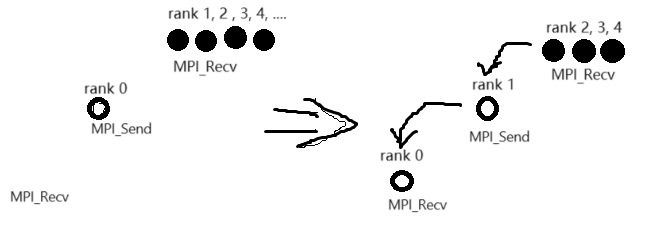

# OpenMPI Note

Doc: <https://docs.open-mpi.org/en/v5.0.x/>

## cache

* 我使用 SSH 隧道，把机器 A 的 22 端口映射到机器 B 的 127.0.0.1:3322 端口，把机器 B 的 22 端口映射到机器 A 的 127.0.0.1:3323 端口，此时在机器 A 上，该如何使用 mpi 跑起来这个集群？

    这是一个非常有趣的配置。你实际上通过 SSH 隧道构建了一个“互为跳板”的内网穿透环境。

    要在这种非标准端口且需要双向通信的环境下运行 MPI（以 OpenMPI 为例），核心挑战在于：**MPI 默认会尝试通过标准 22 端口启动进程，且其内部通信（端口动态协商）在复杂的隧道环境下极易失效。**

    以下是分步配置方案：

    ---

    1. 配置 SSH 别名（关键步骤）

        MPI 及其底层的 `orterun` 或 `mpirun` 通常无法直接传递复杂的 SSH 参数（如端口）。你需要在机器 A 的 `~/.ssh/config` 中为机器 B 配置一个别名。

        在 **机器 A** 上编辑或创建 `~/.ssh/config`：
        ```text
        Host machine_b
            HostName 127.0.0.1
            Port 3322
            User <你在机器B上的用户名>
            StrictHostKeyChecking no
        ```

    ---

    2. 实现免密登录

        由于 MPI 是自动化启动，你必须确保机器 A 访问 `machine_b` 不需要输入密码：
        ```bash
        ssh-copy-id -p 3322 <用户名>@127.0.0.1
        # 测试是否能直接登录
        ssh machine_b
        ```

    ---

    3. 编写 Hostfile
        
        创建一个名为 `my_hosts` 的文件，指定节点及其可用核心数（slots）：
        ```text
        localhost slots=4
        machine_b slots=4
        ```

    ---

    4. 解决 MPI 通信的“隧道陷阱”
        
        这是最容易报错的地方。MPI 启动后，节点之间会互相通信。由于你使用了 SSH 隧道，节点 B 看到的“节点 A”地址可能是 `127.0.0.1`。

        你需要在执行 `mpirun` 时，强制 MPI 使用 TCP 协议，并明确指定通信接口。

        在 **机器 A** 上运行：
        ```bash
        mpirun --hostfile my_hosts \
            --mca plm_rsh_args "-p 3322" \
            --mca btl_tcp_if_include lo \
            --mca btl self,vader,tcp \
            ./your_mpi_program
        ```

        **参数解释：**
        * `--mca plm_rsh_args "-p 3322"`: 告诉 MPI 启动远程进程时使用的 SSH 端口。
        * `--mca btl_tcp_if_include lo`: **非常重要！** 因为你的数据是通过隧道走的，对系统来说流量都在回环地址（loopback）上。如果不加这一行，MPI 可能会尝试通过物理网卡通信，导致连接超时。
        * `--mca btl self,vader,tcp`: 指定通信层优先级。

    ---

    **潜在的限制与警告**

    1.  **性能瓶颈**：SSH 隧道会对数据进行加密和解密，这会显著增加 MPI 通信的延迟（Latency）并降低带宽。对于计算密集型但通信频率低的程序尚可，如果是高频同步的程序，性能会非常差。
    2.  **防火墙/限制**：如果 MPI 程序需要开启额外的动态端口进行数据交换，单纯的 22 端口隧道可能不够用。如果运行报错，建议开启 **SSH 的动态转发（-D 参数）** 或者使用 **VPN（如 Tailscale 或 ZeroTier）** 来构建虚拟内网，这比折腾 SSH 端口转发要稳定得多。

    你的 MPI 程序主要是处理大数据量的传输，还是纯碎的分布式计算？

* 咦，你只提到了 3322，那 3323 呢，用不到吗

    观察敏锐！在一般的“客户端-服务器”架构中，确实只需要一个方向的隧道。但你现在的需求是**跑 MPI 集群**，这涉及到 MPI 极其特殊的通信机制。

    之所以在刚才的命令中没直接写 **3323**，是因为在 MPI 的启动逻辑中，两个端口扮演的角色完全不同：

    1. 3322 是“发令枪”
        
        当你从机器 A 执行 `mpirun` 时，它是 **控制端（Master）**。
        * 它需要通过 **3322** 端口主动连接机器 B，并在机器 B 上拉起（spawn）计算进程。
        * 这就是为什么我在命令中指定了 `--mca plm_rsh_args "-p 3322"`。

    2. 3323 是“回音壁”（理论上的回传路径）
        
        在常规网络下，机器 B 的进程启动后，会主动连接机器 A 的某个**随机端口**来汇报状态和交换数据。
        * **问题来了：** 由于机器 A 和 B 之间有防火墙或 NAT 阻隔，机器 B 无法直接通过随机端口连接机器 A。
        * **3323 的作用：** 如果你想让机器 B 能够“反向”访问机器 A 的 SSH 服务（比如你在机器 B 上也想发起 `mpirun`，或者某些特定的同步机制需要反向拉起进程），那么 3323 才会派上用场。

    ---

    **那么，3323 到底能不能用在这次 MPI 运行中？**

    在标准的 OpenMPI 配置下，**很难直接利用 3323 端口进行数据交换**，原因如下：

    * **MPI 内部通信不仅仅靠 SSH：** SSH 隧道（3322/3323）通常只负责**启动**进程。进程启动后，MPI 节点之间会尝试建立成百上千个 TCP 连接来传输数据。
    * **端口随机性：** MPI 内部数据传输（BTL 模块）默认会使用**随机高位端口**。你的 3323 隧道只映射了 22 端口（SSH），它没法帮 MPI 转发那些随机的数据端口。

    **如果你一定要在隧道环境下跑通，方案有两种：**

    方案 A：只用 3322（最简单，但有前提）

    如果你的 `mpirun` 只是在机器 A 发起，机器 B 接收指令。只要你在执行时加上了 `--mca btl_tcp_if_include lo`，MPI 会尝试把所有数据通信都“塞”进已有的 SSH 控制链路中（通过一种叫 `tree` 的拓扑结构）。此时 **3323 确实是用不到的**，它就像一根备用的自来水管。

    方案 B：双向对等（如果你在机器 B 上也要当 Master）

    如果你在 **机器 B** 上执行 `mpirun`，那么逻辑就会镜像过来：
    1.  你需要在机器 B 的 `~/.ssh/config` 里把 `machine_a` 指向 `127.0.0.1:3323`。
    2.  此时，机器 B 成了发起者，它会通过 **3323** 去找机器 A。

    ---

    **核心建议**

    如果你发现程序卡在启动阶段（节点 B 无法回连节点 A），那是因为 **3323 隧道只转了 SSH，没转 MPI 数据流**。

    在这种极端环境下，最稳妥的办法是强制 MPI 使用 **静态端口范围**，并将这些端口也全部做 SSH 隧道转发（极其麻烦），或者使用更高级的方案：

    > **终极解决之道：**
    > 使用 `ssh -D` 建立 SOCKS 代理，或者干脆用 **Tailscale**。它可以给机器 A 和机器 B 各分配一个虚拟内网 IP，MPI 会像在局域网一样无感通信，你再也不用纠结 3322 还是 3323 了。

    你现在测试运行命令后，是报了 `Connection Refused` 还是程序直接卡死不动了？

* 那我如何启动多台 host 呢，每个 remote host 映射到本地的一个 local port，比如 3322, 3324, 3325, ...，这时候该怎么办？--mca plm_rsh_args "-p 3322" 不太行了吧？

    这是一个非常深刻的问题。你已经发现了 MPI 在非标准 SSH 环境下的一个核心痛点：`--mca plm_rsh_args` 是一个全局参数，它会应用到**所有**远程主机上。如果你有多个 host 分别对应不同的端口（3322, 3324, 3325...），这个全局参数就会导致除了 3322 以外的所有机器都连接失败。

    要解决这个问题，最优雅且标准的方法是**通过 SSH 配置文件 (`~/.ssh/config`) 将“端口差异”屏蔽掉**。

    **核心方案：利用 SSH Config 归一化**

    MPI 内部调用 `ssh` 命令时，本质上是执行 `ssh <hostname> <command>`。如果我们把每个端口都映射到一个伪造的“主机名”上，MPI 就不需要关心端口了。

    **第一步：配置机器 A 的 `~/.ssh/config`**

    为每一台远程机器配置一个专属别名，并映射对应的本地端口：

    ```text
    # 机器 B
    Host node-b
        HostName 127.0.0.1
        Port 3322
        User your_user
        StrictHostKeyChecking no

    # 机器 C
    Host node-c
        HostName 127.0.0.1
        Port 3324
        User your_user
        StrictHostKeyChecking no

    # 机器 D
    Host node-d
        HostName 127.0.0.1
        Port 3325
        User your_user
        StrictHostKeyChecking no
    ```

    **第二步：修改 Hostfile**

    在你的 `my_hosts` 文件中，**不要写 IP 或 127.0.0.1**，而是写你在 SSH config 中定义的 **Host 别名**：

    ```text
    localhost slots=4
    node-b slots=4
    node-c slots=4
    node-d slots=4
    ```

    **第三步：启动 MPI（不再需要全局端口参数）**

    由于 SSH 已经知道了每个别名对应的端口，你就不再需要 `--mca plm_rsh_args "-p 3322"` 了：

    ```bash
    mpirun --hostfile my_hosts \
        --mca btl_tcp_if_include lo \
        --mca btl self,vader,tcp \
        ./your_mpi_program
    ```

    ---

    **进阶警示：这种架构的“死穴”**

    虽然上面的方法解决了“如何启动进程”的问题，但在 SSH 隧道环境下跑多机 MPI 依然面临一个巨大的风险：**反向连接（Callback）失败。**

    **为什么会失败？**
    1. **启动阶段**：机器 A 通过 3322/3324 连上节点 B/C 并启动了进程。
    2. **连接阶段**：节点 B 的 MPI 进程启动后，它会查看自己的网络接口，发现自己叫 `127.0.0.1`。它会尝试连接机器 A 的某个随机端口来建立数据链路。
    3. **阻塞**：因为节点 B 只能看到自己的 `127.0.0.1`，它根本找不到真实的机器 A，除非你为每一个节点都反向建立了一套极其复杂的隧道（比如你提到的 3323 映射到 A 的 22 端口，但 MPI 通信还需要几千个数据端口）。

    **总结建议**

    如果你只是为了**实验或学习**：
    按照上面的 **SSH Config** 方案可以顺利“启动”集群，但如果程序在运行到一半（通常是第一次 `MPI_Init` 或 `MPI_Barrier` 时）卡住，说明数据链路无法穿透隧道。

    如果你是为了**生产或实际计算**：
    强烈建议放弃这种单端口 SSH 映射方案，改用以下方案之一：
    * **VPN 方案 (Tailscale / ZeroTier)**：这些工具会自动为 A、B、C 分配虚拟内网 IP（如 100.64.0.1）。你只需要把这些 IP 填进 hostfile 即可，它们支持全端口双向互通，是目前处理这类问题的“降维打击”方案。
    * **SSH 动态转发 (-D)**：结合一些 SOCKS5 代理工具，但配置复杂度极高。

    **你想先用 SSH Config 方案试试看能否跑通基本的 Hello World 吗？**

*  WARNING: Open MPI accepted a TCP connection from what appears to be a another Open MPI process but cannot find a corresponding process entry for that peer. 

    看到这个错误，你已经撞到了我之前提到的“**反向连接死穴**”。

    **为什么会报这个错？**

    由于你所有的远程节点都通过隧道映射到了 `127.0.0.1`，对于 MPI 进程来说，它看到的现象是：
    * 机器 B 发回了一个连接请求。
    * 机器 A 收到请求，一看来源地址：“咦，是 `127.0.0.1`（我自己）发来的？”
    * 机器 A 检查自己的进程列表，发现本地并没有一个正在尝试建立连接的匹配进程。
    * **结果**：MPI 认为这是一个非法的、来源不明的连接，出于安全和逻辑一致性考虑，直接把它丢弃了。

    在隧道环境下，MPI 无法通过回环地址（Loopback）区分“自己”和“通过隧道连过来的远程节点”。

    ---

    **解决方案：欺骗 MPI 的网卡识别**

    要解决这个问题，我们需要让 MPI 认为这些连接不是来自 `127.0.0.1`，或者强制它忽略地址冲突。

    **方法一：添加环境变量（最直接的尝试）**

    在执行 `mpirun` 时，添加以下参数来告诉 MPI 忽略这些无法匹配的连接（虽然不一定能完全解决数据传输问题，但能跳过报错）：

    ```bash
    mpirun --hostfile my_hosts \
        --mca btl_tcp_if_include lo \
        --mca btl_tcp_peer_retries 10 \
        --mca plm_rsh_args "-p 3322" \
        --mca btl self,vader,tcp \
        -x OMPI_MCA_btl_tcp_if_include=lo \
        ./your_mpi_program
    ```
    > **注意**：`-x` 会把环境变量传递给远程节点，确保两端都只看 `lo` 网卡。

    **方法二：使用虚拟网卡（最稳妥的 SSH 方案）**

    如果方法一依然卡死，说明 MPI 的 TCP 握手确实被回环地址搞糊涂了。你可以在机器 A 上给 `lo` 网卡增加几个“马甲”地址（别名）：

    1. **在机器 A 上创建虚拟 IP**：
       ```bash
       sudo ifconfig lo:1 127.0.0.2 up
       sudo ifconfig lo:2 127.0.0.3 up
       ```
    2. **修改 SSH 隧道**：
       将隧道绑定到这些特定 IP 上，而不是通用的 `127.0.0.1`。
    3. **修改 SSH Config**：
       ```text
       Host node-b
           HostName 127.0.0.2
           Port 3322
       Host node-c
           HostName 127.0.0.3
           Port 3324
       ```
    这样在 MPI 看来，连接分别来自 `.1`、`.2` 和 `.3`，逻辑就不再混乱了。

    ---

    **最终建议：别在“隧道”这一棵树上吊死**

    如果你看到 `cannot find guid`，说明 OpenMPI 的运行运行时（ORTE）已经处于崩溃边缘了。SSH 隧道只转发了 **22 端口**，但 MPI 进程间一旦启动，它们会尝试建立**直接的 TCP 连接**（通常是随机的高位端口）。

    **即使你解决了 SSH 登录问题，节点 B 和节点 C 之间依然无法直接通信。** 如果你的 MPI 程序包含 `MPI_Allreduce` 或 `MPI_Send`（从 B 发到 C），程序**必死无疑**，因为 B 根本不知道怎么找 C。

    **推荐替代方案：**
    1. **建立真正的隧道 (VPN)**：
       使用 **Tailscale**。只需要在每台机器上装一下，它们会获得一个独立的内网 IP。
       * **Hostfile 变成**：`100.x.y.1`, `100.x.y.2`...
       * **运行命令变成**：`mpirun --hostfile my_hosts ./program`
       * **优点**：不需要映射端口，不需要改 SSH config，支持全端口通信，性能损耗比 SSH 隧道小得多。

    2. **SSH 代理转发 (ProxyJump)**：
       如果你有权访问一台中间跳转机，使用 `ProxyJump` 而不是本地端口转发（`-L`），这样 MPI 看到的 IP 地址才是真实的。

    你想继续硬磕 SSH 端口转发（配置虚拟 IP 绕路），还是打算尝试更现代的内网穿透工具？


* mpi error 只是一个 enum status，本身不能动态判断来了多少数据。

    常用的几个 enum：

    | Error name | Value | Description |
    | - | - | - |
    | `MPI_SUCCESS` | 0 | Successful return code. |
    | `MPI_ERR_BUFFER` | 1 | Invalid buffer pointer. |
    | `MPI_ERR_COUNT` | 2 | Invalid count argument. |
    | ... | ... | ... |

    ref:

    1. <https://docs.open-mpi.org/en/v5.0.1/man-openmpi/man3/MPI_Errors.3.html>

    2. <https://learn.microsoft.com/en-us/message-passing-interface/mpi-error>

* mpi send 端 cnt 大于 recv 端函数参数指定的 cnt，此时会报错

    `main.c`:

    ```c
    #include <mpi.h>
    #include <stdio.h>
    #include <stdlib.h>

    int main(int argc, char** argv)
    {
        MPI_Init(NULL, NULL);

        int rank;
        MPI_Comm_rank(MPI_COMM_WORLD, &rank);

        int num_elm_buf = 8;
        int *buf = malloc(num_elm_buf * sizeof(int));
        if (rank == 0)
        {
            buf[0] = 123;
            buf[1] = 456;
            buf[2] = 789;
            int send_cnt = 3;
            MPI_Send(buf, send_cnt, MPI_INT, 1, 0, MPI_COMM_WORLD);
            printf("rank %d sent %d numbers:\n", rank, send_cnt);
            printf("\tdata: ");
            for (int i = 0; i < send_cnt; ++i)
                printf("%d, ", buf[i]);
            putchar('\n');
        }
        else if (rank == 1)
        {
            MPI_Status status;
            int recv_cnt = 2;
            MPI_Recv(buf, recv_cnt, MPI_INT, 0, 0, MPI_COMM_WORLD, &status);
            printf("rank %d received data:\n", rank);
            printf("\tMPI_SOURCE: %d\n", status.MPI_SOURCE);
            printf("\tMPI_TAG: %d\n", status.MPI_TAG);
            printf("\tMPI_ERROR: %d\n", status.MPI_ERROR);

            int count;
            MPI_Get_count(&status, MPI_INT, &count);
            printf("\tcount: %d\n", count);

            printf("\tdata: ");
            for (int i = 0; i < count; ++i)
                printf("%d, ", buf[i]);
            putchar('\n');
        }

        MPI_Finalize();
        return 0;
    }
    ```

    compile: `mpicc -g main.c -o main`

    run: `mpirun -np 2 ./main`

    output:

    ```
    rank 0 sent 3 numbers:
    	data: 123, 456, 789, 
    [hlc-VirtualBox:148979] *** An error occurred in MPI_Recv
    [hlc-VirtualBox:148979] *** reported by process [3888447489,1]
    [hlc-VirtualBox:148979] *** on communicator MPI_COMM_WORLD
    [hlc-VirtualBox:148979] *** MPI_ERR_TRUNCATE: message truncated
    [hlc-VirtualBox:148979] *** MPI_ERRORS_ARE_FATAL (processes in this communicator will now abort,
    [hlc-VirtualBox:148979] ***    and potentially your MPI job)
    ```

* mpi send 数据长度小于 recv 端 buffer 长度

    `main.c`:

    ```c
    #include <mpi.h>
    #include <stdio.h>
    #include <stdlib.h>

    int main(int argc, char** argv)
    {
        MPI_Init(NULL, NULL);

        int rank;
        MPI_Comm_rank(MPI_COMM_WORLD, &rank);

        int num_elm_buf = 8;
        int *buf = malloc(num_elm_buf * sizeof(int));
        if (rank == 0)
        {
            buf[0] = 123;
            buf[1] = 456;
            int send_cnt = 2;
            MPI_Send(buf, send_cnt, MPI_INT, 1, 0, MPI_COMM_WORLD);
            printf("rank %d sent %d numbers:\n", rank, send_cnt);
            printf("\tdata: ");
            for (int i = 0; i < send_cnt; ++i)
                printf("%d, ", buf[i]);
            putchar('\n');
        }
        else if (rank == 1)
        {
            MPI_Status status;
            MPI_Recv(buf, num_elm_buf, MPI_INT, 0, 0, MPI_COMM_WORLD, &status);
            printf("rank %d received data:\n", rank);
            printf("\tMPI_SOURCE: %d\n", status.MPI_SOURCE);
            printf("\tMPI_TAG: %d\n", status.MPI_TAG);
            printf("\tMPI_ERROR: %d\n", status.MPI_ERROR);

            int count;
            MPI_Get_count(&status, MPI_INT, &count);
            printf("\tcount: %d\n", count);

            printf("\tdata: ");
            for (int i = 0; i < count; ++i)
                printf("%d, ", buf[i]);
            putchar('\n');
        }

        MPI_Finalize();
        return 0;
    }
    ```

    compile: `mpicc -g main.c -o main`

    run: `mpirun -np 2 ./main`

    output:

    ```
    rank 1 received data:
    	MPI_SOURCE: 0
    	MPI_TAG: 0
    	MPI_ERROR: 0
    	count: 2
    	data: 123, 456, 
    rank 0 sent 2 numbers:
    	data: 123, 456,
    ```

    可以看到，如果 recv 端预留的 buffer 长度大于 send 端发送的数据长度时，只能使用`MPI_Get_count()`得到 send 端发送的数据长度。

* 有关 mpi receive 需要验证的描述

    * mpi recv 使用 any source 和 any tag 时，可以接收任何 source rank，任何 tag 的数据

    * 当 mpi recv 接收任何数据时，可以使用 mpi status 获得具体来源数据

    * 如果 recv 的 buffer 长度大于 send 的 buffer 长度，那么 recv 会提前返回，真实的长度需要 mpi get count 函数才能获得

    * 如果 recv 的 buffer 长度小于 send 的 buffer 长度，那么 recv 会报错，并把 error 信息写入到 status 内

* mpi status 的使用

    `main.c`:

    ```c
    #include <mpi.h>
    #include <stdio.h>

    int main(int argc, char** argv)
    {
        MPI_Init(NULL, NULL);

        int rank;
        MPI_Comm_rank(MPI_COMM_WORLD, &rank);

        int number;
        if (rank == 0)
        {
            number = 123;
            MPI_Send(&number, 1, MPI_INT, 1, 0, MPI_COMM_WORLD);
            printf("rank %d sent number %d\n", rank, number);
        }
        else if (rank == 1)
        {
            MPI_Status status;
            MPI_Recv(&number, 1, MPI_INT, 0, 0, MPI_COMM_WORLD, &status);
            printf("rank %d received number %d from rank 0\n", rank, number);
            printf("\tMPI_SOURCE: %d\n", status.MPI_SOURCE);
            printf("\tMPI_TAG: %d\n", status.MPI_TAG);
            printf("\tMPI_ERROR: %d\n", status.MPI_ERROR);
        }

        MPI_Finalize();
        return 0;
    }
    ```

    compile: `mpicc -g main.c -o main`

    run: `mpirun -np 2 ./main`

    output:

    ```
    rank 0 sent number 123
    rank 1 received number 123 from rank 0
    	MPI_SOURCE: 0
    	MPI_TAG: 0
    	MPI_ERROR: 0
    ```

* mpi 实现的矩阵乘法

    `main.c`:

    ```c
    #include <stdio.h>
    #include <openmpi/mpi.h>
    #include <stdlib.h>
    #include "../shmem_matmul/matmul.h"
    #include "../shmem_matmul/timeit.h"
    #include <memory.h>

    int main()
    {
        MPI_Init(NULL, NULL);

        int ret;

        int world_size;
        int rank;
        MPI_Comm_size(MPI_COMM_WORLD, &world_size);
        MPI_Comm_rank(MPI_COMM_WORLD, &rank);

        int mat_N = 2048;
        if (mat_N % world_size != 0)
        {
            printf("mat_N %% world_size != 0\n");
            return -1;
        }

        int *A = malloc(mat_N * mat_N * sizeof(int));
        int *B = malloc(mat_N * mat_N * sizeof(int));
        int *C = malloc(mat_N * mat_N * sizeof(int));
        int *C_ref = malloc(mat_N * mat_N * sizeof(int));

        for (int i = 0; i < mat_N; ++i)
        {
            for (int j = 0; j < mat_N; ++j)
            {
                A[i * mat_N + j] = rand() % 5;
                B[i * mat_N + j] = rand() % 5;
            }
        }

        // if (rank == 0)
        // {
        //     printf("rank 0, A:\n");
        //     for (int i = 0; i < mat_N; ++i)
        //     {
        //         for (int j = 0; j < mat_N; ++j)
        //         {
        //             printf("%d, ", A[i * mat_N + j]);
        //         }
        //         printf("\n");
        //     }
        // }
        // MPI_Barrier(MPI_COMM_WORLD);

        int A_rank_nrows = mat_N / world_size;

        int *A_rank = malloc(A_rank_nrows * mat_N * sizeof(int));
        int *B_rank = malloc(mat_N * mat_N * sizeof(int));
        int *C_rank = malloc(A_rank_nrows * mat_N * sizeof(int));

        timeit(TIMEIT_START, NULL);
        MPI_Scatter(A, A_rank_nrows * mat_N, MPI_INT, A_rank, A_rank_nrows * mat_N, MPI_INT, 0, MPI_COMM_WORLD);
        // if (rank == 0)
        //     memcpy(A_rank, A, A_rank_nrows * mat_N * sizeof(int));

        if (rank == 0)
            MPI_Bcast(B, mat_N * mat_N, MPI_INT, 0, MPI_COMM_WORLD);
        else
            MPI_Bcast(B_rank, mat_N * mat_N, MPI_INT, 0, MPI_COMM_WORLD);
        if (rank == 0)
            memcpy(B_rank, B, mat_N * mat_N * sizeof(int));

        // printf("rank %d, A_rank: %d, %d, %d, %d, %d, %d, %d, %d\n", rank, A_rank[0], A_rank[1], A_rank[2], A_rank[3], A_rank[4], A_rank[5], A_rank[6], A_rank[7]);

        matmul_i32(A_rank, B_rank, C_rank, A_rank_nrows, mat_N, mat_N);

        // MPI_Gather(A_rank, A_rank_nrows * mat_N, MPI_INT, A, A_rank_nrows * mat_N, MPI_INT, 0, MPI_COMM_WORLD);
        // MPI_Gather(B_rank, mat_N * mat_N, MPI_INT, B, mat_N * mat_N, MPI_INT, 0, MPI_COMM_WORLD);
        MPI_Gather(C_rank, A_rank_nrows * mat_N, MPI_INT, C, A_rank_nrows * mat_N, MPI_INT, 0, MPI_COMM_WORLD);
        // if (rank == 0)
        // {
        //     memcpy(C, C_rank, A_rank_nrows * mat_N * sizeof(int));
        // }
        timeit(TIMEIT_END, NULL);
        float fsecs;
        timeit(TIMEIT_GET_SEC, &fsecs);
        if (rank == 0)
            printf("mpi 4 np, calc time consumption: %.2f secs\n", fsecs);

        if (rank == 0)
        {
            timeit(TIMEIT_START, NULL);
            matmul_i32(A, B, C_ref, mat_N, mat_N, mat_N);
            // printf("C_ref:\n");
            // print_mat(C_ref, mat_N, mat_N);
            // printf("C:\n");
            // print_mat(C, mat_N, mat_N);
            timeit(TIMEIT_END, NULL);
            timeit(TIMEIT_GET_SEC, &fsecs);
            printf("mpi 1 np, calc time consumption: %.2f secs\n", fsecs);
        }
        
        if (rank == 0)
        {
            ret = compare_arr_i32(C, C_ref, mat_N * mat_N);
            if (ret != 0)
                return -1;
            printf("all results are correct.\n");
        }

        free(A_rank);
        free(B_rank);
        free(C_rank);
        free(A);
        free(B);
        free(C);
        free(C_ref);
        MPI_Finalize();
        return 0;
    }
    ```

    compile: `mpicc -g main.c -o main`

    run: `mpirun -np 4 ./main`

    output:

    ```
    mpi 4 np, calc time consumption: 29.01 secs
    mpi 1 np, calc time consumption: 74.96 secs
    all results are correct.
    ```

    ```
    mpi 4 np, calc time consumption: 20.19 secs
    mpi 1 np, calc time consumption: 108.67 secs
    all results are correct.
    ```

    ```
    mpi 4 np, calc time consumption: 28.73 secs
    mpi 1 np, calc time consumption: 59.83 secs
    all results are correct.
    ```

    看起来 mpi 也并没有好到哪去。最优数据不如 shmem，同样也不够稳定。

    mpi 在跑单核时，其他核的占用率为 0，说明在阻塞等待。但是跑出来的单核性能仍然高出不使用 mpi 运行的单核程序，说明 shmem 的单核性能也不一定是受 mem io 抢占的影响。

    猜想：

    1. mpi 程序中不应该出现 memcpy 函数，如果能想办法不使用这个，性能应该还会再高一点。

* mpi tutorial 的 github repo: <https://github.com/mpitutorial/mpitutorial/tree/gh-pages>

* mpirun 使用 hostname 和 ip addr 的两个注意事项

    * 如果使用 hostname，那么是去`~/.ssh/config`文件中找对应的配置，连接 ssh 

    * 如果使用 ip addr，那么 route 的路由顺序不对可能会导致无法连通

* 一个动态分配内存的矩阵乘法 c 语言程序 demo

    ```c
    #include <stdlib.h>
    #include <stdio.h>

    typedef enum bool
    {
        false = 0,
        true
    } bool;

    void alloc_matrix(float ***M, size_t nrow, size_t ncol, bool assign_rand_val)
    {
        *M = malloc(nrow * sizeof(float *));
        for (size_t i = 0; i < nrow; ++i)
            *(*M + i) = malloc(ncol * sizeof(float));

        if (assign_rand_val == false)
            return;

        for (size_t i = 0; i < nrow; ++i)
        {
            for (size_t j = 0; j < ncol; ++j)
            {
                // (*M)[i][j] = (float) (rand() % 5);
                *(*(*M + i) + j) = (float) (rand() % 5);
            }
        }
    }

    void free_matrix(float **M, size_t ncol)
    {
        for (size_t i = 0; i < ncol; ++i)
            free(M[i]);
        free(M);
    }

    void print_matrix(float **M, size_t nrow, size_t ncol)
    {
        for (size_t i = 0; i < nrow; ++i)
        {
            for (size_t j = 0; j < ncol; ++j)
            {
                printf("%.0f, ", *(*(M + i) + j));
            }
            putchar('\n');
        }
    }

    int main()
    {
        float **A, **B, **C;
        size_t nrow_A = 4, ncol_A = 2;
        size_t nrow_B = 2, ncol_B = 3;
        size_t nrow_C = nrow_A, ncol_C = ncol_B;

        alloc_matrix(&A, nrow_A, ncol_A, true);
        printf("matrix A:\n");
        print_matrix(A, nrow_A, ncol_A);
        putchar('\n');

        alloc_matrix(&B, nrow_B, ncol_B, true);
        printf("matrix B:\n");
        print_matrix(B, nrow_B, ncol_B);
        putchar('\n');

        alloc_matrix(&C, nrow_C, ncol_C, false);

        for (size_t row = 0; row < nrow_C; ++row)
        {
            for (size_t col = 0; col < ncol_C; ++col)
            {
                C[row][col] = 0;
                for (size_t k = 0; k < ncol_A; ++k)
                {
                    C[row][col] += A[row][k] * B[k][col];
                }
            }
        }

        printf("matrix C = A.dot(B):\n");
        print_matrix(C, nrow_C, ncol_C);

        return 0;
    }
    ```

    说明：

    1. 为什么`(*M)[i][j]`仍然可以访问到元素，但是以前的例子都是在给函数传参数的时候，使用`M[][3]`之类的方式，才能正常访问数组的元素，这两者有什么不同？

    2. 是否可以定义指向数组的指针，比如

        ```c
        int arr[3];
        int[] *parr = &arr;
        ```

    3. c 语言中的`rand()`函数在`stdlib.h`中声明。`size_t`类型在`stddef.h`中定义。
    
        由于`stdlib.h`包含了`stddef.h`，所以如果定义了`stdlib.h`，就不需要再写`#include <stddef.h>`了。

* mpi status example code

    `main.c`:

    ```c
    #include <mpi.h>
    #include <stdio.h>
    #include <string.h>

    int main()
    {
        int ret = MPI_Init(NULL, NULL);
        if (ret != 0)
        {
            printf("fail to init mpi, ret: %d\n", ret);
            return -1;
        }
        printf("[OK] init mpi.\n");

        int world_size;
        ret = MPI_Comm_size(MPI_COMM_WORLD, &world_size);
        if (ret != 0)
        {
            printf("fail to get comm world isze, ret: %d\n", ret);
            return -1;
        }
        printf("[OK] get world size: %d.\n", world_size);

        int rank;
        ret = MPI_Comm_rank(MPI_COMM_WORLD, &rank);
        if (ret != 0)
        {
            printf("fail to get rank, ret: %d\n", ret);
            return -1;
        }
        printf("[OK] get rank: %d.\n", rank);

        char buf[20] = {0};
        if (rank == 0)
        {
            char *msg = "hello from rank 0";
            size_t msg_len = strlen(msg);
            size_t min_len;
            if (msg_len > 19)
                min_len = 19;
            else
                min_len = msg_len;
            strncpy(buf, msg, min_len);
            ret = MPI_Send(buf, 20, MPI_CHAR, 1, 0, MPI_COMM_WORLD);
            if (ret != 0)
            {
                printf("fail to send data, ret: %d\n", ret);
                return -1;
            }
            printf("[OK] send buf to rank 1:\n" "\t%s\n", buf);
        }
        else if (rank == 1)
        {
            MPI_Status status;
            ret = MPI_Recv(buf, 20, MPI_CHAR, MPI_ANY_SOURCE, MPI_ANY_TAG, MPI_COMM_WORLD, &status);
            if (ret != 0)
            {
                printf("fail to recv data, ret: %d\n", ret);
                return -1;
            }
            int count;
            MPI_Get_count(&status, MPI_CHAR, &count);
            printf("recv status:\n" "\tsource: %d, tag: %d, count: %d\n",
                status.MPI_SOURCE,
                status.MPI_TAG,
                count
            );
            printf("[OK] recv buf from rank 0:\n" "\t%s\n", buf);
        }
        else
        {
            printf("unknown rank: %d\n", rank);
            return -1;
        }

        ret = MPI_Finalize();
        if (ret != 0)
        {
            printf("fail to finalize mpi, ret: %d\n", ret);
            return -1;
        }
        printf("[OK] finalize mpi.\n");
        
        return 0;
    }
    ```

    `Makefile`:

    ```makefile
    main: main.c
        mpicc -g main.c -o main

    clean:
        rm -f main

    ```

    compile: `make`

    run: `mpirun -n 2 --host 10.0.2.15,10.0.2.4 ./main`

    output:

    ```
    [OK] init mpi.
    [OK] get world size: 2.
    [OK] get rank: 0.
    [OK] init mpi.
    [OK] get world size: 2.
    [OK] get rank: 1.
    [OK] send buf to rank 1:
        hello from rank 0
    recv status:
        source: 0, tag: 0, count: 20
    [OK] recv buf from rank 0:
        hello from rank 0
    [OK] finalize mpi.
    [OK] finalize mpi.
    ```

    说明：

    * 这段代码仅使用了 status 中的 source, tag, count 这三个信息，没有用到 error 信息。error 信息可以用于 recv 未知数量的数据。

* openmpi send recv code example

    `main.c`:

    ```c
    #include <mpi.h>
    #include <stdio.h>
    #include <string.h>

    int main()
    {
        int ret = MPI_Init(NULL, NULL);
        if (ret != 0)
        {
            printf("fail to init mpi, ret: %d\n", ret);
            return -1;
        }
        printf("[OK] init mpi.\n");

        int world_size;
        ret = MPI_Comm_size(MPI_COMM_WORLD, &world_size);
        if (ret != 0)
        {
            printf("fail to get comm world isze, ret: %d\n", ret);
            return -1;
        }
        printf("[OK] get world size: %d.\n", world_size);

        int rank;
        ret = MPI_Comm_rank(MPI_COMM_WORLD, &rank);
        if (ret != 0)
        {
            printf("fail to get rank, ret: %d\n", ret);
            return -1;
        }
        printf("[OK] get rank: %d.\n", rank);

        char buf[20] = {0};
        if (rank == 0)
        {
            char *msg = "hello from rank 0";
            size_t msg_len = strlen(msg);
            size_t min_len;
            if (msg_len > 19)
                min_len = 19;
            else
                min_len = msg_len;
            strncpy(buf, msg, min_len);
            ret = MPI_Send(buf, 20, MPI_CHAR, 1, 0, MPI_COMM_WORLD);
            if (ret != 0)
            {
                printf("fail to send data, ret: %d\n", ret);
                return -1;
            }
            printf("[OK] send buf to rank 1:\n" "\t%s\n", buf);
        }
        else if (rank == 1)
        {
            ret = MPI_Recv(buf, 20, MPI_CHAR, 0, 0, MPI_COMM_WORLD, MPI_STATUS_IGNORE);
            if (ret != 0)
            {
                printf("fail to recv data, ret: %d\n", ret);
                return -1;
            }
            printf("[OK] recv buf from rank 0:\n" "\t%s\n", buf);
        }
        else
        {
            printf("unknown rank: %d\n", rank);
            return -1;
        }

        ret = MPI_Finalize();
        if (ret != 0)
        {
            printf("fail to finalize mpi, ret: %d\n", ret);
            return -1;
        }
        printf("[OK] finalize mpi.\n");
        
        return 0;
    }
    ```

    `Makefile`:

    ```makefile
    main: main.c
        mpicc -g main.c -o main

    clean:
        rm -f main
    ```

    compile: `make`

    run: `mpirun -n 2 --host 10.0.2.4,10.0.2.15 ./main`

    output:

    ```
    [OK] init mpi.
    [OK] get world size: 2.
    [OK] get rank: 0.
    [OK] init mpi.
    [OK] get world size: 2.
    [OK] get rank: 1.
    [OK] send buf to rank 1:
        hello from rank 0
    [OK] recv buf from rank 0:
        hello from rank 0
    [OK] finalize mpi.
    [OK] finalize mpi.
    ```

    说明：

    * 代码中`printf("[OK] send buf to rank 1:\n" "\t%s\n", buf);`将两行的 printf 合成一行写，是因为两台 node 的 printf 并没有执行顺序的保证，为了避免输出混乱，就把 buf 和 prompt 使用同一个 printf 输出了。
    
        如果将 printf 写成下面的形式：

        ```c
        // ...
                printf("[OK] send buf to rank 1:\n");
                printf("\t%s\n", buf);
        // ...
                printf("[OK] recv buf from rank 0:\n");
                printf("\t%s\n", buf);
        // ...
        ```

        那么运行程序可能会得到下面的输出：

        ```
        [OK] init mpi.
        [OK] get world size: 2.
        [OK] get rank: 1.
        [OK] recv buf from rank 0:
        [OK] init mpi.
        [OK] get world size: 2.
        [OK] get rank: 0.
        [OK] send buf to rank 1:
            hello from rank 0
            hello from rank 0
        [OK] finalize mpi.
        [OK] finalize mpi.
        ```

* 一个基于 LAN 的 openmpi hello world 程序

    `main.c`:

    ```c
    #include <mpi.h>
    #include <stdio.h>

    int main()
    {
        int ret = MPI_Init(NULL, NULL);
        if (ret != 0)
        {
            printf("fail to init mpi, ret: %d\n", ret);
            return -1;
        }
        printf("[OK] init mpi.\n");

        int world_size;
        ret = MPI_Comm_size(MPI_COMM_WORLD, &world_size);
        if (ret != 0)
        {
            printf("fail to get comm world isze, ret: %d\n", ret);
            return -1;
        }
        printf("[OK] get world size: %d.\n", world_size);

        int rank;
        ret = MPI_Comm_rank(MPI_COMM_WORLD, &rank);
        if (ret != 0)
        {
            printf("fail to get rank, ret: %d\n", ret);
            return -1;
        }
        printf("[OK] get rank: %d.\n", rank);

        ret = MPI_Finalize();
        if (ret != 0)
        {
            printf("fail to finalize mpi, ret: %d\n", ret);
            return -1;
        }
        printf("[OK] finalize mpi.\n");
        
        return 0;
    }
    ```

    `Makefile`:

    ```makefile
    main: main.c
        mpicc -g main.c -o main

    clean:
        rm -f main
    ```

    compile:

    `make`

    run & output:

    ```
    (base) hlc@hlc-VirtualBox:~/nfs_shared/mpi_hello_world$ mpirun --tag-output -n 2 --host 10.0.2.4,10.0.2.15 ./main
    [1,0]<stdout>:[OK] init mpi.
    [1,0]<stdout>:[OK] get world size: 2.
    [1,0]<stdout>:[OK] get rank: 0.
    [1,1]<stdout>:[OK] init mpi.
    [1,1]<stdout>:[OK] get world size: 2.
    [1,1]<stdout>:[OK] get rank: 1.
    [1,1]<stdout>:[OK] finalize mpi.
    [1,0]<stdout>:[OK] finalize mpi.
    (base) hlc@hlc-VirtualBox:~/nfs_shared/mpi_hello_world$ 
    ```

    说明：

    * world size 指的是所有 node 上的所有进程的数量总和，rand 指的是当前进程在 world size 中的索引。

    * `-n 2`可以省略，此时每个 host 上默认只起一个进程

    * 可以使用`pirun -n 3 --host 10.0.2.4:2,10.0.2.15 ./main`指定`10.0.2.4`上起 2 个进程，`10.0.2.15`上默认起一个进程。当然，此处的`-n 3`也可以省略。

        对于`-n <N> --host <ip_1>:<N_1>,<ip_2>:<N_2>`形式指定的进程数量，如果`N != N_1 + N_2`，那么会报错。如果`<N_1>`或`<N_2>`没被指定，那么默认值为 1.

* 关于`mpirun`的参数`--host`无法使用 ip 的问题

    在有些机器上，使用`mpirun -n 2 --host 10.0.2.4,10.0.2.15 ./main`运行 mpi app 时，程序会无反应，最终连接超时。

    这是因为当前机器没有配置好 ssh 相关信息。

    解决方案：

    假如现在有 node 1, node 2 两台机器，
    
    1. 首先在 node 1 上使用 ssh 登陆 node 2，使得 node 2 的信息被记录在 node 1 的`~/.ssh/known_hosts`文件中。

    2. 在 node 2 上执行`ssh-copy-id <user>@<node_1_ipv4_addr>`，将 node 2 的 ssh public key 复制到 node 1 上（具体是添加到 node 1 的`~/.ssh/authorized_keys`文件里）。

    此时再运行``mpirun -n 2 --host 10.0.2.4,10.0.2.15 ./main``，程序即可正常执行。

* openmpi app 的 vscode 配置

    使用`sudo apt install libopenmpi-dev`安装的 openmpi 包，其库文件和头文件在`/usr/lib/x86_64-linux-gnu/openmpi`目录下，这个目录不是`gcc`的默认搜索目录，因此直接在`main.c`中写`#include <mpi.h>`，会提示找不到头文件。

    但是由于 openmpi 的 app 通常不使用 gcc 编译，而使用`mpicc`编译，因此只需要在 vscode 的 c/c++ 配置文件中，把编译器路径改成`/usr/bin/mpicc`即可。

    配置文件如下：

    `c_cpp_properties.json`:

    ```json
    {
        "configurations": [
            {
                "name": "Linux",
                "includePath": [
                    "${workspaceFolder}/**"
                ],
                "defines": [],
                "compilerPath": "/usr/bin/mpicc",
                "cStandard": "c17",
                "cppStandard": "gnu++17",
                "intelliSenseMode": "linux-gcc-x64"
            }
        ],
        "version": 4
    }
    ```

    此时再返回`main.c`文件中，可以看到`#include <mpi.h>`已经没有报错。

* vscode + gdb attach + mpi program debugging

    1. add `launch.json`:

        ```json
        {
            // Use IntelliSense to learn about possible attributes.
            // Hover to view descriptions of existing attributes.
            // For more information, visit: https://go.microsoft.com/fwlink/?linkid=830387
            "version": "0.2.0",
            "configurations": [{
                "name": "(gdb) Attach",
                "type": "cppdbg",
                "request": "attach",
                "program": "${workspaceFolder}/main_hlc",
                "processId":"${command:pickProcess}",
                "MIMode": "gdb",
                "setupCommands": [
                    {
                        "description": "Enable pretty-printing for gdb",
                        "text": "-enable-pretty-printing",
                        "ignoreFailures": true
                    },
                    {
                        "description": "Set Disassembly Flavor to Intel",
                        "text": "-gdb-set disassembly-flavor intel",
                        "ignoreFailures": true
                    }
                ]
            }]
        }
        ```

        type `gdb`, select `attach` rather than `launch`.

        add `processId`, fill the field with `"${command:pickProcess}"`.

    2. add a fragment of code at the beginning of the main function

        ```c
        int main(int argc, char** argv)
        {
            int in_loop = 1;
            while (in_loop)
            {
                sleep(1);
            }

            // ....
        }
        ```

    3. compile the mpi program

        `mpicc -g main.c -o main_hlc`

        do not forget `-g` option.

    4. run the program in the **terminal**

        `mpirun -np 2 --host node1,node2 --mca btl_tcp_if_include enp0s3 ./main_hlc`

    5. press `F5` in the vscode

        search `main_hlc` in the prompt, select the program name `main_hlc`:

        <div style='text-align:center'>
        
        </div>

    6. take a notice of the terminal panel below, enter `y` and press Enter

        <div style='text-align:center'>
        
        </div>

        enter the password of root.

    7. add a breakpoint at the `sleep(1)` line, the program will stop at this breakpoint

        modify the value of `in_loop` in the variables window, then the program can step out the while loop.

        double click `in_loop` variable, and set it to `0`, then press Enter

        <div style='text-align:center'>
        
        </div>

        Press F5, the program will continue to next breakpoint.


* mpi hello world program

    ```c
    #include <mpi.h>
    #include <stdio.h>

    int main(int argc, char** argv)
    {
        MPI_Init(NULL, NULL);
        int world_size;
        MPI_Comm_size(MPI_COMM_WORLD, &world_size);
        int world_rank;
        MPI_Comm_rank(MPI_COMM_WORLD, &world_rank);
        char processor_name[MPI_MAX_PROCESSOR_NAME];
        int name_len;
        MPI_Get_processor_name(processor_name, &name_len);

        printf("Hello world from processor %s, rank %d out of %d processors\n",
            processor_name, world_rank, world_size);

        MPI_Finalize();
        return 0;
    }
    ```

    compile:

    `mpicc main.c -o main`

    run:

    `mpirun -np 2 --host node1,node2 ./main`

    output:

    ```
    Hello world from processor hlc-VirtualBox, rank 0 out of 2 processors
    Hello world from processor hlc-VirtualBox, rank 1 out of 2 processors
    ```

    说明：

    * `MPI_Init()`

        syntax:

        ```c
        int MPI_Init(int *argc, char ***argv);
        ```

        这个函数用于初始化一些 mpi 的内部变量，然后接收参数，处理`argc`和`argv`。目前并不知道具体怎么处理这些 args。

        一个常见的 example：

        ```c
        int main(int argc, char **argv)
        {
            /* declare variables */
            MPI_Init(&argc, &argv);
            /* parse arguments */
            /* main program */
            MPI_Finalize();
            return 0;
        }
        ```

        如果不需要额外处理 args，可以将`argc`和`argv`都填`NULL`。

    * mpi api reference: <https://www.open-mpi.org/doc/v4.1/>

    * `MPI_Comm_size()`

        syntax:

        ```c
        int MPI_Comm_size(MPI_Comm comm, int *size);
        ```

        Returns the size of the group associated with a communicator.

        `comm`是一个枚举值，指定 commicator，通常指定`MPI_COMM_WORLD`就可以。

        For `MPI_COMM_WORLD`, it indicates the total number of processes available.

        这个函数似乎等价于先调用`MPI_Comm_group()`拿到 group，再调用`MPI_Group_size()`拿到 group size，最后再调用`MPI_Group_free()`释放 group 相关的信息资源。

    * `MPI_Comm_rank()`

        syntax:

        ```c
        int MPI_Comm_rank(MPI_Comm comm, int *rank);
        ```

        Determines the rank of the calling process in the communicator. 

        返回当前进程在通信世界中的索引。

        猜想：等价于依次调用下面三个函数：

        1. `MPI_Comm_group()`

        2. `MPI_Group_rank()`

        3. `MPI_Group_free()`

        目前不清楚 return value 作为 error number 时，在哪查询具体的含义。

    * `MPI_Get_processor_name()`

        syntax:

        ```c
        int MPI_Get_processor_name(char *name, int *resultlen);
        ```

        Gets the name of the processor. 

        这个函数实际返回的是操作系统的 machine name。

        猜想：这是 mpi 中唯一一个可以查看物理 node 信息的函数。

        vulkan 的函数一般都是调用两遍，第一遍拿到 length，第二遍才写缓冲区。不清楚这个函数是否支持这种操作。

* mpi 使用 nfs

    * master
    
        1. 安装 nfs server: `sudo apt install nfs-kernel-server`

        2. 创建一个普通目录：

            ```bash
            cd ~
            mkdir nfs_shared
            ```

        3. 配置 nfs

            `sudo vim /etc/exports`

            添加一行：

            ```
            /home/hlc/nfs_shared *(rw,sync,no_root_squash,no_subtree_check)
            ```

            应用配置：

            `sudo exportfs -a`

        4. 把可执行文件或者工程目录放到`nfs_shared`目录下

            `cp -r ~/Documents/Projects/mpi_test ~/nfs_shared`

    * worker
    
        1. 安装 nfs: `sudo apt install nfs-common`

        2. 创建空目录

            ```bash
            cd ~
            mkdir nfs_shared
            ```

        3. mount

            ```bash
            sudo mount -t nfs master_node:/home/hlc/nfs_shared ~/nfs_shared
            ```

        说明：

        * mount 时，remote 路径必须用绝对路径，既不能用`master_node:nfs_shared`，也不能用`master_node:~/nfs_shared`

        * 创建空目录`nfs_shared`时，其所在的目录必须和 master 保持一致，不然在 mpirun 时会找不到可执行程序

        * `master_node`可以是 hostname，也可以是 ip 地址，但不能是`<user_name>@<hostname>`或者`<user_name>@<ip_addr>`，因为 nfs 用的根本不是 ssh 协议。

* mpi test case

    目前可以跑通的一个 hello world 用例：

    install:

    ```bash
    sudo apt install openmpi-bin openmpi-common libopenmpi-dev
    ```

    进入项目目录，没有的话创建一个：

    `cd /home/hlc/Documents/Projects/mpi_test`

    创建文件：`mpi_hello_world.c`

    ```c
    #include <mpi.h>
    #include <stdio.h>

    int main(int argc, char** argv) {
        // Initialize the MPI environment
        MPI_Init(NULL, NULL);

        // Get the number of processes
        int world_size;
        MPI_Comm_size(MPI_COMM_WORLD, &world_size);

        // Get the rank of the process
        int world_rank;
        MPI_Comm_rank(MPI_COMM_WORLD, &world_rank);

        // Get the name of the processor
        char processor_name[MPI_MAX_PROCESSOR_NAME];
        int name_len;
        MPI_Get_processor_name(processor_name, &name_len);

        // Print off a hello world message
        printf("Hello world from processor %s, rank %d out of %d processors\n",
            processor_name, world_rank, world_size);

        // Finalize the MPI environment.
        MPI_Finalize();
    }
    ```

    编译：

    `mpicc mpi_hello_world.c`

    此时会生成一个`a.out`文件。

    本机生成 ssh key （已经有了的话就不需要了）:

    `ssh-keygen`

    一路回车就行，密码为空。

    此时本机 ip 为`10.0.2.4`，另一台 node 的 ip 为`10.0.2.15`。

    把本地的 public key 复制到其他 node 上：

    `ssh-copy-id 10.0.2.15` （默认使用当前用户名）

    然后编辑`/etc/hosts`文件，添加下面两行：

    ```
    10.0.2.4 node1
    10.0.2.15 node2
    ```

    将`mpi_test`文件夹复制到 node2 相同的位置：

    ```bash
    scp -r /home/hlc/Documents/Projects/mpi_test node2:/home/hlc/Documents/Projects/
    ```

    在 node2 上也需要用`mpicc`编译出`a.out`。

    此时在 node1 上运行

    `mpirun -np 2 --host node1,node2 /home/hlc/Documents/Projects/mpi_test/a.out`

    输出：

    ```
    Hello world from processor hlc-VirtualBox, rank 0 out of 2 processors
    Hello world from processor hlc-VirtualBox, rank 1 out of 2 processors
    ```

    说明局域网 mpi 环境搭建成功。

    注：

    * `--host`参数只接收 hostname，不接收 ip 地址。因此配置`/etc/hosts`文件是必需的。

        注意这个参数是`--host`，后面不加`s`

        2024/08/09: 又验证了一遍，确实是这样，`--host`不接收 ip 地址。｀hlc@hlc-VirtualBox:~/Documents/Projects/mpi_test$ mpirun -np 2 --host 10.0.2.15,10.0.2.4 ./main｀执行后长时间没反应。

    * 运行程序的路径必须是绝对路径

        也有可能是相对路径是相对用户 host 目录的？

        2024/08/09: 可以是相对路径，但是这个路径只在本 node 被解析为相对路径，在其他 node 被解析为绝对路径。因此无论使用相对路径还是绝对路径，都要求 executable 文件在不同 node 的路径都完全一致。

    * 如果不同 node 的系统/处理器相同，那么二进制可执行文件不需要再`mpicc`编译一遍

* openmpi 可以直接用 apt 安装，不需要专门下载源代码编译

## 安装

### 使用 apt 安装

```bash
sudo apt-get install libopenmpi-dev
```

### 从源码编译安装

官网下载：<https://www.open-mpi.org/software/ompi/v5.0/>

配置：

```bash
./configure --prefix=<path>
```

编译：

```bash
make
```

安装：

```bash
make install
```

这里 install 的路径就是前面`--prefix`指定的路径。

如果不执行`make install`直接使用编译好的库，需要注意有些文件名不太一样。比如`mpicc`其实是`opal_wrapper`，在`openmpi-5.0.2/opal/tools/wrappers`文件夹下，非常地难找。因此建议还是执行一下`make install`。

将 binary 添加到 path：

```bash
export PATH=$PATH:/home/hlc/Softwares/openmpi/bin
```

## hello world

`main.cpp`:

```cpp
#include <mpi.h>
#include <stdio.h>

int main(int argc, char** argv) {
    MPI_Init(NULL, NULL); // Initialize MPI

    // get number of processes
    int world_size;
    MPI_Comm_size(MPI_COMM_WORLD, &world_size);

    // get my process's rank
    int world_rank;
    MPI_Comm_rank(MPI_COMM_WORLD, &world_rank);

    printf("Hello, world. - Love, process %d/%d \n",
           world_rank, world_size);

    MPI_Finalize();  // Clean-up
}
```

编译：

```bash
mpicc main.cpp -o main
```

运行：

```bash
mpirun ./main
```

输出：

```
Hello, world. - Love, process 0/16 
Hello, world. - Love, process 7/16 
Hello, world. - Love, process 8/16 
Hello, world. - Love, process 6/16 
Hello, world. - Love, process 9/16 
Hello, world. - Love, process 10/16 
Hello, world. - Love, process 2/16 
Hello, world. - Love, process 3/16 
Hello, world. - Love, process 4/16 
Hello, world. - Love, process 12/16 
Hello, world. - Love, process 11/16 
Hello, world. - Love, process 15/16 
Hello, world. - Love, process 5/16 
Hello, world. - Love, process 13/16 
Hello, world. - Love, process 14/16 
Hello, world. - Love, process 1/16
```

## run in a LAN

resource:

* <https://www.eecis.udel.edu/~youse/openmpi/#/7>

* <https://mpitutorial.com/tutorials/running-an-mpi-cluster-within-a-lan/>

## send recv

### send recv

`main.c`:

```c
#include <mpi.h>
#include <stdio.h>

int main(int argc, char** argv)
{
    MPI_Init(NULL, NULL);

    int rank;
    MPI_Comm_rank(MPI_COMM_WORLD, &rank);

    int number;
    if (rank == 0)
    {
        number = 54321;
        MPI_Send(&number, 1, MPI_INT, 1, 0, MPI_COMM_WORLD);
        printf("rank %d sent number %d\n", rank, number);
    }
    else if (rank == 1)
    {
        MPI_Recv(&number, 1, MPI_INT, 0, 0, MPI_COMM_WORLD, MPI_STATUS_IGNORE);
        printf("rank %d received number %d from rank 0\n", rank, number);
    }

    MPI_Finalize();
    return 0;
}
```

compile:

```bash
mpicc main.c -o main
```

run:

```
mpirun -np 2 --host node1,node2 --mca btl_tcp_if_include enp0s3 ./main
```

output:

```
rank 0 sent number 54321
rank 1 received number 54321 from rank 0
```

说明：

* 在运行时必须指定`--mca btl_tcp_if_include enp0s3`才能执行成功。否则 mpi 会找`ifconfig`列出来的第一个 network interface 尝试数据传输。

* `MPI_Send()`, `MPI_Recv()`

    syntax:

    ```c
    int MPI_Send(const void *buf, int count, MPI_Datatype datatype, int dest, int tag, MPI_Comm comm);

    int MPI_Recv(void *buf, int count, MPI_Datatype datatype, int source, int tag, MPI_Comm comm, MPI_Status *status);
    ```

    `count`指的是元素的个数，不是 buffer length。`datatype`是 mpi 提前定义好的一些基本数据类型，常用的有

    | MPI datatype | C equivalent |
    | - | - |
    | MPI_INT | int |
    | MPI_LONG | long int |
    | MPI_FLOAT | float |
    | MPI_BYTE | char |

    `dest`指的是 destination 的 rank。

    `tag`目前不知道是什么意思，直接填 0 就行。

* send 和 recv 都是阻塞式的。

### ping pong

* mpi ping pong

    `main.c`:

    ```c
    #include <mpi.h>
    #include <stdio.h>

    int main(int argc, char** argv)
    {
        MPI_Init(NULL, NULL);
        int world_rank;
        MPI_Comm_rank(MPI_COMM_WORLD, &world_rank);

        // suppose there are only two nodes 
        int ping_pong_id = 0;
        const int max_ping_pong_id = 5;
        int peer_rank;
        if (world_rank == 0)
            peer_rank = 1;
        else
            peer_rank = 0;
        while (ping_pong_id <= max_ping_pong_id)
        {
            if (world_rank == ping_pong_id % 2)
            {
                MPI_Send(&ping_pong_id, 1, MPI_INT, peer_rank, 0, MPI_COMM_WORLD);
                printf("process %d sent number %d\n", world_rank, ping_pong_id);
            }
            else
            {
                MPI_Recv(&ping_pong_id, 1, MPI_INT, peer_rank, 0, MPI_COMM_WORLD, MPI_STATUS_IGNORE);
                printf("process %d received number %d\n", world_rank, ping_pong_id);
            }
            ping_pong_id++;
        }

        MPI_Finalize();
        return 0;
    }
    ```

    output:

    ```
    process 0 sent number 0
    process 0 received number 1
    process 0 sent number 2
    process 1 received number 0
    process 0 received number 3
    process 0 sent number 4
    process 1 sent number 1
    process 1 received number 2
    process 0 received number 5
    process 1 sent number 3
    process 1 received number 4
    process 1 sent number 5
    ```

    说明：

    * 使用`ping_pong_id`去控制 node 是进入 send 模式还是进入 recv 模式。

        由于`ping_pong_id`每个进程有一份独立的值，不是进程间共享，所以不用担心加锁之类的问题。

    * 输出并不是先打印完 process 0 才打印 process 1，因此可以排除并不是先打印 self node 的 output，再从别的 node 把 output 传输过来，append 到已经打印的输出上。

        由于输出也不是严格按照 node 0, node 1 的交替顺序，所以也可以排除 printf 是严格按照代码顺序输出的。

        猜测：mpi 每隔随机的一段时间，就去别的 node 上把标准输出传输到当前 node 上并输出。

### ring

猜想：ring 本质上是实现了一种流水线，除了最后一次 message 需要 pass 所有的 node，其他的 message 总是可以流水线（pipeline）的方式在 node 间被传递。

猜想 2：message 的数量越多，ring 处理的效率越高。

```c
#include <mpi.h>
#include <stdio.h>
#include <unistd.h>

int main(int argc, char** argv) {
    MPI_Init(NULL, NULL);

    int world_size;
    MPI_Comm_size(MPI_COMM_WORLD, &world_size);

    int world_rank;
    MPI_Comm_rank(MPI_COMM_WORLD, &world_rank);

    int token = 0;
    int ret;
    if (world_rank == 0)
    {
        token = 12345;
    }
    else
    {
        token = -1;
        ret = MPI_Recv(&token, 1, MPI_INT, world_rank - 1, 0, MPI_COMM_WORLD, MPI_STATUS_IGNORE);
        if (ret != 0)
        {
            printf("rank %d fail to recv\n", world_rank);
            return -1;
        }
        printf("rank %d received token %d from %d\n", world_rank, token, world_rank - 1);
    }

    ret = MPI_Send(&token, 1, MPI_INT, (world_rank + 1) % world_size, 0, MPI_COMM_WORLD);
    if (ret != 0)
    {
        printf("rank %d fail to send\n", world_rank);
        return -1;
    }

    if (world_rank == 0)
    {
        token = -1;
        ret = MPI_Recv(&token, 1, MPI_INT, world_size - 1, 0, MPI_COMM_WORLD, MPI_STATUS_IGNORE);
        if (ret != 0)
        {
            printf("rank %d fail to recv\n", world_rank);
            return -1;
        }
        printf("rank %d received token %d from %d\n", world_rank, token, world_size - 1);
    }

    MPI_Finalize();
    return 01;
}
```

run:

```bash
mpirun -np 2 --host node1,node2 ./main
```

output:

```
rank 0 received token 12345 from 1
rank 1 received token 12345 from 0
```

说明：

* rank 0 会首先在`MPI_Send()`处等其他进程，其他进程会在`MPI_Recv()`处等上一个进程。

    等 rank 0 send, rank 1 recv 成功后，rank 0 在`MPI_Recv()`处等待，rank 1 则在`MPI_Send()`处开始和 rank 2 同步。以此类推。

    这个过程如下图所示：

    <div style='text-align:center'>
    
    </div>

* 下面这段代码似乎也能实现 ring 功能，并且更简洁

    ```c
    #include <mpi.h>
    #include <stdio.h>
    #include <unistd.h>

    int main(int argc, char** argv) {
        MPI_Init(NULL, NULL);

        int world_size;
        MPI_Comm_size(MPI_COMM_WORLD, &world_size);

        int world_rank;
        MPI_Comm_rank(MPI_COMM_WORLD, &world_rank);

        int token = 0;
        int ret;
        if (world_rank == 0)
        {
            token = 12345;
            MPI_Send(&token, 1, MPI_INT, (world_rank + 1) % world_size, 0, MPI_COMM_WORLD);
        }
        else
        {
            MPI_Recv(&token, 1, MPI_INT, world_rank - 1, 0, MPI_COMM_WORLD, MPI_STATUS_IGNORE);
            printf("rank %d received token %d from rank %d\n", world_rank, token, world_rank - 1);
        }

        if (world_rank == 0)
        {
            MPI_Recv(&token, 1, MPI_INT, world_size - 1, 0, MPI_COMM_WORLD, MPI_STATUS_IGNORE);
            printf("rank %d received token %d from rank %d\n", world_rank, token, world_size - 1);
        }
        else
        {
            MPI_Send(&token, 1, MPI_INT, (world_rank + 1) % world_size, 0, MPI_COMM_WORLD);
        }

        MPI_Finalize();
        return 0;
    }
    ```

## API Reference

API Index: <https://docs.open-mpi.org/en/v5.0.x/man-openmpi/man3/index.html>

* `MPI_Send()`

    `MPI_Send` performs a standard-mode, blocking send.

    syntax:

    ```c
    #include <mpi.h>

    int MPI_Send(const void *buf, int count, MPI_Datatype datatype, int dest, int tag, MPI_Comm comm)
    ```

    parameters:

    * `buf`: Initial address of send buffer (choice).

    * `count`: Number of elements in send buffer (nonnegative integer).

        注：相当于`num_elm`的作用。

    * `datatype`: Datatype of each send buffer element (handle).

    * `dest`: Rank of destination (integer).

    * `tag`: Message tag (integer).

        注：目前 tag 一般标注为 0.

    * `comm`: Communicator (handle).

* `MPI_Recv()`

    syntax:

    ```c
    #include <mpi.h>

    int MPI_Recv(void *buf, int count, MPI_Datatype datatype,
         int source, int tag, MPI_Comm comm, MPI_Status *status)
    ```

    parameters:

    * `count`: Maximum number of elements to receive (integer).

    * `datatype`: Datatype of each receive buffer entry (handle).

    * `source`: Rank of source (integer).

    * `tag`: Message tag (integer).

    * `comm`: Communicator (handle).

    * `buf`: Initial address of receive buffer (choice).

    * `status`: Status object (status).

    * `ierror`: Fortran only: Error status (integer).

## Examples

### hello world

`main.c`:

```c
#include <mpi.h>
#include <stdio.h>

int main()
{
    MPI_Init(NULL, NULL); 

    int world_size;
    MPI_Comm_size(MPI_COMM_WORLD, &world_size);

    int rank;
    MPI_Comm_rank(MPI_COMM_WORLD, &rank);

    printf("hello mpi, from rank %d of %d\n", rank, world_size);

    MPI_Finalize();
}
```

compile: `mpicc -g main.c -o main`

run: `mpirun -np 2 ./main`

output:

```
hello mpi, from rank 0 of 2
hello mpi, from rank 1 of 2
```

### send recv

已知接收数据的大小：

`main.c`:

```c
#include <mpi.h>
#include <stdio.h>

int main(int argc, char** argv)
{
    MPI_Init(NULL, NULL);

    int rank;
    MPI_Comm_rank(MPI_COMM_WORLD, &rank);

    int number;
    if (rank == 0)
    {
        number = 123;
        MPI_Send(&number, 1, MPI_INT, 1, 0, MPI_COMM_WORLD);
        printf("rank %d sent number %d\n", rank, number);
    }
    else if (rank == 1)
    {
        MPI_Recv(&number, 1, MPI_INT, 0, 0, MPI_COMM_WORLD, MPI_STATUS_IGNORE);
        printf("rank %d received number %d from rank 0\n", rank, number);
    }

    MPI_Finalize();
    return 0;
}
```

`Makefile`:

```makefile
main: main.c
	mpicc -g main.c -o main

```

compile: `make`

run: `mpirun -np 2 ./main`

output:

```
rank 0 sent number 123
rank 1 received number 123 from rank 0
```
