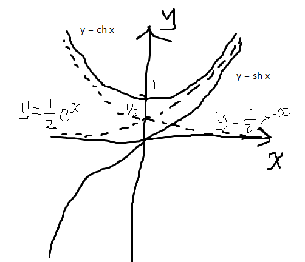
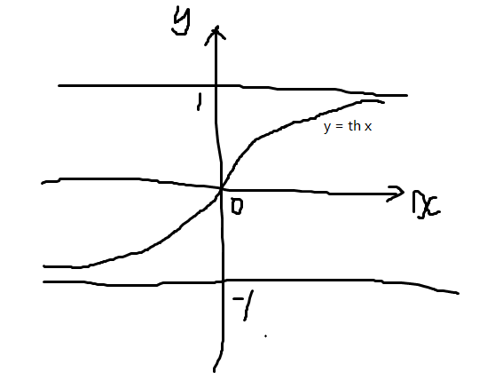
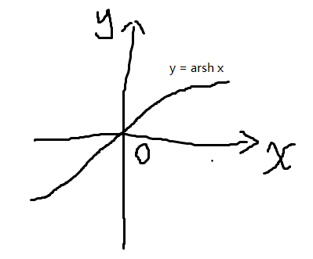
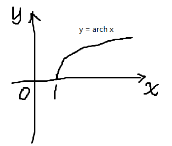
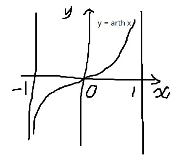

# Advanced Mathematics

## cache

* 开集

    如果点集$E$的点都是$E$的内点，则称$E$为开集。

    注：

    1. 这是对点集$E$的一种分类。直观上理解，就是一块区域$E$只有内部，没有边界，没有外部。我们能否模仿开区间的定义去定义开集？

        假如让我们定义开集，我们如何定义？假设把所有的点分为三类，一类在外部，一类在边界，一类在内部。我们先定义边界是什么，然后如果有一团点在边界内部并且包含边界内部所有的点，那么这团点组成的点集就是开集。外部点同理，也可以组成一个开集。

        目前也不清楚这个定义是如何演化过来的。

* 闭区域

    开区域连同它的边界一起所构成的点集称为闭区域。

    example:

    * $[5, +\infty)$是闭区域。向外的无穷的连通也是连通。

    * $[5, 6] \cap [7, 8]$是闭集，但不是闭区域，因为它不连通。

    注：

    1. 点集可能是多个圆圈，即不连通的。单个圆圈（即连通区域）是开区域。这样看来，区域主要是用于区分多个圆圈的。点集这个概念比较大，使用区域再细化一下。

    1. 这里的概念开区域又依赖其他概念，知识密度很高。

    1. 开区域和闭区域是两种特殊的连通集，重点就是研究这种独立的小圆圈。开区域是否有可能为边界到无限远这块地方？

* 无界集

    一个集合如果不是有界集，就称这集合为无界集。

    注：

    1. 这个概念也依赖有界集的概念，密度很大。

    1. 有界集决定了这个点集取不到无限大

* 内点

    如果存在点$P$的某个邻域$U(P)$，使得$U(P) \subset E$，则称$P$为$E$的内点。

    同理，还可以定义外点和边界点。

    注：

    1. 直观地理解，内点就是在点集$E$里面的点。它不在边界上，也不在点集外面。如果让我们去定义，我们可能怎么定义内点？我们可能定义：从内点出发作直线，如果任意直线都至少通过两次边界点，那么这个点就是内点。

        这样看来，我们就得先定义边界点，定义直线。如果一个点集无限大，似乎使用直线就失效了。不清楚内点这个定义是如何被定义得这么巧妙的。

    1. 点集$E$是否有可能是离散的？如果是离散的，这个定义还适用吗？

## 第一章 函数与极限

### 第一节 映射与函数

常见的集合：

* 非负整数（自然数）：$\mathbf N = \{  0, 1, 2, \dots, n, \dots\}$

* 正整数：$\mathbf N^+ = \{ 1, 2, 3, \dots, n, \dots \}$

* 整数：$\mathbf Z = \{ \dots, -n, \dots, -2, -1, 0, 1, 2, \dots, n, \dots \}$

* 有理数：$\mathbf Q \left\{ \left. \dfrac p q \, \right\vert \, p \in \mathbf Z,\ q \in \mathbf N^+ 且\, p \, 与 \, q \, 互质 \right\}$, $\mathbf R^*$为排除 0 的实数集，$\mathbf R^+$为全体正实数的集。

**属于**：如果$a$是集合$A$的元素，就说$a$属于$A$，记作$a \in A$；如果$a$不是集合$A$的元素，就说$a$不属于$A$，记作$a \notin A$。

**子集**：若集合$A$的元素都是集合$B$的元素，则称集合$A$是集合$B$的子集，记作$A \subset B$，或$B \supset A$。

**真子集**：若$A \subset B$且$A \neq B$，则称$A$是$B$的真子集，记作$A \subsetneq B$。

**空集**：不含任何元素的集合称为空集，记作$\varnothing$。空集是任何集合$A$的子集。

集合的运算：

* 并集：$A \cup B = \{ x \, \vert \, x \in A 或 x \in B \}$

* 交集：$A \cap B = \{ x \, \vert \, x \in A 且 x \in B \}$

* 差集：$A \setminus B = \{ x \, \vert \, x \in A 且 x \notin B \}$

**全集与补集**：问题的限定集合$I$称为全集，对于所研究的其他集合，$I \setminus A$称为$A$的补集或余集，记作$A^C$。

集合的运算法则：

1. 交换律

    $A \cup B = B \cup A$

    $A \cap B = B \cap A$

1. 结合律

    $(A \cup B) \cup C = A \cup (B \cup C)$

    $(A \cap B) \cap C = A \cap (B \cap C)$

1. 分配律

    $(A \cup B) \cap C = (A \cap C) \cup (B \cap C)$
    
    $(A \cap B) \cup C = (A \cup C) \cap (B \cup C)$

1. 对偶律

    $(A \cup B)^C = A^C \cap B^C$

    $(A \cap B)^C = A^C \cup B^C$

**直积**：$A \times B = \{ (x, y) \, \vert \, x \in A 且 y \in B \}$。例如$\mathbf R^2 = \mathbf R \times \mathbf R = \{ (x, y) \, \vert \, x \in \mathbf R, y \in \mathbf R \}$为$xOy$平面上全体点的集合。

**邻域**：以点$a$为中心的任何开区间称为点$a$的邻域，记作$U(a)$。

**$\delta$邻域**：设$\delta$是任一正数，则开区间$(a - \delta, a + \delta)$就是点$a$的一个邻域，这个邻域称为点$a$的$\delta$邻域，记作$U(a, \delta)$，即

$$U(a, \delta) = \{ x \, \vert \, a - \delta \lt x \lt a + \delta \}$$

点$a$称为领域的中心，$\delta$称为邻域的半径。点$a$的$\delta$邻域去掉中心$a$后，称为点$a$的去心$\delta$邻域，记作$\overset{\circ}U (a, \delta)$。

两个闭区间的直积表示$xOy$平面上的矩形区域：

$$[a, b] \times [c, d] = \{ (x, y) \, \vert \, x \in [a, b], y \in [c, d] \}$$

**映射**：设$X$，$Y$是两个非空集合，如果存在一个法则$f$，使得对$X$中每个元素$x$，按法则$f$，在$Y$中有唯一确定的元素$y$与之对应，则称$f$为从$X$到$Y$的映射，记作

$$f: X \rightarrow Y$$

其中$y$称为元素$x$在映射$f$下的像，并记作$f(x)$，即

$$y = f(x)$$

元素$x$称为元素$y$在映射$f$下的一个原像；集合$X$称为映射$f$的定义域，记作$D_f$，即$D_f = X$；$X$中所有元素的像所组成的集合称为映射$f$的值域，记作$R_f$或$f(X)$，即

$$R_f = f(X) = \{ f(x) \, \vert \, x \in X \}$$

**满射**：设$f$是从集合$X$到集合$Y$的映射，若$R_f = Y$，即$Y$中任一元素$y$都是$X$中某元素的像，则称$f$为$X$到$Y$上的映射或满射。

**单射**：若对$X$中任意两个不同元素$x_1 \neq x_2$，它们的像$f(x_1) \neq f(x_2)$，则称$f$为$X$到$Y$的单射。

**双射**：若映射$f$既是单射，又是满射，则称$f$为一一映射或双射。

**逆映射**：设$f$是$X$到$Y$的单射，对每个$y \in R_f$，有唯一的$x \in X$，适合$f(x) = y$。于是我们可以定义一个从$R_f$到$X$的新映射$g$，即$g: R_f \to X$，对每个$y \in R_f$，规定$g(y) = x$，这$x$满足$f(x) = y$。映射$g$称为$f$的逆映射，记作$f^{-1}$。其定义域$D_f^{-1} = R_f$，值域$R_f^{-1} = X$。

**复合映射**：设有两个映射$g: X \to Y_1$，$f: Y_2 \to Z$。其中$Y_1 \subset Y_2$，则由映射$g$和$f$可以定出一个从$X$到$Z$的对应法则，它将每个$x \in X$映成$f[g(x)] \in Z$。这个对应法则确定了一个从$X$到$Z$的映射，这个映射称为映射$g$和$f$构成的复合映射，记作$f \circ g$，即

$$f \circ g: X \to Z$$

$$(f \circ g) (x) = f[g(x)], \quad x \in X$$

映射$g$和$f$构成复合映射的条件是：$g$的值域$R_g$必须包含在$f$的定义域内，即$R_g \subset D_f$。

**函数**：设数集$D \subset \mathbf R$，则称映射$f: D \rightarrow \mathbf R$为定义在$D$上的函数，通常简记为$y = f(x)$，$x \in D$，其中$x$称为自变量，$y$称为因变量，$D$称为定义域，记作$D_f$，即$D_f = D$。

函数的性质：

* 有界性

    设函数$f(x)$的定义域为$D$，数集$X \subset D$。如果存在数$K_1$，使得$f(x) \leq K_1$对任一$x \in X$都成立，则称函数$f(x)$在$X$上有上界，而$K_1$称为函数$f(x)$在$X$上的一个上界。
    
    如果存在数$K_2$，使得$f(x) \geq K_2$对任一$x \in X$都成立，则称函数$f(x)$在$X$上有下界，而$K_2$称为函数$f(x)$在$X$上的一个下界。
    
    如果存在正数$M$，使得$\lvert f(x) \rvert \leq M$对任一$x \in X$都成立，则称函数$f(x)$在$X$上有界。
    
    如果这样的$M$不存在，就称函数$f(x)$在$X$上无界。即如果对于任何正数$M$，总存在$x_1 \in X$，使$\lvert f(x_1) \rvert \gt M$，那么函数$f(x)$在$X$上无界。

* 单调性

    设函数$f(x)$的定义域为$D$，区间$I \subset D$。如果对于区间$I$上任意两点$x_1$及$x_2$，当$x_1 \lt x_2$时，恒有$f(x_1) \lt f(x_2)$，则称函数$f(x)$在区间$I$上是单调增加的。

    如果对于区间$I$上一任意两点$x_1$及$x_2$，当$x_1 \lt x_2$时，恒有$f(x_1) \gt f(x_2)$，则称函数$f(x)$在区间$I$上是单调减少的。

    单调增加和单调减少的函数统称为单调函数。

* 奇偶性

    设函数$f(x)$的定义域$D$关于原点对称。如果对于任一$x \in D$，$f(-x) = f(x)$恒成立，则称$f(x)$为偶函数。

    如果对于任一$x \in D$，$f(-x) = -f(x)$恒成立，则称$f(x)$为奇函数。

* 周期性

    设函数$f(x)$的定义域为$D$。如果存在一个正数$l$，使得对于任一$x \in D$有$(x \pm l) \in D$，且$f(x + l) = f(x)$恒成立，则称$f(x)$为周期函数，$l$称为$f(x)$的周期。通常我们说的周期指的是最小正周期。

    有关周期性的一些结论：

    1. 并非所有周期函数都有最小正周期。比如狄利克雷函数，任何正有理数$r$都是它的周期。还有常函数。

    1. 两周期函数的和、差的周期是最小公倍数。

**反函数**

**复合函数**

函数的运算

* 和（差）$f \pm g$：$(f \pm g) (x)$

* 积$f \cdot g$：

* 商$\dfrac f g$：

**基本初等函数**

* 幂函数：$y = x^\mu$（$\mu \in \mathbf R$是常数）

* 指数函数：$y = a^x$（$a \gt 0$且$a \neq 1$）

* 对数函数：$y = \log_a x$（$a \gt 0$且$a \neq 1$，特别当$a = e$时，记为$y = \ln x$）

* 三角函数：$y = \sin x$，$y = \cos x$，$y = \tan x$

* 反三角函数：$y = \arcsin x$，$y = \arccos x$，$y = \arctan x$

**初等函数**：由常数和基本初等函数经过有限次的四则运算和有限次的函数复合步骤所构成并可用一个式子表示的函数，称为初等函数。

双曲函数：

* 双曲正弦：$\mathop{\mathrm{sh}} x = \dfrac{e^x - e^{-x}}{2}$

* 双曲余弦：$\mathop{\mathrm{ch}} x = \dfrac{e^x + e^{-x}}{2}$

* 双曲正切：$\mathop{\mathrm{th}} x = \dfrac{\mathop{\mathrm{sh}} x}{\mathop{\mathrm{ch}} x} = \dfrac{e^x - e^{-x}}{e^x + e^{-x}}$

双曲函数的图像：

反双曲函数：

* 反双曲正弦：$\mathop{\mathrm{arsh}} x = \ln (x + \sqrt{x^2 + 1})$

* 反双曲余弦：$\mathop{\mathrm{arch}} x = \ln (x + \sqrt{x^2 - 1})$

* 反双曲正切：$\mathop{\mathrm{arth}} x = \dfrac 1 2 \ln \dfrac{1 + x}{1 - x}$

反双曲函数的图像：

#### 习题

1. 设$A$，$B$是任意两个集合，证明对偶律：$(A \cap B)^C = A^C \cup B^C$。

    解：

    $\begin{aligned} (A \cap B)^C &= \{ x \, \vert \, x \not \in A \cap B \} \\ &= \{ x \, \vert \, x \not \in A 或 x \not \in B \} \\ &= \{ x \, \vert \, x \in A^C 或 x \in B^C \} \\ &= A^C \cup B^C \end{aligned}$

    感想：$\{ x \, \vert \, x \not \in A \cap B \} = \{ x \, \vert \, x \not \in A 或 x \not \in B \}$是怎么得到的呢？并没有定律来解释这条公式，或许只能从语言逻辑学的角度来解释了。但是其实逻辑学与集合论在底层是高度重合的，这样就更难解释清了。

1. 设映射$f: X \to Y$，$A \subset X$，$B \subset X$，证明

    1. $f(A \cup B) = f(A) \cup f(B)$

    1. $f(A \cap B) \subset f(A) \cap f(B)$

    解：

    1. 证明：

        $\begin{aligned} f(A \cup B) &= \{ f(x) \, \vert \, x \in A 或 x \in B \} \\ &= \{ f(x) \, \vert \, x \in A \} \cup \{ f(x) \, \vert \, x \in B \} \\ &= f(A) \cup f(B) \end{aligned}$

    1. 证明：

        $f(A \cap B) = \{ f(x) \, \vert \, x \in A 且 x \in B \}$

        $\{ f(x) \, \vert \, x \in A 且 x \in B \} \subset \{ f(x) \, \vert \, x \in A \}$

        $\{ f(x) \, \vert \, x \in A 且 x \in B \} \subset \{ f(x) \, \vert \, x \in B \}$

        $\Rightarrow$ $\{ f(x) \, \vert \, x \in A 且 x \in B \} \subset \{ f(x) \, \vert \, x \in A \} \cap \{ f(x) \, \vert \, x \in B \}$

        $\Rightarrow$ $f(A \cap B) \subset f(A) \cap f(B)$

    感想：为什么“或”的时候，可以把一个集合拆开成两个。“交”的时候却不可以呢？

1. 设映射$f: X \to Y$，若存在一个映射$g: Y \to X$，使$g \circ f = I_X$，$f \circ g = I_Y$，其中$I_X$、$I_Y$分别是$X$、$Y$上的恒等映射，即对于每一个$x \in X$，有$I_X x = x$；对于每一个$y \in Y$，有$I_Y y = y$，证明：$f$是双射，且$g$是$f$的逆映射：$g = f^{-1}$。

    证明：

    设$\forall y \in Y$，有$g(y) = x \in X$

    $\left. \begin{aligned} f[g(y)] = I_Y \\ I_Y y = y \end{aligned} \right \vert \Rightarrow f[g(y)] = y$

    $\left. \begin{aligned} f[g(y)] = y \\ g(y) = x \end{aligned} \right\vert \Rightarrow f(x) = y$

    即$Y$中任一元素$y$都是$x$中某元素的像 $\Rightarrow$ $f$为满射。

    设$\forall x_1, x_2 \in X$，有$x_1 \neq x_2$，$f(x_1) = y_1$，$f(x_2) = y_2$

    $\left. \begin{aligned} g[f(x_1)] = I_X x_1 \\ I_X x_1 = x_1 \end{aligned} \right\vert \Rightarrow g[f(x_1)] = x_1$

    $\left. \begin{aligned} g[f(x_1)] = x_1 \\ f(x_1) = y_1 \end{aligned} \right\vert \Rightarrow g(y_1) = x_1$，同理$g(y_2) = x_2$，同理$g(y_2) = x_2$

    $\left. \begin{aligned} x_1 \neq x_2 \\ g(y_1) = x_1 \\ g(y_2) = x_2 \end{aligned} \right\vert \Rightarrow g(y_1) \neq g(y_2)$

    若$f(x_1) = f(x_2)$，则有$y_1 = y_2$ $\Rightarrow$ $g(y_1) = g(y_2)$，与已知结论矛盾。

    因此$f(x_1) \neq f(x_2)$ $\Rightarrow$ $f$是单射。

    因为$f$既是满射，又是单射，所以$f$是双射。

    设$f(x) = y$，有$g(y) = g(f(x)) = I_X x = x$

    所以$g = f^{-1}$。

### 第二节 数列的极限

**数列极限**：设$\{ x_n \}$为一数列，如果存在常数$a$，对于任意给定的正数$\epsilon$（不论它多么小），总存在正整数$N$，使得当$n \gt N$时，不等式$\lvert x_n - a \rvert \lt \epsilon$都成立，那么就称常数$a$是数列$\{ x_n \}$的极限，或者称数列$\{ x_n \}$收敛于$a$，记为$\lim\limits_{n \rightarrow \infty} x_n = a$，或$x_n \rightarrow a (n \rightarrow \infty)$。

如果不存在这样的常数$a$，就说数列$\{ x_n \}$没有极限，或者说数列$\{ x_n \}$是发散的。

也可以这样写：

$\lim\limits_{n\to \infty} x_n = a \Leftrightarrow \forall \epsilon \gt 0$，$\exists$正整数$N$，当$n \gt N$时，有$\lvert x_n - a \rvert \lt \epsilon$。

**子数列**：在数列$\{ x_n \}$中任意抽取无限多项并保持这些项在原数列$\{ x_n \}$中的先后次序，这样得到的一个数列$\{ x_{n_k} \}$称为原数列$\{ x_n \}$的子数列（或子列）。

在子数列$\{ x_{n_k} \}$中，一般项$x_{n_k}$是第$k$项，而$x_{n_k}$在原数列$\{ x_n \}$中却是第$n_k$项。显然$n_k \geq k$。

收敛数列的性质：

1. 极限的唯一性

    如果数列$\{ x_n \}$收敛，那么它的极限唯一。

1. 收敛数列的有界性

    如果数列$\{ x_n \}$收敛，那么数列$\{ x_n \}$一定有界。

    推论：数列有界是数列收敛的必要条件，但不是充分条件。无界数列必发散。

1. 收敛数列的保号性

    如果$\lim\limits_{n \to \infty} x_n = a$，且$a \gt 0$（或$a \lt 0$），那么存在正整数$N \gt 0$，当$n \gt N$时，都有$x_n \gt 0$（或$x_n \lt 0$）。

    推论：如果数列$\{ x_n \}$从某项起有$x_n \geq 0$（或$x_n \leq 0$），且$\lim\limits_{n \to \infty} x_n = a$，那么$a \geq 0$（或$a \leq 0$）。

1. 收敛数列与其子数列间的关系

    如果数列$\{ x_n \}$收敛于$a$，那么它的任一子数列也收敛，且极限也是$a$。

    推论：

    1. 子数列发散，原数列也发散。

    1. 如果数列$\{ x_n \}$有两个子数列收敛于不同的极限，那么数列$\{ x_n \}$是发散的。

    1. 一个发散的数列也有可能有收敛的子数列。

    1. 奇数子列与偶数子列都收敛于$A$，则原数列收敛于$A$。

### 第三节 函数的极限

**函数的极限（自变量趋于有限值）**：$\lim\limits_{x \to x_0} f(x) = A$ $\Leftrightarrow$ $\forall \epsilon \gt 0$，$\exists \delta \gt 0$，当$0 \lt \lvert x - x_0 \rvert \lt \delta$时，有$\lvert f(x) - A \rvert \lt \epsilon$。

注：$x \to x_0$时$f(x)$有没有极限，与$f(x)$在点$x_0$是否有定义并无关系。

**左极限、右极限**：在$\lim\limits_{x \to x_0} f(x) = A$的定义中，把$0 \lt \lvert x - x_0 \rvert \lt \delta$改为$x_0 - \delta \lt x \lt x_0$，那么$A$就叫做函数$f(x)$当$x \to x_0$的左极限，记作$\lim\limits_{x \to x_0^-} f(x) = A$或$f(x_0^-) = A$。

在$\lim\limits_{x \to x_0} f(x) = A$的定义中，把$0 \lt \lvert x - x_0 \rvert \lt \delta$改为$x_0 \lt x \lt x_0 + \delta$，那么$A$就叫做函数$f(x)$当$x \to x_0$的右极限，记作$\lim\limits_{x \to x_0^+} f(x) = A$或$f(x_0^+) = A$。

函数$f(x)$当$x \to x_0$时极限存在的充分必要条件是左极限和右极限各自存在并相等，即$f(x_0^-) = f(x_0^+)$。

**函数的极限（自变量趋于无穷大）**：$\lim\limits_{x \to \infty} f(x) = A$ $\Leftrightarrow$ $\forall \epsilon \gt 0$，$\exists X \gt 0$，当$\lvert x \rvert \gt X$时，有$\lvert f(x) - A \rvert \lt \epsilon$。

函数极限的性质：

1. 唯一性

    如果$\lim\limits_{x \to x_0} f(x)$存在，那么这极限唯一。

1. 局部有界性

    如果$\lim\limits_{x \to x_0} f(x) = A$，那么存在常数$M \gt 0$和$\delta \gt 0$，使得当$0 \lt \lvert x - x_0 \rvert \lt \delta$时，有$\lvert f(x) \rvert \leq M$。

1. 保号性

    如果$\lim\limits_{x \to x_0} f(x) = A$，而且$A \gt 0$（或$A \lt 0$），那么存在常数$\delta \gt 0$，使得当$0 \lt \lvert x - x_0 \rvert \lt \delta$时，有$f(x) \gt 0$（或$f(x) \lt 0$）。

    如果$\lim\limits_{x \to x_0} f(x) = A$（$A \neq 0$），那么就存在着$x_0$的某一去心邻域$\overset{\circ}{U} (x_0)$，当$x \in \overset \circ U (x_0)$时，就有$\lvert f(x) \rvert \gt \dfrac{\lvert A \rvert}{2}$。

    推论：

    如果在$x_0$的某去心邻域内$f(x) \geq 0$（或$f(x) \leq 0$），而且$\lim\limits_{x \to x_0} f(x) = A$，那么$A \geq 0$（或$A \leq 0$）。

1. 函数极限与数列极限的关系

    如果极限$\lim\limits_{x \to x_0} f(x)$存在，$\{ x_n \}$为函数$f(x)$的定义域内任一收敛于$x_0$的数列，且满足$x_n \neq x_0$（$n \in N^+$），那么相应的函数值数列$\{ f(x_n) \}$必收敛，且$\lim\limits_{n \to \infty} f(x_n) = \lim\limits_{x \to x_0} f(x)$。

### 第四节 无穷小与无穷大

### 第五节 极限运算法则

### 第六节 极限存在准则 两个重要极限

### 第七节 无穷小的比较

### 第八节 函数的连续性与间断点

### 第九节 连续函数的运算与初等函数的连续性

### 第十节 闭区间上连续函数的性质

## 第二章 导数与微分

### 第一节 导数概念

**导数定义**：设函数$y = f(x)$在点$x_0$的某个邻域内有定义，当自变量$x$在$x_0$处取得增量$\Delta x$（点$x_0 + \Delta x$仍在该邻域内）时，相应地函数取得增量$\Delta y = f(x_0 + \Delta x) - f(x_0)$；如果$\Delta y$与$\Delta x$之比当$\Delta x \to 0$时的极限存在，则称函数$y = f(x)$在点$x_0$处可导，并称这个极限为函数$y = f(x)$在点$x_0$处的导数，记为$f'(x_0)$，即

$$f'(x_0) = \lim\limits_{\Delta x \to 0} \dfrac{\Delta y}{\Delta x} = \lim\limits_{\Delta x \to 0} \dfrac{f(x_0 + \Delta x) - f(x_0)}{\Delta x}$$

也可记作$y' \vert_{x = x_0}$，$\left. \dfrac{\mathrm d y}{\mathrm d x} \right \vert_{x = x_0}$或$\left. \dfrac{\mathrm d f(x)}{\mathrm d x} \right\vert_{x = x_0}$。

其它两种导数的定义式：

$$f'(x_0) = \lim\limits_{h \to 0} \dfrac{f(x_0 + h) - f(x_0)}{h}$$

$$f'(x_0) = \lim\limits_{x \to x_0} \dfrac{f(x) - f(x_0)}{x - x_0}$$

### 第二节 函数的求导法则

1. 常数和基本初等函数的导数公式

    1. $(C)' = 0$

    1. $(x^\mu)' = \mu x^{\mu - 1}$

    1. $(\sin x)' = \cos x$

    1. $(\cos x)' = - \sin x$

    1. $(\tan x)' = \sec^2 x$

    1. $(\cot x)' = - \csc^2 x$

    1. $(\sec x)' = \sec x \tan x$

    1. $(\csc x)' = - \csc x \cot x$

    1. $(a^x)' = a^x \ln a$

    1. $(e^x)' = e^x$

    1. $(\log_a x)' = \dfrac{1}{x \ln a}$

    1. $(\ln x)' = \dfrac 1 x$

    1. $(\arcsin x)' = \dfrac{1}{\sqrt{1 - x^2}}$

    1. $(\arccos x)' = - \dfrac{1}{\sqrt{1 - x^2}}$

    1. $(\arctan x)' = \dfrac{1}{1 + x^2}$

    1. $(\mathop{\mathrm{arccot}} x)' = - \dfrac{1}{1 + x^2}$

1. 函数的和、差、积、商的求导法则

    1. $(u \pm v)' = u' \pm v'$

    1. $(Cu)' = Cu'$（$C$是常数）

    1. $(uv)' = u'v + uv'$

    1. $\left( \dfrac{u}{v} \right)' = \dfrac{u'v - uv'}{v^2}$（$v \neq 0$）

1. 反函数的求导法则

    设$x = f(y)$在区间$I_y$内单调、可导且$f'(y) \neq 0$，则它的反函数$y = f^{-1}(x)$在$I_x = f(I_y)$内也可导，且$[f^{-1}(x)]' = \dfrac{1}{f'(y)}$或$\dfrac{\mathrm d y}{\mathrm d x} = \dfrac{1}{\dfrac{\mathrm d x}{\mathrm d y}}$

1. 复合函数求导法则

    设$y = f(u)$，而$u = g(x)$且$f(u)$及$g(x)$都可导，则复合函数$y = f[g(x)]$的导数为$\dfrac{\mathrm d y}{\mathrm d x} = \dfrac{\mathrm d y}{\mathrm d u} \cdot \dfrac{\mathrm d u}{\mathrm d x}$或$y'(x) = f'(u) \cdot g'(x)$。

1. 双曲函数及反双曲函数的导数公式

    1. $(\mathop{\mathrm{sh}} x)' = \mathop{\mathrm{ch}} x$

    1. $(\mathop{\mathrm{ch}} x)' = \mathop{\mathrm{sh}} x$

    1. $(\mathop{\mathrm{th}} x)' = \dfrac{1}{\mathop{\mathrm{ch}^2} x}$

    1. $(\mathop{\mathrm{arsh}} x)' = \dfrac{1}{\sqrt{1 + x^2}}$

    1. $(\mathop{\mathrm{arch}} x)' = \dfrac{1}{\sqrt{x^2 - 1}}$

    1. $(\mathop{\mathrm{arth}} x)' = \dfrac{1}{1 - x^2}$

### 第三节 高阶导数

### 第四节 隐函数及由参数方程所确定的函数的导数 相关变化率

### 第五节 函数的微分

## 第三章 微分中值定理与导数的应用

### 第一节 微分中值定理

**费马引理**：设函数$f(x)$在$x_0$的某邻域$U(x_0)$内有定义，并且在$x_0$处可导，如果对任意的$x \in U(x_0)$，有$f(x) \leq f(x_0)$（或$f(x) \geq f(x_0)$），那么$f'(x_0) = 0$。

**罗尔定理**：如果函数$f(x)$满足

1. 在闭区间$[a, b]$上连续

1. 在开区间$(a, b)$内可导

1. 在区间端点处的函数值相等，即$f(a) = f(b)$

那么在$(a, b)$内至少有一点$\xi (a \lt \xi \lt b)$，使得$f'(\xi) = 0$。

**拉格朗日中值定理**：如果函数$f(x)$满足

1. 在闭区间$[a, b]$上连续

1. 在开区间$(a, b)$内可导

那么在$(a, b)$内至少有一点$\xi (a \lt \xi \lt b)$，使等式$f(b) - f(a) = f'(\xi) (b - a)$成立。

**柯西中值定理**：如果函数$f(x)$及$F(x)$满足

1. 在闭区间$[a, b]$上连续

1. 在开区间$(a, b)$内可导

1. 对任一$x \in (a, b)$，$F'(x) \neq 0$

那么在$(a, b)$内至少有一点$\xi$，使等式$\dfrac{f(b) - f(a)}{F(b) - F(a)} = \dfrac{f'(\xi)}{F'(\xi)}$成立。

### 第二节 洛必达法则

**未定式**：如果当$x \to a$（或$x \to \infty$）时，两个函数$f(x)$与$F(x)$都趋于零或都趋于无穷大，那么极限$\lim\limits_{x \to a \\ (x \to \infty)} \dfrac{f(x)}{F(x)}$称为未定式，并分别简记为$\dfrac 0 0$或$\dfrac \infty \infty$。这个极限可能存在，也可能不存在。

**$x \to a$时，未定式$\dfrac 0 0$的洛必达（L'Hospital）法则**：

设

1. 当$x \to a$时，函数$f(x)$及$F(x)$都趋于零

1. 在点$a$的某去心邻域内，$f'(x)$及$F'(x)$都存在且$F'(x) \neq 0$

1. $\lim\limits_{x \to a} \dfrac{f'(x)}{F'(x)}$存在（或为无穷大）

那么$\lim\limits_{x \to a} \dfrac{f(x)}{F(x)} = \lim\limits_{x \to a} \dfrac{f'(x)}{F'(x)}$.

**$x \to \infty$时，未定式$\dfrac 0 0$的洛必达法则**：

设

1. 当$x \to \infty$时，函数$f(x)$及$F(x)$都趋于零

1. 当$\lvert x \rvert \gt N$时$f'(x)$与$F'(x)$都存在，且$F'(x) \neq 0$

1. $\lim\limits_{x \to \infty} \dfrac{f'(x)}{F'(x)}$存在（或为无穷大）

那么$\lim\limits_{x \to \infty} \dfrac{f(x)}{F(x)} = \lim\limits_{x \to \infty} \dfrac{f'(x)}{F'(x)}$

### 第三节 泰勒公式

**泰勒（Talor）中值定理**：如果函数$f(x)$在含有$x_0$的某个开区间$(a, b)$内具有直到$(n+1)$阶的导数，则对任一$x \in (a, b)$，有

$$f(x) = f(x_0) + f'(x_0) (x - x_0) + \dfrac{f''(x_0)}{2!} (x - x_0)^2 + \cdots + \dfrac{f^{(n)} (x_0)}{n!} (x - x_0)^n + R_n (x)$$

$$R_n (x) = \dfrac{f^{(n+1)} (\xi)}{(n+1)!} (x - x_0)^{(n+1)}$$

其中$\xi$是$x_0$与$x$之间的某个值。

常见函数的泰勒展开：

* $e^x = 1 + x + \dfrac{x^2}{2!} + \cdots + \dfrac{x^n}{n!} + \dfrac{e^{\theta x}}{(n+1)!} x^{n+1} \quad (0 \lt \theta \lt 1)$

* $\sin x = x - \dfrac{x^3}{3!} + \dfrac{x^5}{5!} - \cdots + (-1)^{m-1} \dfrac{x^{2m - 1}}{(2m - 1)!} + R_{2m}$
    
    其中$R_{2m} (x) = \dfrac{\sin \left[ \theta x + (2m + 1) \dfrac{\pi}{2} \right]}{(2m + 1)!} x^{2m +1}，(0 \lt \theta \lt 1)$

* $\cos x = 1 - \dfrac{1}{2!} x^2 + \dfrac{1}{4!} x^4 - \cdots + (-1)^m \dfrac{1}{(2m)!} x^{2m} + R_{2m+1} (x)$

    其中$R_{2m+1} (x) = \dfrac{\cos [\theta x + (m + 1) \pi]}{(2m + 2)!} x^{2m + 2}$，$(0 \lt \theta \lt 1)$

* $\ln (1 + x)$

* $(1 + x)^\alpha$

### 第四节 函数的单调性与曲线的凹凸性

### 第五节 函数的极值与最大值最小值

### 第六节 函数图形的描绘

### 第七节 曲率

### 第八节 方程的近似解

## 第四章 不定积分

### 第一节 不定积分的概念与性质

**原函数**：如果在区间$I$上，可导函数$F(x)$的导函数为$f(x)$，即对任一$x \in I$，都有$F'(x) = f(x)$或$\mathrm d F(x) = f(x) \mathrm d x$，那么函数$F(x)$就称为$f(x)$（或$f(x) \mathrm d x$）在区间$I$上的原函数。

**原函数存在定理**：如果函数$f(x)$在区间$I$上连续，那么在区间$I$上存在可导函数$F(x)$，使对任一$x \in I$都有$F'(x) = f(x)$。即连续函数一定有原函数。

**不定积分**：在区间$I$上，函数$f(x)$的带有任意常数项的原函数称为$f(x)$（或$f(x) \mathrm d x$）在区间$I$上的不定积分，记作$\int f(x) \mathrm d x$，其中$\int$称为积分号，$f(x)$称为被积函数，$f(x) \mathrm d x$称为被积表达式，$x$称为积分变量。

不定积分可用原函数表示为：

$$\int f(x) \mathrm d x = F(x) + C$$

微分运算与不定积分的关系：

1. $\dfrac{\mathrm d}{\mathrm d x} \left[ \displaystyle\int f(x) \mathrm d x \right] = f(x)$，或$\mathrm d \left[ \displaystyle\int f(x) \mathrm d x \right] = f(x) \mathrm d x$

1. $\displaystyle\int F'(x) \mathrm d x = F(x) = C$，或$\displaystyle\int \mathrm d F(x) = F(x) + C$

基本积分表：

1. $\displaystyle\int k \mathrm d x = k x + C$（$k$是常数）

1. $\displaystyle\int x^\mu \mathrm d x = \dfrac{x^{\mu + 1}}{\mu + 1} + C$（$\mu \neq -1$）

1. $\displaystyle\int \dfrac{\mathrm d x}{x} = \ln \lvert x \rvert + C$

1. $\displaystyle\int \dfrac{\mathrm d x}{1 + x^2} = \arctan x + C$

1. $\displaystyle\int \dfrac{\mathrm d x}{\sqrt{1 - x^2}} = \arcsin x + C$

1. $\displaystyle\int \cos x \mathrm d x = \sin x + C$

1. $\displaystyle\int \sin x \mathrm d x = - \cos x + C$

1. $\displaystyle\int \dfrac{\mathrm d x}{\cos^2 x} = \int \sec^2 x \mathrm d x = \tan x + C$

1. $\displaystyle\int \dfrac{\mathrm d x}{\sin^2 x} = \int \csc^2 x \mathrm d x = - \cot x + C$

1. $\displaystyle\int \sec x \tan x \mathrm d x = \sec x + C$

1. $\displaystyle\int \csc x \cot x \mathrm d x = - \csc x + C$

1. $\displaystyle\int e^x \mathrm d x = e^x + C$

1. $\displaystyle\int a^x \mathrm d x = \dfrac{a^x}{\ln a} + C$

1. $\displaystyle\int \mathop{\mathrm{sh}} x \mathrm d x = \mathop{\mathrm{ch}} x + C$

1. $\displaystyle\int \mathop{\mathrm{ch}} x \mathrm d x = \mathop{\mathrm{sh}} x + C$

不定积分的性质：

1. 设函数$f(x)$及$g(x)$的原函数存在，则$\displaystyle\int [f(x) + g(x)] \mathrm d x = \int f(x) \mathrm d x + \int g(x) \mathrm d x$

1. 设函数$f(x)$的原函数存在，$k$非零常数，则$\displaystyle\int kf(x) \mathrm d x = k \int f(x) \mathrm d x$

### 第二节 换元积分法

### 第三节 分部积分法

### 第四节 有理函数的积分

### 第五节 积分表的使用

## 第五章 定积分

### 第一节 定积分的概念与性质

**定积分**：设函数$f(x)$在$[a, b]$上有界，在$[a, b]$中任意插入若干个分点$a = x_0 \lt x_1 \lt x_2 \lt \cdots \lt x_{n-1} \lt x_n = b$，把区间$[a, b]$分成$n$个小区间$[x_0, x_1]$，$[x_1, x_2]$，$\dots$，$[x_{n-1}, x_n]$，各个小区间的长度依次为$\Delta x_1 = x_1 - x_0$，$\Delta x_2 = x_2 - x_1$，$\dots$，$\Delta x_n = x_n - x_{n-1}$。在每个小区间$[x_{i-1}, x_i]$上任取一点$\xi_i$（$x_{i-1} \leq \xi_i \leq x_i$），作函数值$f(\xi_i)$与小区间长度$\Delta x_i$的乘积$f(\xi_i) \Delta x_i$（$i = 1, 2, \dots, n$），并作出和$S = \sum\limits_{i=1}^n f(\xi_i) \Delta x_i$。记$\lambda = \max\{ \Delta x_1, \Delta x_2, \dots, \Delta x_n \}$，如果不论对$[a, b]$怎样分法，也不论在小区间$[x_{i-1}, x_i]$上点$\xi_i$怎样取法，只要当$\lambda \to 0$时，和$S$总趋于确定的极限$I$，这里我们称这个极限$I$为函数$f(x)$在区间$[a, b]$上的定积分（简称积分），记作$\displaystyle\int_a^b f(x) \mathrm d x$，即$\displaystyle\int_a^b f(x) \mathrm d x = I = \lim\limits_{\lambda \to 0} \sum\limits_{i=1}^n f(\xi_i) \Delta x_i$，其中$f(x)$叫做被积函数，$f(x) \mathrm d x$叫做被积表达式，$x$叫做积分变量，$a$叫做积分下限，$b$叫做积分上限，$[a, b]$叫做积分区间。

### 第二节 微积分基本公式

### 第三节 定积分的换元法和分部积分法

### 第四节 反常积分

### 第五节 反常积分的审敛法 $\Gamma$函数

## 第六章 定积分的应用

## 第八章 多元函数微分法及其应用