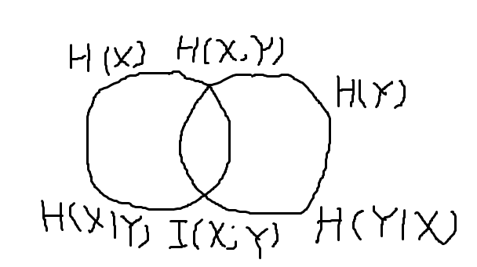
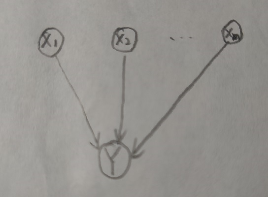
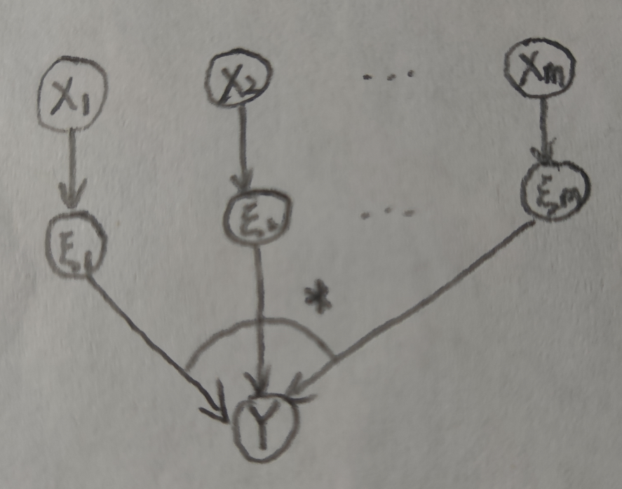
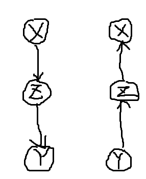
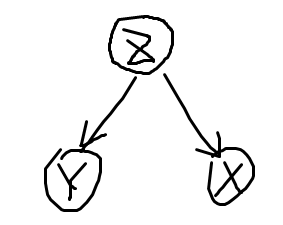
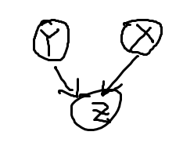
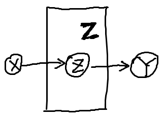
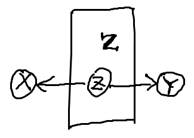
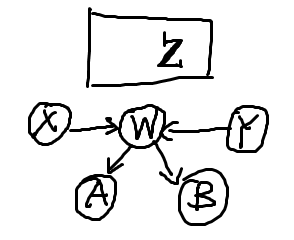

# 贝叶斯网引论 Note

## 样本空间

**随机试验**

随机试验指的是事先不能完全预知其结果的试验。

说明：

1. 这里的“结果”，实际上指的是我们的观察值或测量值。

    比如我们做的实验是在某片花圃里随机选一种花，观察它的花色和高度，那么在这个随机试验里，两个属性值“花色”和“高度”就代表了随机试验的结果。假设花色一共有两种，红色和蓝色，高度一共有三种，高、中、低。那么我们每次观测时得到的结果都是它们的一个组合：$\{红高\}$，$\{红低\}$，$\{蓝中\}$，$\{蓝高\}$等等。

    我们观察不到的属性，或者不想观察的属性，实际上也都被忽略了。比如叶子上是否有绒毛，根系是否发达等等。

**样本空间**

随机试验所有可能的结果组成的集合称为该试验的样本空间，记作$\Omega$。

说明：

1. 样本空间可以是离散的，也可以是连续的。

**样本点**，**原子事件**

随机试验的可能结果称为样本点，或原子事件，记为$\omega$。

**事件**，**事件发生**

样本空间的子集称为事件，通常用大写字母$A$，$B$，$\dots$表示。如果随机试验的结果包含在一个事件之中，则称该事件发生。

说明：

1. 样本空间$\Omega$本身也是一个事件，而且是一定会发生的必然事件。

1. 空集也是一个事件，是不可能事件，通常记为$\varnothing$。

**互斥事件**，**不相容事件**

若两事件$A$和$B$有$A \cap B = \varnothing$，则称它们为互斥事件，或不相容事件。

说明：

1. 两互斥事件不能同时发生。

**互补事件**

若$A$和$B$互斥，且$A \cup B = \Omega$，则称它们为互补事件。

**概率测度**

**Kolmogorov 公理**

**随机变量**

随机变量是定义在样本空间$\Omega$上的函数，通常用大写字母表示，如$X$，$Y$，$Z$。

随机变量的取值随试验的结果而定，通常用小写字母表示，如$x$，$y$，$z$。

**值域**，**状态空间**

随机变量$X$的所有可能取值的集合称为它的值域，也称状态空间，记作$\Omega_X$。

**随机变量与事件的关系**

设$X$为一随机变量，$x$是它的一个取值。在样本空间中，所有使$X$取值为$x$的原子事件组成一个事件，记为$\Omega_{X = x} = \{ \omega \in \Omega \mid X(\omega) = x \}$，简记为$X = x$。

说明：

1. $\Omega_{X = x}$与$\Omega_X$的含义完全不同，后者是随机变量$X$的状态空间，包括$X$的所有可能取值。

1. 一个随机变量的取值可能包含一个或多个事件。而一个事件又可能包含多个原子事件。

**概率质量函数**

$P(X = x) = P(\Omega_{X = x})$依赖于$X$的取值$x$，让$x$在$\Omega_X$上变动，$P(X = x)$就成为$\Omega_X$的一个取值于$[0, 1]$的函数，称之为随机变量$X$的概率质量函数，记为$P(X)$。

**联合概率分布**

对于多个随机变量$X_1$，$\dots$，$X_n$，可以用联合概率分布$P(X_1, \dots, X_n)$，简称联合分布来描述各变量所有可能的状态组合的概率。它是一个定义在所有变量状态空间的笛卡尔乘积之上的函数：

$$P(X_1, \dots, X_n): \bigotimes_{i=1}^n \Omega_{X_i} \rightarrow [0, 1]$$

其中所有函数值之和为 1，即

$$\sum\limits_{X_1, \dots, X_n} P(X_1, \dots, X_n) = 1$$

说明：

1. 联合分布经常被表示为一张表，其中包含了$\displaystyle \prod\limits_{i=1}^n \lvert \Omega_{X_i} \rvert$个状态组合及其概率值。如果所有变量都只取两个状态，则联合分布表共有$2^n$个项，刻画了变量之间的各种关系。

**边缘分布**

记$\mathbf X = \{X_1, \dots, X_n\}$，$\mathbf Y$是$X$的真子集，即$\mathbf Y \subset \mathbf X$，$\mathbf Z = \mathbf X \setminus \mathbf Y$。则相对于$P(\mathbf X)$，$\mathbf Y$的边缘分布$P(\mathbf Y)$定义为

$$P(\mathbf Y) = \sum\limits_{\mathbf Z} P(X_1, \dots, X_n)$$

从联合分布$P(\mathbf X)$到边缘分布$P(\mathbf Y)$的过程称为边缘化。

**条件概率**

设$A$，$B$为两随机事件，且$P(B) \gt 0$，事件$A$在给定事件$B$发生时的条件概率定义为

$$P(A \mid B) = \dfrac{P(A \cap B)}{P(B)}$$

说明：

1. $P(B) \gt 0$其实就是要求$P(B) \neq 0$。

1. 直观上，$P(A \mid B)$是在已知$B$发生时，对$A$发生的信度；而$P(A)$则是在不知道$B$是否发生时，对$A$发生的信度。

1. 为什么条件概率要以定义的形式给出，而不以定律的形式给出呢？

**乘法定律**

设$A$，$B$为两随机事件，且$P(B) \gt 0$，则有

$$P(A \cap B) = P(B) \cdot P(A \, \vert \, B) = P(A) \cdot P(B \, \vert \, A)$$

说明：

1. 乘法定律的直观含义是，对$A$和对$B$同时发生的信度，等于对$B$发生的信度乘以已知$B$发生时对$A$发生的信度。

**条件概率分布**

设$X$和$Y$是两随机变量，$x$和$y$分别是它们的一个取值。考虑事件$X = x$在给定$Y = y$时的条件概率为

$$P(X = x \mid Y = y) = \dfrac{P(X = x, Y = y)}{P(Y = y)}$$

固定$y$，让$x$在$\Omega_X$上变动，则得到一个在$\Omega_X$上的函数，称为在给定$Y = y$时变量$X$的条件概率分布，记为$P(X \, \vert \, Y = y)$。

若令$P(X \mid Y) := \{ P(X \, \vert \, Y = y) \mid y \in \Omega_Y \}$，则称$P(X \mid Y)$为给定$Y$时变量$X$的条件概率分布。

我们还可以把前面两个步骤合并成一步：对于$P(X = x \mid Y = y) = \dfrac{P(X = x, Y = y)}{P(Y = y)}$，让$x$和$y$在$\Omega_X$和$\Omega_Y$上变动，则得到一组等式，缩写为

$$P(X \mid Y) = \dfrac{P(X, Y)}{P(Y)}$$

这个式子可视为$P(X \mid Y)$的直接定义。

更一般地，设$\mathbf X = \{ X_1, \dots, X_n \}$和$\mathbf Y = \{ Y_1, \dots, Y_m \}$为两个变量集合，$P(\mathbf X, \mathbf Y)$为$\mathbf X \bigcup \mathbf Y$的联合概率分布，$P(\mathbf Y)$为$\mathbf Y$的边缘概率分布。则给定$\mathbf Y$时$\mathbf X$的条件概率分布定义为

$$P(\mathbf X \, \vert \, \mathbf Y) = \dfrac{P(\mathbf X, \mathbf Y)}{P(\mathbf Y)}$$

说明：

1. 条件分布与条件概率的不同之处在于，条件概率指的是两个事件，而条件分布指的是两个随机变量。

1. 变量集合的条件概率分布没有看明白。变量集合形式的联合概率分布$P(\mathbf X, \mathbf Y)$是什么定义忘了。$\mathbf X \bigcup \mathbf Y$是啥定义也忘了。

**链规则**

对于两变量$X$、$Y$的联合分布$P(X, Y)$，有

$$P(X, Y) = P(X) P(Y \mid X)$$

对于$n$个随机变量的联合分布$P(X_1, X_2, \dots, X_n)$，有

$$P(X_1, X_2, \dots, X_n) = P(X_1) P(X_2 \, \vert \, X_1) \cdots P(X_n \, \vert \, X_1, \dots, X_{n-1})$$

将一个联合分布分解为一系列条件分布的乘积，这个过程称为链规则。

**事件独立**

设$A$，$B$为同一随机试验的两个不同事件，若满足下式

$$P(A \cap B) = P(A) P(B)$$

则称事件$A$与$B$相互独立。

说明：

1. 若事件$A$，$B$相互独立，且有$P(B) \gt 0$，则$P(A) = P(A \mid B)$。若$P(A) \gt 0$，则有$P(B) = P(B \mid A)$。

1. $A$与$B$相互独立的直观含义是，对于事件$B$是否发生的了解不影响对事件$A$发生的信度；对于事件$A$是否发生的了解也不影响对事件$B$发生的信度。

**事件的条件独立**

对于 3 个事件$A$，$B$，$C$，若$P(C) \gt 0$，若满足

$$P(A \cap B \, \vert \, C) = P(A \, \vert \, C) \cdot P(B \, \vert \, C)$$

则称事件$A$与$B$在给定$C$时相互条件独立。

说明：

1. 当$P(B \cap C) \gt 0$时，有$P(A \mid C) = P(A \mid B \cap C)$；当$P(A \cap C) \gt 0$时，有$P(B \mid C) = P(B \mid A \cap C)$。

1. 直观上看，事件$A$与$B$在给定$C$时相互条件独立的直观意义是：在已知事件$C$发生的前提下，对事件$B$是否发生的了解不会改变对事件$A$发生的信度；同样，对事件$A$是否发生的了解也不影响对事件$B$发生的信度。

**随机变量的（边缘）独立**

若两个随机变量$X$和$Y$满足

$$P(X, Y) = P(X) P(Y)$$

则称其相互（边缘）独立，记为$X \perp Y$。

一般地，若

$$P(X_1, X_2, \dots, X_n) = P(X_1) P(X_2) \cdots P(X_n)$$

则称随机变量$X_1$，$X_2$，$\dots$，$X_n$相互（边缘）独立。

说明：

1. 考虑变量$Y$的某个取值$y$，若$P(Y = y) \gt 0$，则有$P(X) = P(X \mid Y = y)$；同理，若$P(X = x) \gt 0$，则有$P(Y) = P(Y \mid X = x)$。

1. 变量$X$与$Y$相互独立意味着，对变量$Y$的取值的了解不会以改变变量$X$的概率（信度）分布；同样，对变量$X$的取值的了解也不会改变变量$Y$的概率（信度）分布。

**随机变量的条件独立**

对于 3 个随机变量$X$，$Y$和$Z$，设$P(Z = z) \gt 0$，$\forall z \in \Omega_Z$，若满足

$$P(X, Y \mid Z) = P(X \mid Z) P(Y \mid Z)$$

则称$X$和$Y$在给定$Z$时相互条件独立，记作$X \perp Y \mid Z$。

说明：

1. $P(X \, \vert \, Y = y, Z = z) = P(X \, \vert \, Z = z)$，这并不意味着未知$z$取值时，$X$和$Y$相互独立。

**先验概率，后验概率**

先验概率和后验概率是相对于某组证据而言的。

设$H$和$E$为两个随机变量，$H = h$为某一假设，$E = e$为一组证据。在考虑证据$E = e$之前，对事件$H = h$的概率估计$P(H = h)$称为先验概率。而在考虑证据之后，对$H = h$的概率估计$P(H = h \, \vert \, E = e)$称为后验概率。

**贝叶斯定理**

$$P(H = h \, \vert \, E = e) = \dfrac{P(H = h) P(E = e \, \vert \, H = h)}{P(E = e)}$$

这里$H$表示假设，$E$表示证据，这两个都是随机变量。

$P(E = e \, \vert \, H = h)$称为$H = h$的似然度，有时记为$L(H = h \, \vert \, E = e)$。似然度之所以有用是因为似然度往往容易获得，而后验概率则不然。

**随机变量的先验和后验概率分布**

设$X$为一个随机变量，有

$P(X \, \vert \, E = e) = \dfrac{P(X) P(E = e \, \vert \, X)}{P(E = e)}$

这是贝叶斯定理的变量形式。其中$P(X)$是$X$的先验分布，$P(X \, \vert \, E = e)$是$X$的后验分布，$P(E = e \, \vert \, X)$称为$X$的似然函数，也记作$L(X \, \vert \, E = e)$。$P(E = e) = \sum\limits_X P(X) P(E = e \, \vert \, X)$只是一个归一化常数而已。因此通常又写为

$$P(X \, \vert \, E = e) \propto P(X) L(X \, \vert \, E = e)$$

即后验分布正比于先验分布和似然函数的乘积。

### 信息论基础

**凹函数**

$f(\lambda x_1 + (1 - \lambda) x_2) \geq \lambda f(x_1) + (1 - \lambda) f(x_2)$，$\forall \lambda \in [0, 1]$

**Jensen 不等式**

设$f$为$I$上的凹函数（形状为 n），$p_i \in [0, 1]$，$i = 1, 2, \dots, n$，且$\sum\limits_{i=1}^n p_i = 1$，$\forall x_i \in I$，有$f(\sum\limits_{i=1}^n p_i x_i) \geq \sum\limits_{i=1}^n p_i f(x_i)$

**熵**

离散随机变量$X$的熵$H(X)$的定义为：

$$H(X) = \sum\limits_X P(X) \log \dfrac{1}{P(X)} = - \sum\limits_X P(X) \log P(X)$$

通常对数以 2 为底，熵单位为比特。随机变量的熵越大，则不确定性越大。

变量的势：用$\lvert X \rvert$来记变量$X$的取值个数。

联合熵：$H(X, Y) = \sum\limits_{X, Y} P(X, Y) \log \dfrac{1}{P(X, Y)} = - \sum\limits_{X, Y} P(X, Y) \log P(X, Y)$

条件熵：$H(X \, \vert \, Y = y) = \sum\limits_X P(X \, \vert \, Y = y) \log \dfrac{1}{P(X \, \vert \, Y = y)}$

$H(X \, \vert \, Y) = \sum\limits_{X, Y} P(X, Y) \log \dfrac{1}{P(X \, \vert \, Y)} = \sum\limits_{y \in \Omega_Y} P(Y = y) H(X \, \vert \, Y = y)$

定理：

$I(X; Y) = H(X) - H(X \, \vert \, Y)$ （互信息定义）

$I(X; Y) = \sum\limits_{X, Y} P(X, Y) \log \dfrac{P(X, Y)}{P(X) P(Y)}$

$I(X; Y) = I(Y; X)$

$H(X, Y) = H(X) + H(Y \, \vert \, X) = H(Y) + H(X \, \vert \, Y)$ 熵的链规则

$I(X; Y) + H(X, Y) = H(X) + H(Y)$

相对熵：$KL(P, Q) = \sum\limits_X P(X) \log \dfrac{P(X)}{Q(X)}$（Kullback - Leibler 距离）

信息不等式：设$P(X)$和$Q(X)$为定义在某个变量$X$的状态空间$\Omega_X$上的两个概率分布，则有$KL(P, Q) \geq 0$。其中当且仅当$P$与$Q$相同，即$P(X = x) = Q(X = x)$，$\forall x \in \Omega_X$时等号成立。

推论：若定义某个概率分布$P^*(X)$为$P^*(X) = \dfrac{f(X)}{\sum\limits_X f(X)}$，那么对于任意其它概率分布$P(X)$，有$\sum\limits_X f(X) \log P^*(X) \geq \sum\limits_X f(X) \log P(X)$。当且仅当$P^*$与$P$相同时等号成立。

互信息与变量独立的两个关系：

1. $I(X; Y) \geq 0$
1. $H(X \, \vert \, Y) \leq H(X)$，当且仅当$X$与$Y$相互独立时等号成立。

给定$Z$时$Y$关于$X$的信息：$I(X; Y \, \vert \, Z) = H(X \, \vert \, Z) - H(X \, \vert \, Z, Y)$，$I(X; Y \, \vert \, Z) = I(Y; X \, \vert \, Z)$（给定$Z$时$X$和$Y$间的条件互信息）

定理：

1. $I(X; Y \, \vert \, Z) \geq 0$
1. $H(X \, \vert \, Y, Z) \leq H(X \, \vert \, Z)$

边缘分布：

记$X = \{ X_1, \dots, X_n \}$，$Y \subset X$，$Z = X \setminus Y$，则$Y$的边缘分布$P(Y) = \sum\limits_Z P(X_1, \dots, X_n)$

## 贝叶斯网

考虑一个包含$m$个变量的联合分布$P(X_1, \dots, X_n)$，利用链规则，可以把它写为

$$\begin{aligned} P(X_1, \dots, X_n) &= P(X_1) P(X_2 \, \vert \, X_1) \cdots P(X_n \, \vert \, X_1, X_2, \dots, X_{n-1}) \\ &= \prod\limits_{i=1}^n P(X_i \, \vert \, X_1, X_2, \dots, X_{i-1})\end{aligned}$$

对于任意$X_i$，如果存在$\pi(X_i) \subseteq \{ X_1, \dots, X_{i-1} \}$，使得给定$\pi (X_i)$，$X_i$与$\{ X_1, \dots, X_{i-1} \}$中的其它变量条件独立，即

$$P(X_1 \, \vert \, X_1, \dots, X_{i-1}) = P(X_i \, \vert \, \pi(X_i))$$

那么有

$$P(X_i, \dots, X_n) = \prod\limits_{i=1}^n P(X_i \, \vert \, \pi(X_i))$$

这样就得到了联合分布的一个分解，其中当$\pi(X_i) = \varnothing$时，$P(X_i \, \vert \, \pi(X_i))$为边缘分布$P(X_i)$。

### 贝叶斯网的概念

**贝叶斯网（Bayesian network）**

贝叶斯网是一个有向无环图，其中节点代表随机变量，节点间的边代表变量之间的直接依赖关系。每个节点都附有一个概率分布，根节点$X$所附的是它的边缘分布$P(X)$，而非根节点$X$所附的是条件概率分布$P(X \, \vert \, \pi(X))$。

想法：

1. 一个有向无环图成为贝叶斯网的充分必要条件是什么？

贝叶斯网的构造过程：

1. 把每个变量都表示为一个节点。
1. 对于每个节点$X_i$，都从$\pi (X_i)$中的每个节点画一条有向边到$X_i$。

贝叶斯网是一个有向无环图，其中节点代表随机变量，节点间的边代表变量之间的依赖关系。每个节点都附有一个概率分布，根节点$X$所附的是它的边缘分布$P(X)$，而非根节点$X$所附的是条件概率分布$P(X \, \vert \, \pi(X))$。

### 贝叶斯网的构造

网络结构的确定方法：

1. 选定一组刻画问题的随机变量$\{ X_1, X_2, \dots, X_n \}$

1. 选择一个变量顺序$\alpha = \left< X_1, X_2, \dots, X_n \right>$

1. 从一个空图出发，按照顺序$\alpha$逐个将变量加入$\mathcal G$中

1. 在加入变量$X_i$时，$\mathcal G$中的变量包括$X_1$，$X_2$，$\dots$，$X_{i-1}$

    1. 利用问题的背景知识，在这些变量中选择一个尽可能小的子集$\pi (X_i)$，使得假设“给定$\pi (X_i)$，$X_i$与$\mathcal G$中的其它变量条件独立”合理。

    1. 从$\pi(X_i)$中的每一个节点添加一条指向$X_i$的有向边。

在实际应用中通常使用因果关系来构建贝叶斯网。

当利用因果关系建立贝叶斯网时，实际上是在基于因果关系进行条件独立的假设。所做的假设可以归纳为因果马尔可夫假设（causal Markov assumption），这个假设是因果关系和条件独立之间的桥梁。

**减少网络中参数的方法**

设变量$Y$有$m$个父节点$X_1$，$\dots$，$X_m$，条件分布$P(Y \, \vert \, X_1, \dots, X_m)$刻画$Y$对其父节点的依赖关系。为减少参数个数，人们往往假设条件分布具有某种规律，称为局部结构。常见的局部结构有两种：因果机制独立（causal independence）和环境独立（context specific independence）。

1. 因果机制独立

    设上图中的箭头表示因果关系，我们说$X_1$，$\dots$，$X_m$独立地影响$Y$，如果存在与$Y$有共同状态空间的变量$\xi_1$，$\dots$，$\xi_m$，使得：

    1. 对每个$i$，$\xi_i$依赖于$X_i$，并且给定$X_i$，$\xi_i$独立于其它的$\xi_j$和$X_j$。

    1. 在$\Omega_Y$上存在一个满足交换律和结合律的算子$*$，使得

        $$Y = \xi_1 * \xi_2 * \cdots * \xi_m$$

    那么就说，不同原因对$Y$的影响是独立的，总影响是各原因的单独影响按算子$*$的合成结果，如下图所示：

    

    我们把$\xi_i$称为$X_i$对$Y$的贡献，把$*$称为基本合成算子，把$P(\xi_i \, \vert \, X_i)$称为$X_i$对$Y$的贡献概率分布。

    在变量取二值的情况下，当基本合成算子$*$是逻辑或$lor$时，上图所示的是噪音或门（noisy OR gate）；当它是逻辑与$\land$时，上图所示的是噪音与门（noisy AND gate）。噪音最大（小）门（noisy MAX/MIN gate）是它们的自然推广，此时$*$是最大（小）值运算。当$*$是加法运算时，此模型称为噪音加法器（noisy adder）。

    定理：设原因变量$X_1$，$\dots$，$X_m$独立地影响结果变量$Y$，那么对任意$\alpha \in \Omega_Y$，有

    $$P(Y = \alpha \, \vert \, X_1, \dots, X_m) = \sum\limits_{\alpha_1 * \cdots * \alpha_m = \alpha} P(\xi_1 = \alpha_1 \, \vert \, X_1) \cdots P(\xi_m = \alpha_m \, \vert \, X_m)$$

    其中的$*$是基本合成算子。

    这条定理说的是条件概率分布$P(Y = \alpha \, \vert \, X_1, \dots, X_m)$可以从各原因的贡献概率分布出发得到，这大大减少了参数的个数。

    > 想法：如果想看原因对结果的影响，直接把$X$连到$Y$不就好了吗，为什么还要加一层$\xi$呢？

1. 环境独立

## 图分隔与变量独立（P81）

### 直观分析

信息能够在两个**直接相连**的节点之间传递：对于 A -> B，若 A 发生，则 B 发生的信度会增加；若 B 发生，则 A 发生的信度也增加。

如果 A 和 B 不直接相连，那么信息需要通过其它变量才能在两者之间传递。如果 A 和 B 之间的所有信息通道都被阻塞（blocked），那么信息就无法在它们之间传递。这时，对其中一个变量的了解不会影响对另一个变量的信度，因而 A 和 B 相互条件独立。

三个变量相连的情况：

1. 顺连（serial connection）

    

    若$Z$的取值未知，则信息可以在$X$和$Y$之间传递；若$Z$的取值已知，则$X$和$Y$之间的信息通道被阻塞，$X$和$Y$相互条件独立。

1. 分连（diverging connection）

    

    当未知$Z$时，信息可以在$X$和$Y$之间传递，它们相互关联；当$Z$已知时，信息不能在$X$和$Y$之间传递，它们相互条件独立。

1. 汇连（convergin connection）

    

    在未知$Z$时，$X$和$Y$相互独立；在已知$Z$时，$X$和$Y$相互关联。

    具体表现为同一结果的多个解释之间此消彼长。这种现象叫做得释（explain away）。

**通路**：在一个贝叶斯网中，两节点$X$和$Y$之间的一条通路是开始于$X$结束于$Y$的一个节点序列，其中节点各异且在序列中相邻的节点在贝叶斯网中都有边将它们相连。

**顺连通路**：如果在一个通路中，所有的边都指向同一个方向，那么这个通路被称为顺连通路。比如 A -> D -> B。

**顺连节点**，**分连节点**，**汇连节点**：设$Z$为某通路上的一个节点。如果$Z$与它前后两个节点形成一个顺连结构，则称它为一个（相对该通路的）顺连节点；如果$Z$与它前后两个节点形成一个分连结构，则称$Z$为一个分连节点；如果$Z$与它前后两个节点形成一个汇连结构，则称$Z$为一个汇连节点。

**阻塞**：设$Z$为一节点集合，$X$和$Y$是不在$Z$中的两个点。考虑$X$和$Y$之间的一条通路$\alpha$。如果满足下面条件之一，则称$\alpha$被$Z$所阻塞：

1. $\alpha$上有一个在$Z$中的顺连节点

    

    顺连节点$Z \in \mathbf Z$

1. $\alpha$上有一个在$Z$中的分连节点

    

    分连节点$Z \in \mathbf Z$

1. $\alpha$上有一个汇连节点$W$，它和它的后代节点均不在$Z$中。

    

    汇连节点$W$及其后代均不在$\mathbf Z$内

如果通路$\alpha$被$\mathbf Z$所阻塞，那么当已知$\mathbf Z$中变量的取值时，信息就不能沿着$\alpha$在$X$和$Y$之间传递。

**d-分隔（d-separate）**

如果$X$和$Y$之间的所有通路都被$\mathbf Z$阻塞，那么我们就说$\mathbf Z$有向分隔（directed separate）$X$和$Y$，简称 d-分隔$X$和$Y$。

如果$\mathbf Z$ d-分隔$X$和$Y$，那么当$\mathbf Z$中的变量全部被观测到时，信息就不能在$X$和$Y$之间传递，故$X$和$Y$相互独立。换句话说，如果$\mathbf Z$ d-分隔$X$和$Y$，那么$X$和$Y$在给定$Z$时条件独立。

设$\mathbf X$，$\mathbf Y$，$\mathbf Z$是 3 个两两交空的节点集合，如果$\mathbf X$和$\mathbf Y$中的任意两节点$X \in \mathbf X$和$Y \in \mathbf Y$都被$\mathbf Z$ d-分隔，那么称$\mathbf Z$ d-分隔$\mathbf X$和$\mathbf Y$。这时，$\mathbf X$和$\mathbf Y$在给定$\mathbf Z$时条件独立。

### 有向分隔与条件独立

**引理**

设$\mathcal N$是一贝叶斯网，$Y$是它的一个叶节点，$\mathcal N'$是从$\mathcal N$中除去$Y$后得到的贝叶斯网。令$\mathbf X$为$\mathcal N'$中所有节点的集合，那么有

$$P_{\mathcal N} (\mathbf X) = P_{\mathcal N'} (\mathbf X)$$

即$\mathbf X$在$\mathcal N$中的分布函数和它在$\mathcal N'$中的分布函数相同，或者说从$\mathcal N$中除去$Y$不会影响$\mathbf X$的分布函数。

想法：

1. 证明看不懂

    $P_{\mathcal N} (\mathbf X) = \sum\limits_{Y} P_{\mathcal N} (\mathbf X, Y) = \sum\limits_{Y} \prod\limits_{X \in \mathbf X} P(X \, \vert \, \pi(X)) P(Y \, \vert \, \pi(Y))$

    这一步是咋得到的，看不明白

**祖先闭集（ancestral set）**，**最小祖先闭集**

设$\mathbf X$为贝叶斯网中的一个节点集合，如果其中每个节点的祖先节点都在$\mathbf X$内，即有$\forall X \in \mathbf X$，$\mathrm{an} (X) \subseteq \mathbf X$，则称$\mathbf X$是一个**祖先闭集**。对任一节点集合$\mathbf Y$，用符号$\mathrm{an} (\mathbf Y)$代表包含$\mathbf Y$的**最小祖先闭集**。不难看出$\mathrm{an} (\mathbf Y) = \mathbf Y \bigcup \mathrm{an} (\mathbf Y)$。

**引理**

如果$\mathbf X$是贝叶斯网$\mathcal N$中的一个祖先闭集，而且在$\mathbf X$之外有节点存在，那么在$\mathbf X$之外一定存在一个叶节点。

设$\mathbf X$为贝叶斯网中的一个祖先闭集，从$\mathcal N$中除去所有不属于$\mathbf X$的节点而得到的也是一个贝叶斯网。

**命题**

设$\mathbf X$为贝叶斯网$\mathcal N$中的一个祖先闭集，$\mathcal N'$为从$\mathcal N$中除去所有不属于$\mathbf X$的节点后得到的贝叶斯网，那么有

$$P_{\mathcal N} (\mathbf X) = P_{\mathcal N'} (\mathbf X)$$

即$\mathbf X$在$\mathcal N$中的分布函数与它在$\mathcal N'$中的分布函数相同。

**命题**

设$\mathbf X$，$\mathbf Y$和$\mathbf Z$为贝叶斯网$\mathcal N$中 3 个两两交空的节点集合，它们的并集为$\mathcal N$中所有节点。如果$\mathbf Z$ d-分隔$\mathbf X$和$\mathbf Y$，那么$\mathbf X$和$\mathbf Y$在给定$\mathbf Z$时条件独立，即

$$\mathbf X \perp \mathbf Y \mid \mathbf Z$$

**定理（整体马尔可夫性）**

设$X$和$Y$为贝叶斯网$\mathcal N$中的两个变量，$\mathbf Z$为$\mathcal N$中一个不包含$X$和$Y$的节点集合。如果$\mathbf Z$ d-分隔$X$和$Y$，那么$X$和$Y$在给定$\mathbf Z$时条件独立，即

$$X \perp Y \mid Z$$

说明：

1. 这条定理说的是，在贝叶斯网中，d-分隔意味着条件独立。

**马尔可夫边界（Markov boundary）**

在贝叶斯网中，一个节点$X$的马尔可夫边界包括其父节点、子节点以及子节点的父节点，即$\mathrm{bm} (X) = \pi(X) \bigcup \mathrm{ch} (X) \bigcup_{Y \in \mathrm{ch} (X)} \pi (Y)$。

**推论**

在一个贝叶斯网络中，给定变量$X$的马尔可夫边界$\mathrm{mb} (X)$，则$X$条件独立于网络中所有其它变量。

**推论（局部马尔可夫性）**

在一个贝叶斯网中，给定变量$X$的父节点$\pi (X)$，则$X$条件独立于它的所有非后代节点，即

$$X \perp [\mathrm{nd} (X) \setminus \pi (X)] \mid \pi (X)$$

**因果马尔可夫假设**

给定一个变量$X$的直接原因（父节点），该变量条件独立于所有那些不是它的直接或间接结果（非后代节点）的变量。

## 贝叶斯网与概率推理（P96）

推理（inference）是通过计算回答查询（query）的过程，贝叶斯网中的推理问题有三大类：后验概率问题、最大后验假设问题以及最大可能解释问题。

**后验概率问题**

后验概率问题指的是已知贝叶斯网中某些变量的取值，计算另外一些变量的后验概率分布的问题。

**证据变量（evidence variables）**，**查询变量（query variables）**

在后验概率问题中，已知变量称为证据变量，记为$\mathbf E$，它们的取值记为$\mathbf e$。需要计算其后验概率分布的变量称为查询变量，记为$\mathbf Q$。需要计算的后验分布为$P(\mathbf Q \, \vert \, \mathbf E = \mathbf e)$。

概率推理指的就是后验概率问题。

根据证据变量和查询变量所扮演的因果角色不同，概率推理有 4 种不同类型：

* 从结果到原因的诊断推理（diagnostic inference）

* 从原因到结果的预测推理（predictive inference）

* 在同一结果的不同原因之间的原因关联推理（intercausal inference）

* 包含多种类型的混合推理（mixed inference）

**最大后验假设问题**

已知证据$\mathbf E = \mathbf e$，有时会对一些变量的后验概率最大的状态组合感兴趣，这些变量称为假设变量（hypothesis variables），记之为$\mathbf H$。$\mathbf H$的一个状态组合称为一个假设（hypothesis），记之为$\mathbf h$。在所有可能的假设中，想找出后验概率最大的那个假设$\mathbf h^*$，即

$$\mathbf h^* = \mathop{\arg \max}_{\mathbf h} P(\mathbf H = \mathbf h \mid \mathbf E = \mathbf e)$$

这就是最大后验假设（maximum a posteriori hypothesis）问题，简称 MAP 问题。

**最大可能解释问题**

在贝叶斯网中，证据$\mathbf E = \mathbf e$的一个解释（explanation）指的是网络中全部变量的一个与$\mathbf E = \mathbf e$相一致的状态组合。往往有时最关心概率最大的那个解释，即最大可能解释（most probable explanation），简称 MPE。

求最大可能解释的 MPE 问题可视为 MAP 问题的一个特例，即 MAP 中的假设变量$\mathbf H$包含了网络中的所有非证据变量。

### 变量消元法（variable elimination）

设$F(X_1, X_2, \dots, X_n)$是变量$\{ X_1, X_2, \dots, X_n \}$的一个函数，而$\mathcal F = \{ f_1, f_2, \dots, f_m \}$是一组函数，其中每个$f_i$所涉及的变量是$\{ X_1, X_2, \dots, X_n \}$的一个子集。如果

$$F = \prod\limits_{i=1}^m f_i$$

则称$\mathcal F$是$F$的一个分解（factorization），$f_1$，$f_2$，$\dots$，$f_m$称为这个分解的因子（factor）。

从$F(X_1, X_2, \dots, X_n)$出发，可通过如下方式获得变量$\{ X_2, \dots, X_n \}$的一个函数：

$$G(X_2, \dots, X_n) = \sum\limits_{X_1} F(X_1, X_2, \dots, X_n)$$

这个过程称为消元（elimination）：从函数$F(X_1, X_2, \dots, X_n)$中消去$X_1$，得到函数$G(X_2, \dots, X_n)$。

设$\mathcal F = \{ f_1, \dots, f_m \}$是函数$F(X_1, X_2, \dots, X_n)$的一个分解。从$\mathcal F$中消去变量$X_1$指的是如下过程：

1. 从$\mathcal F$中删去所有涉及$X_1$的函数（不失一般性，设这些函数是$\{ f_1, \dots, f_k \}$）。

1. 将新函数$\displaystyle \sum\limits_{X_1} \prod\limits_{i=1}^k f_i$放回$\mathcal F$中。

**定理**

设$\mathcal F$是函数$F(X_1, X_2, \dots, X_n)$的一个分解。设$\mathcal F'$是从$\mathcal F$中消去$X_1$后所得的一组函数，$G(X_2, \dots, X_n)$是从$F(X_1, X_2, \dots, X_n)$中消去$X_1$后所得的函数。那么，$\mathcal F'$是$G(X_2, \dots, X_n)$的一个分解。