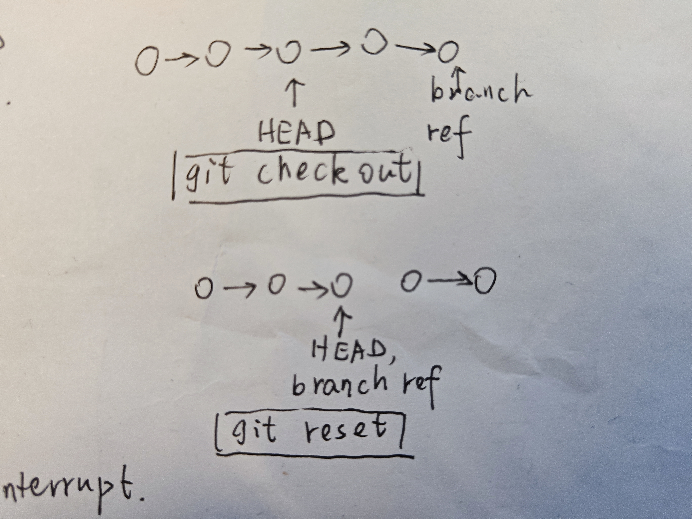

* `memcpy()`在`<memory.h>`中，不在`<memory>`中，也不在`<stdlib.h>`中

* c++ 中，如果 piecewise construct 一个`vector<string, pair<string, MyClass>>`，该怎么传递参数？

* c++ 中，对`operator[]`加 template 并不能像想象中一样可以这么写：

    ```cpp
    my_vec<float>[3] = 4.0f;
    ```

    反而会非常麻烦：

    ```cpp
    // emplementation
    template<typename T>
    T& operator[](size_t idx) {
        return *((T*)mem+idx);
    }
    
    // usage
    buf_mem.operator[]<float>(0) = 1.0f;
    ```

    此时还不如定义一个普通函数。

* c/c++ 中，变量名/对象实体其实代表的是内存地址，对内存地址操作肯定是最快，效率最高的

    把各种对象映射成使用字符串索引，虽然降低了效率，但是提高了便利性。

* 有关 mem 对象的生存周期分配

    如果两个 mem 对象互相依赖，那么它们应该被一个更大的对象管理，由这个更大的对象控制它们的生命周期。

* glx 的一个 example，见`ref_7`

* cache tabs

    * Cannot be shared between threads safely

        <https://users.rust-lang.org/t/cannot-be-shared-between-threads-safely/49146>

    * Struct slint_interpreter::ComponentInstance

        <https://releases.slint.dev/1.5.1/docs/rust/slint_interpreter/struct.componentinstance>

    * Struct slint::Image

        <https://releases.slint.dev/1.5.1/docs/rust/slint/struct.image>

    * How do I convert a string to f32?

        <https://stackoverflow.com/questions/28234518/how-do-i-convert-a-string-to-f32>

    * rust: Static items

        <https://doc.rust-lang.org/reference/items/static-items.html>

    * Crate slint_build

        <https://docs.rs/slint-build/latest/slint_build/>

    * Crate anyhow

        <https://docs.rs/anyhow/latest/anyhow/>

    * Module std::fmt

        <https://doc.rust-lang.org/std/fmt/>

    * Crate ringbuffer

        <https://docs.rs/ringbuffer/latest/ringbuffer/>

    * How to sign-off commits¶

        <https://volunteer.coscup.org/docs/dev/how-to-signoff/>

* 需要频繁交换数据的两个对象必须离得近，无论是在物理上还是在逻辑上

* git reset note

    * `git reset`与`git checkout`相似
    
        `git checkout`只移动 head ref，不移动 branch ref，执行完后会出现 detach 状态。

        `git reset`会同时移动 head ref 和 branch ref。

        两者不同之处如下图所示：

        

        (不清楚 branch ref 是什么意思)

    * `git reset`有三种模式，`--mixed`,`--soft`和`--hard`

        其中，`--soft`表示只改变 commit history，不改变 staging area (staging index) 和 working directory.

        `--mixed`表示同时改变 commit history 和 staging area，不改变 working directory。

        由于 staging area 被改变，所以有可能有些文件被变成 untracked 状态。

        `--hard`表示同时改变这三者。

    * 如果不指定模式和 commit id，`git reset`会默认加上`git reset --mixed HEAD`

        由此可以推断，`git reset`直接执行，表示丢弃 staging area 中的所有内容，同时不改变 working area 中的内容。

        `git reset --soft` will do nothing。

        `git reset ＜file＞`: Remove the specified file from the staging area, but leave the working directory unchanged. This unstages a file without overwriting any changes.

    * 可以使用`git ls-file -s`列出 staging area 中的一些文件

        `-s`表示`--staged`，可以打印出文件的 hash value。

        如果不写`-s`，那么只输出文件的路径，不输出 hash 值。

    * `git reset --hard HEAD~2`: The git reset HEAD~2 command moves the current branch backward by two commits, effectively removing the two snapshots we just created from the project history.

        这样可以 removing 一些 commits。

    * 由于 git reset 可能会删除一些 commit，而这些 commits 可能被别人引用，所以最好不要在 public repo 上执行这个。如果有回滚 commit 的需求，可以使用`git revert`。