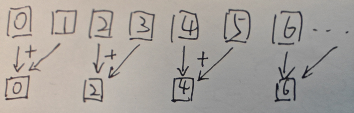
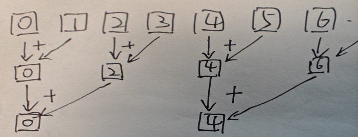

* sum reduce 算子实现的线性思考

    假如现在要对一个一维的`float`数组`arr`求和，为了简化问题，我们假设数组的长度`N`满足 2 的 n 次幂。

    首先能想到的是，我们起`N`个线程，线程的 id 从`0`到`N - 1`。

    在做第一次归约的时候，我们需要计算`arr[0] += arr[1];`, `arr[2] += arr[3]`，`arr[4] += arr[5]`, ...

    如下图所示：

    <div style='text-align:center'>
    
    </div>

    针对这一过程，写出的代码如下：

    ```opencl
    kernel void my_sum(global float *arr, const int len)
    {
        size_t glb_id = get_global_id(0);
        if (glb_id % 2 == 0)  // selecte the work items located at 0, 2, 4, 6, ...
        {
            arr[glb_id] += arr[glb_id + 1];
        }
    }
    ```

    可以看到，第一次归约我们只用到了 0, 2, 4, 6, ... 这些位置上的线程，因此其实我们不需要起`N`个线程，只需要起`N / 2`个线程就可以了。这个问题我们暂时先放着，继续往下走。

    第二次归约，我们需要做`arr[0] += arr[2]`，`arr[4] += arr[6]`, ... 这样的计算，如下图所示：

    <div style='text-align:center'>
    
    </div>

    写成代码如下：

    ```opencl
    kernel void my_sum(global float *arr, const int len)
    {
        size_t glb_id = get_global_id(0);
        if (glb_id % 2 == 0)  // select the work items located at 0, 2, 4, 6, ...
        {
            arr[glb_id] += arr[glb_id + 1];
        }

        if (glb_id % 4 == 0)  // select the work items located at 0, 4, 8, ...
        {
            arr[glb_id] += arr[glb_id + 2];
        }
    }
    ```

    到这里我们差不多可以对代码抽象一下了，我们的取模从 2 开始，然后不断乘 2 翻倍。那么这个变量到什么时候停止？可以观察到这个变量恰好是每个小区间的长度，我们给这个变量取个名字`span_len`。显然对于最后一次归约，`span_len`应该等于数组长度`len`才对。

    同时我们观察到加法的第二个加数的索引，好正是`glb_id + span_len / 2`。这一点我们结合实际意义也能想通，即每次都相加区间一半处的值。

    由此我们可以将代码归纳为：

    ```opencl
    kernel void my_sum(global float *arr, const int len)
    {
        size_t glb_id = get_global_id(0);
        for (int span_len = 2; span_len <= len; span_len *= 2)
        {
            if (glb_id % span_len == 0)
            {
                arr[glb_id] += arr[glb_id + span_len / 2];
            }
        }
    }
    ```

    重新回到我们前面放着的问题，由于第一次归约只需要起`N / 2`的线程，这意味着索引编号变成了`[00, N / 2 - 1]`，因此使用取模`%`来筛选线程不适用了。我们重构代码如下：

    ```opencl
    kernel void my_sum(global float *arr, const int len)
    {
        size_t glb_id = get_global_id(0);
        for (int span_len = 2; span_len <= len; span_len *= 2)
        {
            size_t pos = glb_id * span_len;
            if (pos < len)
            {
                arr[pos] += arr[pos + span_len / 2];
            }
        }
    }
    ```

    在调用 kernel 时，我们也需要将 global size 改为`N / 2`。

    我们通过`glb_id * span_len`的方式让索引“散开”，然后使用`pos < len`限制索引范围，防止数组越界。

    由于`span_len`是指数级增加，所以`glb_id * span_len`会增长得非常快，发生溢出。

    我们知道归约需要的线程数是每次折半的，因此可以写出这样的代码：

    ```opencl
    kernel void my_sum(global float *arr, const int len)
    {
        size_t glb_id = get_global_id(0);
        size_t glb_size = get_global_size(0);  // number of all threads
        size_t max_id = glb_size;
        for (int span_len = 2; span_len <= len; span_len *= 2)
        {
            if (glb_id > max_id)
                continue;
            max_id /= 2;
            size_t pos = glb_id * span_len;
            arr[pos] += arr[pos + span_len / 2];
        }
    }
    ```

* gpu 最大同步线程数限制对归约算法的影响

    对于一个数组`float arr[N];`，当`N = 1024`时，使用下面的归约算子并不能得到正确的结果：

    ```opencl
    kernel void my_sum(global float *arr, const int len)
    {
        size_t glb_id = get_global_id(0);
        size_t glb_size = get_global_size(0);  // number of all threads
        size_t max_id = glb_size;
        for (int span_len = 2; span_len <= len; span_len *= 2)
        {
            if (glb_id > max_id)
                continue;
            max_id /= 2;
            size_t pos = glb_id * span_len;
            arr[pos] += arr[pos + span_len / 2];
        }
    }
    ```

    因为 gpu 通常有个最大同步线程数限制，它表示了最大能有多少个线程同步执行。目前我的机器上这个数字是`256`。这个数字即 max group size。

    下面分析一下，上面的代码会出什么错。
    
    当`N = 1024`，`max_group_size = 256`时，我们 run kernel 实际起了`N / 2 = 512`个线程。由于最大只能保证 256 个线程同时执行，所以其实这 512 个线程被分成了两组。这两组线程是乱序执行的。

    为了便于分析，我们将这个问题转换成，当`N = 8`，`max_group_size = 4`时，会是什么情况：

    ```cpp
    for (int i = 0; i < 10240; ++i)
    {
        sync_cpu_to_gpu({"arr", "out"});
        run_kern("my_sum", {(size_t) N}, {(size_t) 4}, "arr", "out", N);
        sync_gpu_to_cpu({"out"});
        
        if (s != *out)
        {
            printf("i: %d\n", i);
            printf("fault result.\n");
            printf("cpu sum: %f\n", s);
            printf("gpu sum: %f\n", *out);
            for (int j = 0; j < N; ++j)
                printf("%.1f, ", arr[j]);
            printf("\n");
            sync_gpu_to_cpu({"arr"});
            for (int j = 0; j < N; ++j)
                printf("%.1f, ", arr[j]);
            printf("\n");
            return 0;
        }
    }
    ```

    每次的输出都是不一样的，多次运行程序后，一个可能的输出如下：

    ```
    i: 9912
    fault result.
    cpu sum: 41.000000
    gpu sum: 33.000000
    7.0, 1.0, 6.0, 8.0, 5.0, 6.0, 7.0, 1.0, 
    33.0, 1.0, 14.0, 8.0, 19.0, 6.0, 8.0, 1.0, 
    [Warning] destroy ocl env
    release mem: out
    release mem: arr
    release ocl buffer: out
    release ocl buffer: arr
    ```

    初始数组是`[7, 1, 6, 8, 5, 6, 7, 1]`。

    第一次归约，我们得到：`[8, 1, 14, 8, 11, 6, 8, 1]`

    第二次归约，我们得到：`[22, 1, 14, 8, 19, 6, 8, 1]`

    可以看到，cpu 计算出的结果，执行的是`22 + 19 = 41`，而 gpu 计算出的结果，执行的是`22 + 11 = 33`。gpu 同时使用了当前轮的结果和上一轮的结果。

    对于归约算法来说，当前轮的结果永远依赖于上一轮的结果。但是 gpu 对不同 group 的乱序执行违反了这一规则，因此计算结果是错误的。

    如何解决这一问题？opencl 对不同 group 之间的同步性并不能做保证，即使`barrier();`也只能保证 group 内的线程同步。唯一的解决办法是从算法入手。

* N = 1024, max group size = 256 时的一个加法归约算子实现

    ```opencl
    kernel void sum_2(global float *arr, global float *out, const int len)
    {
        size_t glb_id = get_global_id(0);
        size_t work_span = len / 256;
        float s = arr[glb_id * work_span];
        for (int i = 1; i < work_span; ++i)
        {
            s += arr[glb_id * work_span + i];
        }
        arr[glb_id * work_span] = s;
        barrier(CLK_GLOBAL_MEM_FENCE);

        for (int span_len = work_span * 2; span_len <= len; span_len *= 2)
        {
            if ((glb_id * work_span) % span_len == 0)
            {
                arr[glb_id * work_span] += arr[glb_id * work_span + span_len / 2];
            }
            barrier(CLK_GLOBAL_MEM_FENCE);
        }
        
        if (glb_id == 0)
            *out = arr[0];
    }
    ```

    这个思路是先以 4 个数据为长度分组，每组分一个线程。每个线程遍历 4 个数据求和，这样就把 1024 个数字缩减成了 256 个数据。接下来再按照 256 线程去求解就可以了。

    这个算法可以保证计算结果总是正确，不会有数据同步造成的问题。

    output:

    ```
    opencl device name: gfx1034
    gpu time duration: 0.510
    cpu time duration: 0.002
    correct.
    [Warning] destroy ocl env
    release mem: out
    release mem: arr
    release ocl buffer: out
    release ocl buffer: arr
    ```