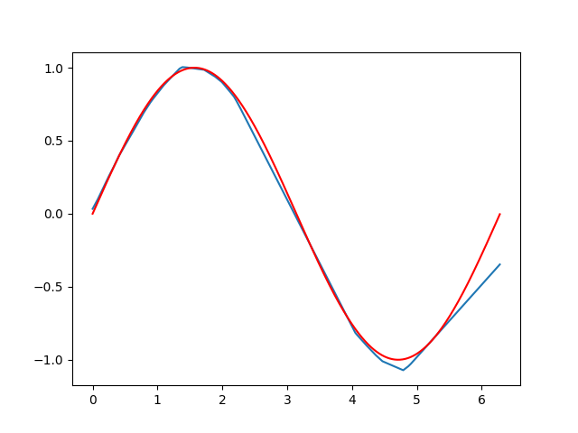

* 使用两层 linear + activation 层拟合一条 sin 曲线

    ```python
    import torch as t
    from torch import nn
    import math
    import numpy as np
    import matplotlib.pyplot as plt

    class MyBlock(nn.Module):
        def __init__(self):
            super().__init__()
            self.linear_1 = nn.Linear(1, 32, dtype=t.float32)
            self.act_1 = nn.ReLU()
            self.linear_2 = nn.Linear(32, 64, dtype=t.float32)
            self.act_2 = nn.ReLU()
            self.linear_3 = nn.Linear(64, 1, dtype=t.float32)
            
        def forward(self, x):
            x = self.linear_1(x)
            x = self.act_1(x)
            x = self.linear_2(x)
            x = self.act_2(x)
            x = self.linear_3(x)
            return x
            
    my_block = MyBlock()
    x = t.tensor([1], dtype=t.float32)
    y = my_block(x)
    print(y)

    params = my_block.parameters()
    optimizer = t.optim.SGD(my_block.parameters(), lr=0.01)
    x = t.arange(0, 2 * math.pi, 0.01)
    x = x.reshape(x.shape[0], 1)
    print(x.shape)
    y_gt = t.sin(x)
    print(y_gt.shape)

    calc_loss = nn.MSELoss()

    my_block.train()
    for epoch in range(3000):
        output = my_block(x)
        loss = calc_loss(output, y_gt)
        loss.backward()
        optimizer.step()
        optimizer.zero_grad()
        print('epoch: %d, epoch loss: %f' % (epoch, loss))

    my_block.eval()
    X = np.arange(0, 2 * np.pi, 0.01)
    print(X.shape)
    with t.no_grad():
        pred = my_block(t.from_numpy(X.reshape((629, 1)).astype('float32')))
    print(pred.shape)
    pred = pred.detach().numpy()
    print(pred.shape)

    Y = pred.flatten()
    print(Y.shape)

    Y_gt = np.sin(X)
    print(Y_gt.shape)

    plt.plot(X, Y)
    plt.plot(X, Y_gt, 'r')
    plt.show()
    ```

    output:

    ```
    tensor([0.0518], grad_fn=<ViewBackward0>)
    torch.Size([629, 1])
    torch.Size([629, 1])
    epoch: 0, epoch loss: 0.390523
    epoch: 1, epoch loss: 0.367919
    epoch: 2, epoch loss: 0.359639
    epoch: 3, epoch loss: 0.351311
    epoch: 4, epoch loss: 0.343440
    epoch: 5, epoch loss: 0.336687
    epoch: 6, epoch loss: 0.330301
    epoch: 7, epoch loss: 0.324224
    epoch: 8, epoch loss: 0.318377
    epoch: 9, epoch loss: 0.312717
    epoch: 10, epoch loss: 0.307221
    epoch: 11, epoch loss: 0.301877
    epoch: 12, epoch loss: 0.296678
    epoch: 13, epoch loss: 0.291617
    epoch: 14, epoch loss: 0.286691
    epoch: 15, epoch loss: 0.281895
    epoch: 16, epoch loss: 0.277223
    epoch: 17, epoch loss: 0.272677
    epoch: 18, epoch loss: 0.268257
    epoch: 19, epoch loss: 0.263966
    epoch: 20, epoch loss: 0.259807
    epoch: 21, epoch loss: 0.255789
    epoch: 22, epoch loss: 0.251917
    epoch: 23, epoch loss: 0.248195
    epoch: 24, epoch loss: 0.244619
    ...
    epoch: 2990, epoch loss: 0.005504
    epoch: 2991, epoch loss: 0.005398
    epoch: 2992, epoch loss: 0.005502
    epoch: 2993, epoch loss: 0.005396
    epoch: 2994, epoch loss: 0.005500
    epoch: 2995, epoch loss: 0.005395
    epoch: 2996, epoch loss: 0.005501
    epoch: 2997, epoch loss: 0.005396
    epoch: 2998, epoch loss: 0.005502
    epoch: 2999, epoch loss: 0.005396
    (629,)
    torch.Size([629, 1])
    (629, 1)
    (629,)
    (629,)
    ```

    图片输出：

    <div style='text-align:center'>
    
    </div>

    注：

    * 三层 linear 层即可拟合一条 sine 曲线，前两层 linear 层后需跟一个 activation layer，最后一层 linear 层不要跟 activation layer

    * activation 选 ReLU 的效果要比 Sigmoid 好很多

    * 在设置 layer 的参数时，不需要考虑 batch 维度，后面在 input data 和 ground truth 在第一个维度处加上 batch 后，会自动广播

    * num epoch 至少得有 3000 才能有拟合的效果，不清楚怎么把 epoch 减少一点

        这点可能和 input data 的 sample 有关。如果每次都只在训练集上均匀采样几个训练数据，效果可能会好一些

    * 在开始训练前要先运行下`my_model.train()`，在预测的时候运行下`my_model.eval()`

        目前不清楚这个有没有用，也不清楚原理。看教程上这么写的。

    * `loss`只有为 scalar 时才可以直接`backward()`

    * optimizer 需要手动清零梯度：`optimizer.zero_grad()`

    * 各种各样的优化器放在`torch.optim`模块下

    * 不需要记录梯度时，可以使用`with torch.no_grad():`

* genome 的图片查看器程序名叫`eog`
