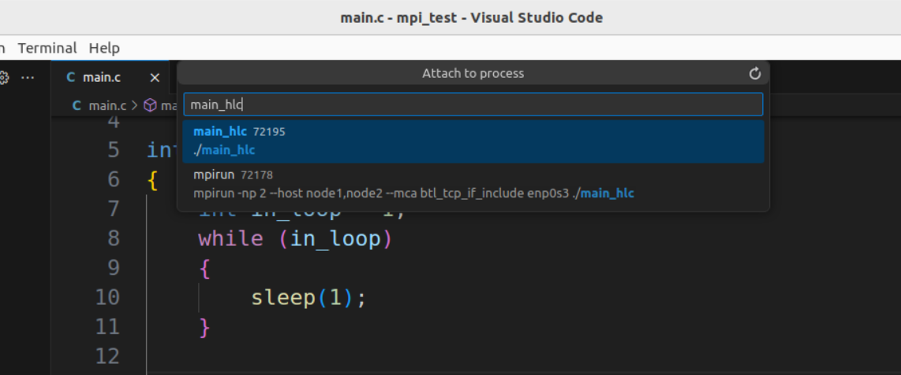
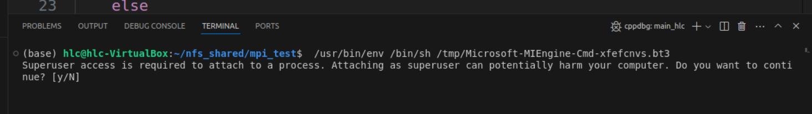
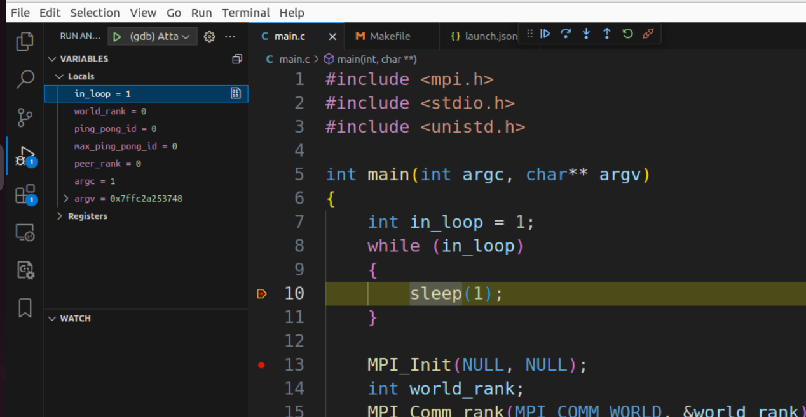

* 如果可以使用“猜想”去解释一个现象，那么就可以进入实验阶段

    如果可以无法作出“猜想”，只知道哪个方向可能提供更多的信息，那么只能是“调研”

    无法作出猜想的阶段，都只是收集信息的阶段。目标就是为了作出猜想。

* vscode + gdb attch + mpi program debugging

    1. add `launch.json`:

        ```json
        {
            // Use IntelliSense to learn about possible attributes.
            // Hover to view descriptions of existing attributes.
            // For more information, visit: https://go.microsoft.com/fwlink/?linkid=830387
            "version": "0.2.0",
            "configurations": [{
                "name": "(gdb) Attach",
                "type": "cppdbg",
                "request": "attach",
                "program": "${workspaceFolder}/main_hlc",
                "processId":"${command:pickProcess}",
                "MIMode": "gdb",
                "setupCommands": [
                    {
                        "description": "Enable pretty-printing for gdb",
                        "text": "-enable-pretty-printing",
                        "ignoreFailures": true
                    },
                    {
                        "description": "Set Disassembly Flavor to Intel",
                        "text": "-gdb-set disassembly-flavor intel",
                        "ignoreFailures": true
                    }
                ]
            }]
        }
        ```

        type `gdb`, select `attach` rather than `launch`.

        add `processId`, fill the field with `"${command:pickProcess}"`.

    2. add a fragment of code at the beginning of the main function

        ```c
        int main(int argc, char** argv)
        {
            int in_loop = 1;
            while (in_loop)
            {
                sleep(1);
            }

            // ....
        }
        ```

    3. compile the mpi program

        `mpicc -g main.c -o main_hlc`

        do not forget `-g` option.

    4. run the program in the **terminal**

        `mpirun -np 2 --host node1,node2 --mca btl_tcp_if_include enp0s3 ./main_hlc`

    5. press `F5` in the vscode

        search `main_hlc` in the prompt, select the program name `main_hlc`:

        <div style='text-align:center'>
        
        </div>

    6. take a notice of the terminal panel below, enter `y` and press Enter

        <div style='text-align:center'>
        
        </div>

        enter the password of root.

    7. add a breakpoint at the `sleep(1)` line, the program will stop at this breakpoint

        modify the value of `in_loop` in the variables window, then the program can step out the while loop.

        double click `in_loop` variable, and set it to `0`, then press Enter

        <div style='text-align:center'>
        
        </div>

        Press F5, the program will continue to next breakpoint.