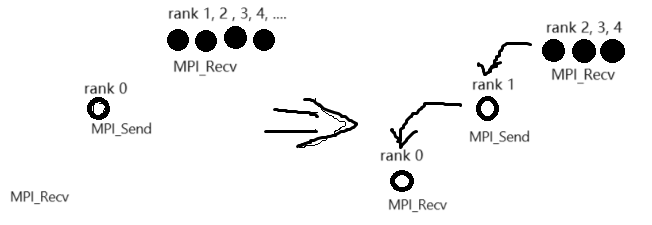

* 如果 nfs server 在 export 目录软链接其他路径的目录/文件，那么 client 的 nfs 目录里的软链接会链到 client 的文件目录上，不会读取 server 的软链接的内容

* mpi ring

    ```c
    #include <mpi.h>
    #include <stdio.h>
    #include <unistd.h>

    int main(int argc, char** argv) {
        MPI_Init(NULL, NULL);

        int world_size;
        MPI_Comm_size(MPI_COMM_WORLD, &world_size);

        int world_rank;
        MPI_Comm_rank(MPI_COMM_WORLD, &world_rank);

        int token = 0;
        int ret;
        if (world_rank == 0)
        {
            token = 12345;
        }
        else
        {
            token = -1;
            ret = MPI_Recv(&token, 1, MPI_INT, world_rank - 1, 0, MPI_COMM_WORLD, MPI_STATUS_IGNORE);
            if (ret != 0)
            {
                printf("rank %d fail to recv\n", world_rank);
                return -1;
            }
            printf("rank %d received token %d from %d\n", world_rank, token, world_rank - 1);
        }

        ret = MPI_Send(&token, 1, MPI_INT, (world_rank + 1) % world_size, 0, MPI_COMM_WORLD);
        if (ret != 0)
        {
            printf("rank %d fail to send\n", world_rank);
            return -1;
        }

        if (world_rank == 0)
        {
            token = -1;
            ret = MPI_Recv(&token, 1, MPI_INT, world_size - 1, 0, MPI_COMM_WORLD, MPI_STATUS_IGNORE);
            if (ret != 0)
            {
                printf("rank %d fail to recv\n", world_rank);
                return -1;
            }
            printf("rank %d received token %d from %d\n", world_rank, token, world_size - 1);
        }

        MPI_Finalize();
        return 01;
    }
    ```

    run:

    ```bash
    mpirun -np 2 --host node1,node2 ./main
    ```

    output:

    ```
    rank 0 received token 12345 from 1
    rank 1 received token 12345 from 0
    ```

    说明：

    * rank 0 会首先在`MPI_Send()`处等其他进程，其他进程会在`MPI_Recv()`处等上一个进程。

        等 rank 0 send, rank 1 recv 成功后，rank 0 在`MPI_Recv()`处等待，rank 1 则在`MPI_Send()`处开始和 rank 2 同步。以此类推。

        这个过程如下图所示：

        <div style='text-align:center'>
        
        </div>

    * 下面这段代码似乎也能实现 ring 功能，并且更简洁

        ```c
        #include <mpi.h>
        #include <stdio.h>
        #include <unistd.h>

        int main(int argc, char** argv) {
            MPI_Init(NULL, NULL);

            int world_size;
            MPI_Comm_size(MPI_COMM_WORLD, &world_size);

            int world_rank;
            MPI_Comm_rank(MPI_COMM_WORLD, &world_rank);

            int token = 0;
            int ret;
            if (world_rank == 0)
            {
                token = 12345;
                MPI_Send(&token, 1, MPI_INT, (world_rank + 1) % world_size, 0, MPI_COMM_WORLD);
            }
            else
            {
                MPI_Recv(&token, 1, MPI_INT, world_rank - 1, 0, MPI_COMM_WORLD, MPI_STATUS_IGNORE);
                printf("rank %d received token %d from rank %d\n", world_rank, token, world_rank - 1);
            }

            if (world_rank == 0)
            {
                MPI_Recv(&token, 1, MPI_INT, world_size - 1, 0, MPI_COMM_WORLD, MPI_STATUS_IGNORE);
                printf("rank %d received token %d from rank %d\n", world_rank, token, world_size - 1);
            }
            else
            {
                MPI_Send(&token, 1, MPI_INT, (world_rank + 1) % world_size, 0, MPI_COMM_WORLD);
            }

            MPI_Finalize();
            return 0;
        }
        ```

* cuda vscode debug

    ```cu
    #include <stdio.h>
    #include <cuda_runtime.h>

    __global__ void vectorAdd(const float *A, const float *B, float *C, int numElements) 
    {
        int i = blockDim.x * blockIdx.x + threadIdx.x;

        if (i < numElements)
        {
            C[i] = A[i] + B[i] + 0.0f;
        }
    }

    int main()
    {
        int numElements = 1024;
        size_t size = numElements * sizeof(float);
        float *h_A = (float *) malloc(size);
        float *h_B = (float *) malloc(size);
        float *h_C = (float *) malloc(size);
        for (int i = 0; i < numElements; ++i)
        {
            h_A[i] = rand() / (float) RAND_MAX;
            h_B[i] = rand() / (float) RAND_MAX;
        }

        float *d_A = NULL;
        cudaMalloc((void**) &d_A, size);
        float *d_B = NULL;
        cudaMalloc((void**) &d_B, size);
        float *d_C = NULL;
        cudaMalloc((void**) &d_C, size);

        cudaMemcpy(d_A, h_A, size, cudaMemcpyHostToDevice);
        cudaMemcpy(d_B, h_B, size, cudaMemcpyHostToDevice);

        int threadsPerBlock = 256;
        int blocksPerGrid = (numElements + threadsPerBlock - 1) / threadsPerBlock;
        vectorAdd<<<blocksPerGrid, threadsPerBlock>>>(d_A, d_B, d_C, numElements);

        cudaMemcpy(h_C, d_C, size, cudaMemcpyDeviceToHost);

        for (int i = 0; i < 4; ++i)
        {
            printf("%.2f + %.2f = %.2f\n", h_A[i], h_B[i], h_C[i]);
        }

        cudaFree(d_A);
        cudaFree(d_B);
        cudaFree(d_C);
        free(h_A);
        free(h_B);
        free(h_C);

        return 0;
    }
    ```

    compile:

    ```bash
    nvcc -g main.cu -o main
    ```

    run:

    ```
    ./main
    ```

    output:

    ```
    0.84 + 0.39 = 1.23
    0.78 + 0.80 = 1.58
    0.91 + 0.20 = 1.11
    0.34 + 0.77 = 1.10
    ```

    vscode debug:

    1. install vscode extension: `Nsight Visual Studio Code Edition`

    2. add debug type: cuda-gdb

    3. press F5 start debugging

    也可以直接使用`gdb <exe_file>`去调试。


