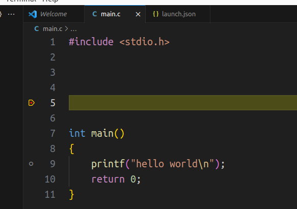

* 下载 ubuntu 时选择 Alternative downloads -> Other images and mirrors -> All Ubuntu mirrors 可以列出所有的镜像网站

    国内镜像南京大学的速度挺不错的。拉满可以到 5.5 MB/s。

* vscode 的 pipe 模式

    vscode 可以在`launch.json`中设置 pipe 模式，通过 ssh 在 remote host 上调用 gdb，再把 gdb 的输入输出重定向到 local host，从而不需要在 remote host 上安装 vscode，也不需要安装任何 vscode 插件，即可远程调试程序。

    配置方法：

    1. 在 remote host 上新建一个工程文件夹`mkdir -p /home/hlc/Documents/Projects/vscode_test`

        创建程序文件`main.c`:

        ```c
        #include <stdio.h>

        int main()
        {
            printf("hello world\n");
            return 0;
        }
        ```

        编译：`gcc -g main.c -o main`

    2. remote host 上还需要安装 ssh server 和 gdb，此时即可满足最小调试要求。

    3. 在 local host 上创建`launch.json`：

        ```json
        {
            // Use IntelliSense to learn about possible attributes.
            // Hover to view descriptions of existing attributes.
            // For more information, visit: https://go.microsoft.com/fwlink/?linkid=830387
            "version": "0.2.0",
            "configurations": [
                {
                    "name": "(gdb) Pipe Launch",
                    "type": "cppdbg",
                    "request": "launch",
                    "program": "/remote_host/path/to/main",
                    "args": [],
                    "stopAtEntry": false,
                    "cwd": "${fileDirname}",
                    "environment": [],
                    "externalConsole": false,
                    "pipeTransport": {
                        "debuggerPath": "/usr/bin/gdb",
                        "pipeProgram": "/usr/bin/ssh",
                        "pipeArgs": [
                            // "-pw",
                            // "password",
                            "hlc@10.0.2.4"
                        ],
                        "pipeCwd": "/usr/bin"  // this line
                    },
                    "MIMode": "gdb",
                    "setupCommands": [
                        {
                            "description": "Enable pretty-printing for gdb",
                            "text": "-enable-pretty-printing",
                            "ignoreFailures": true
                        },
                        {
                            "description": "Set Disassembly Flavor to Intel",
                            "text": "-gdb-set disassembly-flavor intel",
                            "ignoreFailures": true
                        }
                    ]
                }
            ]
        }
        ```

        标注为`// this line`的那一行可以为空字符串，不影响。

        `-pw password`实测不支持。不清楚为什么 vscode 官网写了这个用法。

    4. 在 local host 上创建一份和 remote host 上一模一样的`main.c`文件，并打上断点

        按 F5 运行，此时会显示要求安装一个交互式输入 ssh 密码的小工具`ssh-askpass`。执行`sudo apt install ssh-askpass`。

        按照提示输入 ssh fingerprint 和密码后，即可正常 hit 断点。如果嫌麻烦可以在 local host 上运行`ssh-copy-id <user>@<remote_host_ip>`把 local host 的 ssh public key 添加到 remote host。

        debug console 的输出如下：

        ```
        =thread-group-added,id="i1"
        GNU gdb (Ubuntu 15.0.50.20240403-0ubuntu1) 15.0.50.20240403-git
        Copyright (C) 2024 Free Software Foundation, Inc.
        License GPLv3+: GNU GPL version 3 or later <http://gnu.org/licenses/gpl.html>
        This is free software: you are free to change and redistribute it.
        There is NO WARRANTY, to the extent permitted by law.
        Type "show copying" and "show warranty" for details.
        This GDB was configured as "x86_64-linux-gnu".
        Type "show configuration" for configuration details.
        For bug reporting instructions, please see:
        <https://www.gnu.org/software/gdb/bugs/>.
        Find the GDB manual and other documentation resources online at:
            <http://www.gnu.org/software/gdb/documentation/>.

        For help, type "help".
        Type "apropos word" to search for commands related to "word".
        Warning: Debuggee TargetArchitecture not detected, assuming x86_64.
        =cmd-param-changed,param="pagination",value="off"
        [Thread debugging using libthread_db enabled]
        Using host libthread_db library "/lib/x86_64-linux-gnu/libthread_db.so.1".

        Breakpoint 1, main () at main.c:5
        5	    printf("hello from ubuntu 2404\n");
        Loaded '/lib64/ld-linux-x86-64.so.2'. Symbols loaded.
        Loaded '/lib/x86_64-linux-gnu/libc.so.6'. Symbols loaded.
        Warning: Source file '/home/hlc/Documents/Projects/vscode_test/main.c' is newer than module file '/home/hlc/Documents/Projects/vscode_test/main'.
        Execute debugger commands using "-exec <command>", for example "-exec info registers" will list registers in use (when GDB is the debugger)
        ```

    说明：

    1. local host 的`main.c`文件与 remote host 不一致不影响远程调试，因为 remote gdb 在打断点时只关心文件名和第几行。

        如下图所示：

        <div style='text-align:center'>
        
        </div>

    refs:

    1. Pipe transport

        <https://code.visualstudio.com/docs/cpp/pipe-transport>

    2. VS Code Remote Development

        <https://code.visualstudio.com/docs/remote/remote-overview>

    3. How to debug with VSCode and pipe command

        <https://stackoverflow.com/questions/54052909/how-to-debug-with-vscode-and-pipe-command>

    4. How to specify password in ssh command

        <https://superuser.com/questions/1605215/how-to-specify-password-in-ssh-command>

* python机器学习上感知器的例子

    ```python
    import numpy as np

    class Perceptron(object):
        def __init__(self, eta=0.01, n_iter=10):
            self.eta = eta
            self.n_iter = n_iter

        def fit(self, X, y):
            self.w_ = np.zeros(1 + X.shape[1])
            self.errors_ = []

            for _ in range(self.n_iter):
                errors = 0
                for xi, target in zip(X, y):
                    update = self.eta * (target - self.predict(xi))
                    self.w_[1:] += update * xi
                    self.w_[0] += update
                    errors += int(update != 0.0)
                self.errors_.append(errors)
            return self
        
        def net_input(self, X):
            return np.dot(X, self.w_[1:]) + self.w_[0]
        
        def predict(self, X):
            return np.where(self.net_input(X) >= 0.0, 1, -1)
    ```

* numpy 支持`arr[1, 2]`这样的索引方式

    ```python
    def main():
        a = np.zeros((3, 4))
        print(type(a[1, 2]))
        return

    if __name__ == '__main__':
        main()
    ```

    一直以为只有 matlab 支持。

* 如果一个地方曾经感觉很有灵气，但是再次去时感觉没有灵气了，很可能是因为没有风。