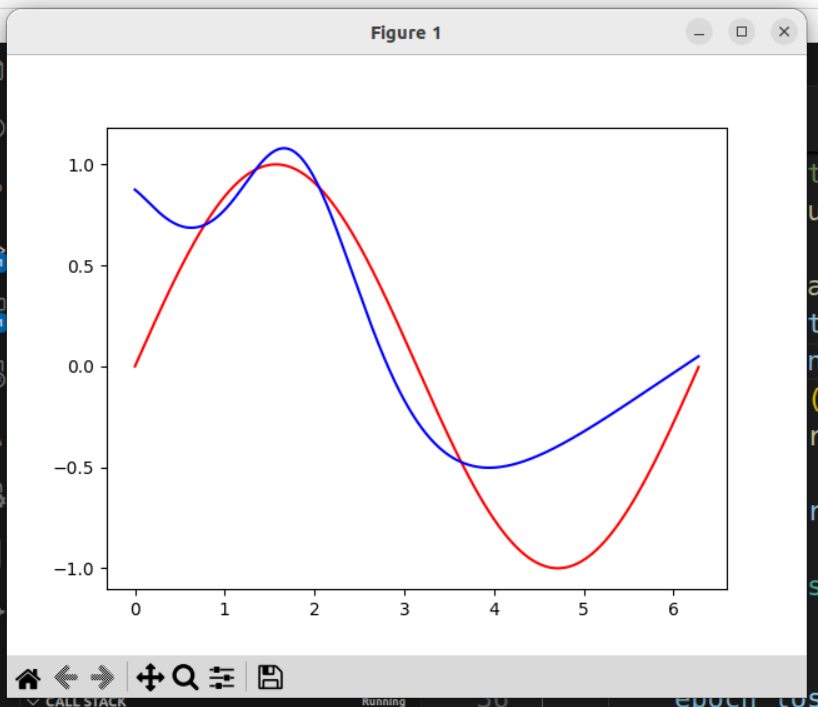

* 在开始一项任务前我们真的需要最佳状态吗？如果最小状态可以满足，那么就认为任务可以开始。

* pytorch 在对 tensor 做计算时，会对齐低维度（假设越往右维度越低），对高维度做 broadcast

    ```py
    import torch as t
    import torch.nn as nn

    def main():
        my_model: nn.Sequential = nn.Sequential(
            nn.Linear(1, 32),  # 接收 (*, 1) 形式的输入
            nn.Sigmoid(),
            nn.Linear(32, 1)  # 输出也为 (*, 1) 的形式
        )

        x = t.rand(1)
        y: t.Tensor = my_model(x)
        print(y)  # (1, )
        print(y.shape)

        x = t.rand(5, 1)
        y: t.Tensor = my_model(x)
        print(y)  # (5, 1)
        print(y.shape)

        x = t.rand(3, 5, 1)  # (15, 1)
        y: t.Tensor = my_model(x)
        print(y)  # (3, 5, 1)
        print(y.shape)
        return

    if __name__ == '__main__':
        main()
    ```

* `nn.init.xavier_normal_()`只能作用于 shape size 为 2 的 tensor

    如果一个 tensor 的 shape size 为 1，那么这个函数会报错。典型的场景就是 Linear 层的 bias 参数。

    `nn.init.normal_()`没有这个限制，可作用于任意 shape size 的 tensor。

* 使用 pytorch 在 20 个 epoch 内尝试对 sin 曲线过拟合

    ```python
    import torch as t
    import torch.nn as nn
    import matplotlib.pyplot as plt
    import torch.optim.sgd as sgd

    def main():
        my_model: nn.Sequential = nn.Sequential(
            nn.Linear(1, 32),
            nn.Sigmoid(),
            nn.Linear(32, 1)
        )

        l1_loss = t.nn.L1Loss()

        params = my_model.parameters()
        params = my_model.named_parameters()
        for i, (name, param) in enumerate(params):
            name: str
            param: nn.Parameter
            print('i: %d, name: %s, shape:' % (i, name), param.shape)
            # nn.init.xavier_normal_(param.data)
            # nn.init.normal_(param.data, std=3)
            nn.init.uniform_(param.data, -4, 4)

        x_train = t.arange(0, t.pi * 2, 0.01)
        x_train = x_train.reshape(x_train.shape[0], 1)
        print(x_train.shape)
        y_gt = t.sin(x_train)
        y_gt = y_gt.reshape(y_gt.shape[0], 1)

        x_test = x_train

        optim_sgd = sgd.SGD(my_model.parameters(), lr=0.001, weight_decay=0.005)

        for epoch in range(20):
            epoch_loss = 0
            for batch_id in range(x_train.size()[0]):
                x_train_batch = x_train[batch_id]
                y_gt_batch = y_gt[batch_id]
                y_pre_batch: t.Tensor = my_model(x_train_batch)
                loss = l1_loss(y_pre_batch, y_gt_batch)
                loss.backward()
                optim_sgd.step()
                optim_sgd.zero_grad()
                epoch_loss += loss
            print('epoch %d, loss %.2f' % (epoch, epoch_loss))

        y_pre = my_model(x_test)

        plt.figure()
        plt.plot(x_train, y_gt, 'r')
        plt.plot(x_test, y_pre.detach().numpy(), 'b')
        plt.show()

        return

    if __name__ == '__main__':
        main()
    ```

    output:

    ```
    i: 0, name: 0.weight, shape: torch.Size([32, 1])
    i: 1, name: 0.bias, shape: torch.Size([32])
    i: 2, name: 2.weight, shape: torch.Size([1, 32])
    i: 3, name: 2.bias, shape: torch.Size([1])
    torch.Size([629, 1])
    epoch 0, loss 242.71
    epoch 1, loss 566.46
    epoch 2, loss 266.65
    epoch 3, loss 172.81
    epoch 4, loss 136.53
    epoch 5, loss 123.09
    epoch 6, loss 112.77
    epoch 7, loss 107.53
    epoch 8, loss 97.30
    epoch 9, loss 86.32
    epoch 10, loss 79.17
    epoch 11, loss 68.87
    epoch 12, loss 61.15
    epoch 13, loss 53.27
    epoch 14, loss 46.70
    epoch 15, loss 40.95
    epoch 16, loss 35.92
    epoch 17, loss 31.23
    epoch 18, loss 28.30
    epoch 19, loss 26.95
    ```

    经测试，在 init parameter 时，需要将范围设置得大一点，拟合效果才比较好。此时 lr 取值适中比较好，太大（0.01）或者太小（0.0001）效果都不太好。

    这个有点像遗传算法中变异率，变异率太小时无法搜索到全局最优点。

    weight decay 对结果影响较大，经测试，取值 0.005 时效果最好。

    Linear 的宽度变到 128 并不能显著影响结果。增加一层 32 节点 Linear 后效果会好些。

    l1 loss 变换 mse loss 并不能显著影响最终结果。

    最终的效果：

    <div style='text-align:center'>
    
    </div>

* 使用 pip 安装 cuda 12.1 版本的 pytorch，至少要下载 2.8G 的数据