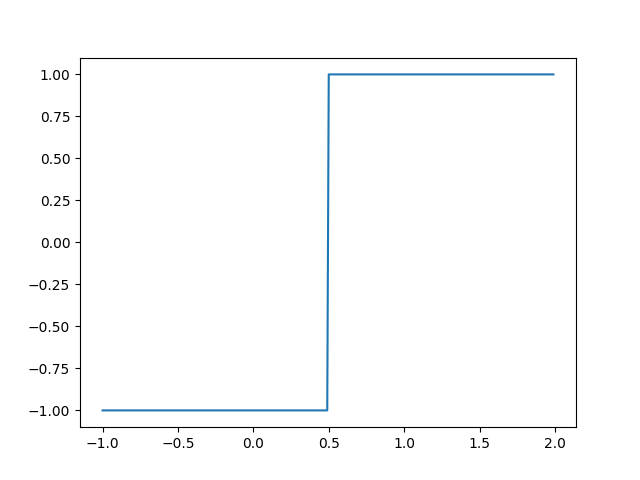

* contrastive prn. [kənˈtræstɪv] adj. 对比的

* 一个 block (thread block) 中的 threads 数量是有限的，因为每个 block 会被绑定到一个 sm (streaming multiprocessor) 上，这个 block 中的所有 thread 都会在这个 sm 上执行。

    > On current GPUs, a thread block may contain up to 1024 threads.

    当前的 gpu，每个 block 最多有 1024 个 thread。

* block 也可以被组织为一／二／三维的 grid。这么做主要为了适配需要计算的数据。通常数据的 dim length 是会超过 gpu 中流处理器的数量的

    example:

    `main_3.cu`:

    ```cpp
    __global__ void vec_add_blk(float *A, float *B)
    {
        int x = blockIdx.x * blockDim.x + threadIdx.x;
        A[x] = A[x] + B[x];
        printf("%d, %d, %d\n", blockDim.x, blockDim.y, blockDim.z);
    }

    int main()
    {
        float *cubuf_A, *cubuf_B;
        cudaMalloc(&cubuf_A, 8 * sizeof(float));
        cudaMalloc(&cubuf_B, 8 * sizeof(float));
        float *buf_A, *buf_B;
        buf_A = (float*) malloc(8 * sizeof(float));
        buf_B = (float*) malloc(8 * sizeof(float));
        for (int i = 0; i < 8; ++i)
        {
            buf_A[i] = rand() % 5;
            buf_B[i] = rand() % 5;
        }

        printf("buf A:\n");
        for (int i = 0; i < 8; ++i)
            printf("%.2f, ", buf_A[i]);
        putchar('\n');

        printf("buf B:\n");
        for (int i = 0; i < 8; ++i)
            printf("%.2f, ", buf_B[i]);
        putchar('\n');

        cudaMemcpy(cubuf_A, buf_A, 8 * sizeof(float), cudaMemcpyHostToDevice);
        cudaMemcpy(cubuf_B, buf_B, 8 * sizeof(float), cudaMemcpyHostToDevice);
        // vec_add<<<1, 8>>>(cubuf_A, cubuf_B);
        vec_add_blk<<<4, 2>>>(cubuf_A, cubuf_B);
        cudaMemcpy(buf_A, cubuf_A, 8 * sizeof(float), cudaMemcpyDeviceToHost);
        
        printf("buf A:\n");
        for (int i = 0; i < 8; ++i)
            printf("%.2f, ", buf_A[i]);
        putchar('\n');

        return 0;
    }
    ```

    output:

    ```
    buf A:
    3.00, 2.00, 3.00, 1.00, 4.00, 2.00, 0.00, 3.00, 
    buf B:
    1.00, 0.00, 0.00, 2.00, 1.00, 2.00, 4.00, 1.00, 
    2, 1, 1
    2, 1, 1
    2, 1, 1
    2, 1, 1
    2, 1, 1
    2, 1, 1
    2, 1, 1
    2, 1, 1
    buf A:
    4.00, 2.00, 3.00, 3.00, 5.00, 4.00, 4.00, 4.00,
    ```

    可以看到`blockDim`其实就是每个维度的 length。

    grid 有点像 batch 的概念，比如一个 shape 为`(20, 8, 4)`的数据，我既可以一次性处理，也可以拆分成 4 个`(5, 2, 1)`进行处理。前者的 grid 即为 1，后者的 grid 即为`(4, 4, 4)`。

    如果拆成 grid 进行处理，那么在确定数组索引时，就需要用`int x = blockIdx.x * blockDim.x + threadIdx.x;`这种方式。

    grid 与 grid 之间并不保证是并行执行的，可能是并行，也可能是串行。

    > Thread blocks are required to execute independently: It must be possible to execute them in any order, in parallel or in series.

* 乘法的大与小

    对于$z = xy$，如果想增大$z$，那么当$x \gt 0$时，可以增大$y$；当$x \lt 0$时，可以减小$y$。如果想减小$z$，那么当$x \gt 0$时，需要减小$y$，当$x \lt 0$时，需要增大$y$。

    另外一种想法是，我们把$x$与$0$的大小比值提前，当$x \gt 0$，如果想增大$z$，那么需要增大$y$；如果想减小$z$，那么需要减小$y$。当$x \gt 0$，如果想增大$z$，那么需要减小$y$，如果想减小$z$，则需要增大$y$。

    现在的问题是：这样的分类讨论是否有更简洁统一的表述？

* 画$y = \begin{cases} 1,\ x \geq \theta \\ -1,\ x \lt \theta \end{cases}$的图像，当$\theta = 0.5$时，有

    <div>
    
    </div>

    这里想讨论的是，这个函数是否需要能够微分？

    我们需要的似乎只是$y_{gt} - y$的正负，不需要知道这个函数的导数。

* [ ] 调研 matplotlib 画 surface

* 如果有$x_1$，$x_2$两个变量，是否优化目标为修改曲面在指定点处的高度？

* 对于$z = w_1 x_1 + w_2  x_2$的情况，我们首先模仿只有一个$x$的写法，得到

    ```py
    def phi(z, theta):
        if z >= theta:
            return 1
        else:
            return -1
        
    def z(x1, x2, w1, w2):
        return w1 * x1 + w2 * x2

    def z_gt(x1, x2):
        return 0.3 * x1 + 0.5 * x2

    def main_3():
        theta = 0.5
        w1, w2 = 0.7, 0.2
        for i in range(10):
            x1 = random.random() * 2
            x2 = random.random() * 2
            val_z_gt = z_gt(x1, x2)
            val_z = z(x1, x2, w1, w2)
            val_phi_gt = phi(val_z_gt, theta)
            val_phi = phi(val_z, theta)
            if abs(val_phi_gt - val_phi) < 0.0001:
                delta_w1 = 0
                delta_w2 = 0
            elif val_phi_gt - val_phi > 0:
                delta_w1 = 0.1
                delta_w2 = 0.1
            else:
                delta_w1 = -0.1
                delta_w2 = -0.1
            print('round {}, w1: {:.2f}, w2: {:.2f}, delta_w1: {:.2f}, delta_w2: {:.2f}'.format(
                i, w1, w2, delta_w1, delta_w2))
            w1 += delta_w1
            w2 += delta_w2
        return

    if __name__ == '__main__':
        main_3()
    ```

    output:

    ```
    round 0, w1: 0.70, w2: 0.20, delta_w1: -0.10, delta_w2: -0.10
    round 1, w1: 0.60, w2: 0.10, delta_w1: 0.00, delta_w2: 0.00
    round 2, w1: 0.60, w2: 0.10, delta_w1: 0.00, delta_w2: 0.00
    round 3, w1: 0.60, w2: 0.10, delta_w1: 0.10, delta_w2: 0.10
    round 4, w1: 0.70, w2: 0.20, delta_w1: 0.00, delta_w2: 0.00
    round 5, w1: 0.70, w2: 0.20, delta_w1: -0.10, delta_w2: -0.10
    round 6, w1: 0.60, w2: 0.10, delta_w1: 0.00, delta_w2: 0.00
    round 7, w1: 0.60, w2: 0.10, delta_w1: 0.00, delta_w2: 0.00
    round 8, w1: 0.60, w2: 0.10, delta_w1: 0.00, delta_w2: 0.00
    round 9, w1: 0.60, w2: 0.10, delta_w1: 0.00, delta_w2: 0.00
    ```

    我们看到$w_1$与$w_2$绑定在了一起，要么都增大，要么都减小。还缺少一个关键因素，如果$w_1$偏大，$w_2$偏小，我们希望`delta_w1`为负数，`delta_w2`为正数。不清楚该如何做到。

    思路二，我们可以把$x$看作已知量，把$w$看作变量，此时只要求出$z$对$w$的偏导，即$x$，即可得到变化的方向。由此可写出如下代码：

    ```py
    def phi(z, theta):
        if z >= theta:
            return 1
        else:
            return -1
        
    def z(x1, x2, w1, w2):
        return w1 * x1 + w2 * x2

    def z_gt(x1, x2):
        return 0.3 * x1 + 0.5 * x2

    def main_3():
        theta = 0.5
        w1, w2 = 0.7, 0.2
        for i in range(10):
            x1 = random.random() * 2
            x2 = random.random() * 2
            val_z_gt = z_gt(x1, x2)
            val_z = z(x1, x2, w1, w2)
            val_phi_gt = phi(val_z_gt, theta)
            val_phi = phi(val_z, theta)
            if abs(val_phi_gt - val_phi) < 0.0001:
                delta_w1 = 0
                delta_w2 = 0
            elif val_phi_gt - val_phi > 0:
                delta_w1 = 0.1 * x1
                delta_w2 = 0.1 * x2
            else:
                delta_w1 = -0.1 * x1
                delta_w2 = -0.1 * x2
            print('round {}, w1: {:.2f}, w2: {:.2f}, delta_w1: {:.2f}, delta_w2: {:.2f}'.format(
                i, w1, w2, delta_w1, delta_w2))
            w1 += delta_w1
            w2 += delta_w2
        return

    if __name__ == '__main__':
        main_3()
    ```

    output:

    ```
    round 0, w1: 0.70, w2: 0.20, delta_w1: 0.00, delta_w2: 0.00
    round 1, w1: 0.70, w2: 0.20, delta_w1: 0.00, delta_w2: 0.00
    round 2, w1: 0.70, w2: 0.20, delta_w1: 0.00, delta_w2: 0.00
    round 3, w1: 0.70, w2: 0.20, delta_w1: 0.00, delta_w2: 0.00
    round 4, w1: 0.70, w2: 0.20, delta_w1: -0.09, delta_w2: -0.02
    round 5, w1: 0.61, w2: 0.18, delta_w1: 0.00, delta_w2: 0.00
    round 6, w1: 0.61, w2: 0.18, delta_w1: 0.00, delta_w2: 0.18
    round 7, w1: 0.61, w2: 0.36, delta_w1: 0.00, delta_w2: 0.00
    round 8, w1: 0.61, w2: 0.36, delta_w1: 0.00, delta_w2: 0.00
    round 9, w1: 0.61, w2: 0.36, delta_w1: 0.00, delta_w2: 0.00
    ```

    这个方向明显是对的。

    这里借助了偏导。如果不知道偏导数这个概念，是否可以用其他方式想出来？