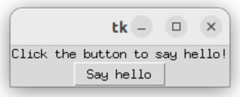
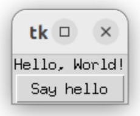

* 给出一个定时器，到达时间后停下来做任务总结。未到时间就想停下则需要锻炼注意力。

* 重新强调一遍，退出任务时保证 stack 干净非常重要。桌面、床铺等日常环境同样如此。

* `uint64_t`在 C++ 的`<cstdint>`头文件中

* 每天必须花固定时间看书，以此减少电子设备的接触。因为电子设备提供的信息源过多，会导致注意力经常被分散，无法集中精神。书籍提供的信息相对较少，但是更深入，理论上有助于长期集中注意力。

* tk app: hello world

    `hello_world.py`:

    ```python
    import tkinter as tk

    def say_hello():
        label.config(text="Hello, World!")

    root = tk.Tk()

    label = tk.Label(root, text="Click the button to say hello!")
    label.pack()

    button = tk.Button(root, text="Say hello", command=say_hello)
    button.pack()

    root.mainloop()
    ```

    run: `python hello_world.py`

    result:

    

    单击 say hello 按钮后，界面变成：

    

    `root = tk.Tk()`这个可能是代表主窗口的对象。后面的逻辑比较清晰了，创建 label, button 对象的时候，先指定 parent 对象，然后通过`.pack()`方法将自己添加到 parent 中。不清楚这个`pack()`是否和 layout 相关，目前看来，新添加的元素都是从上向下垂直添加的。最后通过`root.mainloop()`开始主窗口的事件循环。

* tk 本来是 tcl 语言的一个 gui 库，由于比较好用，所以移植到了其他语言上。

    tkinter 指的是 tk interface。

* 判断当前 python 环境中是否安装有 tkinter：
    
    `python -m tkinter`