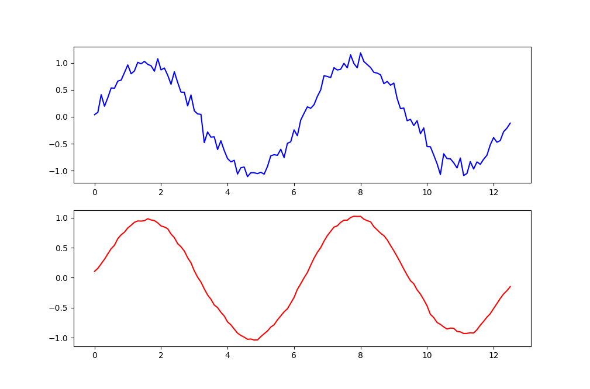

* 7点移动平均

    指滑动窗口中共有 7 个数据。每次计算时，取当前数据点及其前后各3个点（共7个点）。将这7个数据点相加，然后除以7。相当于一个低通滤波器，平滑掉高频噪声。

    代码：

    `np.ones(7) / 7`

    相当于卷积核：`[1/7, 1/7, 1/7, 1/7, 1/7, 1/7, 1/7]`

    7 点并没有什么特殊的意义，通常与 5 点，9 点，15 点等做比较，结合实际问题赋予意义。

    通常选择奇数点，而不是偶数点。因为奇数点中心对称，输出与输入时间对齐，偶数点会产生半个时间单位的相位偏移。

    example:

    ```py
    import numpy as np
    import matplotlib.pyplot as plt
    from matplotlib.axes import Axes

    x = np.arange(0, 4 * np.pi, 0.1)
    y = np.sin(x) + np.random.normal(loc=0, scale=0.1, size=x.shape)

    kernel_size = 7
    mean_kernel = np.ones(kernel_size) / kernel_size
    mean_kernel = mean_kernel[::-1]

    y_1 = np.pad(y, kernel_size // 2)  # [0, 0, 0, y, 0, 0, 0]
    y_2 = np.zeros_like(y)
    for i in range(len(y)):
        y_2[i] = np.sum(y_1[i:i+kernel_size] * mean_kernel)

    fig, axes = plt.subplots(2, 1)
    ax: Axes = axes[0]
    ax.plot(x, y, 'b')
    ax = axes[1]
    ax.plot(x, y_2, 'r')
    plt.show()
    ```

    output:

    

    此时在前后各 padding `kernel_size // 2`个 0 元素，正好把每个时刻放在 kernel window 的正中间。

* `np.pad()`

    np.pad() 是 NumPy 中用于数组填充（padding）的函数，主要用于在数组边界扩展指定宽度的元素。

    syntax:

    ```py
    numpy.pad(array, pad_width, mode='constant', **kwargs)
    ```

    主要参数：

    * array：要填充的数组

    * pad_width：填充宽度，格式为 ((before_1, after_1), ..., (before_N, after_N))

        对于多维数组，pad_width 的每个元组对应一个维度

    * mode：填充模式，默认为 'constant'

    * constant_values：当模式为 'constant' 时使用的填充值

    常用填充模式

        constant：常数填充（默认）

        edge：使用边缘值填充

        linear_ramp：线性斜坡填充

        maximum/minimum：使用数组最大/最小值填充

        mean：使用数组平均值填充

        median：使用中位数填充

        reflect/symmetric：反射/对称填充

    example:

    ```py
    import numpy as np

    # 1. 一维数组常数填充
    arr_1d = np.array([1, 2, 3])
    padded = np.pad(arr_1d, (2, 3), mode='constant', constant_values=0)
    # 结果：[0 0 1 2 3 0 0 0]

    # 2. 二维数组不同方向填充
    arr_2d = np.array([[1, 2], [3, 4]])
    # 上下各填充1行，左右各填充2列
    padded = np.pad(arr_2d, ((1, 1), (2, 2)), mode='constant', constant_values=0)

    # 3. 使用不同填充值
    arr = np.array([1, 2, 3])
    # 左侧填充5，右侧填充10
    padded = np.pad(arr, (2, 3), mode='constant', constant_values=(5, 10))

    # 4. 边缘值填充
    arr = np.array([1, 2, 3, 4])
    padded = np.pad(arr, (2, 2), mode='edge')
    # 结果：[1 1 1 2 3 4 4 4]

    # 5. 反射填充
    arr = np.array([1, 2, 3, 4])
    padded = np.pad(arr, (2, 2), mode='reflect')
    # 结果：[3 2 1 2 3 4 3 2]

    # 6. 不同维度不同填充宽度
    arr_2d = np.ones((3, 3))
    pad_width = ((1, 2), (3, 4))  # 第一维：上1行下2行，第二维：左3列右4列
    padded = np.pad(arr_2d, pad_width, mode='constant', constant_values=0)
    ```

    注：

    1. 如果`pad_width`只写一份，那么会在最外层维度上被广播

        example:

        ```py
        import numpy as np

        arr = np.ones((3, 2))
        arr = np.pad(arr, (2, 3))
        print(arr)
        ```

        output:

        ```
        [[0. 0. 0. 0. 0. 0. 0.]
        [0. 0. 0. 0. 0. 0. 0.]
        [0. 0. 1. 1. 0. 0. 0.]
        [0. 0. 1. 1. 0. 0. 0.]
        [0. 0. 1. 1. 0. 0. 0.]
        [0. 0. 0. 0. 0. 0. 0.]
        [0. 0. 0. 0. 0. 0. 0.]
        [0. 0. 0. 0. 0. 0. 0.]]
        ```

        可以看到，在行上是前面添加两行，后面添加三行；在列上是左边添加两列，右边添加三列。

        相当于把`(2, 3)`广播成了`((2, 3), (2, 3))`。

        如果希望被广播成`((2, 2), (3, 3))`，那么可以写成`((2, ), (3, ))`

    1. 对于`constant_value`，后 padding 的会覆盖先 padding 的

        ```py
        import numpy as np

        arr = np.ones((3, 2))
        arr = np.pad(arr, ((2, ), (3, )), constant_values=((2, ), (3, )))
        print(arr)
        ```

        output:

        ```
        [[3. 3. 3. 2. 2. 3. 3. 3.]
        [3. 3. 3. 2. 2. 3. 3. 3.]
        [3. 3. 3. 1. 1. 3. 3. 3.]
        [3. 3. 3. 1. 1. 3. 3. 3.]
        [3. 3. 3. 1. 1. 3. 3. 3.]
        [3. 3. 3. 2. 2. 3. 3. 3.]
        [3. 3. 3. 2. 2. 3. 3. 3.]]
        ```

* 为什么计算卷积时，需要翻转卷积核

    连续卷积数学定义：

    $$(f * g)(t) = \int f(\tau) g(t - \tau) \mathrm d \tau$$

    注意公式中的 g(t - τ) - τ 是负号，这意味着卷积核需要翻转（翻转180度）。

    实际上，$g(t)$ 是对一个冲击的响应，在现实中是一个电路 module，它会处理先到达的信号，然后处理后到达的信号，因此需要先处理 $f(t)$ 左边的数据，然后从左到右依次处理所有数据，因此我们翻转的应该是 $f(t)$。

    但是如果我们把原信号看作静止的，让一个 filter 在上面从左到右滑过，为了实现和上面相同的效果，这个时候就需要翻转 $g(t)$ 了。

    example:

    ```py
    import numpy as np

    # 原始信号
    signal = np.array([1, 2, 3, 4, 5])
    # 卷积核
    kernel = np.array([1, 2, 1])

    # 1. 数学卷积（需要翻转）
    kernel_flipped = kernel[::-1]  # 翻转：[1, 2, 1] → [1, 2, 1]
    # np.convolve() 是否会自动翻转卷积核？
    conv_result = np.convolve(signal, kernel_flipped, mode='valid')

    # 2. 互相关（不翻转）
    corr_result = np.correlate(signal, kernel, mode='valid')

    print("翻转后的卷积核：", kernel_flipped)
    print("数学卷积结果：", conv_result)  # [1*1 + 2*2 + 3*1, 2*1 + 3*2 + 4*1, ...]
    print("互相关结果：", corr_result)    # [1*1 + 2*1 + 3*2, 2*1 + 3*1 + 4*2, ...]
    ```

    为什么数学定义要翻转？

    只有包含翻转的卷积才满足：

        交换律：f * g = g * f

        结合律：(f * g) * h = f * (g * h)

        平移不变性等数学性质