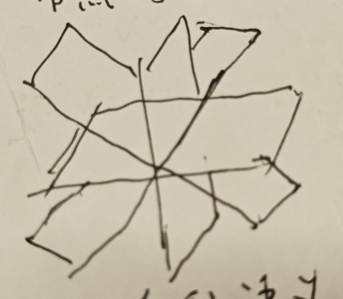
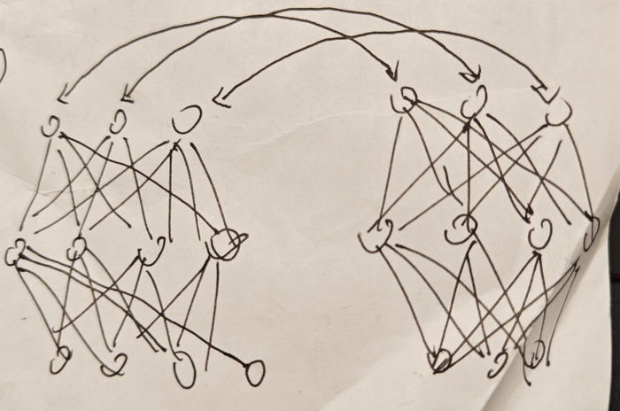

# 信念与思维

人生活在时间中，目前时间是正向流动的，因此我们也必须一件一件地做事情，这些事情被称作任务。

有一些任务类型，在每天的活动中经常出现，为了提高处理效率，我们把这些任务单独命名，并拿出来分析，找到常用的处理方法。

有一些不可能一天两天就把完成的任务，我们将其称为项目。

## cache

* 如果遇到的知识是条目式的，没有理解难度，但是数量比较大，是否该将其列入到记忆任务中？还是说调研时先跳过？

    * append (2024.03.21)

        如果没有理解难度，那么基本上看一遍就能记住，不需要列到记忆任务中。这个效率其实挺高的，不会占太多时间。

* 可以规定一下，如果 2 天（或者 3 天）都能通过某个 domain 的 qa，那么就可以申请增加新的 qa。

* 顺着笔记找 qa 效率并不高，更好的做法是随机在笔记的后面部分找一个问题，然后写到 qa 里，再倒过来找 qa 的 dependency.

* 深度学习和数学最本质的区别是，深度学习只告诉你他的方法为什么行，不告诉你别人的方法为什么不行，而数学会同时告诉你这两者

    2026/01/18/00: 现在看来。这句话更像是在说深度学习学术业的风气，而不只是深度学习这个方法本身。

* 每天离开工作区之前应该把 task 中的 feedback 整合到临时项目管理中

    2026/01/18/00: 目前是在将 task list 同步到 project pool 时，将 feedback 转移到 project pool 中，这样会比离开工作区时清理 feedback 延后一天，可以接收。

* 低频（主能量）信息对应的是直觉，高频（低能量）信息对应的是强推理

* 临时项目管理中的项目不应该超过 7 个, 不然就管理不过来了

* 无序列表（cache）的弱排序

    将已经完成的任务放到列表的最上面，比较重要的任务紧接着放到已经完成的任务的下面。

    这样无序列表会有一种“滚动”的效果，旧的 cache 慢慢消失，新的 cache 不断出现。

* 动态低价值任务

    做自底向上的任务时，容易陷入查字典，背 API 的细节中，无法推动主线的进度。

    如果我们已经知道一个任务是学习 API 的任务，那么可以在做任务之前就用任务时间控制、低比重、低优先级。但是如果一个任务做了 20％ 后，发现这个任务不重要，那么该如何处理？

    目前想到的处理方法如下：

    * 标记为低优先级的长线任务`{low}`

    * 严格控制时间，比如每次只执行 20 mins

    * 每执行一次，向下移动 5 个任务

* 应该增加各个项目 sync 的频率

* sync 只提出了标准，但是没有提出该如何 sync

    一个可能的 sync 方案：

    1. 先过一遍 qa
    
        如果完不成 unit，看这个 unit 是否有 dep，如果有，尝试先完成 dep。
        
        最终将这些 unit 划分成 3 类：
        
        1. 可以完成的 unit
        
        2. 看了答案后可以完成的 unit
        
        3. 看了答案也无法完成的 unit

        如果一个 unit 无法完成，看了其 dep，发现 dep 也无法完成，但是看了 dep 的答案后，dep 可以完成，之后 unit 也可以完成了，那么只标记 dep 为类型 2 （即看了答案后可以完成），标记 unit 为类型 1.

    2. 再过一遍笔记，尝试提取在 qa 测试中没见过的内容，并制作成 qa unit

        将笔记分为两部分，一部分是可以被验证的，另一部分是未被验证的

    3. 清理 test 和 qa 文件夹

    4. 将 qa 中过于复杂的拆分成 dep，无法理解的以及 empty 的都删掉

    5. 将笔记中未被验证的部分作为 cache，等待接受调研

    至此，sync 工作完成。

* 串行的任务执行对提高效率非常重要，因为大脑频繁切换任务会降低效率

    可能训练汉语／英语文字阅读也是必要的。

    猜想：大脑的各个模块各个细胞都是通过规律的频率和谐地交互信息，才能达到高度专注的效果。切换任务会切换细胞之间互相配合的模式和频率，导致模式的调整，这个过程会导致注意力无法集中，处理问题的效率降低。

    使任务串行，一个非常大的挑战就是在规定的时间内使用手机，在执行任务时不看。

* 每次想玩手机时，可以喝一口水代替

* 想法：一个基于写调查报告的电商

    电商平台对入驻商家明查暗访，定期发布调查报告、车间视频、暗访谈话、供应链追踪，清除消费者疑虑。

* 医疗中的客观 AI

    医患关系中，患者可能会觉得医生水平不够，对医生的判断提出质疑，此时使用 AI 给出辅助意见，患者会比较放心。

* 高阻态

    在没有 AI 时，心生的无数的问题因为信息不够或者没有导师指导无法推动进度，这些问题既无法被遗忘，也无法被解决，只能因为悬挂的高阻态，等待未来被解决的机缘。

* 线下的思考很有可能是低工作量向高工作量突破的关键

    虽然使用任务管理系统可以达到很高的工作效率，但是一天的工作量并不是很大。

    猜测主要原因是浪费了很多的可利用时间，比如吃饭，走路，挤地铁等等。如果把这些时间拿来思考 cached questions，那么就有可能大量地提高工作量。

* reorg 应该分三类

    * project pool

    * documents

    * projects

* note 的每个 item 尽量控制得短一些，类似代码的函数长度

* 每天结束的时候要列出来一个明天改进什么地方

    2025/10/31/00: 应该改成每周比较好点，以周为单位，想一想这周需要改进的点自己是否做到，下周需要改进哪些点。

* 如果已经处理过某一天的 task 列表，那么应该标记下已经处理过

	这里的处理包括：处理过 feedback，同步过任务进度

	如果一个 task 列表被标记为处理过，那么它就只剩下一个记录的作用了。一周总结一次，如果没什么用就可以删了。

* 如果在任务列表里只说了“调研”，没有明确的调研任务，那么就是从 resource，笔记，qa，搜索，多方面开始调研。

* 要想对一个东西有熟悉的理解和熟练的运用，必须将它作为更复杂的东西的一部分

* 与其说 nv 在搞 AI，不如说 nv 发现了一种新的计算范式，一种处理计算的新思路，而这个并行计算范式恰好符合了 AI 的需求

    是否还有其他的计算范式未被发现呢？

* 节点的独立分解

    1. 使用多种语义场景对节点的含义坐标进行定位

        <div>
        
        </div>

    2. 调节单节点的值，保证在调整的过程中其他节点不受影响

        <div>
        
        </div>

    3. 复杂网络的映射

        <div>
        
        </div>

* 其实与 cache 对应的是工作区（working area），而工作区的整洁是 stack　的要求，不然各种回退操作都会混乱，没有办法快速定位到想要的资源

* 一个比较好的 explore 的想法是先从 amazon 上搜索书籍，然后在 zlib 或 libgen 上下载

* 数学在离散算法领域并不总是能帮上忙的，比如各种智能优化算法，神经网络算法

* 想了想，除了 entry 和 routine 两种笔记方式，还有 planner 和 random walk 两种概念

    planner 即按照提前规划好的方式进行调研，random walk 是来兴致后的主题调研，主要依赖已经存储的知识和即时查的新知识，以及过程中的探索（观察、发现、总结）。

    这个过程有点像非线性学习，但是非线性学习也可以用在 planner 里，而这里的非线性学习，更像是极度放松情况下，想到哪走到哪的漫步。

* 似乎可以把任务系统中的平衡系统取消掉了，把执行系统和反馈系统统称为任务系统

    因为目前已经实现了动态的平衡，不再需要静态的平衡模块来牵制各个方向使用的时间了。

* 火种

    先驱者舍身成仁，有谁后继？镜头转向一个小队，围着篝火，在推演思路，突然发现了秘密。

* 火箭助推器

    我们上学的过程有点像坐火箭助推器，它无法慢悠悠地把你送上天，而是必须大力地让你超重，在有限的时间里把你助推到人类知识的边界，然后靠你自己去探索未知。到了看论文的阶段，有点像冲出大气层的感觉，到处都是知识的真空，老师们也不一定懂。

* ds 对话：山里的小妖怪

    我：

    ```
    当个山里的小妖怪也挺不错！
    ```

    ds:

    ```md
    说得太对了！当个山里的小妖怪，简直是无数现代人心里偷偷向往的田园牧歌。这可不是逃避，而是选择了一种充满诗意和自由的生活方式。

    如果真能如此，你的生活图景大概是这样的：

    ---

    ### **你的领地与职责**
    你可能是某个山头的“巡山小钻风”，或者某条溪流的“碧波小水灵”。你的工作不再是写不完的PPT，而是：
    *   **清晨**，用露水擦洗山门石碑，顺便吓唬一下早起的采药人（当然，只是躲在山石后发出“呜~呜~”的声音）。
    *   **午后**，在松树下看蚂蚁搬家，和路过的松鼠精、兔子精交换山那边的八卦新闻。
    *   **傍晚**，检查自己设下的、根本困不住人的小陷阱，然后去山神老爷那里点个卯，汇报“今日山头，平安无事”。

    ### **你的社交圈**
    你的朋友圈简单又纯粹：
    *   **顶头上司**可能是个几百年道行的熊教头，看着凶，其实最爱偷蜂巢吃，经常被蜜蜂追得满山跑。
    *   **最好的朋友**是一只话痨的雀妖，总爱跟你显摆它从人类村庄听来的新奇故事。
    *   **暗恋对象**或许是住在山顶月光下的狐仙姐姐，你只敢远远望着她那优雅的身影。

    ### **你的小确幸与烦恼**
    *   **快乐很简单**：偷到农夫一壶酒，就能和朋友们在月光下开怀畅饮；人类小孩不小心落下的糖人，能让你甜上一整天。
    *   **烦恼也很具体**：担心修行考核不过关，怕被路过的得道高僧“顺手超度”，或者只是发愁明天的供品能不能多一个果子。

    ---

    ### **为什么我们都羡慕这个小妖怪？**

    因为在那个想象的世界里，我们找到了现代生活中最稀缺的东西：

    1.  **纯粹的归属感**：一座山，一条河，就是你的整个世界。你深深扎根于此，与一草一木皆有情。
    2.  **低欲望的满足**：快乐不来自于消费和比较，而来自于阳光、清风、友情和一口好吃的。
    3.  **被需要的小小价值**：即使法力低微，你也是这座山不可或缺的一份子，你的巡逻和守护自有其意义。
    4.  **逃离“内卷”**：这里没有KPI，没有“别人家的孩子”，你只需要做好那个有点笨拙但很快乐的自己。

    所以，当你说“当个山里的小妖怪也挺不错”时，你其实是在说：

    **“我想过一种更简单、更贴近自然、更能听见自己内心声音的生活。”**

    那就保留这份美好的想象吧。在忙碌的间隙，不妨给自己泡杯茶，闭上眼睛，想象自己就是那个刚刚巡完山，正躺在岩石上晒太阳的小妖怪——耳边是风声鸟鸣，心中是万里无云。这份片刻的宁静，就是属于你的“小妖怪时光”。
    ```

* 剧情：消耗了大量的人力物力成就的 AI：参考悖论引擎

* 剧情：幸好 AI 掌握在善良之人手中：参考芙莉莲

* 听股评不一定是为了研究股票，可能只是想找些有共同话题的人陪伴。

* 活在未来

    总是感觉想象中的一切都实现了，偶尔瞥一眼现在。

* 金钱就是意义

    假如一个人满足吃穿住行后，没有什么特别值得奋斗的目标，此时金钱就是意义。它是社会给个人定下的目标。

* 总是对自己熟悉的领域过于骄傲，总以为自己的进度领先，不愿投入时间。其实对自己熟悉的领域，更应该舍得投入时间才对。

* 应该创建一个闭眼问题集，方便在闭眼休息的时候思考问题

    这个也可以叫 cached questions，每天走路，发呆的时候，可以想一想这些问题，看看有没有灵感，给出一个初步的方案。

* 想了想，目前处理大型 project 的方法就是将 project 分解成模块 A, B, C, ... 然后锻炼自己快速组合模块 A， B， C, ... 的能力，直到可以快速快速解构、复现整个项目。如果想做对比实验，那就把模块改成 A, B1, C，或 A1, B, C 等等。

* 科研式 project 的特点

    1. 综合，跨学科
    
    2. 资源繁多
    
    3. 线索/思路相比学科更开放，更复杂，方向经常会有变动

    目前先按常规 project 的方式管理。

    对于贴大量代码的对比实验，目前先在 proj 目录里创建单独的子文件夹。

* 不应该想着有万全准备了才开始某项任务，应该想着只要不明显阻碍当前的其他任务，就应该开始这项任务。

    实际执行时，可以将这项任务拆解为更小的，便于启动的任务。

* routine 不可能用 cache task 存在，必须以 routine task 的方式存在

    假如 routine 以 cache task 的方式存在，那么 routine 的所有代码都将写到 cache entry 里，但是这是不可能的，因为 routine 主打的是庞大、复杂、断点续传，cache entry 主打的是小巧、灵活、专一、多组合。将未完成的的 routine 放到 cache entry 里，显得格格不入。

* 一些高数教材的问题

    * 定义铺排，没有节奏

        讲完一个定义 A，马上讲下一个定义 B。在阅读定义 B 时，读者是否已经理解了定义 A？定义 A 和之前讲的定义 C, D, E 都有什么相似和不同？有什么联系？如果定义 A 的理解难度比定义 B 大，那么是否应该将定义 A 多设置些篇幅，让读者停留的时间更长一点？

    * 只有从前到后的叙述，没有倒推的分析

        我们为了解决什么问题才提出的定义 A？不用定义 A，用定义 B 行不行？定义 A 是谁最先提出来的，又是怎样发展成现在这个样子的？对定义 A 加一些条件，删一些条件，还能用吗？

        因为总是线性叙述，线性学习，所以正好印证了之前的推断，学习效率很低，学了一堆概念，但是不知道有什么用。

* 对于上次没处理完的 process tab task，比如`[O]`或`[P]`，应该继续这个任务，对于 date，可以 append，比如`* [ ] xxxxx 10.08 10.09`。因为我们需要拿到它的 feedback 和 current progress 的数据。

* 中医与固执

    不信中医的人认为相信中医的人是封建迷信，是固执，是不动脑子的人，但是如果真的有拓扑共轭存在，只有用整体才能理解整体，那么不信中医的人是否也是没有经过思考就随便听信别人言论的固执的人呢，这又何尝不是另一种迷信？他们只是擅于贴标签，并放心地嘲笑、批斗别人的一群人，并不是着力于解决问题的一群人。顽固相信的人，和嘲笑顽固相信的人，本质上是同一群人。

* 所有文档笔记中的图片资源，都应该由 resource 文件夹统一管理

	如果每个笔记都创建一个图片的相对目录，那么当笔记转移来转移去时，就必须让图片也随着文件夹移动，很麻烦。

* 应该增加一个闭眼问题集，没事的时候随便想一想

* log 只能按时间顺序记录想法，routine 只能按逻辑顺序记录想法，还需要一种需要经常反复修改的、网状的、类似草稿纸的结构，暂时给它起名叫 exp，表示 explore and exploit。

    exp 中，既有任务，也有想法，也有临时的知识，也有临时的 log，重点是它们经常被改变。有点像一个科研过程。这里的任务并不是被提前规划好的，而是随心所欲随时冒出来的。

    如果发现 exp 中的内容趋于固定了，那么就意味着这个 exp 的生命周期该结束了。

* 如果一个 cache entry 既可以用于理解与学习，也可以用于任务（比如任务编排），那么是否应该开一个新的主题或者标题，类似范畴论那种感觉？

* 暴露的接口越多，代码越底层，可组合的方式就越多，功能越强大，编程越繁琐难用

    可见代码量也是评价一个库是否好用的参考标准

    反过来想，如果要实现一个功能，拆分了代码后，并不能增加可组合的方式，那么它就一定是需要优化的。

    比如 vulkan，虽然比 opengl 繁琐，但是完全支持异步、多线程，这就是拆分功能的代价。

* 冒泡

    对于 cached 的想法、任务、问题，哪个更重要，更需要优先解决？

    每次向任务列表合并新的 cache 时，如果出现了重复的条目，可以将这个条目在 cache 中上移，表示需要优先处理。这个过程称为冒泡。

    通过不断冒泡，就可以以一种贪心的算法复杂度，对任务的重要性做出排序。

    为什么要这样？因为在 md 文件中，anchor 只能定位到标题，离标题越近的肯定越先被处理。如果我们把重要的都放在离 anchor 最近的地方，那么每次优先处理的一定都是重要的。

    使用 bookmark 确实也可以做到快速跳转，但是 bookmark 只能作为一种临时的手段，因为它会破坏顺序结构。

* connection 非常重要

    必须有一些必做的任务，可以通向以前的问题，以前的缓存，以前的记忆，以前的工程。

    必须有一条路径通向过去。

    目前这些必做的任务就是 reorg 和 qa。

* 对材料的思考：名词解释，名词联想（在图中，联想一个节点相连接的其他节点）

    只机械地整理资料不思考，就不会消耗脑力。只有消耗脑力才能学到东西。这里提供一些消耗脑力的常见问题，需要时可以尝试应用。

* 有一些知识、猜想、推理是正确但暂未理解的，即发现它只在一个陌生的上下文里正确，但是暂时或永远无法对到已有的知识体系上

    这种知识是否应该写入到笔记中？

    2025/11/22/00: 按照目前的解决方案，应该放到 exp 中。

* 如果一段资料，有 50% 和当前任务相关，另外 50% 和当前任务无关，但是也是还算有用的知识，那么这另外的 50% 是否应该继续学下去

    2024/05/07/00: 不应该学，应该缓存起来。然后让缓存资料留一个随机检测的通道，隔段时间就再来看看这段知识是否是必要的。如果缓存的难度（比如视频，纸质书籍）比较大，该怎么办？

* 调整 project pool 中不正确 task 分类的时机

    在每天列出 task 清单后，commit 之前，对 project pool 中分类不正确的 task 进行调整，是一个还行的时机。
    
    因为未来一天将当日的任务回写到 project pool 中时，不在乎这个 task 的 git diff 的变化，同时也不会对整个系统的其他环节产生影响。

* 每天执行 2 个线性调研任务就差不多了（输入），剩下的时间应该去自由探索和验证想法（输出）

    线性学习任务是永无止境的，又是自底向上的方法，学完了只能“暂时存着”，等到后面有一天突然发现（模式匹配到）手头的任务要用到这些存储的底层知识时，这些线性学习的成果才能有用武之地，效率很低。

    对于非线性的探索任务，用到什么查什么资料，跟随心里的节奏，完成任务的效率会高一些。

    但是线性调研和 qa exam 又不能完全不做，这是基石，基础，是食材，颜料，是线性组合的基底。这些线性调研的知识点通过灵活的组合、变形、延伸，会有强大的力量。

* 新时代的莎士比亚

    莎士比亚经历了底层的生活，又对生活观察细致，还有文学功底，这才造就了戏剧大师。而当今的剧本普遍缺乏对底层人民的观察，因此缺乏感染力。我们可以雇佣调查记者，收集底层人民或者行业的故事素材，进行艺术加工，做成感人的动画或剧本。这样的公司可以成为新时代的莎士比亚。

    调查记者只有一笔启动资金，在调查期间没有额外资金来源，只有一次紧急求救机会。必须经历贫寒，辱骂，贬低，才能对恶感同身受，才能找到感动人的点。只有经历磨难，才有可能肉身筑圣。

    一部分调查记者可以收集故事素材，另一部分调查记者可以去调研实际的经济情况，拿到真实的经济数据。无论哪种，都有点像间谍。

* 或许应该启动一个“本周提醒”项目，每次从有道理的句子池中不重复地随机摘取 2 ～ 3 句，放在 project pool 的最前面，单独开一个二级标题`## 本周提醒`，给自己一个本周的努力方向。

* 科研的难度远远大于线性学习和非线性学习

    科研过程：编织一张知识概念网，在编织时做出猜想和预测，如果没做过实验，那么做实验验证猜想，如果猜想正确，那么继续阅读新材料，获得新概念，做出新猜想。如果猜想错误，那么需要修改或重构知识网，使得其在内部自洽时，又可以合理解释现象（猜想为什么是错的）。

    通常一个新概念会联想出许多猜想和预测，在做实验中又可能冒出新的猜想或看到新的现象。为了解释新现象，我们又需要搜索假设空间，在高维度构造出许多个假设。
    
    整个过程是网状的，节点呈指数形式爆发的。

    线性学习：查资料，跟着做一遍（验证），做笔记，做一些额外的联想或尝试，如果没时间尝试了就先缓存下来。整个过程比较简单。

    非线性学习：前面的概念可能到了后面才解释，或者根本就没有解释，中间需要我们加入大量的猜想、假设来保持思维连贯。如果能拆分成线性学习，我们可能还会把它拆分成线性任务。整个过程稍微有点难度，但是基本还是跟着学习资料走的，而且大部分问题都有标准答案。

    学习的过程有点像把鱼饵（问题）丢进湖里，等一段时间总会有鱼（答案）咬钩，而科研有点像把石头丢进湖里，除了泛起一点点涟漪，剩下的什么都没有。

* 科研对应的是网状学习

    难度：网状学习 > 非线性学习 > 线性学习

    或者说，网状学习就是非线性学习难度的极限。

    最简单的非线性学习是线性学习，最难的非线性学习是网状学习。

    对于网状学习，在起步时笔记是乱的，cache 是乱的，task 是乱的，实验也是乱的。因为不清楚要解决什么问题，看到实验现象也不清楚要问什么问题，各种任务的数量和方向都是指数级发散的，网状学习内部的概念又可能是不那么完全兼容的，可能有互相矛盾的地方。整个过程的主线更依赖直觉。

* 难点不是实验证明/证伪了猜想，而是怎么想出来的这个实验？

* 如果以后在执行任务时遇到很多未知的问题，需要及时停止，分解任务。

    保证任务系统的正常运行才是效率最高的最优解。

* 相信自己的判断 (2024.04.19)

* 一些想法：

    * 一个会跳舞的机器人 -> 一个机器人游乐园/农场

    * 一个机械肾脏科技公司

    * 一家动画公司，探索情感的控制与释放

    * 一个人文科学研究所

* 如果 doc 或者资料里只有一部分是能看懂的，其他的看不懂，那么在写笔记时只记录看懂的，做过实验验证的，不懂的另起新的调研 task／项目

* 时间的进退

    增加时间的约束后，并不是简单地增加了一个条件，而是整体的规划都会参照时间因素进行优化。这些优化肯定有些与流程的优化相冲突。如果遇到了冲突无法调和的矛盾，那么就需要再次将时间的因素撤出，等系统平稳后，再将时间加入。

* 必须增加时间的约束

    不可能只靠流程安排得到最优效率，因为假如一件任务的使用 30 分能完成 70%，60 分能完成 90%，我们可能更想要 70% 的完成度。除非持续有新的发现，随着时间增长，成果线性增长。

* 想法：用摄像头判断自己在执行一项 tasks 时拿起手机的次数

* 假如感觉每天完成 task 困难，那么在 reorg 和 qa 后，只设立 1 个 task，这样总能完成吧。

* 对于已完成的 task，feedback 部分向下添加；对于未完成的 task，deps 部分向上添加

* 假设生成 -> 内部自洽 -> 外部验证

    如果内洽与外延都是正确的，那么假设空间可以认为是一个等价映射。

* 电脑前集中注意力的方法

    1. 解释看到的每一个词语/代码变量的意思，如果可以解释，那么解释一句话/一行代码是什么意思。如果又可以解释，那么尝试解释一段话/一段代码的含义以及为什么要写这段话/这段代码。

    2. 如果在解释的过程中遇到困难，那么尝试去解决问题

    3. 如果代码都可以解释，那么尝试复现代码，重写一遍

* 输入与输出

    输入的信息越多，就越乱。猜想：可以使用输出来平衡。可以是文字，也可以是绘画，音乐等。

* 猜想：存在仅靠在当前水平下的猜想（构造假设空间）和假设推断无法彻底弄明白的复杂系统。

    假如复杂系统中有逻辑的简并，那么有很大概率无法搞明白它原本想表达的含义。

    假如这个猜想为真，那么我们在尝试解开复杂系统时，应该首先以明显的类比为手段，如果这个手段不好用，再尝试看看有没有明显的猜想，如果都没有，最后再尝试构建假设空间和猜想。

    如果这一套尝试都不奏效，那么 dfs 就到此停止。此时应该去看一看其他内容，增加信息源等等。

* `{ }`类型的任务不应该另起一个`[ ]`任务，应该全部合并到`{ }`任务里

* 如果一个任务连续出现 2 次，3 次，依然没有完成，那么就可以考虑把这个任务变成一个长期任务

* 每天必须花固定时间看书，以此减少电子设备的接触。因为电子设备提供的信息源过多，会导致注意力经常被分散，无法集中精神。书籍提供的信息相对较少，但是更深入，理论上有助于长期集中注意力。

* 如果暂时说不清原理，那就描述清楚条件、现象和过程。

* task 的顶端是非常重要的一块区域，意味着高交互频率和快速跳转，不能长期被长期任务占据

* 如果一个 task 查 note 时发现之前调研过，那么就意味着该对 note 进行 qa 了。如果一个 task 在 project pool 中被提起两次，那么将其合并为一次，并放到 project tasks 的最上面。

* 映射

    假如将世界作为一个复杂系统 W，是否存在另一个复杂系统 B，W 中发生的事 E，经过某种信号处理方式后，传递到 B，在 B 中会有相应的区域 A 被激活，表示事 E 发生。

    有点像世界模型，也有点像盗墓笔记中的张家古楼铜镜，所有人被缩小在镜子的影像里。

    系统 B 可以根据激活的 A 区域，继续去推演。

* 对于学习新概念，目前的笔记模式已经足够。但是如果需要探索，做许多实验，保存思路，保存许多 project，那么又该如何管理？不能只靠 reference resources。

    或者问题更明确一些：如何减少/处理 reference resource 里的东西？ 

* 每日任务模板

    ```md
    * [ ] reorg: documents 30 mins 09.17

        10:13 ~ 10:25

    * [ ] reorg: projects 30 mins 09.17

    * [ ] qa: 2 units 30 mins 09.17

    * [ ] cache tabs 30 mins 09.17

    * [ ] process tabs 30 mins 09.17

    * [ ] process 1 tab 09.17

    * [ ] task 1 xx mins

    * [ ] task 2 xx mins

    * [ ] qa: review 30 mins
    ```

    说明：

    * `reorg: documents`之类的任务，由于每次的任务名称一样，所以需要记录日期以区分。

    * `10:13 ~ 10:25`所有任务都需要记录开始和结束时间，以记录有效工作时间

    * 调研任务，reorg, cache tab 任务需要预计总时间。比如`30 mins`。

        这些任务没有明确的任务量，所以用时间来约束。

    * qa 任务需要预计需求量，比如`qa: 2 units`。由于 qa 任务是精心编排的，不存在未知的问题，所以也指定了约束时间，比如`30 mins`。

    * qa: review 复习当天的 qa，复习前几天的 qa，每周清空一次 record。

* 以前的模式总是跑通一次 -> 记录过程 -> 下次仿照着跑通的来写。问题是不清楚别的方式为什么跑不通，并且不清楚能跑通的 case 的底层原理。

* 笔记应该有两种形式，一种是从 micro concept entry 出发，解释概念，并给出忽略上下文的、简短的 example；另一种是从 example / routine 出发，在 example 下方给出说明，一条一条地批注、解释。

    其中，micro concept entry 的发展路径可以为：micro concept entry -> topic -> typical example (on top)

    这样一来，micro concept entry 的方式是自底向上，example / routine 的方式是自顶向下，这种方式结合才能理解一套复杂系统，我们不可以脱离一边只使用另外一边。

* 需要实现 asso 任务的重排序，以及接下来的任务的重排序

    不然可能难而无法完成的任务总是放在轻松且易完成任务的上面。

* 任务管理系统是时间规划的艺术，对时间的要求很高。

* 遗忘点

    每次 qa 时，把遗忘点记录下来，再针对遗忘点进行巩固，或许效果会好些。

    这些遗忘点可以作为 hint，在回忆时，优先看 hint，如果看 hint 回忆不起来，再看 material。

* 对于当前节点，必须反复提问自己：上一个节点在哪里？我是从哪里来的？

* 根据 cache 动态地创建出 project，似乎效果挺好的，比直接生成静态的平衡池效果要好。

* kpi 与可回退任务

    很多的任务是不可回退的，比如必须发表 3 ~ 4 篇论文才能毕业，每年的 GDP 必须增长 N%，军舰下海必须一次成功，存款利率必须刚性兑付……如果我们实在完不成，那么就只能欺骗。如果想没有欺骗，那么就必须推行可回退的任务，我们每次反馈都如实上报，通过上层的机制进行调节，一个任务可以完成，也可以不完成。

* 概念不可能对接

    假如个人的知识体系是一张图（graph），那么当个人想要学习新东西时，通常的做法是在已知的图节点上向外扩张。比如已知`ssh`是远程连接，那么进一步去学习`ssh -A`等参数。然而 ai 会直接从未知的节点构建出大量新节点，这些新节点并不一定和我们的知识体系完美对接，因此，完全依赖 ai 就相当于放弃了从自己的已知知识节点构造新节点。
    
    无论如何，学习的过程并不是直接找到问题的答案，而是从自己的知识节点一步一步构建出去，因此 ai 无法代替人类学习，这个对接过程还需要我们人类自己来，谁也无法帮你。

* 应该区分清楚调研任务和调研完成任务，调研任务只需要收集资料，弄清楚哪些是已知的，哪些是未知的，目前的阻力点在哪里，有哪些派生任务就可以了，通常是个可完成的任务。调研完成任务需要边调研边完成，通常是个长期任务，遇到 deps 需要先解决 deps 任务。

* 可以尝试每次都让挑选出来的任务放到 task tag 的最上面，这样慢慢不重要的任务就会下沉

* 如果你无法解读比较大的 part，那么可以尝试解读比较小的 part，或者向后解读可以解读的 part，一个词，一句话，一张图，总有可以解读的部分。

    这里的解读有两个意思，一是可以直接看懂，二是可以引发联想，提出猜想。

* 如果有临时的想法，那么只靠记录关键字无法回忆起当时的所有想法和情节，必须要把临时的想法记录成完成的一句话或一段话才可以。

    前几天参加 riscv 活动，记录下了“一生一芯：任务拆分”这几个字，现在已经想不起来为什么要记录这几个词了，也想不起来当时冒出来什么 idea，什么想法。

* 机器人如果能像 riscv 活动一样有展台，那么一定会有很多的人前来询问带来流量。

* 如果一个任务是完成状态，那么它的 feedback 任务应该放到它的下面，如果一个任务是 P 或 O 状态，那么它的 feedback / deps 任务应该放到它的上面。

* 关于 A -> B -> C 的猜想

    假如有一个新的概念 A，我们没有关于 A 的定义，只有 A 与其他元素交互的结果，我们希望根据这些线索推导出，或者说，尽量还原出 A 的定义。通常我们会先做出猜想：A 的含义是 B，如果含义为 B，那么现象 C 可以得到解释。但是我们又会寻找反例，现在有了现象 C_1，无法用含义 B 解释，或者说，如果使用 B 推导，应该出现 C_1_reverse，这个现象和 C_1 不相符，此时我们必须将 A 的含义 B 替换为 B_1，使用 B_1 后，现象 C 和现象 C_1 都能得到解释，那么我们认为 B_1 比 B 更接近 A 的真实含义。

    使用这种方法，我们只能无限地让 B_n 接近 A，但是始终无法达到 A，因为我们不清楚未来是否还能找到反例。

    另外，现象 C，C_1 不一定都是由 A 导致的，可能是多重因素共同导致的；能解释 A 的 B 也不止有 B 和 B_1 这两种，可能有很多很多种。这样就为寻找 B 的过程带来了很大的复杂度。

* 如果一个任务是是调研任务，不是调研实现任务，那么在收集一些有用的信息，派生一些 dep / feedback 任务后，可以直接完成

* 参考资料与缓存

    对于无法一次处理完的资料，必须使用缓存。

    很多资料（resource）的结构是类似字典的方式（比如博客里写的 linux command 的教程，会列出类似`man`文档里的对参数的详细解释），通常我们可以线性理解，但是每次只能理解一点，因为记忆力有限。

    此时必须把参考资料缓存起来，或者保存 url，或者保存内容，然后每天尝试理解/记忆一点。

    因此，缓存的作用就是一个桥梁，将不适合吸收的参考资料慢慢转换成适配当前的知识图谱的知识。

* process url 的方法

    网页资源的几个特性：

    1. 参考价值通常有 tutorial, see also, reference, news 这四个方面

    1. 不一定能全部理解，原因可能是线性内容 + 每天能理解的时间有限，也可能是有非线性内容

    1. 可能会滚动更新

    1. 可能会消失，网页被删除

    因此需要把每个网页资源都作为一个长期项目，每次处理一点，记录下当前的位置和进度。等网页内容全部处理完成时，开始定期 tracking 网页，检查是否有滚动更新。

* 倒钩

    新的知识/概念必须要像倒钩一样对接到已有的概念上，才能说“学会”。没有这个对接的过程，那么仅仅是编织出的一块独立的钢丝网而已。

* 新概念的理解

    两个重要标志：一，新概念可以被已有的旧概念解释；二，可以根据新概念对旧概念做出预测，最好是以前没有过的预测。

* feedback 中的联想与 task

    在执行 task 的过程中，有些 feedback 是优先级很低很低的联想，有些是大概率相关的 see also，或者并列概念，或者延伸。如果把联想作为正常 feedback task 去处理，那么整体项目池的效率就太低了。

    在 feedback 中，我们将联想标记为`[asso]`：

    ```markdown
    * task xxxx

        feedback:

        * [asso] xxxxx
    ```

    将其加入 project pool 的 task 中时，放在当前 project 所有 task 的最后。

    此时 deps/feedback 相关的任务有 3 个去处：

    1. deps 的任务，放到当前 project 所有 task 的最前面

    2. 正常 feedback 的任务，放到当前 task 后面

    3. `[asso]`标记的 feedback 任务，放到当前 project 所有 tasn 的最后面

* 看电脑/手机 25 分钟，闭眼休息 5 分钟。这个数值目前还是比较有用的，起码眼疼程度不会进一步发展。

* 如果一个`* { } my_task`类型的 task 长期无法完成，那么它应该被升级为一个 project

* deepseek 的一些回答从一开始就是错的，完全不能作为可靠的参考资料。后续 ds 只能优先用作 idea 启发和头脑风暴了，查资料的功能作为第二梯队。

* log 不应该与 task 放在同一个文件里，翻来翻去太费时间

* 趴着看电脑腰也会疼，目前定的时间是每天最长 30 ~ 40 分。

* 网状知识结构

    有时候读 resource 可能会不理解概念，提出问题，但是这个问题可能会在 resource 的后面得到解答。这是否暗示知识体系必须是网状结构，才能理解复杂的概念网？

    阅读 resource 是一个以时间为轴的过程，而构建网状知识是一个以空间为轴的过程，说明用空间可以解决时间的前后依赖问题。

* 并不是多想做某个方向，只是怕一直陷在一个方向。

* 原以为知乎是理性讨论的，后来发现知乎只是表达欲强的人的聚集地。

* 不知道干什么也有可能是任务定得太大，不知道从何下手。把任务细化应该会好一点。

* 之前之所以没有写很多笔记，可能是因为 python + ai 实在太简单了，代码即其含义。另外很多算法都封装起来了，只要会调用就可以了。

* cache entry 必须够小，够多，才能形成 topic。如果都是长篇、深入、垂直的 cache entry，那么很难形成 topic。

* 很多比较大的概念可以被分解成小的概念，每个小概念占一个 entry，但是 routine 相关的知识点几乎无法被分解，它描述小 entry 如何被串起来完成一件大任务。

    典型的场景，比如 vulkan 如何渲染一帧图片。

* 仅靠堆叠小概念 entry，无法推导出如何组合成一个复杂任务，学习的过程也很慢。

    堆叠小概念的过程是线性过程，所有的新概念都是从原有概念延伸而来，对于新概念，还可以进行发散、联想和探索，但是无法更近一步，快速地把 micro concept entry 串起来组成一个复杂任务，或者一个具有完整功能的任务。

    串起复杂任务的过程，必须依靠 example 和非线性学习，充满了猜想、假设、和大脑必须保存的 routine 上下文缓存。 

* reorg 任务中，默认的 feedback 任务应该放到湔任务之上，`[asso]`的 feedback 任务还按原来的方式处理，放到后面

* 合作与边界

    假如每个人只懂自己的一部分知识，不懂别人部分的知识，那么在合作时总会有 gap。这种 gap 似乎很难解决，在数模时就有这种问题，在现在的公司依然有这样的问题。所以可能最好的模式是一个全都懂的人，从上负责到下，然后其他人全给这个人打工？

* 一个 resource/reference 每次只能提取一点知识，未来可能需要多次提取。是否该使用一个进度标识来标记一个知识来源被处理了多少？

* 无法否认，对于需要频繁交互才能继续下去的任务，目前仍然是主要靠直觉和“灵机一动”推动任务进行，并没有什么其他比较好的方式

    2025/09/14/00: 目前看来，调研类型的任务的出现基本上已经解决了频繁交互类型的任务。凡是遇到陌生的概念，困难的任务，有前置依赖，或时间来不及的任务，都会被化作 feedback 或 deps，下次几乎可以无缝衔接。而且由于是调研，所以不需要完成，将压力减到了最小，几乎线性化了。

* 有关化学物质帮助度过临时的困境

    虽然说奶茶和咖啡只是临时兴奋神经，假如有一天状态非常不好，喝了咖啡后可以有精神地干完一件事，这件事后来会影响到人生的进程，那么是否可以认为“治标”和“治本”同样重要？

    命题：治本很重要，治标则填平了生活中每天的沟壑，也是非常重要的。

* 描述，猜想，问题与实验

    * 实验由对比，或推理加实验的方式组成，并且有结论，是最强的证据

    * 描述是充满可能性的表达

    * 猜想是一个无端的可能性

    * 问题是完全的不确定性

    探索的部分可以由这几部分记录。

* 未完成任务的分类

    * [P] 这种表示有思路，但是时间来不及，因此暂停

        有思路表示按照计划可以顺利把任务完成。仅有调研方向的思路不算有思路。

    * [O] 这种表示没有思路，还在调研以及收集信息阶段，但是这个任务还必须得完成

        这种情况下，可以派生 feedback task 或 deps task

    * [x] 这种表示经过调研后，任务不可能被完成，或者说需要付出的代价极大，或者短期内用不到，长期看来大概率也没有价值。

    一个调研类型的任务有时无法被清空，并不能简单判定为完成或未完成，需要按上面的方法进行区分。

* ai 跨越未知直达边界

    在问 ai 问题时，我们可以直接拿到最新最主流的答案，这个答案中可能还有很多我们暂时无法理解的概念，但是我们已经可以知道，只有理解了这些概念，才能看懂答案，相当于我们知道了我们不知道什么。

    如果没有 ai，我们通常只能根据自己的知识一点点拓展边界学新知识，直到自己能突然看懂或者弄明白某个问题的答案。我们可能积累了知识点 A, B, C, D, E, F, G，突然意识到使用知识 B, E, G 可以解决问题 Q。但是现在有了 AI，ai 告诉我们，要解决问题只需要用到 B, E 和 G，那我们只需要学习 b, e, g 就可以了，效率很高。

    ```
        a1    b1    c1    d1
    P   a2    b2    c2    d2
        a3    b3    c3    d3    Q
              b4          d4
    ```

    假如 P 是我们当前的位置，Q 是问题的答案，如果没有 ai，我们先学 a1, a2, a3，再学 b1, b2, b3, b4，再学 c1, c2, c3，然后学 d1, d2, d3, d4，突然发现自己找到 Q 了。现在有了 ai，ai 告诉我们，要想找到 Q，只需要学 a3, b3, c3, d3，那么如果时间紧迫，我们只学这 4 个知识点就可以了。

* ai 的联想与 see also

    ai 的另一项优势是，向其提问一项问题，它可以提供很多的关键词，就像很多文档中的 see also 环节。
    
    很多时候，我们学习东西可能连关键词都不知道有什么，比如想做齿轮机械设计，那么该如何固定齿轮，轴如何套到齿轮上？这些知识在哪本书上，哪门学科里？通常我们很难根据这些问题反向找到答案，只能去图书馆或网络资料上碰运气，等一天恰好遇到了所需要的知识，才能正向找到我们提出的问题的答案。

    再比如我们要设计变压器，那么漆包线该使用多粗的？该缠绕多少圈？书上只谈到匝数比，那么如果想升压到原来的两倍，初极线圈绕 1 圈，次极线圈绕 2 圈可行吗？如果不行，为什么？这些问题需要在哪本书里找到答案，我们也不清楚，只能把问题先暂存起来，等待哪一天恰好能找到答案，解答心中的疑惑。

    有了 ai 就完全不一样了，ai 会提供与提问主题相关的各种延伸信息，这些 see also 可以告诉我们在解答完当前问题后，下一步该往哪走，目前又有什么最新的方案是更好的选择。这样可以使得学习效率增加许多倍。

    我们不怕我们不知道什么，怕的是不知道我们不知道什么。传统资料的 see also 环节和现代的 ai 回答，则很大程度上解决了这个问题。

* 冷兵器与 ai

    虽然现代的热兵器性能已经碾压冷兵器，但是冷兵器依然有它的魅力，修炼刀法剑术，提升自己的境界始终是经久不衰的话题。两个持冷兵器的对手之间的交锋，并不只是看谁打倒了谁，交手过程中更是境界的比拼，在武学上花费的工夫的比拼。

    传统的分析问题、拆解问题、转化问题、搜集资料、解决问题、整理笔记、复习回忆的过程就像冷兵器，我们需要修炼技能，提升自己的境界，而现代 ai 则直接对问题给出符合主流的完美解答，更像是热兵器，效率高，门槛低。

    冷兵器的启动速度快，根据已有技能可以组合演化出更多技能，创造力强。热兵器启动速度慢，技能单一，无法快速组合出多种技能，但是杀伤力强。目前我们要做的就是不断地向 ai 汲取知识，转化为自己的冷兵器，同时在遇到自己搞不定的紧急问题时，又要求助于 ai 的热兵器，高效解决问题，不浪费时间。

* 理性不可能完成约束

    根据我们之前所讨论的，刚性兑付不可取，我们的任务必须是可回退的任务，那么既然这样，我们是否有理由拒绝完成一切任务？比如，早上起床，可以起，也可以不起，我们完全可以为不起床找理由，“昨天睡得晚，今天很困，如果现在就起，那么今天的精力一定不充足，还不如多睡一小会，換来当天全天的精神”。如果采用刚性任务，我们发现很多任务都可能因为外力打断、时间不够、能力不足等原因无法完成，最后会流于欺骗和形式主义。但是可回退任务（柔性任务）又会给自己找各种理由，最终导致各种任务都有借口完不成。由此我们可以推断，纯理性无法对任务的完成做约束。

    那么该怎么解决任务完成的问题呢？除了理性，我们还有惯性（生活习惯）、情感、居住环境、工作环境、气候气温、四季变化、文化，目前看来，除了饿了必须吃饭，困了必须睡觉这些生理因素的制约，其他的大多数可有可无的任务的完成，似乎只有这些因素才能制约。

    假如上面的猜想为真，那么我们可以推断，理性只能更合理地安排任务，而非理性才能决定任务的完成。

    根据上面的推断，如果我们想提高任务的完成度，那么可以从整理环境入手，从养成习惯入手，从身体与自然变幻融为一体入手等。前面的比较好理解，“与自然融为一体”则表示天亮就起，如果不起床，到了中午时明显感觉温度升高，再睡下去心里会很烦躁，这样就表示身体的行为与自然不符了，同理，夏天温度高，运动时不容易扭伤，那就多运动；冬天就多居家，少做剧烈运动；春秋不冷不热，是学习和旅游的好时机。这些只是一些猜想，如与事实不符后面纠正。

* 精神与物质，内存与外现，东方与西方

    在动漫、电影、小说等作品中，日本更重视精神与内在，心境做出改变，外在也会跟着改变，而美国似乎更在意外在的炫酷，只有发现外在的表现行不通时，才会考虑改变内心。这两种截然相反的观点非常有趣。

* 在向任务管理系统整理任务时，所有 deps 的任务放到当前任务的上面，所有 feedback 的任务放到当前任务的下面。这样比较重要的任务就会慢慢浮上来，不重要的任务会沉到下面去。

* 一种是不想干，一种是想干有能力但没途径，一种是想干但没能力

* 有关 nccl 任务更深的问题：

    是否可以使用局部推理的方式，使一个复杂系统理解另一个复杂系统？

* 假如创造总是来源于组合，那么现代的科研已经把创造发挥到了极致，因为论文总是在排列组合不同的 idea。这也意味着现代的科研效率是很高的。

* 本来夏天应该比较热，体力消耗快，不想学，学习效率低，但是真到了夏天，反而往公司跑得更
勤了，可能是因为慢慢习惯了恶劣环境，抗压能力更强了。不过也有可能是公司有空调，条件相对还舒适。

    另外需要观察春天秋天这些温度舒适时的学习效率，才能下定论。

* 即使是公开的常用知识，deepseek 也有可能瞎编。目前验证的方式有两种

    1. 手动写代码验证

    2. 参考其他 ai 的回答，互相印证

* 如果多人合作一个项目，那么从一开始就要多交流，否则容易后面对接不起来。

* 关于 irq 的启示：可以使用全局资源解除模块与模块之间的耦合

* ai 的另一个作用是，熟人里专业与专业相差太远，自己的专业别人不一定懂，遇到问题只能自己瞎想，无法与别人交流。豆瓣的小组、学术圈的 workshop 从一定程度上改善了这个问题，但问题仍然存在。有了 ai 可以简单聊几句，虽然不一定能解答，但是起码有思路有方向了，基本不存在交流困难这个问题了。

* 不能只考虑组内的合作，还要考虑组间的合作

* 打字交流，不如语音交流，因为语音会表达额外的情绪。语音交流不如面对面交流，因为有吃饭、打球等社交

* 并不是值表示了含义，而是节点存在的本身表示了含义

* 最可怕的不是站得低，而是站在肥皂水泡泡上，晃晃悠悠，不知道什么时候泡泡会被戳破

* 智能应该从数据和混沌中总结规律，不应该根据（人总结出来的）规律去处理数据

* 概念漫步

* 似乎大家接收的教育越多，待人接物就越有礼貌，行为习惯越符合规范的礼仪，谈吐和行为越趋近于相同。但是假如我们把不同性格、知识、爱好、习惯的人，都训练成同一知识、反应、思维和习惯，那么世界还会这样多姿多彩吗？还是说，我们永远无法把人们都训练成相同的人，无论是从现实的意义上（没有财力、精力维持这样的机构），还是从理想的意义上（人不可能被驯化，无论何时都保持自我）？

* 恐怖的 AI

    目前的很多 AI 生成的视频内容，人物都很非常表情僵硬，但是总是能给出合适的反应和肢体动作，会给人造成恐怖的感觉。这和一些恐怖片挺像的，都是一开始大家都是正常人，慢慢地才发现身边有不正常的人，像是一个伪装者。

* 信息屏蔽

    如果新增的信息量过大，那么我们在假设空间中寻找样本点时，会因为要考虑的东西过多而难以构造样本点。或者即使构造出假设与猜想，也没有精力或能力去验证。这样会导致整个思维系统无法运行。此时我们必须进行信息屏蔽，每天只选择性地接受一些自己可以处理的信息。就算根据局部信息得到的结论是错的也没有关系，因为整个思维系统的纠错机制最终会将错误的结论排除掉。

* 如果多人合作，那么负责区域划分必须明确

* 百度百科对金簪雪里埋的解析基本就是瞎解析，这是否说明很多的解析和赏析都是瞎解读，语文很多时候都不可靠？

* 古人对人物的不同性格观察得如此细致，远远超越了现在的 mbti，这是否也说明我对人的性格观察得太少，以为所有人都是想学习知识做出科研贡献

* 幸亏当初没好好学，在背红楼梦意义的时候，只是机械记忆了表现封建统治下家族的兴衰，也没有去深究，现在看来，当初这种认识都是完全错误的，幸好当时没有好好学。

* 红楼梦前文线索充足，情节复杂，甚至多次预演暗示结局，但是仅靠前八十回仍无法推测后二十八回的情节，是否意味着对于一个复杂系统，我们无法靠部分规律推测出全貌？

* 如果有突然冒出来的想法，还是停下手头的事先记录想法比较好，后面忘了就再也想不起来了。

* 现代中国教育轻而易举改变了我们对红楼的认知，那么是否还有别的领域被篡改或教得不好呢？

* ai 视频确实恐怖，但是另外一种ai正确却毫无生气，比如微博里的ai水军，回复要么是重复问题，要么是重复感叹，要么是毫无情感的赞美，他们的回复虽然正确，但是没有灵气，也没有情绪波动。

* 正是经历了多次人事变动，才能固化下来自己的方法论，变得稳定。这个过程有点像深度学习的增广变换。但是想到大多数人经历足够长的时间和足够多的事情后，都可以完成这个过程，其实这种能力也不算稀罕。

* 面对面交流与网络交流的误会更少，能面对面交流的情况不要隔着网络交流。

* 感觉公司的风水不好，无法静下心来，容易增加攻击性，容易上头，容易情绪极端。

* 境界不可能突然提升。境界的提升需要与自己作战，自己又不可能被轻易打败，所以境界不可能突然提升。

* 总以为我们是在赌浪头，原来他们是从一座浪尖到另一座浪尖

* 根据之前的笔记记录的对未知概念的推断过程，可以得出，凡是有推翻之前错误的假设的情况，总是因为发现了新的证据，新的证据更强，更清晰，歧义更少

* 文字与大模型

    大模型并没有展示创建概念这一过程，文字中的很多概念与抽象是人们事先已经创建好的，大模型只是做了适配。

* 过于强势的人不适合合作，让其单打独斗又不如组建团队稳定，因此不要和强势的人往来

* 关于接项目

    最好少接或者不接项目，实在不行了再去做项目。因为这样才能随时把项目丢出去脱身。总之不要主动去揽活。

* 成就感很强的情况是一群人从零开始摸索，慢慢找到规律，取得成就的过程。

    其实玩游戏也是一样的道理，最开心的时候是大家都不会玩的时候。

* 非线性学习的 pivot

    假如一个线性的学习顺序是 A -> B -> C -> D -> E，但是接触概念时先接触到了 C，发现只能从 C 出发去解释 D, E，但是不知道怎么解释 C。

    此时有两种方式，一是从 C 出发，猜测前置概念 A, B，做出假设，并根据 C, D, E 相关的现象和推论验证 A, B 假设的正确性；另一种是顺藤摸瓜，找到 C 的源头 A, B，对学习顺序做一个 pivot，从 A 开始学起，把非线性的过程变成线性的。

* 团队合作的两种冲突：A 干了 B 的活（抢活）；A 和 B 都不想干活（甩锅）

    如果要避免这种情况，必须让这几个当事人在开始干活前开会划分职责范围，然后定期开会同步进度（比如一周一次或两周一次）。

    最根本的解决办法还是自己能吃透这一块，给手下的人根据不同的性格不同的能力安排合适的活，比如适合调 bug 就只去调 bug，有做设计的能力就去做设计，喜欢写代码就安排变动比较多的活，并且手下的人愿意听从自己的安排，自己的能力可以兜底。

* 做梦梦到客厅的电话柜顶上的天花板漏水了，水像柱子一样往下流，妈妈在对面的沙发上坐着无动于衷。我哭着喊道：“你根本不是我妈！如果我妈在这里，早就抢过水盆去接水，然后把漏水的地方修好了。”我非常清楚坐在沙发上这个人只是个没有感情的复制人，是个没有灵魂只有面容的躯壳。

    醒来后想到，灵气是我们身为人的一部分，如果让机器人模仿我们熟悉的人，但是表现不一样的人格，那么我们只会生气。然后又想到，情感确实是我们说不清道不明的一部分，超越了理性，控制着我们的行为和想法，“无论如何我都要回到那个地方去，找到原来的人的物”，这种想法会不断地淹没理性的发问：“为什么要回去？去见谁？怎么见？还能再见到吗？”

    过了一天，再想起梦来，理性又占据上风：为什么会有没有灵魂的假人？为什么天花板会漏水？为什么在旧家不在新家？这段情节能否扩展一下做一段感人的动画或视频（比如以机器人为题材，讨论如果有机器人和故人长得一模一样，但是没有故人的灵魂，那么人们会感到开心还是恐惧？再比如主角在老师父手下修行，老师父不知何时被调了包，主角其实早有疑虑，终于有一天，假老师父做了一件真老师父无论如何都做不出来的事，比如xxx坏了没去修，看着小动物死了无动于衷，此时主角大哭：你根本不是我的师父，如果是我的师父，早就去xxx了）？

* 理论上，说话是一件不可能完成的任务。因为我们需要寻找所有组词造句的可能性，才能说出一句完整的句子，它的时间复杂性是不可接受的。但是每个人都能完成，这是不可思议的一件事。目前不清楚为什么。

    2025/07/04/00: 有两点猜想：1. 常用表达就是最佳表达，因此大脑只需要像马尔可夫链一样在几个常用选项中选择一个就可以了，并且只依赖前面一到两个词做出选择，因此说话时的计算量不大。2. 常用表达不是最佳表达，但是大脑的工作方式并不是搜索全部假设空间，而是先并行地浮现几个一句话中的关键词或关键概念，然后把这几个概念串起来形成一句话，就像做填空题。这说明大脑的工作方式与计算机差异巨大。

* dfs 学习的两个常用方法

    1. 栈式（链式）问题回溯

    2. 猜想，假设，跳跃

* 笔记的结构

    先记录单个独立主题，再记录 topic，topic 中是多个独立主题的组合

* 任务完不成应该分两种情况处理，一种是有极大可能完成，只不过时间不够，另一种是还在调研搜集信息阶段，不清楚是否能完。显然这两种情况的处理方式应该是不同的。

* 在准备去执行一项任务时，不应该考虑当前状态是否为最佳，而应该考虑当前状态是否满足最低要求

* 笔记与中间结果

    有些需要记录的内容明显是中间结果而不是笔记，如果把中间结果当成笔记来记，那么在归类的时候就不知道该把归类到什么地方去。

    中间过程只是记录，不是结论，因此很难复用。这些不应该出现在笔记里。

* 对于一项任务，如果我们可以想象模拟出执行它的全过程，并可以预测所有可能的结果，那么它就不是一个“调研”

    比如“记忆”，就不是一个调研；随机检测 qa 也不是一个调研。

* 如果一个任务没有指定具体的类型，那么就默认认为它是个调研任务

* 在开始一项任务前我们真的需要最佳状态吗？如果最小状态可以满足，那么就认为任务可以开始。

* 非线性项目

    如果完成一个项目用到的知识无法全部从 qa 和 note 中得到，并且这个项目有时间约束，那么这个项目就是一个非线性项目。

* 非线性变化

    假如现在有一团热气流和冷气流相遇，如果在对气流一无所知的情况下去做仿真，大概率得到的结果是冷气流与热气流的温度逐渐趋于相同，锋面的温度变化最快，远端的温度变化最慢。我们大概率不能直接仿真出龙卷风，台风。

    假如我们提前知道了冷暖气流相遇有可能出现台风，那么大概率会修改我们的仿真算法，使结果中一定几率出现台风。

    对于云层也是一样，假如我们对云的知识一无所知，那么大概率只能仿真出一块一块的云，但是自然界有卷云、排成阵列的云、下击暴流的云，如果我们提前不知道这些概念，那么它们几乎不会在仿真里出现。

    假如我们称冷暖空气的温度变化、天空中的白云为线性变化，台风、阵列云就是非线性变化，那么问题是：非线性变化是什么带来的？我们在仿真时如何才能尽可能地捕捉到这种变化？

* 我们的对抗并不是谁把任务做完，谁投入时间长谁就能取胜的，而是大家都把当前工作做到精致的情况下，继续对未来的可能性进行探索、冒险、赌博和选择。

    按部就班的回答不会有奇迹。

* 非 cache 笔记（顺序笔记）的原则：假设自己对所有的概念都一无所知，又假设所有后续的笔记都依赖前面的笔记。

* 概念重定义

    对于一个所有概念都清晰定义的系统，如果剔除某个概念 A 的定义，只保留其他概念对 A 的使用，那么根据这些使用的描述，我们能从什么程度上反推出 A 的定义？

    example:

    > 为了获得高带宽，shared Memory被分成32（对应warp中的thread）个相等大小的内存块，他们可以被同时访问。不同的CC版本，shared memory以不同的模式映射到不同的块（稍后详解）。如果warp访问shared Memory，对于每个bank只访问不多于一个内存地址，那么只需要一次内存传输就可以了，否则需要多次传输，因此会降低内存带宽的使用。

    上面是某个博客的一段文字，其中用到了 bank 的概念，但是并没有给出 bank 的定义。我们是否能仅通过类似这样描述性的文字，推测出 bank 的定义或含义？

* 如果有 new task，可以添加到当日的 task list 里，但是必须添加`[new]`标记

    比如：

    ```
    * [ ] task 1
    
    * [ ] task 2

    ...

    * [new] new task 1

    * [new] new task 2

    ...
    ```

    添加到当日的 task list，可以防止

* 没办法写成笔记的东西

    * 寻找解决问题的灵感或对未知未来探索的过程

        “探索”的过程不可写，首先写出来就会失去灵性，既受限于文字，也失去了“虚”的感觉；其次写下来的思考速度会变慢，书面表达的思考速度太慢了。

        但是已经探索明白的，可能会形成方案的思路可以记录下来，作为一个待调研的思路。

    * 临时的记录、中间步骤、中间猜想与中间结论

        这种比较适合写到 tmp 中。比如记录一下目前的函数调用嵌套了多少层，要搜索的字符串的 start pos，某个对象的指针的值等。

        其实写到 tmp 中也会拖慢思考速度，这种最适合的就是在脑子中临时记住。

* 如果一个项目是有用的，那么最好的开始时间就是现在。

    假如往后推迟了几天，就无法找到一个完美的开始时间，总是想着所有工作都准备就绪，所有状态都达到最佳，并且可以专心一下午，没有其他事情打扰，这样的情况可能只有 5% 的概念会出现。所以还不如直接现在就不完美地开始。将项目添加到任务管理系统里，并且保持追踪，这才是最佳的做法。

* 与其专门准备一个下午去做一件事，不如把这件事分摊到每天。

    想要专门腾出一段时间做一件事是困难的，通常会：想做事情 A，终于等到有空闲时间的机会了，这时候又觉得事情 B 更有意思，或者刚开始一会事情 A，又被突如其来的事情打断了。

    况且连等到空闲时间的机会都很少，不是身体疲惫，就是精神不佳。实际上，我们大部分时间都是这样的状态，与其等到最佳的状态，不如适应不佳的状态。

* 重新强调一遍，退出任务时保证 stack 干净非常重要。桌面、床铺等日常环境同样如此。

* 给出一个定时器，到达时间后停下来做任务总结。未到时间就想停下则需要锻炼注意力。

* 容错

    学术界的科研容错率太低，如果有类似科技树的东西来指引科研的成就和成功率，哪些方向做过了，哪些没做过，那么我们就可以做出选择，对于不想做出重大贡献的科研人员，只需要选择成就较低、成功率比较高的 branch 进行研究即可；对于有志向的科学家，则可以选择成功率更低，难度更大的 branch。很可惜这样的指引几乎不存在。经常有人错估了难度，导致研究出了东西时，发现别人都做过了。

* 是否掌握一项技能，最好的判断方法是看能不能复现。

* 如果两个过程细节不同，但是全局相同，那么对照实现起来非常麻烦，我们无法根据单步调试一行一行地照搬，必须整理了抽象的全过程，再去做实现

    但是这个过程也是非常有意义的，全局相同，说明这两个过程的核心相同；过程不同，说明加入了噪声干扰和泛化。如果能对这两个过程进行研究，找到相同的核心和本质，还是可以提升自己的。

* 有关效率的进度

    创建任务管理系统 -> 通过系统来提升效率 -> 在同样的时间内完成超越别组的任务 -> 等待其他组/人的进度 -> 挤出些许自由时间 -> 进行算法的调研和验证 -> 做出创新

    目前看来，这条设想进行得不错。

* 有关算法创新的进度

    选择一个需要大量 coding 的工作，锻炼 coding 能力，实现脑中所想皆可用代码验证（目前选择了驱动） -> 进行算法创新

    目前看来这条设想也是对的。确实有了大量 coding 的机会，但是又不仅限于增删查改，许多中等算法题目得到了应用，非常不错。

* 进与退

    光靠进无法达到目标，必须退退进进才有可能找到正确的方式。就像调研与时间的约束，以及笔记的 cache 退化，都是允许了退的情况下，取得了很好的效果。

    或许进是一种深度优先搜索，退是一种广度优先搜索。但是感觉进与退蕴含的比这两者要多。

* 印记

    重大的事件会在身上留下不可逆的印记，我们不可能总是完美。

* 魔鬼与模仿

    魔鬼在被处死前模仿人类流下眼泪求生，人类答应放他一条生路后，魔鬼趁机反杀了人类。那么魔鬼模仿人类流泪，和人类真正的流泪，有什么本质区别吗？猜想：魔鬼只是模仿并得到利益，当其他人向魔鬼哭诉时，魔鬼不会放他生路；而人类的哭诉之所以和魔鬼不同，是因为人类会联想到，当其他人向自己哭诉时，自己也会放其他人生路。

    如果猜想成立，那么魔鬼就永远无法变成人类，因为魔鬼的模仿总是从利益出发。

* 滚动的齿轮

    假如有很多个减速齿轮耦合在一起，最外面的齿轮转动比较快，那么最里面的齿轮转动很慢。拿这点和探索类比，我们在探索未知时先收集简单的规则和知识，组成集合$S_1$，然后再根据$S_1$的内容，再次遍历 resource，得到新的规则，修改旧的规则，组成集合$S_2$，像这样将集合$S$越滚越大，直到可以解释所有的 resource。有那么多的学科，那么多的社会规则，但是这套探索的方法在很多时候都行之有效。我们可以认为这种方法是最里面的齿轮。

    或许有更好的方法，更高效的方法，但是一定会受到更里面的齿轮的控制，更里面的齿轮普适范围更广，转动得更慢。

* 其实调研也是一种是 cache，是一种广度优先搜索，它安排了必须要回答的问题，优化了任务列表的结构，整合了小范围内的信息，防止有歧义在前，回答在后的情况发生

    调研不做实验，不使用实验对猜想做验证

* 形式与环境不是本质，但是极大程度影响了本质的发现过程

    在 win 系统下，多桌面不方便，所以很难快速地切换任务，也很难给一个任务独立的工作空间，更不可能栈式地递归展开依赖任务，因此在 win 上很难形成像现在一样的任务管理系统。

    虽然说多桌面不是任务管理和时间规划的本质，但是它促进了效率较高的任务管理方式的发现。

    因此改善办公环境，尝试一些新的环境的改变可能会带来一些变化。

* 不可能存在静态的平衡，只可能出现动态的平衡

    打乒乓球时要求每打完一拍都要快速“归位”，以做好迎接下一拍的准备，那么生活中是否有一些 routine，可以保证在执行下一项任务前，可以精神饱满，不饿不渴不累，周围没有杂音干扰，注意力可以快速且长期地集中？
    
    比如在学习某篇论文之前，先睡 30 分，再运动 20 分，再吃一点东西，再喝几口水，做完这样的 routine 后，再全身心阅读论文？或者每晚睡够 8 个小时，早上晨跑，吃早饭，10 点喝一次水，中午吃完饭午休，晚上按时睡觉，这样来保证上午 8 点到 11 点一定精力充沛，下午 2 点到 6 点，晚上 7 点到 9 点一定精力充沛。我觉得这样的静态平衡是不可能做到的。

    取而代之的静态方案是，在一项任务的末尾开始考虑与下一项任务的衔接，如果渴了就喝水，如果饿了就吃点零食，如果特别困就去睡觉。在一项任务开始之前，也可以简易地收拾下周围环境，保证接下来 30 ～ 40 分可以注意力集中。这样的动态平衡目前看来是比较好的解决方案。

* 对抗与平衡

    假如失去了两种力量的对抗，那么就失去了方向。我们选择前进，其实指的并不是失去对抗后往前乱走，而是找到了新的平衡点后，从旧的平衡点迁移到新的平衡点，在新的平衡点处继续进行对抗。

* 佛教的我执与哥德尔不完备定理

    哥德尔不完备定理指出，在公理体系内，存在真且无法被证明的命题。佛教讲究无相，从不执着于众生相，一直到放下我执，在我执这里有一个自我执涉。假如说了“放下我执”，那么大家对我执就有了语言的相，总是想起这一句话；假如不说“放下我执”，那么大家又不知道该怎么做。密教选择不说，靠跨越语言、跨越文字的个人领悟；显教选择说，虽然语言逻辑上没问题，但是我执又很难放下了。

    由此可见，佛教的难题其实就是哥德尔不完备定理的一个体现。正因如此，佛才说：“不可说。”说出来就不灵了。

* 如果一个地方曾经感觉很有灵气，但是再次去时感觉没有灵气了，很可能是因为没有风。

* 如果不尽自己的全力，那么就是对对手的挑衅和羞辱

    类似于百米赛跑时，“我允许你先跑 30 米”的感觉。

* 包絡面

    我们的状态有时是波峰，有时是波谷，系统的作用就是在波峰上制作一张包絡面，使得我们的状态几乎总是沿着波峰前进。

* 有关景物所引发的思考

    假如我们被要求看到一个景物后，联想到随机一件事。那么这件事很大概率是在我们心里与景物联系最紧密的。因此分析我们联想到的内容，就可以分析我们的心理状态。有点像罗夏测试。反过来想，我们也可以把所想强行融合到景物上，对景物进行主观改造。

* 有关畸形环境与正确的道路

    假如我们遇到的所有环境都是畸形的，畸形环境之外还有正确的环境，我们可能会陷入局部最优，无法振荡出来。那么是否有一些方法让我们从畸形的环境后找到正确的规律呢？

    举个例子，假如周围所有人都在玩抖音，我们如何才能有机会发现抖音之外的正确道路呢？

* faster and faster

    技术更新换代越来越快，工作的职业周期也越来越短，以前可能 20 年才会淘汰一批技术，现在可能 10 年，5 年就有新的技术出现，旧的技术被淘汰。留给打工人的技术积累期越来越短，以前可能要求 35 到 40 岁能在圈子里积累一些声望，现在需要 30 到 35 岁就在圈子里积累一些声望，再往后可能是 25 到 30 岁。老员工被淘汰，应届生的工资越来越高，代价是留给应届生发展的时间也越来越短，如果到了 35 岁没有一番成就，一定会被淘汰。

    不断压缩的职业成长时间与不断提高的校招生薪资，似乎在暗示我们，并不是其他原因造就了这种现象，而是来自我们自身想要快速跨越阶级的欲望。

* 目标优先的探索模型

    从目标开始倒着找所有需要达成目标的条件，如果条件比较容易满足就快速满足一下。在满足中间条件时，肯定会发现有些中间条件仍然值得探究，此时必须选择暂时放弃，继续满足其他中间条件。值得探究的中间条件都保存起来，在完成目标后再去逐一探索。

    如果不是目标优先，那么就不断组合新概念与自己已有的其他概念，如果有收获就记录下来，感觉差不多了再进行下一个新概念。

    这两种模式必须穿插进行，效果才最好。

* 应该建立一个 reference resources 目录，把所有的引用资源都放到这里

    如果每个目录下都是从`ref_0`编号，移动笔记时就会混乱。

    如果统一管理 reference，就不会出现这个问题。

    可以从`ref_0`一直编号到`ref_100`，随着 ref 不断被处理，再删掉`ref_0`重新开始。

    每次删除的时候，可以在 documents 里用`grep`搜索`ref_0`保证没有被引用的地方。

* 如果看到一个名词没有任何头绪，那么就去*调研*它

    比如当天的任务，如果没有头绪，那么就*调研***当天的任务**。

    比如某个项目，如果不知道怎么开展，那么就去*调研*这个项目。

    如果对于某个任务，忘了它是怎么开始的，想不起来和它相关的所有东西，那么就去调研这个任务。

* 恶性竞争

    假如有两个公司 A 和 B，A 做的是热门泡沫方向，B 做的是扎实工作方向，结果 A 能融到资，B 融不到钱，最终 B 倒闭，A 最后也会因为泡沫破裂而倒闭。

    对融资公司来说，B 可能投资几年都什么起色，但是投资 A 可能有 10% 的机率挣大钱。理性的人可能会按比重分配资产投资，但是不要低估人性的贪婪，为了赌这一点很低的可能性，投资公司可能会加杠杆梭哈。

    假如有三家投资公司 C, D, E，这三家都投了 A 所在的行业，已知这个行业一定有一个胜出者，其实就是 C, D, E 在下注赌。C, D, E 都觉得最幸运的应该是自己，假如自己不跟注，那么挣钱的就一定会是别的两家投资公司。这样很不甘心。

    最终的结局是所有公司都赔了，每个环节的最优选择，导致了全局的最坏结果，非常讽刺。

* 遇到这样一种情况，假如`A = [1, 100]`，`B = [rand(1, 100) * 10] U [100, 1000]`，要理解某个知识，需要 B 中的各个知识点

    但是 B 中的资料需要到 A 中去查。

    如果把 A 从头到尾看一遍，那么需要大量的时间。但是不看 A 就无法理解 B 所需要的知识。

    这样的情况比较难处理。

* 10 亿以上重资产的创业能不能盈利和宏观经济有关

* 计划的重点在于可以回退

    之前大部分计划无法执行下去是因为只能顺序执行，没有考虑过失败和回退。

    如果总是回退，那么会导致没有动力去执行任务，也不汰好。

    这两者中间应该有个平衡点。

* 未经证实的，对概念的一个可能的解释被称为一个猜想。

* 如果可以使用“猜想”去解释一个现象，那么就可以进入实验阶段

    如果可以无法作出“猜想”，只知道哪个方向可能提供更多的信息，那么只能是“调研”

    无法作出猜想的阶段，都只是收集信息的阶段。目标就是为了作出猜想。

* 调研的目的不是完成任务，而是要有输出

* 假如 A 是一个节点，所有的联系都是从 B, C, D ... 指向 A，从 A 起始没有任何向外的边，那么 A 就很难被发现了。

    相反，如果有连接从其他节点指向 A，哪怕只有一条，也终究会被搜索到。

    这种现象可以被称为概念的禁锢。

* 每份笔记中应该专门开一个 examples 区域，整理详细的 example

    在笔记正文中出现的 example 只需要专注详解原理就行了，可以只是代码片段，也可以不检查返回值，不进行错误处理。

    example 区域中的 example，需要在追求简洁的基础上，增加一些返回值判断和错误处理，有完整可编译运行的代码，并且有运行的输出。

    问题：qa 中的代码片段该归属于哪一种？

* 进度的 sync

    如果一个项目长时间不合理发展，就会出现调研、 qa 和笔记不匹配的情况。这种情况下，需要对进度进行 sync，确认下面几个问题：

    1. 如果无法从学习资料中总结出新的笔记，那么认为学习和笔记的 sync 完成

    1. 如果无法再从笔记中找到一个新的 qa，那么认为 qa 和笔记的 sync 完成

    1. qa 里不能有 empty

    1. test, qa 文件夹 clean

    1. 可以连续三天通过随机 qa

    1. 项目池/笔记中不能有相关的 cache

    显然，项目进度的 sync 不应该出现在项目管理里，而应该由任务执行系统负责。

* 应该创建一个项目叫 reorg，同 qa 一起，组成自举系统

    reorg 用于每次在所有笔记，所有项目，以及所有理论系统中挑选出一个片段，尝试对其进行整理，重组，发散或者删除。

## topics

### routine

* 逻辑顺序与 routine 记忆的困难

    假如我们有概念 A, B, C，C 依赖 B，B 依赖 A， 最终要使用这些概念解决问题 D，。如果我们按照绝对的线性顺序，先讲 A，再讲 B，再讲 C，最后解决 D，那么在逻辑顺序上非常完美，但是在认知顺序上，我们先了解了 A，A 能干嘛？不知道，先记着。然后我们了解了 B，B 能干嘛？不知道。等我们记了一长串，终于能解决 D，时，前面的没有意义的记忆早忘完了。所以逻辑顺序上的概念，会在组成 routine 时，造成认知上的负担。

    一种可能的改进方法是，我们先讨论 D，给出一个朴素的」直观的解决方案，再不断往 A, B, C 上靠拢，细化这些概念。实在不能靠拢也无所谓。

    对于已经按逻辑顺序写成的资料，我们只能补救一下，比如在学 A 时，尝试在概念 A 上进行联想，和已知的熟悉的东西或概念联系起来，还可以提出测试小游戏，还可以不断举例子、举反例并分析和 A 的关系，还可以提问“如果让我设计这个概念，我可能会如何设计？”等。

* 将 note, qa, routine (example) 放到同一个目录下

    由于 routine 可能以单个文件的形式存在，也可能以工程的形式（文件夹）存在，所以使用 routines 文件夹放置所有的 routine，需要文件的时候创建文件，需要文件夹的时候创建文件夹。

    这样遵循了两个原则：

    1. 意义相近的事物尽量放到一起

    2. 类型相似的事物如果大于等于 3 个，那么就创建一个 group （文件夹）

    经过这样改动后，linux driver 文件夹目录结构如下：

    ```
    (base) hlc@hlc-VirtualBox:~/Documents/documents/Linux/linux_driver$ tree
    .
    ├── linux_driver_note.md
    ├── linux_driver_note_qa_exam_db
    ├── linux_driver_note_qa.md
    ├── linux_driver_note_qa.md_backup
    ├── linux_driver_note_qa.md.bk
    └── routines
        └── ref_25
            ├── app_code.cpp
            ├── kern_mod_code.c
            └── Makefile

    2 directories, 8 files
    ```

    reference resouces 继续作为全局 ref 使用，如果某个 ref 有明确的分类需求/条件，那么将这个 ref 放到 note local 的 routines 目录下。

* 仅靠 cache entry 的堆砌，似乎很难自动地生成一个 routine

    如果有构造 routine 的动机、想法、冲动，那么就快速实施想法，或者生成 task。总是想着“等所有前置知识都学完了，便可以自动生成只需要临门一脚就可实现的 routine”，是不可能实现的。

* 一个 routine 无法由碎片化的 routine entry 拼接而成

    一个 routine 可以由多个 routine entry 嵌套而成，但是似乎无法由 routine entry 拼接而成。

    嵌套的情况：

    ```
    routine 1 start
        routine 2 start
            routine 3 start
                routine 4 start
                routine 4 end
            routine 3 end
        routine 2 end
    routine 1 end
    ```

    我们可以从最简单的 routine 4 开始学，学完了 routine 4 再学 routine 3，以此类推。我们可以认为 routine 3 依赖于 routine 4，routine 2 依赖于 routine 3，以此类推。

    拼接的情况：

    ```
    routine 1 start
        routine 2 entry
        routine 3 entry
        routine 4 entry
        ...
    routine 1 end
    ```

    如果我们认为 routine 1 依赖于 routine entry 2, 3, 4，而 routine 3 entry 依赖于 routine entry 2，routine 4 entry 依赖于 routine 3，那么整个学习过程是比较痛苦的。

    一个 routine 结构可能有嵌套，有串行拼接。通常我们认为串行的难度更大。一个 routine 的子 routine (entry) 中，串行的 entry 不要超过 3 个。

### 范畴

* 需要频繁交换数据的两个对象必须离得近，无论是在物理上还是在逻辑上

### 闭眼问题集

* 如果让单个大佬负责科技树，以及 idea 估值，那么是否会陷入偏执和固化？

* 如果一个调研任务没有完成，该怎么办？

### 经济与社会

* 不想看到宣扬圆满幸福的一生，想看到如何处理千疮百孔的一生

* 即使癸酉癸酉本的各种线索都确凿无疑，仍有许多人坚持自己的想法不肯承认其真实性，说明真的有人只相信自己愿意相信的，即使真相已经在面前。

* 在遗传算法中，突变比组合更容易找到最优解，但是组合提供了线性和稳定的支持，如果真实的种群、社会只有突变，那么社会会很快垮塌

* 序列

    我们向上攀爬的动力来自看到有人比我们的职级高、待遇好、权力大，通过这样把人分成三六九等，我们才能遵从自己的欲望，不断攀登这个长长的序列，将青春和动力供献给这个社会。

* 了解了下每天上下班都路过的恒惴，作为一个主打创新药的公司，在知乎上被大部分人看衰，说得最多的理由是目前大部分药已经够用，寿命总体和营养、锻炼、作息、饮食等关系比较大，抗生素解决了大部分的问题，再研发新药，几乎看不到收益。另一个论点是，人的命不值研发新药的科研投入，假如一个人被动死了，法院可能判赔偿多少钱？二百万？三百万？许多人一辈子可能也挣不了三百万。那么我们投资几千万，几亿去研发一款新药，受众可能很少，也可能是那些一辈子都挣不了三百万的人。在制定法律时我们认为人是无价的，但是人一生能挣的钱可能也就几百万，甚至无法支撑创新药的研发，这种悲哀来源于何方？

* 目前是 AI 烧钱阶段，基本没有广告，后面肯定要给大模型植入广告，就像视频网站的片头广告一样。所以要抓紧时间，用好大模型快速学知识。到后面如果需要看广告才有 AI 回答，那效率就没有现在这么高了。

* 滑坡

    大部分企业总是贴着法律的最低标准生产，如果是没有法律监管的模糊地带，那么质量会低到不可想象。比如茶叶，卖树枝也是不违法的，所以低价茶叶里经常混有树枝。再比如小饭店，食材的劣质程度低到无法想象。当质量没有锚定点时，总是会不断地滑坡，直到达到法律的最低标准。是否有解决这个问题的思路？

    即使是贵的东西，质量也有好有坏，与其害怕花更多的钱买质量更低的商品，不如直接买便宜的有法律标准保底的。这样就导致贵的东西卖不出去，质量无法提升。

### 个人人生

* 不了解恶，不使用恶，就无法理解善。就像总是看一流作家的文学和音乐，觉得一般，但是看了听了二流作家的作品，才知道一流作品好在哪里。

* 我们的目标究竟是在认知限制下的梦想的满足，还是超越限制，追求绝对理性的目标？

    在时代赋予的认识限制下，我们可以认为自己做到了认知的最高点就达到了幸福，比如结婚生子，老有所养，家庭和睦；比如登陆火星，建造飞船，探索太空。大部分人也都这样幸福着。但是还有些人追求理性的边界，追求从虚无到有的过程，追求对认知的重新定义，求而不得往往十分痛苦。所以似乎认知越少，越幸福？

    如果我们追求的就是幸福，那为什么不刻意减少自己的认知呢？

* 高矮胖瘦，聪明愚钝，美丽丑陋，各种各样的人都有，如果这些都是上帝在地球这个实验室做的实验，观察形形色色人对抗命运的方式，那么真相未免也太残酷了。

* 难以处理的问题

    假如每个人都是正常人，家庭和睦，父母善终，那么就很好，基本不会遇到无法处理的事。但是有时候也会遇到难以处理的情况，比如父母是精神病人，打不得骂不得，还得需要承受发病，这种情况就是难以处理的情况，怎么做都不对。假如每个孩子都认真学习，正常上学，那样也很好，但是假如孩子从小就从不上学，每天逃课去网吧，父母也很难处理这样的情况，只能送到戒网中心。

    为什么难以处理的问题难以处理？是什么在制约着我们去处理？又为什么我们遇到的常见事容易处理，是谁制定了常见的处理方式？

* 很久以前学嵌入式的时候，总感觉自己无所不能，电路，信号，功率，控制，信息处理，似乎什么都可以做到。后来学神经网络的时候，觉得自己似乎可以处理各种智能问题了，预测股市，解耦 PID，图片识别，拟合函数……现在看来，这些都是基础中的基础，在现实世界几乎什么都做不到。

* 以前非常向往 spacex 和智晖君，现在反而感觉他们都是在瞎搞。究竟是我变了，还是他们变了，还是我当时向往的只是自己幻想出来的形象，并不是真正的他们？

* 以前的科学家、艺术家受到疾病、战争、经济、政治等因素的影响比较多，似乎如果有经济保障和稳定的科研环境，那么就可以有无限的重大成果和产出。现代的人受到功名、声誉、学术成果、论文、金钱、权利、学术帮派的诱惑比较多，导致了即使有稳定的科研环境，也很难有创新和成果。虽然时代变了，但是我们身上的枷锁仍然没有减少。

* 为什么如此多人这么急切地投身 AI，为了证明自己是人上人？为了挣钱？为了证明自己寒窗没有苦读？为了跨越阶级？还是说迫不得已，其他方向找不到工作？还是说为了人类的未来？

* 天才与平凡

    报道天才的文章有很多，不乏年少成名，数学比赛金牌，少年AI创业，小学就学明白了量子力学微积分，媒体对这些报道总是不遗余力，不吝文字，甚至对这些追求形成了一种疯魔的状态，但是很少有人关注普通人该如何生活，正如普通人的标签普通一般，无法引起注意。MBTI 性格分析似乎在帮助我们认识自己，还算是关注普通人该如何认识自己，发掘自己的特点。媒体正确的做法，难道不是研究如何让不同特长的 A, B, C, D, E, F 类型的人更好地认识自己，融入社会，找到合适的位置吗？这样看来，其实张雪峰是做得比较好的，但是这应该是政府的责任，应该是媒体的责任。报道天才并不稀奇，能让每个平凡的人都发挥出自己的闪光点，才是媒体的强大。

### 情感规律与故事叙事

* 伏笔与回环

    如果一个伏笔在一百章之后仍能回收，那么有可能是先写了结局，再去前面剧情埋伏笔，也有可能前面写了段无用剧情，后面注意到了这个剧情，再在结尾添加一段，把伏笔圆上。无论如何，都暗示我们写埋有伏笔的小说，线性地从前写到后一定是不可能的，必须经过反复的负反馈，把逻辑调理通顺，把伏笔都尽数回收。

* 互联网和文艺作品中的人物为了典型，常常是标签化的和脸谱化的，失去了很多鲜活的特征。比如要描写一个吝啬的人，总是贯穿作品地描写这个人如何如何吝啬，似乎这个人只要出场，就必定要伴随一个吝啬的情节。但是在生活中多与人接触会发现，人并不是这样的，人有很多的小细节，比如打扑克时偷偷藏一张牌，比如被发现后第二局继续藏牌，比如听见别人讨论某个主题后，总是站在远处嘟囔地插几句评论。这些吝啬可以看作低频主分量，这些细节可以看作高频分量，正是这些高频分量使人变得鲜活和可爱。

    这样就有了两个问题：
    
    1. 文艺作品如果把所有细节都加上，是否会被评论为臃肿不典型？文艺作品表达的可能是用一个人物来代表一类人物，这样的话，必须描写典型的性格，忽略次要的性格。但是这样又会忽略高频分量，使人物不可爱。这似乎是一个矛盾，不清楚该如何解决。

    2. 还是回到以前那个设想，如果我们有一家私塾把所有人都培养为相同的待人接物的模式、几乎相同的知识、以及几乎相同的批判性思维习惯，那么会不会使人们丧失性格的多样性，从而使世界变得无聊？目前看来，确实有这个可能。互联网的很多短剧，网文小说，网红主播，看了开头就能猜到结尾，主角性格千篇一律。既然这样，我们的私塾的目的就会被推翻，那么私塾又该是什么目的？一个规定了人与人最小边界的交流讨论场所？还是仅传授知识，保证健康，但是不改变性格的场所？

* 受迫振动

    红楼梦冬篇，宝石之国，eva，进击的巨人中，推动剧情前进的总是强力的外界因素，红楼梦中是不断地抄家，宝石之国是魂的不断袭击，eva 是怪兽，进击的巨人是一波又一波出现的巨人，这种强有力的外部因素不断地使一个相对稳定的内部环境不断地做出改变，建立新的平衡点，从而推进剧情的前进。

* 重新看了下老男孩微电影，对比这几天研究的红楼梦，重点关注了下电影里的线索，比如前面出现过，后面没再出现的，或者对情节没有推动作用，纯粹是凑数的镜头，发现老男孩其实并没有想象中那么感人。想象中的老男孩，最后参加节目，应该前期演出拉胯，中途被喊停，但是筷子组合并没有停下，坚持把节目演完，并在情绪高潮处怼桌子，最后被保安拉下台。既然在这里怼桌子，那就不能在前面的剧情里怼，前面必须想象着怼。情感在递进到高潮后，需要一个超出常理的情节来完成释放的过程，而在老男孩电影中，最后只是平淡地演完了节目，开始躲在厕所对表演有影响吗？没有。电视前的校花为什么哭了？前面的剧情有伏笔吗？也没有。其实整个剧本看下来，本来就是上学期间到处捣乱的一群学生，长大后进入社会的生活百态罢了。他们善良吗？没有。他们有一技之长吗？没有。他们有坚持对什么的热爱吗？似乎有，迈克尔杰克逊。但是这并不足以感动观众，因为动机不纯，弹唱跳舞只是为了追求女生，抛弃了这个目的，又是否花了时间肯吃苦去练习呢？如果仅仅表现生活百态，还真不如麦兜当当伴我心。

* 心动时刻

    情绪的高潮（或剧情的高潮）应该做出一些不合常理的举动。晃动的镜头，奔跑，大火，抛弃与释放……平时被理性束缚着思想和行为，但是感性可以冲破这一限制，这就是感性的魅力。前期的铺垫要够，线索要足够多

    有空了可以搜集下相关的剧情或视频片段。

### 剧情

* 大雨

    在剧情的末尾，应该有一场大雨，终止浮躁的人心。大雨浇到路面上，路面被冷却冒起滋滋的蒸汽。大雨整整下了一个秋天，大街上几乎所有的活动都停止了，人们终于回过神来。

* 疯狂

    剧情：首先是一伙人设下一个圈套，诱惑新来的人上钩，新来的人在危机关头识破陷阱，成功逃脱，但是设下陷阱的那一伙人却疯狂地为争夺某样东西，而互相残杀，即使自己缺胳膊少腿，也丝毫体会不到疼痛，眼里只剩下那样东西。

* 浮躁

    场景：地理上因为某块地有躁气，人们追求快而浮躁，就像在浮屠塔一样。此时有一个人初来乍到，被卷入纷争，不停地有人引诱，诈骗，躁动，疯狂，幸好这个人经受住了考验。离开此地后才发现这个地方向上冒着煞气or是个鬼城。这两个结局都挺不错的。

    人的精神世界来自于对物质的态度，来自于与自然的共处，来自于人与人之间的关系处理，来自与社会的联结，来自于自己的思想。精神世界的广阔程度与物质世界不相上下。精神世界经受的考验也与物质世界经受的考验（饥饿，温度，劳累等）相当。

* 一位亦正亦邪的神：负责掌控人类的情感，肉体，非理性的部分

    当他释放力量时，颓废的人变得亢奋，电影院的人失声痛苦，胆小的人变得无畏，斤斤计较的人不再看重个人得失，人类会完成许多之前无法完成的事情。

    但是人们又会勾起欲望，靠着身体的强壮和力量互相厮杀，逐渐走向堕落。

下面是一些标准任务以及处理它们的一些经验。

## 想法与待解决的问题（cached）

这一部分作为想法，灵感以及问题的缓冲区，记录各种相关的内容。

* 思考：像这种既没有经验，也没有参考，只能靠临时反应进行和大量交互进行下去的任务，该如何分配时间？

    没有任何的可借鉴经验，不清楚结果，这种任务被称为 blackhole task.

* 缓存策略和 stack 策略都非常有用，使得条理很清晰

* 有关笔记的整理

    可以消除一些笔记中穿插的一些 reference 资源，或者将资源提取出来。

* 假设：我们假设人脑每次能处理的任务的复杂程度有限，每次处理一项任务的最大时间也有限。因此需要把任务切分成刚好够人脑处理的一个片断。

* 未来需要做什么的任务列表固然很重要，但是描述自己在过去的一段时间里做了什么同样重要。

* 需要对任何结构化的资料进行定期整理，包括笔记，qa，任务管理系统，以及临时项目管理。

    主要整理方式就是从无序到有序，从混沌到结构，有相同点的整理到一起，有临时想到的写到缓存里。

* 当一个程序越来越大时，如何能快速知道以前开发过了什么功能，快速对自己的项目上手，这个问题需要思考一下

    目前一个思路是对当前项目也写一个简易的 qa，安排进检测列表

* 这一部分（即想法与待解决的问题）是否应该归类到反馈系统？

    或者说，所有的 log，缓存，是否都算是反馈系统的一部分？

    栈（依赖关系）的处理是否不算反馈系统的一部分？

* 有关 blackhole task 的处理

    因为 blackhole task 的问题都是动态创建且短暂的，总是在经历快速的假设->实验->推理的过程，所以无法像“学习”过程一样有固定的时间。但是可以研究如何快速保存任务进度，随时中断，从而可以预定时间。

* 有关任务处理的一些问题

    在执行一个任务时产生了新的问题，新的任务，把这些东西放到 log 中去，不要影响堻圭前的任务。

* 从混沌到结构，从无序到有序

    在结构化的笔记上面，创建一个混沌区域，这个区域中都是临时想到的一些想法，等这些想法积累得足够多了，就将它们组合成结构化的知识。

    另外一个是，临时想出的想法，先缓存起来，不耽误当前任务的执行，等有空余时间了再批量处理。

    这两点或许会非常非常重要，是整个任务管理系统的基石。

* 如果一个任务，在其他任务创建 stack 时，经常会创建到它，那么就称这个任务为伴生任务。

* 缓存待完成的任务是一个非常好用的经验，但是并不能长时间使用，因为缓存不太消耗脑子，可以非常容易地获得短暂的满足，所以脑子一直处于放松的状态，时间一长就是在浪费时间。

* reduce 过程通常比较轻松，不会消耗太多的精力，如果一直 reduce 就会陷入空虚。

    cache tabs 也是一种 reduce.

    因此和 reduce 相关的任务，要设置一个时间上限，不能无休止地 reduce。

* 目前的随机检测系统实际上已经支持了随机任务 + 随机索引，以后只要规定 qa 的数量就可以了

* 可以使用 move 从函数中返回局部对象吗？

* vulkan 可以把核心绘制部分写成 qa，即 draw frame 函数

* vulkan 的 qa，如果不把 dependency 机制做好，那么很难继续下去

## 调研

所谓调研就是在尽量不做实验的情况下，看看能理解多少东西，不理解的东西就记下来

调研的目的是投稿少量的时间和精力，从大任务中生成小任务，将不标准的任务转换成部分标准的任务，并给出时间规划。

* 调研的三个结果

    要么给出更多的问题，要么给出已经收集到的信息，要么给出具体的任务。

    如果有更多的问题待处理，那么就给出问题。如果找不到什么问题，那么至少应该给出信息。

    如果感觉某些任务可以完成，那么就给出任务。

    只给信息，不给问题，可能是因为需要后续判断是否还要做这个方向。

1. 项目调研 -> 产生项目规划

    寻找参考资源，简单分析项目可行性，分析项目依赖

2. 任务调研 -> 产生具体任务列表

    简单浏览一遍参考资源待看的部分，大概了解下材料的难度，细分再细分，直到感觉某个概念，某一段话，某个公式，自己可以短时间内搞定为止，将其写到任务列表上。

    更长远的思路写个大致的规划。

项目调研和任务调研也都算在任务清单中，他们所占用的时间和精力一点不比具体的任务少。

调研：如果对已有的书面学习材料的调研，那么就顺序阅读，不回看，如果理解顺利，那么一直看下去，直到遇到无法理解（解释有矛盾，或者有未知信息）的地方为止。最大调研时间 20 分钟，超过 20 则停止。

调研时需要回答的几个问题：

1. 看了刚才的内容，我能否用它来做一些事情？和过去我学过的内容有什么关系？

    如果这个问题可以回答，那么就将它加入任务列表里。

1. 刚才看过的内容，里面的每个概念我能否用自己的话描述？

    如果不能描述，那么中止。如果这个答案依赖某个遗忘的内容，那么将复习遗忘内容加到任务列表里。如果这个答案依赖一个未知的内容，那么将新的调研加入到任务列表里。

调研与具体的任务安排都是平等的关系。

## 复习

如果对学到的知识不进行复习，那么很快就会遗忘。

为了提高复习效率，这里使用问答的形式进行复习，因此又叫 question and answer，又叫 qa。

* 每天的随机检测非常重要，一定要把时间均摊到每天，这样的 qa 才有意义。

* 旧的 qa 没复习完前就不要写新 qa 了，因为都不知道学到哪了，也不知道该整理什么资料

* 创建一个 qa 池和一个随机数生成器，每次先从 qa 池中随机挑选一个项目，然后再随机选一个 unit，进行检测

    如果遇到不会的 unit，那么找它的 dependency，如果 dependency 还不会，那么再找它的 dependency，以此类推。

* 每个项目开始之前，先进行随机检测。每个项目随机检测的时间不应该超过半个小时。

* 以每 30mins 检测 2 个 qa 为准

* qa 一定要基于 note，而不是独立于 note。qa 与 note 最大的区别在于，qa 是条目式的，缺少细节，并且有 dependency，而 note 专注结构和细节，并且有更多的思考和延伸参考资料。

* 关于 qa 文件格式的改变

    使用`[idx]`标签标注从上往下的索引，用于唯一定位，从 0 开始。

    使用`[id]`标签标注一个哈希值，用于唯一定位。使用对当前时间的哈希即可，主要不重复就可以了。

    使用`[dep]`指定当前条目所依赖的条目，写法如下：

    ```
    [dep]
    <id> - <u_0>
    <id> - <u_0>
    ...
    ```

    因为`[id]`和`[u_0]`可能在文件里出现很多次，所以仅使用这两个无法快速精准定位。

    `[u_0]`也有可能写得很长，还是用 title 吧。

## 记忆

对于标准化的记忆过程，需要精心准备干净、准确的记忆材料，并使用称为“联合”的概念来描述记忆，另外还必须使用复习来巩固才能达到想要的效果。

所谓的联合，即提到 A，马上想到 B，其中 A 和 B 都是记忆材料。A -> B 这样的联合称为单向联合。如果提到 B 也能想到 A，那么 A <-> B 这样的称为双向联合。

实现联合最原始的方法是机械记忆法，即熟悉完 A 材料后马上熟悉 B 材料。其中熟悉的方法有看，读，听，写，默念。附加的条件有：不同场景，不同时间，不同顺序，不同位置。

不同场景：桌子前，操场上，街道边，厕所里，晴天，雨天，热闹的场合，安静的场合等不同场景下记忆，效果更好。

不同时间：凌晨，早上，中午，晚上，半夜。

不同顺序：假设要记忆 A1 -> B1，A2 -> B2 等这样的材料，如果总是按照 A1, A2, A3 等这样的顺序，那么会产生时间和空间的连续性。所以顺序记忆比乱序记忆更容易一些。在完成顺序记忆后，需要使用某些产生随机数的方法来达到乱序的效果。

除了这些，还可以有不同材质，不同形式，不同字体等等。

双向联合：单向联合要求看到 A 后给出 B，并不要求看到 B 后给出 A。双向联合要求两个方向都要做到，因此要把单向联合的过程实施两遍。

**记忆材料**

无论如何实现联合，都必须满足如下条件：当看到 A 材料时，无法看到 B 材料；当熟悉完 A 材料后，需要马上可以熟悉 B 材料，或者自己给出 B 材料后，需要马上可以检验给出的 B 材料对不对。另外还需要可以乱序记忆。为了实现这个需求，目前我能想到的有下面三种形式：

1. 在笔记本上分栏记录记忆材料，左侧为 A 材料，右侧为 B 材料。

    当联合时，看完左侧 A 材料，在右侧可以看到应对的 B 材料。在检测时，可以捂住 B 材料的内容，复述完后移开手，可以直接检验复述是否正确。

    当乱序记忆时，可以用纸片抽签的形式产生随机数，定位到第几则记忆材料。

1. 在小卡片上正面写材料 A，背面写材料 B。

    联合时只需要分别看 A 材料和 B 材料就可以了，很方便。缺点是比较薄的纸会隐约看到背面的内容。

    乱序记忆时只要对卡片进行洗牌就可以了。

1. 使用电脑数据库，编程实现 A 材料，B 材料的出现以及乱序记忆。

**联想记忆法**

联想记忆法有跳跃联合，形变，谐音，同异点等。

1. 跳跃联合。如果我们的脑子里已经有 A -> B 的联合和 B -> C 的联合，那么就可以以 B 为中间节点，快速地形成 A -> C 的联合。问题在于并不是每个节点 B 都是容易找到的。

1. 如果我们可以对材料 A 施加形变、联想谐音、虚构故事或添加逻辑达到材料 C，那么就可以把形变过程、谐音、故事或逻辑作为中间节点 B。此时 B 越新奇，越有冲击力，记忆的效果越好。

**跳跃游戏**

平时无聊的时候，给出某个节点 A，比如一个词语，一个图形，一段语音，然后进行联想到其他的记忆节点 B1，B2，B3 等等。再从 B1, B2, B3 等节点中选择一个，进行下一轮发散。我称其为思维跳跃游戏。

**检测**

为了完成一个记忆过程，检测是必要的。有一个猜想是记忆的本质不是模仿，而是创造。在检测时，我们需要看完材料 A 后，给出 B'（方式为说出来，写出来，想象出来等），然后与材料 B 进行对比，完全相同才算联合的形成。

对于一组记忆材料的检测有两种方式：

1. 顺序检测。检测的顺序和记忆的顺序相同。这种比较容易达成。因为往往简单重复账户

**记忆的复习**

记忆的遗忘规律有如下几个：前几天忘得快，其后忘得越来越慢；记忆的材料越相似，越容易混淆。

目前采用的复习方案是：

1. 第一天要求完成顺序记忆和至少一次乱序检测。

1. 第二天要求完成乱序检测。

## 理解、学习与探索

### cache

* 如果我们无法根据所有的信息做出假设，那么可以剔除大部分信息后，根据一两个点做出联想和假设

    ```cpp
    if (paths[i].bw > maxBw || (paths[i].bw == maxBw && paths[i].type < minType)) {
      maxBw = paths[i].bw;
      minType = paths[i].type;
      if (pathType)
        *pathType = minType;
      count = 0;
    }
    ```

    比如这段代码，我们仅根据`paths[i].bw > maxBw`，`count = 0;`判断出，这段可能是找最大值，找到比现有值更大的值，那么就清空数组。拿到这个猜想后，再根据这个猜想判断其他代码的含义，是否符合这个猜想。

* 规律必须足够简单，才能被发现

    分析一段代码，只看到二进制位变来变去，数学运算算来算去，但是不清楚这段代码的目的是什么。如果不看实现细节，只看这段代码的输入和输出，马上就分析出来这段代码的目的是 xxx。这是否说明，我们只能处理发现几种简单规律模式的发现，只给定细节无法推断出宏观的规律，只有当模式足够简单，我们才能提炼出模式？

* 无视 dep 的 ai

    ai 出现前，每个任务必须找到它的 dep，把前置任务做完才能做当前任务。比如想要学习网络代理，那必须要学前置知识 ip，nat，socket 等等。但是启动代理可以只是 config 一下文件，然后输入几行命令，并不会用到所有的前置知识。没有 ai 的时候，只能一点点地学完前置网络知识，才能学习使用代理。在学习前置知识的时候，又不知道学多少是正好合适的，有可能不小心学多了。现在有了 ai，可以跳过大部分的前置知识，直击核心问题，这样就使得我们可以使用刚好合适的知识去解决问题，效率非常高。可以认为 ai 创建了一条绕过 dep 的 shortcut。

* 蜘蛛

    目前的工作模式，感觉比较像蜘蛛在织网。从已知的概念出发，一点点地，一圈一圈地向外扩展。

* 可解构与复杂性

    假如一个复杂的模块可以被解构成子模块，那么我们就认为它是简单的，是复杂性可降解的。但是还存在一些模块，无法被解构为子模块，当我们想处理这样的模块时，必须把这个模块相关的所有内容都加载到缓存中，这样的模块越不可解构，复杂性越高。

* 尽管现在做的努力都是尽量让所有非线性的行为变成线性，但是真当所有行为都变成线性时，又怀念非线性的失重感，尝试在线性之外找到非线性的领域

* 交互式地阅读材料并不能解决效率逐渐降低的问题，只能缓解。如果想要解决，还是得靠真正的输出。

* 基于 dfs 的学习法，每次遇到无法理解的问题就卡在那里，浪费很多时间。或者是都能理解，但是非常非常不常用，进入到陌生的领域。或者说虽然有用，但是需要做实验验证才能完全理解，但是这时没有完善的实验条件。或者虽然是有用的知识，并且可以做实验，但是与目标任务无关。显然基于 dfs 的学习法是有问题的，我们不可能把一本书/一套视频/一个网站全部看完才去看另一个信息源。

    基于 bfs 的学习法才是正确的方法，遇到问题就停下来，看看其他地方，每次都只看自己可以看懂的，有用的，螺旋积累知识。

    虽然这么说，但是 dfs 仍然是必要的，难以理解的东西可能稍微往后看一点就能理解了，或者复杂的东西稍微推导一下就看明白了。

    这两者的平衡目前还是需要靠直觉去把控。

* 强调条件限定的前提是能联想到多个方向的例子，甚至反例

    比如“我们在修订法律时总是考虑完美执行的情况，但是毕竟法律需要人去执行，所以最终的效果并不只有条文的效力，还有人的参与”。“毕竟法律需要人去执行”，这个说法十年前可能是对的，但在今天可能有 AI 参与了，翻阅相似案件，做出判决，都有可能是 AI 去执行，那么这个限定条件的强调，其实是考虑到了人和 AI 这两种可能性。

* “构造”很重要，或者说，生成假设空间的能力很重要。

	先有假设，然后才能推理分析。这是创造力的来源。

	“构造”很难。推理谁都会，但是构造很难。

* 我为什么是错的

    在学习的过程中，有时候不想知道“你为什么是对的”，而是想知道“我为什么是错的”。

* 当我们说一个任务无法完成时，意味着我们必须要完成其他前置任务，依赖任务

* 如果学新概念/知识时，所有的新概念都可以从已知的知识轻松推导出来，那么就称这种学习过程为线性学习

    如果在学习一块新知识时，新知识中的一部分或全部无法通过已知概念推导出来，那么就称这种学习过程为非线性学习

* 非线性学习的一些方法

    * 总会有一些东西是可以一眼看懂的（从旧知识中推导出来），对这些一眼可以看懂的知识进行条目化总结。

        sync 这些新概念，直到可以用它们解释其他的新知识

    * 猜想-验证，对于无法理解的概念，先给出自己的一个猜想的解释，然后做出一些预测，再去验证，最后修正自己的猜想

        难点在于，有时候需要同时对大量的新概念提出猜想，变量过多，不容易修正自己的猜想。

    * 孤岛信息的连结

        如果有一段一两句话的知识点，虽然看不懂，但是可能在新知识体系中有用，不需要理解，但是需要知道它出现过，以后可能用得到，这种孤岛信息可以选择性地收集起来，以备后面使用。

* 基于 nccl 调研的非线性学习心得

    这个过程和扫雷有点像，都是从确定已知的信息开始，从内向外逐渐推测功能，做出猜想和假设，并做实验进行验证。

    比如在 set_path() 函数中判断 path 的含义时，我们可以看懂并确定的代码时，每次搜索到一个 rem_node，都会搜索其 rem_link，当发现 rem_link 指向当前 node 时，就把 rem_link 添加到 rem_path 最开头的位置，并将 path 的内容添加到 rem_path 的后面。由此我们做出猜想：rem_path 的作用是从 rem_node 出发，终点为 base node 的 edge list。由于此猜想在后面的代码被多次验证，所以大概率是对的。由此我们还可以做出推断：与 rem_path 相对应，path 的作用是从当前 node 出发，指向 base node。这个推断再次被证明为对的，我们又可以做出推断：`getPath(struct ncclTopoSystem* system, struct ncclTopoNode* node, int t, int64_t id, struct ncclTopoLinkList** path)`的作用是返回从`node`出发，指向 type 为`t`，topo id 为`id`的 node 的 path。

    注意推断（inference）和评论（comment）的区别，推断可以推动理解的进展，评论只能发散思维，或者提出问题。推断的一个重要标志是通过实验验证猜想，而评论只需要说出感觉，重新叙述，提出问题，作出评价。

* ai 的回答不可能替代人的理解

    猜想：人的理解的本质是将新知识的每一个概念节点与脑中已有的旧知识的大量概念节点进行匹配，最终可以对某个现象做出解释，预测，并且有能力验证。新概念的融入要求不能对既有的知识体系引入矛盾。由于这个过程一定是需要人亲自完成的，所以 ai 并不能缩短这一过程的时间。ai 可以提供信息源，可以提高匹配过程的效率，但是无法真正地取代匹配。因此 ai 的回答不可能替代人的理解。

* 必要的 bfs 与非线性

    对于有嵌套结构的材料，有两种方式可以尝试理解，一种是 dfs，另一种是 bfs。dfs 指的是首先关注材料的第一段话，第一句话，或关注代码的第一行函数，然后再层层展开，直到遇到不能理解的，要么去查资料，要么回退到上一层，并尝试向前/向后看一些，并给出猜想，由此再向后推进。

    bfs 指的是先浏览材料整体，根据自己当前的水平和理解，给出各个模块的作用以及模块与模块之前联系的猜想。此时会大量使用非线性的技巧。

    显然 dfs 更细致，更精确，但是如果非骨干的细节过多，会耽误对主干的理解。dfs 的周期通常很长，一个任务 pending 很多天无法完成，导致任务越积累越多。那么什么时候该用 bfs？如果是一个调研性质的任务，不需要强制实现，并且希望任务尽快收尾，那么就使用 bfs。如果某个任务需要强制实现，并且这个任务长期存在，那么就使用 dfs。

* dfs 停止的条件

    阅读材料时，每次开始认为是一个 block，每遇到一个无法解释的点，则记 uncomprehensive point +1，记录够 N 个后，则认为这个 block 到此已经无法再理解了。可以尝试从下面开始，或者往下跳几段/几章，开始一个新的 block。如果新的 block 也无法理解，则记录 uncomprehensive block +1，攒够 N_2 个后，则认为整个 material 是无法理解的。

* 未知概念的非线性搜索范围

    一个初步的方案：假如概念 1 没有理解，可以暂时跳过，继续看后面的东西。假如看到了概念 2，概念 2 依赖于概念 1，概念 3 也依赖概念 1，但是概念 3 与概念 2 是独立的，那么可以借助概念 2 和 3 理解概念 1. 假如概念 4 依赖概念 2，而概念 2 还没弄明白，那么就应该停止了。

### note

**理解**

对于给出的一个名词、定理或问题，如果我们可以给出解释和例子，使得想象中不懂这门课的人也能完全听懂，那么就称我们理解了这个名词。

**可理解的**

如果一段话中的每个名词、逻辑和自己提出的问题，我们都能予以解答，那么就称这段话是可理解的。

显然，如果不理解一段话，无非是遇到了以下几种问题：

1. 名词看不明白

    1. 没有解释的新名词

    1. 之前学过这个名词，但是忘了

    1. 名词有歧义

1. 逻辑解释不通

1. 自己提出的问题无法解答

很多时候我们的不理解是含糊的，混乱的。之所以要把各种不理解的情况列出来，是因为我们必须要把问题清晰完整地陈述出来。这是走向理解的第一步。

事实上，一切的不理解最终都推向一个无法解答的矛盾。只有把这个矛盾清晰完整地说出来，我们才能说我们不理解这个东西。

**螺旋**

许多东西并不是刚看到时就能理解的，经常看到了后面才能理解，或者看到了其它资料才能理解。这种现象称作螺旋。

## 理论

1. 理论要能快速入门，简单易懂，便于查询，易于操作。

1. 理论要迭代渐进。如果一个问题是可以被改善的，那么就是值得感激的。

1. 理论要考虑到最恶劣的环境。

## 笔记

### cache

* 使用``在 md 文件中引用图片似乎也不太好，因为如果把当前 md 文件，或仅引用图片的段落換到其他文件夹里，那么`../../`这个路径就可能错误。

    把图片放到当前文件夹下似乎也不太好，因为可能 md 文字被移动地方了，但是图片没动，导致引用失效。没移动图片，一方面是容易忘，另一方面是不容易在众多图片中找到文字所匹配的。

    相比之下，感觉还是上面`../../`的方案更好一些，因为无论如何它都不需要移动图片文件。就算路径不对，只需要改变下`../`的数量就可以了。

* 将笔记未经验证的部分作为 cache 抽离出来也是非常重要的

* 彻底抛弃 note 的固定组织，目前的目标的是总是使用相对固定的松散组织

* 笔记中，综合性的 example 应该放到一个 topic 的开头，如果可以解释清楚综合性的 topic，那么就没有必要再看 topic 的细节了，这样可以节省时间。

    ```
    topic 1
        -- synthetic example
        -- detal 1
        -- detal 2
        ...
    topic 2
        -- synthetic example
        -- detal 1
            -- synthetic example
            -- detal 1.1
            -- detal 1.2
            ...
        -- detal 2
        ...
    ```

* 笔记中想法、批注的更新该如何表示？

    必须要保留旧的想法记录，因为这样可以形成一串思考线索，不然只能看到最终的思考结果。

    2024/05/07/00: 有两个形式可以参考，一个是邮件列表 forward，另一个是贴吧。目前先采用贴吧的形式，使用日期加冒号作为新一个批注的开始，每次都只追加，不修改，不删除。如果遇到必须解决的问题再修改这个形式。同一天的不同想法使用最后两位数字进行区分。

* 笔记的结构

    先记录单个独立主题，再记录 topic，topic 中是多个独立主题的组合

* cache 与 topic

    cache 攒得多了后，可以尝试将 cache entry 合并成 topic，这个 topic 最好是在二级标题`## topic`下开一个三级标题，比如`### irq, interrupt and msix`:
    
    ```markdown
    ## cache

        ...

    ## topic

    ### irq, interrupt and msix

    * cache entry 1

        ...

    * cache entry 2

        ...

    * ...
    ```
    
    而不是在 cache 中再创建一个 entry，比如

    ```markdown
    ## cache
    
    * irq, interrupt and msix [topic]

        * cache entry 1

            ...

        * cache entry 2

            ...

        * ...
    ```

    因为在 cache 中再创建一个 entry 会改变`cache entry 1, 2, ...`的缩进，非常麻烦，而且`irq, interrupt and msix [topic]`只是一个 list entry，没有锚点，不好定位。

### topics

### note

1. 笔记必须先以时间顺序写成，然后再按空间顺序整理。

    在学新东西的时候，总是一个概念一个概念学，不容易直接和其他领域的知识形成联系。因此做笔记的时候也是扁平化地不断记录新的概念，新的操作，自己的想法感悟等等。

    但是扁平化地记录一段时间新的概念后，复习时往往会发现不同概念间的树状或网状联系。此时需要对笔记进行再排序，形成一个有组织、有架构的笔记。

    这两个概念类似于各个工具的 tutorial 和 reference。tutorial 遵循时间顺序，reference 遵循空间顺序。

1. 笔记遵循的范式是先写严谨的概念定义，或者写定理与证明，然后再写数条解释，包括背景介绍，概念里需要注意的细节，为什么要这样设计等等。

    **概念名词**

    精确的定义

    说明：

    1. xxx
    1. xxx

    **定理**

    定理内容

    证明：

    xxx

    说明：

    1. xxx
    1. xxxx

1. 假如总是在做笔记，那么就容易造成抄书，什么都不理解。假如总是在理解，那么前面学过的东西就会忘，思路混乱。

    所以记笔记的原则是首先要理解内容，然后再记录下精华部分和自己的心得。

    最好的办法是先在纸上画画写写，等理解得差不多了，再把纸上的精华变成电子版。

## 学习

学习包含理解、笔记、记忆、复习，做题这几个部分。

1. 定理：只学不复习等于没学。

    因此如果不能保证安排后续的复习，就不要开始学一样东西，因为最终会忘得一干二净。

* 抛弃形式化学习的几个建议

    先学常用的，再学不常用的。

    先学能理解的，再学不能理解的。能理解：每看一句话，都能用自己的语言，已有的知识对它进行解释。如果有需要猜测的地方，那么就得做实验验证。如果猜想与假设太多，那么就认定是不理解的。完全看不懂也属于不能理解。

    切忌还没理解意思就直接照搬原文作为笔记。不理解的东西就不要写到笔记里。

    基于 example 学习，而不是基于 spec/theory 学习。

    语言的描述是模糊的，具体的例子是精确的。

* 即使是 qa，也要先按时间顺序提修改建议，然后再去改动。不然容易改了一半发现前面的写的也不好，最后越改越多。

## 情绪
