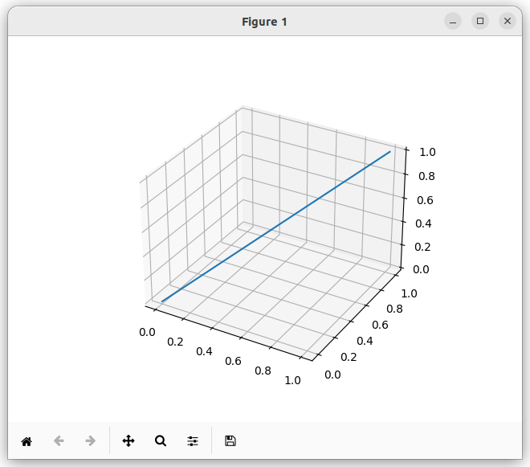
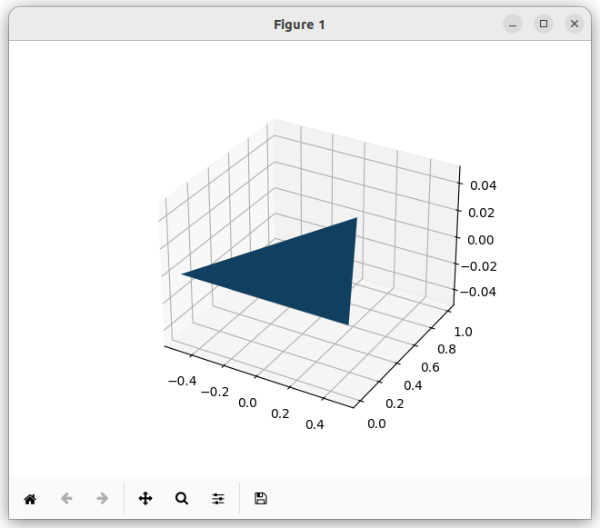
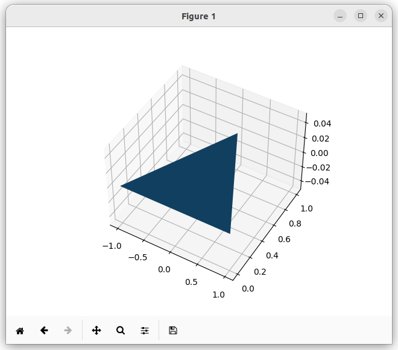
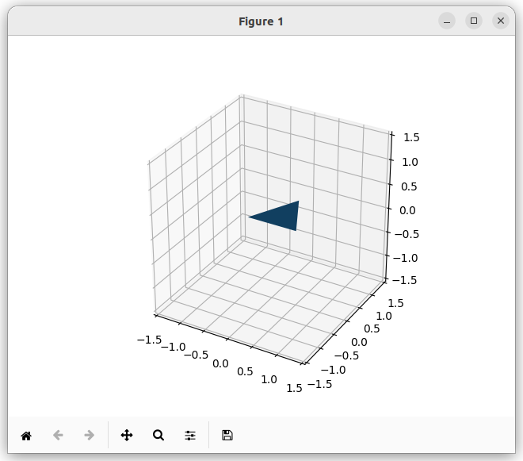

# Matplotlib Note

## cache

* legend() 如何指定图例的顺序？

    指定图例顺序的 4 种方法

    1. handles 和 labels 参数（最常用）

        ```python
        import matplotlib.pyplot as plt
        import numpy as np

        x = np.linspace(0, 10, 100)
        fig, ax = plt.subplots()

        # 绘制多条曲线
        line1, = ax.plot(x, np.sin(x), label='sin(x)', color='r')
        line2, = ax.plot(x, np.cos(x), label='cos(x)', color='g')
        line3, = ax.plot(x, np.tan(x)/10, label='tan(x)/10', color='b')  # 缩小tan值

        # 手动指定顺序：3, 1, 2
        ax.legend(handles=[line3, line1, line2], 
                  labels=['tan(x)/10', 'sin(x)', 'cos(x)'])

        plt.show()
        ```

    2. 调整绘制顺序 + 默认图例

        图例默认按绘制顺序显示：

        ```python
        fig, ax = plt.subplots()

        # 先绘制的在图例中显示在前面
        ax.plot(x, np.tan(x)/10, label='tan(x)/10', color='b')  # 第一个
        ax.plot(x, np.sin(x), label='sin(x)', color='r')        # 第二个  
        ax.plot(x, np.cos(x), label='cos(x)', color='g')        # 第三个

        ax.legend()  # 图例顺序：tan, sin, cos
        plt.show()
        ```

    3. 使用字典排序（自动化）

        ```python
        fig, ax = plt.subplots()

        lines = {}
        lines['tan'] = ax.plot(x, np.tan(x)/10, label='tan(x)/10', color='b')[0]
        lines['sin'] = ax.plot(x, np.sin(x), label='sin(x)', color='r')[0]
        lines['cos'] = ax.plot(x, np.cos(x), label='cos(x)', color='g')[0]

        # 按字母顺序排序
        sorted_keys = sorted(lines.keys())  # ['cos', 'sin', 'tan']
        sorted_handles = [lines[key] for key in sorted_keys]
        sorted_labels = [f'{key}(x)/10' if key=='tan' else f'{key}(x)' for key in sorted_keys]

        ax.legend(handles=sorted_handles, labels=sorted_labels)
        plt.show()
        ```

    4. 使用自定义排序规则

        ```python
        fig, ax = plt.subplots()

        # 数据准备
        data = [
            ('sin(x)', np.sin(x), 'r'),
            ('cos(x)', np.cos(x), 'g'), 
            ('tan(x)/10', np.tan(x)/10, 'b'),
            ('sin²(x)', np.sin(x)**2, 'orange')
        ]

        # 绘制所有曲线
        handles = []
        labels = []
        for label, y_data, color in data:
            line, = ax.plot(x, y_data, color=color)
            handles.append(line)
            labels.append(label)

        # 自定义排序顺序（按特定列表）
        desired_order = ['cos(x)', 'sin(x)', 'sin²(x)', 'tan(x)/10']

        # 按 desired_order 排序
        order_dict = {label: i for i, label in enumerate(desired_order)}
        sorted_pairs = sorted(zip(handles, labels), key=lambda x: order_dict[x[1]])
        sorted_handles, sorted_labels = zip(*sorted_pairs)

        ax.legend(sorted_handles, sorted_labels)
        plt.show()
        ```

    实用示例：分组图例排序

    示例 1：按类别分组排序

    ```python
    fig, ax = plt.subplots(figsize=(10, 6))

    # 模拟不同类别的数据
    categories = {
        'A类': [('A1', 'red', 1.0), ('A2', 'darkred', 1.2)],
        'B类': [('B1', 'blue', 0.8), ('B2', 'darkblue', 1.1)],
        'C类': [('C1', 'green', 1.3)]
    }

    handles = []
    labels = []

    # 按类别顺序绘制
    for category, items in categories.items():
        for name, color, offset in items:
            line, = ax.plot(x, offset * np.sin(x + len(handles)), 
                           color=color, label=f'{category}-{name}')
            handles.append(line)
            labels.append(line.get_label())

    # 保持绘制顺序（即按类别分组）
    ax.legend(handles, labels, title='数据类别', ncol=3)
    plt.show()
    ```

    示例 2：按数值特征排序

    ```python
    fig, ax = plt.subplots()

    # 创建带有特征值的数据
    lines_info = [
        {'label': '高频信号', 'freq': 5, 'amp': 1.0, 'color': 'red'},
        {'label': '中频信号', 'freq': 2, 'amp': 1.5, 'color': 'blue'},
        {'label': '低频信号', 'freq': 0.5, 'amp': 1.2, 'color': 'green'},
        {'label': '噪声', 'freq': 10, 'amp': 0.3, 'color': 'gray'}
    ]

    # 绘制
    handles = []
    for info in lines_info:
        y = info['amp'] * np.sin(info['freq'] * x)
        line, = ax.plot(x, y, color=info['color'], label=info['label'])
        info['handle'] = line
        handles.append(line)

    # 按频率排序
    lines_info_sorted = sorted(lines_info, key=lambda x: x['freq'])
    sorted_handles = [info['handle'] for info in lines_info_sorted]
    sorted_labels = [info['label'] for info in lines_info_sorted]

    ax.legend(sorted_handles, sorted_labels, title='按频率排序')
    plt.show()
    ```

    使用 get_legend_handles_labels() 获取和修改

    ```python
    fig, ax = plt.subplots()

    # 绘制曲线
    ax.plot(x, np.sin(x), label='sin(x)')
    ax.plot(x, np.cos(x), label='cos(x)')
    ax.plot(x, -np.sin(x), label='-sin(x)')

    # 获取当前的句柄和标签
    handles, labels = ax.get_legend_handles_labels()
    print('原始顺序:', labels)  # ['sin(x)', 'cos(x)', '-sin(x)']

    # 重新排序（反转）
    handles.reverse()
    labels.reverse()

    # 应用新顺序
    ax.legend(handles, labels)
    plt.show()
    ```

    复杂场景：多轴图例排序

    ```python
    fig, (ax1, ax2) = plt.subplots(1, 2, figsize=(12, 5))

    # 在两个子图中绘制
    line1a, = ax1.plot(x, np.sin(x), label='sin(x) (左)', color='r')
    line1b, = ax1.plot(x, np.cos(x), label='cos(x) (左)', color='b')

    line2a, = ax2.plot(x, np.exp(-x), label='exp(-x) (右)', color='g', linestyle='--')
    line2b, = ax2.plot(x, np.log(x+1), label='log(x+1) (右)', color='purple', linestyle=':')

    # 创建统一图例并指定顺序
    all_handles = [line1a, line2a, line1b, line2b]  # 自定义顺序
    all_labels = [h.get_label() for h in all_handles]

    fig.legend(all_handles, all_labels, 
               loc='upper center', 
               ncol=2,
               title='统一图例（自定义顺序）')
    plt.tight_layout()
    plt.show()
    ```

    一键排序函数

    ```python
    def sort_legend(ax, order='alphabetical', reverse=False):
        """
        对图例进行排序
        
        参数:
        ax: matplotlib axes
        order: 'alphabetical'（字母顺序）或 'custom'（自定义列表）
        reverse: 是否反转顺序
        """
        handles, labels = ax.get_legend_handles_labels()
        
        if order == 'alphabetical':
            # 按标签字母排序
            sorted_pairs = sorted(zip(handles, labels), key=lambda x: x[1])
        elif isinstance(order, list):
            # 按自定义列表排序
            order_dict = {label: i for i, label in enumerate(order)}
            sorted_pairs = sorted(zip(handles, labels), key=lambda x: order_dict.get(x[1], 999))
        else:
            sorted_pairs = list(zip(handles, labels))
        
        if reverse:
            sorted_pairs.reverse()
        
        sorted_handles, sorted_labels = zip(*sorted_pairs)
        ax.legend(sorted_handles, sorted_labels)
        return ax

    # 使用示例
    fig, ax = plt.subplots()
    ax.plot(x, np.sin(x), label='sine')
    ax.plot(x, np.cos(x), label='cosine')
    ax.plot(x, np.tan(x)/10, label='tangent')

    sort_legend(ax, order='alphabetical')
    # 或 sort_legend(ax, order=['cosine', 'sine', 'tangent'])
    plt.show()
    ```

    总结

    主要方法：

    * handles 和 labels 参数：最直接，完全控制

    * 调整绘制顺序：简单但不够灵活

    * 获取后排序：使用 get_legend_handles_labels() 获取后重新排列

    * 自定义排序函数：最灵活，可复用

    推荐：对于需要精确控制的情况，使用 方法1；对于需要动态排序的情况，使用 方法4。

* Matplotlib 中的 label 和 legend 用法

    1. 基本用法

        ```python
        import matplotlib.pyplot as plt
        import numpy as np

        x = np.linspace(0, 10, 100)
        y1 = np.sin(x)
        y2 = np.cos(x)

        # 方法1: 使用 plt 接口
        plt.plot(x, y1, label='sin(x)')
        plt.plot(x, y2, label='cos(x)')
        plt.legend()  # 显示图例
        plt.show()

        # 方法2: 使用面向对象接口
        fig, ax = plt.subplots()
        ax.plot(x, y1, label='sin(x)')
        ax.plot(x, y2, label='cos(x)')
        ax.legend()  # 显示图例
        plt.show()
        ```

    2. label 参数详解

        label 用于为数据系列设置名称，供图例显示：

        ```python
        # 不同的绘图函数都支持 label
        plt.plot(x, y, label='线性曲线')
        plt.scatter(x, y, label='散点')
        plt.bar(x, y, label='柱状图')
        plt.hist(data, label='直方图')
        plt.fill_between(x, y1, y2, label='填充区域')

        # 设置标签后必须调用 legend() 才会显示
        plt.legend()
        ```

    3. legend() 的常用参数

        ```python
        # 基本图例
        plt.legend()

        # 1. 位置控制
        plt.legend(loc='upper right')        # 右上角
        plt.legend(loc='best')              # 自动选择最佳位置
        plt.legend(loc='center left')       # 左侧居中
        plt.legend(loc='lower center')      # 底部居中
        plt.legend(loc=(0.5, 0.5))          # 自定义坐标 (0-1)

        # 位置字符串选项：
        # 'upper right', 'upper left', 'lower left', 'lower right'
        # 'right', 'center left', 'center right', 'lower center'
        # 'upper center', 'center'

        # 2. 标题和字体
        plt.legend(title='函数类型')                     # 图例标题
        plt.legend(title='函数', title_fontsize=12)     # 标题字体大小
        plt.legend(fontsize=10)                         # 图例字体大小
        plt.legend(title='Legend', title_fontsize=12, fontsize=10)

        # 3. 边框和背景
        plt.legend(frameon=True)                    # 显示边框（默认）
        plt.legend(frameon=False)                   # 隐藏边框
        plt.legend(framealpha=0.5)                  # 边框透明度
        plt.legend(edgecolor='black')               # 边框颜色
        plt.legend(facecolor='lightgray')           # 背景颜色
        plt.legend(shadow=True)                     # 阴影效果

        # 4. 排列方式
        plt.legend(ncol=2)                          # 2列显示
        plt.legend(ncol=3)                          # 3列显示
        plt.legend(columnspacing=1.0)               # 列间距
        plt.legend(labelspacing=0.5)                # 标签间距
        ```

    4. 高级用法示例

        ```python
        # 示例：绘制多条曲线
        x = np.linspace(0, 2*np.pi, 100)
        fig, ax = plt.subplots(figsize=(10, 6))

        # 绘制多条曲线
        ax.plot(x, np.sin(x), label='sin(x)', color='blue', linestyle='-')
        ax.plot(x, np.cos(x), label='cos(x)', color='red', linestyle='--')
        ax.plot(x, np.sin(x)**2, label='sin²(x)', color='green', linestyle=':')
        ax.plot(x, np.cos(x)**2, label='cos²(x)', color='orange', linestyle='-.')

        # 自定义图例
        ax.legend(
            loc='upper center',           # 顶部居中
            bbox_to_anchor=(0.5, 1.15),  # 位置微调（x, y）
            ncol=2,                      # 2列显示
            title='三角函数',            # 图例标题
            title_fontsize=12,           # 标题大小
            fontsize=10,                 # 标签大小
            frameon=True,                # 显示边框
            shadow=True,                 # 阴影
            fancybox=True,               # 圆角边框
            framealpha=0.9,              # 透明度
            edgecolor='black',           # 边框颜色
            facecolor='white'            # 背景颜色
        )

        ax.set_xlabel('x')
        ax.set_ylabel('y')
        plt.tight_layout()
        plt.show()
        ```

    5. 部分显示图例

        ```python
        # 只显示部分曲线的图例
        line1, = plt.plot(x, y1, label='曲线1')
        line2, = plt.plot(x, y2, label='曲线2')
        line3, = plt.plot(x, y3, label='曲线3')

        # 只显示 line1 和 line3 的图例
        plt.legend([line1, line3], ['First', 'Third'])

        # 或使用 handles 参数
        from matplotlib.lines import Line2D
        custom_lines = [Line2D([0], [0], color='blue', lw=2),
                        Line2D([0], [0], color='red', lw=2)]
        plt.legend(custom_lines, ['自定义1', '自定义2'])
        ```

    6. 常见问题与技巧

        ```python
        # 1. 避免重复图例
        fig, ax = plt.subplots()
        for i in range(5):
            ax.plot(x, y+i, label=f'曲线{i}' if i < 3 else None)
        ax.legend()  # 只显示前3条曲线的图例

        # 2. 多个子图的图例
        fig, axes = plt.subplots(2, 2, figsize=(10, 8))
        for ax in axes.flat:
            ax.plot(x, np.sin(x), label='sin(x)')
            ax.plot(x, np.cos(x), label='cos(x)')
            ax.legend(loc='upper right')

        # 3. 共享图例
        fig, (ax1, ax2) = plt.subplots(1, 2, figsize=(12, 5))
        lines1 = ax1.plot(x, np.sin(x), label='sin(x)')
        lines2 = ax2.plot(x, np.cos(x), label='cos(x)')

        # 为整个图形创建统一图例
        fig.legend(handles=[lines1[0], lines2[0]], 
                   labels=['正弦函数', '余弦函数'],
                   loc='upper center',
                   ncol=2)

        # 4. 图例位置微调（防止被遮盖）
        plt.legend(loc='best', bbox_to_anchor=(1.05, 1))  # 移到图形外部右侧
        plt.tight_layout()  # 自动调整布局
        ```

    7. 实用代码片段

        ```python
        # 自动生成图例标签
        x = np.linspace(0, 10, 100)
        functions = [('sin(x)', np.sin, 'blue'),
                     ('cos(x)', np.cos, 'red'),
                     ('exp(-x)', lambda x: np.exp(-x), 'green')]

        fig, ax = plt.subplots()
        for name, func, color in functions:
            ax.plot(x, func(x), label=name, color=color)

        # 美化图例
        ax.legend(
            loc='lower left',
            frameon=True,
            fancybox=True,
            shadow=True,
            borderpad=1,      # 边框内边距
            labelspacing=1,   # 标签间距
            handlelength=2,   # 图例句柄长度
            handletextpad=0.5 # 句柄与文本间距
        )

        # 保存时确保图例完整
        plt.savefig('figure.png', dpi=300, bbox_inches='tight')
        ```

    关键要点

    * label：在绘图时为数据系列命名

    * legend()：显示所有设置了 label 的图例

    * 位置控制：loc 参数最重要，'best' 最常用

    * 样式定制：可调整字体、边框、背景、排列等

    * 子图处理：每个子图可独立设置图例，也可创建统一图例

    * 保存注意：使用 bbox_inches='tight' 确保图例完整保存

    记住：先设置 label，再调用 legend() 才能显示图例！

* `plt.figure()`

    syntax:

    ```py
    plt.figure(num=None, figsize=None, dpi=None, facecolor=None, edgecolor=None, frameon=True, FigureClass=<class 'matplotlib.figure.Figure'>, clear=False, **kwargs)
    ```

    * num: 图形标识符（数字或字符串）

    * figsize: 图形尺寸（宽度, 高度），单位为英寸

    * dpi: 分辨率，每英寸点数

    * facecolor: 图形背景颜色

    * edgecolor: 图形边框颜色

    * clear: 如果为 True 且图形已存在，则清除该图形

    example:

    * 基本用法

        ```py
        import matplotlib.pyplot as plt
        import numpy as np

        # 创建数据
        x = np.linspace(0, 10, 100)
        y = np.sin(x)

        # 创建图形
        plt.figure()
        plt.plot(x, y)
        plt.title('基础图形')
        plt.show()
        ```

    * 指定图形尺寸

        ```py
        # 创建指定大小的图形
        plt.figure(figsize=(8, 6))
        plt.plot(x, y, 'r-', linewidth=2)
        plt.title('自定义尺寸图形')
        plt.grid(True)
        plt.show()
        ```

    * 多图形管理

        ```py
        # 创建第一个图形
        plt.figure(1, figsize=(6, 4))
        plt.plot(x, np.sin(x), 'b-')
        plt.title('图形 1: 正弦函数')

        # 创建第二个图形
        plt.figure(2, figsize=(6, 4))
        plt.plot(x, np.cos(x), 'g-')
        plt.title('图形 2: 余弦函数')

        # 切换回第一个图形并添加内容
        plt.figure(1)
        plt.plot(x, np.cos(x), 'r--', alpha=0.5)
        plt.legend(['sin', 'cos'])

        plt.show()
        ```

    * 自定义背景和分辨率

        ```py
        # 高分辨率、自定义背景
        plt.figure(figsize=(10, 6), dpi=100, facecolor='lightgray')
        plt.plot(x, np.sin(x), label='sin(x)')
        plt.plot(x, np.cos(x), label='cos(x)')
        plt.legend()
        plt.title('高分辨率自定义背景图形')
        plt.grid(True, alpha=0.3)
        plt.show()
        ```

    * 清除现有图形

        ```py
        # 先创建一个图形
        plt.figure(1)
        plt.plot(x, y)
        plt.title('原始图形')

        # 清除并重新绘制
        plt.figure(1, clear=True)
        plt.plot(x, np.tan(x))
        plt.title('清除后重新绘制的图形')
        plt.ylim(-5, 5)
        plt.show()
        ```

    * 使用子图

        ```py
        # 创建图形并添加子图
        fig = plt.figure(figsize=(12, 4))

        # 添加第一个子图
        ax1 = fig.add_subplot(131)
        ax1.plot(x, np.sin(x))
        ax1.set_title('正弦函数')

        # 添加第二个子图
        ax2 = fig.add_subplot(132)
        ax2.plot(x, np.cos(x), 'r-')
        ax2.set_title('余弦函数')

        # 添加第三个子图
        ax3 = fig.add_subplot(133)
        ax3.plot(x, np.exp(-x), 'g-')
        ax3.set_title('指数衰减')

        plt.tight_layout()
        plt.show()
        ```

    * 保存高质量图形

        ```py
        # 创建高分辨率图形用于保存
        plt.figure(figsize=(8, 6), dpi=150)
        x = np.linspace(0, 2*np.pi, 100)
        y1 = np.sin(x)
        y2 = np.cos(x)

        plt.plot(x, y1, 'b-', label='sin(x)', linewidth=2)
        plt.plot(x, y2, 'r--', label='cos(x)', linewidth=2)
        plt.xlabel('x')
        plt.ylabel('y')
        plt.title('三角函数')
        plt.legend()
        plt.grid(True, alpha=0.3)

        # 保存为高质量图片
        plt.savefig('high_quality_plot.png', dpi=300, bbox_inches='tight')
        plt.show()
        ```

* matplotlib hello world example

    ```python
    import matplotlib.pyplot as plt
    import numpy as np

    def main():
        x = np.linspace(0, 2 * np.pi, 200)
        y = np.sin(x)
        fig, ax = plt.subplots()
        ax.plot(x, y)
        plt.show()
        return

    if __name__ == '__main__':
        main()
    ```

    画一条 sin 曲线。

    说明：

    1. `x`与`y`的 shape 都为`(200, )`

    2. `ax.plot()`只接收 shape 为`(N, )`或者`(N, 1)`的 array，不接收其他 shape 的数据，比如`(1, N)`。

## 3D plot

### draw a 3d figure

```python
import matplotlib.pyplot as plt
import numpy as np

def main():
    fig = plt.figure()
    ax = fig.add_subplot(projection = '3d')
    line = np.array([
        [0, 0, 0],
        [1, 1, 1]
    ])
    xs = line[:, 0]
    ys = line[:, 1]
    zs = line[:, 2]
    ax.plot(xs, ys, zs)
    plt.show()

if __name__ == '__main__':
    main()
```

效果：

<div style='text-align:center'>

</div>

### draw a 3d triangle

画三维的三角形主要用到的函数是`ax.plot_trisurf()`。

```python
import matplotlib.pyplot as plt
import numpy as np

def main():
    fig = plt.figure()
    ax = fig.add_subplot(projection = '3d')
    triangle = np.array([
        [-0.5, 0, 0],
        [0, 1, 0],
        [0.5, 0, 0]    
    ])
    xs = triangle[:, 0]
    ys = triangle[:, 1]
    zs = triangle[:, 2]
    vertex_idxs = [
        [0, 1, 2]
    ]
    ax.plot_trisurf(xs, ys, zs, triangles=vertex_idxs)
    plt.show()

if __name__ == '__main__':
    main()
```

我们需要分别指定所有顶点的 x 坐标，y 坐标，z 坐标，然后用`triangles`参数指定顶点的索引，通过类似 opengl VBO 的方式，画出三角形。另外我们还可以用`color`参数指定三角形的颜色。

效果：

<div style='text-align:center'>

</div>

说明：

1. 如果`plot_trisurf()`函数不指定`triangles`参数，那么函数的行为会发生变化，使用另外一种模式画图。有空了看下。

另外一种绘制方式：

```python
import matplotlib.pyplot as plt
from mpl_toolkits.mplot3d import Axes3D
from mpl_toolkits.mplot3d.art3d import Poly3DCollection

triangles =  [
    ((1,1,1),(2,2,2),(1,3,4)),
    ((2,3,4),(9,9,9),(3,4,5)),
]

ax = plt.gca(projection="3d")

ax.add_collection(Poly3DCollection(triangles))

ax.set_xlim([0,10])
ax.set_ylim([0,10])
ax.set_zlim([0,10])

plt.show()
```

不太懂，有时间了看看。

### draw an animation

Ref: <https://matplotlib.org/stable/gallery/animation/animation_demo.html#sphx-glr-gallery-animation-animation-demo-py>

我们可以使用`ax.clear()`和`plt.pause(duration_seconds)`的组合来绘制动画。

```python
import matplotlib.pyplot as plt
import numpy as np

def create_3d_ax():
    fig = plt.figure()
    ax = fig.add_subplot(projection = '3d', autoscale_on = False)
    return ax

def preset_ax_config(ax):
    ax.set_box_aspect([1, 1, 1])
    ax.set_autoscale_on(False)
    ax.set_xlim(-1.5, 1.5)
    ax.set_ylim(-1.5, 1.5)
    ax.set_zlim(-1.5, 1.5)

def clear_ax(ax):
    ax.clear()
    preset_ax_config(ax)  # 每次清空完 ax 后需要重新设置 ax 的属性，不然会恢复到默认设置

def main():
    triangle = np.array([
        [-0.5, 0, 0],
        [0, 1, 0],
        [0.5, 0, 0]
    ])
    xs = triangle[:, 0]
    ys = triangle[:, 1]
    zs = triangle[:, 2]
    vertex_idxs = [
        [0, 1, 2]
    ]
    
    ax = create_3d_ax()
    for frame_idx in range(15):
        clear_ax(ax)
        ax.plot_trisurf(xs, ys, zs, triangles=vertex_idxs)
        xs += 0.1
        plt.pause(0.1)

if __name__ == '__main__':
    main()
```

### axes scaling

如果使用默认的配置，画出来的坐标轴尺度并不是一致的，并且坐标轴会随着绘制数据的变化而动态变化。

比如在下面这种情况下：

```python
import matplotlib.pyplot as plt
import numpy as np

def main():
    fig = plt.figure()
    ax = fig.add_subplot(projection = '3d')
    triangle = np.array([
        [-1, 0, 0],
        [0, 1, 0],
        [1, 0, 0]
    ])
    xs = triangle[:, 0]
    ys = triangle[:, 1]
    zs = triangle[:, 2]
    vertex_idxs = [
        [0, 1, 2]
    ]
    ax.plot_trisurf(xs, ys, zs, triangles=vertex_idxs)
    plt.show()

if __name__ == '__main__':
    main()
```

<div style='text-align:center'>

</div>

三角形沿 x 轴的边的长度为 2，高为 1，但是从效果图来看，底边和高的长度几乎相同，这样明显是不对的。

仔细看图，x 轴的刻度范围是 -1 到 1，而 y 轴的坐标范围是 0 到 1，坐标轴的刻度尺度不一致使得图形变形。

下面的配置可以使得绘制坐标轴尺度相同，并且视图静态，不随着数据的变化而变化。

```python
fig = plt.figure()
ax = fig.add_subplot(projection = '3d', autoscale_on = False)
ax.set_box_aspect([1, 1, 1])
ax.set_autoscale_on(False)
ax.set_xlim(-1.5, 1.5)
ax.set_ylim(-1.5, 1.5)
ax.set_zlim(-1.5, 1.5)
```

我们使用这个配置画一个三角形：

```python
import matplotlib.pyplot as plt
import numpy as np

def create_3d_ax():
    fig = plt.figure()
    ax = fig.add_subplot(projection = '3d', autoscale_on = False)
    return ax

def preset_ax_config(ax):
    ax.set_box_aspect([1, 1, 1])
    ax.set_autoscale_on(False)
    ax.set_xlim(-1.5, 1.5)
    ax.set_ylim(-1.5, 1.5)
    ax.set_zlim(-1.5, 1.5)

def main():
    triangle = np.array([
        [-0.5, 0, 0],
        [0, 1, 0],
        [0.5, 0, 0]
    ])

    xs = triangle[:, 0]
    ys = triangle[:, 1]
    zs = triangle[:, 2]

    vertex_idxs = [
        [0, 1, 2]
    ]

    ax = create_3d_ax()
    preset_ax_config(ax)
    ax.plot_trisurf(xs, ys, zs, triangles=vertex_idxs)
    plt.show()

if __name__ == '__main__':
    main()
```

效果：

<div style='text-align:center'>

</div>

### Backend

在 jupyter notebook 中画 3d 图时，目前使用`TkCairo`作为 backend 的效果比较好。

```python
import matplotlib
matplotlib.use('TkCairo')
import matplotlib.pyplot as plt

# plot something
```

### Draw a spot

```python
from matplotlib import pyplot as plt
plt.rcParams["figure.figsize"] = [7.00, 3.50]
plt.rcParams["figure.autolayout"] = True
x = [4]
y = [3]
plt.xlim(0, 5)
plt.ylim(0, 5)
plt.grid()
plt.plot(x, y, marker="o", markersize=20, markeredgecolor="red", markerfacecolor="green")
plt.show()
```

### 使用 matplotlib 画一个球体

Ref: <https://saturncloud.io/blog/rendering-a-3d-sphere-in-matplotlib-a-guide/>

这个里面用到了球的参数方程和`np.outer()`，目前对这两个都不太熟，有时间了再看吧。
