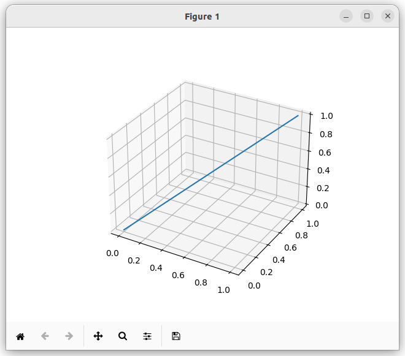
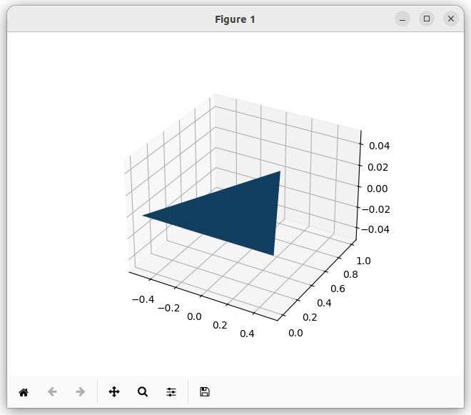
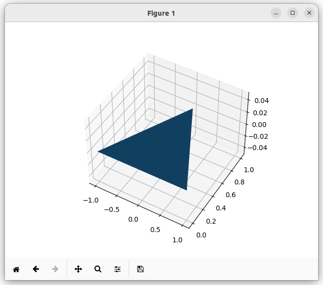
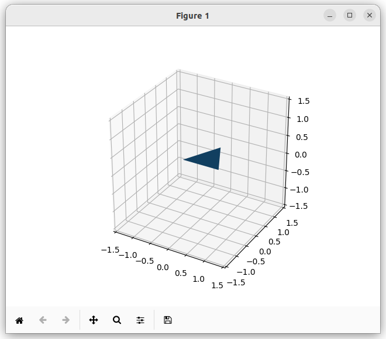

# Matplotlib Note

## cache

* 为什么 fig.show() 不显示图片，plt.show() 可以

    你好！这是一个很常见的问题，主要原因在于 `fig.show()` 和 `plt.show()` 的设计目的和工作方式有本质区别。

    ### 核心区别

    - **`plt.show()`**：这是 **阻塞式** 的、**完整图形界面** 的显示方法。它会启动一个事件循环，打开一个完整的 GUI 窗口，你可以在这个窗口里缩放、平移、保存图片，与图表进行交互。
    - **`fig.show()`**：这是一个 **轻量级** 的、**非阻塞式** 的显示方法。它主要依赖于浏览器的渲染引擎或者一些内置的图片查看器来快速显示一个静态图片，**交互性非常有限**。

    ---

    ### 详细解释和对比

    | 特性 | `plt.show()` | `fig.show()` |
    | :--- | :--- | :--- |
    | **后端** | 需要完整的 GUI 后端 (TkAgg, Qt5Agg, etc.) | 通常使用内置的图片查看器或浏览器 |
    | **阻塞性** | **阻塞** 程序执行，直到你关闭窗口 | **非阻塞**，代码会继续执行 |
    | **交互性** | **高**，可以缩放、平移、保存 | **极低**，通常是静态图片 |
    | **主要用途** | 在脚本或交互式环境中显示完整图形 | 在 Notebook 环境或快速查看时使用 |
    | **可靠性** | **高**，是标准的显示方式 | **较低**，依赖系统环境，容易出问题 |

    ---

    ### 为什么 `fig.show()` 可能不工作？

    `fig.show()` 的行为不太稳定，具体取决于你的环境和配置：

    1.  **在 Jupyter Notebook/Lab 中**：
        - 这是 `fig.show()` **最有效** 的地方。它会直接在 Notebook 的输出单元格中渲染图像。
        - 但即使在这里，有时也需要先运行 `%matplotlib inline` 或 `%matplotlib widget` 等魔术命令。

    2.  **在脚本或 IDE (如 PyCharm, VSCode) 中**：
        - `fig.show()` 的行为非常不确定。
        - 它可能会尝试调用系统的默认图片查看器来打开一个临时生成的 PNG 文件。
        - 如果系统没有关联的图片查看器，或者路径有问题，它就**什么也不做**，也不会报错，让你感觉“没反应”。
        - 在某些 IDE 中，它可能能正常显示，但在另一些中则完全失败。

    3.  **后端不兼容**：
        - 如果你设置了一个非交互式后端（如 `Agg`），`fig.show()` 很可能无法工作，因为它无法生成 GUI 窗口。

    ---

    ### 解决方案和最佳实践

    #### 1. 在脚本中，始终坚持使用 `plt.show()`

    这是最可靠、最标准的方法。

    ```python
    import matplotlib.pyplot as plt

    fig, ax = plt.subplots()
    ax.plot([1, 2, 3, 4])
    plt.show() # 阻塞，会打开一个窗口，关闭后代码才继续
    ```

    #### 2. 在 Jupyter Notebook 中，使用魔术命令

    使用 `%matplotlib inline` 可以自动在单元格下方显示图形，你甚至不需要显式调用 `show()`。

    ```python
    %matplotlib inline
    import matplotlib.pyplot as plt

    fig, ax = plt.subplots()
    ax.plot([1, 2, 3, 4])
    # 在 Notebook 中，图形会自动显示，不需要 plt.show() 或 fig.show()
    ```

    如果你想在 Notebook 中获得更好的交互体验，可以使用：
    ```python
    %matplotlib widget
    # 然后绘图，你可以缩放和平移
    ```

    #### 3. 如果你想快速查看且不阻塞，可以尝试 `fig.show()`

    但请做好它可能失败的心理准备。一个更健壮的“快速查看”方法是配合 `plt.ion()`（交互模式）使用 `plt.show()`，但它仍然会打开一个完整的 GUI 窗口。

    ```python
    import matplotlib.pyplot as plt

    plt.ion() # 打开交互模式
    fig, ax = plt.subplots()
    ax.plot([1, 2, 3, 4])
    plt.show(block=False) # 不阻塞，窗口会显示，但代码会继续

    # ... 你可以继续执行其他代码 ...
    input("按回车键关闭窗口...") # 用一个输入来保持程序运行，否则窗口可能一闪而过
    plt.close(fig)
    ```

    ### 总结

    - **`plt.show()` 是“正式”的显示方法**，它在所有环境下都最可靠。
    - **`fig.show()` 是“便捷”的显示方法**，它的行为高度依赖环境，尤其在脚本中非常不可靠。

    所以，当你发现 `fig.show()` 不显示图片时，**请直接换成 `plt.show()`**，这是解决问题最直接有效的方法。在 Notebook 中，则优先使用魔术命令 `%matplotlib inline`。

* 我现在已经有了一个 Figure 对象fig，如何显示它

    当你已经有一个 Figure 对象 `fig` 时，有几种方法可以显示它。以下是各种情况的解决方案：

    ## 1. 在脚本或通用环境中（最推荐）

    ### 使用 `plt.show()`
    ```python
    import matplotlib.pyplot as plt

    # 假设你已经有了 fig 对象
    plt.show()  # 这会显示当前活动的图形，也就是你刚创建的 fig
    ```

    ### 或者明确指定要显示的图形
    ```python
    import matplotlib.pyplot as plt

    # 明确显示特定的 fig 对象
    plt.figure(fig.number)  # 激活这个图形
    plt.show()
    ```

    ## 2. 在 Jupyter Notebook 中

    ### 使用魔术命令 + 直接显示
    ```python
    %matplotlib inline
    import matplotlib.pyplot as plt

    # 在 Notebook 中，图形会自动显示
    # 如果你已经创建了 fig，它可能已经显示了

    # 如果需要强制重新显示
    display(fig)  # 这是最直接的方法
    ```

    ### 或者使用 matplotlib 的显示函数
    ```python
    from IPython.display import display
    %matplotlib inline

    display(fig)
    ```

    ## 3. 保存为图片文件

    如果你只是想查看图形，也可以保存为图片：
    ```python
    fig.savefig('my_plot.png', dpi=300, bbox_inches='tight')

    # 然后在文件管理器中打开图片查看
    ```

    ## 4. 完整的示例代码

    ```python
    import matplotlib.pyplot as plt
    import numpy as np

    # 创建示例数据
    x = np.linspace(0, 10, 100)
    y = np.sin(x)

    # 创建图形对象
    fig, ax = plt.subplots(figsize=(10, 6))
    ax.plot(x, y)
    ax.set_title('Sine Wave')
    ax.set_xlabel('X')
    ax.set_ylabel('Y')

    # 方法1：使用 plt.show() （最推荐）
    plt.show()

    # 方法2：在 Notebook 中使用
    # %matplotlib inline
    # display(fig)

    # 方法3：保存图片
    # fig.savefig('sine_wave.png')
    ```

    ## 5. 如果你在使用交互式后端

    ```python
    # 设置交互模式
    plt.ion()  # 打开交互模式

    # 你的绘图代码...
    fig, ax = plt.subplots()
    ax.plot([1, 2, 3, 4])

    # 图形会自动显示，但为了确保显示
    plt.draw()
    plt.pause(0.001)  # 短暂的暂停以确保图形更新
    ```

    ## 总结

    对于你的情况，**最简单的解决方案就是直接调用 `plt.show()`**：

    ```python
    import matplotlib.pyplot as plt

    # 假设 fig 是你已经创建好的 Figure 对象
    plt.show()
    ```

    这会在大多数环境下正常工作，无论是脚本、IDE还是终端。在 Jupyter Notebook 中，使用 `%matplotlib inline` 加上 `display(fig)` 或直接让图形自动显示。

* 如果我创建了多个 fig 对象呢

    当你创建了多个 Figure 对象时，显示和管理它们需要一些技巧。以下是几种处理方法：

    ## 1. 分别显示每个图形（依次显示）

    ### 方法A：使用 `plt.figure()` 激活后显示
    ```python
    import matplotlib.pyplot as plt

    # 创建多个图形
    fig1, ax1 = plt.subplots()
    ax1.plot([1, 2, 3, 4], [1, 4, 2, 3])
    ax1.set_title('Figure 1')

    fig2, ax2 = plt.subplots()
    ax2.plot([1, 2, 3, 4], [4, 1, 3, 2])
    ax2.set_title('Figure 2')

    fig3, ax3 = plt.subplots()
    ax3.plot([1, 2, 3, 4], [2, 3, 4, 1])
    ax3.set_title('Figure 3')

    # 依次显示每个图形
    plt.figure(fig1.number)
    plt.show()  # 显示第一个，关闭后继续

    plt.figure(fig2.number)
    plt.show()  # 显示第二个，关闭后继续

    plt.figure(fig3.number)
    plt.show()  # 显示第三个
    ```

    ### 方法B：使用非阻塞模式一次性打开所有窗口
    ```python
    import matplotlib.pyplot as plt

    # 创建多个图形
    fig1, ax1 = plt.subplots()
    ax1.plot([1, 2, 3, 4], [1, 4, 2, 3])

    fig2, ax2 = plt.subplots()
    ax2.plot([1, 2, 3, 4], [4, 1, 3, 2])

    fig3, ax3 = plt.subplots()
    ax3.plot([1, 2, 3, 4], [2, 3, 4, 1])

    # 非阻塞方式显示所有图形
    plt.show(block=False)

    # 保持程序运行，直到所有窗口关闭
    input("按回车键退出...")  # 或者使用 plt.show(block=True)
    ```

    ## 2. 在 Jupyter Notebook 中显示多个图形

    ```python
    %matplotlib inline
    import matplotlib.pyplot as plt

    # 创建多个图形
    fig1, ax1 = plt.subplots()
    ax1.plot([1, 2, 3, 4], [1, 4, 2, 3])
    ax1.set_title('Figure 1')

    fig2, ax2 = plt.subplots()
    ax2.plot([1, 2, 3, 4], [4, 1, 3, 2])
    ax2.set_title('Figure 2')

    # 在 Notebook 中会自动显示最后一个创建的图形
    # 要显示特定的图形，使用：
    from IPython.display import display
    display(fig1)
    display(fig2)
    ```

    ## 3. 使用子图在一个窗口中显示多个图形

    ```python
    import matplotlib.pyplot as plt

    # 创建一个图形，多个子图
    fig, (ax1, ax2, ax3) = plt.subplots(1, 3, figsize=(15, 5))

    ax1.plot([1, 2, 3, 4], [1, 4, 2, 3])
    ax1.set_title('Subplot 1')

    ax2.plot([1, 2, 3, 4], [4, 1, 3, 2])
    ax2.set_title('Subplot 2')

    ax3.plot([1, 2, 3, 4], [2, 3, 4, 1])
    ax3.set_title('Subplot 3')

    plt.tight_layout()  # 自动调整子图间距
    plt.show()  # 一次性显示所有子图
    ```

    ## 4. 管理多个图形对象

    ```python
    import matplotlib.pyplot as plt

    # 存储图形对象的列表
    figures = []

    # 批量创建图形
    for i in range(3):
        fig, ax = plt.subplots()
        ax.plot([1, 2, 3, 4], [i+1, i+2, i+3, i+4])
        ax.set_title(f'Figure {i+1}')
        figures.append(fig)

    # 批量显示
    for i, fig in enumerate(figures):
        print(f"显示图形 {i+1}")
        plt.figure(fig.number)
        if i < len(figures) - 1:
            plt.show(block=False)  # 非阻塞显示前几个
        else:
            plt.show(block=True)   # 最后一个阻塞显示

    # 或者一次性非阻塞显示所有
    # plt.show(block=False)
    # input("按回车键关闭所有窗口...")
    ```

    ## 5. 使用图形管理器

    ```python
    import matplotlib.pyplot as plt
    import matplotlib._pylab_helpers as pylab_helpers

    # 创建多个图形
    fig1 = plt.figure()
    plt.plot([1, 2, 3, 4], [1, 4, 2, 3])

    fig2 = plt.figure()
    plt.plot([1, 2, 3, 4], [4, 1, 3, 2])

    # 获取所有图形管理器
    fig_managers = pylab_helpers.Gcf.get_all_fig_managers()

    print(f"当前有 {len(fig_managers)} 个图形窗口")

    # 显示所有图形
    plt.show()
    ```

    ## 6. 保存多个图形到文件

    ```python
    import matplotlib.pyplot as plt

    # 创建多个图形
    figures = []
    for i in range(3):
        fig, ax = plt.subplots()
        ax.plot([1, 2, 3, 4], [i+1, i+2, i+3, i+4])
        ax.set_title(f'Figure {i+1}')
        figures.append(fig)

    # 保存所有图形到文件
    for i, fig in enumerate(figures):
        fig.savefig(f'figure_{i+1}.png', dpi=300, bbox_inches='tight')
        plt.close(fig)  # 关闭图形释放内存

    print("所有图形已保存为文件")
    ```

    ## 推荐做法

    1. **对于脚本开发**：使用 `plt.show(block=False)` 一次性显示所有窗口
    2. **对于数据分析**：考虑使用子图而不是多个独立图形
    3. **对于批量处理**：保存为图片文件而不是显示
    4. **在 Jupyter 中**：使用 `display(fig)` 精确控制显示哪个图形

    选择哪种方法取决于你的具体需求和运行环境。

* 为什么 fig.number 没有在 vscode 里自动提示出来？

    这是一个很好的问题！`fig.number` 没有在 VSCode 中自动提示的原因有几个：

    ## 1. 类型提示和代码补全的限制

    Matplotlib 的 Figure 类使用了一些动态属性，这些属性可能不会在静态类型检查中显示出来。

    ```python
    import matplotlib.pyplot as plt

    fig = plt.figure()
    print(type(fig))  # <class 'matplotlib.figure.Figure'>
    # fig.number 是运行时动态设置的属性
    ```

    ## 2. `number` 属性的特殊性

    `fig.number` 实际上是一个**实例属性**，而不是类属性。它在 Figure 对象创建时被动态设置：

    ```python
    # 当你创建 Figure 时：
    fig1 = plt.figure()  # 内部会设置 fig1.number = 1
    fig2 = plt.figure()  # 内部会设置 fig2.number = 2
    ```

    ## 3. VSCode 的 Python 扩展限制

    即使你安装了 Pylance 或 Jedi 作为语言服务器，对于一些动态设置的属性，自动补全可能无法识别。

    ## 解决方案

    ### 方法1：使用已知的属性和方法
    ```python
    import matplotlib.pyplot as plt

    fig = plt.figure()
    # 这些通常会有自动提示：
    print(fig.get_label())      # 获取标签
    print(fig.get_figwidth())   # 获取宽度
    print(fig.get_figheight())  # 获取高度

    # number 属性虽然存在，但可能没有提示
    print(fig.number)  # 这能正常工作，只是没有自动提示
    ```

    ### 方法2：使用 plt 的图形管理功能
    ```python
    import matplotlib.pyplot as plt

    fig1 = plt.figure(1)  # 明确指定图形编号
    fig2 = plt.figure(2)

    # 通过 plt 模块来管理
    current_fig = plt.gcf()  # 获取当前图形
    print(f"当前图形编号: {plt.gcf().number}")

    # 获取所有图形
    fig_managers = plt._pylab_helpers.Gcf.get_all_fig_managers()
    for manager in fig_managers:
        print(f"图形 {manager.num} 正在显示")
    ```

    ### 方法3：添加类型提示（有助于自动补全）
    ```python
    import matplotlib.pyplot as plt
    from matplotlib.figure import Figure

    # 明确指定类型
    fig: Figure = plt.figure()
    # 这样可能会有更好的自动补全支持

    # 现在尝试输入 fig. 看看是否有更多提示
    ```

    ### 方法4：检查可用属性
    ```python
    import matplotlib.pyplot as plt

    fig = plt.figure()

    # 查看所有可用属性
    print([attr for attr in dir(fig) if not attr.startswith('_')])

    # 或者使用 vars() 查看实例属性
    print(vars(fig).keys())
    ```

    ### 方法5：使用 VSCode 的设置
    在 VSCode 的 settings.json 中添加：
    ```json
    {
        "python.analysis.extraPaths": [
            "/path/to/your/python/site-packages"
        ],
        "python.analysis.typeCheckingMode": "basic"
    }
    ```

    ## 实际验证 `fig.number` 的存在

    ```python
    import matplotlib.pyplot as plt

    # 创建多个图形来验证 number 属性
    figures = []
    for i in range(3):
        fig = plt.figure()
        figures.append(fig)
        print(f"图形 {i+1} 的编号: {fig.number}")  # 这会正常输出

    # 关闭所有图形
    plt.close('all')
    ```

    ## 总结

    - `fig.number` **确实存在**并且可以正常工作
    - 缺少自动提示是因为它是**运行时设置的实例属性**
    - 这**不影响代码功能**，只是 IDE 的提示限制
    - 你可以放心使用 `fig.number`，即使没有自动提示

    如果你非常依赖自动提示，可以考虑使用其他图形管理方法，或者直接相信代码能正常运行，即使 IDE 没有提示。

* 这是否说明 matplotlib 设计得不好

    这是一个很有深度的观察！但我不认为这完全说明 matplotlib 设计得"不好"，更多是反映了它的**历史背景、设计哲学和权衡取舍**。

    ## matplotlib 的设计背景

    matplotlib 诞生于 **2002 年**，比现代 IDE 和类型提示的普及要早得多。它的设计受到 MATLAB 的强烈影响，当时的编程范式与现在有很大不同。

    ## 为什么会有这样的设计选择？

    ### 1. **历史兼容性负担**
    ```python
    # matplotlib 必须保持向后兼容
    # 20年前的代码在今天仍然要能运行
    import matplotlib.pyplot as plt
    plt.plot([1, 2, 3], [1, 4, 2])  # 这行代码在 2003 年就能运行
    plt.show()
    ```

    ### 2. **动态性的代价**
    matplotlib 为了灵活性使用了大量动态属性设置：
    ```python
    fig = plt.figure()
    # 这些属性都是运行时动态添加的：
    fig.number = 1           # 图形编号
    fig.axes = []            # 包含的坐标轴列表
    fig.canvas = ...         # 画布对象
    # 静态类型系统很难推断这些
    ```

    ### 3. **面向不同用户群体**
    matplotlib 要同时满足：
    - **MATLAB 转来的科学家**（习惯命令式编程）
    - **Python 新手**（需要简单接口）
    - **高级开发者**（需要精细控制）

    ## 确实存在的设计问题

    ### 1. **状态机模式令人困惑**
    ```python
    import matplotlib.pyplot as plt

    # 令人困惑的地方：
    plt.figure(1)           # 创建图形1
    plt.plot([1, 2, 3])     # 在当前图形上绘图
    fig2 = plt.figure(2)    # 创建图形2，但图形1仍然是"当前图形"吗？
    plt.plot([4, 5, 6])     # 这个画在哪个图形上？
    ```

    ### 2. **多种方式做同一件事**
    ```python
    # 创建图形的多种方式：
    fig = plt.figure()
    fig, ax = plt.subplots()
    fig = Figure()
    fig = plt.gcf()

    # 设置标题的多种方式：
    ax.set_title('Title')
    plt.title('Title')
    fig.suptitle('Title')
    ```

    ### 3. **文档字符串不完整**
    很多属性和方法缺乏完整的类型注解，影响 IDE 支持。

    ## 现代的改进和替代方案

    ### 1. **面向对象接口（推荐）**
    ```python
    # 现代的最佳实践：明确使用面向对象方式
    fig, ax = plt.subplots()
    ax.plot(x, y)
    ax.set_xlabel('X')
    # 这种方式更清晰，IDE 支持更好
    ```

    ### 2. **类型提示的改进**
    较新版本的 matplotlib 在逐步添加类型提示：
    ```python
    from matplotlib.figure import Figure
    from matplotlib.axes import Axes

    def create_plot() -> tuple[Figure, Axes]:
        fig, ax = plt.subplots()
        return fig, ax  # 明确的类型提示
    ```

    ### 3. **现代替代库**
    像 **Plotly**、**Altair**、**Bokeh** 等新库在设计时考虑了现代开发需求：
    ```python
    # Plotly 示例 - 更一致的 API
    import plotly.express as px
    fig = px.scatter(df, x='x', y='y')
    fig.show()  # 更一致的 API
    ```

    ## 公平的评价

    ### matplotlib 的优点：
    - **极其成熟稳定**（20+ 年的测试）
    - **功能极其丰富**（几乎能画任何图）
    - **广泛的社区支持**
    - **与其他科学计算库完美集成**

    ### 确实存在的缺点：
    - **API 不一致性**
    - **学习曲线较陡**
    - **IDE 支持不如现代库**
    - **一些历史设计决策显得过时**

    ## 结论

    **matplotlib 不是"设计不好"，而是"为不同时代设计"**。

    它是在 Python 生态还很年轻的时期创建的，主要目标是**功能强大**和**MATLAB兼容**，而不是**IDE友好**或**类型安全**。

    对于今天的标准，某些设计确实显得笨拙，但要考虑到：
    - 重写整个库会破坏无数现有项目
    - 它的核心价值（稳定性和功能丰富性）仍然无可替代
    - 它在逐步现代化，但必须保持向后兼容

    所以，`fig.number` 没有自动提示更多反映了**历史背景和技术债务**，而不是根本性的设计缺陷。对于新项目，建议使用更现代的绘图库；对于需要 matplotlib 强大功能的项目，理解它的历史背景有助于更好地使用它。

* 如果同时指定了fig.set_size_inches()和fig.set_dpi()，那么哪个会生效？

    **两个都会生效，它们共同决定了最终图像的像素尺寸和显示/打印质量。**

    让我通过代码示例详细解释：

    ## 核心关系公式

    ```python
    # 像素尺寸 = 物理尺寸(英寸) × DPI(每英寸点数)
    pixel_width = width_inches * dpi
    pixel_height = height_inches * dpi
    ```

    ## 实际演示

    ```python
    import matplotlib.pyplot as plt

    # 创建图形并同时设置尺寸和DPI
    fig = plt.figure(figsize=(6, 4), dpi=100)  # 初始设置

    # 后续修改
    fig.set_size_inches(8, 6)   # 设置为 8×6 英寸
    fig.set_dpi(150)            # 设置为 150 DPI

    # 验证最终效果
    print(f"物理尺寸: {fig.get_size_inches()} 英寸")  # [8. 6.]
    print(f"DPI: {fig.get_dpi()}")                   # 150.0
    print(f"像素尺寸: {fig.get_size_inches() * fig.get_dpi()} 像素")  # [1200. 900.]
    ```

    ## 不同场景的影响

    ### 场景1：显示在屏幕上
    ```python
    fig1 = plt.figure(figsize=(6, 4), dpi=100)
    ax1 = fig1.add_subplot(111)
    ax1.plot([1, 2, 3, 4])
    ax1.set_title('屏幕显示: 6×4英寸 @ 100DPI')

    # 在屏幕上，DPI主要影响文本和线条的清晰度
    # 更高的DPI = 更清晰的文字，但窗口尺寸由物理尺寸决定
    ```

    ### 场景2：保存为图片文件
    ```python
    fig2 = plt.figure(figsize=(6, 4), dpi=100)
    fig2.set_size_inches(3, 2)   # 修改尺寸
    fig2.set_dpi(200)            # 修改DPI

    ax2 = fig2.add_subplot(111)
    ax2.plot([1, 2, 3, 4])
    ax2.set_title('保存文件: 3×2英寸 @ 200DPI')

    # 保存时，两者共同决定文件分辨率
    fig2.savefig('high_res.png', dpi=200, bbox_inches='tight')
    # 最终文件像素尺寸: (3*200) × (2*200) = 600×400 像素
    ```

    ## 优先级和覆盖规则

    ### 规则1：最后设置的生效
    ```python
    fig = plt.figure()

    fig.set_size_inches(5, 5)    # 尺寸: 5×5英寸
    fig.set_dpi(100)             # DPI: 100
    fig.set_size_inches(8, 6)    # 尺寸被覆盖: 8×6英寸
    fig.set_dpi(150)             # DPI被覆盖: 150

    # 最终: 8×6英寸 @ 150DPI = 1200×900像素
    ```

    ### 规则2：savefig() 的 dpi 参数可以临时覆盖
    ```python
    fig = plt.figure(figsize=(6, 4), dpi=100)

    # 保存时使用不同的DPI
    fig.savefig('image1.png')                    # 使用fig的DPI: 100 → 600×400像素
    fig.savefig('image2.png', dpi=300)           # 临时覆盖为300 → 1800×1200像素
    fig.savefig('image3.png', dpi=50)            # 临时覆盖为50 → 300×200像素

    # 注意: fig本身的DPI设置不变，仍然是100
    print(f"图形DPI设置未变: {fig.get_dpi()}")  # 100.0
    ```

    ## 实用建议

    ### 对于出版物或打印：
    ```python
    # 需要高DPI和精确尺寸
    fig = plt.figure(figsize=(3.5, 2.5))  # 期刊要求的尺寸
    fig.set_dpi(600)                      # 印刷质量
    ```

    ### 对于网页显示：
    ```python
    # 关注像素尺寸而非物理尺寸
    desired_pixels = (1200, 800)
    dpi = 100
    fig_size = (desired_pixels[0]/dpi, desired_pixels[1]/dpi)

    fig = plt.figure(figsize=fig_size, dpi=dpi)
    ```

    ### 对于屏幕交互：
    ```python
    # DPI影响清晰度，尺寸影响窗口大小
    fig = plt.figure(figsize=(10, 6), dpi=150)  # 大窗口 + 清晰显示
    ```

    ## 总结

    - **`set_size_inches()`**：控制物理尺寸（英寸）
    - **`set_dpi()`**：控制分辨率（点/英寸）
    - **两者共同决定**最终的像素尺寸和图像质量
    - **没有优先级冲突**，它们是互补关系
    - **保存图片时**，`savefig(dpi=...)` 可以临时覆盖图形的DPI设置

    所以回答你的问题：**两个都生效，它们协同工作而不是相互竞争。**

* def plot_imgs(imgs: list[ndarray] | ndarray, ncols: int=6, ax_width: float=3) -> Figure:
    # imgs: (n, h, w)
    nimgs = len(imgs)
    nrows = int(nimgs / ncols) if nimgs % ncols == 0 else int(nimgs / ncols) + 1
    fig, axes = plt.subplots(nrows, ncols)
    for row in range(nrows):
        for col in range(ncols):
            ith = row * ncols + col
            ax: Axes = axes[row, col]
            ax.set_axis_off()
            if ith >= nimgs:
                continue
            ax.imshow(imgs[ith], cmap='gray')

    fig.tight_layout(pad=0)
    fig.subplots_adjust(top=0.99, bottom=0.01, wspace=0, hspace=0.1)
    ax_height = ax_width
    fig.set_size_inches(ax_width * ncols, ax_height * nrows)
    fig.set_dpi(200)
    return fig
仿照着上面 plot_imgs()，完成下面 export_imgs() 的功能：
def export_imgs(imgs: list[ndarray], dir_path: str):
    # imgs: (n, h, w)
    fig = plt.figure()
    fig.tight_layout(pad=0)
    fig.subplots_adjust(top=0.99, bottom=0.01, wspace=0, hspace=0.1)
    fig.set_dpi(200)
    ax = plt.gca()
    for i, img in enumerate(imgs):
        ax.imshow(img)
        file_path = os.path.join(dir_path, '{}.png'.format(i))
        fig.savefig(file_path)
        fig.clear()

    看到你的 `export_imgs()` 函数有几个问题，我来帮你修正并完善它：

    ## 问题分析

    1. **重复使用同一个坐标轴**：`plt.gca()` 只获取一次坐标轴，但每次 `fig.clear()` 后需要重新创建
    2. **尺寸设置缺失**：没有设置合适的图形尺寸
    3. **坐标轴设置不完整**：需要关闭坐标轴显示

    ## 修正版本

    ```python
    def export_imgs(imgs: list[ndarray], dir_path: str, img_height: float=3):
        """
        将多张图像分别导出为单独的PNG文件
        
        Args:
            imgs: 图像列表，每个图像为 (h, w) 的ndarray
            dir_path: 输出目录路径
            img_height: 单张图像的显示高度（英寸）
        """
        import os
        import matplotlib.pyplot as plt
        from matplotlib.figure import Figure
        import numpy as np
        
        # 确保输出目录存在
        os.makedirs(dir_path, exist_ok=True)
        
        # 创建图形，不立即显示
        fig = plt.figure(frameon=False)
        
        # 设置图形属性
        fig.tight_layout(pad=0)
        fig.set_dpi(200)
        
        for i, img in enumerate(imgs):
            # 清除之前的图形内容
            fig.clear()
            
            # 根据图像宽高比计算宽度
            h, w = img.shape[:2] if len(img.shape) >= 2 else img.shape
            aspect_ratio = w / h
            img_width = img_height * aspect_ratio
            
            # 设置图形尺寸
            fig.set_size_inches(img_width, img_height)
            
            # 添加坐标轴并设置
            ax = fig.add_axes([0, 0, 1, 1])  # [left, bottom, width, height]
            ax.set_axis_off()
            ax.imshow(img, cmap='gray', aspect='auto')
            
            # 保存图像
            file_path = os.path.join(dir_path, f'{i}.png')
            fig.savefig(file_path, bbox_inches='tight', pad_inches=0, dpi=200)
            
            print(f"已保存: {file_path}")
        
        # 关闭图形释放资源
        plt.close(fig)
    ```

    ## 更简洁的版本（如果你不需要精确控制尺寸）

    ```python
    def export_imgs(imgs: list[ndarray], dir_path: str):
        """
        简化版本 - 自动适应图像尺寸
        """
        import os
        import matplotlib.pyplot as plt
        
        os.makedirs(dir_path, exist_ok=True)
        
        for i, img in enumerate(imgs):
            # 为每张图像创建新的图形
            fig, ax = plt.subplots(figsize=(6, 6), dpi=200)
            ax.set_axis_off()
            ax.imshow(img, cmap='gray')
            
            # 紧密布局
            fig.tight_layout(pad=0)
            
            # 保存
            file_path = os.path.join(dir_path, f'{i}.png')
            fig.savefig(file_path, bbox_inches='tight', pad_inches=0)
            
            # 立即关闭释放内存
            plt.close(fig)
            print(f"已保存: {file_path}")
    ```

    ## 与 plot_imgs() 保持一致的版本

    ```python
    def export_imgs(imgs: list[ndarray], dir_path: str, ax_width: float=3):
        """
        保持与 plot_imgs 相同风格的版本
        """
        import os
        import matplotlib.pyplot as plt
        import numpy as np
        
        os.makedirs(dir_path, exist_ok=True)
        
        # 使用单张图像的方式处理
        for i, img in enumerate(imgs):
            # 为每张图像创建单独的图形
            fig, ax = plt.subplots(1, 1, figsize=(ax_width, ax_width), dpi=200)
            
            # 设置与 plot_imgs 相同的样式
            ax.set_axis_off()
            ax.imshow(img, cmap='gray')
            
            # 相同的布局设置
            fig.tight_layout(pad=0)
            fig.subplots_adjust(top=0.99, bottom=0.01, left=0.01, right=0.99, wspace=0, hspace=0)
            
            # 保存
            file_path = os.path.join(dir_path, f'{i:04d}.png')  # 使用4位数字编号
            fig.savefig(file_path, bbox_inches='tight', pad_inches=0)
            
            plt.close(fig)  # 重要：关闭图形释放内存
        
        print(f"已导出 {len(imgs)} 张图像到 {dir_path}")
    ```

    ## 使用示例

    ```python
    # 示例用法
    import numpy as np

    # 创建一些示例图像
    sample_imgs = [np.random.rand(64, 64) for _ in range(10)]

    # 导出图像
    export_imgs(sample_imgs, './output_images', ax_width=3)
    ```

    ## 主要改进点

    1. **修复坐标轴问题**：每次循环重新创建坐标轴
    2. **添加尺寸控制**：根据宽高比自动计算合适的尺寸
    3. **优化保存设置**：使用 `bbox_inches='tight'` 和 `pad_inches=0` 去除白边
    4. **内存管理**：及时关闭图形释放内存
    5. **错误处理**：确保输出目录存在
    6. **进度反馈**：添加保存进度输出

    推荐使用第三个版本，因为它与你的 `plot_imgs()` 函数风格一致，且更稳定可靠。

* plt.scatter() 里，我想把 marker 搞得大一点粗一点，怎么办

	在 `plt.scatter()` 中，你可以通过以下参数来调整 marker 的大小和粗细：

	1. 调整 marker 大小 - `s` 参数

        ```python
        import matplotlib.pyplot as plt
        import numpy as np

        x = np.random.rand(20)
        y = np.random.rand(20)

        # 基础用法 - 设置统一大小
        plt.scatter(x, y, s=100)  # s 控制点的大小

        plt.show()
        ```

	2. 调整 marker 边缘粗细 - `linewidths` 参数

        ```python
        # 设置边缘线条粗细
        plt.scatter(x, y, s=100, linewidths=2)  # 边缘线条宽度为2
        plt.show()
        ```

	3. 综合调整大小和粗细

        ```python
        # 同时调整大小和边缘粗细
        plt.scatter(x, y, s=150, linewidths=3, edgecolors='black')
        plt.show()
        ```

	4. 不同点设置不同大小

        ```python
        # 为每个点设置不同的大小
        sizes = np.random.randint(50, 200, 20)  # 随机大小
        plt.scatter(x, y, s=sizes, linewidths=2, edgecolors='black')
        plt.show()
        ```

	5. 完整示例

        ```python
        import matplotlib.pyplot as plt
        import numpy as np

        # 生成示例数据
        np.random.seed(42)
        x = np.random.rand(30)
        y = np.random.rand(30)
        colors = np.random.rand(30)
        sizes = np.random.randint(50, 300, 30)

        plt.figure(figsize=(10, 6))
        plt.scatter(x, y, 
                   s=sizes,           # 点的大小
                   c=colors,          # 点的颜色
                   alpha=0.7,         # 透明度
                   linewidths=2,      # 边缘线条宽度
                   edgecolors='black') # 边缘颜色

        plt.title('自定义大小的散点图')
        plt.xlabel('X轴')
        plt.ylabel('Y轴')
        plt.show()
        ```

	参数说明：

	- **`s`**: marker 的面积（以点为单位^2）
	- **`linewidths`**: marker 边缘线条的宽度
	- **`edgecolors`**: marker 边缘的颜色

	**提示**：`s` 参数的值是面积的平方，所以如果你想让点看起来是原来的2倍大，应该设置 `s` 为原来的4倍左右。

* matplotlib 如何关闭所有 ax 的坐标轴

	在 matplotlib 中，有几种方法可以关闭所有坐标轴（包括刻度、标签等）。以下是几种常用的方法：

	**方法1：使用 `axis('off')`**

	```python
	import matplotlib.pyplot as plt

	# 创建图形和坐标轴
	fig, axes = plt.subplots(2, 2)

	# 遍历所有坐标轴并关闭
	for ax in axes.flat:
		ax.axis('off')

	plt.show()
	```

	**方法2：使用 `set_axis_off()`**

	```python
	import matplotlib.pyplot as plt

	fig, axes = plt.subplots(2, 2)

	for ax in axes.flat:
		ax.set_axis_off()

	plt.show()
	```

	**方法3：在创建子图时设置**

	```python
	import matplotlib.pyplot as plt

	# 创建图形但不创建坐标轴
	fig = plt.figure()
	ax = fig.add_subplot(111)
	ax.axis('off')  # 或者 ax.set_axis_off()

	plt.show()
	```

	**方法4：对于单个图形**

	```python
	import matplotlib.pyplot as plt

	plt.plot([1, 2, 3], [1, 2, 3])
	plt.axis('off')  # 关闭当前坐标轴
	plt.show()
	```

	**方法5：批量处理现有图形**

	```python
	import matplotlib.pyplot as plt

	# 假设已经有一些坐标轴
	fig, (ax1, ax2, ax3) = plt.subplots(1, 3)

	# 获取图形中的所有坐标轴并关闭
	for ax in fig.get_axes():
		ax.axis('off')

	plt.show()
	```

	**方法6：完全自定义显示内容**

	```python
	import matplotlib.pyplot as plt

	fig, axes = plt.subplots(2, 2)

	for ax in axes.flat:
		# 分别控制各个元素的显示
		ax.set_xticks([])      # 隐藏x轴刻度
		ax.set_yticks([])      # 隐藏y轴刻度
		ax.set_xlabel('')      # 清空x轴标签
		ax.set_ylabel('')      # 清空y轴标签
		ax.set_title('')       # 清空标题
		# 隐藏边框
		for spine in ax.spines.values():
			spine.set_visible(False)

	plt.show()
	```

	**推荐使用方法1或方法2**，因为它们最简单且效果最好。`axis('off')` 和 `set_axis_off()` 都会隐藏坐标轴的所有元素（轴线、刻度、标签等），让图形区域完全空白。

* 如果没有要 plot 的内容，或者没有 imshow() 的内容，这个方法似乎没用

	您说得对！如果没有实际绘制内容，只是创建了空的坐标轴，那么关闭坐标轴后确实看起来没有任何变化。这是因为空白的图形区域本身就是白色的。

	## 解决方案

	### 方法1：设置背景色来验证
	```python
	import matplotlib.pyplot as plt

	fig, axes = plt.subplots(2, 2)

	# 设置图形背景色（不是坐标轴背景色）
	fig.patch.set_facecolor('lightblue')

	for ax in axes.flat:
		ax.axis('off')

	plt.show()
	```

	### 方法2：设置坐标轴背景色
	```python
	import matplotlib.pyplot as plt

	fig, axes = plt.subplots(2, 2)

	for ax in axes.flat:
		ax.axis('off')
		ax.set_facecolor('lightgray')  # 设置坐标轴区域背景色

	plt.show()
	```

	### 方法3：添加一些虚拟内容来验证
	```python
	import matplotlib.pyplot as plt
	import numpy as np

	fig, axes = plt.subplots(2, 2)

	for i, ax in enumerate(axes.flat):
		# 添加一些文本或简单图形
		ax.text(0.5, 0.5, f'Axes {i+1}', ha='center', va='center', fontsize=12)
		ax.axis('off')

	plt.show()
	```

	### 方法4：调整图形尺寸和间距
	```python
	import matplotlib.pyplot as plt

	# 调整图形尺寸和子图间距
	fig, axes = plt.subplots(2, 2, figsize=(8, 6))
	fig.tight_layout(pad=3.0)  # 增加间距

	for ax in axes.flat:
		ax.axis('off')
		ax.set_facecolor('whitesmoke')  # 浅灰色背景

	plt.show()
	```

	### 方法5：完全移除坐标轴（最彻底的方法）
	```python
	import matplotlib.pyplot as plt

	# 如果不想要任何坐标轴，可以直接不创建
	fig = plt.figure(figsize=(6, 4))

	# 添加一些文本或其他元素，但不创建坐标轴
	plt.figtext(0.5, 0.5, 'No axes here!', ha='center', va='center', fontsize=16)

	plt.show()
	```

	### 方法6：检查是否真的关闭了坐标轴
	```python
	import matplotlib.pyplot as plt

	fig, axes = plt.subplots(1, 2)

	# 第一个子图：关闭坐标轴
	axes[0].axis('off')
	axes[0].set_title('Axis OFF')

	# 第二个子图：保持坐标轴开启作为对比
	axes[1].set_title('Axis ON')

	plt.show()
	```

	**关键点：**
	- 空白的坐标轴关闭后看起来确实像"没变化"，因为都是白色背景
	- 通过设置背景色或添加内容可以验证坐标轴确实被关闭了
	- 如果完全不需要坐标轴，考虑直接创建图形而不创建坐标轴

	您可以根据具体需求选择合适的方法！

* 写一个python函数，判断两张图片的相似度。可以使用 numpy

	我来写一个使用numpy计算图片相似度的函数，提供多种相似度度量方法：

	```python
	import numpy as np
	from PIL import Image
	import cv2

	def image_similarity(img1_path, img2_path, method='ssim', resize_to=(256, 256)):
		"""
		计算两张图片的相似度
		
		参数:
		img1_path: 第一张图片路径或numpy数组
		img2_path: 第二张图片路径或numpy数组
		method: 相似度计算方法 ('ssim', 'mse', 'histogram', 'phash')
		resize_to: 统一调整的图片尺寸
		
		返回:
		similarity: 相似度分数 (不同方法范围不同)
		"""
		
		# 读取图片
		if isinstance(img1_path, str):
			img1 = cv2.imread(img1_path)
			img1 = cv2.cvtColor(img1, cv2.COLOR_BGR2RGB)
		else:
			img1 = img1_path.copy()
		
		if isinstance(img2_path, str):
			img2 = cv2.imread(img2_path)
			img2 = cv2.cvtColor(img2, cv2.COLOR_BGR2RGB)
		else:
			img2 = img2_path.copy()
		
		# 统一尺寸
		img1 = cv2.resize(img1, resize_to)
		img2 = cv2.resize(img2, resize_to)
		
		# 转换为float32并归一化
		img1 = img1.astype(np.float32) / 255.0
		img2 = img2.astype(np.float32) / 255.0
		
		if method == 'mse':
			return _mse_similarity(img1, img2)
		elif method == 'ssim':
			return _ssim_similarity(img1, img2)
		elif method == 'histogram':
			return _histogram_similarity(img1, img2)
		elif method == 'phash':
			return _phash_similarity(img1, img2)
		else:
			raise ValueError("不支持的相似度计算方法")

	def _mse_similarity(img1, img2):
		"""
		使用均方误差(MSE)计算相似度
		MSE越小越相似
		"""
		mse = np.mean((img1 - img2) ** 2)
		# 将MSE转换为相似度分数 (0-1范围，1表示完全相同)
		similarity = 1 / (1 + mse)
		return similarity

	def _ssim_similarity(img1, img2, window_size=11):
		"""
		使用结构相似性指数(SSIM)计算相似度
		SSIM范围[-1, 1]，1表示完全相同
		"""
		# 如果是彩色图像，分别计算每个通道的SSIM然后取平均
		if len(img1.shape) == 3:
			ssim_values = []
			for i in range(3):
				channel_ssim = _calculate_ssim(img1[:,:,i], img2[:,:,i], window_size)
				ssim_values.append(channel_ssim)
			return np.mean(ssim_values)
		else:
			return _calculate_ssim(img1, img2, window_size)

	def _calculate_ssim(img1, img2, window_size=11):
		"""
		计算单通道图像的SSIM
		"""
		C1 = (0.01 * 255) ** 2
		C2 = (0.03 * 255) ** 2
		
		img1 = img1 * 255
		img2 = img2 * 255
		
		kernel = cv2.getGaussianKernel(window_size, 1.5)
		window = np.outer(kernel, kernel.transpose())
		
		mu1 = cv2.filter2D(img1, -1, window)[5:-5, 5:-5]
		mu2 = cv2.filter2D(img2, -1, window)[5:-5, 5:-5]
		
		mu1_sq = mu1 ** 2
		mu2_sq = mu2 ** 2
		mu1_mu2 = mu1 * mu2
		
		sigma1_sq = cv2.filter2D(img1 ** 2, -1, window)[5:-5, 5:-5] - mu1_sq
		sigma2_sq = cv2.filter2D(img2 ** 2, -1, window)[5:-5, 5:-5] - mu2_sq
		sigma12 = cv2.filter2D(img1 * img2, -1, window)[5:-5, 5:-5] - mu1_mu2
		
		ssim_map = ((2 * mu1_mu2 + C1) * (2 * sigma12 + C2)) / ((mu1_sq + mu2_sq + C1) * (sigma1_sq + sigma2_sq + C2))
		return ssim_map.mean()

	def _histogram_similarity(img1, img2):
		"""
		使用直方图相关性计算相似度
		范围[0, 1]，1表示完全相同
		"""
		# 计算HSV直方图
		img1_hsv = cv2.cvtColor((img1 * 255).astype(np.uint8), cv2.COLOR_RGB2HSV)
		img2_hsv = cv2.cvtColor((img2 * 255).astype(np.uint8), cv2.COLOR_RGB2HSV)
		
		# 计算直方图
		hist1 = cv2.calcHist([img1_hsv], [0, 1], None, [50, 60], [0, 180, 0, 256])
		hist2 = cv2.calcHist([img2_hsv], [0, 1], None, [50, 60], [0, 180, 0, 256])
		
		# 归一化直方图
		cv2.normalize(hist1, hist1, alpha=0, beta=1, norm_type=cv2.NORM_MINMAX)
		cv2.normalize(hist2, hist2, alpha=0, beta=1, norm_type=cv2.NORM_MINMAX)
		
		# 计算直方图相关性
		similarity = cv2.compareHist(hist1, hist2, cv2.HISTCMP_CORREL)
		return max(0, similarity)  # 确保非负

	def _phash_similarity(img1, img2, hash_size=8):
		"""
		使用感知哈希(pHash)计算相似度
		返回汉明距离，距离越小越相似
		"""
		def phash(image, hash_size=8):
			# 转换为灰度图
			gray = cv2.cvtColor((image * 255).astype(np.uint8), cv2.COLOR_RGB2GRAY)
			# 调整大小
			resized = cv2.resize(gray, (hash_size, hash_size))
			# 计算DCT
			dct = cv2.dct(np.float32(resized))
			# 取左上角8x8 (或hash_size x hash_size)
			dct_roi = dct[:hash_size, :hash_size]
			# 计算均值
			avg = np.mean(dct_roi)
			# 生成哈希
			hash_val = (dct_roi > avg).flatten()
			return hash_val
		
		hash1 = phash(img1, hash_size)
		hash2 = phash(img2, hash_size)
		
		# 计算汉明距离
		hamming_distance = np.sum(hash1 != hash2)
		# 转换为相似度分数
		similarity = 1 - (hamming_distance / len(hash1))
		return similarity

	# 使用示例
	if __name__ == "__main__":
		# 示例用法
		img1_path = "image1.jpg"
		img2_path = "image2.jpg"
		
		try:
			# 使用不同的方法计算相似度
			ssim_score = image_similarity(img1_path, img2_path, method='ssim')
			mse_score = image_similarity(img1_path, img2_path, method='mse')
			hist_score = image_similarity(img1_path, img2_path, method='histogram')
			phash_score = image_similarity(img1_path, img2_path, method='phash')
			
			print(f"SSIM相似度: {ssim_score:.4f}")
			print(f"MSE相似度: {mse_score:.4f}")
			print(f"直方图相似度: {hist_score:.4f}")
			print(f"感知哈希相似度: {phash_score:.4f}")
			
		except Exception as e:
			print(f"错误: {e}")
	```

	这个函数提供了四种不同的图片相似度计算方法：

	1. **MSE (均方误差)**: 计算像素级别的差异，值越小越相似
	2. **SSIM (结构相似性)**: 考虑亮度、对比度和结构信息，更符合人类视觉
	3. **直方图相似度**: 比较颜色分布，对几何变换不敏感
	4. **感知哈希**: 生成图片的指纹，适合快速比较

	**特点**:
	- 支持直接传入图片路径或numpy数组
	- 自动统一图片尺寸
	- 返回标准化的相似度分数（0-1范围）
	- 使用numpy进行高效计算

	**使用建议**:
	- 对于精确的相似度比较，推荐使用SSIM
	- 对于快速比较，可以使用感知哈希
	- 对于颜色相似的图片，可以使用直方图方法

	记得安装依赖：`pip install opencv-python pillow numpy`

* 我设置了 x11 forward，为什么还是报这个错：
    /home/test/Documents/sci/poly.py:59: UserWarning: FigureCanvasAgg is non-interactive, and thus cannot be shown
  plt.show()


    非常好的问题，这其实已经**不是 SSH X11 转发的问题**了 😄——
    从这条警告信息看：

    ```
    UserWarning: FigureCanvasAgg is non-interactive, and thus cannot be shown
    ```

    这是 **matplotlib** 自身发出的警告，意思是：

    > 你当前使用的绘图后端（backend）是非交互式的 `Agg`，它不会弹出窗口显示图像。

    也就是说：
    即使 SSH 的 X11 Forward 已经启用成功了，`matplotlib` 仍然在用一个“离屏渲染”的 backend（通常是 `Agg`，为无显示环境准备的）。

    ---

    ## ✅ 解决办法

    你只需要**切换 matplotlib 的 backend** 到一个支持 GUI 的后端，比如 `TkAgg`、`Qt5Agg`、`GTK3Agg` 等。

    ---

    ### ✅ 方法 1：在代码最开头加上

    在 `import matplotlib.pyplot as plt` 之前，添加：

    ```python
    import matplotlib
    matplotlib.use('TkAgg')   # 或 'Qt5Agg', 取决于系统安装了哪个 GUI 库
    import matplotlib.pyplot as plt
    ```

    然后再 `plt.show()` 就会弹出窗口。

    ---

    ### ✅ 方法 2：设置环境变量（推荐）

    临时设置：

    ```bash
    export MPLBACKEND=TkAgg
    ```

    然后运行你的脚本：

    ```bash
    python3 poly.py
    ```

    ---

    ### ✅ 方法 3：检查是否有可用的 X11 显示

    先在 SSH 会话里确认：

    ```bash
    echo $DISPLAY
    ```

    如果有输出（比如 `localhost:10.0`），说明 X11 forwarding 成功。
    如果为空，那就是 SSH 没真正转发显示（虽然你启用了 `ForwardX11`，但连接时可能忘了带 `-X` 或 `-Y`，或者被防火墙阻断）。

    你可以显式加：

    ```bash
    ssh -Y user@server
    ```

    再运行你的程序。

    ---

    ## ⚠️ 注意事项

    | 问题                                      | 原因                                           | 解决方案                          |
    | --------------------------------------- | -------------------------------------------- | ----------------------------- |
    | `FigureCanvasAgg` 警告                    | 后端是 `Agg`                                    | `matplotlib.use('TkAgg')`     |
    | `plt.show()` 无窗口弹出                      | X11 未转发                                      | `ssh -Y` 或检查 `$DISPLAY`       |
    | `ImportError: No module named _tkinter` | 系统没装 Tkinter                                 | `sudo apt install python3-tk` |
    | 在远程服务器但想保存图片                            | 使用 `plt.savefig('xxx.png')` 而不是 `plt.show()` |                               |

    ---

    ## ✅ 快速验证命令

    在远程端执行：

    ```bash
    python3 -c "import matplotlib; print(matplotlib.get_backend())"
    ```

    * 如果输出 `Agg` → 非交互式后端；
    * 如果输出 `TkAgg` 或 `Qt5Agg` → 可交互，可以显示窗口。

    ---

    想让我帮你根据你服务器环境（比如 Ubuntu + SSH 转发 + matplotlib）写一份最稳妥的配置脚本，让远程绘图既能显示窗口、又能保存文件吗？

* 报错：ModuleNotFoundError: No module named 'tkinter'

    👌 很明确，这次不是 matplotlib 的问题，而是系统里**没有安装 Tkinter GUI 库**。

    matplotlib 的 `TkAgg` 后端依赖 Python 的 `tkinter` 模块（其实是 Tcl/Tk GUI 库的 Python 封装）。
    如果没有它，就会报你这个错：

    ```
    ModuleNotFoundError: No module named 'tkinter'
    ```

    ---

    ## ✅ 解决办法

    ### 🧩 1. 安装 tkinter（系统级）

    在 **Ubuntu / Debian** 系统上：

    ```bash
    sudo apt update
    sudo apt install python3-tk
    ```

    在 **CentOS / RHEL / Rocky / Alma** 上：

    ```bash
    sudo yum install python3-tkinter
    ```

    在 **Arch / Manjaro** 上：

    ```bash
    sudo pacman -S tk
    ```

    ---

    ### 🧪 2. 验证安装是否成功

    执行：

    ```bash
    python3 -c "import tkinter; print('tkinter ok')"
    ```

    如果输出：

    ```
    tkinter ok
    ```

    就说明安装成功。

    ---

    ### 💡 3. 再次运行绘图代码

    确保在代码最前面写：

    ```python
    import matplotlib
    matplotlib.use('TkAgg')
    import matplotlib.pyplot as plt
    ```

    运行后就应该可以通过 X11 弹出窗口显示图像了（前提是你 `ssh -Y` 或在 config 里 `ForwardX11Trusted yes`）。

    ---

    ### 🧠 补充：为什么默认没装 tkinter？

    因为在大多数 Python 发行版中：

    * `python3` 包里不包含 GUI 组件；
    * `python3-tk` 是可选依赖（为减少容器体积）。

    ---

    ### ⚡ 如果你是用虚拟环境（venv / conda）

    安装完系统包后，直接在虚拟环境中运行即可，不需要重新 pip install。

    如果是 Conda，可用：

    ```bash
    conda install tk
    ```

    ---

    执行完这些步骤后再试试：

    ```bash
    python3 -c "import matplotlib; matplotlib.use('TkAgg'); import matplotlib.pyplot as plt; plt.plot([1,2,3]); plt.show()"
    ```

    如果本地弹出一个图形窗口，就说明 X11 + TkAgg 全部成功 ✅

    ---

    要不要我帮你确认一下你当前环境是 apt 还是 yum？我可以直接给出对应命令行组合。

* 简述 plt.figure() 的作用和函数型，以及常见的example

	plt.figure() 的作用和函数签名

	作用

	`plt.figure()` 是 Matplotlib 中用于创建新图形窗口或激活现有图形窗口的函数。它可以控制图形的各种属性，如大小、分辨率、背景色等。

	函数签名

	```python
	plt.figure(num=None, figsize=None, dpi=None, facecolor=None, edgecolor=None, frameon=True, FigureClass=<class 'matplotlib.figure.Figure'>, clear=False, **kwargs)
	```

	**主要参数说明：**
	- `num`: 图形标识符（数字或字符串）
	- `figsize`: 图形尺寸（宽度, 高度），单位为英寸
	- `dpi`: 分辨率，每英寸点数
	- `facecolor`: 图形背景颜色
	- `edgecolor`: 图形边框颜色
	- `clear`: 如果为 True 且图形已存在，则清除该图形

	常见示例

	1. 基础用法

        ```python
        import matplotlib.pyplot as plt
        import numpy as np

        # 创建数据
        x = np.linspace(0, 10, 100)
        y = np.sin(x)

        # 创建图形
        plt.figure()
        plt.plot(x, y)
        plt.title('基础图形')
        plt.show()
        ```

	2. 指定图形尺寸

        ```python
        # 创建指定大小的图形
        plt.figure(figsize=(8, 6))
        plt.plot(x, y, 'r-', linewidth=2)
        plt.title('自定义尺寸图形')
        plt.grid(True)
        plt.show()
        ```

	3. 多图形管理

        ```python
        # 创建第一个图形
        plt.figure(1, figsize=(6, 4))
        plt.plot(x, np.sin(x), 'b-')
        plt.title('图形 1: 正弦函数')

        # 创建第二个图形
        plt.figure(2, figsize=(6, 4))
        plt.plot(x, np.cos(x), 'g-')
        plt.title('图形 2: 余弦函数')

        # 切换回第一个图形并添加内容
        plt.figure(1)
        plt.plot(x, np.cos(x), 'r--', alpha=0.5)
        plt.legend(['sin', 'cos'])

        plt.show()
        ```

	4. 自定义背景和分辨率

        ```python
        # 高分辨率、自定义背景
        plt.figure(figsize=(10, 6), dpi=100, facecolor='lightgray')
        plt.plot(x, np.sin(x), label='sin(x)')
        plt.plot(x, np.cos(x), label='cos(x)')
        plt.legend()
        plt.title('高分辨率自定义背景图形')
        plt.grid(True, alpha=0.3)
        plt.show()
        ```

	5. 清除现有图形

        ```python
        # 先创建一个图形
        plt.figure(1)
        plt.plot(x, y)
        plt.title('原始图形')

        # 清除并重新绘制
        plt.figure(1, clear=True)
        plt.plot(x, np.tan(x))
        plt.title('清除后重新绘制的图形')
        plt.ylim(-5, 5)
        plt.show()
        ```

	6. 使用子图

        ```python
        # 创建图形并添加子图
        fig = plt.figure(figsize=(12, 4))

        # 添加第一个子图
        ax1 = fig.add_subplot(131)
        ax1.plot(x, np.sin(x))
        ax1.set_title('正弦函数')

        # 添加第二个子图
        ax2 = fig.add_subplot(132)
        ax2.plot(x, np.cos(x), 'r-')
        ax2.set_title('余弦函数')

        # 添加第三个子图
        ax3 = fig.add_subplot(133)
        ax3.plot(x, np.exp(-x), 'g-')
        ax3.set_title('指数衰减')

        plt.tight_layout()
        plt.show()
        ```

	7. 保存高质量图形

        ```python
        # 创建高分辨率图形用于保存
        plt.figure(figsize=(8, 6), dpi=150)
        x = np.linspace(0, 2*np.pi, 100)
        y1 = np.sin(x)
        y2 = np.cos(x)

        plt.plot(x, y1, 'b-', label='sin(x)', linewidth=2)
        plt.plot(x, y2, 'r--', label='cos(x)', linewidth=2)
        plt.xlabel('x')
        plt.ylabel('y')
        plt.title('三角函数')
        plt.legend()
        plt.grid(True, alpha=0.3)

        # 保存为高质量图片
        plt.savefig('high_quality_plot.png', dpi=300, bbox_inches='tight')
        plt.show()
        ```

	总结

	`plt.figure()` 是 Matplotlib 绘图的起点，它提供了对图形属性的精细控制。通过合理使用该函数，可以创建符合出版物要求的高质量图形，并有效管理多个图形窗口。

* 那那些 subplot 的用法呢

	plt.subplot() 的详细用法

	作用

	`plt.subplot()` 用于在当前图形中创建子图，实现多个坐标轴在同一个图形窗口中排列显示。

	函数签名

	```python
	plt.subplot(nrows, ncols, index, **kwargs)
	# 或者
	plt.subplot(pos, **kwargs)
	```

	**参数说明：**
	- `nrows`: 子图行数
	- `ncols`: 子图列数  
	- `index`: 子图位置（从1开始）
	- `pos`: 三位整数（如235表示2行3列的第5个位置）

	**常见示例**

	1. 基础子图创建

        ```python
        import matplotlib.pyplot as plt
        import numpy as np

        # 创建数据
        x = np.linspace(0, 2*np.pi, 100)

        plt.figure(figsize=(10, 6))

        # 第一个子图
        plt.subplot(2, 2, 1)  # 2行2列的第1个位置
        plt.plot(x, np.sin(x))
        plt.title('sin(x)')

        # 第二个子图
        plt.subplot(2, 2, 2)  # 2行2列的第2个位置
        plt.plot(x, np.cos(x), 'r-')
        plt.title('cos(x)')

        # 第三个子图
        plt.subplot(2, 2, 3)  # 2行2列的第3个位置
        plt.plot(x, np.tan(x), 'g-')
        plt.title('tan(x)')
        plt.ylim(-5, 5)

        # 第四个子图
        plt.subplot(2, 2, 4)  # 2行2列的第4个位置
        plt.plot(x, np.exp(-x), 'm-')
        plt.title('exp(-x)')

        plt.tight_layout()
        plt.show()
        ```

	2. 三位数简写方式

        ```python
        plt.figure(figsize=(12, 4))

        # 使用三位数简写：235 表示 2行3列第5个位置
        plt.subplot(231)
        plt.plot(x, np.sin(x))
        plt.title('子图 1')

        plt.subplot(232)
        plt.plot(x, np.cos(x))
        plt.title('子图 2')

        plt.subplot(233)
        plt.plot(x, np.tan(x))
        plt.title('子图 3')

        plt.subplot(234)
        plt.plot(x, np.sinh(x))
        plt.title('子图 4')

        plt.subplot(235)
        plt.plot(x, np.cosh(x))
        plt.title('子图 5')

        plt.subplot(236)
        plt.plot(x, np.tanh(x))
        plt.title('子图 6')

        plt.tight_layout()
        plt.show()
        ```

	3. 不规则子图布局

        ```python
        plt.figure(figsize=(10, 8))

        # 创建不规则布局
        plt.subplot(2, 2, 1)  # 左上
        plt.plot(x, np.sin(x))
        plt.title('左上 - 2x2 第1个')

        plt.subplot(2, 2, 2)  # 右上
        plt.plot(x, np.cos(x))
        plt.title('右上 - 2x2 第2个')

        # 跨越多个位置
        plt.subplot(2, 1, 2)  # 底部整行
        plt.plot(x, np.sin(x), label='sin(x)')
        plt.plot(x, np.cos(x), label='cos(x)')
        plt.legend()
        plt.title('底部 - 跨越整行')

        plt.tight_layout()
        plt.show()
        ```

	4. 更复杂的不规则布局

        ```python
        import matplotlib.gridspec as gridspec

        plt.figure(figsize=(12, 8))

        # 方法1: 使用 subplot2grid
        ax1 = plt.subplot2grid((3, 3), (0, 0), colspan=2)
        ax1.plot(x, np.sin(x))
        ax1.set_title('subplot2grid - 跨越2列')

        ax2 = plt.subplot2grid((3, 3), (0, 2), rowspan=2)
        ax2.plot(x, np.cos(x))
        ax2.set_title('subplot2grid - 跨越2行')

        ax3 = plt.subplot2grid((3, 3), (1, 0))
        ax3.plot(x, np.tan(x))
        ax3.set_title('subplot2grid - 单个')

        ax4 = plt.subplot2grid((3, 3), (1, 1))
        ax4.plot(x, np.exp(-x))
        ax4.set_title('subplot2grid - 单个')

        ax5 = plt.subplot2grid((3, 3), (2, 0), colspan=3)
        ax5.plot(x, np.sin(x) * np.cos(x))
        ax5.set_title('subplot2grid - 跨越3列')

        plt.tight_layout()
        plt.show()
        ```

	5. 使用 GridSpec 精确控制

        ```python
        plt.figure(figsize=(12, 8))

        # 创建 GridSpec 布局
        gs = gridspec.GridSpec(3, 3)

        # 使用 GridSpec 创建子图
        ax1 = plt.subplot(gs[0, :])  # 第一行全部
        ax1.plot(x, np.sin(x))
        ax1.set_title('第一行 - 全部列')

        ax2 = plt.subplot(gs[1, :-1])  # 第二行，除最后一列
        ax2.plot(x, np.cos(x))
        ax2.set_title('第二行 - 前两列')

        ax3 = plt.subplot(gs[1:, -1])  # 从第二行开始到最后一行，最后一列
        ax3.plot(x, np.tan(x))
        ax3.set_title('第二三行 - 最后一列')

        ax4 = plt.subplot(gs[-1, 0])  # 最后一行，第一列
        ax4.plot(x, np.sinh(x))
        ax4.set_title('最后一行 - 第一列')

        ax5 = plt.subplot(gs[-1, -2])  # 最后一行，倒数第二列
        ax5.plot(x, np.cosh(x))
        ax5.set_title('最后一行 - 第二列')

        plt.tight_layout()
        plt.show()
        ```

	6. 子图共享坐标轴

        ```python
        plt.figure(figsize=(12, 6))

        # 共享x轴
        plt.subplot(2, 2, 1)
        plt.plot(x, np.sin(x))
        plt.title('sin(x)')

        plt.subplot(2, 2, 2, sharex=plt.gca())  # 共享x轴
        plt.plot(x, np.cos(x), 'r-')
        plt.title('cos(x) - 共享x轴')

        # 共享y轴
        plt.subplot(2, 2, 3)
        plt.plot(np.sin(x), x)
        plt.title('x vs sin(x)')

        plt.subplot(2, 2, 4, sharey=plt.gca())  # 共享y轴
        plt.plot(np.cos(x), x, 'g-')
        plt.title('x vs cos(x) - 共享y轴')

        plt.tight_layout()
        plt.show()
        ```

	7. 面向对象方式的子图

        ```python
        # 创建图形和子图数组
        fig, axes = plt.subplots(2, 3, figsize=(12, 8))

        # 访问各个子图
        axes[0, 0].plot(x, np.sin(x))
        axes[0, 0].set_title('sin(x)')

        axes[0, 1].plot(x, np.cos(x))
        axes[0, 1].set_title('cos(x)')

        axes[0, 2].plot(x, np.tan(x))
        axes[0, 2].set_title('tan(x)')
        axes[0, 2].set_ylim(-2, 2)

        axes[1, 0].plot(x, np.sinh(x))
        axes[1, 0].set_title('sinh(x)')

        axes[1, 1].plot(x, np.cosh(x))
        axes[1, 1].set_title('cosh(x)')

        axes[1, 2].plot(x, np.tanh(x))
        axes[1, 2].set_title('tanh(x)')

        plt.tight_layout()
        plt.show()
        ```

	8. 混合使用 figure 和 subplot

        ```python
        # 创建多个图形，每个图形包含多个子图
        for i in range(2):
            plt.figure(i+1, figsize=(10, 6))
            
            plt.subplot(1, 2, 1)
            plt.plot(x, np.sin(x * (i+1)))
            plt.title(f'图形 {i+1} - 左子图')
            
            plt.subplot(1, 2, 2)
            plt.plot(x, np.cos(x * (i+1)))
            plt.title(f'图形 {i+1} - 右子图')
            
            plt.tight_layout()

        plt.show()
        ```

	**实用技巧**

	1. 自动调整布局

        ```python
        plt.figure(figsize=(10, 6))
        plt.subplot(2, 2, 1)
        # ... 绘制子图

        # 自动调整子图间距
        plt.tight_layout(pad=2.0, w_pad=1.0, h_pad=1.0)
        plt.show()
        ```

	2. 获取当前坐标轴

        ```python
        plt.figure(figsize=(8, 6))
        plt.subplot(1, 2, 1)
        plt.plot(x, np.sin(x))

        # 获取当前坐标轴并进行操作
        ax = plt.gca()
        ax.set_facecolor('lightgray')
        ax.grid(True, alpha=0.3)

        plt.subplot(1, 2, 2)
        plt.plot(x, np.cos(x))

        plt.tight_layout()
        plt.show()
        ```

	**总结**

	`plt.subplot()` 提供了灵活的子图创建方式：
	- **基础网格布局**：使用 `(nrows, ncols, index)` 或三位数简写
	- **不规则布局**：使用 `subplot2grid` 或 `GridSpec`
	- **面向对象方式**：使用 `plt.subplots()` 返回坐标轴数组
	- **共享坐标轴**：通过 `sharex` 和 `sharey` 参数
	- **自动布局**：使用 `plt.tight_layout()` 优化间距

	这些方法可以满足从简单到复杂的各种可视化布局需求。

* 我见别人的代码里还有 fig = plt.figure() 相关的代码

	您观察得很对！`fig = plt.figure()` 是 Matplotlib 的**面向对象（OO）编程风格**，这是更推荐的使用方式。让我详细解释这种用法。

	**面向对象风格 vs 函数式风格**

	### 1. 基础面向对象用法
	```python
	import matplotlib.pyplot as plt
	import numpy as np

	# 创建图形对象
	fig = plt.figure(figsize=(10, 6))

	# 创建数据
	x = np.linspace(0, 10, 100)
	y = np.sin(x)

	# 在图形上添加坐标轴
	ax = fig.add_subplot(111)  # 1行1列第1个子图
	ax.plot(x, y)
	ax.set_title('面向对象风格')
	ax.set_xlabel('X轴')
	ax.set_ylabel('Y轴')

	plt.show()
	```

	### 2. 创建多个子图（面向对象方式）
	```python
	# 创建图形和子图
	fig = plt.figure(figsize=(12, 8))

	# 添加多个子图
	ax1 = fig.add_subplot(2, 2, 1)  # 2行2列第1个
	ax2 = fig.add_subplot(2, 2, 2)  # 2行2列第2个
	ax3 = fig.add_subplot(2, 2, 3)  # 2行2列第3个
	ax4 = fig.add_subplot(2, 2, 4)  # 2行2列第4个

	# 在各个子图上绘图
	ax1.plot(x, np.sin(x))
	ax1.set_title('正弦函数')

	ax2.plot(x, np.cos(x), 'r-')
	ax2.set_title('余弦函数')

	ax3.plot(x, np.tan(x), 'g-')
	ax3.set_title('正切函数')
	ax3.set_ylim(-3, 3)

	ax4.plot(x, np.exp(-x), 'm-')
	ax4.set_title('指数衰减')

	plt.tight_layout()
	plt.show()
	```

	### 3. 更简洁的面向对象方式：plt.subplots()
	```python
	# 创建图形和子图数组（推荐方式）
	fig, axes = plt.subplots(2, 2, figsize=(10, 8))

	# 数据
	x = np.linspace(0, 2*np.pi, 100)

	# 直接通过数组索引访问各个子图
	axes[0, 0].plot(x, np.sin(x))
	axes[0, 0].set_title('sin(x)')
	axes[0, 0].grid(True)

	axes[0, 1].plot(x, np.cos(x), 'r-')
	axes[0, 1].set_title('cos(x)')
	axes[0, 1].grid(True)

	axes[1, 0].plot(x, np.sin(2*x), 'g-')
	axes[1, 0].set_title('sin(2x)')
	axes[1, 0].grid(True)

	axes[1, 1].plot(x, np.cos(2*x), 'm-')
	axes[1, 1].set_title('cos(2x)')
	axes[1, 1].grid(True)

	plt.tight_layout()
	plt.show()
	```

	### 4. 复杂布局的面向对象控制
	```python
	# 创建复杂布局
	fig = plt.figure(figsize=(12, 8))

	# 使用 add_axes 手动指定位置 [left, bottom, width, height]
	ax1 = fig.add_axes([0.1, 0.6, 0.3, 0.3])  # 手动指定位置和大小
	ax2 = fig.add_axes([0.5, 0.6, 0.4, 0.3])
	ax3 = fig.add_axes([0.1, 0.1, 0.8, 0.4])

	# 在各个坐标轴上绘图
	ax1.plot(x, np.sin(x), 'b-')
	ax1.set_title('主图')

	ax2.plot(x, np.cos(x), 'r-')
	ax2.set_title('右上角小图')

	ax3.plot(x, np.sin(x) * np.cos(x), 'g-')
	ax3.set_title('底部大图')

	plt.show()
	```

	### 5. 图形级别的设置和操作
	```python
	# 图形级别的精细控制
	fig = plt.figure(
		figsize=(10, 6),
		dpi=100,
		facecolor='lightgray',
		edgecolor='black',
		linewidth=2
	)

	ax = fig.add_subplot(111)
	ax.plot(x, np.sin(x), linewidth=2, label='sin(x)')
	ax.plot(x, np.cos(x), linewidth=2, label='cos(x)')

	ax.set_xlabel('X轴', fontsize=12)
	ax.set_ylabel('Y轴', fontsize=12)
	ax.set_title('图形级别控制示例', fontsize=14)
	ax.legend()
	ax.grid(True, alpha=0.3)

	# 设置坐标轴背景色
	ax.set_facecolor('white')

	plt.show()
	```

	### 6. 保存图形时的优势
	```python
	# 创建图形
	fig, ax = plt.subplots(figsize=(8, 6))

	# 绘图
	x = np.linspace(0, 10, 100)
	ax.plot(x, np.sin(x), label='sin(x)')
	ax.plot(x, np.cos(x), label='cos(x)')
	ax.legend()
	ax.grid(True)

	# 使用图形对象保存（更精确的控制）
	fig.savefig('my_plot.png', 
			   dpi=300, 
			   bbox_inches='tight',
			   facecolor='white',
			   edgecolor='black')

	plt.show()
	```

	### 7. 多个图形管理
	```python
	# 创建多个图形对象
	fig1 = plt.figure(1, figsize=(8, 6))
	ax1 = fig1.add_subplot(111)
	ax1.plot(x, np.sin(x))
	ax1.set_title('图形 1')

	fig2 = plt.figure(2, figsize=(8, 6))
	ax2 = fig2.add_subplot(111)
	ax2.plot(x, np.cos(x), 'r-')
	ax2.set_title('图形 2')

	# 可以分别操作不同的图形
	plt.figure(1)  # 切换到图形1
	ax1.grid(True)

	plt.figure(2)  # 切换到图形2  
	ax2.grid(True)

	plt.show()
	```

	### 8. 高级：自定义图形属性
	```python
	# 创建图形
	fig = plt.figure(figsize=(10, 6))

	# 添加子图
	ax = fig.add_subplot(111)

	# 绘图
	x = np.linspace(0, 4*np.pi, 200)
	line1, = ax.plot(x, np.sin(x), 'b-', linewidth=2, label='sin(x)')
	line2, = ax.plot(x, np.cos(x), 'r--', linewidth=2, label='cos(x)')

	# 精细控制
	ax.set_xlim(0, 4*np.pi)
	ax.set_ylim(-1.5, 1.5)
	ax.set_xlabel('角度 (rad)', fontsize=12)
	ax.set_ylabel('幅值', fontsize=12)
	ax.set_title('三角函数', fontsize=14)
	ax.legend(fontsize=10)
	ax.grid(True, alpha=0.3)

	# 添加文本注释
	ax.text(2, 0.5, '最大值区域', fontsize=10, 
			bbox=dict(boxstyle="round,pad=0.3", facecolor="yellow", alpha=0.5))

	plt.tight_layout()
	plt.show()
	```

	## 为什么推荐面向对象风格？

	1. **更清晰的代码结构**：明确区分图形(fig)和坐标轴(ax)对象
	2. **更好的控制**：可以直接操作具体的图形和坐标轴属性
	3. **避免副作用**：不会意外影响到其他图形
	4. **更适合复杂应用**：在GUI应用、Web应用等中表现更好
	5. **更Pythonic**：符合面向对象编程思想

	## 两种风格对比

	```python
	# 函数式风格（简单但限制多）
	plt.figure(figsize=(8, 6))
	plt.subplot(111)
	plt.plot(x, y)
	plt.title('函数式风格')
	plt.xlabel('X')
	plt.ylabel('Y')
	plt.show()

	# 面向对象风格（推荐）
	fig, ax = plt.subplots(figsize=(8, 6))
	ax.plot(x, y)
	ax.set_title('面向对象风格')
	ax.set_xlabel('X')
	ax.set_ylabel('Y')
	plt.show()
	```

	**建议**：对于简单的脚本，两种方式都可以；但对于复杂的可视化或应用程序，强烈推荐使用面向对象风格。

* matplotlib 中，使用 ax.imshow(img, cmap='gray') 时，是否会将 img 的最小值映射到最黑，将最大值映射到最白？

	**是的，默认情况下是这样的。**

	在 `ax.imshow(img, cmap='gray')` 中：

	- **最小值**会被映射到**最黑**（RGB: 0,0,0 或 #000000）
	- **最大值**会被映射到**最白**（RGB: 255,255,255 或 #FFFFFF）
	- 中间值会线性映射到相应的灰度级别

	**验证示例：**

	```python
	import matplotlib.pyplot as plt
	import numpy as np

	# 创建一个简单的测试图像
	img = np.array([
		[0, 50, 100],
		[150, 200, 255]
	])

	fig, ax = plt.subplots(1, 1, figsize=(4, 3))
	im = ax.imshow(img, cmap='gray')
	ax.set_title('默认线性映射: 0→黑, 255→白')
	plt.colorbar(im)
	plt.show()
	```

	**自定义映射关系：**

	如果你想改变这种默认行为，可以使用 `vmin` 和 `vmax` 参数：

	```python
	import matplotlib.pyplot as plt
	import numpy as np

	img = np.random.rand(10, 10) * 100  # 值范围: 0-100

	fig, (ax1, ax2) = plt.subplots(1, 2, figsize=(10, 4))

	# 默认映射
	im1 = ax1.imshow(img, cmap='gray')
	ax1.set_title('默认: min→黑, max→白')
	plt.colorbar(im1, ax=ax1)

	# 自定义映射范围
	im2 = ax2.imshow(img, cmap='gray', vmin=20, vmax=80)
	ax2.set_title('自定义: 20→黑, 80→白')
	plt.colorbar(im2, ax=ax2)

	plt.tight_layout()
	plt.show()
	```

	**反转颜色映射：**

	你也可以反转灰度映射（最小值→白色，最大值→黑色）：

	```python
	import matplotlib.pyplot as plt
	import numpy as np

	img = np.array([
		[0, 50, 100],
		[150, 200, 255]
	])

	fig, ax = plt.subplots(1, 1, figsize=(4, 3))
	im = ax.imshow(img, cmap='gray_r')  # 注意 '_r' 表示反转
	ax.set_title('反转: 0→白, 255→黑')
	plt.colorbar(im)
	plt.show()
	```

	**重要说明：**

	1. **数据类型影响**：
	   - 对于 `uint8` 类型：0=黑，255=白
	   - 对于 `float` 类型：0.0=黑，1.0=白

	2. **自动缩放**：
	   - 如果没有指定 `vmin`/`vmax`，matplotlib 会自动使用数据的最小/最大值
	   - 使用 `vmin`/`vmax` 可以手动设置映射范围

	3. **归一化**：
	   - 映射是通过 `Normalize` 类完成的
	   - 可以使用 `norm` 参数指定自定义的归一化方法

	所以你的理解是正确的：默认情况下，`imshow(img, cmap='gray')` 确实会将最小值映射为黑色，最大值映射为白色。

* 如果我希望在一个 fig 里的多个 axes 在 imshow() 时，共享同一个标度，统计完所有图像后，找到 vmin 和 vmax，然后让所有图像根据这个 shared 的 vmin 和 vmax 进行灰度映射，该怎么办？

	有几种方法可以实现多个axes共享同一个vmin/vmax标度。以下是几种常用的方法：

	**方法1：手动计算并统一设置**

	```python
	import matplotlib.pyplot as plt
	import numpy as np

	# 生成示例数据
	images = [
		np.random.randn(50, 50) * 0.5 + 1,  # 均值为1
		np.random.randn(50, 50) * 0.8 - 1,  # 均值为-1
		np.random.randn(50, 50) * 1.2 + 0.5 # 均值为0.5
	]

	# 计算所有图像的全局最小值和最大值
	global_min = min(img.min() for img in images)
	global_max = max(img.max() for img in images)

	print(f"全局范围: vmin={global_min:.2f}, vmax={global_max:.2f}")

	# 创建子图并统一设置vmin/vmax
	fig, axes = plt.subplots(1, 3, figsize=(12, 4))

	for i, (ax, img) in enumerate(zip(axes, images)):
		im = ax.imshow(img, cmap='gray', vmin=global_min, vmax=global_max)
		ax.set_title(f'图像 {i+1}\n范围: [{img.min():.2f}, {img.max():.2f}]')

	plt.tight_layout()
	plt.show()
	```

	**方法2：使用函数封装（推荐）**

	```python
	import matplotlib.pyplot as plt
	import numpy as np

	def create_shared_scale_plot(images, nrows=1, ncols=None, figsize=(10, 4)):
		"""
		创建共享颜色标度的多子图显示
		"""
		if ncols is None:
			ncols = len(images)
		
		# 计算全局范围
		global_min = min(img.min() for img in images)
		global_max = max(img.max() for img in images)
		
		# 创建图形
		fig, axes = plt.subplots(nrows, ncols, figsize=figsize)
		if nrows == 1 and ncols == 1:
			axes = np.array([axes])
		axes = axes.flatten()
		
		# 显示图像
		for i, (ax, img) in enumerate(zip(axes, images)):
			im = ax.imshow(img, cmap='gray', vmin=global_min, vmax=global_max)
			ax.set_title(f'图像 {i+1}')
			ax.axis('off')
		
		# 添加颜色条
		plt.tight_layout()
		cbar = fig.colorbar(im, ax=axes.tolist(), shrink=0.8)
		cbar.set_label('强度值')
		
		return fig, axes

	# 使用示例
	images = [np.random.randn(50, 50) for _ in range(4)]
	fig, axes = create_shared_scale_plot(images, 2, 2, figsize=(10, 5))
	plt.show()
	```

	**方法3：使用matplotlib的Normalize类**

	```python
	import matplotlib.pyplot as plt
	import numpy as np
	from matplotlib.colors import Normalize

	# 生成数据
	images = [
		np.random.rand(50, 50) * 100,
		np.random.rand(50, 50) * 200 - 50,
		np.random.rand(50, 50) * 150 + 25
	]

	# 计算全局范围并创建归一化对象
	global_min = min(img.min() for img in images)
	global_max = max(img.max() for img in images)
	norm = Normalize(vmin=global_min, vmax=global_max)

	print(f"共享归一化范围: [{global_min:.2f}, {global_max:.2f}]")

	# 创建子图
	fig, axes = plt.subplots(1, 3, figsize=(15, 4))

	for i, (ax, img) in enumerate(zip(axes, images)):
		im = ax.imshow(img, cmap='gray', norm=norm)
		ax.set_title(f'图像 {i+1}\n实际: [{img.min():.2f}, {img.max():.2f}]')
		ax.axis('off')

	# 添加共享的颜色条
	plt.tight_layout()
	cbar = fig.colorbar(im, ax=axes, shrink=0.8)
	cbar.set_label('共享强度标度')
	plt.show()
	```

	**方法4：处理大量图像的优化版本**

	```python
	import matplotlib.pyplot as plt
	import numpy as np

	def compute_global_range(images, percentile=1):
		"""
		计算所有图像的全局范围，可选使用百分位数去除异常值
		"""
		# 将所有图像堆叠
		all_data = np.concatenate([img.flatten() for img in images])
		
		if percentile > 0:
			# 使用百分位数去除异常值
			vmin = np.percentile(all_data, percentile)
			vmax = np.percentile(all_data, 100 - percentile)
		else:
			# 使用最小最大值
			vmin = all_data.min()
			vmax = all_data.max()
		
		return vmin, vmax

	# 生成示例数据（包含一些异常值）
	images = []
	for i in range(6):
		img = np.random.randn(50, 50) * 0.5 + i
		# 添加一些异常值
		if i % 2 == 0:
			img[0, 0] = 10  # 异常高值
			img[1, 1] = -10 # 异常低值
		images.append(img)

	# 计算全局范围（去除1%的异常值）
	vmin, vmax = compute_global_range(images, percentile=1)

	print(f"去除异常值后的范围: [{vmin:.2f}, {vmax:.2f}]")
	print(f"原始数据范围: [{min(img.min() for img in images):.2f}, {max(img.max() for img in images):.2f}]")

	# 创建子图
	fig, axes = plt.subplots(2, 3, figsize=(12, 8))
	axes = axes.flatten()

	for i, (ax, img) in enumerate(zip(axes, images)):
		im = ax.imshow(img, cmap='gray', vmin=vmin, vmax=vmax)
		ax.set_title(f'图像 {i+1}')
		ax.axis('off')

	plt.tight_layout()
	plt.show()
	```

	**关键要点：**

	1. **计算全局范围**：先遍历所有图像找到最小值和最大值
	2. **统一应用**：在所有 `imshow()` 调用中使用相同的 `vmin` 和 `vmax`
	3. **异常值处理**：对于包含异常值的数据，可以使用百分位数方法
	4. **共享颜色条**：使用 `fig.colorbar(im, ax=axes)` 创建共享的颜色条

	**推荐使用方法2或方法3**，它们提供了更好的代码组织和可重用性。

* fig.subplots_adjust()时，我希望 top, bottom 采用绝对值，不使用相对值，怎么办

	在Matplotlib中，`fig.subplots_adjust()` 默认使用相对坐标（0-1之间），但你可以通过结合使用绝对单位和坐标转换来实现绝对值的调整。

	以下是几种解决方案：

	**方法1：使用绝对单位并手动转换**

	```python
	import matplotlib.pyplot as plt

	# 创建图形和子图
	fig, ax = plt.subplots(figsize=(8, 6))

	# 定义绝对边距（以英寸为单位）
	top_margin_inches = 0.5    # 上边距 0.5英寸
	bottom_margin_inches = 0.5 # 下边距 0.5英寸

	# 获取图形尺寸（英寸）
	fig_width_inches, fig_height_inches = fig.get_size_inches()

	# 转换为相对坐标
	top_relative = 1 - (top_margin_inches / fig_height_inches)
	bottom_relative = bottom_margin_inches / fig_height_inches

	# 应用调整
	fig.subplots_adjust(top=top_relative, bottom=bottom_relative)

	plt.show()
	```

	**方法2：创建函数简化转换**

	```python
	import matplotlib.pyplot as plt

	def absolute_subplots_adjust(fig, top=None, bottom=None, left=None, right=None):
		"""
		使用绝对单位（英寸）调整子图边距
		"""
		fig_width, fig_height = fig.get_size_inches()
		kwargs = {}
		
		if top is not None:
			kwargs['top'] = 1 - (top / fig_height)
		if bottom is not None:
			kwargs['bottom'] = bottom / fig_height
		if left is not None:
			kwargs['left'] = left / fig_width
		if right is not None:
			kwargs['right'] = 1 - (right / fig_width)
		
		fig.subplots_adjust(**kwargs)

	# 使用示例
	fig, ax = plt.subplots(figsize=(8, 6))
	absolute_subplots_adjust(fig, top=0.8, bottom=0.5, left=0.5, right=0.5)
	plt.show()
	```

	**方法3：使用plt.subplots的subplot_kw参数**

	```python
	import matplotlib.pyplot as plt

	# 在创建图形时直接指定绝对边距
	fig = plt.figure(figsize=(8, 6))

	# 计算绝对边距对应的相对坐标
	fig_width, fig_height = fig.get_size_inches()
	top_abs, bottom_abs = 0.8, 0.5  # 绝对边距（英寸）
	left_abs, right_abs = 0.5, 0.5

	# 转换为相对坐标
	left_rel = left_abs / fig_width
	bottom_rel = bottom_abs / fig_height
	right_rel = 1 - (right_abs / fig_width)
	top_rel = 1 - (top_abs / fig_height)

	# 计算子图的宽度和高度
	width_rel = right_rel - left_rel
	height_rel = top_rel - bottom_rel

	# 创建子图时指定绝对位置
	ax = fig.add_axes([left_rel, bottom_rel, width_rel, height_rel])

	plt.show()
	```

	**方法4：使用GridSpec（推荐用于复杂布局）**

	```python
	import matplotlib.pyplot as plt
	from matplotlib.gridspec import GridSpec

	fig = plt.figure(figsize=(8, 6))

	# 定义绝对边距（英寸）
	top_margin = 0.8
	bottom_margin = 0.5
	left_margin = 0.5
	right_margin = 0.5

	fig_width, fig_height = fig.get_size_inches()

	# 计算可用空间
	usable_height = fig_height - top_margin - bottom_margin
	usable_width = fig_width - left_margin - right_margin

	# 创建GridSpec
	gs = GridSpec(1, 1, 
				  left=left_margin/fig_width,
				  bottom=bottom_margin/fig_height,
				  right=1 - right_margin/fig_width,
				  top=1 - top_margin/fig_height)

	ax = fig.add_subplot(gs[0, 0])
	plt.show()
	```

	**推荐使用方法2**，因为它提供了清晰的接口并且易于使用。如果你需要更复杂的布局控制，方法4（GridSpec）是最灵活的选择。

* 简述 plt.subplots() 的作用

    `plt.subplots()` 是 Matplotlib 中用于创建图形（Figure）和一组子图（Axes）的便捷函数。

    **主要作用：**

    1. **一次性创建图形和子图网格** - 无需分别调用 `plt.figure()` 和 `plt.subplot()`
    2. **返回图形对象和子图数组** - 便于精确控制每个子图
    3. **简化多子图布局** - 自动处理子图的排列

    **基本语法：**
    ```python
    fig, axes = plt.subplots(nrows=行数, ncols=列数)
    ```

    **常用参数：**
    - `nrows`, `ncols`：子图的行数和列数
    - `figsize`：图形大小
    - `sharex`, `sharey`：是否共享坐标轴
    - `constrained_layout`：自动调整布局

    **示例：**
    ```python
    import matplotlib.pyplot as plt

    # 创建2×2的子图网格
    fig, axes = plt.subplots(nrows=2, ncols=2, figsize=(10, 8))

    # 在每个子图上绘图
    axes[0, 0].plot([1, 2, 3], [1, 2, 3])  # 左上子图
    axes[0, 1].scatter([1, 2, 3], [3, 2, 1])  # 右上子图
    axes[1, 0].bar(['A', 'B', 'C'], [1, 2, 3])  # 左下子图
    axes[1, 1].hist([1, 2, 3, 4, 5])  # 右下子图

    plt.show()
    ```

    这种方法比逐个创建子图更简洁，特别适合需要创建多个子图的场景。

* 可以 axes[row][col]  这样访问吗？

    **不可以！** 这是一个常见的误区。

    `plt.subplots()` 返回的 `axes` 对象的索引方式取决于子图的布局：

    ## 正确的索引方式：

    ### 1. 单行或多行子图（nrows≥1, ncols>1）
    **使用二维数组索引：** `axes[row, col]`
    ```python
    fig, axes = plt.subplots(2, 2)  # 2行2列
    axes[0, 0].plot(...)  # 左上
    axes[0, 1].plot(...)  # 右上  
    axes[1, 0].plot(...)  # 左下
    axes[1, 1].plot(...)  # 右下
    ```

    ### 2. 单列子图（nrows>1, ncols=1）
    **使用一维数组索引：** `axes[row]`
    ```python
    fig, axes = plt.subplots(3, 1)  # 3行1列
    axes[0].plot(...)  # 上
    axes[1].plot(...)  # 中
    axes[2].plot(...)  # 下
    ```

    ### 3. 单行子图（nrows=1, ncols>1）  
    **使用一维数组索引：** `axes[col]`
    ```python
    fig, axes = plt.subplots(1, 3)  # 1行3列
    axes[0].plot(...)  # 左
    axes[1].plot(...)  # 中
    axes[2].plot(...)  # 右
    ```

    ### 4. 单个子图
    **直接使用：** `axes`
    ```python
    fig, ax = plt.subplots()  # 单个子图
    ax.plot(...)
    ```

    ## 为什么不能使用 `axes[row][col]`？
    因为 `axes` 是一个 NumPy 数组（在多维情况下），不是列表的列表。尝试 `axes[0][1]` 实际上会先取 `axes[0]`（第一行），然后再取该行的第1个元素，这在某些情况下可能意外工作，但不是标准用法。

    **最佳实践：** 始终使用 `axes[row, col]` 的格式，这样代码更清晰且不会出错。

* axes 和 axes[row, col] 分别是什么类型，给出类型 hint

    好的，这是一个非常好的问题，明确类型有助于写出更健壮的代码。

    `plt.subplots()` 返回的 `axes` 对象的类型取决于你创建的子图网格形状。以下是常见的几种情况及其类型提示。

    ### 1. 多个子图（nrows > 1 且 ncols > 1）
    这是最通用的形式，`axes` 是一个二维NumPy数组，其元素是 `Axes` 对象。

    ```python
    import matplotlib.pyplot as plt
    from matplotlib.axes import Axes
    import numpy as np

    # 创建 2x2 的子图网格
    fig, axes = plt.subplots(nrows=2, ncols=2)
    # 类型提示:
    # fig: Figure
    # axes: np.ndarray[Axes]  (更精确地说是 np.ndarray[Axes, np.dtype[np.object_]])

    # 访问单个子图
    ax: Axes = axes[0, 0]  # 左上角的子图
    # ax 的类型是 Axes
    ```

    ### 2. 单行子图（nrows = 1, ncols > 1）
    此时，`axes` 是一个一维NumPy数组。

    ```python
    # 创建 1x3 的子图网格
    fig, axes = plt.subplots(nrows=1, ncols=3)
    # 类型提示:
    # fig: Figure
    # axes: np.ndarray[Axes]  # 这是一个一维数组！

    # 访问单个子图
    ax: Axes = axes[0]  # 最左边的子图
    # 或者，虽然不推荐，但可以工作: ax = axes[0, 0]
    ```

    ### 3. 单列子图（nrows > 1, ncols = 1）
    与单行类似，`axes` 也是一个一维NumPy数组。

    ```python
    # 创建 3x1 的子图网格
    fig, axes = plt.subplots(nrows=3, ncols=1)
    # 类型提示:
    # fig: Figure
    # axes: np.ndarray[Axes]  # 这是一个一维数组！

    # 访问单个子图
    ax: Axes = axes[1]  # 中间的子图
    ```

    ### 4. 单个子图（nrows = 1, ncols = 1）
    这是最简单的形式，直接返回一个 `Axes` 对象，而不是数组。

    ```python
    # 创建单个子图
    fig, ax = plt.subplots(nrows=1, ncols=1) # 参数 (1,1) 可以省略
    # 类型提示:
    # fig: Figure
    # ax: Axes  # 注意这里不是数组，是单个 Axes 对象
    ```

    ---

    ### 总结与最佳实践

    | 网格形状 | `axes` 变量类型 | 访问方式 | 单个子图 (`ax`) 类型 |
    | :--- | :--- | :--- | :--- |
    | 1x1 (单个) | `Axes` | `ax` | `Axes` |
    | 1xN (单行) | `np.ndarray[Axes]` (1D) | `axes[col]` | `Axes` |
    | Nx1 (单列) | `np.ndarray[Axes]` (1D) | `axes[row]` | `Axes` |
    | NxM (多行多列) | `np.ndarray[Axes]` (2D) | `axes[row, col]` | `Axes` |

    **为了代码的清晰和一致性，强烈建议：**

    1.  **使用 `axes[row, col]` 的语法**，即使对于一维数组它也适用（例如 `axes[0, 1]` 对于 `subplots(1, 3)` 是有效的）。
    2.  **在编写函数时，使用类型检查**（如mypy）并相应地注释你的代码。你可以根据传入的 `nrows` 和 `ncols` 来判断返回的类型。

    ```python
    from typing import Tuple, Union
    import numpy as np

    def create_my_plots(nrows: int, ncols: int) -> Tuple[Figure, Union[Axes, np.ndarray]]:
        fig, axes = plt.subplots(nrows, ncols)
        return fig, axes
    ```

* matplotlib 做横向排版占满屏幕

    如果你只想让所有图像**横向排列铺满屏幕**（即一行多列显示），下面是最简洁的做法：

    修改版代码（横向排版、自动撑满屏幕）

    ```python
    import torch
    import matplotlib.pyplot as plt

    # 假设已有 net.fc1.weight
    params = net.fc1.weight.detach().numpy().reshape(-1, 28, 28)

    nimg = params.shape[0]

    # --- 关键修改 ---
    fig, axes = plt.subplots(1, nimg, figsize=(nimg * 2, 2))  # 横向排满，调整 figsize 宽度
    if nimg == 1:
        axes = [axes]  # 兼容单图情况

    for i, ax in enumerate(axes):
        ax.imshow(params[i], cmap='gray')
        ax.axis('off')

    plt.subplots_adjust(wspace=0, hspace=0)  # 去掉空隙
    plt.show()
    ```

    说明：

    * `figsize=(nimg * 2, 2)`：

        控制横向宽度随图片数量线性增长，`2` 表示每张图宽 2 英寸（可调）。

    * `plt.subplots(1, nimg)`：

        所有图片放在**一行**。

    * `plt.subplots_adjust(wspace=0)`：

        去掉图像之间的空白。

    * 如果图片太多（>10），可能屏幕会放不下，可以：

        ```python
        plt.figure(figsize=(20, 2))
        ```

        只显示前几张，或手动调整显示密度。
* 简述 matplotlib 画 surface，要求能正确显示汉字

    步骤概览（简短）

    1. 使用 `mpl_toolkits.mplot3d` 创建 3D 轴，调用 `plot_surface` 绘制曲面。
    2. 为了正确显示汉字，设置字体（常用 `SimHei`/`Noto Sans CJK` 等）或加载指定 `.ttf`，并把它用于标题/坐标轴文字。
    3. 关闭负号的 unicode 问题：`rcParams['axes.unicode_minus'] = False`。
    4. 在 `set_xlabel`/`set_ylabel`/`set_zlabel` 和 `set_title` 中传入 `fontproperties`（或通过 `rcParams` 全局设置）。

    下面给出一个自包含、常用且稳健的示例代码（复制运行即可）：

    ```python
    import numpy as np
    import matplotlib.pyplot as plt
    from mpl_toolkits.mplot3d import Axes3D            # noqa: F401 (导入以启用 3D)
    from matplotlib import font_manager, rcParams
    from matplotlib.font_manager import FontProperties

    # 1) 配置字体（优先尝试系统已安装的 SimHei，否则可指定字体文件路径）
    def get_chinese_font():
        # 常见名称尝试
        candidates = ["SimHei", "Noto Sans CJK SC", "AR PL UKai CN", "WenQuanYi Zen Hei"]
        for name in candidates:
            if name in [f.name for f in font_manager.fontManager.ttflist]:
                return FontProperties(fname=font_manager.findfont(name), size=12)
        # 若上面没找到，也可以手动填入本地 ttf 路径，如：
        # return FontProperties(fname="/usr/share/fonts/truetype/noto/NotoSansCJK-Regular.ttc", size=12)
        return None

    ch_font = get_chinese_font()
    if ch_font:
        # 全局设置（可选）
        rcParams['font.sans-serif'] = [ch_font.get_name()]
    else:
        print("未找到常见中文字体，中文可能无法正常显示。请安装 SimHei 或指定 ttf 路径。")

    # 让负号正常显示
    rcParams['axes.unicode_minus'] = False

    # 2) 生成数据并画图
    X = np.linspace(-3, 3, 80)
    Y = np.linspace(-3, 3, 80)
    X, Y = np.meshgrid(X, Y)
    Z = np.sin(np.sqrt(X**2 + Y**2))

    fig = plt.figure(figsize=(8,6))
    ax = fig.add_subplot(111, projection='3d')

    surf = ax.plot_surface(X, Y, Z, rstride=1, cstride=1, linewidth=0, antialiased=True)

    # 3) 设置中文标签（如果 ch_font 为 None，可省略 fontproperties 参数）
    if ch_font:
        ax.set_title("三维曲面示例", fontproperties=ch_font, fontsize=14)
        ax.set_xlabel("X 轴", fontproperties=ch_font)
        ax.set_ylabel("Y 轴", fontproperties=ch_font)
        ax.set_zlabel("Z 值", fontproperties=ch_font)
    else:
        ax.set_title("三维曲面示例")
        ax.set_xlabel("X 轴")
        ax.set_ylabel("Y 轴")
        ax.set_zlabel("Z 值")

    fig.colorbar(surf, shrink=0.5, aspect=10, pad=0.1)
    plt.tight_layout()
    plt.show()
    ```

    补充提示

    * 在 Windows 通常系统自带 `SimHei` 可直接使用；在 Linux 系统可安装 `fonts-noto-cjk` 或 `fonts-noto-cjk-extra`/`fonts-wqy-zenhei`；macOS 可以使用系统的 `Songti` 或 `Heiti`。
    * 如果想统一全局字体并避免在每个 `set_*` 中传 `fontproperties`，可以直接设置 `rcParams['font.sans-serif'] = ['SimHei']`（前提是字体存在）。
    * 如果你在 Jupyter Notebook/Qt 后端里看不到中文，检查 matplotlib 的后端以及 notebook 的前端是否能访问到所设置的字体文件。
* matplotlib 的 ax，如果没有要 plot 的内容，或者没有 imshow() 的内容，如何关闭坐标轴

    在 **matplotlib** 中，如果一个 `Axes` 没有任何内容（比如没有 `plot()`、`imshow()` 等），你仍然可以**手动关闭坐标轴显示**，主要有几种方法：

    ---

    方法 1：`ax.axis("off")`

    最常用、最简单的方式：

    ```python
    import matplotlib.pyplot as plt

    fig, ax = plt.subplots()
    ax.axis("off")  # 隐藏坐标轴、刻度、边框
    plt.show()
    ```

    这会让整个坐标系（包括坐标轴线、刻度、标签）都不可见。

    ---

    方法 2：分别隐藏坐标轴的上下左右部分

    如果你只想关闭部分边框或刻度：

    ```python
    ax.spines['top'].set_visible(False)
    ax.spines['right'].set_visible(False)
    ax.spines['left'].set_visible(False)
    ax.spines['bottom'].set_visible(False)

    ax.set_xticks([])
    ax.set_yticks([])
    ```

    这会留下空白区域，但不完全移除坐标系（区别是 `axis("off")` 会连坐标轴框架也一起隐藏）。

    ---

    方法 3：全局关闭所有 subplot 的坐标轴

    如果你有一堆空的 subplot：

    ```python
    fig, axes = plt.subplots(2, 3)
    for ax in axes.flat:
        ax.axis("off")
    plt.show()
    ```

    常见于你在批量显示图像网格，但某些格子没有内容时。

    ---

    方法 4：在创建时直接不带坐标系（适合展示图像）

    你可以使用 `plt.imshow()` 并同时关闭坐标轴：

    ```python
    plt.imshow(img)
    plt.axis("off")
    plt.show()
    ```

    ---

    方法 5（高级）：自动关闭没有内容的 Axes

    如果你在循环画很多图，但部分 `ax` 没有内容，可以自动检测并隐藏：

    ```python
    for ax in axes.flat:
        if not ax.has_data():  # 没有 plot/imshow/scatter 等数据
            ax.axis("off")
    ```

    ---

    **推荐实践：**

    如果你是在显示一组图片（比如 CNN 卷积核、特征图等），用：

    ```python
    if not ax.has_data():
        ax.axis("off")
    ```

    是最干净通用的方案。

    ---

    是否希望我帮你写一个完整例子：比如一组 subplot，其中部分 `ax` 有图片、部分没有，自动关闭空的那些？

* 简述 matplotlib 中`ax.annotate()`的原型、作用和用法

    `ax.annotate()` 是 Matplotlib 中功能最强大的文本标注工具。它不仅仅能写字，还能画出带箭头的指向线，将文字精确地链接到图表中的特定点。

    ---

    1. 函数原型
        
        其核心调用签名如下：

        ```python
        ax.annotate(text, xy, xytext=None, arrowprops=None, **kwargs)
        ```

    2. 主要参数作用

        | 参数 | 说明 |
        | :--- | :--- |
        | **`text`** | 字符串。标注显示的文本内容。 |
        | **`xy`** | 元组 `(x, y)`。**被标注点**的坐标（箭头的尖端所在位置）。 |
        | **`xytext`** | 元组 `(x, y)`。可选。**文字所在**的坐标。如果不填，默认等于 `xy`。 |
        | **`arrowprops`** | 字典。可选。定义箭头的样式（如颜色、宽度、收缩比例等）。 |
        | **`xycoords`** | 字符串。指定 `xy` 的坐标系（默认为 `'data'`，即基于数据轴）。 |
        | **`textcoords`** | 字符串。指定 `xytext` 的坐标系（常用 `'offset points'` 或 `'data'`）。 |

    ---

    3. 基本用法示例

        下面是一个典型的使用场景：标注曲线上的最高点。

        ```python
        import matplotlib.pyplot as plt

        fig, ax = plt.subplots()
        x = [1, 2, 3]
        y = [1, 5, 2]
        ax.plot(x, y)

        # 使用 annotate 进行标注
        ax.annotate(
            'Peak Value',            # 文本内容
            xy=(2, 5),               # 箭头指向的点 (数据坐标)
            xytext=(2.5, 5.5),       # 文字所在的位置 (数据坐标)
            arrowprops=dict(         # 箭头样式
                facecolor='black', 
                shrink=0.05, 
                width=2
            ),
            fontsize=12,
            color='red'
        )

        plt.show()
        ```

    4. 核心功能总结
        
        * **指向性：** 自动处理文字与目标点之间的连线/箭头。
        * **坐标转换：** 极其灵活。你可以设置“箭头指向数据点（data）”，而“文字放在屏幕左上角（axes fraction）”。
        * **避让与偏移：** 通过 `textcoords='offset points'`，可以让文字在目标点坐标的基础上，精确偏移若干像素点，防止文字覆盖数据点。

    > **小贴士：** 如果你只需要在图上写字而不需要箭头，虽然 `ax.annotate()` 也能做，但通常使用更简单的 `ax.text(x, y, "text")` 会更直观。

    你是在处理科学论文的绘图，还是在做普通的数据可视化分析？

* 简述 matplotlib 中 `ax.set_xlim()`, `ax.set_ylim()`, `ax.set_aspect()`, `ax.axis()` 这几个函数的原型、作用及用法

    在 Matplotlib 的面向对象接口中，这几个函数是控制**坐标轴范围**和**显示比例**的核心工具。它们通常作用于 `Axes` 对象（即变量 `ax`）。

    ---

    1. `ax.set_xlim()` 与 `ax.set_ylim()`

        这两个函数功能对称，分别用于设置 $x$ 轴和 $y$ 轴的数值范围。

        * **函数原型**：
            `ax.set_xlim(left=None, right=None, emit=True, auto=False, *, xmin=None, xmax=None)`
        * **作用**：
            手动指定坐标轴的视图极限（View Limits），即确定绘图区域显示的数值区间。
        * **用法示例**：
            ```python
            ax.set_xlim(0, 10)          # 设置 x 轴范围为 0 到 10
            ax.set_ylim(bottom=-1, top=1) # 设置 y 轴范围为 -1 到 1
            ax.set_xlim(right=5)        # 仅修改右边界，左边界保持不变
            ```

    ---

    2. `ax.set_aspect()`

        这个函数决定了数据单位在屏幕上的物理长度比例。

        * **函数原型**：
            `ax.set_aspect(aspect, adjustable=None, anchor=None, share=False)`
        * **作用**：
            控制图形的**纵横比**（Scaling）。
        * **核心参数 `aspect`**：
            * `'auto'` (默认): 自动填充，图形会铺满整个绘图区，可能导致数据变形。
            * `'equal'`: 1个单位的 $x$ 与 1个单位的 $y$ 在屏幕上长度相等。
            * **数值**: 如 `0.5` 表示 $y$ 轴刻度长度是 $x$ 轴的一半。
        * **用法示例**：
            ```python
            ax.set_aspect('equal') # 画圆或地图时必须设置，否则会变成椭圆或拉伸
            ```

    ---

    3. `ax.axis()`

        这是一个高层便捷函数，能够通过一次调用完成范围设置、比例调整及显示控制。

        * **函数原型**：
            `ax.axis(*args, emit=True, **kwargs)`
        * **作用**：
            获取或设置轴属性的便捷开关。
        * **常见用法**：
            * **设置范围**: `ax.axis([xmin, xmax, ymin, ymax])`
            * **预设模式**:
                * `'off'`: 关闭坐标轴（不显示刻度和轴线）。
                * `'equal'`: 等同于设置 $x$ 和 $y$ 轴单位长度相等。
                * `'tight'`: 自动调整范围，使所有数据刚好紧凑地包含在内。
                * `'scaled'`: 类似 `equal`，但会通过缩放坐标轴范围来实现。
        * **用法示例**：
            ```python
            ax.axis('off')               # 隐藏坐标轴（常用于显示图片）
            ax.axis([0, 10, -5, 5])      # 一行代码设置四个边界
            ```

    ---

    **总结与对比**

    | 函数 | 侧重点 | 适用场景 |
    | :--- | :--- | :--- |
    | **`set_xlim / set_ylim`** | **精确区间** | 需要严格指定某个轴的起始和结束数值。 |
    | **`set_aspect`** | **几何形状** | 确保图形不失真（如圆看起来是真的圆）。 |
    | **`axis`** | **快速配置** | 快速切换显示模式（隐藏轴、紧凑显示、一键设四界）。 |

    **小贴士**：如果你发现画出来的圆像个椭圆，通常是因为默认的 `aspect='auto'` 在搞鬼，记得执行 `ax.set_aspect('equal')`！

    在使用这些功能调整布局时，你目前是在处理科学数据的精确展示，还是在进行偏向视觉美化的绘图工作？

* 简述 matplotlib 中 ax.text() 的原型、作用及用法

    在 `matplotlib` 中，`ax.text()` 是一个非常灵活的工具，用于在绘图区域（Axes）的任意位置添加**文本注释**。相比于标题或坐标轴标签，它更适合标注特定的数据点或说明。

    ---

    1. 函数原型

        ```python
        ax.text(x, y, s, fontdict=None, **kwargs)
        ```

        * **`x, y`**: 文本放置的坐标位置。默认情况下，使用的是数据坐标系（Data Coordinates）。
        * **`s`**: 要显示的字符串内容。
        * **`fontdict`**: 一个字典，用于定义字体属性（如大小、权重等）。
        * **`**kwargs`**: 关键字参数，用于控制文本的外观（颜色、对齐方式、边界框等）。

    ---

    2. 核心作用

        * **数据标注**：在特定的波峰、波谷或异常值旁边写上数值。
        * **图表补充**：在图中空白处添加统计信息（如 $R^2$ 值、均值等）。
        * **自定义标签**：当标准的 `legend` 或 `label` 无法满足复杂的排版需求时使用。

    ---

    3. 常用参数（kwargs）

        | 参数 | 说明 | 常见取值 |
        | :--- | :--- | :--- |
        | **`color`** | 文本颜色 | `'red'`, `'#00FF00'`, `0.5` |
        | **`fontsize`** | 字体大小 | `12`, `'large'`, `'small'` |
        | **`fontweight`**| 字体粗细 | `'bold'`, `'normal'`, `500` |
        | **`ha`** | 水平对齐 (Horizontal Alignment) | `'center'`, `'left'`, `'right'` |
        | **`va`** | 垂直对齐 (Vertical Alignment) | `'center'`, `'top'`, `'bottom'`, `'baseline'` |
        | **`alpha`** | 透明度 | `0.0` 到 `1.0` |
        | **`bbox`** | 文本框样式（给文字加底色框） | 字典格式，如 `dict(facecolor='red', alpha=0.5)` |
        | **`transform`** | 坐标变换（决定 x,y 是相对数据还是相对画布） | `ax.transAxes` (相对轴), `ax.transData` (默认) |

    ---

    4. 代码用法示例

        ```python
        import matplotlib.pyplot as plt

        fig, ax = plt.subplots()
        ax.set_xlim(0, 10)
        ax.set_ylim(0, 10)

        # 1. 基础用法：在 (2, 5) 位置添加文字
        ax.text(2, 5, "Hello World", fontsize=12)

        # 2. 进阶用法：设置对齐、颜色和带背景的文本框
        ax.text(8, 8, "Important Node", 
                color='white', 
                ha='center', 
                va='center',
                fontweight='bold',
                bbox=dict(facecolor='orange', edgecolor='black', boxstyle='round,pad=0.5'))

        # 3. 相对坐标用法：使用 transform 参数
        # (0.05, 0.95) 代表在轴的左上角，不受坐标轴刻度范围变化的影响
        ax.text(0.05, 0.95, "Global Annotation", 
                transform=ax.transAxes, 
                verticalalignment='top')

        plt.show()
        ```

    ---

    5. 实用小技巧

        * **支持 LaTeX**：如果你需要显示数学公式，可以直接使用 `r"$\alpha + \beta = \gamma$"`。
        * **批量标注**：在处理散点图时，经常配合 `for` 循环使用 `ax.text()` 遍历列表来为每个点打标签。
        * **文本避让**：如果文字太多重叠了，建议搜索并使用第三方库 `adjust_text`，它可以自动计算位置防止文本相互覆盖。

    **需要我演示如何结合循环和 `ax.text()` 自动给折线图的所有波峰打上标签吗？**

* 我现在有 mesh 数据（float 类型的 node 数据，unit 类型的 face 数据），如何使用 matplotlib 画出 wireframe

    要将mesh数据（节点和面）绘制成wireframe，你可以使用matplotlib的`plot_trisurf`或`Poly3DCollection`。以下是几种方法：

    方法1：使用 plot_trisurf（最简单）

    ```python
    import matplotlib.pyplot as plt
    from mpl_toolkits.mplot3d import Axes3D
    import numpy as np

    # 假设你的数据
    # nodes: float数组, shape (n_nodes, 3) - [x, y, z]
    # faces: uint数组, shape (n_faces, 3) - 三角形面的顶点索引

    def plot_wireframe_trisurf(nodes, faces):
        fig = plt.figure(figsize=(10, 8))
        ax = fig.add_subplot(111, projection='3d')
        
        # 提取坐标
        x = nodes[:, 0]
        y = nodes[:, 1]
        z = nodes[:, 2]
        
        # 使用trisurf绘制线框
        # shade=False 不进行着色，只显示线框
        surf = ax.plot_trisurf(x, y, z, triangles=faces, 
                              linewidth=0.5, 
                              edgecolor='black',
                              shade=False,
                              alpha=0.8)
        
        # 设置标签
        ax.set_xlabel('X')
        ax.set_ylabel('Y')
        ax.set_zlabel('Z')
        
        plt.show()
        
        return fig, ax
    ```

    方法2：使用 Poly3DCollection（更灵活）

    ```python
    from mpl_toolkits.mplot3d.art3d import Poly3DCollection
    import matplotlib.pyplot as plt
    import numpy as np

    def plot_wireframe_poly(nodes, faces):
        fig = plt.figure(figsize=(10, 8))
        ax = fig.add_subplot(111, projection='3d')
        
        # 创建面的顶点坐标
        mesh_faces = []
        for face in faces:
            # 获取三角形面的三个顶点
            triangle = nodes[face]
            mesh_faces.append(triangle)
        
        # 创建Poly3DCollection
        mesh = Poly3DCollection(mesh_faces, 
                               linewidths=0.5,
                               edgecolors='black',
                               facecolors='none',  # 不填充面
                               alpha=0.8)
        
        ax.add_collection3d(mesh)
        
        # 设置坐标轴范围
        ax.set_xlim(nodes[:, 0].min(), nodes[:, 0].max())
        ax.set_ylim(nodes[:, 1].min(), nodes[:, 1].max())
        ax.set_zlim(nodes[:, 2].min(), nodes[:, 2].max())
        
        # 设置标签
        ax.set_xlabel('X')
        ax.set_ylabel('Y')
        ax.set_zlabel('Z')
        
        plt.show()
        
        return fig, ax
    ```

    方法3：只绘制边的版本

    ```python
    import matplotlib.pyplot as plt
    from mpl_toolkits.mplot3d import Axes3D
    import numpy as np

    def plot_wireframe_edges(nodes, faces):
        fig = plt.figure(figsize=(10, 8))
        ax = fig.add_subplot(111, projection='3d')
        
        # 提取所有边
        edges = set()
        for face in faces:
            # 三角形的三条边
            for i in range(3):
                edge = tuple(sorted([face[i], face[(i+1)%3]]))
                edges.add(edge)
        
        # 绘制每条边
        for edge in edges:
            points = nodes[list(edge)]
            ax.plot(points[:, 0], points[:, 1], points[:, 2], 
                    'k-', linewidth=0.5)
        
        # 可选：绘制节点
        ax.scatter(nodes[:, 0], nodes[:, 1], nodes[:, 2], 
                  c='red', s=10, alpha=0.5)
        
        # 设置标签
        ax.set_xlabel('X')
        ax.set_ylabel('Y')
        ax.set_zlabel('Z')
        
        plt.show()
        
        return fig, ax
    ```

    完整示例

    ```python
    import numpy as np
    import matplotlib.pyplot as plt
    from mpl_toolkits.mplot3d import Axes3D
    from mpl_toolkits.mplot3d.art3d import Poly3DCollection

    # 创建一个简单的测试数据（球体表面）
    def create_test_mesh():
        # 生成球体网格
        phi = np.linspace(0, np.pi, 10)
        theta = np.linspace(0, 2*np.pi, 20)
        phi, theta = np.meshgrid(phi, theta)
        
        r = 1
        x = r * np.sin(phi) * np.cos(theta)
        y = r * np.sin(phi) * np.sin(theta)
        z = r * np.cos(phi)
        
        # 转换为节点数组
        nodes = np.column_stack([x.flatten(), y.flatten(), z.flatten()])
        
        # 创建面（三角形）
        faces = []
        n_phi, n_theta = phi.shape
        
        for i in range(n_phi - 1):
            for j in range(n_theta - 1):
                # 两个三角形组成一个四边形
                idx1 = i * n_theta + j
                idx2 = i * n_theta + j + 1
                idx3 = (i + 1) * n_theta + j
                idx4 = (i + 1) * n_theta + j + 1
                
                faces.append([idx1, idx2, idx3])
                faces.append([idx2, idx4, idx3])
        
        return nodes, np.array(faces, dtype=np.uint32)

    # 使用示例
    if __name__ == "__main__":
        # 创建测试数据
        nodes, faces = create_test_mesh()
        
        # 使用方法1
        plot_wireframe_trisurf(nodes, faces)
        
        # 使用方法2
        # plot_wireframe_poly(nodes, faces)
        
        # 使用方法3
        # plot_wireframe_edges(nodes, faces)
    ```

    注意事项

    1. **数据类型**：确保将faces转换为numpy数组，并指定正确的dtype（如`uint32`或`int64`）

    2. **面的顺序**：如果面是四边形，需要先转换为三角形

    3. **性能**：对于大型网格，方法1（trisurf）通常最快，方法3（边绘制）最慢

    4. **颜色和样式**：可以通过调整参数自定义线框的颜色、粗细等

    选择哪种方法取决于你的具体需求：

    - 如果想快速查看结果，使用方法1
    - 如果需要更多控制（如不同的面颜色），使用方法2
    - 如果只想看网格结构，使用方法3

* 我试了下方法一，能画，但是数据太多，画得太慢太卡了，有没有解决方案

    对于大数据量的mesh，matplotlib确实会变慢。以下是几种优化方案：

    方案1：数据降采样

    ```python
    import numpy as np
    import matplotlib.pyplot as plt
    from mpl_toolkits.mplot3d import Axes3D

    def plot_wireframe_downsampled(nodes, faces, sample_ratio=0.1):
        """
        随机采样部分面进行绘制
        sample_ratio: 采样比例，0.1表示绘制10%的面
        """
        fig = plt.figure(figsize=(10, 8))
        ax = fig.add_subplot(111, projection='3d')
        
        # 随机采样面
        n_faces = len(faces)
        n_sample = int(n_faces * sample_ratio)
        sampled_indices = np.random.choice(n_faces, n_sample, replace=False)
        sampled_faces = faces[sampled_indices]
        
        # 提取坐标
        x = nodes[:, 0]
        y = nodes[:, 1]
        z = nodes[:, 2]
        
        # 绘制采样的面
        surf = ax.plot_trisurf(x, y, z, triangles=sampled_faces,
                              linewidth=0.3,
                              edgecolor='black',
                              facecolor='none',
                              alpha=0.5)
        
        # 设置坐标轴比例一致
        set_axes_equal(ax)
        
        plt.show()
        return fig, ax

    def set_axes_equal(ax):
        """设置3D坐标轴比例一致"""
        x_limits = ax.get_xlim3d()
        y_limits = ax.get_ylim3d()
        z_limits = ax.get_zlim3d()
        
        x_range = abs(x_limits[1] - x_limits[0])
        y_range = abs(y_limits[1] - y_limits[0])
        z_range = abs(z_limits[1] - z_limits[0])
        
        max_range = max(x_range, y_range, z_range)
        
        ax.set_xlim3d([x_limits[0] - 0.1*max_range, x_limits[1] + 0.1*max_range])
        ax.set_ylim3d([y_limits[0] - 0.1*max_range, y_limits[1] + 0.1*max_range])
        ax.set_zlim3d([z_limits[0] - 0.1*max_range, z_limits[1] + 0.1*max_range])
    ```

    方案2：使用更快的渲染引擎（PyVista/VTK）

    ```python
    import pyvista as pv
    import numpy as np

    def plot_wireframe_pyvista(nodes, faces):
        """
        使用PyVista（基于VTK）渲染，速度快很多
        需要安装：pip install pyvista
        """
        # 准备PyVista所需的faces格式
        # 格式：每行 [n_points, p1, p2, p3, ...]
        pv_faces = np.hstack([np.full((len(faces), 1), 3), faces])
        pv_faces = pv_faces.flatten()
        
        # 创建PolyData
        mesh = pv.PolyData(nodes, pv_faces)
        
        # 创建plotter
        plotter = pv.Plotter()
        
        # 添加网格，只显示边
        plotter.add_mesh(mesh, style='wireframe', color='black', line_width=1)
        
        # 可选：添加节点
        # plotter.add_points(mesh, color='red', point_size=3)
        
        plotter.show()
        
        return plotter

    # 如果需要保存为交互式HTML
    def plot_wireframe_pyvista_html(nodes, faces, filename='mesh.html'):
        pv_faces = np.hstack([np.full((len(faces), 1), 3), faces])
        pv_faces = pv_faces.flatten()
        
        mesh = pv.PolyData(nodes, pv_faces)
        
        plotter = pv.Plotter(off_screen=True)
        plotter.add_mesh(mesh, style='wireframe', color='black')
        plotter.export_html(filename)
        print(f"已保存到 {filename}")
    ```

    方案3：使用Mayavi（科学可视化）

    ```python
    from mayavi import mlab
    import numpy as np

    def plot_wireframe_mayavi(nodes, faces):
        """
        使用Mayavi渲染，适合大数据量
        需要安装：pip install mayavi
        """
        # 创建三角形网格
        mlab.figure(bgcolor=(1, 1, 1))  # 白色背景
        
        # 提取坐标
        x = nodes[:, 0]
        y = nodes[:, 1]
        z = nodes[:, 2]
        
        # 绘制线框
        mesh = mlab.triangular_mesh(x, y, z, faces,
                                   representation='wireframe',
                                   line_width=1,
                                   color=(0, 0, 0))
        
        mlab.show()
        return mesh
    ```

    方案4：使用Plotly（交互式Web渲染）

    ```python
    import plotly.graph_objects as go
    import numpy as np

    def plot_wireframe_plotly(nodes, faces):
        """
        使用Plotly创建交互式3D图，支持大数据量
        需要安装：pip install plotly
        """
        # 提取坐标
        x, y, z = nodes[:, 0], nodes[:, 1], nodes[:, 2]
        
        # 创建Mesh3D对象
        fig = go.Figure(data=[
            go.Mesh3d(
                x=x,
                y=y,
                z=z,
                i=faces[:, 0],
                j=faces[:, 1],
                k=faces[:, 2],
                opacity=0.5,
                color='lightblue',
                line=dict(color='black', width=1)
            )
        ])
        
        # 更新布局
        fig.update_layout(
            scene=dict(
                xaxis_title='X',
                yaxis_title='Y',
                zaxis_title='Z',
                aspectmode='data'
            ),
            width=800,
            height=600
        )
        
        fig.show()
        return fig
    ```

    方案5：自定义简化算法

    ```python
    def simplify_mesh(nodes, faces, target_faces=5000):
        """
        简单的网格简化：基于边的长度进行简化
        """
        from sklearn.cluster import KMeans
        
        # 如果面数已经小于目标，直接返回
        if len(faces) <= target_faces:
            return nodes, faces
        
        # 计算每个面的中心点
        face_centers = np.mean(nodes[faces], axis=1)
        
        # 使用K-means聚类选择代表性的面
        n_clusters = min(target_faces, len(faces))
        kmeans = KMeans(n_clusters=n_clusters, random_state=42)
        labels = kmeans.fit_predict(face_centers)
        
        # 选择每个聚类中离中心最近的面
        simplified_faces = []
        for i in range(n_clusters):
            cluster_faces = np.where(labels == i)[0]
            if len(cluster_faces) > 0:
                # 找到离聚类中心最近的面
                cluster_centers = face_centers[cluster_faces]
                distances = np.linalg.norm(cluster_centers - kmeans.cluster_centers_[i], axis=1)
                simplified_faces.append(cluster_faces[np.argmin(distances)])
        
        simplified_faces = faces[simplified_faces]
        
        return nodes, simplified_faces
    ```

    性能对比和建议

    ```python
    # 使用示例和性能比较
    import time

    def compare_methods(nodes, faces):
        """比较不同方法的性能"""
        
        # 方法1: Matplotlib（原始）
        start = time.time()
        fig, ax = plot_wireframe_trisurf(nodes, faces)
        print(f"Matplotlib: {time.time() - start:.2f}秒")
        plt.close()
        
        # 方法2: Matplotlib（降采样）
        start = time.time()
        fig, ax = plot_wireframe_downsampled(nodes, faces, sample_ratio=0.05)
        print(f"Matplotlib降采样: {time.time() - start:.2f}秒")
        plt.close()
        
        # 方法3: PyVista
        try:
            start = time.time()
            # PyVista需要在非交互模式下测试
            print(f"PyVista通常比Matplotlib快10-100倍")
        except:
            pass
        
        # 方法4: Plotly
        try:
            start = time.time()
            # Plotly测试
            print(f"Plotly适合交互式可视化")
        except:
            pass
    ```

    推荐方案

    1. **如果数据量在10万面以下**：使用Matplotlib降采样（方案1）
    2. **如果数据量在10万-100万面**：使用PyVista（方案2）
    3. **如果数据量在100万面以上**：使用Mayavi（方案3）或进一步降采样
    4. **如果需要交互式Web展示**：使用Plotly（方案4）

    最简单的改进就是从原来的完整渲染改为降采样渲染，可以立即获得10-20倍的性能提升。

* 简述 matplotlib 中 `plt.Line2D()` 的原型、作用及用法

    原型

    ```python
    class matplotlib.lines.Line2D(xdata, ydata, linewidth=None, linestyle=None, color=None, marker=None, ...)
    ```

    作用

    `Line2D` 是 matplotlib 中最基本的图形元素之一，用于在坐标轴上绘制线条和标记点。它是所有线图的底层实现基础，可以：

    - 绘制直线、曲线
    - 设置线条样式（实线、虚线等）
    - 添加数据点标记
    - 控制线条颜色和宽度

    主要参数

    | 参数 | 说明 |
    |------|------|
    | `xdata, ydata` | 数据的 x 和 y 坐标 |
    | `linewidth` / `lw` | 线条宽度 |
    | `linestyle` / `ls` | 线条样式（'-', '--', '-.', ':'等） |
    | `color` / `c` | 线条颜色 |
    | `marker` | 标记点样式（'o', 's', '^', '*'等） |
    | `markersize` / `ms` | 标记点大小 |
    | `label` | 图例标签 |

    用法示例

    1. 基本用法（通过 plot 函数）

        ```python
        import matplotlib.pyplot as plt

        # plot 函数返回 Line2D 对象列表
        line, = plt.plot([1, 2, 3, 4], [1, 4, 9, 16], 'ro-')
        plt.show()
        ```

    2. 直接创建 Line2D 对象

        ```python
        import matplotlib.pyplot as plt
        from matplotlib.lines import Line2D
        import numpy as np

        # 创建图形和坐标轴
        fig, ax = plt.subplots()

        # 创建数据
        x = np.linspace(0, 10, 100)
        y = np.sin(x)

        # 直接创建 Line2D 对象
        line = Line2D(x, y, 
                      linewidth=2, 
                      linestyle='--', 
                      color='blue',
                      marker='o',
                      markersize=4,
                      markerfacecolor='red',
                      label='sin(x)')

        # 将 Line2D 对象添加到坐标轴
        ax.add_line(line)

        # 设置坐标轴范围
        ax.set_xlim(0, 10)
        ax.set_ylim(-1.5, 1.5)

        plt.legend()
        plt.show()
        ```

    3. 自定义线条属性

        ```python
        import matplotlib.pyplot as plt

        fig, ax = plt.subplots()

        # 创建多条线
        line1 = Line2D([0, 1], [0, 1], 
                       linewidth=3, 
                       linestyle='-', 
                       color='red', 
                       label='直线')
                       
        line2 = Line2D([0, 1], [1, 0], 
                       linewidth=2, 
                       linestyle='--', 
                       color='blue', 
                       marker='s', 
                       label='虚线带方块标记')

        ax.add_line(line1)
        ax.add_line(line2)

        ax.set_xlim(0, 1)
        ax.set_ylim(0, 1)
        ax.legend()
        plt.show()
        ```

    4. 修改已创建的 Line2D 对象

        ```python
        import matplotlib.pyplot as plt

        fig, ax = plt.subplots()
        line, = ax.plot([1, 2, 3], [1, 2, 3])

        # 修改线条属性
        line.set_color('green')
        line.set_linewidth(3)
        line.set_linestyle(':')
        line.set_marker('*')

        plt.show()
        ```

    常见线条样式和标记

    - **线条样式**：`'-'`（实线）、`'--'`（虚线）、`'-.'`（点划线）、`':'`（点线）
    - **标记样式**：`'o'`（圆点）、`'s'`（方块）、`'^'`（三角形）、`'*'`（星号）、`'+'`（加号）
    - **颜色**：可以使用颜色名称、缩写（'r','g','b'）或十六进制代码

    `Line2D` 是 matplotlib 中灵活且强大的绘图元素，通过它可以精细控制线条的各个方面。

* 简述 `ax.add_line()` 的原型、作用及用法

    原型

    ```python
    add_line(self, line, *, auto=True)
    ```

    作用

    `ax.add_line()` 是 `Axes` 对象的方法，用于将 `Line2D` 对象添加到指定的坐标轴（axes）上。它是 matplotlib 底层绘图机制的重要组成部分，主要作用是：
    - 将创建的线条对象与特定坐标轴关联
    - 使线条能够在图形中显示
    - 自动处理线条的渲染和更新

    参数说明

    | 参数 | 说明 |
    |------|------|
    | `line` | 要添加的 Line2D 对象 |
    | `auto` | 是否自动更新坐标轴范围，默认为 True |

    用法示例

    1. 基本用法

        ```python
        import matplotlib.pyplot as plt
        from matplotlib.lines import Line2D

        # 创建图形和坐标轴
        fig, ax = plt.subplots()

        # 创建 Line2D 对象
        line = Line2D([0, 1, 2, 3], [0, 1, 4, 9], 
                      color='blue', 
                      linewidth=2)

        # 将线条添加到坐标轴
        ax.add_line(line)

        # 设置坐标轴范围（如果 auto=False，这一步是必须的）
        ax.set_xlim(0, 3)
        ax.set_ylim(0, 10)

        plt.show()
        ```

    2. 添加多条线条

        ```python
        import matplotlib.pyplot as plt
        from matplotlib.lines import Line2D
        import numpy as np

        fig, ax = plt.subplots()

        # 创建多条线条
        x = np.linspace(0, 2*np.pi, 100)

        line1 = Line2D(x, np.sin(x), color='red', label='sin(x)')
        line2 = Line2D(x, np.cos(x), color='blue', label='cos(x)')
        line3 = Line2D(x, np.sin(x) * np.cos(x), color='green', label='sin(x)cos(x)')

        # 添加所有线条
        ax.add_line(line1)
        ax.add_line(line2)
        ax.add_line(line3)

        # 设置坐标轴范围和标签
        ax.set_xlim(0, 2*np.pi)
        ax.set_ylim(-1.5, 1.5)
        ax.legend()
        ax.grid(True)

        plt.show()
        ```

    3. 动态添加线条

        ```python
        import matplotlib.pyplot as plt
        from matplotlib.lines import Line2D
        import numpy as np

        fig, ax = plt.subplots()
        ax.set_xlim(0, 10)
        ax.set_ylim(0, 10)

        # 动态添加线条
        for i in range(5):
            line = Line2D([i, i+2], [i, i+2], 
                          linewidth=2,
                          color=plt.cm.viridis(i/5))
            ax.add_line(line)

        plt.show()
        ```

    4. 使用 auto 参数

        ```python
        import matplotlib.pyplot as plt
        from matplotlib.lines import Line2D

        fig, (ax1, ax2) = plt.subplots(1, 2, figsize=(10, 4))

        # ax1: auto=True（默认）
        line1 = Line2D([1, 2, 3], [10, 20, 30])
        ax1.add_line(line1)  # 自动调整范围
        ax1.set_title('auto=True (default)')

        # ax2: auto=False
        line2 = Line2D([1, 2, 3], [10, 20, 30])
        ax2.add_line(line2, auto=False)  # 不会自动调整范围
        ax2.set_xlim(0, 4)  # 必须手动设置
        ax2.set_ylim(0, 35)
        ax2.set_title('auto=False')

        plt.tight_layout()
        plt.show()
        ```

    5. 结合循环创建复杂图形

        ```python
        import matplotlib.pyplot as plt
        from matplotlib.lines import Line2D
        import numpy as np

        fig, ax = plt.subplots(figsize=(8, 8))

        # 创建辐射状线条
        center_x, center_y = 0, 0
        radius = 5
        num_lines = 12

        for i in range(num_lines):
            angle = 2 * np.pi * i / num_lines
            end_x = center_x + radius * np.cos(angle)
            end_y = center_y + radius * np.sin(angle)
            
            line = Line2D([center_x, end_x], [center_y, end_y],
                          color=plt.cm.hsv(i/num_lines),
                          linewidth=2,
                          alpha=0.7)
            ax.add_line(line)

        ax.set_xlim(-radius-1, radius+1)
        ax.set_ylim(-radius-1, radius+1)
        ax.set_aspect('equal')
        ax.grid(True)

        plt.show()
        ```

    与其他方法的对比

    对比 `plot()` 方法

    ```python
    import matplotlib.pyplot as plt

    fig, (ax1, ax2) = plt.subplots(1, 2, figsize=(10, 4))

    # 方法1: 使用 plot（更简洁）
    ax1.plot([1, 2, 3], [1, 4, 9], 'r-', linewidth=2)
    ax1.set_title('Using plot()')

    # 方法2: 使用 add_line（更灵活）
    from matplotlib.lines import Line2D
    line = Line2D([1, 2, 3], [1, 4, 9], 
                  color='red', 
                  linewidth=2,
                  linestyle='-')
    ax2.add_line(line)
    ax2.set_xlim(0, 4)
    ax2.set_ylim(0, 10)
    ax2.set_title('Using add_line()')

    plt.tight_layout()
    plt.show()
    ```

    注意事项

    1. **坐标轴范围**：使用 `add_line()` 后，通常需要手动设置坐标轴范围，除非 `auto=True`
    2. **性能**：批量添加多条线时，`add_line()` 比多次调用 `plot()` 更高效
    3. **灵活性**：可以直接操作 Line2D 对象的属性，实现更精细的控制
    4. **图层管理**：添加顺序影响图层的上下关系（后添加的在上面）

    `add_line()` 方法是 matplotlib 面向对象接口的重要组成部分，适合需要精细控制线条属性的场景。

* 为什么是 add_line()，而不是 add_patch()

    这是一个很好的问题！`add_line()` 和 `add_patch()` 的区别源于 matplotlib 对图形元素的分类设计：

    1. **图形元素的分类体系**

        matplotlib 将基本的图形元素分为不同的类别：

        ```
        Artist (抽象基类)
        ├── Line2D (线条类)
        ├── Patch (填充图形类)
        │   ├── Rectangle
        │   ├── Circle
        │   ├── Polygon
        │   └── ...
        └── ...
        ```

    2. **为什么单独设计 `add_line()`？**

        **历史原因**

        ```python
        import matplotlib.pyplot as plt
        from matplotlib.lines import Line2D
        from matplotlib.patches import Rectangle, Circle

        fig, ax = plt.subplots()

        # Line2D 有自己独立的继承体系
        line = Line2D([0, 1], [0, 1])
        ax.add_line(line)  # 专门的添加方法

        # Patch 有另一套继承体系
        rect = Rectangle((0.2, 0.2), 0.3, 0.3)
        circle = Circle((0.7, 0.7), 0.2)
        ax.add_patch(rect)    # 专门的添加方法
        ax.add_patch(circle)  # 同一个方法添加不同类型的patch
        ```

        **设计理念的区别**

        ```python
        import matplotlib.pyplot as plt
        import numpy as np

        fig, (ax1, ax2) = plt.subplots(1, 2, figsize=(10, 4))

        # Line2D: 表示函数关系、数据趋势
        x = np.linspace(0, 10, 100)
        line = Line2D(x, np.sin(x))
        ax1.add_line(line)
        ax1.set_title('Line2D: 表示数据关系')
        ax1.set_xlim(0, 10)
        ax1.set_ylim(-1, 1)

        # Patch: 表示区域、形状
        from matplotlib.patches import Rectangle, Circle
        rect = Rectangle((2, -0.5), 3, 1, alpha=0.3, color='red')
        circle = Circle((7, 0), 0.5, alpha=0.3, color='blue')
        ax2.add_patch(rect)
        ax2.add_patch(circle)
        ax2.set_title('Patch: 表示区域形状')
        ax2.set_xlim(0, 10)
        ax2.set_ylim(-1, 1)
        ax2.set_aspect('equal')

        plt.tight_layout()
        plt.show()
        ```

    3. **Line2D 的特殊性**

        **性能优化考虑**

        ```python
        import matplotlib.pyplot as plt
        from matplotlib.lines import Line2D
        import numpy as np
        import time

        fig, (ax1, ax2) = plt.subplots(1, 2, figsize=(12, 5))

        # 场景1：使用 Line2D 批量添加线条
        start = time.time()
        for i in range(100):
            line = Line2D([0, 1], [i, i+1], linewidth=1)
            ax1.add_line(line)
        end = time.time()
        ax1.set_title(f'Line2D: {end-start:.3f}s')
        ax1.set_xlim(0, 1)
        ax1.set_ylim(0, 101)

        # 场景2：尝试用 Patch 模拟线条（效率低）
        from matplotlib.patches import Rectangle
        start = time.time()
        for i in range(100):
            # 用细长的矩形模拟线条，但开销更大
            rect = Rectangle((0, i), 1, 0.01, linewidth=0)
            ax2.add_patch(rect)
        end = time.time()
        ax2.set_title(f'Patch (矩形模拟线条): {end-start:.3f}s')
        ax2.set_xlim(0, 1)
        ax2.set_ylim(0, 101)

        plt.tight_layout()
        plt.show()
        ```

    4. **使用统一接口的可能性**

        虽然现在有专门的 `add_line()`，但理论上也可以统一：

        ```python
        import matplotlib.pyplot as plt
        from matplotlib.lines import Line2D
        from matplotlib.patches import Rectangle, Circle

        fig, ax = plt.subplots()

        # 当前的方式
        line = Line2D([0, 1], [0, 1])
        rect = Rectangle((0.2, 0.2), 0.3, 0.3)

        # 理论上可以统一，但 matplotlib 选择了区分
        # ax.add_artist(line)   # 实际上有这个更通用的方法
        # ax.add_artist(rect)   # 但不如专门的函数高效

        ax.add_line(line)
        ax.add_patch(rect)

        # 实际上有一个通用的 add_artist() 方法
        circle = Circle((0.7, 0.7), 0.1)
        ax.add_artist(circle)  # 可以添加任何 Artist，但效率较低

        ax.set_xlim(0, 1)
        ax.set_ylim(0, 1)
        ax.set_aspect('equal')
        plt.show()
        ```

    5. **实际应用中的区别**

        ```python
        import matplotlib.pyplot as plt
        import numpy as np

        fig, axes = plt.subplots(2, 2, figsize=(10, 8))

        # 1. Line2D 适合：折线图、函数曲线
        ax = axes[0, 0]
        x = np.linspace(0, 2*np.pi, 100)
        line = Line2D(x, np.sin(x))
        ax.add_line(line)
        ax.set_title('Line2D: 正弦曲线')
        ax.set_xlim(0, 2*np.pi)
        ax.set_ylim(-1, 1)

        # 2. Rectangle 适合：柱状图、区域标记
        ax = axes[0, 1]
        from matplotlib.patches import Rectangle
        for i, val in enumerate([3, 1, 4, 2, 5]):
            rect = Rectangle((i-0.4, 0), 0.8, val, color='skyblue')
            ax.add_patch(rect)
        ax.set_title('Rectangle: 柱状图')
        ax.set_xlim(-0.5, 4.5)
        ax.set_ylim(0, 6)

        # 3. Circle 适合：散点图、标记
        ax = axes[1, 0]
        from matplotlib.patches import Circle
        np.random.seed(42)
        for i in range(20):
            circle = Circle(np.random.rand(2)*10, 0.3, 
                           color=np.random.rand(3))
            ax.add_patch(circle)
        ax.set_title('Circle: 散点标记')
        ax.set_xlim(0, 10)
        ax.set_ylim(0, 10)
        ax.set_aspect('equal')

        # 4. Polygon 适合：任意形状
        ax = axes[1, 1]
        from matplotlib.patches import Polygon
        triangle = Polygon([[2, 1], [4, 3], [1, 4]], 
                           closed=True, color='orange', alpha=0.6)
        ax.add_patch(triangle)
        ax.set_title('Polygon: 多边形')
        ax.set_xlim(0, 5)
        ax.set_ylim(0, 5)
        ax.set_aspect('equal')

        plt.tight_layout()
        plt.show()
        ```

    总结

    **为什么是 `add_line()` 而不是 `add_patch()`？**

    1. **历史传统**：matplotlib 早期设计就区分了线条和填充图形
    2. **性能优化**：线条的渲染和计算与填充图形有本质区别
    3. **语义清晰**：线条代表"连接"，填充图形代表"区域"，概念上不同
    4. **API 设计**：提供专门的方法使代码更直观，意图更明确
    5. **灵活性**：虽然存在通用的 `add_artist()`，但专门的方法能提供更好的性能和更精确的控制

    这种设计体现了 matplotlib"显式优于隐式"的设计哲学，让开发者清楚地知道自己在添加什么类型的图形元素。

* 简述 plt.Circle() 的原型、作用及用法

    plt.Circle() 简介

    原型

    ```python
    matplotlib.patches.Circle(xy, radius=5, **kwargs)
    ```

    参数说明

    - **xy**: 圆心坐标，格式为 (x, y)
    - **radius**: 圆的半径，默认值为5
    - **\*\*kwargs**: 可选参数，用于设置圆的样式属性，如：
      - `facecolor`: 填充颜色
      - `edgecolor`: 边框颜色
      - `linewidth`: 边框线宽
      - `alpha`: 透明度
      - `fill`: 是否填充（布尔值）

    作用

    `plt.Circle()` 用于在 matplotlib 图表中创建一个圆形对象。它通常用于：

    - 在数据可视化中标记特定区域
    - 绘制几何图形
    - 突出显示数据点或区域
    - 创建散点图的自定义标记

    用法示例

    基本用法

    ```python
    import matplotlib.pyplot as plt

    # 创建图形和坐标轴
    fig, ax = plt.subplots()

    # 创建一个圆形对象
    circle = plt.Circle((0.5, 0.5), 0.3, color='blue', alpha=0.5)

    # 将圆形添加到坐标轴
    ax.add_patch(circle)

    # 设置坐标轴范围
    ax.set_xlim(0, 1)
    ax.set_ylim(0, 1)
    ax.set_aspect('equal')  # 确保圆形不被拉伸

    plt.show()
    ```

    多个圆形

    ```python
    import matplotlib.pyplot as plt

    fig, ax = plt.subplots()

    # 创建多个不同样式的圆形
    circles = [
        plt.Circle((0.2, 0.3), 0.1, facecolor='red', edgecolor='black', linewidth=2),
        plt.Circle((0.5, 0.6), 0.15, facecolor='green', alpha=0.7),
        plt.Circle((0.8, 0.2), 0.12, facecolor='blue', fill=False, linewidth=3)
    ]

    # 添加所有圆形
    for circle in circles:
        ax.add_patch(circle)

    ax.set_xlim(0, 1)
    ax.set_ylim(0, 1)
    ax.set_aspect('equal')
    plt.show()
    ```

    注意事项

    - 需要先创建图形和坐标轴对象
    - 必须使用 `add_patch()` 方法将圆形添加到坐标轴
    - 建议设置 `set_aspect('equal')` 防止圆形变形
    - 坐标轴范围需要根据圆的位置和半径适当设置

* 简述 ax.add_patch() 的原型、作用和用法

    ax.add_patch() 简介

    原型

    ```python
    add_patch(p, **kwargs)
    ```

    参数说明

    - **p**: Patch 对象，即要添加到坐标轴上的图形块对象（如 Circle、Rectangle、Polygon 等）
    - **\*\*kwargs**: 可选参数，通常用于设置变换属性（如 transform）

    作用

    `ax.add_patch()` 是 Matplotlib 中用于将各种图形块（patches）添加到坐标轴的核心方法。它的主要作用是：

    - 将创建的图形对象（如圆形、矩形、多边形等）渲染到坐标轴上
    - 管理图形对象的绘制顺序和层次
    - 使图形对象与坐标轴的坐标系建立关联
    - 实现自定义图形元素的添加

    用法示例

    1. 添加单个图形块

        ```python
        import matplotlib.pyplot as plt

        fig, ax = plt.subplots()

        # 创建并添加圆形
        circle = plt.Circle((0.5, 0.5), 0.3, color='red')
        ax.add_patch(circle)

        # 创建并添加矩形
        rect = plt.Rectangle((0.2, 0.2), 0.4, 0.3, color='blue', alpha=0.5)
        ax.add_patch(rect)

        ax.set_xlim(0, 1)
        ax.set_ylim(0, 1)
        ax.set_aspect('equal')
        plt.show()
        ```

    2. 批量添加图形块

        ```python
        import matplotlib.pyplot as plt
        from matplotlib.patches import Circle, Rectangle, Polygon
        import numpy as np

        fig, ax = plt.subplots()

        # 创建不同类型的图形块
        patches = [
            Circle((0.3, 0.7), 0.1, color='red'),
            Rectangle((0.6, 0.6), 0.2, 0.2, color='blue'),
            Polygon(np.array([[0.2, 0.2], [0.4, 0.1], [0.5, 0.3]]), color='green')
        ]

        # 批量添加
        for patch in patches:
            ax.add_patch(patch)

        ax.set_xlim(0, 1)
        ax.set_ylim(0, 1)
        ax.set_aspect('equal')
        plt.show()
        ```

        注：

        1. 这个和上个例子是一样的，就多了个 polygon

    3. 设置变换属性

        ```python
        import matplotlib.pyplot as plt
        import matplotlib.transforms as transforms

        fig, ax = plt.subplots()

        # 创建圆形，使用不同的变换
        circle1 = plt.Circle((0.5, 0.5), 0.2, color='red', alpha=0.5)
        ax.add_patch(circle1)

        # 使用数据坐标系（默认）
        circle2 = plt.Circle((20, 20), 5, color='blue', alpha=0.5, 
                             transform=ax.transData)
        ax.add_patch(circle2)

        ax.set_xlim(0, 40)
        ax.set_ylim(0, 40)
        ax.set_aspect('equal')
        plt.show()
        ```

        注：

        1. 没看明白 transData 是什么意思

    可添加的常见图形块类型

    | 图形块类 | 说明 |
    |---------|------|
    | `Circle` | 圆形 |
    | `Rectangle` | 矩形 |
    | `Polygon` | 多边形 |
    | `Ellipse` | 椭圆 |
    | `Arrow` | 箭头 |
    | `FancyBboxPatch` | 带花边的矩形框 |
    | `Wedge` | 扇形 |

    注意事项

    1. **必须先创建坐标轴**：调用 `add_patch()` 前必须有坐标轴对象
    2. **设置坐标轴范围**：添加后需要适当设置坐标轴范围才能显示完整图形
    3. **保持纵横比**：对于圆形等图形，建议使用 `set_aspect('equal')`
    4. **绘制顺序**：后添加的图形会覆盖在先添加的图形上面
    5. **性能考虑**：大量图形块时，考虑使用集合对象（如 `PatchCollection`）提高性能

    常见错误及解决

    ```python
    # 错误：忘记添加图形块
    circle = plt.Circle((0.5, 0.5), 0.3)
    plt.show()  # 圆形不会显示

    # 正确：必须添加
    fig, ax = plt.subplots()
    circle = plt.Circle((0.5, 0.5), 0.3)
    ax.add_patch(circle)
    plt.show()
    ```

* 简述 matplotlib 中 fig.colorbar() 的原型、作用及用法

    fig.colorbar() 是 Matplotlib 中用于为图像、等高线图等标量数据显示颜色映射条（colorbar）的核心函数。

    一、函数原型

    ```python
    fig.colorbar(mappable, cax=None, ax=None, **kwargs)
    ```

    主要参数：

    * mappable：必需参数，具有颜色映射的对象（如 imshow(), contourf(), pcolormesh() 的返回值）

    * cax：指定颜色条绘制在哪个坐标轴（默认新建一个坐标轴）

    * ax：指定颜色条关联到哪个主坐标轴（或坐标轴列表）

    * orientation：方向，'vertical'（默认）或 'horizontal'

    * label：颜色条标签

    * ticks：刻度位置

    * format：刻度格式

    二、主要作用

    * 可视化标量数据与颜色的映射关系

    * 提供数据值的参考标尺

    * 增强数据可读性和解释性

    三、基本用法

    1. 基本示例

        ```python
        import matplotlib.pyplot as plt
        import numpy as np

        fig, ax = plt.subplots()
        data = np.random.rand(10, 10)
        im = ax.imshow(data)
        fig.colorbar(im)  # 为 imshow 图像添加颜色条
        plt.show()
        ```

    2. 自定义颜色条

        ```python
        fig, ax = plt.subplots()
        contour = ax.contourf(np.random.rand(20, 20))

        # 自定义颜色条
        cbar = fig.colorbar(contour, 
                           orientation='horizontal',
                           label='温度 (°C)',
                           shrink=0.8,  # 缩小颜色条
                           pad=0.05)    # 与主图的间距
        cbar.set_ticks([0, 0.5, 1])
        cbar.set_ticklabels(['低', '中', '高'])
        ```

    3. 多子图共享颜色条

        ```python
        fig, axes = plt.subplots(1, 3, figsize=(12, 4))

        # 创建三个子图
        plots = []
        for i, ax in enumerate(axes):
            data = np.random.rand(10, 10) * (i + 1)
            im = ax.imshow(data)
            plots.append(im)

        # 共享一个颜色条（使用 vmin/vmax 统一范围）
        fig.colorbar(plots[0], ax=axes.ravel().tolist(), 
                    orientation='horizontal', pad=0.1)
        ```

    4. 精确控制位置

        ```python
        fig, ax = plt.subplots()
        im = ax.imshow(np.random.rand(10, 10))

        # 手动指定颜色条位置 [left, bottom, width, height]
        cax = fig.add_axes([0.92, 0.1, 0.02, 0.8])
        fig.colorbar(im, cax=cax, label='数值')
        ```

    四、实用技巧

    1. 获取颜色条对象进行后续操作

        ```python
        cbar = fig.colorbar(im)
        cbar.set_label('浓度 (mg/L)', rotation=270, labelpad=15)
        cbar.ax.tick_params(labelsize=8)
        ```

    2. 离散颜色条

        ```python
        from matplotlib import colors

        fig, ax = plt.subplots()
        data = np.random.randint(0, 5, (10, 10))
        cmap = colors.ListedColormap(['red', 'blue', 'green', 'yellow', 'black'])
        bounds = [0, 1, 2, 3, 4, 5]
        norm = colors.BoundaryNorm(bounds, cmap.N)

        im = ax.imshow(data, cmap=cmap, norm=norm)
        cbar = fig.colorbar(im, ticks=[0.5, 1.5, 2.5, 3.5, 4.5])
        cbar.set_ticklabels(['A', 'B', 'C', 'D', 'E'])
        ```

    3. 关联多个坐标轴

        ```python
        fig, (ax1, ax2) = plt.subplots(1, 2)
        im1 = ax1.imshow(np.random.rand(10, 10))
        im2 = ax2.imshow(np.random.rand(10, 10) * 2)

        # 为两个子图添加一个颜色条
        fig.colorbar(im1, ax=[ax1, ax2], orientation='horizontal', pad=0.2)
        ```

    五、注意事项

    * 参数顺序：新版本中推荐 fig.colorbar(mappable, ax=ax) 而非 plt.colorbar()

    * 范围统一：多子图时使用 vmin/vmax 确保颜色映射一致

    * 性能优化：大数据集时考虑使用 pcolormesh 而非 imshow

    * 颜色映射选择：根据数据类型选择合适的色彩映射（sequential, diverging, qualitative）

    这种设计使得颜色条可以灵活地放置在图形的任意位置，并与一个或多个坐标轴的数据范围保持同步。

* `ax.plot_surface()`

    ax.plot_surface() 是 Matplotlib 中用于绘制三维曲面的函数。

    原型

    ```python
    plot_surface(X, Y, Z, 
                 norm=None,           # 颜色标准化
                 vmin=None,           # 最小值
                 vmax=None,           # 最大值
                 cmap=None,           # 颜色映射
                 facecolors=None,     # 面颜色
                 shade=True,          # 是否阴影
                 alpha=None,          # 透明度
                 **kwargs)
    ```

    作用

    在三维坐标系中绘制参数化曲面，适用于可视化二元函数 z = f(x, y)。

    用法示例

    ```python
    import numpy as np
    import matplotlib.pyplot as plt

    # 创建数据
    x = np.linspace(-5, 5, 100)
    y = np.linspace(-5, 5, 100)
    X, Y = np.meshgrid(x, y)
    Z = np.sin(np.sqrt(X**2 + Y**2))

    # 创建三维图形
    fig = plt.figure()
    ax = fig.add_subplot(111, projection='3d')

    # 绘制曲面
    surf = ax.plot_surface(X, Y, Z, 
                          cmap='viridis', 
                          alpha=0.8,
                          linewidth=0,
                          antialiased=True)

    # 添加颜色条
    fig.colorbar(surf, shrink=0.5, aspect=5)
    plt.show()
    ```

    **`surf = ax.plot_surface(X, Y, Z, cmap='viridis', alpha=0.8)` 的作用**

    * X, Y, Z：三维网格数据，通常由 np.meshgrid() 生成

        * X, Y 定义网格点的x、y坐标

        * Z 是每个网格点的高度值

    * cmap='viridis'：

        * 使用 'viridis' 颜色映射

        * 根据 Z 值自动着色曲面，数值越高颜色越亮（黄），越低越暗（紫）

    * alpha=0.8：

        * 设置透明度为 0.8（80% 不透明）

        * 使曲面半透明，便于观察重叠部分或内部结构

    * 返回值 surf：

        * 返回一个 Poly3DCollection 对象

        * 可用于后续操作，如添加颜色条

    关键注意事项

    * 必须事先创建三维坐标轴：ax = fig.add_subplot(111, projection='3d')

    * X, Y, Z 必须是二维数组，且形状相同

    * 可使用 rstride 和 cstride 控制网格密度（现在建议用 rcount 和 ccount）

    * vmin 和 vmax 可手动设置颜色映射范围

* matplotlib `fig.add_subplot()`

    原型

    ```python
    fig.add_subplot(*args, **kwargs)
    ```

    或更常用的：

    ```python
    fig.add_subplot(nrows, ncols, index, **kwargs)
    ```

    参数说明

    * nrows, ncols: 网格的行数和列数

    * index: 子图位置（从1开始计数，从左到右、从上到下）

    * projection: 投影类型（如'rectilinear', 'polar', '3d'等）

    * 其他Axes属性参数

    作用

    向当前图形（Figure）中添加一个坐标轴（Axes）对象作为子图，并返回该Axes对象。

    基本用法

    ```python
    import matplotlib.pyplot as plt

    # 创建图形
    fig = plt.figure(figsize=(10, 6))

    # 添加2×2网格中的第1个子图
    ax1 = fig.add_subplot(2, 2, 1)
    ax1.plot([1, 2, 3], [1, 4, 9])
    ax1.set_title('Subplot 1')

    # 添加第2个子图（简写形式221=2,2,1）
    ax2 = fig.add_subplot(222)  # 第2个位置
    ax2.scatter([1, 2, 3], [1, 2, 3])

    plt.show()
    ```

    fig.add_subplot(111, projection='3d') 详解

    含义

    * 111: 表示1行1列的第1个（也是唯一一个）子图

        * 这是旧式写法，等价于add_subplot(1, 1, 1)

    * projection='3d': 创建3D坐标轴

    用法示例

    ```python
    import matplotlib.pyplot as plt
    import numpy as np

    fig = plt.figure(figsize=(8, 6))

    # 创建3D坐标轴
    ax = fig.add_subplot(111, projection='3d')

    # 生成数据
    x = np.linspace(-5, 5, 100)
    y = np.linspace(-5, 5, 100)
    X, Y = np.meshgrid(x, y)
    Z = np.sin(np.sqrt(X**2 + Y**2))

    # 绘制3D曲面
    ax.plot_surface(X, Y, Z, cmap='viridis', alpha=0.8)

    # 设置标签
    ax.set_xlabel('X Axis')
    ax.set_ylabel('Y Axis')
    ax.set_zlabel('Z Axis')
    ax.set_title('3D Surface Plot')

    plt.show()
    ```

    3D绘图的常用函数

    ```python
    # 散点图
    ax.scatter(xs, ys, zs)

    # 线图  
    ax.plot(xs, ys, zs)

    # 曲面图
    ax.plot_surface(X, Y, Z)

    # 线框图
    ax.plot_wireframe(X, Y, Z)

    # 等高线图
    ax.contour(X, Y, Z)
    ```

    注意事项

    * 111这种三数字写法已不推荐，建议使用明确写法：

        ```python
        # 推荐写法
        ax = fig.add_subplot(1, 1, 1, projection='3d')
        ```

    * 3D投影需要额外导入：

        ```python
        from mpl_toolkits.mplot3d import Axes3D  # 虽然不显式调用，但需要导入
        ```

    * 交互式查看：在Jupyter中可使用%matplotlib notebook获得旋转交互功能

    现代替代写法

    ```python
    # 更现代的写法（Matplotlib 3.4+）
    fig, ax = plt.subplots(subplot_kw={'projection': '3d'})

    # 或多个3D子图
    fig, axes = plt.subplots(1, 2, subplot_kw={'projection': '3d'}, figsize=(12, 5))
    ```

    这种方法创建3D图形使得Matplotlib能够绘制三维数据可视化，扩展了二维绘图库的功能。

* matplotlib `ax.set_title()`

    ax.set_title() 是 Matplotlib 中用于设置当前 Axes 对象标题的方法。

    函数原型

    ```python
    Axes.set_title(label, fontdict=None, loc='center', pad=None, **kwargs)
    ```

    参数说明

    * label: 字符串，标题文本

    * fontdict: 字典，控制字体属性（如 {'fontsize': 12, 'fontweight': 'bold'}）

    * loc: 标题对齐方式，'center'、'left'、'right'

    * pad: 标题与图表顶部的间距（像素）

    * `**kwargs`: 其他文本属性（如 color, fontsize, fontstyle 等）

    主要作用

    为当前绘图区域（Axes）添加或修改标题，增强图表的可读性。

    基本用法示例

    ```python
    import matplotlib.pyplot as plt
    import numpy as np

    # 创建数据
    x = np.linspace(0, 10, 100)
    y = np.sin(x)

    # 创建图形和坐标轴
    fig, ax = plt.subplots(figsize=(8, 6))

    # 绘图
    ax.plot(x, y, 'b-', linewidth=2)

    # 设置标题（最基本用法）
    ax.set_title('正弦函数图像')

    # 设置标题并指定位置
    ax.set_title('正弦函数图像', loc='left', fontsize=14)

    # 使用fontdict参数
    font_dict = {'fontsize': 16, 'fontweight': 'bold', 'color': 'darkred'}
    ax.set_title('正弦函数图像', fontdict=font_dict, pad=20)

    # 使用**kwargs参数
    ax.set_title('正弦函数图像', 
                 fontsize=18, 
                 color='blue', 
                 fontstyle='italic',
                 pad=15)

    plt.tight_layout()
    plt.show()
    ```

    实用技巧

    1. 多行标题

        ```python
        ax.set_title('正弦函数图像\n(频率: 1Hz, 振幅: 1)', fontsize=12)
        ```

    2. 数学表达式

        ```python
        ax.set_title(r'$\sin(x)$ 函数图像', fontsize=14)
        ```

    3. 动态标题

        ```python
        mean_value = np.mean(y)
        ax.set_title(f'正弦函数图像\n平均值: {mean_value:.3f}')
        ```

    4. 批量设置

        ```python
        fig, axes = plt.subplots(2, 2, figsize=(10, 8))
        titles = ['图1', '图2', '图3', '图4']

        for ax, title in zip(axes.flat, titles):
            ax.plot(x, y)
            ax.set_title(title, fontsize=12)
        ```

    5. 完整示例

        ```python
        import matplotlib.pyplot as plt
        import numpy as np

        # 创建数据
        x = np.linspace(0, 2*np.pi, 100)
        y1 = np.sin(x)
        y2 = np.cos(x)

        # 创建子图
        fig, (ax1, ax2) = plt.subplots(1, 2, figsize=(12, 5))

        # 第一个子图
        ax1.plot(x, y1, 'r-', linewidth=2)
        ax1.set_title('正弦函数', 
                      fontsize=16,
                      fontweight='bold',
                      color='darkred',
                      pad=15)

        # 第二个子图
        ax2.plot(x, y2, 'b--', linewidth=2)
        ax2.set_title('余弦函数\n$y = \cos(x)$',
                      loc='right',
                      fontsize=16,
                      style='italic',
                      color='navy')

        plt.tight_layout()
        plt.show()
        ```

    注意事项

    * set_title() 会覆盖原有的标题

    * 使用 pad 参数可以避免标题与其他元素重叠

    * 通过 ax.get_title() 可以获取当前标题

    * 标题位置默认居中，可根据需要调整对齐方式

    这个方法简单但实用，是提高图表可读性的重要工具。

* plt.tight_layout()

    plt.tight_layout() 是 Matplotlib 中用于自动调整子图布局的函数，可以解决子图之间或子图与图形边缘的重叠问题。

    函数原型

    ```python
    matplotlib.pyplot.tight_layout(pad=1.08, h_pad=None, w_pad=None, rect=None)
    ```

    参数说明

    * pad: 图形边缘与子图之间的间距（默认 1.08）

    * h_pad: 子图之间的垂直间距（默认 pad）

    * w_pad: 子图之间的水平间距（默认 pad）

    * rect: 在图形中保留的空间矩形区域 [left, bottom, right, top]（范围 0-1）

    主要作用

    * 自动调整子图参数，避免元素重叠

    * 优化子图间距，使图表更美观

    * 适应不同尺寸的图形

    * 简化手动调整布局的工作

    基本用法

    1. 基础示例

        ```python
        import matplotlib.pyplot as plt
        import numpy as np

        # 创建子图（没有tight_layout）
        fig, axes = plt.subplots(2, 2, figsize=(8, 6))
        for i, ax in enumerate(axes.flat):
            ax.plot(np.random.randn(50))
            ax.set_title(f'子图 {i+1}')
            ax.set_xlabel('X轴')
            ax.set_ylabel('Y轴')

        plt.tight_layout()  # 自动调整布局
        plt.show()
        ```

    2. 调整间距参数

        ```python
        fig, axes = plt.subplots(2, 3, figsize=(10, 6))

        for i, ax in enumerate(axes.flat):
            ax.plot(np.arange(10), np.random.randn(10))
            ax.set_title(f'Title {i+1}\nWith Two Lines')
            ax.set_xlabel('X Label')
            ax.set_ylabel('Y Label')

        # 调整间距
        plt.tight_layout(pad=2.0, h_pad=3.0, w_pad=2.0)
        plt.show()
        ```

    3. 使用rect参数

        ```python
        fig, axes = plt.subplots(2, 2, figsize=(8, 6))

        for ax in axes.flat:
            ax.plot(np.random.randn(20))

        # 保留顶部和底部更多空间
        plt.tight_layout(rect=[0, 0.1, 1, 0.95])
        plt.suptitle('总标题', y=0.98)  # 添加总标题
        plt.show()
        ```

    实际应用场景

    场景1：长标签避免重叠

    ```python
    fig, axes = plt.subplots(2, 2, figsize=(8, 6))
    data = np.random.randn(100, 4)

    for i, ax in enumerate(axes.flat):
        ax.hist(data[:, i], bins=20, edgecolor='black')
        ax.set_title(f'这是第{i+1}个子图的长标题示例')
        ax.set_xlabel('这是一个非常长的X轴标签需要被完整显示')
        ax.set_ylabel('Y轴标签')

    plt.tight_layout()  # 自动调整避免重叠
    plt.show()
    ```

    场景2：复杂子图布局

    ```python
    # 创建非对称子图
    fig = plt.figure(figsize=(10, 8))

    # 创建不同大小的子图
    ax1 = plt.subplot(2, 2, 1)
    ax2 = plt.subplot(2, 2, 2)
    ax3 = plt.subplot(2, 1, 2)  # 跨两列

    # 绘制内容
    ax1.plot(np.random.randn(50))
    ax1.set_title('小图1')
    ax2.scatter(np.random.randn(50), np.random.randn(50))
    ax2.set_title('小图2')
    ax3.plot(np.random.randn(100))
    ax3.set_title('大图')

    plt.tight_layout()  # 自动处理不同大小的子图
    plt.show()
    ```

    场景3：包含颜色条的情况

    ```python
    fig, axes = plt.subplots(1, 2, figsize=(10, 4))

    # 第一个子图：散点图
    scatter = axes[0].scatter(np.random.randn(100), 
                             np.random.randn(100), 
                             c=np.random.randn(100),
                             cmap='viridis')
    axes[0].set_title('散点图')
    plt.colorbar(scatter, ax=axes[0])

    # 第二个子图：等高线图
    x = np.linspace(-3, 3, 100)
    y = np.linspace(-3, 3, 100)
    X, Y = np.meshgrid(x, y)
    Z = np.sin(X) * np.cos(Y)
    contour = axes[1].contourf(X, Y, Z, 20, cmap='RdYlBu')
    axes[1].set_title('等高线图')
    plt.colorbar(contour, ax=axes[1])

    plt.tight_layout()  # 调整布局，避免颜色条重叠
    plt.show()
    ```

    与subplots_adjust的对比

    ```python
    fig, axes = plt.subplots(2, 2, figsize=(8, 6))

    # 方法1：使用tight_layout（自动）
    plt.tight_layout()

    # 方法2：手动调整（繁琐）
    # plt.subplots_adjust(left=0.1, right=0.9, 
    #                    bottom=0.1, top=0.9,
    #                    wspace=0.4, hspace=0.4)
    ```

    注意事项和限制

    1. 调用时机

        ```python
        # 正确：在所有绘图操作之后调用
        fig, ax = plt.subplots()
        ax.plot([1, 2, 3])
        ax.set_title('标题')
        ax.set_xlabel('X轴')
        plt.tight_layout()  # 最后调用
        plt.savefig('plot.png')  # 保存时tight_layout生效

        # 错误：在tight_layout之后添加元素可能导致重叠
        plt.tight_layout()
        ax.text(0.5, 0.5, '额外文本')  # 可能超出边界
        ```

    2. 不适用的情况

        ```python
        # 1. 使用gridspec的复杂布局
        import matplotlib.gridspec as gridspec

        fig = plt.figure(figsize=(10, 8))
        gs = gridspec.GridSpec(3, 3, figure=fig)
        ax1 = fig.add_subplot(gs[0, :])
        ax2 = fig.add_subplot(gs[1, :-1])
        ax3 = fig.add_subplot(gs[1:, -1])
        ax4 = fig.add_subplot(gs[-1, 0])
        ax5 = fig.add_subplot(gs[-1, -2])

        # 对于复杂GridSpec布局，tight_layout可能不适用
        # 可以使用constrained_layout替代
        fig.set_constrained_layout(True)
        ```

    3. 替代方案

        ```python
        # 方法1：constrained_layout（Matplotlib 2.2+）
        fig, axes = plt.subplots(2, 2, figsize=(8, 6), 
                                constrained_layout=True)

        # 方法2：手动调整（更精确控制）
        fig, axes = plt.subplots(2, 2, figsize=(8, 6))
        # ... 绘图操作 ...
        plt.subplots_adjust(left=0.1, bottom=0.1, 
                           right=0.95, top=0.95,
                           wspace=0.3, hspace=0.3)
        ```

    实用技巧

    1. 与suptitle配合使用

        ```python
        fig, axes = plt.subplots(2, 2, figsize=(8, 6))
        for ax in axes.flat:
            ax.plot(np.random.randn(20))

        plt.tight_layout(rect=[0, 0, 1, 0.95])  # 为总标题留空间
        plt.suptitle('四个子图的总标题', fontsize=16)
        plt.show()
        ```

    2. 保存图形前调用

        ```python
        fig, ax = plt.subplots()
        # ... 绘图代码 ...

        plt.tight_layout()
        plt.savefig('output.png', dpi=300, bbox_inches='tight')
        ```

    3. 调试模式

        ```python
        import matplotlib
        matplotlib.rcParams['figure.autolayout'] = True  # 自动应用tight_layout

        # 或者检查当前设置
        print(matplotlib.rcParams['figure.autolayout'])
        ```

    总结

    plt.tight_layout() 是一个简单但强大的工具，可以：

    * 自动解决大部分布局问题

    * 节省手动调整的时间

    * 提高图形的可读性和美观度

    但在复杂布局中，可能需要结合使用 constrained_layout 或手动调整参数来获得最佳效果。

* matplotlib plt.plot() 如何画多条线

    在Matplotlib中使用plt.plot()绘制多条线有几种常用方法：

    方法1：多次调用plot()

    ```python
    import matplotlib.pyplot as plt
    import numpy as np

    x = np.linspace(0, 10, 100)
    y1 = np.sin(x)
    y2 = np.cos(x)
    y3 = np.sin(x + np.pi/4)

    plt.figure(figsize=(8, 5))
    plt.plot(x, y1, label='sin(x)')
    plt.plot(x, y2, label='cos(x)')
    plt.plot(x, y3, label='sin(x+π/4)')

    plt.title('Multiple Lines Example')
    plt.xlabel('x')
    plt.ylabel('y')
    plt.legend()
    plt.grid(True)
    plt.show()
    ```

    方法2：一次传入多组数据

    ```python
    # 方式A：传入多个数组对
    plt.plot(x, y1, x, y2, x, y3)

    # 方式B：传入一个x，多个y（y可以是二维数组）
    y_combined = np.column_stack([y1, y2, y3])
    plt.plot(x, y_combined)  # 自动分配不同颜色
    ```

    方法3：使用循环

    ```python
    lines_data = [
        (y1, 'sin(x)', 'b-'),
        (y2, 'cos(x)', 'r--'),
        (y3, 'sin(x+π/4)', 'g:')
    ]

    plt.figure(figsize=(8, 5))
    for y_data, label, style in lines_data:
        plt.plot(x, y_data, style, label=label)

    plt.legend()
    plt.show()
    ```

    完整示例：自定义样式

    ```python
    import matplotlib.pyplot as plt
    import numpy as np

    # 生成数据
    x = np.linspace(0, 10, 100)
    y1 = np.sin(x)
    y2 = np.cos(x)

    plt.figure(figsize=(10, 6))

    # 绘制多条线，每条线自定义样式
    plt.plot(x, y1, 
             color='blue',        # 颜色
             linewidth=2,         # 线宽
             linestyle='-',       # 线型：实线
             marker='o',          # 标记点
             markersize=4,        # 标记大小
             markerfacecolor='red', # 标记填充色
             markevery=10,        # 每10个点标记一次
             label='sin(x)')

    plt.plot(x, y2,
             color='green',
             linewidth=1.5,
             linestyle='--',      # 虚线
             alpha=0.7,           # 透明度
             label='cos(x)')

    # 添加第三条线，使用简写格式
    plt.plot(x, np.sin(x/2), 'r-.s', label='sin(x/2)', markersize=5)

    # 图表装饰
    plt.title('Multiple Lines with Custom Styling', fontsize=14)
    plt.xlabel('X Axis', fontsize=12)
    plt.ylabel('Y Axis', fontsize=12)
    plt.legend(fontsize=10, loc='upper right')
    plt.grid(True, linestyle=':', alpha=0.6)
    plt.axhline(y=0, color='black', linewidth=0.5)  # 添加x轴参考线
    plt.axvline(x=5, color='gray', linewidth=0.5, linestyle='--')  # 添加y轴参考线

    plt.tight_layout()
    plt.show()
    ```

    常用线型、颜色、标记简写

    ```python
    # 颜色简写
    # 'b': 蓝色, 'g': 绿色, 'r': 红色, 'c': 青色
    # 'm': 品红, 'y': 黄色, 'k': 黑色, 'w': 白色

    # 线型简写
    # '-': 实线, '--': 虚线, '-.': 点划线, ':': 点线

    # 标记简写
    # '.': 点, 'o': 圆圈, 's': 正方形, '^': 三角形
    # 'D': 菱形, '*': 星号, '+': 加号, 'x': x形

    # 组合使用
    plt.plot(x, y1, 'ro--')    # 红色圆圈虚线
    plt.plot(x, y2, 'bs-')     # 蓝色正方形实线
    plt.plot(x, y3, 'g^:')     # 绿色三角形点线
    ```

    注意事项

    * 自动颜色循环：Matplotlib会自动为每条线分配不同颜色

    * 显示图例：使用plt.legend()显示标签

    * 保持比例：使用plt.tight_layout()自动调整布局

    * 保存图片：使用plt.savefig('figure.png', dpi=300)保存高分辨率图像

    选择哪种方法取决于：

    * 数据组织形式

    * 是否需要不同的样式控制

    * 代码的可读性和可维护性

* legend() 如何指定图例的顺序？

    指定图例顺序的 4 种方法

    1. handles 和 labels 参数（最常用）

        ```python
        import matplotlib.pyplot as plt
        import numpy as np

        x = np.linspace(0, 10, 100)
        fig, ax = plt.subplots()

        # 绘制多条曲线
        line1, = ax.plot(x, np.sin(x), label='sin(x)', color='r')
        line2, = ax.plot(x, np.cos(x), label='cos(x)', color='g')
        line3, = ax.plot(x, np.tan(x)/10, label='tan(x)/10', color='b')  # 缩小tan值

        # 手动指定顺序：3, 1, 2
        ax.legend(handles=[line3, line1, line2], 
                  labels=['tan(x)/10', 'sin(x)', 'cos(x)'])

        plt.show()
        ```

    2. 调整绘制顺序 + 默认图例

        图例默认按绘制顺序显示：

        ```python
        fig, ax = plt.subplots()

        # 先绘制的在图例中显示在前面
        ax.plot(x, np.tan(x)/10, label='tan(x)/10', color='b')  # 第一个
        ax.plot(x, np.sin(x), label='sin(x)', color='r')        # 第二个  
        ax.plot(x, np.cos(x), label='cos(x)', color='g')        # 第三个

        ax.legend()  # 图例顺序：tan, sin, cos
        plt.show()
        ```

    3. 使用字典排序（自动化）

        ```python
        fig, ax = plt.subplots()

        lines = {}
        lines['tan'] = ax.plot(x, np.tan(x)/10, label='tan(x)/10', color='b')[0]
        lines['sin'] = ax.plot(x, np.sin(x), label='sin(x)', color='r')[0]
        lines['cos'] = ax.plot(x, np.cos(x), label='cos(x)', color='g')[0]

        # 按字母顺序排序
        sorted_keys = sorted(lines.keys())  # ['cos', 'sin', 'tan']
        sorted_handles = [lines[key] for key in sorted_keys]
        sorted_labels = [f'{key}(x)/10' if key=='tan' else f'{key}(x)' for key in sorted_keys]

        ax.legend(handles=sorted_handles, labels=sorted_labels)
        plt.show()
        ```

    4. 使用自定义排序规则

        ```python
        fig, ax = plt.subplots()

        # 数据准备
        data = [
            ('sin(x)', np.sin(x), 'r'),
            ('cos(x)', np.cos(x), 'g'), 
            ('tan(x)/10', np.tan(x)/10, 'b'),
            ('sin²(x)', np.sin(x)**2, 'orange')
        ]

        # 绘制所有曲线
        handles = []
        labels = []
        for label, y_data, color in data:
            line, = ax.plot(x, y_data, color=color)
            handles.append(line)
            labels.append(label)

        # 自定义排序顺序（按特定列表）
        desired_order = ['cos(x)', 'sin(x)', 'sin²(x)', 'tan(x)/10']

        # 按 desired_order 排序
        order_dict = {label: i for i, label in enumerate(desired_order)}
        sorted_pairs = sorted(zip(handles, labels), key=lambda x: order_dict[x[1]])
        sorted_handles, sorted_labels = zip(*sorted_pairs)

        ax.legend(sorted_handles, sorted_labels)
        plt.show()
        ```

    实用示例：分组图例排序

    示例 1：按类别分组排序

    ```python
    fig, ax = plt.subplots(figsize=(10, 6))

    # 模拟不同类别的数据
    categories = {
        'A类': [('A1', 'red', 1.0), ('A2', 'darkred', 1.2)],
        'B类': [('B1', 'blue', 0.8), ('B2', 'darkblue', 1.1)],
        'C类': [('C1', 'green', 1.3)]
    }

    handles = []
    labels = []

    # 按类别顺序绘制
    for category, items in categories.items():
        for name, color, offset in items:
            line, = ax.plot(x, offset * np.sin(x + len(handles)), 
                           color=color, label=f'{category}-{name}')
            handles.append(line)
            labels.append(line.get_label())

    # 保持绘制顺序（即按类别分组）
    ax.legend(handles, labels, title='数据类别', ncol=3)
    plt.show()
    ```

    示例 2：按数值特征排序

    ```python
    fig, ax = plt.subplots()

    # 创建带有特征值的数据
    lines_info = [
        {'label': '高频信号', 'freq': 5, 'amp': 1.0, 'color': 'red'},
        {'label': '中频信号', 'freq': 2, 'amp': 1.5, 'color': 'blue'},
        {'label': '低频信号', 'freq': 0.5, 'amp': 1.2, 'color': 'green'},
        {'label': '噪声', 'freq': 10, 'amp': 0.3, 'color': 'gray'}
    ]

    # 绘制
    handles = []
    for info in lines_info:
        y = info['amp'] * np.sin(info['freq'] * x)
        line, = ax.plot(x, y, color=info['color'], label=info['label'])
        info['handle'] = line
        handles.append(line)

    # 按频率排序
    lines_info_sorted = sorted(lines_info, key=lambda x: x['freq'])
    sorted_handles = [info['handle'] for info in lines_info_sorted]
    sorted_labels = [info['label'] for info in lines_info_sorted]

    ax.legend(sorted_handles, sorted_labels, title='按频率排序')
    plt.show()
    ```

    使用 get_legend_handles_labels() 获取和修改

    ```python
    fig, ax = plt.subplots()

    # 绘制曲线
    ax.plot(x, np.sin(x), label='sin(x)')
    ax.plot(x, np.cos(x), label='cos(x)')
    ax.plot(x, -np.sin(x), label='-sin(x)')

    # 获取当前的句柄和标签
    handles, labels = ax.get_legend_handles_labels()
    print('原始顺序:', labels)  # ['sin(x)', 'cos(x)', '-sin(x)']

    # 重新排序（反转）
    handles.reverse()
    labels.reverse()

    # 应用新顺序
    ax.legend(handles, labels)
    plt.show()
    ```

    复杂场景：多轴图例排序

    ```python
    fig, (ax1, ax2) = plt.subplots(1, 2, figsize=(12, 5))

    # 在两个子图中绘制
    line1a, = ax1.plot(x, np.sin(x), label='sin(x) (左)', color='r')
    line1b, = ax1.plot(x, np.cos(x), label='cos(x) (左)', color='b')

    line2a, = ax2.plot(x, np.exp(-x), label='exp(-x) (右)', color='g', linestyle='--')
    line2b, = ax2.plot(x, np.log(x+1), label='log(x+1) (右)', color='purple', linestyle=':')

    # 创建统一图例并指定顺序
    all_handles = [line1a, line2a, line1b, line2b]  # 自定义顺序
    all_labels = [h.get_label() for h in all_handles]

    fig.legend(all_handles, all_labels, 
               loc='upper center', 
               ncol=2,
               title='统一图例（自定义顺序）')
    plt.tight_layout()
    plt.show()
    ```

    一键排序函数

    ```python
    def sort_legend(ax, order='alphabetical', reverse=False):
        """
        对图例进行排序
        
        参数:
        ax: matplotlib axes
        order: 'alphabetical'（字母顺序）或 'custom'（自定义列表）
        reverse: 是否反转顺序
        """
        handles, labels = ax.get_legend_handles_labels()
        
        if order == 'alphabetical':
            # 按标签字母排序
            sorted_pairs = sorted(zip(handles, labels), key=lambda x: x[1])
        elif isinstance(order, list):
            # 按自定义列表排序
            order_dict = {label: i for i, label in enumerate(order)}
            sorted_pairs = sorted(zip(handles, labels), key=lambda x: order_dict.get(x[1], 999))
        else:
            sorted_pairs = list(zip(handles, labels))
        
        if reverse:
            sorted_pairs.reverse()
        
        sorted_handles, sorted_labels = zip(*sorted_pairs)
        ax.legend(sorted_handles, sorted_labels)
        return ax

    # 使用示例
    fig, ax = plt.subplots()
    ax.plot(x, np.sin(x), label='sine')
    ax.plot(x, np.cos(x), label='cosine')
    ax.plot(x, np.tan(x)/10, label='tangent')

    sort_legend(ax, order='alphabetical')
    # 或 sort_legend(ax, order=['cosine', 'sine', 'tangent'])
    plt.show()
    ```

    总结

    主要方法：

    * handles 和 labels 参数：最直接，完全控制

    * 调整绘制顺序：简单但不够灵活

    * 获取后排序：使用 get_legend_handles_labels() 获取后重新排列

    * 自定义排序函数：最灵活，可复用

    推荐：对于需要精确控制的情况，使用 方法1；对于需要动态排序的情况，使用 方法4。

* Matplotlib 中的 label 和 legend 用法

    1. 基本用法

        ```python
        import matplotlib.pyplot as plt
        import numpy as np

        x = np.linspace(0, 10, 100)
        y1 = np.sin(x)
        y2 = np.cos(x)

        # 方法1: 使用 plt 接口
        plt.plot(x, y1, label='sin(x)')
        plt.plot(x, y2, label='cos(x)')
        plt.legend()  # 显示图例
        plt.show()

        # 方法2: 使用面向对象接口
        fig, ax = plt.subplots()
        ax.plot(x, y1, label='sin(x)')
        ax.plot(x, y2, label='cos(x)')
        ax.legend()  # 显示图例
        plt.show()
        ```

    2. label 参数详解

        label 用于为数据系列设置名称，供图例显示：

        ```python
        # 不同的绘图函数都支持 label
        plt.plot(x, y, label='线性曲线')
        plt.scatter(x, y, label='散点')
        plt.bar(x, y, label='柱状图')
        plt.hist(data, label='直方图')
        plt.fill_between(x, y1, y2, label='填充区域')

        # 设置标签后必须调用 legend() 才会显示
        plt.legend()
        ```

    3. legend() 的常用参数

        ```python
        # 基本图例
        plt.legend()

        # 1. 位置控制
        plt.legend(loc='upper right')        # 右上角
        plt.legend(loc='best')              # 自动选择最佳位置
        plt.legend(loc='center left')       # 左侧居中
        plt.legend(loc='lower center')      # 底部居中
        plt.legend(loc=(0.5, 0.5))          # 自定义坐标 (0-1)

        # 位置字符串选项：
        # 'upper right', 'upper left', 'lower left', 'lower right'
        # 'right', 'center left', 'center right', 'lower center'
        # 'upper center', 'center'

        # 2. 标题和字体
        plt.legend(title='函数类型')                     # 图例标题
        plt.legend(title='函数', title_fontsize=12)     # 标题字体大小
        plt.legend(fontsize=10)                         # 图例字体大小
        plt.legend(title='Legend', title_fontsize=12, fontsize=10)

        # 3. 边框和背景
        plt.legend(frameon=True)                    # 显示边框（默认）
        plt.legend(frameon=False)                   # 隐藏边框
        plt.legend(framealpha=0.5)                  # 边框透明度
        plt.legend(edgecolor='black')               # 边框颜色
        plt.legend(facecolor='lightgray')           # 背景颜色
        plt.legend(shadow=True)                     # 阴影效果

        # 4. 排列方式
        plt.legend(ncol=2)                          # 2列显示
        plt.legend(ncol=3)                          # 3列显示
        plt.legend(columnspacing=1.0)               # 列间距
        plt.legend(labelspacing=0.5)                # 标签间距
        ```

    4. 高级用法示例

        ```python
        # 示例：绘制多条曲线
        x = np.linspace(0, 2*np.pi, 100)
        fig, ax = plt.subplots(figsize=(10, 6))

        # 绘制多条曲线
        ax.plot(x, np.sin(x), label='sin(x)', color='blue', linestyle='-')
        ax.plot(x, np.cos(x), label='cos(x)', color='red', linestyle='--')
        ax.plot(x, np.sin(x)**2, label='sin²(x)', color='green', linestyle=':')
        ax.plot(x, np.cos(x)**2, label='cos²(x)', color='orange', linestyle='-.')

        # 自定义图例
        ax.legend(
            loc='upper center',           # 顶部居中
            bbox_to_anchor=(0.5, 1.15),  # 位置微调（x, y）
            ncol=2,                      # 2列显示
            title='三角函数',            # 图例标题
            title_fontsize=12,           # 标题大小
            fontsize=10,                 # 标签大小
            frameon=True,                # 显示边框
            shadow=True,                 # 阴影
            fancybox=True,               # 圆角边框
            framealpha=0.9,              # 透明度
            edgecolor='black',           # 边框颜色
            facecolor='white'            # 背景颜色
        )

        ax.set_xlabel('x')
        ax.set_ylabel('y')
        plt.tight_layout()
        plt.show()
        ```

    5. 部分显示图例

        ```python
        # 只显示部分曲线的图例
        line1, = plt.plot(x, y1, label='曲线1')
        line2, = plt.plot(x, y2, label='曲线2')
        line3, = plt.plot(x, y3, label='曲线3')

        # 只显示 line1 和 line3 的图例
        plt.legend([line1, line3], ['First', 'Third'])

        # 或使用 handles 参数
        from matplotlib.lines import Line2D
        custom_lines = [Line2D([0], [0], color='blue', lw=2),
                        Line2D([0], [0], color='red', lw=2)]
        plt.legend(custom_lines, ['自定义1', '自定义2'])
        ```

    6. 常见问题与技巧

        ```python
        # 1. 避免重复图例
        fig, ax = plt.subplots()
        for i in range(5):
            ax.plot(x, y+i, label=f'曲线{i}' if i < 3 else None)
        ax.legend()  # 只显示前3条曲线的图例

        # 2. 多个子图的图例
        fig, axes = plt.subplots(2, 2, figsize=(10, 8))
        for ax in axes.flat:
            ax.plot(x, np.sin(x), label='sin(x)')
            ax.plot(x, np.cos(x), label='cos(x)')
            ax.legend(loc='upper right')

        # 3. 共享图例
        fig, (ax1, ax2) = plt.subplots(1, 2, figsize=(12, 5))
        lines1 = ax1.plot(x, np.sin(x), label='sin(x)')
        lines2 = ax2.plot(x, np.cos(x), label='cos(x)')

        # 为整个图形创建统一图例
        fig.legend(handles=[lines1[0], lines2[0]], 
                   labels=['正弦函数', '余弦函数'],
                   loc='upper center',
                   ncol=2)

        # 4. 图例位置微调（防止被遮盖）
        plt.legend(loc='best', bbox_to_anchor=(1.05, 1))  # 移到图形外部右侧
        plt.tight_layout()  # 自动调整布局
        ```

    7. 实用代码片段

        ```python
        # 自动生成图例标签
        x = np.linspace(0, 10, 100)
        functions = [('sin(x)', np.sin, 'blue'),
                     ('cos(x)', np.cos, 'red'),
                     ('exp(-x)', lambda x: np.exp(-x), 'green')]

        fig, ax = plt.subplots()
        for name, func, color in functions:
            ax.plot(x, func(x), label=name, color=color)

        # 美化图例
        ax.legend(
            loc='lower left',
            frameon=True,
            fancybox=True,
            shadow=True,
            borderpad=1,      # 边框内边距
            labelspacing=1,   # 标签间距
            handlelength=2,   # 图例句柄长度
            handletextpad=0.5 # 句柄与文本间距
        )

        # 保存时确保图例完整
        plt.savefig('figure.png', dpi=300, bbox_inches='tight')
        ```

    关键要点

    * label：在绘图时为数据系列命名

    * legend()：显示所有设置了 label 的图例

    * 位置控制：loc 参数最重要，'best' 最常用

    * 样式定制：可调整字体、边框、背景、排列等

    * 子图处理：每个子图可独立设置图例，也可创建统一图例

    * 保存注意：使用 bbox_inches='tight' 确保图例完整保存

    记住：先设置 label，再调用 legend() 才能显示图例！

* `plt.figure()`

    syntax:

    ```py
    plt.figure(num=None, figsize=None, dpi=None, facecolor=None, edgecolor=None, frameon=True, FigureClass=<class 'matplotlib.figure.Figure'>, clear=False, **kwargs)
    ```

    * num: 图形标识符（数字或字符串）

    * figsize: 图形尺寸（宽度, 高度），单位为英寸

    * dpi: 分辨率，每英寸点数

    * facecolor: 图形背景颜色

    * edgecolor: 图形边框颜色

    * clear: 如果为 True 且图形已存在，则清除该图形

    example:

    * 基本用法

        ```py
        import matplotlib.pyplot as plt
        import numpy as np

        # 创建数据
        x = np.linspace(0, 10, 100)
        y = np.sin(x)

        # 创建图形
        plt.figure()
        plt.plot(x, y)
        plt.title('基础图形')
        plt.show()
        ```

    * 指定图形尺寸

        ```py
        # 创建指定大小的图形
        plt.figure(figsize=(8, 6))
        plt.plot(x, y, 'r-', linewidth=2)
        plt.title('自定义尺寸图形')
        plt.grid(True)
        plt.show()
        ```

    * 多图形管理

        ```py
        # 创建第一个图形
        plt.figure(1, figsize=(6, 4))
        plt.plot(x, np.sin(x), 'b-')
        plt.title('图形 1: 正弦函数')

        # 创建第二个图形
        plt.figure(2, figsize=(6, 4))
        plt.plot(x, np.cos(x), 'g-')
        plt.title('图形 2: 余弦函数')

        # 切换回第一个图形并添加内容
        plt.figure(1)
        plt.plot(x, np.cos(x), 'r--', alpha=0.5)
        plt.legend(['sin', 'cos'])

        plt.show()
        ```

    * 自定义背景和分辨率

        ```py
        # 高分辨率、自定义背景
        plt.figure(figsize=(10, 6), dpi=100, facecolor='lightgray')
        plt.plot(x, np.sin(x), label='sin(x)')
        plt.plot(x, np.cos(x), label='cos(x)')
        plt.legend()
        plt.title('高分辨率自定义背景图形')
        plt.grid(True, alpha=0.3)
        plt.show()
        ```

    * 清除现有图形

        ```py
        # 先创建一个图形
        plt.figure(1)
        plt.plot(x, y)
        plt.title('原始图形')

        # 清除并重新绘制
        plt.figure(1, clear=True)
        plt.plot(x, np.tan(x))
        plt.title('清除后重新绘制的图形')
        plt.ylim(-5, 5)
        plt.show()
        ```

    * 使用子图

        ```py
        # 创建图形并添加子图
        fig = plt.figure(figsize=(12, 4))

        # 添加第一个子图
        ax1 = fig.add_subplot(131)
        ax1.plot(x, np.sin(x))
        ax1.set_title('正弦函数')

        # 添加第二个子图
        ax2 = fig.add_subplot(132)
        ax2.plot(x, np.cos(x), 'r-')
        ax2.set_title('余弦函数')

        # 添加第三个子图
        ax3 = fig.add_subplot(133)
        ax3.plot(x, np.exp(-x), 'g-')
        ax3.set_title('指数衰减')

        plt.tight_layout()
        plt.show()
        ```

    * 保存高质量图形

        ```py
        # 创建高分辨率图形用于保存
        plt.figure(figsize=(8, 6), dpi=150)
        x = np.linspace(0, 2*np.pi, 100)
        y1 = np.sin(x)
        y2 = np.cos(x)

        plt.plot(x, y1, 'b-', label='sin(x)', linewidth=2)
        plt.plot(x, y2, 'r--', label='cos(x)', linewidth=2)
        plt.xlabel('x')
        plt.ylabel('y')
        plt.title('三角函数')
        plt.legend()
        plt.grid(True, alpha=0.3)

        # 保存为高质量图片
        plt.savefig('high_quality_plot.png', dpi=300, bbox_inches='tight')
        plt.show()
        ```

* matplotlib hello world example

    ```python
    import matplotlib.pyplot as plt
    import numpy as np

    def main():
        x = np.linspace(0, 2 * np.pi, 200)
        y = np.sin(x)
        fig, ax = plt.subplots()
        ax.plot(x, y)
        plt.show()
        return

    if __name__ == '__main__':
        main()
    ```

    画一条 sin 曲线。

    说明：

    1. `x`与`y`的 shape 都为`(200, )`

    2. `ax.plot()`只接收 shape 为`(N, )`或者`(N, 1)`的 array，不接收其他 shape 的数据，比如`(1, N)`。

## 3D plot

### draw a 3d figure

```python
import matplotlib.pyplot as plt
import numpy as np

def main():
    fig = plt.figure()
    ax = fig.add_subplot(projection = '3d')
    line = np.array([
        [0, 0, 0],
        [1, 1, 1]
    ])
    xs = line[:, 0]
    ys = line[:, 1]
    zs = line[:, 2]
    ax.plot(xs, ys, zs)
    plt.show()

if __name__ == '__main__':
    main()
```

效果：

<div style='text-align:center'>

</div>

### draw a 3d triangle

画三维的三角形主要用到的函数是`ax.plot_trisurf()`。

```python
import matplotlib.pyplot as plt
import numpy as np

def main():
    fig = plt.figure()
    ax = fig.add_subplot(projection = '3d')
    triangle = np.array([
        [-0.5, 0, 0],
        [0, 1, 0],
        [0.5, 0, 0]    
    ])
    xs = triangle[:, 0]
    ys = triangle[:, 1]
    zs = triangle[:, 2]
    vertex_idxs = [
        [0, 1, 2]
    ]
    ax.plot_trisurf(xs, ys, zs, triangles=vertex_idxs)
    plt.show()

if __name__ == '__main__':
    main()
```

我们需要分别指定所有顶点的 x 坐标，y 坐标，z 坐标，然后用`triangles`参数指定顶点的索引，通过类似 opengl VBO 的方式，画出三角形。另外我们还可以用`color`参数指定三角形的颜色。

效果：

<div style='text-align:center'>

</div>

说明：

1. 如果`plot_trisurf()`函数不指定`triangles`参数，那么函数的行为会发生变化，使用另外一种模式画图。有空了看下。

另外一种绘制方式：

```python
import matplotlib.pyplot as plt
from mpl_toolkits.mplot3d import Axes3D
from mpl_toolkits.mplot3d.art3d import Poly3DCollection

triangles =  [
    ((1,1,1),(2,2,2),(1,3,4)),
    ((2,3,4),(9,9,9),(3,4,5)),
]

ax = plt.gca(projection="3d")

ax.add_collection(Poly3DCollection(triangles))

ax.set_xlim([0,10])
ax.set_ylim([0,10])
ax.set_zlim([0,10])

plt.show()
```

不太懂，有时间了看看。

### draw an animation

Ref: <https://matplotlib.org/stable/gallery/animation/animation_demo.html#sphx-glr-gallery-animation-animation-demo-py>

我们可以使用`ax.clear()`和`plt.pause(duration_seconds)`的组合来绘制动画。

```python
import matplotlib.pyplot as plt
import numpy as np

def create_3d_ax():
    fig = plt.figure()
    ax = fig.add_subplot(projection = '3d', autoscale_on = False)
    return ax

def preset_ax_config(ax):
    ax.set_box_aspect([1, 1, 1])
    ax.set_autoscale_on(False)
    ax.set_xlim(-1.5, 1.5)
    ax.set_ylim(-1.5, 1.5)
    ax.set_zlim(-1.5, 1.5)

def clear_ax(ax):
    ax.clear()
    preset_ax_config(ax)  # 每次清空完 ax 后需要重新设置 ax 的属性，不然会恢复到默认设置

def main():
    triangle = np.array([
        [-0.5, 0, 0],
        [0, 1, 0],
        [0.5, 0, 0]
    ])
    xs = triangle[:, 0]
    ys = triangle[:, 1]
    zs = triangle[:, 2]
    vertex_idxs = [
        [0, 1, 2]
    ]
    
    ax = create_3d_ax()
    for frame_idx in range(15):
        clear_ax(ax)
        ax.plot_trisurf(xs, ys, zs, triangles=vertex_idxs)
        xs += 0.1
        plt.pause(0.1)

if __name__ == '__main__':
    main()
```

### axes scaling

如果使用默认的配置，画出来的坐标轴尺度并不是一致的，并且坐标轴会随着绘制数据的变化而动态变化。

比如在下面这种情况下：

```python
import matplotlib.pyplot as plt
import numpy as np

def main():
    fig = plt.figure()
    ax = fig.add_subplot(projection = '3d')
    triangle = np.array([
        [-1, 0, 0],
        [0, 1, 0],
        [1, 0, 0]
    ])
    xs = triangle[:, 0]
    ys = triangle[:, 1]
    zs = triangle[:, 2]
    vertex_idxs = [
        [0, 1, 2]
    ]
    ax.plot_trisurf(xs, ys, zs, triangles=vertex_idxs)
    plt.show()

if __name__ == '__main__':
    main()
```

<div style='text-align:center'>

</div>

三角形沿 x 轴的边的长度为 2，高为 1，但是从效果图来看，底边和高的长度几乎相同，这样明显是不对的。

仔细看图，x 轴的刻度范围是 -1 到 1，而 y 轴的坐标范围是 0 到 1，坐标轴的刻度尺度不一致使得图形变形。

下面的配置可以使得绘制坐标轴尺度相同，并且视图静态，不随着数据的变化而变化。

```python
fig = plt.figure()
ax = fig.add_subplot(projection = '3d', autoscale_on = False)
ax.set_box_aspect([1, 1, 1])
ax.set_autoscale_on(False)
ax.set_xlim(-1.5, 1.5)
ax.set_ylim(-1.5, 1.5)
ax.set_zlim(-1.5, 1.5)
```

我们使用这个配置画一个三角形：

```python
import matplotlib.pyplot as plt
import numpy as np

def create_3d_ax():
    fig = plt.figure()
    ax = fig.add_subplot(projection = '3d', autoscale_on = False)
    return ax

def preset_ax_config(ax):
    ax.set_box_aspect([1, 1, 1])
    ax.set_autoscale_on(False)
    ax.set_xlim(-1.5, 1.5)
    ax.set_ylim(-1.5, 1.5)
    ax.set_zlim(-1.5, 1.5)

def main():
    triangle = np.array([
        [-0.5, 0, 0],
        [0, 1, 0],
        [0.5, 0, 0]
    ])

    xs = triangle[:, 0]
    ys = triangle[:, 1]
    zs = triangle[:, 2]

    vertex_idxs = [
        [0, 1, 2]
    ]

    ax = create_3d_ax()
    preset_ax_config(ax)
    ax.plot_trisurf(xs, ys, zs, triangles=vertex_idxs)
    plt.show()

if __name__ == '__main__':
    main()
```

效果：

<div style='text-align:center'>

</div>

### Backend

在 jupyter notebook 中画 3d 图时，目前使用`TkCairo`作为 backend 的效果比较好。

```python
import matplotlib
matplotlib.use('TkCairo')
import matplotlib.pyplot as plt

# plot something
```

### Draw a spot

```python
from matplotlib import pyplot as plt
plt.rcParams["figure.figsize"] = [7.00, 3.50]
plt.rcParams["figure.autolayout"] = True
x = [4]
y = [3]
plt.xlim(0, 5)
plt.ylim(0, 5)
plt.grid()
plt.plot(x, y, marker="o", markersize=20, markeredgecolor="red", markerfacecolor="green")
plt.show()
```

### 使用 matplotlib 画一个球体

Ref: <https://saturncloud.io/blog/rendering-a-3d-sphere-in-matplotlib-a-guide/>

这个里面用到了球的参数方程和`np.outer()`，目前对这两个都不太熟，有时间了再看吧。
