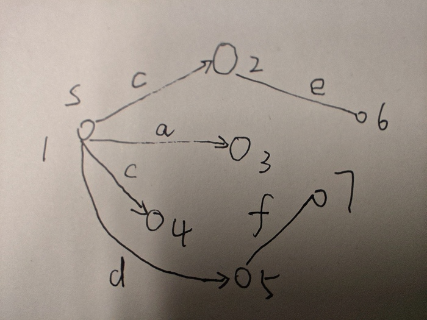

# 临时项目管理

这个文件中列出的项目，每天过一遍。

每天应该先启动任务执行系统，如果任务列表为空，那么跳转到这里，收集当天要执行的任务。

将任务管理系统作为一个基本的项目，每周至少整理一次。

每个项目都尽量遵循 复习（随机检测 qa） -> 学习 -> 调研 的步骤，不一定按这个顺序，但这三项起码要有。

有关“学习”：

1. 这里的学习是一个专有概念，其行为包括但不限于，阅读学习材料，做实验验证学习资料上的内容，做实验验证自己的猜想，记笔记，写一个新的 qa，完成任务列表上的任务

目前遇到的最大问题就是，有些问题不清楚能否解决，不清楚靠什么解决，只有在尝试解决的时候才会遇到很多新问题，并不断用已有知识去解决新问题。这样解决问题的思路就像一个无底洞，无法预知解决的时间，只能靠不断往其中投入时间。这类问题目前仍没有很好的解决方案。

不做任务执行系统，就没有顿挫的感觉，就不可能有高效率。只与项目池打交道，会产生无穷无尽的任务，从而无法分辨任务的边界，导致效率越来越低。

* 需要一个 graph 工具，建立不同的东西之间的连接

    stack 工具只适合任务的 trace

* 一个比较好的 explore 的想法是先从 amazon 上搜索书籍，然后在 zlib 或 libgen 上下载

* 每天的与任务相关的 feedback 要整理到临时项目管理里

    显然项目管理系统需要每天更新，因为任务执行系统会改变项目管理系统中的内容

    而且项目管理系统必须是当天结束时更新，这样才能不对第二天收集任务清单造成影响

    可以先存放到 cache 中，每三天整理一次

* log 不应该与 task 放在同一个文件里，翻来翻去太费时间

## cached

* [v] C 语言允许`char**`隐式转换成`const char**`吗？

* 应该对个人系统建立一个项目进行复习

	每次随机选择一个文件，跳转到随机一行，往下读 20 mins

* 在调研时，可以将笔记分成几个部分

	* 猜测（或者假设）

		给出自己的猜测，不需要验证

	* 疑问

		提出的问题

	* 验证

		对猜测的验证

	* 已经可以确定的笔记

		经过验证的猜测或假设，需要背会。

* 线下的思考很有可能是低工作量向高工作量突破的关键

    虽然使用任务管理系统可以达到很高的工作效率，但是一天的工作量并不是很大。

    猜测主要原因是浪费了很多的可利用时间，比如吃饭，走路，挤地铁等等。如果把这些时间拿来思考 cached questions，那么就有可能大量地提高工作量。

* [p] 调研分布式计算，MPI，grpc

	dependency:

	1. [ ] 重装系统，安装 virtual box

	1. [ ] 创建一些虚拟机

* 是否该引入每周的计划预期？

    目前只完成了每天的计划列表，但是每周完成的任务量太少。

* 应该建立一个 reference resources 目录，把所有的引用资源都放到这里

    如果每个目录下都是从`ref_0`编号，移动笔记时就会混乱。

    如果统一管理 reference，就不会出现这个问题。

    可以从`ref_0`一直编号到`ref_100`，随着 ref 不断被处理，再删掉`ref_0`重新开始。

    每次删除的时候，可以在 documents 里用`grep`搜索`ref_0`保证没有被引用的地方。

* 无序列表（cache）的弱排序

    将已经完成的任务放到列表的最上面，比较重要的任务紧接着放到已经完成的任务的下面。

    这样无序列表会有一种“滚动”的效果，旧的 cache 慢慢消失，新的 cache 不断出现。

* 为了实现短 item 的原则，不要把长代码放到项目管理或任务列表里

    应该额外创建一个文件，然后在任务列表或项目管理里引用这个文件。

* 创建 qa 一定是从笔记里直接复制的，不要从头开始写

* 冒泡

    对于 cached 的想法、任务、问题，哪个更重要，更需要优先解决？

    每次向任务列表合并新的 cache 时，如果出现了重复的条目，可以将这个条目在 cache 中上移，表示需要优先处理。这个过程称为冒泡。

    通过不断冒泡，就可以以一种贪心的算法复杂度，对任务的重要性做出排序。

    为什么要这样？因为在 md 文件中，anchor 只能定位到标题，离标题越近的肯定越先被处理。如果我们把重要的都放在离 anchor 最近的地方，那么每次优先处理的一定都是重要的。

    使用 bookmark 确实也可以做到快速跳转，但是 bookmark 只能作为一种临时的手段，因为它会破坏顺序结构。

* cache 是缓存各种混沌内容的地方，其中包含有一些 questions

    另外再创建一个 cached questions，作为一个项目，将一些问题从 cache 中拿出来，汇集到一起。

    每天走路，发呆的时候，可以想一想这些问题，看看有没有灵感，给出一个初步的方案。

* 用`[o]`表示任务完成了一半，还正在进行

    用`[P]`表示任务进入暂停 pending 状态，需要行凶执行依赖任务，再执行当前任务。

* 每天结束的时候要列出来一个明天改进什么地方

* 调研 MLIR, IREE

* 如果以后在执行任务时遇到很多未知的问题，需要及时停止，分解任务。

    保证任务系统的正常运行才是效率最高的最优解。

* cacHed task

    cmake 环境变量的用法

* 暴露的接口越多，代码越底层，可组合的方式就越多，功能越强大，编程越繁琐难用

    可见代码量也是评价一个库是否好用的参考标准

    反过来想，如果要实现一个功能，拆分了代码后，并不能增加可组合的方式，那么它就一定是需要优化的。

    比如 vulkan，虽然比 opengl 繁琐，但是完全支持异步，多线程，这就是拆分功能的代价。

* 对于黑洞任务，应该用时间去限制

    比如只执行 30 分钟，然后整理一下已经得到的信息，解决的问题，尝试对未来的进度进行估计。

    这样的过程应该被称为采样。

* 低频（主能量）信息对应的是直觉，高频（低能量）信息对应的是强推理

* 应该三天整理一次 log

    五天整理一次 log 会花将近一个小时

* 临时项目管理中的项目不应该超过 7 个, 不然就管理不过来了

* 每天离开工作区之前应该把 task 中的 feedback 整合到临时项目管理中

* 深度学习和数学最本质的区别是，深度学习只告诉你他的方法为什么行，不告诉你别人的方法为什么不行，而数学会同时告诉你这两者

* 可以规定一下，如果 2 天（或者 3 天）都能通过某个 domain 的 qa，那么就可以申请增加新的 qa。

* 为什么`g++ -g main.cpp -lvulkan -lglfw -o main`可以通过编译，`g++ -g -lvulkan -lglfw main.cpp -o main`就不行？

* 顺着笔记找 qa 效率并不高，更好的做法是随机在笔记的后面部分找一个问题，然后写到 qa 里，再倒过来找 qa 的 dependency.

* note 的每个 item 也尽量控制得短一些，类似代码的函数长度

* 进度的 sync

    如果一个项目长时间不合理发展，就会出现调研、 qa 和笔记不匹配的情况。这种情况下，需要对进度进行 sync，确认下面几个问题：

    1. 如果无法从学习资料中总结出新的笔记，那么认为学习和笔记的 sync 完成

    1. 如果无法再从笔记中找到一个新的 qa，那么认为 qa 和笔记的 sync 完成

    1. qa 里不能有 empty

    1. test, qa 文件夹 clean

    显然，项目进度的 sync 不应该出现在项目管理里，而应该由任务执行系统负责。

* 以后再做 c++ 的 qa，要么写一点点语法，要么就是做题

* 找一个 c++ 学习资料，系统学一下比较好

* 学习资源的调研主要用于完成下面几件事情

    1. 发现学习资源里，是否有需要做实验验证的地方，是否可以用实验验证他说的，是否有可以用实验澄清的模糊不清的表达

    2. 语言表达是否有歧义

    3. 未完待续

* 其实与 cache 对应的是工作区（working area），而工作区的整洁是 stack　的要求，不然各种回退操作都会混乱，没有办法快速定位到想要的资源

* 其实调研也是一种是 cache，是一种广度优先搜索，它安排了必须要回答的问题，优化了任务列表的结构，整合了小范围内的信息，防止有歧义在前，回答在后的情况发生

    调研不做实验，不使用实验对猜想做验证

* 需要一个指标来评价当天有多少时间是被任务系统接管的，就叫它接管率好了

    接管率从一定程度止反映了专心程度

## cached questions

* 思考 qa 的 dependency 机制

    dependency:

    1. 需要先拿到每个 unit 对应的索引号

        1. 需要先学会用 flex 做词法分析

            自己用代码写状态机去解析文件格式太累了，如果用 flex 的话可以大大提高效率。
    
    自动化的 dep 检测或许是不需要的。只要能记录就可以了，然后去手动搜索。

* 如果遇到的知识是条目式的，没有理解难度，但是数量比较大，是否该将其列入到记忆任务中？还是说调研时先跳过？

* [思考] 无论是 qa 还是 note，除了添加内容，更需要优化。这个优化该如何进行？

    如果只添加内容，不优化内容，那么东西越来越多，而且组织混乱。

    目前正在进行的一个优化是将按时间顺序写下的笔记，重新整理成按结构存储的数据。

## qa

cached:

* opengl add qa: 请使用 VBO 画一个 cube。

* opengl add qa: 请使用 shader 画一个彩色的 cube，并使之旋转。

* 在做检测时，写出 unit 出自哪里

* 一个 qa 文件里所有的 unit 平分 1

    然后每次遇到熟悉的 unit，可以让这个 unit 的权重减少 n% (暂定 10%)，然后重新分配所有权重，总和仍然是 1

* 需要给每个 unit 设置一个比重，在抽取随机数时按比重抽取

    感觉比较熟悉的，之前重复出现过的 unit，可以把比重设置得低一点

* cmake qa:

    修改`使用 cmake 根据下面的代码编译出`libhmath.so`库，然后编译出可执行文件。`的`[u_0]`。

    增加`mymath.h`和`mymath.cpp`相关内容。

目前的 qa 项目： vulkan, c++, vim, cmake, makefile

* 感觉 bash, makefile, cmake, sed, awk, vim 这几个都是挺重要的，把 qa 加上去吧，每天练习

* qa 的每个 unit 设计不应过于复杂。如果实际检测时间超过 30 mins，那么需要拆开。

    这里的拆开指的是写成 dependency 的形式，如果 dependency 之间做过，那么直接复杂 dep 的结果，从而减少当前 unit 的 exam 时间。

* 把 vim 加入到每日 qa 中

Tasks:

* [v] 使用`./main --update-idx <qa_file>`更新所有 unit 的 idx 

* [v] 使用`./main --generate-id`根据当前时间创建一个新的哈希值

* [v] 写随机检测的 dep 功能

* [ ] 修复`--list`的 bug。

    在找到`[u_0]`后，只要找到下一个`[xxx]`模式就可以了，`[u_0]`的内容为`[u_0]`往后，`[xxx]`往前。

    dep:

    * [v] 正则表达式

* [ ] 使用`./main --id-to-idx <id> <qa_file>`找到指定哈希值的索引

* 在 vim 中根据正则表达式搜索指定索引所在的位置 

## cached URLs

* cache tabs 彻底结束，工作区回归整洁。

    接下来该消化 cached urls 了。

tasks:

* [v] 处理一条 url

* [ ] 处理一条 url

## 虚拟化 virtualization

tasks:

* [v] 调研当前组里虚拟化方案，给出已知信息

* [ ] 调研代码仓库，给出架构图

## 编译器 Compiler

**cache**

* $\bold{edge}(s, c)$ 的解释

	$s$是集合中的一个元素，或者说是状态机有向图中的一个节点。

	$c$是一条边对应的字母，或者条件。

	$\bold{edge}(s, c)$指的是从状态$s$沿着标有$c$的边可到达的所有 NFA 节点的集合。

	$\bold{edge}(s, c)$是**节点的集合**。

	example:

	<div style='text-align:center'>
	
	</div>

	在上图中，$\bold{edge}(1, c) = \{2, 4\}$

* $\bold{closure}(S)$的解释

	对于状态集合$S$，$\bold{closure}(S)$是满足如下条件的最小集合$T$：

	$T = S\cup\left( \bigcup\limits_{s \in T} \bold{edge}(s, \epsilon) \right)$

	其实这个表示的就是从$S$出发，能通过空字符串条件达到的所有状态。

	注意，这里对$T$的定义使用了递归。我们从$S$出发，经过$\epsilon$边，到达一些状态，再从这些状态出发，再经过$\epsilon$边，到达一些新的状态，这样不断迭代下去，直到算法停止。这个递归挺新颖的。

	使用伪代码描述上面的公式，就是

	$\begin{aligned}
	&T \leftarrow S \\
	&\bold{repeat}\ T' \leftarrow T \\
	&\hphantom{asdf} T \leftarrow T' \cup \left(\bigcup_{s \in T'} \bold{edge}(s, \epsilon) \right) \\
	&\bold{until}\ T = T'
	\end{aligned}$

* lex/flex hello world program

	`count_num.lex`:

	```lex
	%{
	int digit_count = 0;
	%}

	%%
	[0-9]+ {digit_count++;}
	. {}
	\n {return 0;}
	%%

	int yywrap(){}

	int main()
	{
		yylex();
		printf("total %d numbers.\n", digit_count);
		return 0;
	}
	```

	使用 lex/flex 程序处理：

	```bash
	flex count_num.lex
	```

	此时会生成一个`lex.yy.c`文件。

	然后再调用`gcc`编译器：

	```bash
	gcc lex.yy.c -o count_num
	```

	执行：

	```
	./count_num
	```

	此时会进入 stdin 模式等待输入。

	input:

	```
	123 345 hehe #@!
	```

	按 enter 键后，输出为

	```
	total 2 numbers.
	```

	flex tutorial: <https://www.geeksforgeeks.org/flex-fast-lexical-analyzer-generator/>

	flex project site: <https://github.com/westes/flex>

	unread:
	
	1. <https://begriffs.com/posts/2021-11-28-practical-parsing.html>

	2. <https://web.mit.edu/gnu/doc/html/flex_1.html>

* compiler 最长匹配

    在最长匹配时，需要保存三个状态位置，一个是本次匹配的起始位置，一个是上次的终态位置，还有一个是当前位置。

    如果下一个位置找不到有限状态机的出口边，那么就认为此次匹配结束，上次终态的位置为最终匹配结果，并以此更新起始位置。

    如果下一个位置找到了状态机对应的出口边，并且没有终态，那么继续往后找；如果找到了终态，那么更新上次终态的位置。

Resources:

* 《现代编译原理C语言描述》

* Compilers Principles Techniques and Tools (2nd Edition) 

* 120 Introducing bison.pdf

    介绍了 bison 程序的简单用法，并给出了一个 example。

    但是缺少很多编译的基础知识，这部分需要去看书才行。

调研 bision

Tasks:

* [v] compiler: 理解“识别最长的匹配”，解释图 2-5 30 mins

    feedback:

    1. [v] 感觉可以继续往后调研了，没有什么特别疑惑的问题了

* [v] 调研 nfa, nfa 转 dfa，lex

* [v] 调研第三章 语法分析

    current progress: P23 第三章 语法分析 3.1 上下文无关法

* [ ] 整理正则表达式的知识点，解释书上给出的 example

* [ ] 2.1 efg 小题

* [ ] 2.2 bc 小题

* [v] 将正则表达式转换成 nfa，解释图 2-6, 2-7

* [ ] [学习] 2.4.2 将 nfa 转换为 dfa

* [v] 调研

* [ ] 解释方法 3 - 1 和推导 3 － 1，重点是终结符和非终结符的不同

* [ ] 解释名词 3.1.3 二义性文法

* [ ] 解释文件结束符

* [ ] 解释 3.2 预测分析和递归下降

* [ ] 调研，3.2.2 构造一个预测分析器

## Vulkan 学习 [0]

**cache**:

* 需要继续看书，弄明白 command buffer 和 subpass 的关系。

* `VkSubmitInfo`中`pWaitDstStageMask`是什么意思？这个不填的话，validation layer 会报错。

* vulkan 使用 uniform buffer 改变三角形的颜色 final code

    见`ref_1`。

* cached question: 尝试用这段代码拿 vulkan 的 physical device 的 queue family properties，

    ```cpp
    for (int i = 0; i < phy_dev_cnt; ++i)
    {
        vkGetPhysicalDeviceQueueFamilyProperties(phy_devs[i], &queue_family_cnt, nullptr);
        queue_familys.resize(queue_family_cnt);
        vkGetPhysicalDeviceQueueFamilyProperties(phy_devs[i], &queue_family_cnt, queue_familys.data());
        printf("%d-th physical device has %d queue families:\n", i, queue_family_cnt);
        for (int j = 0; j < queue_family_cnt; ++j)
        {
            printf("    %d: queue count: %d, queue falgs: %d, time stamp: %d\n", j, queue_familys[j].queueCount,
                queue_familys[j].queueCount, queue_familys[j].timestampValidBits);
        }
    }
    ```

    输出：

    ```
    0-th physical device has 3 queue families:
        0: queue count: 1, queue falgs: 1, time stamp: 64
        1: queue count: 4, queue falgs: 4, time stamp: 64
        2: queue count: 1, queue falgs: 1, time stamp: 64
    ```

    为什么 0 号 queue family 和 2 号 queue family 是一模一样的？

* `vkGetDeviceQueue`指定的 queue 有数量总数吗？

* 为什么<https://github.com/Overv/VulkanTutorial/blob/main/code/22_descriptor_set_layout.cpp>没有用到 layout pool ?也没有用到 allocate，直接就是 create，为什么？

参考资料：

1. pdf 电子书《vulkan_tutorial_en》

2. 配套代码 <https://github.com/Overv/VulkanTutorial/blob/main/code/22_descriptor_set_layout.cpp>

3. pdf 电子书 vulkan programming guide

依赖项目：

1. 英语单词

目前主要在看 descriptor set，先能独立画出一个彩色三角形。

然后看一下 uniform buffer 相关的，让三角形动起来。

再看一看 model loading，学会加载模型。

接下来看 compute shader 相关的东西。

添加一个 resource，官方的 vulkan programming guide。

任务列表：

* [v] 调研`VkPipelineMultisampleStateCreateInfo`的作用

* [v] 调研`VkSampleCountFlagBits`中每个位的作用。

* [v] 调研`VkAttachmentLoadOp`和`VkAttachmentStoreOp`的作用。

* [v] 调研`VkSubpassDescription`中`pInputAttachments`的作用。

* [v] 添加 vulkan 的 qa： 给出画一个三角形的流程步骤

* [ ] 学会传入一张图片作为 framebuffer resource。

* [ ] vulkan pipeline synchronization

* [ ] 调研 vulkan programming guide

* vulkan programming guide

    侧重一下 renderpass 和 subpass 的关系，barrier 对 image layout 的转换，以及 copy image from buffer

    sparse memory 是干嘛用的，看书上的意思，是可以让资源对象在运行时重新绑定到一块不同的内存上？

    1. P47 ~ P52

        feedback:

        1. allocator 明显目前用不到，而且也没有做实验的时间，也不能抄书做 note，因此这部分就应该跳过。

            那么这样的内容明显就不是一次能消化完的，只能做个大概的总结，需要下次任务再看一遍。

        2. 找一个 allocator 的 example

    2. P52 ~ P58
    3. P58 ~ P71
    4. P71 ~ P77
    5. P77 ~ P78
    6. chapter 3 and later
    7. moving data

## OpenCL 学习 [1]

cached:

* 如何在 kernel 中创建一个 float3 向量？

* opencl 的笔记缺少很多基础东西，需要慢慢补全

* 如果有多个`xxx.cl`程序组成一个大的项目，host 又该如何编译？

参考资料：

1. pdf 电子书《pdfcoffee.com_opencl-programming-guidepdf-pdf-free》

2. 其他网上的资料

基本的东西会了，剩下的系统地看一看吧，查漏补缺。

重点看一看内置函数。

任务列表：

* [v] 继续调研第 5 章

    current progress: P190 Synchronization Functions

* [o] 写一个中值滤波算子，用前面学到的内置函数

    dependency:

    1. [v] 调研中值滤波的数学算法

        feedback:

        1. 下载一本数字图像处理的书比较好，网上找的资料太碎片了

        2. 单通道图像求中值的代码可以参考`ref_0`

            下次可以直接试试单张图片。

    2. [o] 使用 cpu 实现中值滤波

        目前只写完了读取图片。见`ref_3`。

* [v] 重新写一下 simple opencl。直接用 global 版本，`const char *`, `char *`都转换成`string`。

* [v] 继续调研第 5 章

    current progress: P195 Atomic Functions

* [v] opencl 调研第 5 章

    current progress: P199 Miscellaneous Vector Functions

* [ ] 改进一下 simple opencl，`add_buf()`同时申请显存和内存。

* [ ] 调研第 5 章 current progress: P201 Image Read and Write Functions

## 算法 algorithms 与 leetcode

cache:

* 做一道 leetcode 题差不多要一个小时

* 图论里，如果已知一个 node，需要知道和这个 node 相连的边的情况，那么用链表是最优选择。

    如果已知两个 node，需要知道这两个 node 之间的边的情况，那么用矩阵是最优选择。

    如果既需要知道某个 node 有哪些边，又需要快速查询两个 node 之间是否相连，可以同时使用这两种结构。

tasks:

* [v] 写一下冒泡排序，归并排序

* [v] 做图论题

    <https://leetcode.cn/problems/reorder-routes-to-make-all-paths-lead-to-the-city-zero/?envType=study-plan-v2&envId=graph-theory>

* [v] 做一道图论题

* [v] 调研算法 resource

* [ ] 调研《fundamentals of computer algorithms》

## 计算机图形学 学习 [2]

cache:

* 计算机图形学的任务列表太长了，有时间了整理一下

参考资料：

1. 虎书《Fundamentals-of-Computer-Graphics-Fourth-Edition》

2. Games 101

3. 其他网上的资料

依赖项目：

1. 英语单词

数学基础目前还算够用，每天记录一点点公式就可以了，一个概念，一段话，一个公式，不需要学习太多。

目前已经看完了第四章 ray tracing，并做了代码的实现。现在想先看一看光栅化的 pipeline，自己去尝试光栅化一条直线，一个三角形。

后续的安排是调研一下第 13 章，慢慢学一些折射，透明的效果。

目前未解决的问题：采样与 gamma 校正。

任务列表：

* [v] 调研图形学

    feedback:

    1. 再找一本图形学的书，看看辐射度量学是怎么讲的

* [v] 找一本新的有关计算机图形学的书

* [v] 调研 Computer Graphics Principles and Practice

	feedback:

	1. 感觉像是部字典书，有空的话可以翻翻

		它的光追部分都排到很后面了，等学完不知道啥时候了。

* [ ] P18 ~ P20 三角形定义与常用的三角函数性质

	看了反三角函数，其中最有用的是 atan2。实际上也确实是这样。不过 atan2 的两个参数是 (y, x) 还是 (x, y)？

* P22 2.4.2 Cartesian Coordinates of a Vector

* P24 2.4.4 Cross Product

* P30 2.5 Curves and Surfaces

* 如何以一组向量为基，表示任意一个向量？

* 光栅化 pipeline 部分

    1. [v] P161 8.1.1 line drawing，用代码实现一下

    1. [ ] 直线的光栅化还有一个用增量的方式判断，简单了解下记个笔记就行，不用实现

    1. P164 8.1.2 Triangle Rasterization 尝试学习，理解

1. 光追渲染部分

    1. [v] 调研折射效果

    1. [ ] P324 ~ P327 13.1 折射，尝试实现一个透明球体

        已经实现了求折射射线，接下来尝试求反射光强度$R(\theta)$。

        对于一个透明物体，尝试找到出射点。

        使用 ri ratio 来判断是否进入或离开物体可行吗？如果摄像机在水中，这个方法是否会失效？

        如果这种方法失效，是否有更好的解决方案？

    1. P327 ~ P328 13.2 实例化，更方便地采样

        这一段及后面的慢慢看

    1. P328 ~ P329 13.3 使用布尔操作构造新物体

    1. P329 13.4 distribution ray tracing，目前还没仔细调研

1. 辐射度量学 Light 章节

    1. [ ] 重新从头整理一遍辐射度量学的公式和笔记 60mins

        要求书上任意一个地方都可以找到对应的笔记。

        要求可以解释**笔记中**任意一个字母的含义，公式的推导。

        已经整理完了 irradiance 相关的东西，接下来整理 radiance 相关的内容。在笔记里想把 radiance 和$L_f$调换一下位置，同时弄清楚 radiance 的具体含义。

        任务中止原因：达到了最大知识容纳限度。

1. Color 章节

    这一章讲怎么把辐射转换成人眼可见的颜色。

## 解析几何 学习

参考资料：

1. 《Gordon Fuller - Analytic Geometry-ADDISON-WESLEY @ (1954)》

依赖项目：

1. 英语单词

希望能学到些有关参数方程的知识，其他的知识就当作查漏补缺。

任务列表：

1. [ ] 调研全书，列出几个感兴趣的部分，继续调研

## 基于路径追踪的全局光照

参考资料：

1. firefox 上打开的 tab

1. Games101 的 slides

    <https://sites.cs.ucsb.edu/~lingqi/teaching/games101.html>

1. 别人基于 games101 的一个 c++ 实现

    <https://github.com/zhiwei-c/Monte-Carlo-Path-Tracing/tree/main>

1. 路径追踪的知乎专栏

    <https://zhuanlan.zhihu.com/p/475547095>

不需要深度调研，简单跑跑 demo，研究下代码就可以了。

依赖项目：

1. 计算机图形学

    必须熟悉完计算机图形学 Light 和 Color 两个章节后，再来做这个项目。

任务列表：

1. 调研 Global Illumination project，尝试照着他的思路，实现一个差不多的渲染器

1. 实现 refraction 效果

    1. 实现 reflectance

    1. 计算折射衰减

1. [v] 屏蔽 refraction 效果，先实现一个 path tracing

1. [v] 创建一个房间场景，让光在房间中弹射

1. [v] 对接场景文件

1. 将任务拆分并并行化，使用 opencl 加速

1. 实现更多的效果，比如贴图采样，抗锯齿

1. 完成 blender, maya 插件开发

    1. [ ] [调研] 调研 blender 插件开发的 sdk，看看能不能找到类似场景文件的东西或与渲染器输入输出相关的资料。

## 英语单词

参考资料：

1. `english_words.md`

这个项目作为被依赖的项目而启动。

## 随机检测

现在主要需要实现 new, prev rand 的功能。等这两个实现后，需要实现 dependency 的功能，根据一个条目，可以查到它的依赖条目，根据依赖条目。

任务列表：

1. [v] 实现功能：随机打开一个项目，随机进行检测

2. 根据指定条目，查找到它的依赖条目。

    每个条目

## 调研 kmd 在 container 中运行的可行性

1. 使用`sed`替换整行，替换的字符串中，有`$()`命令得到的系统信息

1. 在 44 机器上搭建 kmd 编译环境，成功编译出 xdx 的 kmd

1. 在 server 上拉取 umd 的代码，使用上海镜像

1. 在 44 机器上搭建 umd 的编译环境，成功编译出 umd

1. 调研 kmd 代码，查看其构成，尝试找到负责与 pci 交互的那一部分

1. 调研 modprobe 和 depmod 的作用，并写代码实践

## 调研 meson, ninja

## 分布式计算调研

## 微积分

## C/C++

cache:

主要任务是学完 modern c++，即 c++23 及之前的内容，找一些开源库看一看。

1. 指针的指针，区分指针的指针所指的内容不能被修改，指针所指的内容不能被修改（指针的指针本身不能被修改），指针本身不能被修改

    分别如何 new, malloc

* modern c++

    <https://github.com/federico-busato/Modern-CPP-Programming>

* 学一下 c++ 的 std format

1. 学习一下 c++ make uniquue

    可以自定义一个类型，然后使用 make unique 创建一个固定长度的数组。

    ```cpp
    // c++14
    auto constantContainer = std::make_unique<YourType []> ( size );

    // c++11
    std::unique_ptr<YourType[]> constantContainer {new YourType[ size ]};


    // Access
    constantContainer[ i ]
    ```

    有空了研究一下这段代码，分析一下利弊。

## Vim

本项目的目标是学完 vim，可以使用 vim 代替 vscode 进行日常的代码开发和调试，以及文本文档的编辑。

* vim 中的 redo 是哪个？

## 正则表达式

## 数学 Mathematics

resources:

1. 《高等数学》同济大学应用数学系

tasks:

* [ ] 调研第八章 多元函数微分法及其应用

## 其他

* c++ 版本的 opencl 入门

    <https://objectcomputing.com/resources/publications/sett/july-2011-gpu-computing-with-opencl>

* libeigen

    other linger algebra libraries: <https://stackoverflow.com/questions/1380371/what-are-the-most-widely-used-c-vector-matrix-math-linear-algebra-libraries-a>

    以 libeigen 为主，其他的库对比着学下。

    * numcpp

        矩阵运算库

        <https://github.com/dpilger26/NumCpp>

        <https://zhuanlan.zhihu.com/p/341485401>

